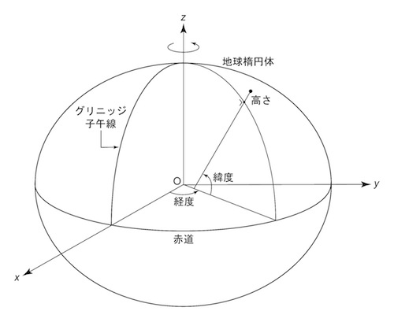
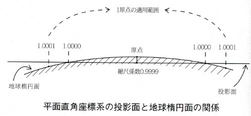

## 位置の表現の仕方
前節で情報の多くは位置と結びついていることを確認しましたが、その位置を示すにはどのような方法があるでしょうか。普段、私達が場所を伝える時には、地名や住所、施設名などを使います。また、最近ではスマホにGPSが付いており、現在地を緯度経度の値で知ることができます。その他にも、一般的にはあまり使用することはありませんが、地図上の位置を投影座標と呼ばれるX,Yの座標値で示す方法もあります。
 
 - 地名「新宿」
 - 住所「東京都新宿区霞ヶ丘町３−１」
 - 施設名「明治神宮野球場」
 - 緯度経度「北緯35度40分28.46秒、東経139度43分1.69秒」
 - 投影座標 「平面直角座標IX系 X:22053268 Y:-10483642」

この中でも「緯度経度」と「投影座標」は、地図情報を可視化するにあたって、とても重要な前提知識となるため、もう少し詳しく説明したいと思います。

###緯度経度
緯度経度の「北緯35度40分28.46秒、東経139度43分1.69秒」という値は、何の値でしょうか。これは図のように、地球を楕円の物体とみなし、それをXYZの座標空間に置いたとき、座標の原点からその地点までの角度を表しています。X軸からの角度αを緯度、Y軸からの角度βを経度と呼びます。

(イメージ図　参照：http://www.geod.jpn.org/web-text/part2/2-1/2-1_figures/Fig5.jpg)

このようにして緯度、経度を決めるとき、地球をどのような形の楕円とみなすか？その楕円を座標空間上のどこに置くか？の情報が必要です。それを定めたものを***測地系***と言います。（Column参照）

~~日本では現在、長半径xxxxm、扁平率     のGRS80と呼ばれる楕円体の重心が座標空間の原点に位置し、地球の回転軸がZ軸と重なりXY平面が赤道と一致する世界測地系と呼ばれる測地系を採用しています。(コラムへ移動？)~~

###投影座標
地球上の地物の距離や面積、方位などの位置情報を、紙の地図上で上手く表現するにはどうすればよいでしょうか？そのためには、楕円体である地球を平面上に投影する必要があります。その方法を***投影法***と呼び、光源の位置や投影面の形などの違いよってさまざまな種類が考案されています。

投影法によって平面上に投影された地物の位置は、その平面を基準とした座標によって示すことができます。それを投影座標と呼びます。

(イメージ図だけどちょっと違う 参照：http://www.jmc.or.jp/image/faq/m10.jpg)

~~ただし、同じ投影法を採用していても、投影する範囲や原点の場所によって、投影座標は異なります。~~

