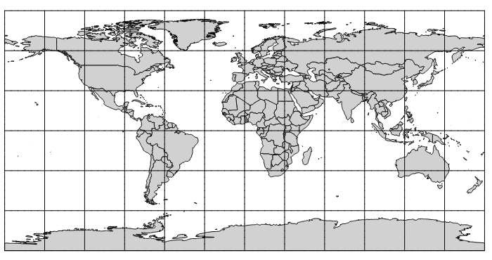
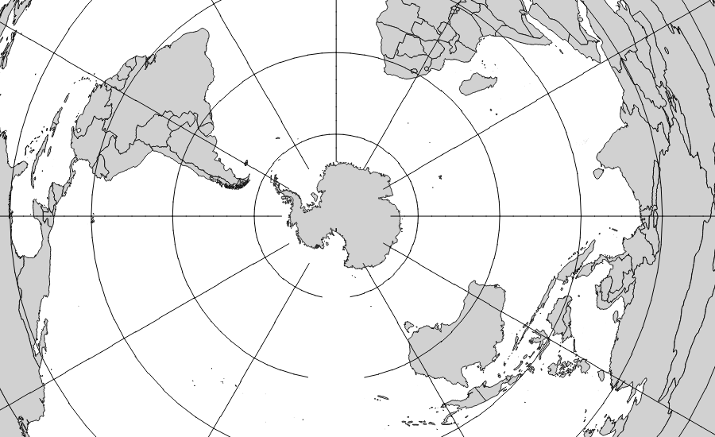
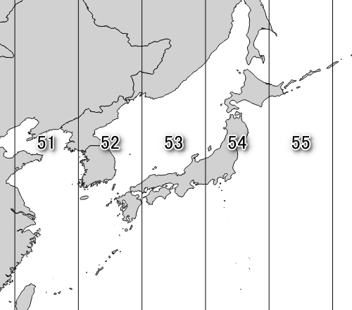

## さまざまな投影法 

### 世界地図
みなさんが一番目にしたことのある世界地図は、経線が平行に等間隔に、緯線が経線と直交するように描かれているものではないでしょうか。これはメルカトル図法で描画された地図になります。メルカトル図法は、地球に円筒をかぶせて、その円筒上に投影された図になります。特徴としては、地球上のある地点から引いた線分の角度が地図上で同じ角度で表せる(正角図法)、高緯度になるにつれて面積、距離が大きく出てしまうことがあげられます。

.

こちらは南極を中心に描画した正距方位図法です。この投影法の場合、中心からの方位と距離を正しく表すことが出来ます。

.

正積図法のモルワイデ図法です。この投影法の場合、実際の面積比と地図上の面積比を正しく表すことが出来ます。

.

ここで紹介した投影法はほんの一部のものです。様々な投影法があり、それぞれ特徴があること、何を正確に表したいかにより選択する必要があることを覚えておきましょう。

### 日本国内で利用される投影法
日本の地図で採用されている投影法として、ガウス・クリューゲル図法があります。これは円筒形の平面で地球を包み投影させとる方法です。ガウス・クリューゲル図法で投影する際に、日本全国を19の地域に分割し、それを各投影範囲と投影原点にしたものを平面直角座標系と呼びます。分割は投影により歪みを一定以下に抑えるために行われます。主に1万分の1より大きい(拡大された)縮尺の地図で使用されており、19の地域の分割は以下の表のようになります。

|系番号|適用区域|
|------|--------|
|I|長崎県 鹿児島県のうち北方北緯32度南方北緯27度西方東経128度18分東方東経130度を境界線とする区域内（奄美群島は東経130度13分までを含む。)にあるすべての島、小島、環礁及び岩礁|
|II|福岡県　佐賀県　熊本県　大分県　宮崎県　鹿児島県（I系に規定する区域を除く。)|
|III|山口県　島根県　広島県|
|IV|香川県　愛媛県　徳島県　高知県|
|V|兵庫県　鳥取県　岡山県|
|VI|京都府　大阪府　福井県　滋賀県　三重県　奈良県 和歌山県|
|VII|石川県　富山県　岐阜県　愛知県|
|VIII|新潟県　長野県　山梨県　静岡県|
|IX|東京都（XIV系、XVIII系及びXIX系に規定する区域を除く。)　福島県　栃木県　茨城県　埼玉県 千葉県 群馬県　神奈川県|
|X|青森県　秋田県　山形県　岩手県　宮城県|
|XI|小樽市　函館市　伊達市　北斗市　北海道後志総合振興局の所管区域　北海道胆振総合振興局の所管区域のうち豊浦町、壮瞥町及び洞爺湖町　北海道渡島総合振興局の所管区域　北海道檜山振興局の所管区域|
|XII|北海道（XI系及びXIII系に規定する区域を除く。）|
|XIII|北見市　帯広市　釧路市　網走市　根室市　北海道オホーツク総合振興局の所管区域のうち美幌町、津別町、斜里町、清里町、小清水町、訓子府町、置戸町、佐呂間町及び大空町　北海道十勝総合振興局の所管区域　北海道釧路総合振興局の所管区域　北海道根室振興局の所管区域|
|XIV|東京都のうち北緯28度から南であり、かつ東経140度30分から東であり東経143度から西である区域|
|XV|沖縄県のうち東経126度から東であり、かつ東経130度から西である区域|
|XVI|沖縄県のうち東経126度から西である区域|
|XVII|沖縄県のうち東経130度から東である区域|
|XVIII|東京都のうち北緯28度から南であり、かつ東経140度30分から西である区域|
|XIX|東京都のうち北緯28度から南であり、かつ東経143度から東である区域|

また世界を60の地域に分割し、それを各投影範囲と投影原点にしたものをUTM（ユニバーサル横メルカトル図法）座標系と呼びます。平面直角座標系と同じく、投影による歪みを一定以下に抑えるために分割されています。1万分の1から20万分の1の地図で使用されており、Zone51からZone55が日本の範囲に入ってきます。

|ゾーン|適用区域|
|-----|--------|
|51|東経120-126度|
|52|東経126-132度|
|53|東経132-128度|
|54|東経138-144度|
|55|東経144-150度|

.