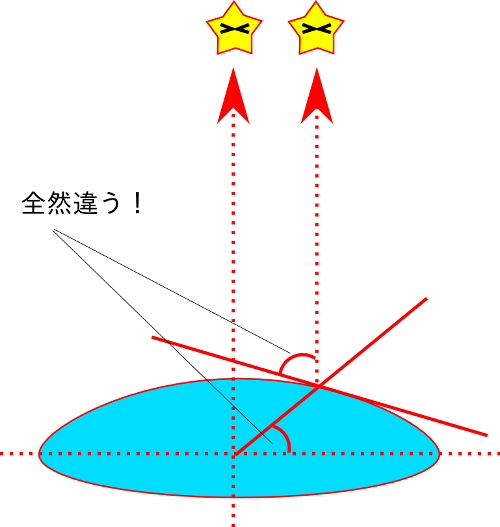

#　(Column) 同じ経度緯度でも位置が違う？-測地系の違い

前節では地球上での位置の表現の仕方として、緯度経度で表す場合と直交座標で表す場合があることについて説明しました。投影座標系ではそれぞれの投影法によって同じ場所でも座標値が異なるのはまあわかりますが、緯度経度まで異なるとはどういうことでしょうか。詳しい説明は測地学についての書籍に譲るとして、ここでは測地系の違いによって同一地点でも緯度経度が異なる原因を、少し違う視点から見てみましょう。

ある地点の緯度は、その地点から北極星を観測することでわかります。北極星は無限遠点にあるとみなせるので、緯度は北極星の仰角そのものであることが簡単な作図でわかります。江戸時代に作成された大日本沿海輿地全図はこの原理で作成されています。

ところで、これは地球が球体である場合の話です。実際の地球は赤道付近が少し膨らんでおり、なおかつ北極側が少し突き出た洋ナシ型になっています。これだと、北極星の仰角と緯度は必ずしも一致しません。

そこで、地球の形を回転楕円体（どら焼き型）で近似することにします（準拠楕円体と呼びます）。これなら北極星の仰角から緯度を求めることは、単純ではないものの何とか計算できます。あとはどのような楕円体で近似するかですが、これがいくつも種類があります。当然楕円体の形が異なると同じ仰角でも算出される緯度の値は違うものになります。これが同じ位置でも緯度が異なる原因です。

日本ではつい最近までベッセル楕円体と呼ばれる楕円体を準拠楕円体として採用していました。なおかつ、旧東京天文台跡を経緯度原点として正確な経緯度を求め、これを基準とした座標系を定めました。これは日本測地系と呼ばれ、2002年3月まで使用されていました。

さて、宇宙技術の進歩によってより精密な地球の形状が求められるのに伴って、より地球の形状に近い楕円体を用いた測地系が使用されるようになってきます。GPS（Global Positioning System）ではWGS1984という楕円体が用いられています。先述の通り、楕円体が異なると経緯度も異なるわけですから、日本測地系の経緯度とGPSで求められた経緯度には差が出てしまいます。さらに悪いことに、両者は原点の位置が異なっていました。GPSで用いられているWGS84測地系では、地球の重心を原点と定めていますが、日本測地系の原点は先述の通り旧東京天文台跡の日本経緯度原点を原点としていた結果、日本測地系のベッセル楕円体の中心位置が地球の重心と一致していませんでした。

そこで、日本でもより正確なGRS80楕円体を用いた測地系を定めてこのような状況に対応することにしました。これを日本測地系2000、または世界測地系と呼びます。GPSで用いられているWGS1984楕円体とGRS80楕円体では扁平率がわずかに異なりますが、陸域測量においてはほとんど差がありません。

なお、厳密には天文測量で得られる経緯度と、測地系に基づいて得られる経緯度とは、ジオイド等の関係もあって一致しません。ジオイドとは仮想的な海水面（等重力ポテンシャル面）のことで、重力分布によって凹凸があります。簡単に言うと、私たちは重力分布の偏りによって、楕円体面に対してまっすぐ立っていません。したがって、天文測量を行う場合でもジオイド面の歪みの分角度にずれが生じます。日本で用いられている測地系の座標値は、基本的には三角測量によって得られた座標を楕円体上に展開したものです。

測地系についてのより正確な説明は、測地学の専門書や国土地理院のウェブサイトをご覧ください。
