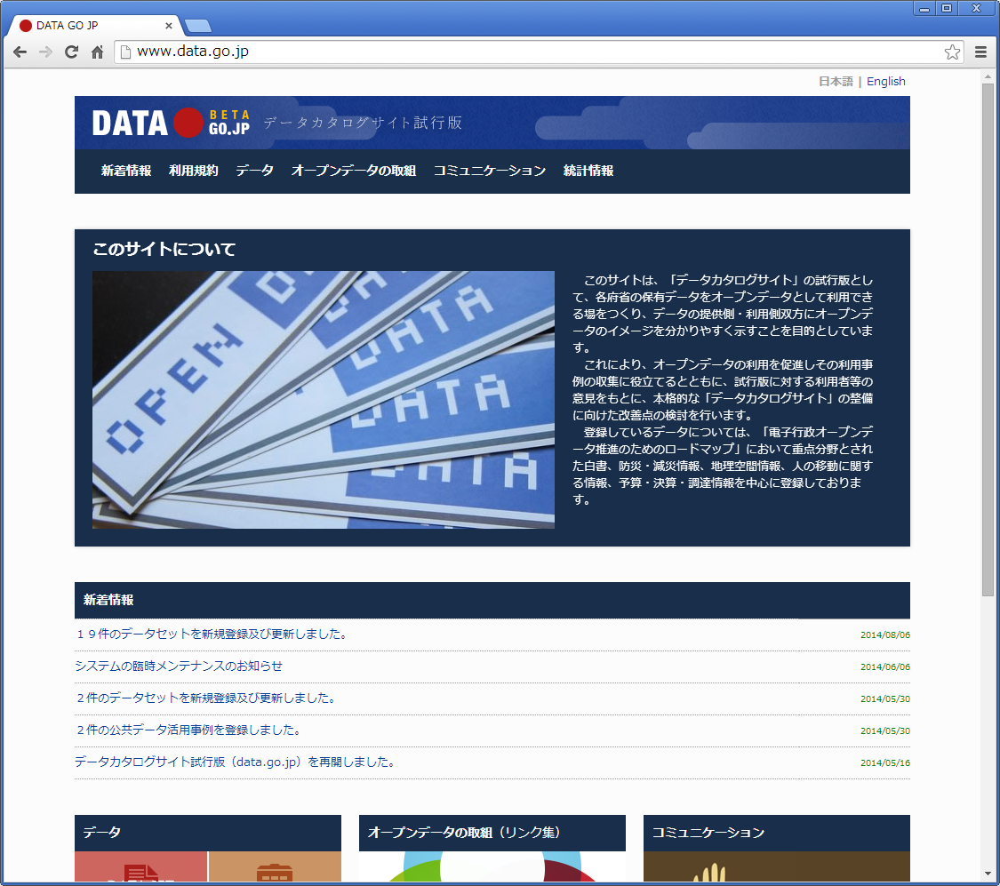
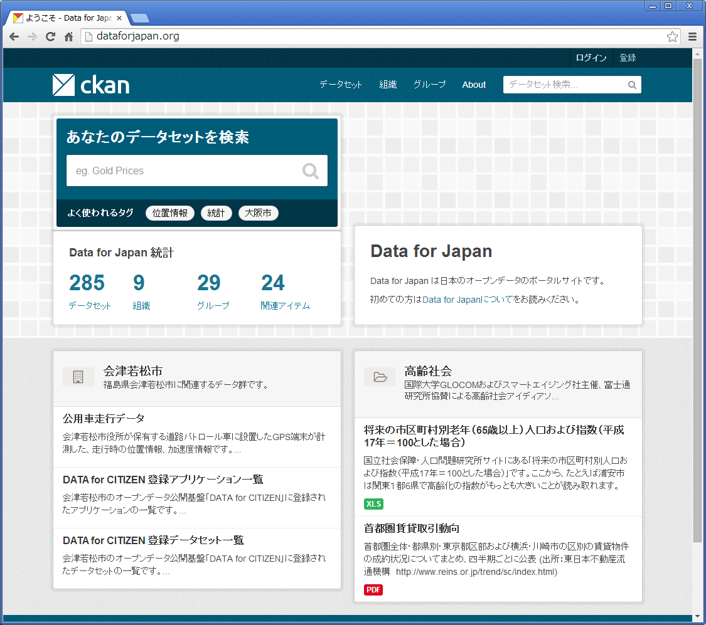
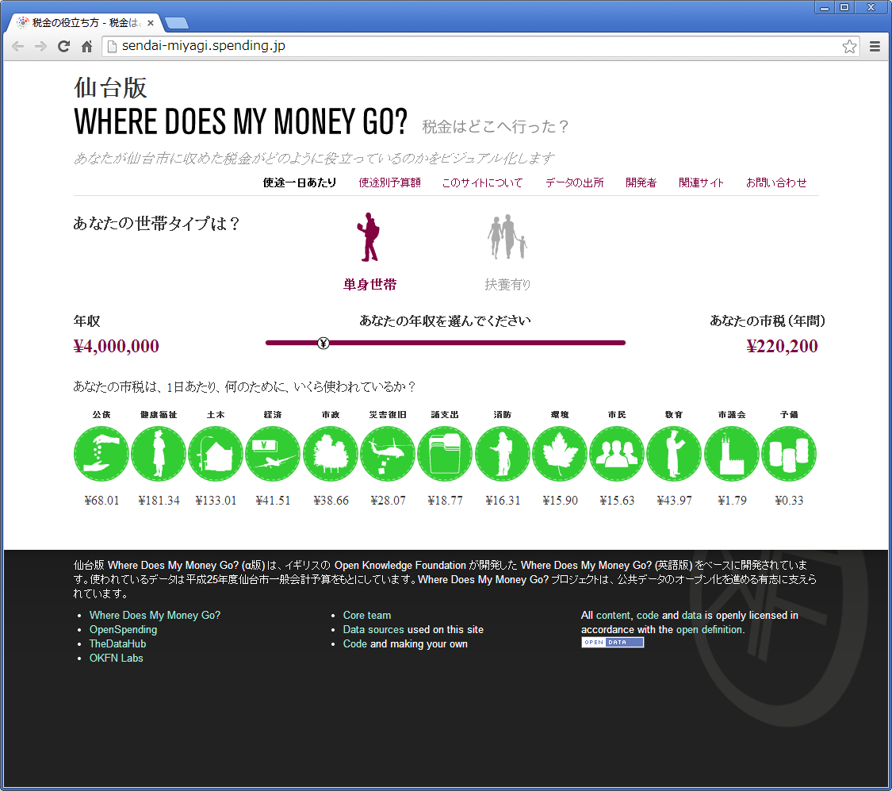
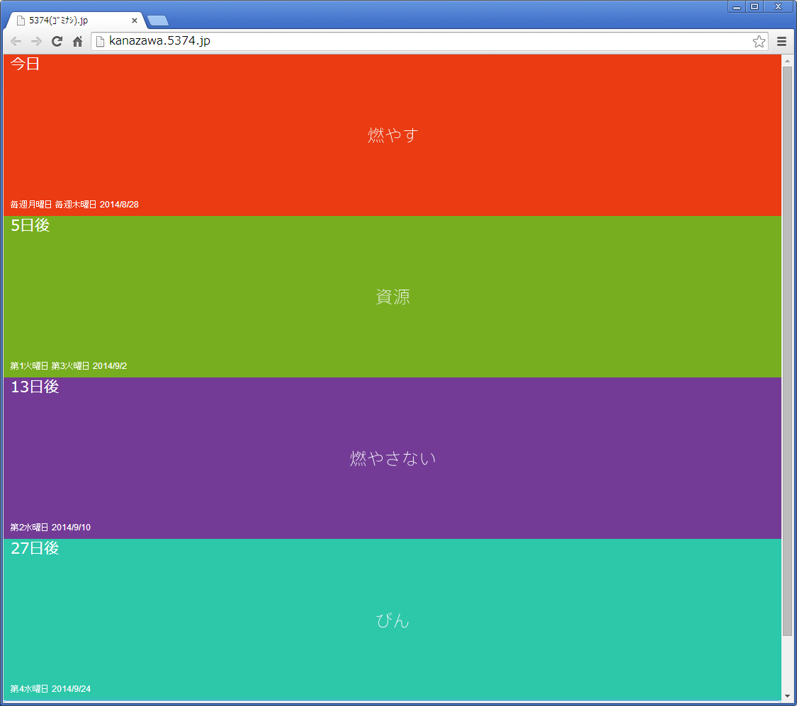

## オープンデータを巡る動き
オープンデータの定義である「自由に使えて再利用もでき、かつ誰でも再配布できるようなデータ」という概念自体は特に新しいものではありません。しかし、2009年頃から米国やEUにおいて、また日本国内においては2013年頃から、政府や地方自治体などの公的機関を中心にオープンデータを推進する動きが大変活発になってきました。その目的として、公的機関としての透明性の確保や公共サービスの向上ほか、民間によるデータ活用の促進と、それによる経済の活性化があげられています。もちろん地理空間情報も、このような中で重要な役割を担っています。そこでこの章では、オープンデータの背景を理解するため、国際的な動向、日本政府や地方自治体の取り組み、市民・民間での活用などの、オープンデータを巡る動きを見てみたいと思います。

### 国際的な動向
2009年に米国と英国において、行政情報をオープンにする取り組みとして、政府によるデータポータルサイトが開設されました。それ以降も欧州を中心とした国々でオープンデータの取り組みが進み、2013年6月には英国のロックアーンで開かれた主要8カ国首脳会議で「オープンデータ憲章」の合意がなされました。オープンデータ憲章では表◯の5つのオープンデータに関する原則が示されています。以後、各国の政府ではこの原則に従うべくオープンデータへの取り組みが一層活発になってきています。

*オープンデータに関する5つの原則*

1. 原則としてのオープンデータ - 政府のデータはすべて、原則として公開する
2. 質と量 - 高品質で十分なデータをタイムリーに提供する
3. 全ての者が利用できる - できるだけ多くのデータをオープンなフォーマットで公開する
4. ガバナンス改善のためのデータの公表 - データを利用し意思決定を改善できるように、データの収集方法や基準、公表プロセスを透明化する 
5. 技術革新のためのデータの公表 - データを利用した技術革新が進むように、機械判読可能な形で公開する

### 日本政府の取り組み
日本では「オープンデータ憲章」に従いアクションプランを策定しています。その中で、国の保有するデータ・セットの公開やポータルサイトの開設を順次進めていくこと、また各地で開催されるハッカソン等のイベントへ積極的に参加することなどがコミットメントされています。

このアクションプランの通り、2014年には、各府省が保有データをオープンデータとして活用する「データカタログサイト試行版」（http://www.data.go.jp）が開設され、現在も随時データが追加されています。　　　

### 地方自治体の取り組み
オープンデータは、地方自治体にとっても「行政の見える化」や、「住民が暮らしやすい街づくり」などを促進するものとして期待されています。そのため、各地方自治体によるデータ公開が進んでおり、それと同時にアイデアソンやハッカソンと呼ばれるイベントを開催し、データ利活用のアイデアも募っています。

地方自治体によるオープンデータは、各地方自治体のホームページの他、日本のオープンデータのハブを目指す「Data for Japan」(http://dataforjapan.org/)という有志によるポータルサイトからも検索可能となっています。

### 市民・民間での活用
オープンデータの活用は、これからの課題ですが、徐々に有益なウェブサービスやアプリなどが出始めています。例えば、公開されている市町村の会計予算のデータをもとに、自分が支払っている税金が何に使われているかを分かりやすく可視化する「税金はどこへ行った？」（http://spending.jp/）のようなホームページや、自分が住む地区で今日が何のゴミ回収日だったかが一目で分かる「5374.jp」(http://5374.jp/)などのウェブアプリがあります。

今後は、オープンデータの市民や民間での活用から、ビジネスへの広がりも期待されています。

