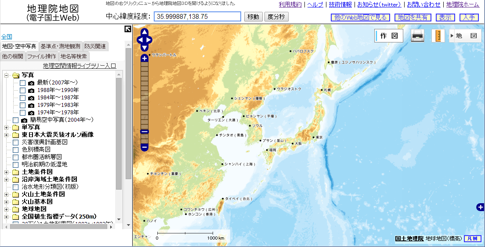

#オープンデータを使う
##オープンデータを探す

本書の目的は地理空間情報の可視化です。まずは基本となる地図のデータを探していきましょう。  
データを"探す"となると真っ先に思いつくのが、インターネットでの検索になるのはやむを得ませんよね？？試しに"地図データ"あたりで検索してみてください。地図会社から提供される様々なデータが表示されると思います。使いやすい形に加工して、独自の更新を加えて、または表現を工夫して、データが提供されています。もちろん本格的な用途や、必要となる種類のデータがそこでしか手に入らないのであれば、こういった有償で提供されているデータの使用も検討してみてください。検索結果をもう少し見てみましょう、国土地理院から提供されているデータも出てきましたか？  
馴染みの無い方もいるかもしれませんが、国土地理院はすべての測量の基本となる測量を行っている組織です。その測量成果は決められた利用手続きに従い、複製・使用することが出来ます。地図も測量成果に含まれることは覚えておきましょう。地図のデータといえば、まずは国土地理院から提供されているものを探すのが王道になります。国土地理院のデータ提供への動きはとても速く、また、利用者の利便性を考えた提供をしてくれています。　　
一例として、地理院地図(http://portal.cyberjapan.jp/)を覗いて見ましょう。とても多くの情報が提供されていることがわかります。国土地理院が提供している様々な地図や航空写真を拡大・縮小・スクロールしながら閲覧出来ますし、災害時には被災地の航空写真もいち早く公開されるようになっています。また、一部の地図については、GISへインターネット越しに表示することもできます。

基本的な地図のデータは、国土の整備、住民へのサービスに欠かせない情報のため、国土地理院だけではなく、国や地方公共団体によって整備され、提供されています。まずは国土地理院や国の機関、必要な地域の地方公共団体のホームページを確認してみることをお勧めします。  

基本的な地図データだけでは、地図を見て楽しむだけで終わってしまいます。その上に何か情報を重ねていくことで、これまで見えなかった問題が見えてきます。重ねていく情報はどこから探しましょう？  
これについては何を表現したいかによって必要な情報が変わってくるため、一概には言えません。ただ、基本となるデータ同様に国や地方公共団体から提供されているデータが多くあることを覚えておきましょう。まずは必要な情報を扱っている監督官庁、扱っている地域の地方公共団体のホームページを見ることから始めましょう。  

もちろんオープンデータは公共団体から出ているものだけでは有りません。オープンストリートマップのように自分たちでデータを作る活動も行われています。企業のホームページでも様々なデータが公開されています。必要なデータが使いやすい形で提供されていない場合は、利用上の注意は確認しつつ、自分たちでデータを収集・加工することも考えて行きましょう。  

巻末にオープンデータを公開している機関、公開されているデータのうち代表的なものをまとめてみましたので、参考にしてみて下さい。