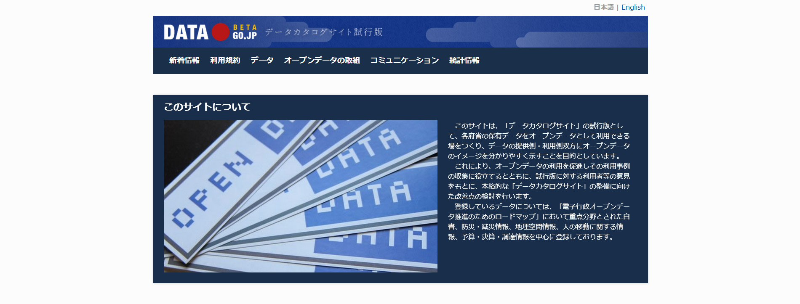

## カタログサイトの利用

地図を見て楽しむだけでなく、地図上に何らかの情報を重ねることで、様々ことに気づく可能性があります。さらに、問題を浮き彫りにしたり、関係者内で問題を分かりやすく共有したり、ユーザーに分かりやすい形での情報提供を行うことにも繋がります。

そこで、次に問題になることは、どのようなデータが提供されているかを把握しておくことです。こうしたデータ提供に対してのニーズに応えるべく2014年から、DATA GO.JP(http://www.data.go.jp/?lang=japanese)が公開されるようになりました。
これは、各府省の保有データをオープンデータとして利用できる場をつくり、データの提供側・利用側双方にオープンデータのイメージを分かりやすく示すことを目的としたものです。

2014年08月26日現在で、10,411件のデータセットが登録されています。

データの検索は組織別や、タグから行なうことが出来ます。地理空間情報に限らず様々なデータが公開されていますので、可視化やサービスのアイデアの元として一度覗いてみてください。

