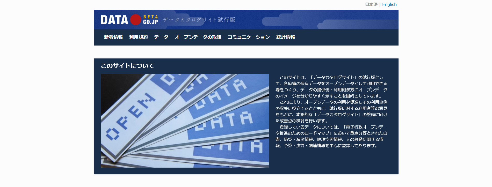

#オープンデータを使う
## カタログサイトの利用

本書の目的である、地理空間情報を可視化する際に、インターネットでの検索が主流になることは前述の通りです。また、地図を見て楽しむだけでなく、地図上に何らかの情報を重ねることで、様々ことに気づく可能性があります。さらに、問題を浮き彫りにしたり、関係者内で問題を分かりやすく共有したり、ユーザーに分かりやすい形での情報提供を行うことにも繋がると筆者は考えます。

そこで、次に問題になることは、どのようなデータが提供されているかを把握する事かと思われます。こうしたデータ提供に対してのニーズに応えるべく、インターネット上でDATA GO.JP(http://www.data.go.jp/?lang=japanese)が公開されるようになりました。
これは、各府省の保有データをオープンデータとして利用できる場をつくり、データの提供側・利用側双方にオープンデータのイメージを分かりやすく示すことを目的としているそうです。

2014年06月22日現在で、10,411件のデータセットが登録されています。

また、DATA.GO.JP以外にも以下のような公開データがあります。

| 公開元| link|
|:------:|:-----:|
|総務省 統計局|http://www.stat.go.jp/index.htm|
|e-Stat|http://www.e-stat.go.jp/SG1/estat/eStatTopPortal.do|
|気象庁|http://www.jma.go.jp/jma/index.html|
|G-portal|https://www.gportal.jaxa.jp/gp/top.html|
|基盤地図|http://fgd.gsi.go.jp/download/GsiDLLoginServlet|
|海上保安庁 MICS|http://www.kaiho.mlit.go.jp/info/mics/index.htm|
|DARTS|http://www.darts.isas.jaxa.jp/index.html.ja|
|METI|http://datameti.go.jp/|
|農林水産省センサス|http://www.maff.go.jp/j/tokei/index.html|
|経済産業省 DataBox|http://databox.openlabs.go.jp/|
|経済産業省 OpenGovLab|http://www.openlabs.go.jp/|

最近では、これらのデータを使ったアプリケーションの開発やビジュアライゼーション等に関するコンテストが活発に行われるようになってきました。
その顕著な例としては、Linked Open Data Challenge(http://lod.sfc.keio.ac.jp/challenge2013/)が挙げられるのではないかと思います。