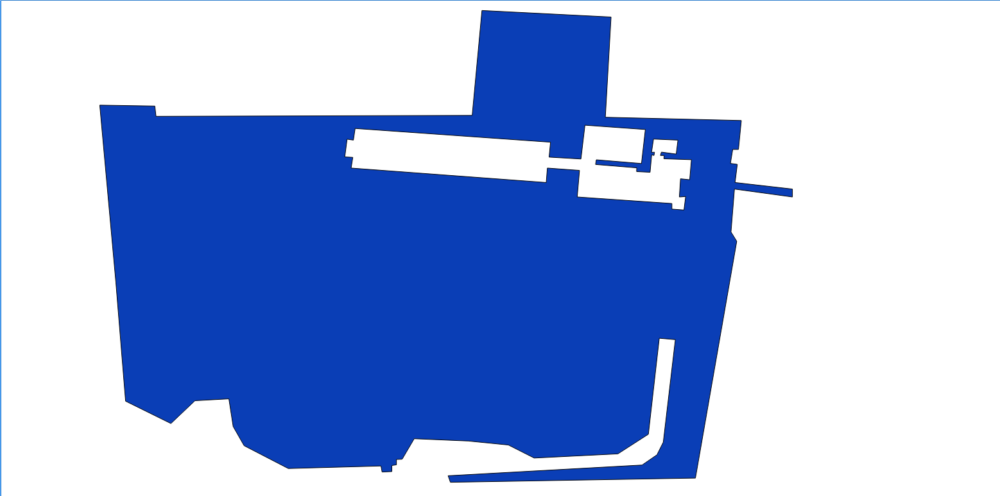

## GeoJSON

GeoJSONは軽量なデータ記述言語のJSONを地理空間情報用途にしたデータの形式です。QGISやArcGIS等のGIS専用ツールで使用することも出来るほか、GoolgeMapsAPIやYahooOpenLoaclPlatform,BeingMap,OpenLayers等のweb地図を公開する場合にもJSON形式のデータを使用できるようにサポートされています。また、Shapefileとは異なり、通常のテキストエディタでも編集可能です。

ジオメトリオブジェクトと聞くと身構えてしまうかもしれませんが、表現可能な表示図形のことです。


|ジオメトリオブジェクト|記述方法|
|----------------|--------|
|Point|"Point" タイプでは、"coordinates" メンバーは単一の位置でなければなりません。|
|MultiPoint|"MultiPoint" タイプでは、"coordinates" メンバーは位置の配列でなければなりません。|
|LineString|"LineString" タイプでは、"coordinates" メンバーは２つ以上の位置の配列でなければなりません。|
|MultiLineString|"MultiLineString" タイプでは、"coordinates" メンバーは LineString 座標配列の配列でなければなりません。|
|Polygon|"Polygon" タイプでは、"coordinates" メンバーは LinearRing 座標配列の配列でなければなりません。 複数の環を持つ Polygons では、最初の要素は外側の環でなければならず、その他は内側か、穴でなければなりません。|
|MultiPolygon|"MultiPolygon" タイプでは、"coordinates" メンバーは Polygon 座標配列の配列でなければなりません。|

- LinearRingとは、閉じられる特別なLineStringのことです。例えば4角形を書こうとする時に4点のcoordinatesを配列で記述しても閉じることが出来ません。5番目に最初のcoordinatesと同じ座標を記述します。

サンプルとしては以下のようになります。

- Point
 
```
{
"type": "FeatureCollection",
"crs": { "type": "name", "properties": { "name": "urn:ogc:def:crs:OGC:1.3:CRS84" } },
                                                                                
"features": [
{ "type": "Feature", "properties": { "Name": "協生館", "Description": "" }, "geometry": { "type": "Point", "coordinates": [ 139.6473240852356, 35.552392317040564, 0.0 ] } }
]
}
```

- Line

```
{
"type": "FeatureCollection",
"crs": { "type": "name", "properties": { "name": "urn:ogc:def:crs:OGC:1.3:CRS84" } },
                                                                                
"features": [
{ "type": "Feature", "properties": { "Name": "矢上ルート", "Description": "" }, "geometry": { "type": "LineString", "coordinates": [ [ 139.64952886104584, 35.55438900773931, 0.0 ], [ 139.64968979358673, 35.554539575841062, 0.0 ], [ 139.64989632368088, 35.554417375664151, 0.0 ], [ 139.65011358261108, 35.554618132999288, 0.0 ], [ 139.65058296918869, 35.55504146747117, 0.0 ], [ 139.65073585472464, 35.555151664766626, 0.0 ], [ 139.65085789529849, 35.555202399176089, 0.0 ], [ 139.65090416353519, 35.555040103368491, 0.0 ], [ 139.65092360973358, 35.555010917635691, 0.0 ], [ 139.65100944042206, 35.554912721657004, 0.0 ], [ 139.65157806873322, 35.55522913049095, 0.0 ], [ 139.65184763072932, 35.555368786380448, 0.0 ], [ 139.65207092462015, 35.555488803005709, 0.0 ], [ 139.65218525377452, 35.555517170553486, 0.0 ], [ 139.65232221423469, 35.555486075365877, 0.0 ], [ 139.65237325999033, 35.555461253754494, 0.0 ], [ 139.65242564678192, 35.555435341093307, 0.0 ], [ 139.65248867858395, 35.555400427207502, 0.0 ], [ 139.65257300058443, 35.555361149039399, 0.0 ], [ 139.6526667102537, 35.555324598461524, 0.0 ], [ 139.65275371443852, 35.555300867888306, 0.0 ], [ 139.65283803637965, 35.555286411285223, 0.0 ], [ 139.65296980011396, 35.555281501398355, 0.0 ], [ 139.65307608246803, 35.555277137239358, 0.0 ], [ 139.65312503278392, 35.555273318527981, 0.0 ], [ 139.65315386652946, 35.555271681928538, 0.0 ], [ 139.65361386537552, 35.555253679399996, 0.0 ] ] } }
]
}
```

- Polygon


``` 
{
"type": "FeatureCollection",
"crs": { "type": "name", "properties": { "name": "urn:ogc:def:crs:OGC:1.3:CRS84" } },
                                                                                
"features": [
{ "type": "Feature", "properties": { "Name": "湘南藤沢キャンパス", "Description": "" }, "geometry": { "type": "Polygon", "coordinates": [ [ [ 139.42771553993225, 35.391289055217626, 0.0 ], [ 139.42506551742554, 35.392426068449467, 0.0 ], [ 139.42480802536011, 35.390659317914576, 0.0 ], [ 139.42504405975342, 35.38992461817962, 0.0 ], [ 139.42521572113037, 35.388630130933961, 0.0 ], [ 139.42480802536011, 35.387230661891905, 0.0 ], [ 139.4245719909668, 35.386058587885913, 0.0 ], [ 139.42525863647461, 35.3848515087953, 0.0 ], [ 139.42564487457275, 35.384816520726211, 0.0 ], [ 139.42581653594971, 35.38458909790721, 0.0 ], [ 139.42639589309692, 35.384746544542487, 0.0 ], [ 139.42656755447388, 35.38451912152621, 0.0 ], [ 139.42802667617798, 35.384711556427881, 0.0 ], [ 139.42802667617798, 35.386163550431483, 0.0 ], [ 139.42859530448914, 35.386434703042056, 0.0 ], [ 139.42887425422668, 35.386041094115065, 0.0 ], [ 139.42992568016052, 35.386303500279773, 0.0 ], [ 139.43036556243896, 35.386898284426202, 0.0 ], [ 139.43075180053711, 35.387772959027217, 0.0 ], [ 139.43109512329102, 35.388122826211841, 0.0 ], [ 139.43204998970032, 35.389189911751934, 0.0 ], [ 139.43133115768433, 35.389417321599495, 0.0 ], [ 139.43095564842224, 35.389338602878659, 0.0 ], [ 139.4305694103241, 35.389513533265045, 0.0 ], [ 139.42977547645569, 35.389224897924066, 0.0 ], [ 139.4281017780304, 35.389294870222784, 0.0 ], [ 139.42741513252258, 35.389539772790279, 0.0 ], [ 139.42771553993225, 35.391289055217626, 0.0 ] ] ] } }
]
}
```
- Polygon(donuts)

```
{
"type": "FeatureCollection",
"crs": { "type": "name", "properties": { "name": "urn:ogc:def:crs:OGC:1.3:CRS84" } },
                                                                                
"features": [
{ "type": "Feature", "properties": { "Name": "三田キャンパス", "Descriptio": null, "Name_2": null, "Descript_2": null }, "geometry": { "type": "Polygon", "coordinates": [ [ [ 139.74137037992477, 35.648451981648712, 0.0 ], [ 139.74132478237152, 35.649009953470291, 0.0 ], [ 139.7412496805191, 35.649836006159752, 0.0 ], [ 139.74150717258453, 35.649831647065064, 0.0 ], [ 139.74151253700256, 35.649783697007948, 0.0 ], [ 139.74299043416977, 35.649788056105237, 0.0 ], [ 139.74303603172302, 35.650278453031952, 0.0 ], [ 139.74363952875137, 35.650247939533237, 0.0 ], [ 139.74361270666122, 35.64977933791041, 0.0 ], [ 139.74424839019775, 35.649764081067175, 0.0 ], [ 139.74423497915268, 35.649628948899966, 0.0 ], [ 139.74420815706253, 35.649628948899966, 0.0 ], [ 139.74419742822647, 35.649563562285373, 0.0 ], [ 139.74422961473465, 35.649559203175826, 0.0 ], [ 139.74421888589859, 35.649474200492193, 0.0 ], [ 139.74448710680008, 35.649443686686269, 0.0 ], [ 139.74448710680008, 35.649406634191983, 0.0 ], [ 139.74421620368958, 35.649443686686269, 0.0 ], [ 139.74420011043549, 35.649243167100217, 0.0 ], [ 139.74422693252563, 35.649199575819281, 0.0 ], [ 139.74403381347656, 35.64809234930766, 0.0 ], [ 139.7428885102272, 35.648072732951583, 0.0 ], [ 139.74287778139114, 35.648103247281178, 0.0 ], [ 139.74378436803818, 35.64815337794019, 0.0 ], [ 139.74385410547256, 35.648201328975922, 0.0 ], [ 139.74388360977173, 35.648260177934944, 0.0 ], [ 139.74393993616104, 35.648739686355889, 0.0 ], [ 139.74386483430862, 35.648746225087194, 0.0 ], [ 139.74381387233734, 35.648297230960992, 0.0 ], [ 139.74367171525955, 35.648205688159543, 0.0 ], [ 139.74328011274338, 35.648186071831326, 0.0 ], [ 139.74315941333771, 35.648247100392261, 0.0 ], [ 139.74297299981117, 35.648265626910465, 0.0 ], [ 139.74271953105927, 35.648276524860322, 0.0 ], [ 139.74266320466995, 35.64818062285039, 0.0 ], [ 139.7426363825798, 35.648179533054169, 0.0 ], [ 139.7426363825798, 35.648154467736795, 0.0 ], [ 139.74261492490768, 35.648151198346987, 0.0 ], [ 139.74261492490768, 35.648122863629752, 0.0 ], [ 139.74256932735443, 35.648120684035703, 0.0 ], [ 139.7425639629364, 35.648149018753699, 0.0 ], [ 139.7421307861805, 35.648137030989631, 0.0 ], [ 139.74192425608635, 35.648243831006241, 0.0 ], [ 139.74187329411507, 35.648333194175734, 0.0 ], [ 139.74185317754745, 35.648462879573181, 0.0 ], [ 139.74169492721558, 35.64845416123373, 0.0 ], [ 139.74158227443695, 35.64834736149831, 0.0 ], [ 139.74137037992477, 35.648451981648712, 0.0 ] ], [ [ 139.74244326353073, 35.649727028721486, 0.0 ], [ 139.74243521690369, 35.649672539946607, 0.0 ], [ 139.74240571260452, 35.649676899049972, 0.0 ], [ 139.74239498376846, 35.649594076045503, 0.0 ], [ 139.74243253469467, 35.649591896491579, 0.0 ], [ 139.74242448806763, 35.64954176673529, 0.0 ], [ 139.74333643913269, 35.649474200492193, 0.0 ], [ 139.74334180355072, 35.64954176673529, 0.0 ], [ 139.74349200725555, 35.649530868957989, 0.0 ], [ 139.74348127841949, 35.649406634191983, 0.0 ], [ 139.74392384290695, 35.649376120360252, 0.0 ], [ 139.74392384290695, 35.649349965638045, 0.0 ], [ 139.74398016929626, 35.649345606516846, 0.0 ], [ 139.74398821592331, 35.649408813750938, 0.0 ], [ 139.74395871162415, 35.649406634191983, 0.0 ], [ 139.74396407604218, 35.649491636947495, 0.0 ], [ 139.74400699138641, 35.649487277834027, 0.0 ], [ 139.74401503801346, 35.649580998721156, 0.0 ], [ 139.74388629198074, 35.649585357829508, 0.0 ], [ 139.74388763308525, 35.649600614706891, 0.0 ], [ 139.74387019872665, 35.649600614706891, 0.0 ], [ 139.74387489259243, 35.649616416469648, 0.0 ], [ 139.74394395947456, 35.649607153367711, 0.0 ], [ 139.74395200610161, 35.649672539946607, 0.0 ], [ 139.74383801221848, 35.649677443937868, 0.0 ], [ 139.74382862448692, 35.649615326693016, 0.0 ], [ 139.74384270608425, 35.649615871581318, 0.0 ], [ 139.74384002387524, 35.649600614706891, 0.0 ], [ 139.74382929503918, 35.649603884037369, 0.0 ], [ 139.74382191896439, 35.649522150735102, 0.0 ], [ 139.74375888705254, 35.649525420068805, 0.0 ], [ 139.74375955760479, 35.649542856512937, 0.0 ], [ 139.74356710910797, 35.649558658287113, 0.0 ], [ 139.74357046186924, 35.649580453832598, 0.0 ], [ 139.74378168582916, 35.649563017396687, 0.0 ], [ 139.74379979074001, 35.64972212473328, 0.0 ], [ 139.7435174882412, 35.649742285571797, 0.0 ], [ 139.74349871277809, 35.649584268052443, 0.0 ], [ 139.74334985017776, 35.649592986268566, 0.0 ], [ 139.7433565557003, 35.64966273196319, 0.0 ], [ 139.74244326353073, 35.649727028721486, 0.0 ] ] ] } }
]
}
```

