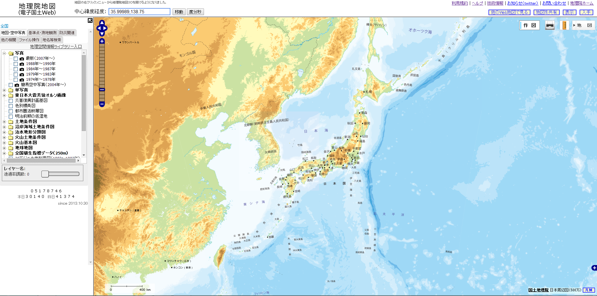

## 配信地図(オープンストリートマップ、地理院地図)

### 1.オープンストリートマップ
オープンストリートマップ(OSM)はスティーブ・コーストが発起人となり始まった活動ですが、今では世界中にその活動が広まっています。大きな特徴としては、自由で編集可能であることです。


オープンストリートマップではすべての地図データへの自由なアクセスを認めており、膨大な量のデータは全てがダウンロード可能で、また誰もが自由に編集可能です。このような特徴から、しばしば地図版のwikipediaと言われています。
オープンストリートマップは非営利のオープンストリートマップ財団(OSMF:イギリス)によって支えられています。日本では、オープンストリートマップ・ファウンデーション・ジャパン(OSMFJ:日本)という法人組織がイギリスのオープンストリートマップ財団と連携してOSMFの日本国内の窓口として、コミュニティーの発展と自由な地図情報の推進のため様々な活動をしています。

- OSMF
http://wiki.osmfoundation.org/wiki/Main_Page

- OSM
http://www.openstreetmap.org/


- OSMFJ
http://www.osmf.jp/home


### 2.地理院地図

地理院地図とは、平成15年に開始し、平成24年7月からは「電子国土Web.NEXT（試験公開）」として提供しておりました国土地理院のウェブ地図の最新版のことです。

webブラウザで
```
http://portal.cyberjapan.jp/site/mapuse4/index.html
```
にアクセスすると、以下のような地図が閲覧できるようになります。



また、これはFOSS4G(Free Open Source Software For Geospacial)をはじめとする、各種ライブラリで利用可能です。


地理院地図では標準画像以外にも単色地図や電子国土基本図(オルソ画像)や国土画像情報といったものから標高タイルや植生図など、土地に紐づく様々な情報を地図上で表示可能です。


- 20万分の1土地利用図


- 電子国土基本図(オルソ画像)


オープンストリートマップや電子国土をQGISで扱う方法に関しては、3章の基本となる地図を準備するという項目で、その使用方法に関して詳述したいと思います。