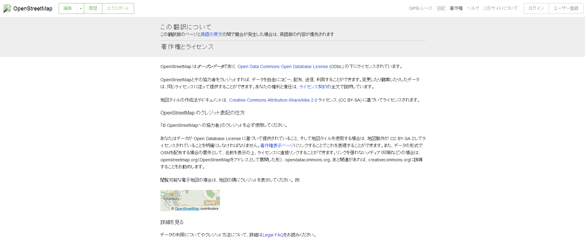
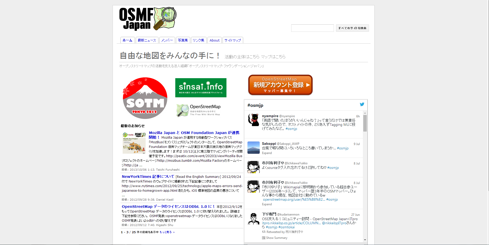
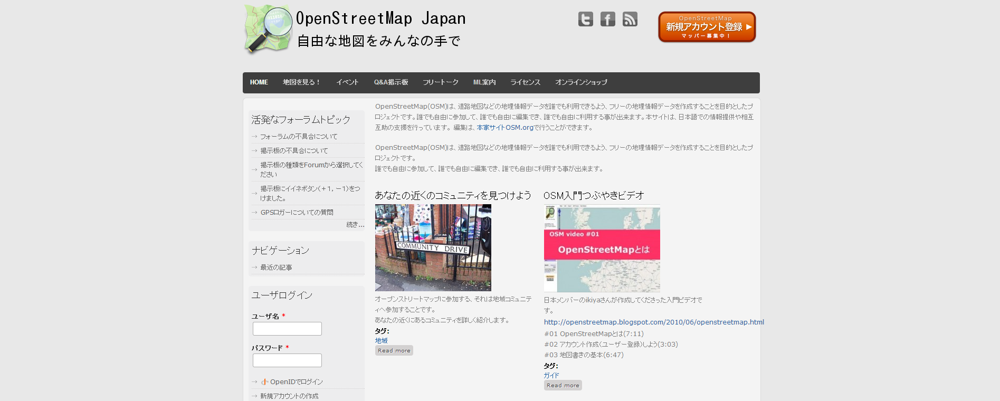

## (column)オープンストリートマップ

オープンストリートマップ(OpenStreetMap:OSMと略される)は、自由に使用出来る地理情報データを作成することを目的としたプロジェクトです。誰でも自由に参加して、誰でも自由に編集でき、誰でも自由に利用する事が出来ます。しばしば地図版のwikipediaと言われています。
イギリスで始まった活動ですが、今では世界中にその活動が広まっています。

オープンストリートマップではすべての地図データへの自由なアクセスを認めており、膨大な量のデータは全てがダウンロード可能で、利用することができます。
活動は、非営利のオープンストリートマップ財団(OSMF:イギリス)によって支えられています。日本では、オープンストリートマップ・ファウンデーション・ジャパン(OSMFJ:日本)という法人組織が立ち上がっています。イギリスのオープンストリートマップ財団と連携してOSMFの日本国内の窓口として、コミュニティーの発展と自由な地図情報の推進のため様々な活動を行っています。

- OSMF
http://wiki.osmfoundation.org/wiki/Main_Page

- OSM
http://www.openstreetmap.org/

- OSMFJ
http://www.osmf.jp/home

