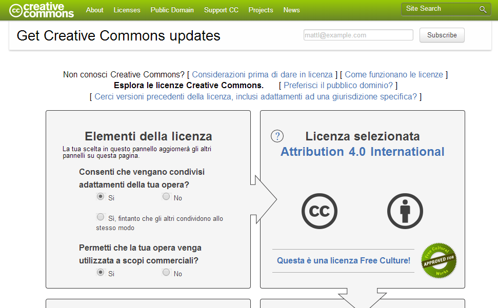

##クリエイティブ・コモンズ・ライセンス
あなたが何か作品を作った場合、自動的に著作権が発生し作品が保護されます。他の人がその作品を利用して二次創作したいと思ったとしても、勝手に利用することは出来ません。あなたがその作品を広く利用して貰いたいと思った場合には、その意思表示をしなくてはいけません。クリエイティブ・コモンズ・ライセンスは、この意思表示を簡単にできるようにしたツールです。作品の流通を促進するための活動または組織であるクリエイティブ・コモンズによって提供されています。  

クリエイティブ・コモンズ・ライセンスでは、以下の4つの条件を組み合わせて意思表示を行います。

*クリエイティブ・コモンズ・ライセンスの4条件*

|アイコン|表す条件|
|----|--------|
||**表示** 作品のクレジットを表示すること|
||**非営利** 商用目的で利用しないこと|
||**改変禁止** 元の作品を改変しないこと|
||**継承** 同じクリエイティブ・コモンズ・ライセンスを継承すること|

**表示**は必ず入れることになっているため、これらから6種類のライセンスを作ることができます。

*クリエイティブ・コモンズ・ライセンスであらわせる6ライセンス*

|アイコン|ライセンス|
|-----|--------|
||**表示**|
||**表示-継承**|
||**表示-改変禁止**|
||**表示-非営利**|
||**表示-非営利-継承**|
||**表示-非営利-改変禁止**|

ライセンスの作成は、
　http://creativecommons.org/choose/
にアクセスして質問に答えるだけで行なうことが出来ます。

質問に答えると対応したライセンスが表示され、ホームページに組み込むためのhtmlも作成されます。ホームページ以外にライセンスを表記したい場合は、ライセンスを表す画像やライセンス条件が記載されているホームページのURLを記載します。