# 基本となる地図を準備する
この章では、可視化の第一歩として、ベースとなる地図の可視化を行います。地図と一言で言っても、住んでいる町内の地図から世界地図まで様々なスケールのものが含まれてきます。まず必要なこととして、それぞれのスケールに応じたデータを選択してくることがあげられます。いくつかのスケールを例にして、データの準備と、表現付けを行ってみましょう。この後の章で様々なデータを載せる際に基本となる地図を作ります。

## 身近な地域の地図を作成する
下記のソフトウェアとデータを使用します。 

* 使用するソフトウェア 
   * QGIS
      * URL http://www.qgis.org/
      * ライセンス GNU GPL
* 使用するデータ 
   * 基盤地図情報-縮尺レベル2500　
      * URL http://www.gsi.go.jp/kiban/
      * ライセンス 「測量成果の複製・使用」(http://www.gsi.go.jp/LAW/2930-index.html)を参照すること

自分の住んでいる街の地図を目にする機会は多いでしょうか？町内会の地図や、子供の学校の校区の地図といった生活圏内の地図は、とても身近なところで使われている地図の例です。登下校時の危険箇所を書き込んで、防犯マップを作成している学校もあるかもしれません。商店街の商店であれば、配達圏内の地図を大きく印刷して壁に貼ってあるかもしれませんね。  
国土地理院が中心となって整備を行っている基盤地図情報から、2500レベルのデータをダウンロードしてくることで、ちょうどよいスケールの地図を作成することが出来ます。ここでは、基盤地図情報-縮尺レベル2500のデータを元に、下図のような白黒の線要素のみの地図の作成を行います。
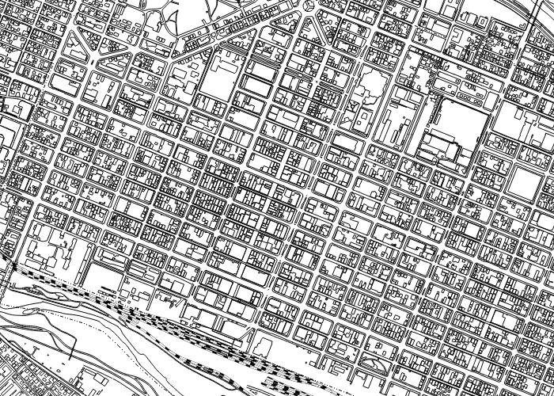
*この地図は、基盤地図情報-縮尺レベル2500 旭川市を使用したものである*

### 使用にあたり確認すべき項目
地図データを使用する際は、そのデータが何を基に作成されたのか、どの程度の位置精度を持っているのか、が重要になります。間違った選択をすると、縮尺に対して低い位置精度しかか持っていないために意図した位置に表示されないことや、逆にオーバースペックになりデータ量が多すぎるといった事が起きてしまいます。  
基盤地図情報については、満たすべき基準、位置精度がホームページで公開されていますのであらかじめ確認しておきましょう。(http://www.gsi.go.jp/kiban/towa.html)  

また、そもそも利用を想定している場面にそのデータの使用が許可されているか確認することが必要です。  
基盤地図情報は国土地理院が行った測量成果ですので、その複製・使用にあたっては承認が必要になる場合があります。詳しくは、 「測量成果の複製・使用」(http://www.gsi.go.jp/LAW/2930-index.html)を参照してください。  
本書中に補助的に基盤地図情報の画像を挿入していますが、

* 「測量成果の複製の承認」
   * 刊行する場合
* 承認を得ず出所の明示により利用できる範囲
   * 刊行物等に少量の地図を挿入する場合

を確認するべきでしょう。使用することは問題にはならないでしょうが、承認を得る必要があるか、承認を得ずに出所の明示のみで利用出来るかは確認が必要となります。本書では、補助的に挿入する場合であるとして、出所の明記にとどめています。判断に迷った場合は、問い合わせるようにしましょう。

### データをダウンロードする
基盤地図情報(http://www.gsi.go.jp/kiban/)からデータをダウンロードする場合は、ユーザ登録が必要になります。ログイン画面に進んでください。初めて使用する場合は、新規登録からユーザの作成を行います。ユーザ作成が済みましたら、ユーザID、パスワードを入力して登録済みユーザでログインします。
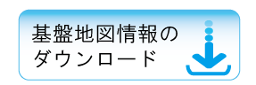

いくつかのデータ項目、フォーマットとしてはJPGIS形式もしくはJPGIS(GML)形式が選択出来ますが、ここでは、

* 基盤地図情報縮尺レベル2500
* JPGIS形式

を選択してください。フォーマットはどちらを選択しても構いません。後述する閲覧コンバートソフトによって、フォーマットを変換した上で使用することになります。
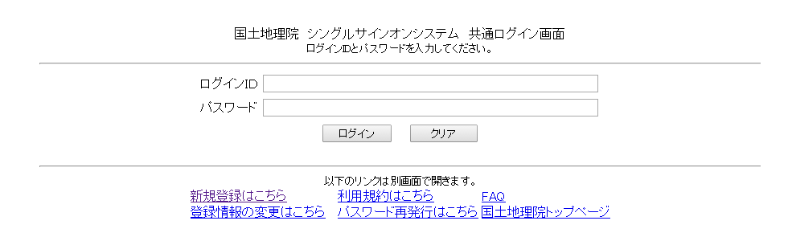

続いてダウンロードしたい市町村、ダウンロードする基盤地図情報項目の選択を行います。市町村の選択については、地図もしくはリストから選択を行えます。下図はリストから選択した例になります。項目は作成したい地図に合わせて選択することになりますが、まずはすべて選択しておきましょう。
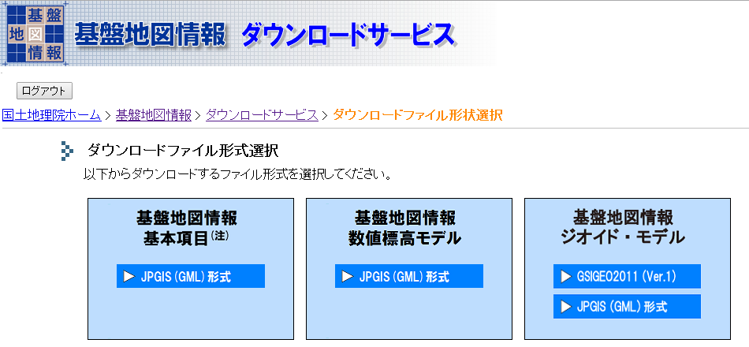

政令指定都市を選択した場合などは、この画面でどの区をダウンロードするか選択をすることが出来ます。また、選択済みのデータ項目のデータ容量が表示されますので、大きすぎる場合などは、データ項目のチェックを外すか、再度前の画面に戻って項目の調整を行ってください。  
選択した項目が正しければ、「選択して次へ」に進みます。
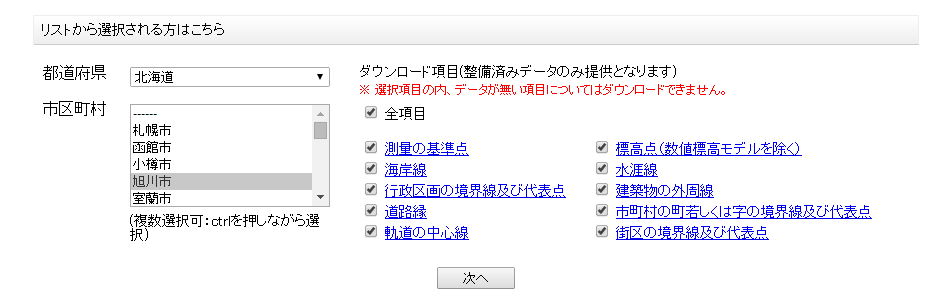

まとめてダウンロードするか、個別のダウンロードとするか選ぶことが出来ます。必ずデータ容量を確認した上で、どちらか選択をしてください。ダウンロードが正常に行われると、まとめてダウンロードした場合はPackDLMap.zipというファイル名で、個別の場合はダウンロードファイルリストに表示されていたファイル名で、ファイルがダウンロードされますので、確認してください。
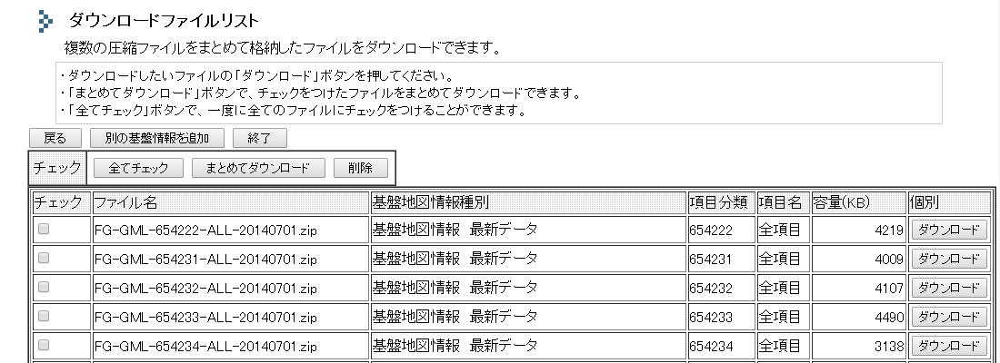

### 一般的なフォーマットへ変換する
地理空間情報の作成・編集・表示・分析を統合的に出来るQGISを使用して、基盤地図情報データに表現を付けていくことにします。ただし、ダウンロードしてきた基盤地図情報ファイルはJPGISもしくはJPGIS(GML)という形式になっており、このままではQGISで読み込むことは出来ません。地理空間情報を扱うソフトウェアで広く使用されているESRI Shapefileに変換を行います。変換には、基盤地図情報ダウンロードのサイトから専用のソフトウェアが提供されていますので、ダウンロードしておきます。残念ながらWindows版しか提供されていませんので、ご注意ください。

インストールは必要無く、zipファイルを解凍した中のFGDV.exeを実行すると、基盤地図情報ビューワー・コンバーターを起動することが出来ます。起動したことを確認したら、ダウンロード済みの基盤地図情報ファイルをzipファイルのまま、基盤地図情報ビューワー・コンバーターにドラッグ＆ドロップで持ってきましょう。あらかじめ各属性に割り振られている表現が付けられて地図が表示されます。
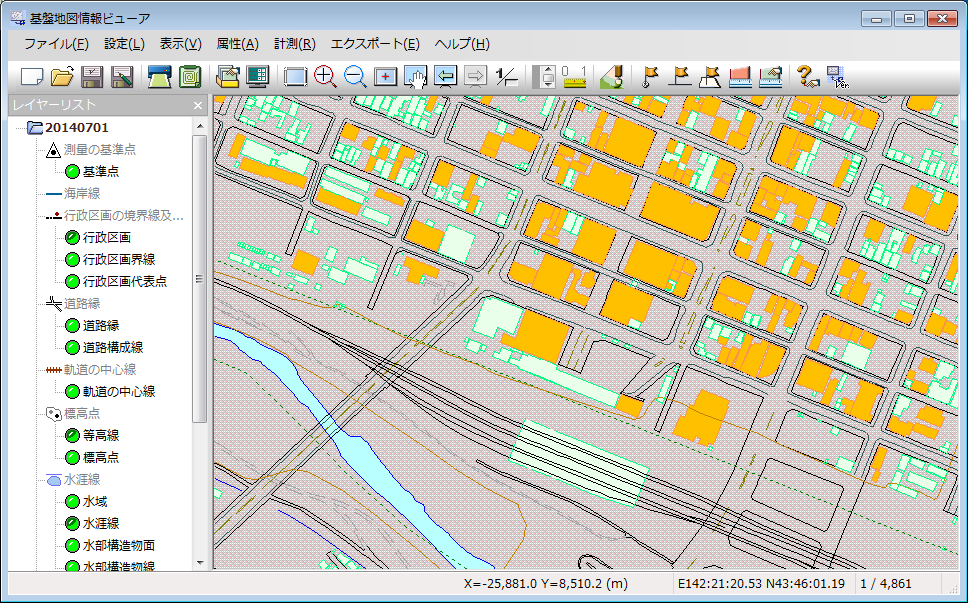

さて無事、地図も表示出来ましたし、これでいいのでは？と思ってしまうところですが、目的は様々なデータを載せる基本となる地図を用意することです。基盤地図情報ビューワー・コンバーターは基盤地図情報で提供されるデータを表示・変換するためのものですので、他のデータを用意して重ねていくことは出来ません。この後の処理を続けましょう。  
メニューから「エクスポート」→「エクスポート」を選択してください。表示されるダイアログで、

* 変換種別はシェープファイルを選択
* 直角座標系に変換のチェックを外す
* 全データ領域を選択にチェック
* 出力先フォルダを選択

の指定を行い、「OK」を押して変換を開始します。
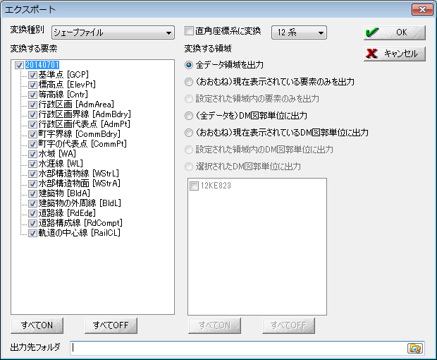

変換の際に、全データ領域を選択しましたが、データ量が大きすぎるため変換に時間がかかる場合や、必要な地図の領域が限られる場合は、ビューワー・コンバータ上で地図の表示範囲を調整しておき、「(おおむね)現在表示されている要素のみを出力」を選択しましょう。直角座標系に変換のチェックを外していますが、この場合出力されるファイルは経緯度で座標を持ちます。直角座標系はやや専門的なので、経緯度にしておきました。この方が多くの方にとっては直感的に判断出来ると思います。  
変換が終了すると、各要素が正常に変換されどこに保存されたかのメッセージが表示されますので、確認は必ず行ってください。

### 変換後のファイルを開く
出力先に指定したフォルダを開いてみましょう。"軌道の中心""建築物"といった要素毎に、.dbf .shp .shx .prjの4つの拡張子のファイルが作成されています。ESRI Shapefileでは、拡張子の違ういくつかのファイルで1つの組になります。
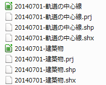

QGISを起動しておき、

* 町字界線
* 水涯線
* 行政区画界線
* 建築物の外周線
* 軌道の中心線
* 道路構成線
* 道路縁

要素の各.shpファイルをドラッグ＆ドロップでQGISに持ってきて開きましょう。各ESRI Shapefileは、点、線、面の図形種別のうちどれか1つの図形種別を持つことが出来ます。ここで選択したファイルは線を持つファイルになります。  
QGISに、各要素(各ESRI Shapefile)が1レイヤとなって表示されます。この状態では、QGISで各レイヤ毎に割り振った表現が付けられています。ランダムに割り振られたシンプルな表現ですので、開く度に別な表現になります。

### レイヤ毎にスタイルを設定する
各線要素の色を黒(RGB：0,0,0)に変更してみましょう。後で違うデータを重ねるとして、ベースとなる地図の色が黒では濃すぎると感じる場合は、もう少し薄く(RGB:180,180,180程度)しておいてもいいかもしれません。  
色を変更するには、対象のレイヤを選択して右クリック後に表示されるメニューから「プロパティ」を選択します。
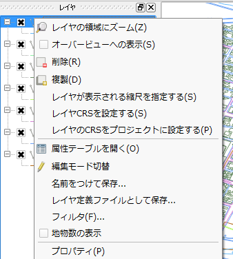

「スタイル」タブを選択してください。現在の設定として、レイヤ中のすべての線に対して同じ表現が付いていること(共通シンボル)、表現としてシンプルなラインが設定されていること、色はどの色が割り当てられているか、などを確認することが出来ます。  
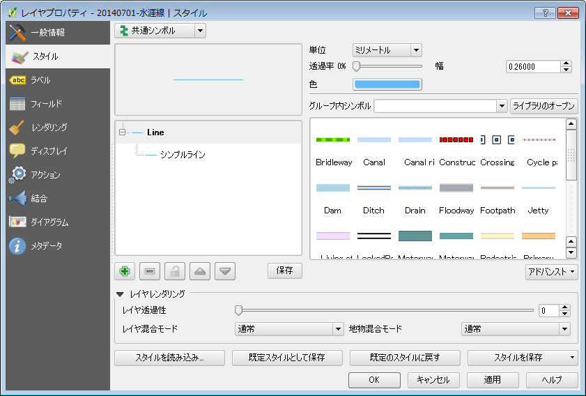

まずはすべてのレイヤについて色を変更していきましょう。「スタイル」タブを選択しておき、「色」がサンプル表示されているボックスをクリックすると、色選択のダイアログが表示されます。ここで、

* 赤(R) : 0
* 緑(G) : 0
* 青(B) : 0

を入力して色を黒に変更します。もちろん好きな色を入力してもらっても構いません。入力が終わったら「OK」を押し「スタイル」タブへ戻り、「適用」を押します。地図面へ色が反映されますので、確認してみてください。
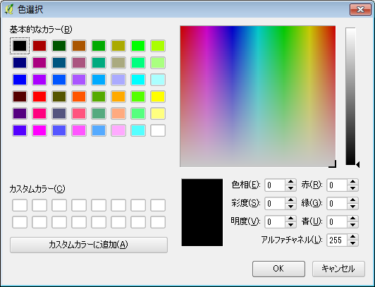

反映を確認して、他のレイヤも順に色を変更してください。  
ここまででも立派に地図らしく見えると思いますが、すべての線が一様な表現となっているため少々わかりにくいです。もう少しだけ味付けしてみましょう。
まずは、町字界線と行政区画界線。正式な地図の図式とはいきませんが、表現を直線ではなく鎖線に変更してみましょう。対象とするレイヤのプロパティから「スタイル」タブを開いてください。「シンボルレイヤ群」と書かれたツリー構造から「シンプルライン」を選択します。そうすると、ペンのスタイルの選択肢が表示されます。ここから、「一点鎖線」もしくは「二点鎖線」を選択してみましょう。スタイルを「適用」すると地図面で表現を確認することが出来ます。
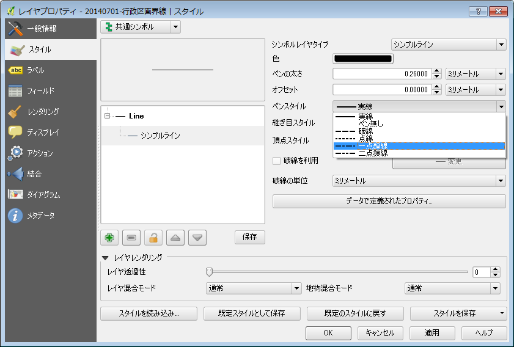

次に、軌道の中心線に"旗竿"とよばれる表現を付けます。同じく、対象とするレイヤのプロパティから「スタイル」タブを開いてください。「シンボルレイヤ群」のツリーに、シンプルラインをもう１つ追加して、2つにしておきます。下の「＋」ボタンから追加出来ます。
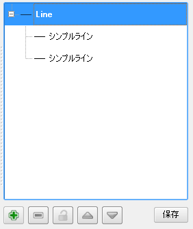

シンプルラインを追加したら、片方のシンプルラインの色を白にして、破線を利用にチェックを入れます。もう一方のシンプルラインは色を黒にしておきます。ここでのポイントは、黒にしたラインのペンの太さを太く、白にしたラインのペンの太さを細くしておくことです。こうすることで、黒のラインの中に、白の破線が描画されて、旗竿表現が出来上がります。ペンの太さは調整しながら試してみてください。
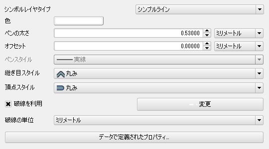
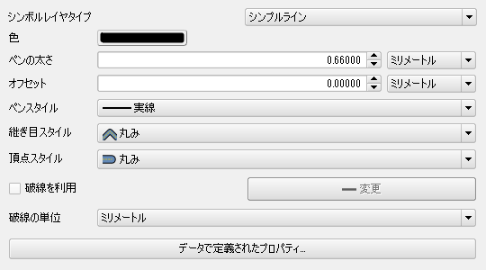

出来上がると、このような表現になります。より地図らしくなったでしょうか？
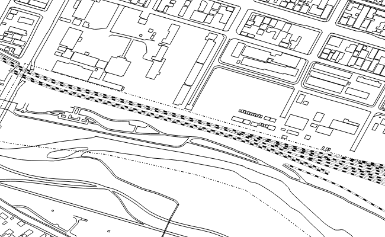
*この地図は、基盤地図情報-縮尺レベル2500 旭川市を使用したものである*

### 保存しておく
折角作った表現は保存することをお忘れなく。QGISでは"プロジェクト"に、使用したデータへのパス、設定した表現等を含めて、現在の状態の保存を行います。メニューから「プロジェクト」→「保存」もしくは「名前を付けて保存」を選択します。  
データ自体はプロジェクト内に保存されないことに注意してください。QGISメニューの「プロジェクト」→「プロジェクトのプロパティ」→「一般情報」タブを開いてみましょう。「保存パス」として、"相対パス"もしくは"絶対パス"が選択されています。実データ(この例では各ESRI Shapefile)へのパスをプロジェクト内に相対パスで保存するか、絶対パスで保存するかの選択を行えます。いずれにしても、実データを動かしてしまうとプロジェクトを開いてもデータが表示されなくなりますので、お気をつけ下さい。
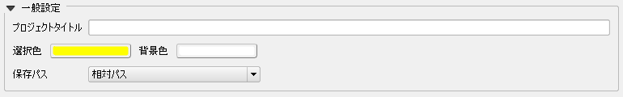