## 3.b もう少し広い範囲の地図を表示する

この章では、pluginを使用してOpenStreetMapや地理院地図を表示することについて触れます。

### OpenLayers Pluginを使用する

OpenLayers Pluginを使用してOpenStreetMapを表示させます。巻末のappendix1を参考にして、【プラグイン(P)】をクリックしてください。次に〔プラグインの管理とインストール〕をクリックして、OpenLayers Pluginが入っていることを確認してください。無い場合は追加してください。

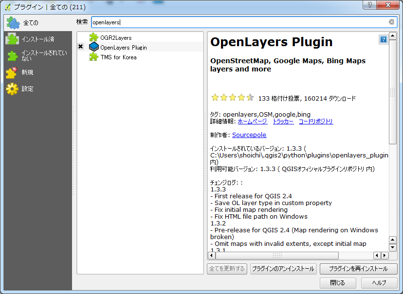.

追加後に、【Web(W)】をクリックします。

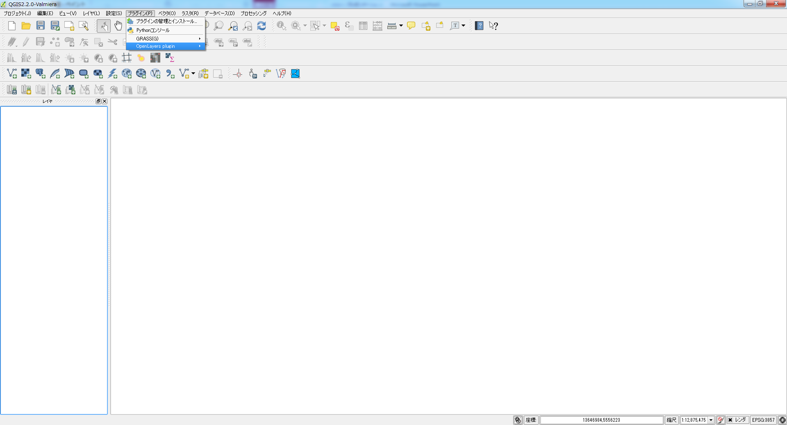.

図のように、OpenLayers Pluginを使用することが可能になります。プルダウンメニューから【OpenLayersPlugin】をクリックしてOpenStreetMap上にカーソルを置き選択状態「リストアイテム」としていくつかのオープンストリートマップ及び編集を加えたオープンストリートマップが選択できます。
以下の図[オープンストリートマップ]のようになります。

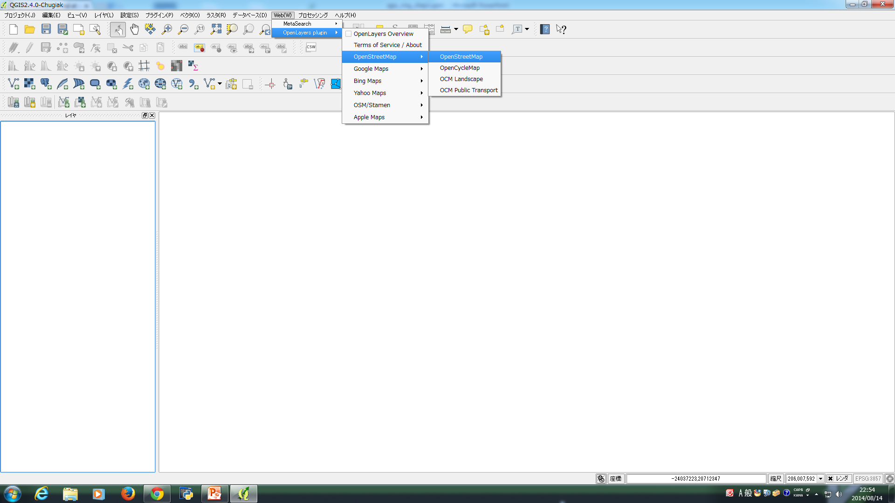.

【OpenCycleMap】を選択してクリックしてください。例えば、以下のように表示されるかと思います。また、OpenStreetMapは元来有志が編集していますが、特に、OpenCycleMapはその中でも特に自転車が好きな人たちの手で編集しているものになります。そのため、世界全体をカバーしていないので編集が盛んなヨーロッパ地域にズームしてから見てください。

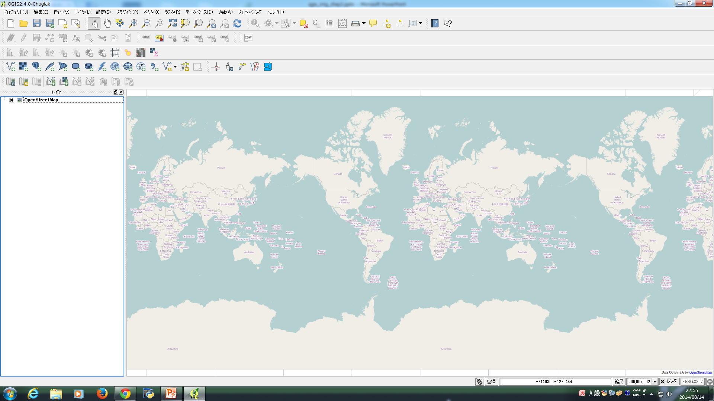.

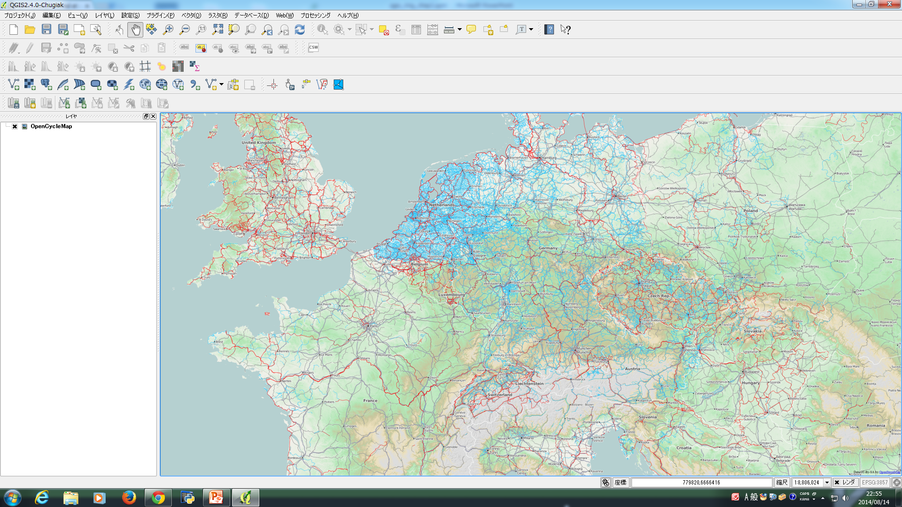.

例えば下の図は、特にオープンサイクルマップの編集が盛んなオランダのマーストリヒト周辺を拡大してみたものになります。

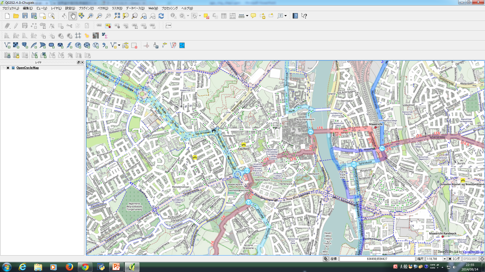.

【OCM Landscape】を選択してクリックしてください。例えば、以下のように表示されるかと思います。これは建物を地図上に編集して加えられた地図になります。サイクルマップ同様に、世界全体をカバーしていないのでその点にご注意ください。添付の図は、神奈川県横浜市港北区日吉駅周辺を拡大した場合のものです。

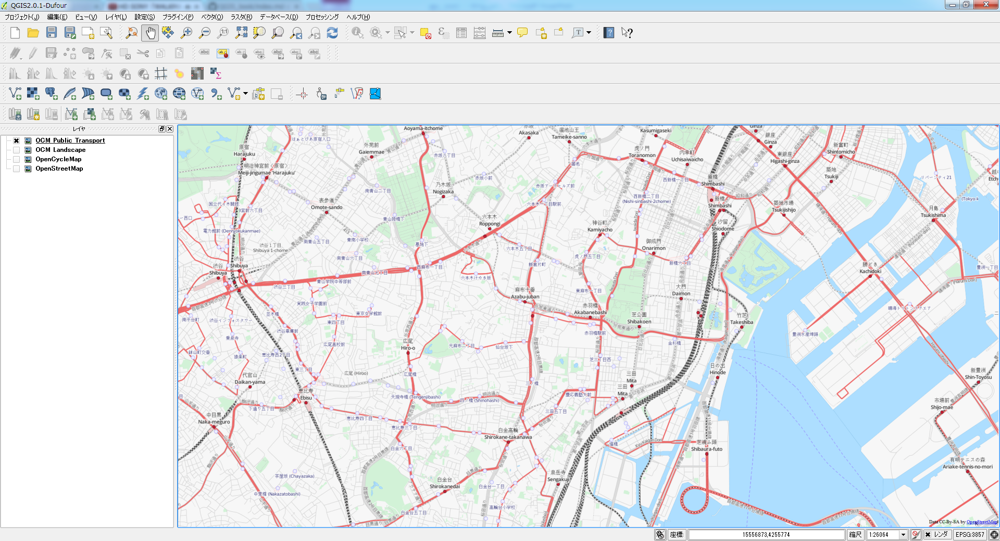.

【OCM Public Transport】を選択してクリックしてください。例えば、以下のように表示されるかと思います。これは公共交通機関を地図上に編集して加えられた地図になります。サイクルマップ同様に、世界全体をカバーしていないのでその点にご注意ください。添付の図は、東京都港区駅三田周辺を拡大した場合のものです。

.

また、OpenLayersPluginを使用すると、OpenStreetMap以外にもGoogleMaps、BeingMaps、YahooMaps、AppleMaps等も使用できるようになります。

### TileLayer Pluginを使用する

TileLayer Pluginを使用して、地理院地図を表示させます。

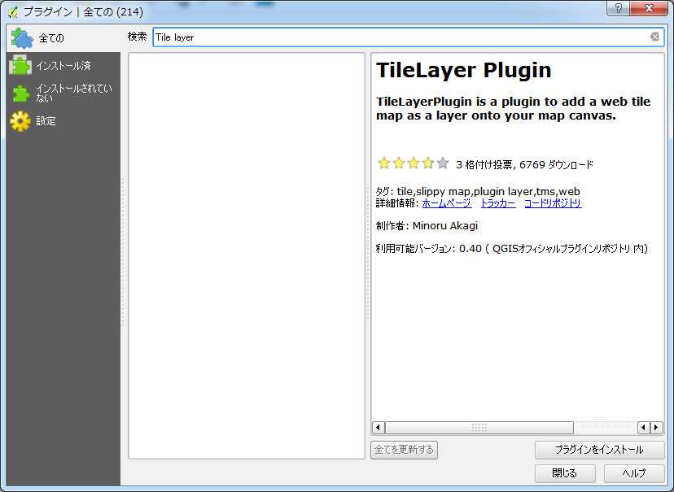.

TileLayer Pluginをインストールすると、以下のディレクトリにTileLayerPluginが置かれます。

```
C:\Users\[UserName]\.qgis2\python\plugins\TileLayerPlugin
```

TileLayer Pluginのディレクトリは、以下の図[タイルレイヤプラグインファイル]のファイル
で構成されています。

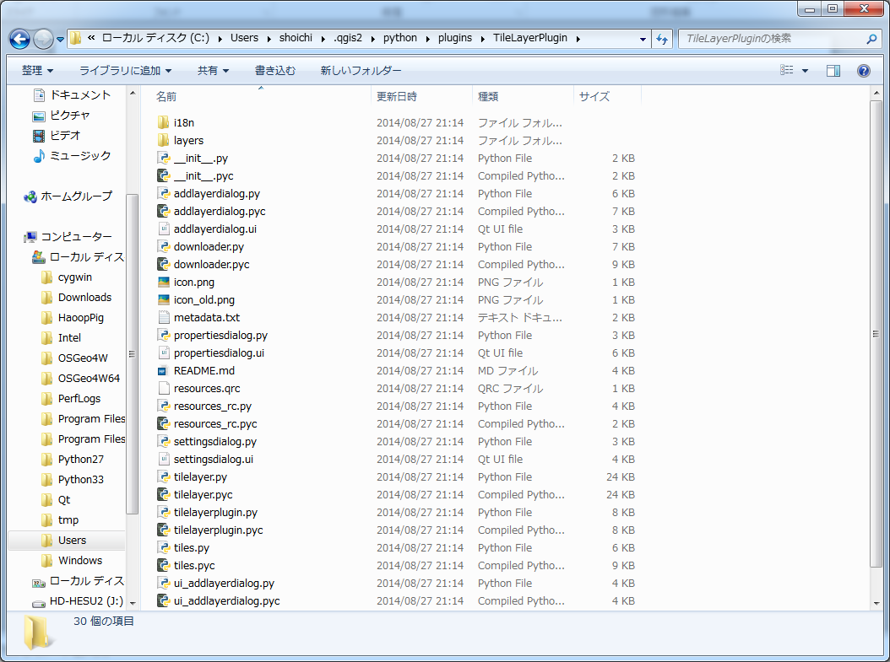.


### 設定ファイルを作成する

使用したい地理院地図を指定したTSV形式の設定ファイルを作成する必要があります。
TileLayerPluginディレクトリの中にある

- layers

というディレクトリ内に設定ファイルを追加してください。

国土地理院の地図タイルをQGISで利用するためのレイヤ定義ファイルの例

```
=== 国土地理院の地図タイルをQGISで利用するためのレイヤ定義ファイルの例 ===
標準地図	国土地理院	http://cyberjapandata.gsi.go.jp/xyz/std/{z}/{x}/{y}.png	1	2	18	122.78	20.4	154.78	45.58
電子国土基本図(オルソ画像)	国土地理院	http://cyberjapandata.gsi.go.jp/xyz/ort/{z}/{x}/{y}.jpg	1	15	17	122.78	20.4	154.78	45.58
白地図	国土地理院	http://cyberjapandata.gsi.go.jp/xyz/blank/{z}/{x}/{y}.png	1	5	14	122.78	20.4	154.78	45.58
色別標高図	国土地理院	http://cyberjapandata.gsi.go.jp/xyz/relief/{z}/{x}/{y}.png	1	5	15	122.78	20.4	154.78	45.58

```

設定ファイルを作成し、tile.csvとして保存をしてください。

設定ファイルに関して、さらに他の地図を使用したい場合は作者公開のURLを参考にしてください。
- 赤木氏 https://gist.github.com/minorua/7654132

地理院地図の利用規約や詳細な仕様に関しては国土地理院の公式ページを参照してください。
- 地理院地図　利用規約 http://portal.cyberjapan.jp/help/termsofuse.html
- 地理院地図 技術情報 http://portal.cyberjapan.jp/help/development/ichiran.html

### TileLayerPluginを起動する

QGISを起動して、【Web(W)】をクリックし【タイルレイヤプラグイン】にカーソルを合わせ【タイルレイヤを追加する】をクリックして下さい。

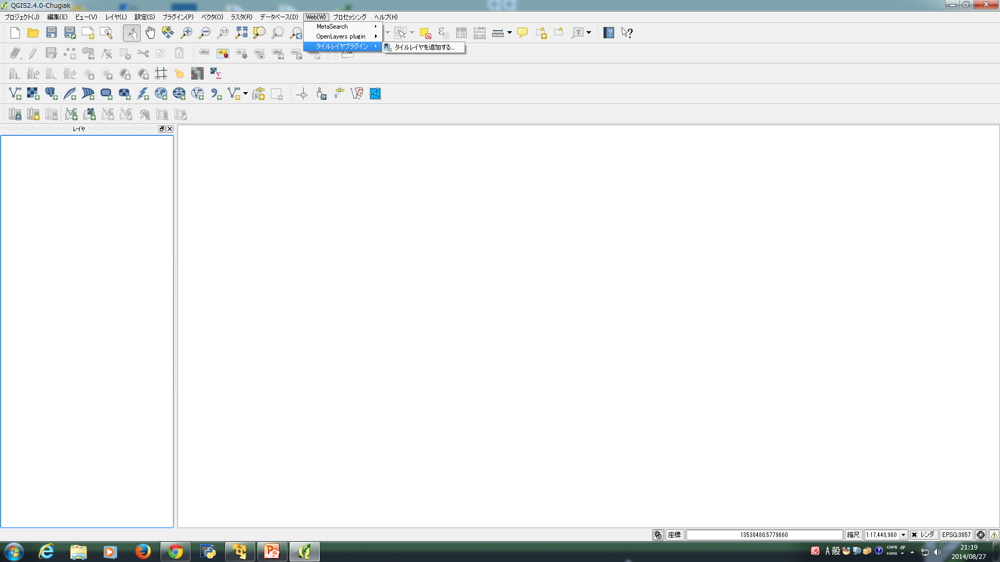.

タイルレイヤを追加するウィンドウがアクティブになります。このウィンドウ内[タイルレイヤを追加する]に表示されている「リストアイテム」から、使用したいtile地図を選択して下さい。

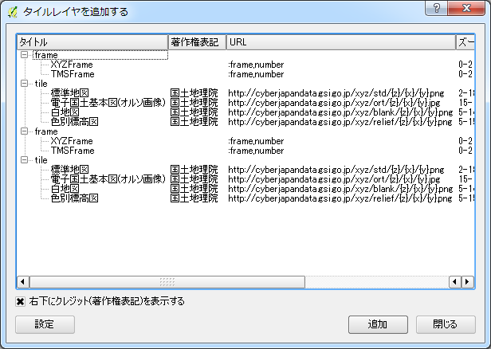.

- 標準地図

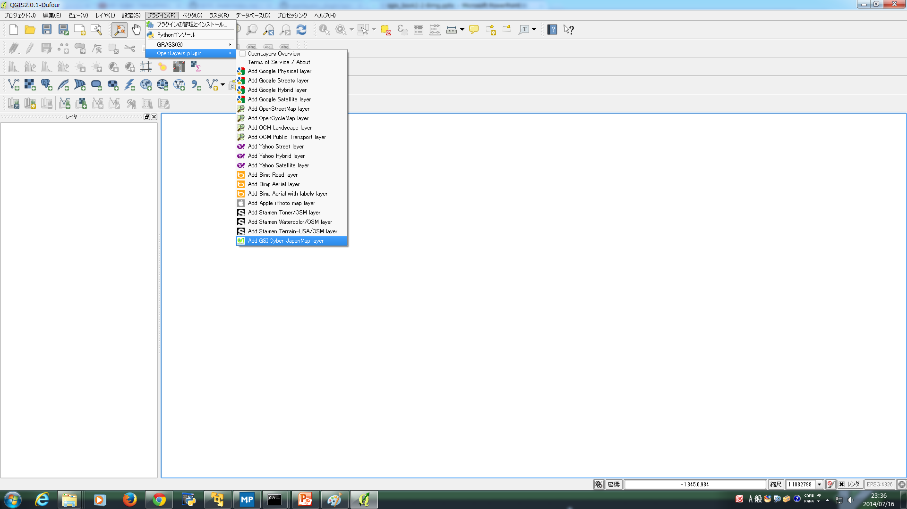.

- 白地図

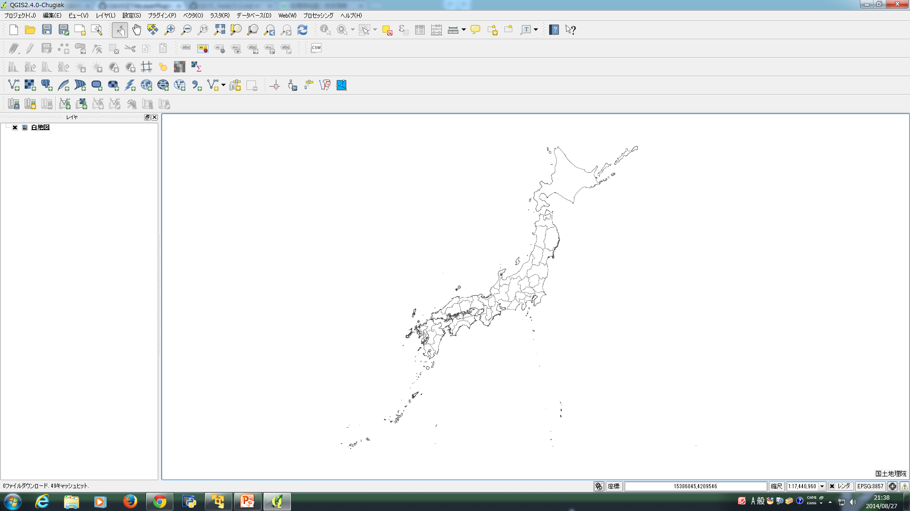.

- 色別標高図

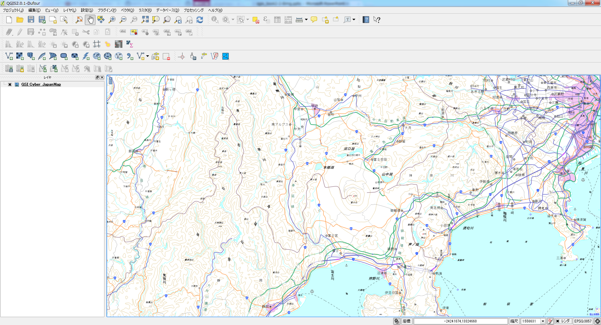.

### 空間参照システムを設定する

TileLayer Pluginを使用する場合には空間参照システムをWGS 84 / Pesudo Mercator(座標系をEPGS:3857)に設定する必要があります。

レイヤパネルにあるレイヤ上で右クリックして下さい。新規ウィンドウが表示されので【レイヤCRSを設定する(S)】をクリックして下さい。
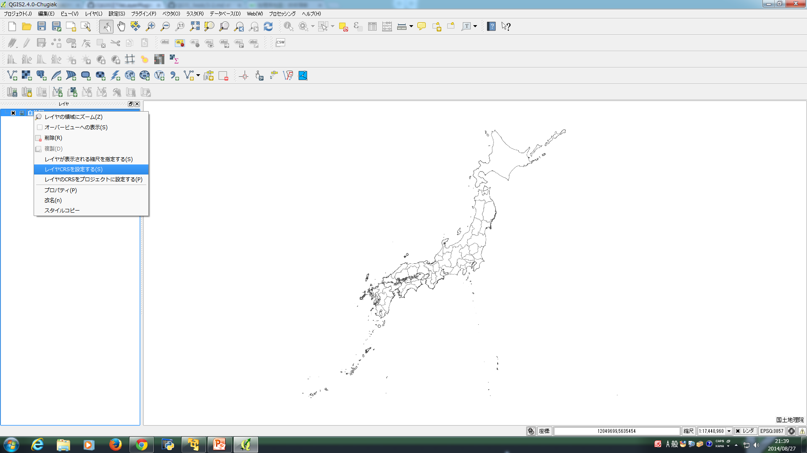.

空間参照システム選択画面が開くので、「空間参照システム」からWGS 84 / Pesudo Mercatorを選択して下さい。選択されたCRSテキストボックス内が｛空間参照システムWGS 84 / Pesudo Mercator｝であることを確認し『OK』をクリックします。

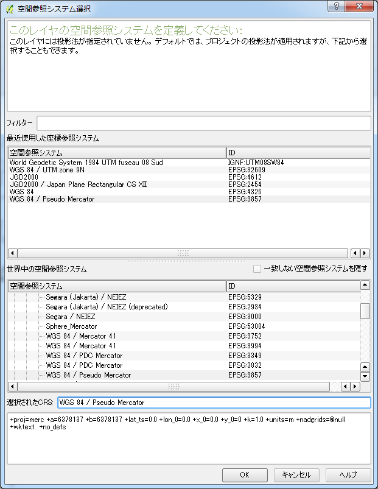.
