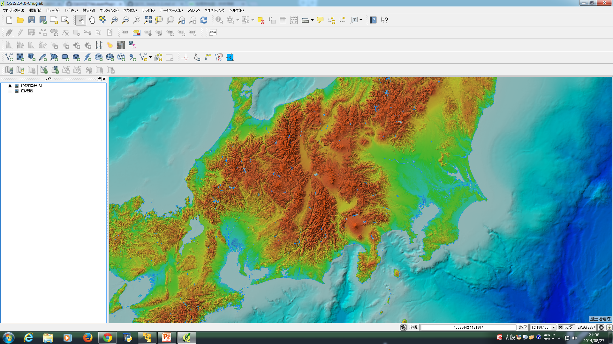

## 3.b pluginの使い方とハック

この章では、pluginを使用してOpenStreetMapを表示することと、pluginをハックして地理院地図を表示する方法を記述したいと思います。

### i pluginを使用する。

pluginを使用してレイヤーを作成してみましょう。巻末のappendix1を参考にして、プラグインの管理とインストールから、OpenLayers Pluginが入っていることを確認してください。無い場合は追加してください。

### ii openstreetmapを表示する。

.

追加後に、プラグインをクリックすると

.

図のように、OpenLayersPluginを使用することが出来ることが可能になったかと思います。プルダウンメニューからAdd OpenStreetMap layerを選択してクリックしてください。
以下のようになったかと思います。

.

Add OpenCycleMap layerを選択してクリックしてください。例えば、以下のように表示されるかと思います。また、OpenStreetMapは元来有志が編集していますが、特に、CycleMapはその中でも特に自転車が好きな人たちの手で編集しているものになります。そのため、世界全体をカバーしていないので編集が盛んなヨーロッパ地域にズームしてから見てください。

.

Add OCM Landscape layerを選択してクリックしてください。例えば、以下のように表示されるかと思います。これは建物を地図上に編集して加えられた地図になります。サイクルマップ同様に、世界全体をカバーしていないのでその点にご注意ください。添付の図は、神奈川県横浜市港北区日吉駅周辺を拡大した場合のものです。

.

Add OCM Public Transport layerを選択してクリックしてください。例えば、以下のように表示されるかと思います。これは公共交通機関を地図上に編集して加えられた地図になります。サイクルマップ同様に、世界全体をカバーしていないのでその点にご注意ください。添付の図は、東京都港区六本木駅周辺を拡大した場合のものです。

.

### iii 地理院地図を表示する

地理院地図を表示する場合に色々な方法がありますが、pluginをハックして表示できるように自分流にカスタマイズしてしてみましょう。

Windowsの場合:C:\Users\[username]\.qgis2\python\plugins
直下にダウンロードしたpluginが表示されます。今回はopenlayers_pluginをカスタマイズします。

openlayers_pluginの中は以下のようなディレクトリ構成になっているかと思います。

.

- ディレクトリ構成を確認してください
- openlayers_plugin.pyをエディターで編集します。124行目から、読み込ませる地図のレイヤー一覧が記載されているかと思います。その末尾に以下のように書き足してください。

.

```
    self.olLayerTypeRegistry.add( OlLayerType(self, 'GSI Cyber JapanMap', 'chiriin_icon.png', 'chiriin.html', True) )
```

.

書き足した後に、openlayers_plugin.pycは一度削除してください。

- chiriin.htmlを新規作成します。以下のディレクトリ構成になるように作成してください。

```
openlayers_plugin/html/chiriin.html
```

.

今回は地理院地図を利用するので、地理院で公開されている技術情報を参考にします。
http://portal.cyberjapan.jp/help/development/sample.html

- chiriin.html

```
<!DOCTYPE html>
<html>
<head>
<meta charset="UTF-8">
<title>GSI Tiles on OpenLayers 2.13.1</title>
<script src="http://portal.cyberjapan.jp/sys/OpenLayers-current/OpenLayers.js"></script>
<style>
  body {padding: 0; margin: 0}
  html, body, #map {height: 100%; width: 100%;}
  div.olControlAttribution {
    padding: 3px;
    color:#000000;
    background-color:#ffffff;
    background-color:rgba(230,255,255,0.7);
    font-size:12px;
    line-height:14px;
    bottom:5px;
    vertical-align: middle;
  }
</style>
</head>

<body>
<div id="map">
<script>
var projection3857 = new OpenLayers.Projection("EPSG:3857");
var projection4326 =  new OpenLayers.Projection("EPSG:4326");

var map = new OpenLayers.Map({
  div: "map",
  projection: projection3857,
  displayProjection: projection4326,
});

map.addLayer(new OpenLayers.Layer.XYZ("標準地図", 
  "http://cyberjapandata.gsi.go.jp/xyz/std/${z}/${x}/${y}.png", {
    attribution: "<a href='http://portal.cyberjapan.jp/help/termsofuse.html' target='_blank'>国土地理院</a>",
    maxZoomLevel: 17
}));

map.setCenter(new OpenLayers.LonLat(138.7313889, 35.3622222)
  .transform(projection4326, projection3857), 10);
</script>
</body>
</html>
```

- iconを作成する

.pngであれば、お好きな画像を使用していただいて構いません。今回は、一例として下記の画像を使用します。

.

画像の名前をchiriin.pngとしてopenlayers_pluginに以下のディレクトリ構成となるように保存してください。

```
openlayers_plugin/chiriin_icon.png
```

.

QGISを再起動し、pluginからopenlayers_pluginを選択すると、このようにpluginに地理院地図が追加されたことが確認できるかと思います。

地理院地図(標準地図)は、ズームレベルによって表示されるデータソースが異なります。そのため表示させてみると以下のようになります。

.

.

.