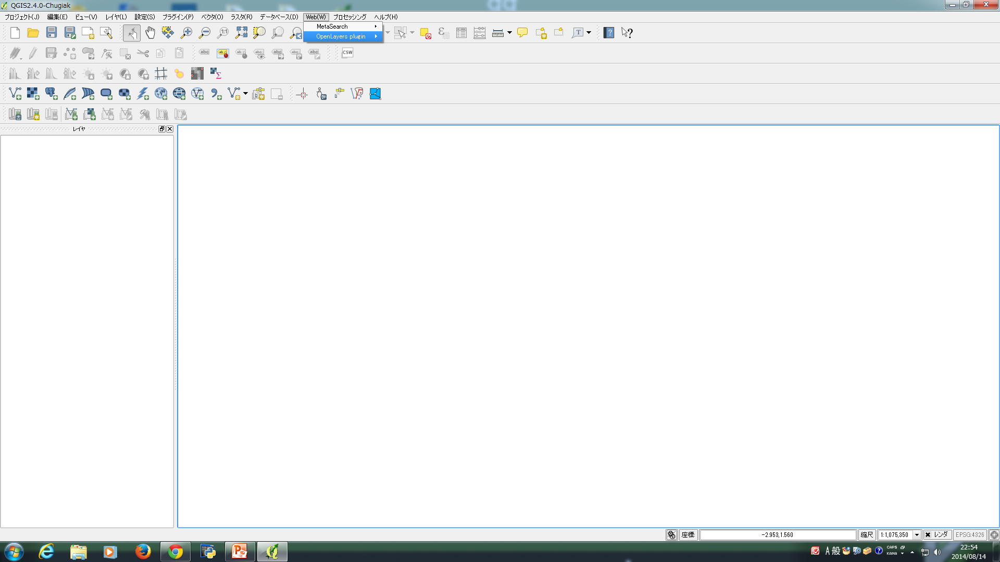
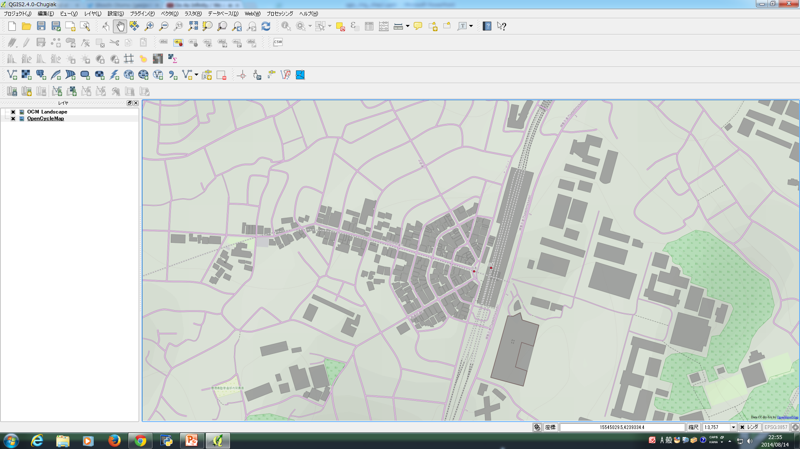
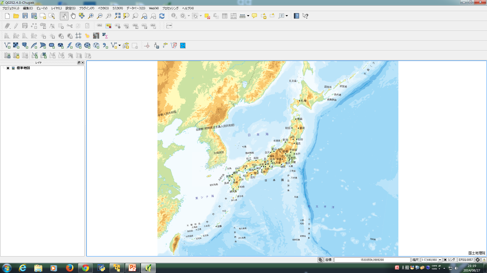

## 公開されている地図を使用する

オープンデータを使用して、目的に合わせて自分でスタイルを設定した地図を作成することができます。ただし、この方法の場合、自由度は高いのですが、

* どのデータを取得してくるか
* どういったスタイルを設定するか

といった表現作りのコツは必要になってきます。もう少し手軽な方法として、すでにスタイルが付けられて画像となってるデータを、ベースの地図として設定する方法があります。特にタイル地図(コラム参照)の形で公開されているデータは、地図の拡大率に合わせて用意済みの画像を取得することができ便利です。

* オープンストリートマップ
* 地理院地図 

を例にしながら、設定の方法と、どのような種類の地図が用意されているかを見て行きましょう。

### オープンストリートマップを使用する

QGISの追記機能として、OpenLayers Pluginがあります。この機能を使うと、QGISにオープンストリートマップ、GoogleMaps、BeingMaps、YahooMaps、AppleMapsといったWebで公開されている地図を表示することができます。
この機能を利用してオープンストリートマップを表示させます。巻末のappendix1を参考にして、【プラグイン(P)】→【プラグインの管理とインストール】をクリックし、OpenLayers Pluginが入っていることを確認してください。無い場合は追加してください。

.

追加後に、【Web(W)】をクリックします。

.

図のように、OpenLayers Pluginを使用することが可能になります。
【Web(W)】→【OpenLayersPlugin】→【OpenStreetMap】上にカーソルを置きます。これで「リストアイテム」として表示された、オープンストリートマップ及び編集を加えたオープンストリートマップが選択できます。
以下の図[オープンストリートマップ]のようになります。

.

【OpenCycleMap】を選択してクリックしてください。オープンストリートマップは有志が編集していますが、特に、OpenCycleMapはその中でも特に自転車が好きな人たちの手で編集しているものになります。そのため、世界全体をカバーしていないので編集が盛んなヨーロッパ地域にズームしてから見てください。

.

.

例えば下の図は、特にオープンサイクルマップの編集が盛んなオランダのマーストリヒト周辺を拡大してみたものになります。

.

【OCM Landscape】を選択してクリックしてください。これは建物を地図上に編集して加えられた地図になります。サイクルマップ同様に、世界全体をカバーしていないのでその点にご注意ください。添付の図は、神奈川県横浜市港北区日吉駅周辺を拡大した場合のものです。

.

【OCM Public Transport】を選択してクリックしてください。これは公共交通機関を地図上に編集して加えられた地図になります。サイクルマップ同様に、世界全体をカバーしていないのでその点にご注意ください。添付の図は、東京都港区駅三田周辺を拡大した場合のものです。

.

オープンストリートマップで提供される地図を紹介しましたが、その他の地図サービスも選択することが出来るので、試してみてください。

### 地理院地図を使用する

タイル地図を表示してくれるTileLayer Pluginという追加機能を利用して、地理院地図を表示させます。

.

TileLayer Pluginをインストールすると、以下のディレクトリにTileLayerPluginが置かれます。

```
C:\Users\[UserName]\.qgis2\python\plugins\TileLayerPlugin
```

TileLayer Pluginのディレクトリは、以下の図[タイルレイヤプラグインファイル]のファイル
で構成されています。

.


#### 設定ファイルを作成する

使用したい地理院地図を指定したTSV形式の設定ファイルを作成する必要があります。
TileLayerPluginディレクトリの中にある

- layers

というディレクトリ内に設定ファイルを追加してください。
設定ファイルには、

```
タイトル　クレジット　URL Y軸の設定(1:下から、0上から) ズームレベル最小値 ズームレベル最大値 経度最小値 経度最大値 緯度最小値 緯度最大値
```

をタブで区切って記載します。

*地理院地図の定義ファイルの例*

```
=== 国土地理院の地図タイルをQGISで利用するためのレイヤ定義ファイルの例 ===
標準地図	国土地理院	http://cyberjapandata.gsi.go.jp/xyz/std/{z}/{x}/{y}.png	1	2	18	122.78	20.4	154.78	45.58
電子国土基本図(オルソ画像)	国土地理院	http://cyberjapandata.gsi.go.jp/xyz/ort/{z}/{x}/{y}.jpg	1	15	17	122.78	20.4	154.78	45.58
白地図	国土地理院	http://cyberjapandata.gsi.go.jp/xyz/blank/{z}/{x}/{y}.png	1	5	14	122.78	20.4	154.78	45.58
色別標高図	国土地理院	http://cyberjapandata.gsi.go.jp/xyz/relief/{z}/{x}/{y}.png	1	5	15	122.78	20.4	154.78	45.58

```

設定ファイルを作成し、tile.tsvとして保存をしてください。

設定ファイルに関して、さらに他の地図を使用したい場合は作者公開のURLを参考にしてください。
- https://gist.github.com/minorua/7654132

地理院地図の利用規約や詳細な仕様に関しては国土地理院の公式ページを参照してください。
- 地理院地図　利用規約 http://portal.cyberjapan.jp/help/termsofuse.html
- 地理院タイル一覧 http://portal.cyberjapan.jp/help/development/ichiran.html
- 地理院地図 技術情報 http://portal.cyberjapan.jp/help/development/ichiran.html

一部利用規約を抜粋しておくと、
```
第5条
  地理院タイルを利用する場合には、次に従ってください。
  1　地理院タイル一覧を参照の上、基本測量成果について必要な場合には測量法第29条及び第30条による承認の申請を行ってください。
  2　著作権法第30条における私的使用に相当する範囲を越える利用に際しては出所の明示を行ってください。
  3　公の秩序若しくは善良な風俗を害する目的又は犯罪行為その他の違法な行為に用いる目的での利用はしないでください。
  4　地理院タイルを提供するサーバに過度の負荷を与えないでください。
```
となっています。利用に際しては、地理院タイル一覧から使用する地図の備考欄を参照して、基本測量成果であるかを確認しておくことは重要になります。その上で、測量成果の複製・使用にあたるかの判断が必要です。

#### TileLayerPluginを起動する

QGISを起動して、【Web(W)】→【タイルレイヤプラグイン】→【タイルレイヤを追加する】

.

タイルレイヤを追加するウィンドウが表示されます。このウィンドウ内[タイルレイヤを追加する]に表示されている「リストアイテム」から、使用したいtile地図を選択して下さい。

.

- 標準地図

.

- 白地図

.

- 色別標高図

.

#### 投影法を設定する

TileLayer Pluginを使用する場合には、投影法がWGS 84 / Pesudo Mercator(EPGS:3857)に自動的に設定されます。設定後に投影法を変更してしまった場合は、表示がされなくなってしまうので注意が必要です。
表示されなくなった場合は、投影法を元に戻しましょう。レイヤパネルにあるレイヤ上で右クリックして下さい。新規ウィンドウが表示されるので【レイヤCRSを設定する(S)】をクリックして下さい。
.

空間参照システム選択画面が開くので、「空間参照システム」からWGS 84 / Pesudo Mercatorを選択して下さい。選択されたCRSテキストボックス内が｛空間参照システムWGS 84 / Pesudo Mercator｝であることを確認し『OK』をクリックします。

.
