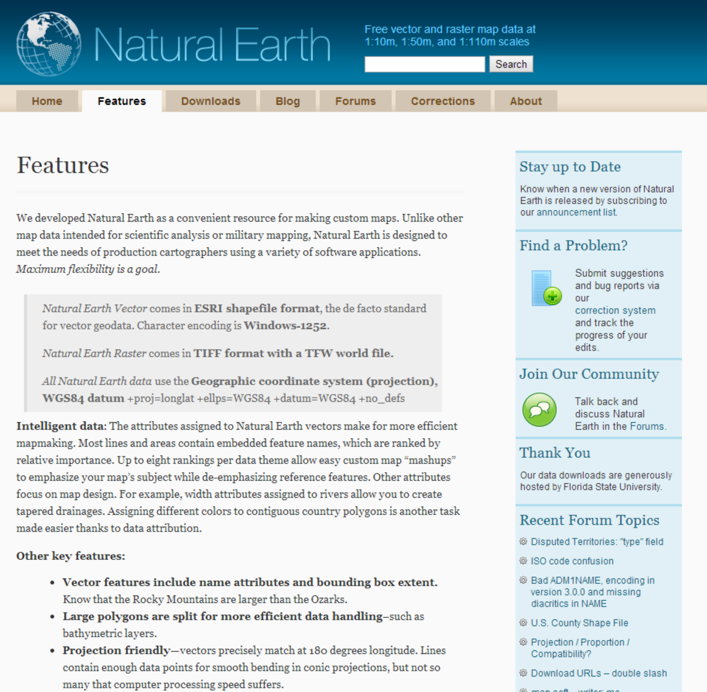
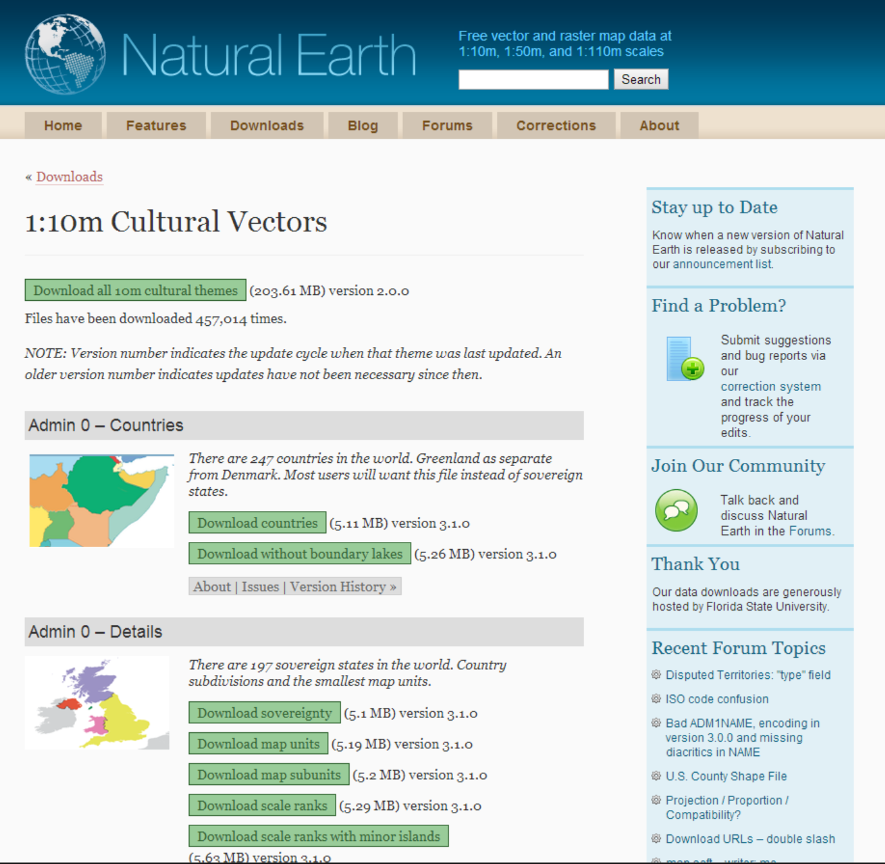

## 世界地図を作成する

ここまでは比較的大縮尺の地図データを取り扱う例について説明してきました。本章ではより小縮尺地図の例として世界地図の取り扱いについて説明します。

全世界を網羅するオープンデータはいくつかありますが、本章ではNatural Earth( http://www.naturalearthdata.com/ )を用いた例を示します。その他公開されているデータについてはAppendix Ⅱ:データカタログを参照してください。

###  データをダウンロードする

まず、Natural Earthで公開されているデータの種類を見てみましょう。〔Features〕タブをクリックするとデータについての説明が記述されているページが表示されます。

詳細についてはAppendix Ⅱ:データカタログに示しますが、概要はおおよそ以下の通りです。

 * ベクタデータのフォーマットはESRI Shapeファイル、ラスタデータのフォーマットはTIFF+TFW。
 * 座標系はすべてWGS84地理座標系
 * ライセンスはパブリックドメイン
 * 縮尺は、大縮尺（1:10,000,000）、中縮尺（1:50,000,000）、小縮尺（1:110,000,000）がある。
 * データの内容別に、道路、都市、国境等を収録したCultural Data、地形、水涯線、島嶼などを収録したPhysical Data、およびラスタデータが用意されている（ただしラスタデータは大縮尺と中縮尺のみ）。
 
その他、個別のデータについていくつか種類が分かれている場合があります。たとえばAdmin 0データでは国の分け方についていくつかのデータが用意されています。
データのダウンロードページは〔ダウンロード〕タブをクリックすると表示されます。

ダウンロードページのトップには縮尺別、カテゴリ別にデータへのリンクがあり、それぞれのリンクをクリックすると個別のデータのダウンロードページが表示されます。下図はAdmin 0データのページです。

各データにダウンロードリンクとデータの説明へのリンクがあるので、よく読んでおきましょう。

### ファイルを開く

ダウンロードされるファイルはラスタデータ、ベクタデータともにZIP圧縮形式です。QGISで読み込む前に展開しておく必要があります。

Natural Earthで提供されているデータは多岐にわたります。これらをすべて読み込んで表示させると煩雑な地図になってしまうので、目的によって表示させるデータを絞り込んだほうが結果として見やすい地図ができるでしょう。
本章ではラスタデータの「Natural Earth I with Shaded Relief and Water」を背景図とし、Cultural Vectorデータの「Admin 0 – Details」、「Populated Places」、「Roads」、「Urban Areas」、さらにPhysical Vectorデータの「Rivers + lake centerlines」、「Physical Labels」を使用して地図帳風に表示してみます。

### レイヤ毎にスタイルを設定

まず、表示の優先順位を決定します。すなわち、優先順位が低いレイヤが優先順位を高く設定したレイヤの表示を邪魔しないようにする必要があります。ここではなるべく自然地物を優先するものとします。

続く、、