##a. 防災・減災・安全に役立つ地図を作成する

###1. 防災・減災・安全に役立つ地図を作成するためにデータをダウンロードしましょう。

今回は題材として、北海道室蘭市で提供するオープンデータを利用して、防災・減災に関する地図を作成してみましょう。
データに関しては下記リンクより最新のものが提供されています。

- http://www.city.muroran.lg.jp/main/org2260/odlib.php

画面中段のオープンデータのダウンロードより、Shape(ZIP:データ容量)と記載されているものをダウンロードして保存してください。
データのダウンロード時に、ダウンロードしたファイル名がデータ名と異なるので、公式ページに記載されている内容を一部を変更して以下に対応表を記載します。

|ジャンル|データ名|説明|ダウンロード時のファイル名|
|------|------|----|-----------|
|地図|都市計画現況図平成12年版|都市計画現況図を1レイヤに統合してあります<br>ページ下部の注意事項をご覧下さい|DM_H23_20131211.zip |
|地図|都市計画現況図平成12年版　レイヤ別|都市計画現況図を分類ごとにレイヤを分けたものです<br>ページ下部の注意事項をご覧下さい|DM_H12_Layer_20131211.zip|
|地図|都市計画現況図平成23年版|都市計画現況図を1レイヤに統合してあります<br>ページ下部の注意事項をご覧下さい|DM_H23_20131211.zip|
|地図|都市計画現況図平成23年版　レイヤ別|都市計画現況図を分類ごとにレイヤを分けたものです<br>ページ下部の注意事項をご覧下さい|DM_H23_Layer_20131211.zip|
|安全|AED設置事業所|AED(自動体外式除細動器)を設置している事業所|aed_20140618.zip|
|安全|砂箱|砂箱を設置している場所|sunabako_20140220.zip|
|防災|避難場所|災害時の避難場所|hinanbasyo_20130826.zip|
|防災|津波浸水深さ|津波で浸水する深さの予測図|tsunami_20130826.zip|
|防災|洪水浸水深さ|洪水で浸水する深さの予測図|flood_20130826.zip|
|防災|津波避難目標地点|津波の避難の際に目指すべき目標地点|tsunamimokuhyo_20130826.zip|
|防災|津波避難路|津波避難目標地点から避難場所までの経路|tsunamikeiro_20130826.zip|
|防災|土砂災害警戒区域(急傾斜地)|　|dosya_keisya_20130826.zip|
|防災|土砂災害警戒区域(土石流)|　|dosya_dosekiryu_20130826.zip|
|防災|土砂災害警戒区域(未指定急傾斜地)|　|dosya_mi_keisya_20130826.zip|
|防災|土砂災害特別警戒区域(急傾斜地)|　|dosyatk_keisya_20130826.zip|
|防災|土砂災害特別警戒区域(土石流)|　|dosyatk_dosekiryu_20130826.zip|
|防災|土砂災害特別警戒区域(未指定急傾斜地)|　|dosyatk_mi_keisya_20130826.zip|
|防災|がけ崩れ危険区域|　|gake_20130826.zip|
|防災|がけ崩れ危険区域(対策済)|　|gakezumi_20130826.zip|
|防災|土石流危険区域|　|dosekiryu_20130826.zip|

今回は作業用に必要なzipファイルを一つのフォルダにまとめ、そのフォルダをmuroran_dataとしました。muroran_dataフォルダ内に必要なzipファイルを展開しました。

図1 [フォルダ構成] のようなフォルダ構成になります。
.

###2. 点要素のスタイル --point--

点要素のスタイルと言われてもピンと来ないかもしれません。例を挙げると○○の設置場所、避難所等が点要素のスタイルとして定義されるのが一般的です。ベクターデータを新規レイヤとして追加します(操作方法についてはAppendix Iを参照のこと)。先ほど展開したデータの中から、sunabako.shpを追加します。図2 [砂箱ポイント] のようになります。

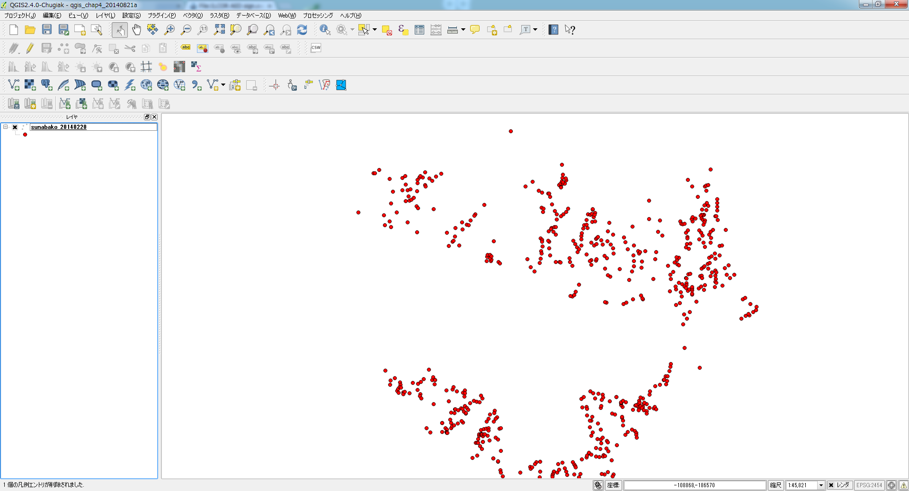.

同様に、aed_20140618.shpを追加します。

すると、図3 [AEDポイント]のようになります。
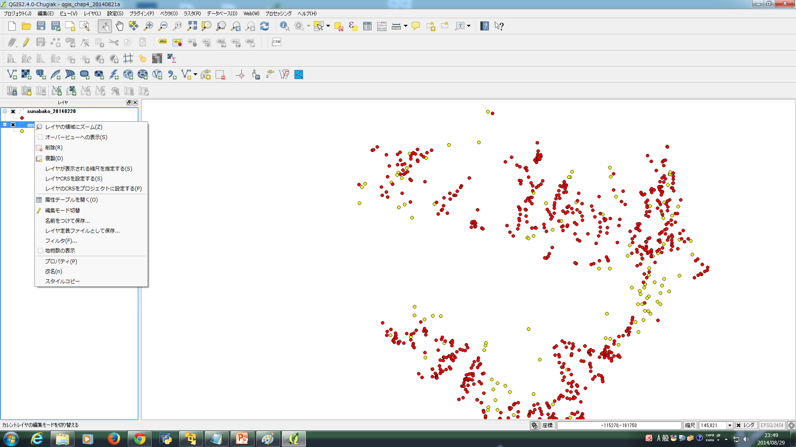.

次に、レイヤパネルのaed_20140618上で右クリック→【レイヤのプロパティ】

図4 [レイヤプロパティ]のようになります。
.

【airport】をクリックしてください。

図5 [レイヤプロパティsvg]のようになります。
.

『SVGマーカー』をクリックすると、SVGグループが表示されます。

図6 [SVGグループ]
.

『SVGグループ』→『gpsicons』→SVGイメージ内『cross.svg』をクリックし、画面右下の『OK』をクリックしてください。

図7 [SVG_gisicons]
.

アイコンのプロパティ変更が反映され、aedのアイコンが図8 [cross_icon]になります。

図8 [cross_icon]
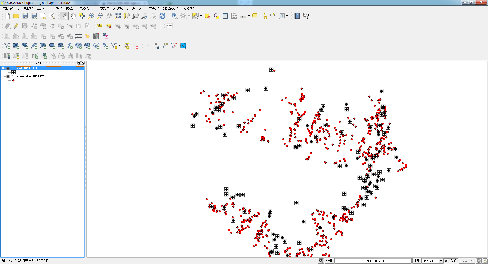.

#### アイコンのユーザー定義

hinanbasyo.shpを追加します。

レイヤパネルのhinanbasyo.shp上で、右クリック→【レイヤのプロパティ】

図9 [ユーザー定義SVG]を参照してください。
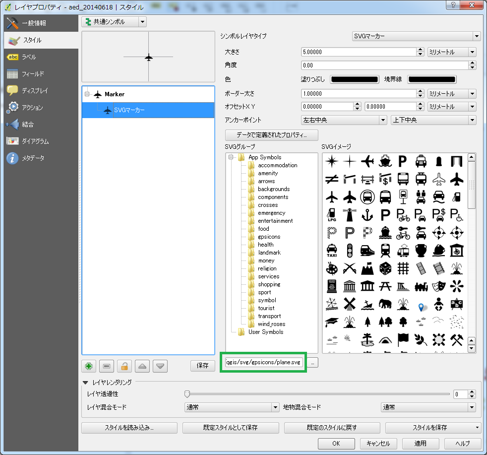.
{緑色枠線内}に

```
http://upload.wikimedia.org/wikipedia/commons/4/43/ILCOR_AED_sign.svg
```
と入力し、『保存』をクリックしてください。

図10 シンボルの入力画面になります。

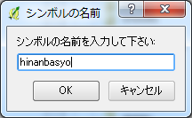.

テキストボックス内{hinanbasyo}と入力し、『OK』をクリックしてください。

図11 避難場所SVG

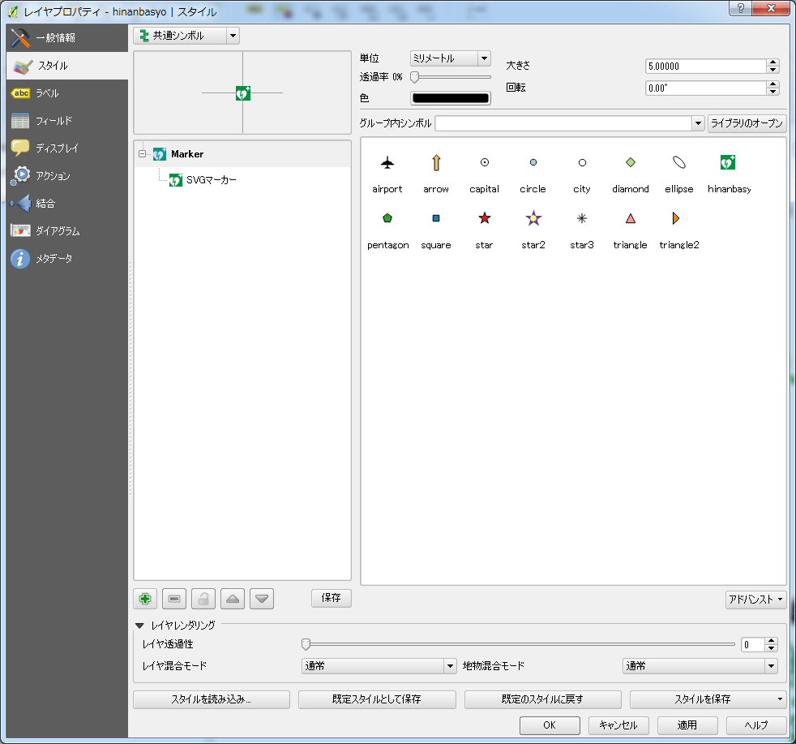.

SVGマーカーのアイコンが変わります。
『hinanbasyo』をクリックして、『OK』をクリックしてください。

図12 ![避難場所MAP]
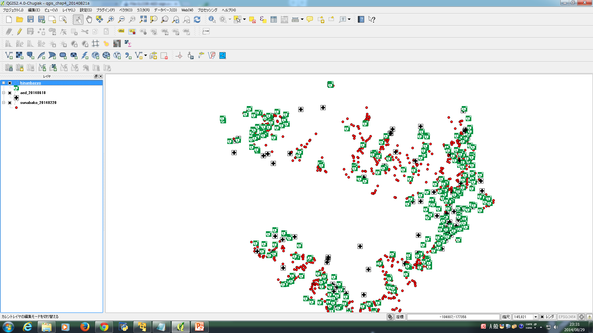.
避難場所のアイコンが、ユーザー定義のものに変更されます。

###3. 線要素のスタイル --line--

線要素のスタイルにはどのようなものがあるでしょうか、一般的には、鉄道や道路、河川などが挙げられると思います。では、線要素のベクターデータを前項の点データと重ねてみます。

道路データと鉄道のデータを追加してみましょう。
- DM_H23_douro_20131211.shp
- DM_H23_tetsudo_20131211.shp

図14 道路と鉄道プロパティ変更前MAP
.

レイヤパネルのDM_H23_tetsudo_20131211上で右クリック、レイヤプロパティ内で『Cycle path』をクリック後、『OK』をクリックしてください。

図15 鉄道ラインプロパティ定義
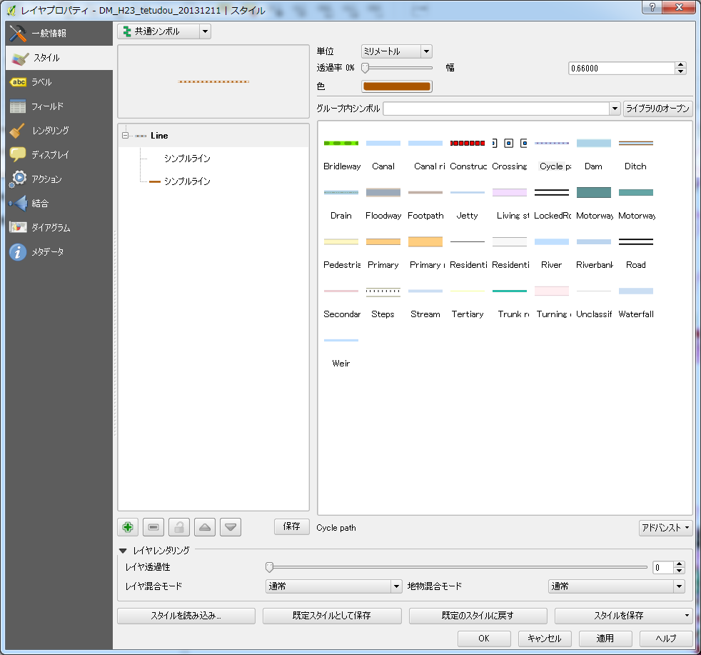.

図16 道路と鉄道プロパティ変更後MAP
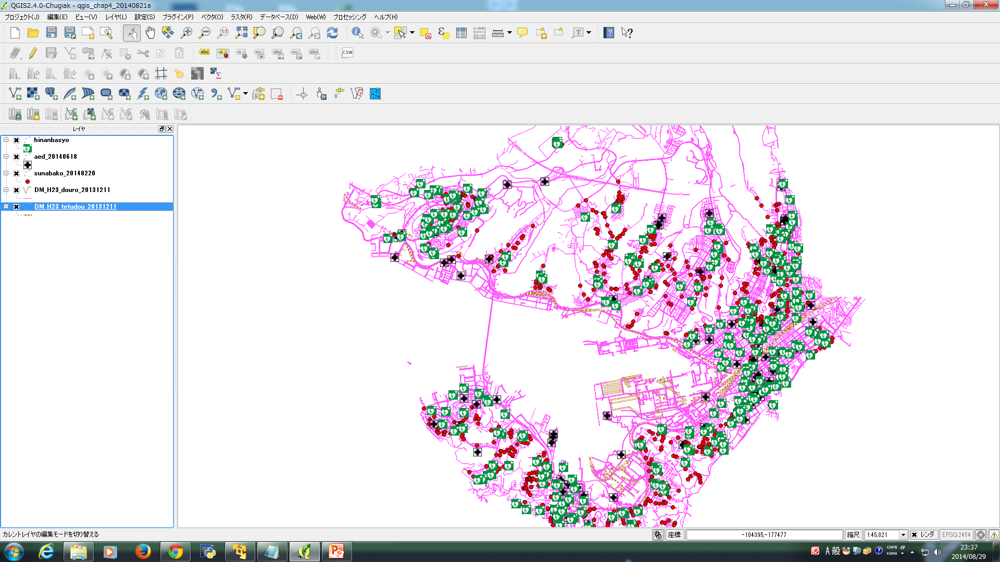.


###4. 面要素のスタイル --polygon--

面要素のスタイルにはどのようなものがあるでしょうか、例えば公園やポイントとしての建物ではなく、建物そのものは本来ポリゴンで描かれます。また、災害ということであれば、津波や洪水による、浸水地域などもポリゴンで描かれます。今回は土砂崩れに関するデータがあるので、これを使用して土砂災害が起こった場合を想定してみます。

以下の4つのファイルをベクターデータとして追加してください。

- dosekiryu_20130826.shp
- dosya_keisya_20130826.shp
- dosya_dosekiryu_20130826.shp
- dosya_mi_keisya_20130826.shp

図17 [土石流]
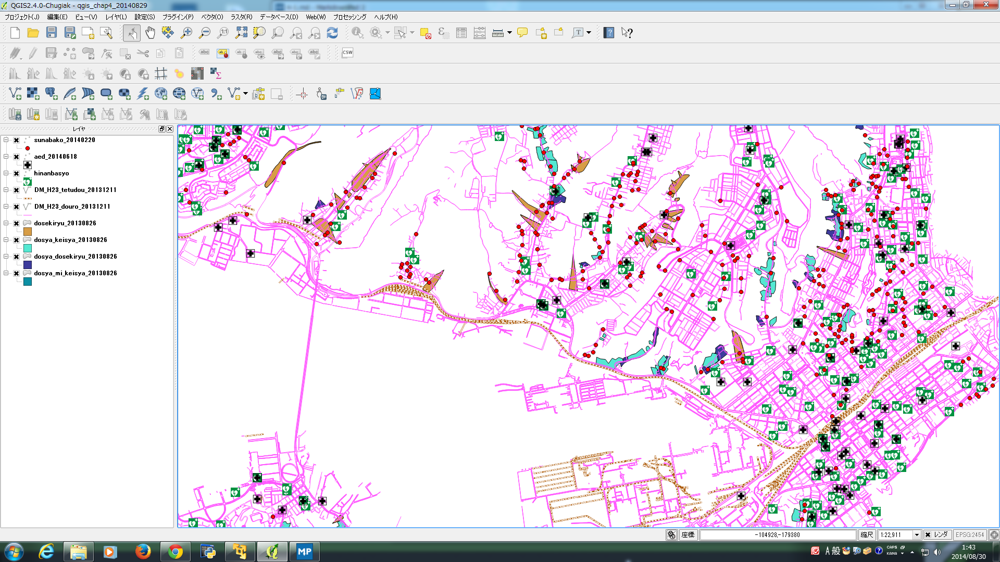.

さて、ただ表示するだけでは、あまり意味がないので土砂災害が起こった場合に、通行できなくなる可能性がある区間を算出して描画してみましょう。

コントロールパネルのベクタから、空間演算ツールを選択して、表示された〔ドロップダウンリスト〕から「交差」を選択してください。勘の良い方は「交差」と「クリップ」が同じアイコンで描かれていることに気づかれたかと思います。
この両者は地図ビュー上に表示される結果は等しいのですが、以下のような違いがあります。

- 交差
 - 2つのレイヤの共通部分が新しいレイヤとして作成される。結果のジオメトリは交差する双方の属性値が保存される。

- クリップ
 - 2つのレイヤの共通部分が新しいレイヤとして作成される。結果のジオメトリは先に指定したレイヤの属性値だけが保持される。

図18
.

交差をクリックすると、以下のようなウィンドウが開きます。

図19
.

重ね合わせたいレイヤを二つ選択すれば良いです。当然ですが、入力ベクタレイヤと交差レイヤに同じレイヤを選択しないでください。共通部分のくり抜いたレイヤは、新規のシェープファイルとして定義されるので、『ブラウズ』をクリックして保存先となるディレクトリを選択してください。

図20
.

新規に作成されるシェープファイルに名前を付けて保存します。後々分かりにくくならないように、シンプルな命名規則のものがいいでしょう。今回はmuroran_dataディレクトリの中に、ファイル名を｛douro_dosekiryu.shp｝として保存しました。

OKボタンを押すと、新規シェープファイルの作成が始まります。

図21
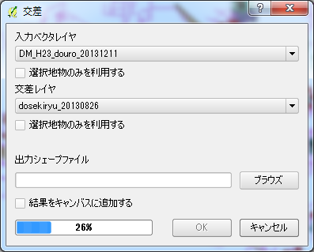.


新規に作成した、douro_dosekityu.shpを新たに追加してみます。

図22
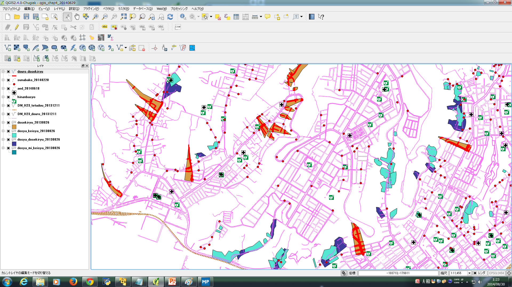.

図中の赤線部分の道路は、土石流の危険地域と重複する道路であることが分かるかと思います。


次に、浸水深のデータを読み込み、深さ毎に色分けを行います。

- flood_20130826.shp

を読み込んでください。この時、ソースタイプ内のエンコーディング指定欄内は〔SJIS〕を選択して下さい。

図23
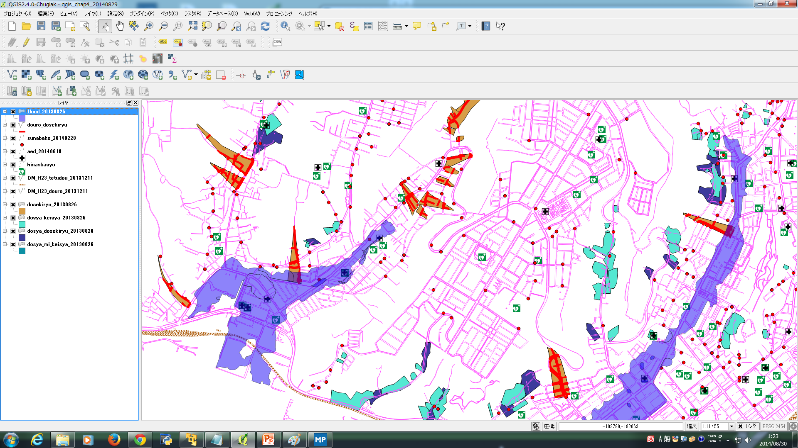.

レイヤパネルで右クリックを行い【プロパティ】を選択してください。
図24
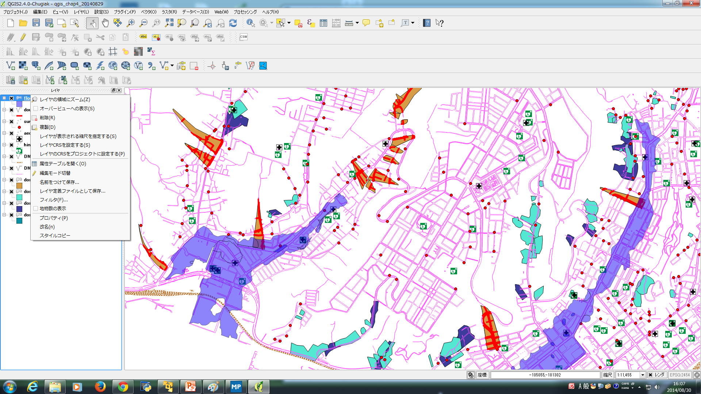.

レイヤプロパティウィンドウが開くので、図25『共通シンボル』をクリックし、図26『分類された』に変更してください。

図25
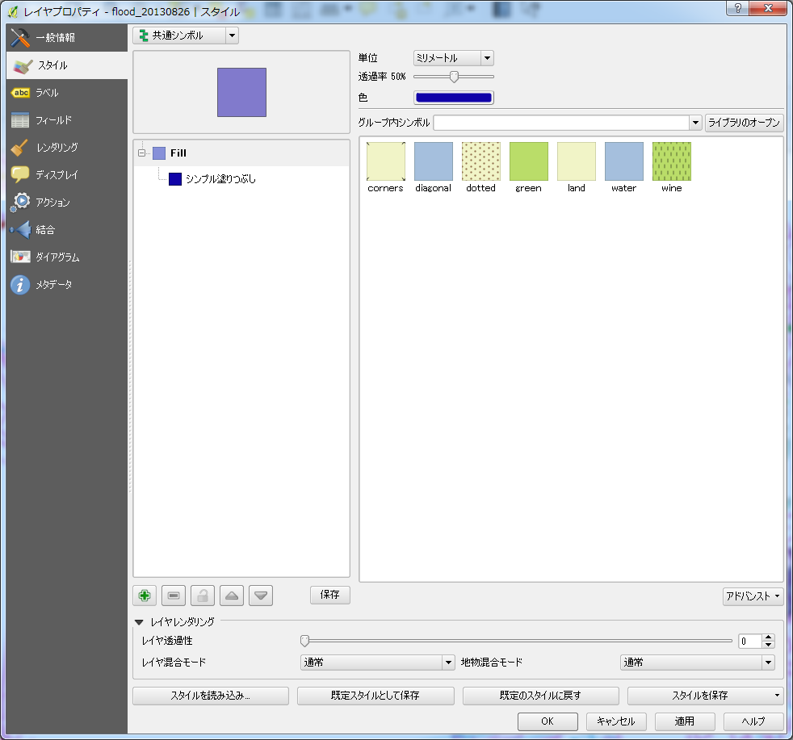.
図26
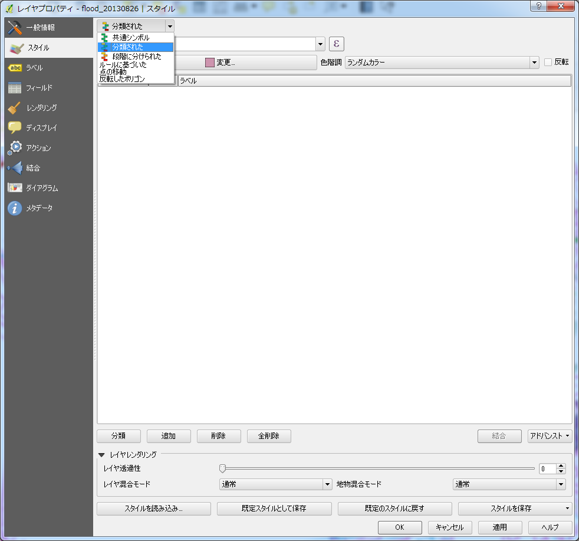.

カラムは〔浸水深さ〕を選択して下さい。
基本的に単一の指標を色相別に分解して表示する場合は、単一の色階調を選択してください。今回は、Bluesを選択しました。
図27
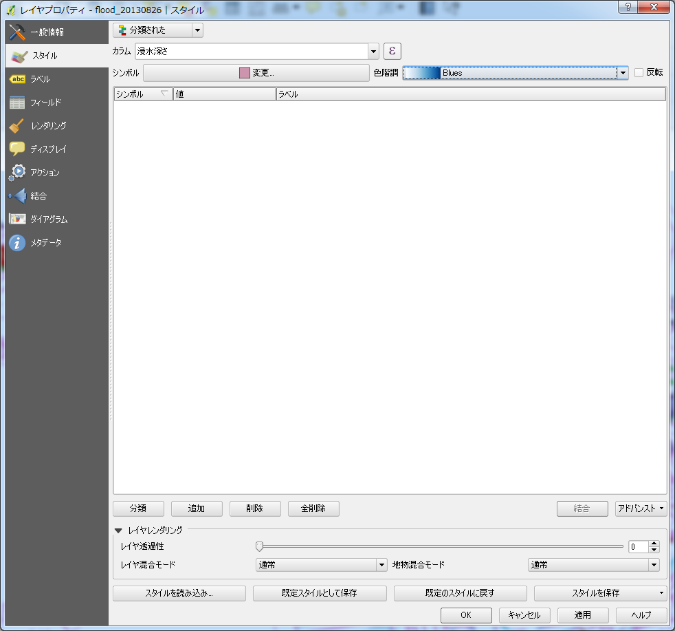.

『分類』をクリックすると、図28の様に水深によって色分けされます。
図28
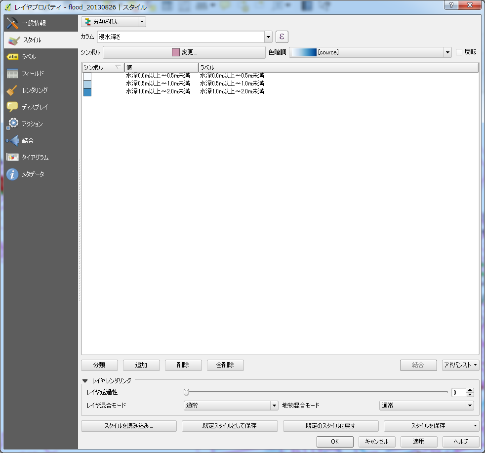.

『OK』をクリックします。
読み込んだ水深のデータが水深別に色分けされ、地図ビューに反映され図29のようになります。

図29
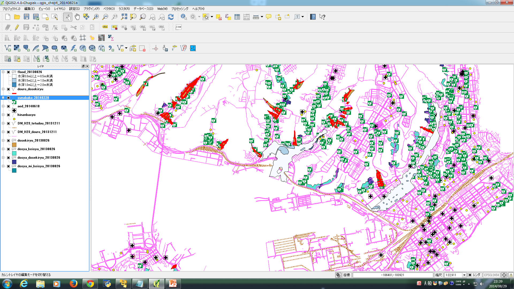.

なお、国土交通省 国土技術政策総合研究所の発表では、浸水深の目安を以下のように発表しています。

|浸水深|浸水程度の目安|
|:----|:----|
|0～0.5m|大人の膝までつかる（床下浸水）|
|0.5～1.0m|大人の顔までつかる（床上浸水）|
|1.0～2.0m|1階の軒下まで浸水する|
|2.0～5.0m|2階の軒下まで浸水する|
|5.0m以上|2階の屋根以上が浸水する|

国土交通省 国土技術政策総合研究所
- http://www.nilim.go.jp/lab/rcg/newhp/yougo/words/043/html/043_main.html