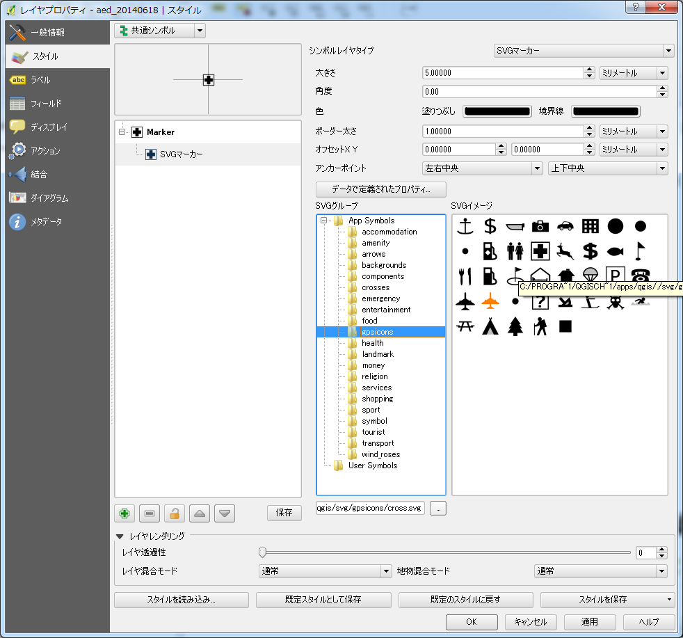
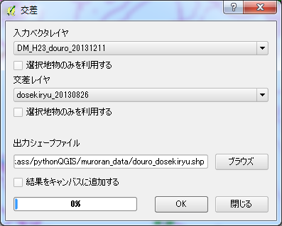
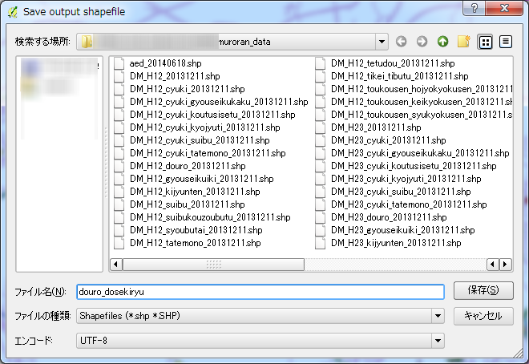

##a. 防災・減災・安全に役立つ地図を作成する

###1. 防災・減災・安全に役立つ地図を作成するためにデータをダウンロードしましょう。

今回は題材として、北海道室蘭市で提供するオープンデータを利用して、防災・減災に関する地図を作成してみましょう。
データに関しては下記リンクより最新のものが提供されております。

- http://www.city.muroran.lg.jp/main/org2260/odlib.php

画面中段のオープンデータのダウンロードより、Shape(ZIP:データ容量)と記載されているものをダウンロードして保存してください。
データのダウンロード時に、ダウンロードしたファイル名がデータ名と異なるので、公式ページに記載されている内容を一部を変更して以下に対応表を記載します。

|ジャンル|データ名|説明|ダウンロード時のファイル名|
|------|------|----|-----------|
|地図|都市計画現況図平成12年版|都市計画現況図を1レイヤに統合してあります ページ下部の注意事項をご覧下さい|DM_H23_20131211.zip |
|地図|都市計画現況図平成12年版　レイヤ別|都市計画現況図を分類ごとにレイヤを分けたものです ページ下部の注意事項をご覧下さい|DM_H12_Layer_20131211.zip|
|地図|都市計画現況図平成23年版|都市計画現況図を1レイヤに統合してあります ページ下部の注意事項をご覧下さい|DM_H23_20131211.zip|
|地図|都市計画現況図平成23年版　レイヤ別|都市計画現況図を分類ごとにレイヤを分けたものです ページ下部の注意事項をご覧下さい|DM_H23_Layer_20131211.zip|
|安全|AED設置事業所|AED(自動体外式除細動器)を設置している事業所|aed_20140618.zip|
|安全|砂箱|砂箱を設置している場所|sunabako_20140220.zip|
|防災|避難場所|災害時の避難場所|hinanbasyo_20130826.zip|
|防災|津波浸水深さ|津波で浸水する深さの予測図|tsunami_20130826.zip|
|防災|洪水浸水深さ|洪水で浸水する深さの予測図|flood_20130826.zip|
|防災|津波避難目標地点|津波の避難の際に目指すべき目標地点|tsunamimokuhyo_20130826.zip|
|防災|津波避難路|津波避難目標地点から避難場所までの経路|tsunamikeiro_20130826.zip|
|防災|土砂災害警戒区域(急傾斜地)|　|dosya_keisya_20130826.zip|
|防災|土砂災害警戒区域(土石流)|　|dosya_dosekiryu_20130826.zip|
|防災|土砂災害警戒区域(未指定急傾斜地)|　|dosya_mi_keisya_20130826.zip|
|防災|土砂災害特別警戒区域(急傾斜地)|　|dosyatk_keisya_20130826.zip|
|防災|土砂災害特別警戒区域(土石流)|　|dosyatk_dosekiryu_20130826.zip|
|防災|土砂災害特別警戒区域(未指定急傾斜地)|　|dosyatk_mi_keisya_20130826.zip|
|防災|がけ崩れ危険区域|　|gake_20130826.zip|
|防災|がけ崩れ危険区域(対策済)|　|gakezumi_20130826.zip|
|防災|土石流危険区域|　|dosekiryu_20130826.zip|

今回は作業用に必要なzipファイルを一つのフォルダにまとめ、そのフォルダをmuroran_dataとしました。muroran_dataフォルダ内に必要なzipファイルを展開しました。

下記の図のようなフォルダ構成になるかと思います。
.

###2. 点要素のスタイル --point--

点要素のスタイルと言われてもピンと来ないかもしれません。例を挙げると○○の設置場所、避難所等が点要素のスタイルとして定義されるのが一般的です。ベクターデータを新規レイヤとして追加します(操作方法についてはAppendix Iを参照のこと)。先ほど展開したデータの中から、hinanbasyo.shpを追加します。以下の図のようになりましたか。

.

同様に、aed_20140618.shp追加してみましょう。

.

さらに、sunabako_20140220.shpを追加してみましょう。

.

このように、点要素のデータはビューのレイヤパネルに小さな〇が記載されていることを確認してください。

.

見やすいようにカラーを変更したい場合はAppendix Iのレイヤにスタイルを設定するを参照してください。

###3. 線要素のスタイル --line--

線要素のスタイルにはどのようなものがあるでしょうか、一般的には、鉄道や道路、河川などが挙げられると思います。それではベクターデータを前項の点データと重ねてみましょう。

まず初めに道路データを追加してみましょう。道路データはDM_H23_douro_20131211.shpになります。

.

次に、鉄道のデータを追加してみましょう。鉄道のデータはDM_H23_tetsudou_20131211.shpになります。

.

見にくい場合や、ポイントデータが隠れてしまう場合などはレイヤパネルのレイヤの順序を入れ替えてみましょう。ドラッグしたままレイヤの順位を変更すると、地図ビューに変更が反映されます。

.

また、線要素のデータはビューのレイヤパネルに細い線が記載されていることを確認してください。

###3. 面要素のスタイル --polygon--

面要素のスタイルにはどのようなものがあるでしょうか、例えば公園やポイントとしての建物ではなく、建物そのものは本来ポリゴンで描かれます。また、災害ということであれば、津波や洪水による、浸水地域などもポリゴンで描かれます。今回は土砂崩れに関するデータがあるので、これを使用して土砂災害が起こった場合を想定してみましょう。

以下の4つのファイルをベクターデータとして追加しておいてください。

- dosekiryu_20130826.shp
- dosya_keisya_20130826.shp
- dosya_dosekiryu_20130826.shp
- dosya_mi_keisya_20130826.shp

.

上図のように表示されたかと思います。また、下図に示したようにポリゴンのレイヤはレイヤパネル上では四角形で表現されていることが分かるかと思います。

.

さて、ただ表示するだけでは、あまり意味がないので土砂災害が起こった場合に、通行できなくなる可能性がある区間を算出して描画してみましょう。

コントロールパネルのベクタから、空間演算ツールを選択して、表示されたドロップダウンリストから「交差」を選択してください。勘の良い方は「交差」と「クリップ」が同じアイコンで描かれていることに気づかれたかと思います。
この両者は地図ビュー上に表示される結果は等しいのですが、以下のような違いがあります。

- 交差
 - 2つのレイヤの共通部分が新しいレイヤとして作成される。結果のジオメトリは交差する双方の属性値が保存される。

- クリップ
 - 2つのレイヤの共通部分が新しいレイヤとして作成される。結果のジオメトリは先に指定したレイヤの属性値だけが保持される。

.

交差をクリックすると、以下のようなウィンドウが開くかと思います。

.

重ね合わせたいレイヤを二つ選択すれば良いです。当然ですが、入力ベクタレイヤと交差レイヤに同じレイヤを選択しないでください。共通部分のくり抜いたレイヤは、新規のシェープファイルとして定義されるので、ブラウズをクリックして保存先となるディレクトリを選択してください。

.

新規に作成されるシェープファイルに名前を付けて保存します。後々分かりにくくならないように、シンプルな命名規則のものがいいでしょう。今回はmuroran_dataディレクトリの中に、douro_dosekiryu.shpとして保存しました。

OKボタンを押すと、新規シェープファイルの作成が始まります。

.

新規に作成した、douro_dosekityu.shpを新たに追加してみましょう。

.

図中の赤線部分の道路は、土石流の危険地域と重複する道路であることが分かるかと思います。

### 4.保存

コントロールパネルの保存から、名前を付けて保存を実行してください。

.

名前を付けて保存する際に[保存する時の名前].qgsというファイルネームで保存されます。データまでのパスや座標系などの定義が記述されていますが、これはデータそのものを持っていません。そのため、この.qgsファイルだけを渡しても共同編集等は行えないことや、異なるPCで参照した際にデータの格納場所が異なると参照できない場合が多いので、注意してください。

.