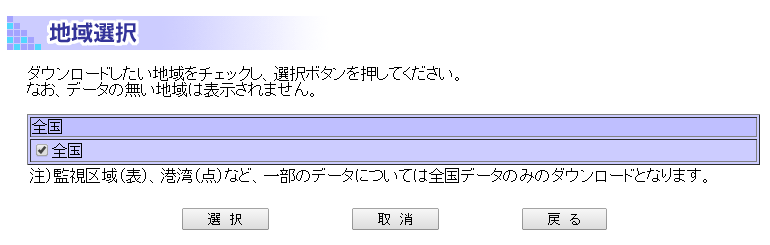
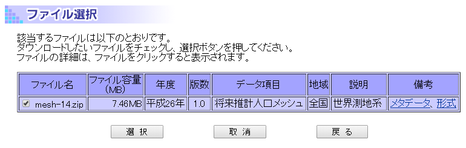
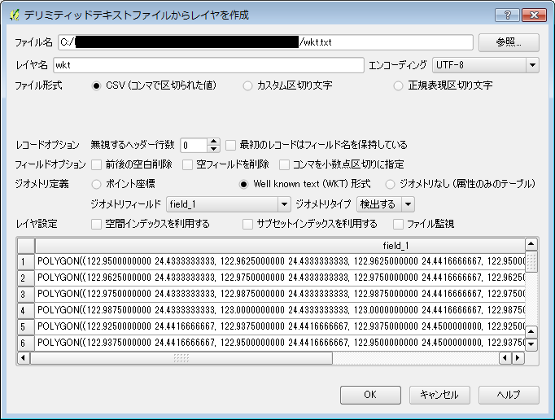
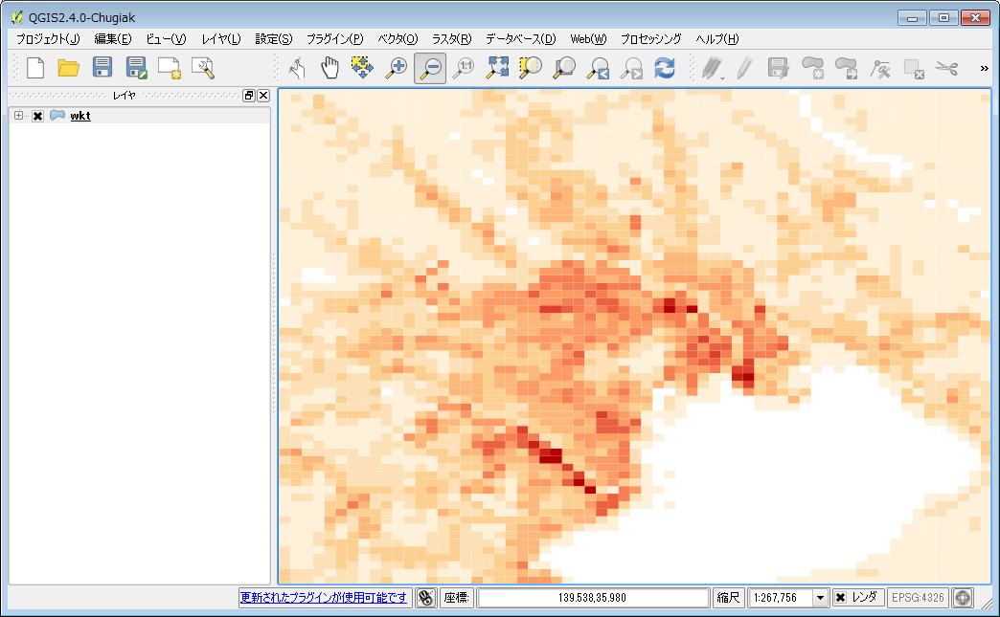

###標準地域メッシュコードとは？ - 2050年の人口予想図を作成する
####標準地域メッシュコード
統計情報を見る際に、行政区画の単位で見てしまうと、各区画の面積が違うため情報を見誤ってしまうことがあります。広い行政区画と狭い行政区画の統計情報を単純に比較するとこは出来ませんし、それぞれの行政区画内でも統計情報の偏りはあるはずです。同じ大きさの区画に区切ってあげた方が傾向を見るためには便利な場合が多々あります。使用する区画も独自のものにするのではなく、標準的に決められている方が、年度間の比較、他の統計情報と合わせての解析の際に便利になります。国の機関から出される統計情報や地図情報の区画には、*標準地域メッシュコード*が使用されています。  
標準地域メッシュコードは決められた緯度経度で分割された、いくつかのレベルが定義されています。例えば、第1次地域区画(1次メッシュ)は、緯度差40分、経度差1度の区画になります。南西端の経緯度からメッシュコードを計算することが出来ます。第2次地域区画(2次メッシュ)は第1次地域区画を緯線方向及び経線方向に8等分して出来る区画で、緯度差5分、経度差7分30秒となります。他のレベルの区画定義と合わせて、下記の表を参照してください。

* 標準地域メッシュコードの定義*

|区画|上位区画との関係|緯度差|経度差|区画の距離|メッシュコード|
|----|---------------|------|------|---------|-----------|
|第1次地域区画(1次メッシュ)|　|40分|1度|約80km|4桁の数字、上2桁が緯度(度)*1.5して小数点以下は切り捨て、下2桁が経度(度)-100|
|第2次地域区画(2次メッシュ)|第１次地域区画を緯線、経線方向に8等分|5分|7.5分|約10km|6桁の数字、1次メッシュ(4桁)に続いて、緯線方向南から北に0-7、経線方向西から東に0-7|
|第3次地域区画(3次メッシュ)|第２次地域区画を緯線、経線方向に10等分|30秒|45秒|約1km|8桁の数字、2次メッシュ(6桁)に続いて、緯線方向南から北に0-9、経線方向西から東に0-9|
|2分の1地域メッシュ|第3次地域区画を緯線、経線方向に2等分|15秒|22.5秒|約500m|9桁の数字、3次メッシュ(8桁)に続いて、南西メッシュを1、南東メッシュを2、北西メッシュを3、北東メッシュを4|
|4分の1地域メッシュ|2分の1地域メッシュを緯線、経線方向に2等分|7.5秒|11.25秒|約250m|10桁の数字、2分の1地域メッシュ(9桁)に続いて、南西メッシュを1、南東メッシュを2、北西メッシュを3、北東メッシュを4|

####人口予想図を作成してみる
実際に、地域メッシュコードを用いているオープンデータを可視化してみましょう。  
国土数値情報から将来推計人口メッシュがダウンロード出来ますので、これを使用します。国土数値情報のページでデータ形式[統一フォーマット(csv)]を選択します。

<将来推計人口メッシュ>にチェックを入れて『選択』に進みます。地域選択に進みますが、全国一括での提供となっていますので、<全国>にチェックを入れて『選択』します。

ファイル選択になりますが、ここでも選べるのは全国だけですので、ファイル名のところにチェックを入れて『選択』してください。アンケートに答えて、利用規約に同意すると、データをダウンロード出来ます。

データは少々大きいのですが、解凍するとcsvファイルが入っています。ファイル先頭のデータの説明を除くと実データとしては、

*将来推計人口メッシュデータ内容*

    36225726,-,-,-,-,-,-,-,-,-,-,-,-,-,-,-
    36225727,-,-,-,-,-,-,-,-,-,-,-,-,-,-,-
    36225728,-,-,-,-,-,-,-,-,-,-,-,-,-,-,-
    36225729,-,-,-,-,-,-,-,-,-,-,-,-,-,-,-
    36225734,-,-,-,-,-,-,-,-,-,-,-,-,-,-,-
    36225735,47382,54,22.66,41.963,54.067,22.963,42.472,0,0,9.715,26.904,13.248,331.099,6.373,636.492
    36225736,-,-,-,-,-,-,-,-,-,-,-,-,-,-,-
    36225737,47382,2,0,0,1.973,0,0,0,0,0,0,0,*,0,*
    36225738,47382,113,86.82,76.832,112.946,88.857,78.672,15.683,65.485,48.961,72.015,24.213,115.246,13.778,105.947

となっており、先頭に3次メッシュコードが入っており、続いて統計情報が入っています。
このままではQGISに読み込むことは出来ないので、3次メッシュコードから図形を発生する簡単なプログラムを通すことにします。下記のプログラムをmesh2wkt.pyとして保存してください。Well Knowｎ Textという形式でポリゴンを描画する簡単なプログラムの例です。

*3次メッシュコードからWellKnownTextへの変換プログラム例*

    import sys
    import csv
    
    def main(filename):
        
        lat2 = 300.0/3600.0
        lng2 = 450.0/3600.0
        lat3 = 30.0/3600.0
        lng3 = 45.0/3600.0
        
        reader = csv.reader(open(filename, 'r'), delimiter=',')
        
        for row in reader:
            mesh = row.pop(0)
            
            if not mesh.isdigit():
                continue
            
            if int(mesh) < 30220000 or 68537799 < int(mesh):
                continue
            swlat = int(mesh[0:2])/1.5
            swlng = int(mesh[2:4])+100
            swlat += int(mesh[4:5])*lat2
            swlng += int(mesh[5:6])*lng2
            swlat += int(mesh[6:7])*lat3
            swlng += int(mesh[7:8])*lng3
            
            print '"POLYGON((%.10f %.10f, %.10f %.10f, %.10f %.10f, %.10f %.10f, %.10f %.10f))",%s,%s' % \
                (swlng, swlat, \
                 swlng+lng3, swlat, \
                 swlng+lng3, swlat+lat3, \
                 swlng, swlat+lat3, \
                 swlng, swlat,
                 mesh, ','.join(row).replace('-',''))
    
    if __name__ == "__main__":
        if (len(sys.argv) != 2):
            print 'Usage: python %s input_filename' % sys.argv[0]
            quit()
    
        main(sys.argv[1])

csvファイルを、mesh.csvに名前の変更をしておいたとして、下記のように実行してみてください。

    python mesh2wkt.py mesh.csv > wkt.csv

実行結果のcsvをQGISに読み込ませて見ましょう。メニューから【レイヤ】→【デリミティッドテキストレイヤを追加】を選択します。表示されるダイアログの{ファイル名}で作成したwkt.csvを参照します。「ファイル形式」は<csv>、「ジオメトリ定義」は<Well known text(KWT)形式>、「ジオメトリフィールド」は「field_1」を選択して、『OK』としてください。データが重たいため表示に時間がかかりますが、データが表示されます。

「field_5」が"2050年総人口"になりますので、この属性を使って色分けしてみましょう。

