##年齢別人口分布図を作成する
下記のソフトウェアとデータを使用します。 

* 使用するソフトウェア 
   * QGIS
      * URL http://www.qgis.org/
      * ライセンス GNU GPL
* 使用するデータ 
   * 平成22年国勢調査(小地域)
      * URL http://e-stat.go.jp/
      * ライセンス http://e-stat.go.jp/SG2/eStatFlex/help/help.html?hid=58 参照のこと
        * 一部抜粋
        * 統計データ及び境界データは、無償でダウンロードできます
        * ダウンロードしたデータ及び画像データをそのまま複製（ファイル形式を変換しての複製を含む。）して第三者に譲渡することを禁じます
        * 法律、政令、規則、省令その他すべての法令及び条例等の法規に違反する目的、手段又は方法で、ダウンロードしたデータ及び画像データを利用することを一切禁じます

ポリゴンに付いてる属性を利用して、階数分けを行い色分けして表示する地図を、コロプレスマップ(階数区分図)といいます。都道府県別や、市区町村別に、人口数に応じて色付けした地図を目にしたことはあると思います。ここでは、4年に一度行われている国勢調査のデータを利用して、コロプレスマップの作成を行ってみましょう。  
国勢調査に限らず各府省庁で公開されている統計情報は、政府統計の総合窓口（ｅ－Ｓｔａｔ）から利用することが出来ます。国勢調査から人口を元にコロプレスマップを作成してみますが、他の統計情報も検索してみて、可視化する題材を探してみると面白いと思います。
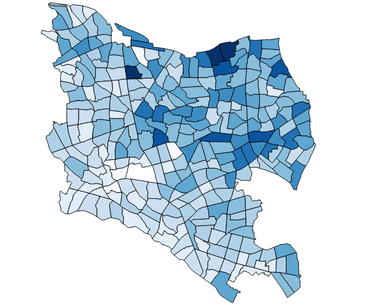

###データをダウンロードする
政府統計の総合窓口(http://www.e-stat.go.jp/)に行ってみましょう。このページ上では、統計情報を見れるなどさまざまな機能があるため、ダウンロードのメニューまで迷うかもしれません。"地図で見る統計（統計ＧＩＳ）"へ進んで、"データダウンロード"を選択してください。
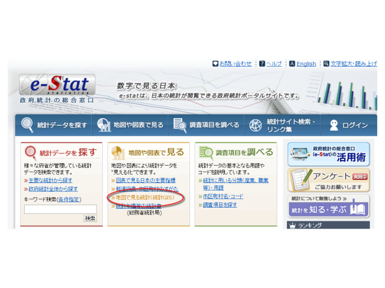

ダウンロードすることが出来る統計情報が表示されます。この中から"平成22年国勢調査-小地域　2010/10/01"をクリックしてください。選択できる統計表が表示されます。国勢調査の結果は、小地域=行政単位での提供と、標準地域メッシュ(後述のコラム参考)という決められた緯度経度で区切られた単位での提供が行われています。国勢調査の調査項目は多岐に渡るため、いくつかの表に分かれて提供されていますが、小地域の方が提供されている表が多いです。ここでは小地域を選択して進みましょう。  
「年齢別（５歳階級、４区分）、男女別人口」にチェックを入れて、『統計表各種データダウンロードへ』を選択してください。
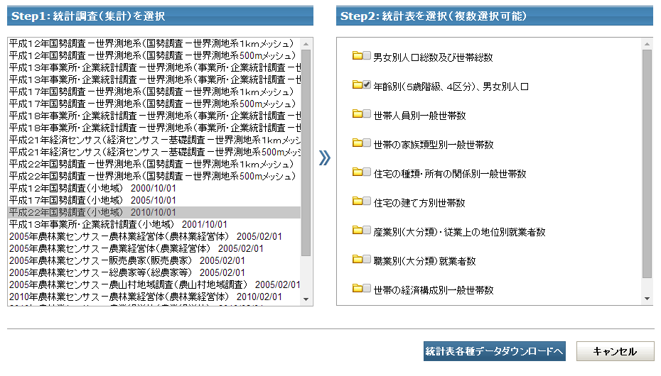

ダウンロードは市区町村単位で行うことが出来ます。都道府県ならびに市区町村を選択します。ここでは、「東京都」→「世田谷区」を選択しています。選択が終了したら、Step3の『検索』ボタンをクリックしましょう。統計データと、境界データのダウンロード先のリンクが「データ」のカラムに別々に表示されます。　　
統計データについては、「データ」カラムの「世田谷区(35KB)」をクリックしてダウンロードを開始してください。  
境界データは様々な形式でダウンロード可能ですが、「世界測地系平面直角座標系・Shape形式」から「世田谷区(111KB)」をクリックしてダウンロードしてしてください。
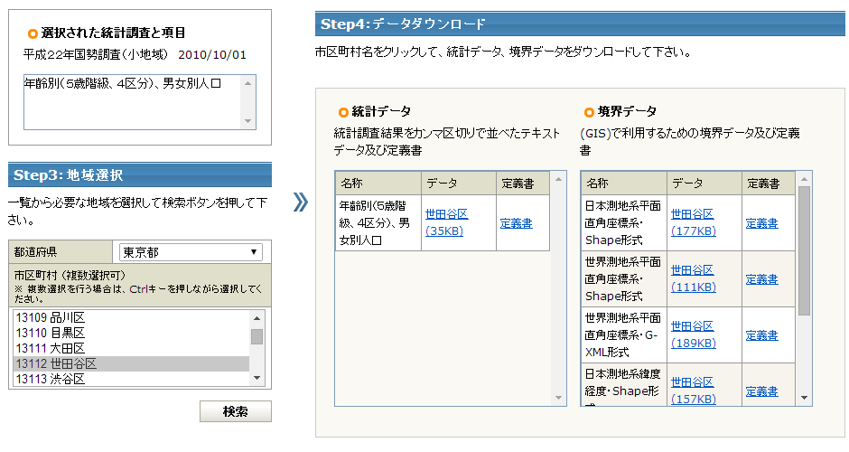

###ファイルを開く
ダウンロードした統計データ、境界データはともにzip形式で圧縮されています。両データを解凍しておきましょう。境界データの方はESRI Shapefileになっていますので、拡張子が{shp,shx,dbf,prj}の4ファイルが入っています。統計データは、csv形式の1ファイルが入っています。  
QGISでこれらのファイルを開いて可視化を行っていきますが、その前にcsvファイルの方に加工を行います。統計データの中で、データが無い項目、秘匿地域については、数字の代わりに「-」や「X」という記号が入れられています。これをQGISにそのまま読み込んだ場合、属性値が文字列形式で入っていると判断され、数での階層分け(0から10の場合に何色など)が出来ません。テキストエディタの置換機能を使って「-」「X」を削除しておきましょう。
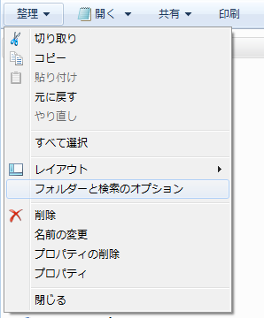

QGISにそれぞれのデータを読み込みます。境界データについては、ESRI Shapefileですので、.shpファイルをドラッグ＆ドロップすることで開くことが出来ます。統計データについては、メニューの【レイヤ】→【デリミティッドテキストレイヤを追加】から開くことが出来ます。{ファイル名}で統計データのcsvファイルを参照した後、

* 「ファイル形式」は、<CSV(カンマで区切られた値>
* 「レコードオプション」は、「無視するヘッダー行数」:"1"、<最初のレコードはフィールド名を保持している>にチェック
* 「ジオメトリ定義」は、<ジオメトリなし(属性のみのテーブル)>にチェック

として、『OK』を選択します。ファイルを開くと、レイヤの表示は下図のようになりますので、確認してください。

###小地域データに統計データを結びつける
図形をポリゴンで持っている境界データと、属性のみを持っている統計データを結び付けてる作業が必要になります。両データは行政区画毎に付けられているコードで結びつけることが出来るようになっています。レイヤに表示されている境界データを右クリックして表示されるメニューから、【プロパティ】を選択してください。  
[結合]タブを開き『＋』ボタンをクリックしてください。境界データと結びつけるレイヤと、結びつけるために使用する両データの属性を指定します。ここでは、

* 「結合するレイヤ」に、統計データのレイヤ名「tblT000573C13112」
* 「結合フィールド」に、統計データレイヤの行政コードが入っているフィールド名「field_1」
* 「ターゲットフィールド」に、境界データレイヤの行政コードが入っているフィールド名「KEY_CODE」

を指定しています。指定が終わったら『OK』をクリックします。  
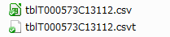

レイヤ【プロパティ】を開いたまま[フィールド]タブを表示してみてください。元々境界データが持っていた属性の後ろに、名称が統計データのレイヤ名で始まるフィールドが追加されていることが確認出来ます。
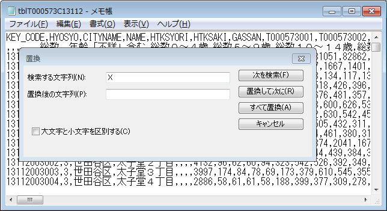

###人口により色分け
境界データへの統計データの結びつけが出来たら、結びつけた属性を利用して色分けを行います。再び境界データレイヤの【プロパティ】を選択してください。今度は[スタイル]タブを表示します。  
人口をいくつかの階数に分けて色分け表示しますので、「段階に分けられた」をを選択します。どのフィールドでも構わないのですが、まずが「総数、年齢「不詳」含む」を使って色分けしてみます。「モード」として、「分位(等量)」を使用しました。このモードは{分類数}で指定した数で、各分類に等量のポリゴンが入るように段階分けをしてくれます。「色階調」は用意されている好きな色設定を選択してみてください。選択が終わったら、『分類』→『適用』を順にクリックして、キャンバスへスタイルを反映します。
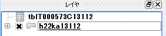
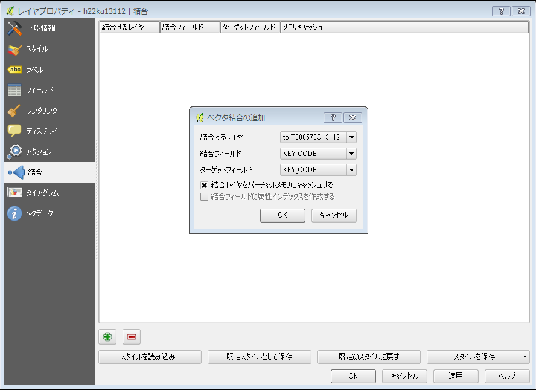

ここまでの操作でコロプレスマップを作成することが出来ました。ただし、この階数分けはあくまで1つのフィールド内に含まれる数字を元に行われたものです。違うフィールドを選択して同じように『分類』で階数分けを行うと、基準が変わってしまうため、フィールド間の比較を行うのには適していません。基準となる階数分け・スタイルを作成し、各フィールドを元にしたコロプレスマップを作成した方が比較には向いています。  
[スタイル]タブにて、現在設定されている階層を利用しながら、「値」「ラベル」をダブルクリックして変更していきましょう。一旦、『全削除』を行い、分類を1つずつ『追加』していってもよいのですが、シンボルのグラデーション設定をやり直す必要があります。一旦自動で分類させておいてから、値を変更していった方が既存の色設定を利用出来るため容易です。「値」の区切りは本来であれば、全てのフィールドに含まれる数字の最大値を表計算ソフト等で計算してから決めていくことになります。ここでは、大まかに分けてしまい、最大値で十分大きな値を指定して全数字をカバーするような設定にしてみました。
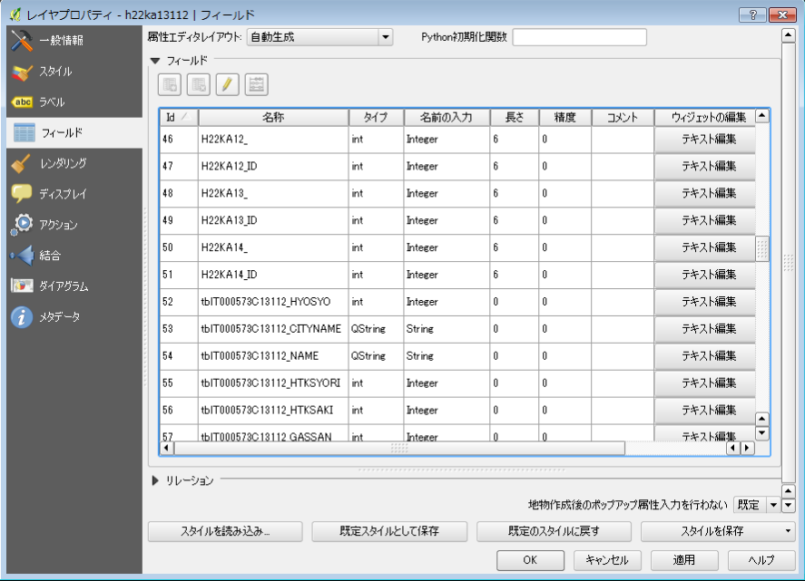

「カラム」を変更しながら描画させることで、共通の階数分けを利用したコロプレスマップを表示させていくことが出来ます。

|総数１５歳未満|総数６５歳以上|総数７５歳以上|
|------------|-------------|-------------|
|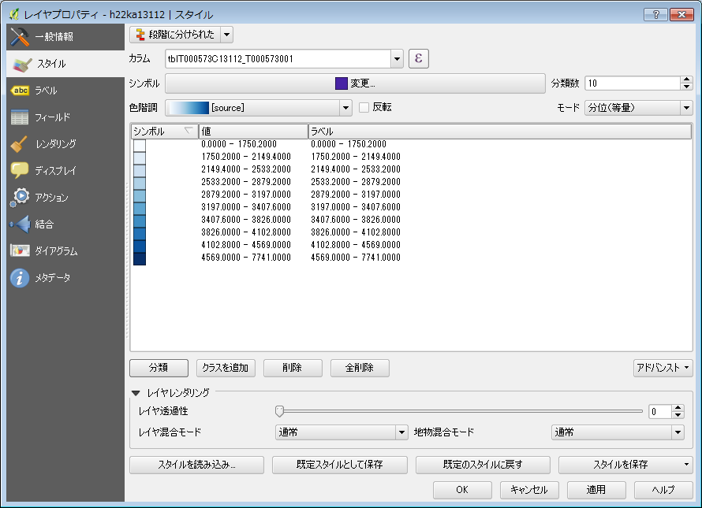||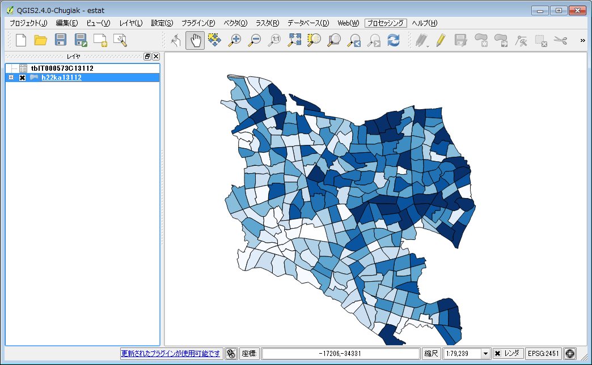|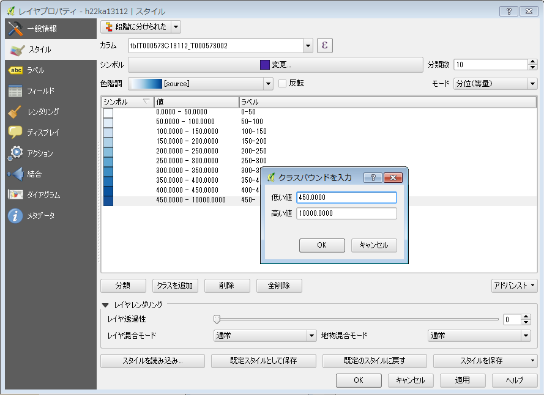|

###選択したレイヤを出力する
境界データと統計データを結び付けましたが、この結ぶつきは境界データのESRI Shapefileには反映されず、QGISのプロジェクトファイル上に保存されます。もし、結びつけた状態のデータを他のシステムで利用したい場合は、境界データを別途保存しなおす必要があります。  
レイヤに表示されている境界データを右クリックして表示されるメニューから、【名前を付けて保存】を選択してください。保存したいフォーマットを選択して、別ファイルとして保存してください。
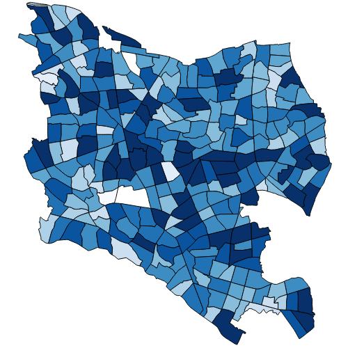

###保存する
境界データと統計データの結合や、境界データへの階数分け・スタイルの設定は、QGISのプロジェクトファイルに保存されます。作成した設定は忘れずに保存するようにしましょう。  
メニューから【プロジェクト】→【保存】もしくは【名前を付けて保存】を選択し保存を行ってください。
