##山岳表現を作成する
地域の地形を表現するためのデータを数値標高モデル（DEM Digital Elevation Model）と呼びます。数値標高モデルには、航空レーザー測量や写真測量によって特定の地域を詳細に記録したものから、スペースシャトルに搭載したレーダーを使って世界全域をカバーしたものまであります。この節では、公開されている数値標高モデルを利用して、山岳表現の地図を作成してみましょう。

###日本の範囲内の場合

####データをダウンロードする

国内の詳細な数値標高モデルは国土地理院の基盤地図情報サイト（http://www.gsi.go.jp/kiban/）からダウンロードできます。基盤地図情報で公開されているデータをダウンロードするためにはログインする必要があります。WEBサイトに従ってユーザー登録とログインをしておきましょう。

ログイン後、基盤地図情報のダウンロードサービスに移動し、「基盤地図情報　数値標高モデル」を選択しましょう。
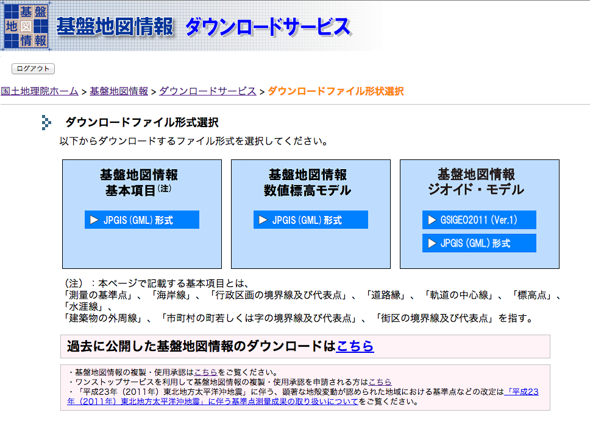

種類とエリアを選択してファイルをダウンロードします。種類は、5mメッシュと10mメッシュがあります。エリアは県名や火山名から選択するほかに、地図から必要な範囲をクリックして選択することもできます。必要なデータを選択したら、画面に従いファイルをダウンロードしましょう。

なお、基盤地図情報のデータの利用には測量成果の複製・使用に関する制限がありますので、事前に良く確認しておきましょう。

####(Column) 10mメッシュは10mではない？
基盤地図情報の数値標高モデルには、5mメッシュと10mメッシュがあります。例えば10mメッシュであれば、その地域の標高を10m間隔で取得したデータだと思うかもしれませんが、どうでしょうか？実は、そうではありません。実際には、10mメッシュは、緯度、経度方向に0.4秒間隔で取得したデータになります。緯度によって若干異なりますが0.4秒を距離に換算すると約10mになります。そのため「10mメッシュ」と呼ばれています。同様に、5mメッシュは0.2秒間隔のデータで距離換算で約5mなので「5mメッシュ」と呼ばれています。そのため、もとのデータの座標値も緯度経度になっているので利用する際には注意しましょう。

####グリッドデータに加工する
ダウンロードしたデータは、JPGIS(GML)と呼ばれるXML形式のデータになっています。山岳表現を作成するためにJPGIS(GML)のデータをGeoTIFF形式のグリッドデータ（ラスタ）に加工します。

まず、JPGIS(GML)を基盤地図情報閲覧コンバートソフトでシェープファイル形式に変換します。基盤地図情報ダウンロードサービス(http://fgd.gsi.go.jp/download/)から基盤地図情報閲覧コンバートソフトをダウンロードしてインストールします。ソフトを起動し、メニューから【ファイル】→【新規プロジェクト作成】を選択します。

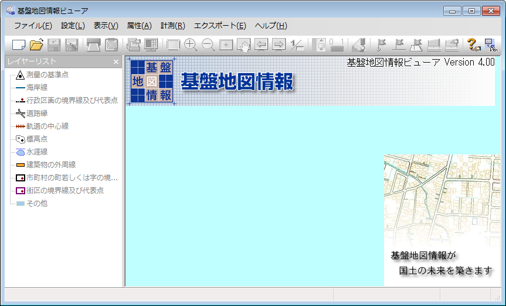

「読み込むファイル」と「保存先フォルダ」を指定してOKボタンを押します。

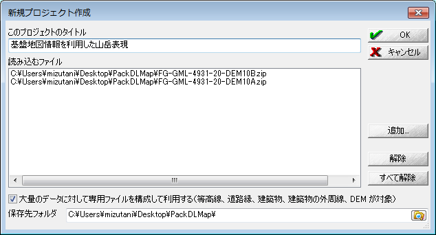

データが読み込まれたのを確認して、メニューから【エクスポート】→【標高メッシュをシェープファイルへ出力】を選択します。「直角座標系に変換して出力」のチェックをはずし、出力先ファイルを指定して『OK』を押します。「直角座標系に変換して出力」のチェックをはずすことによって、座標値は緯度経度として変換されます。

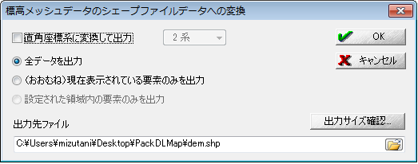

次に、シェープファイルをGeoTIFF形式に変換します。
QGISを起動して、先ほど変換したシェープファイルを読み込みます。
その後にメニューから【ラスタ】→【変換】→【ラスタ化（ベクタのラスタ化）】を選択します。

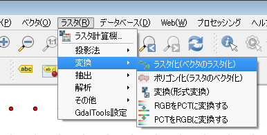

〈地図の単位ピクセルでのラスタ解像度〉を選択し、「水平」「垂直」の欄にメッシュ間隔を入力します。Columnにあるように、10mメッシュのデータであれば0.4秒間隔なので度に換算して0.00011111、5mメッシュのデータであれば0.2秒間隔なので度に換算して0.00005556を入力します。『OK』を押すとGeoTIFF形式のグリッドデータに変換されます。

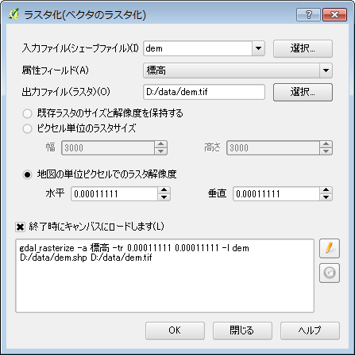

####(Column)数値標高モデルの変換ツール
基盤地図情報 数値標高モデルのデータを変換するための便利なツールが公開されています。これらを利用すればJPGIS(GML)形式から直接GeoTIFF形式に変換できます。使い方等は各URLを参照ください。

 - 基盤地図情報標高DEMデータ変換ツール(http://www.ecoris.co.jp/contents/demtool.html)
 - fgddemImporter(http://space.geocities.jp/bischofia_vb/qgis-plugins/fgddemImporter/)
 - 基盤地図対応GDAL/OGR(http://www.osgeo.jp/foss4g-mext/)

####標高ごとに色分けする
数値標高モデルのデータを標高ごとに色分けしてみましょう。
QGISに、GeoTIFF形式に変換した数値標高モデルのファイルを読み込みます。その後、レイヤに表示されている標高データを右クリックして表示されるメニューから、【プロパティ】を選択してください。

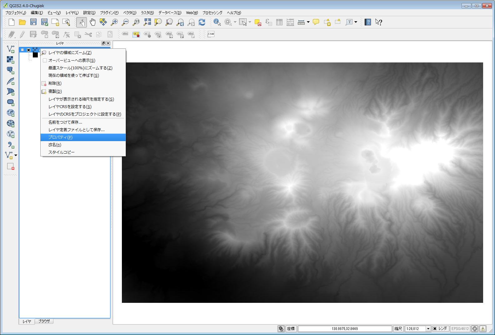

[スタイル]タブを開き、「レンダータイプ」を〔単バンド疑似カラー〕に変更します。「新規カラーマップを作成」の中のカラーリストから〔新しいカラーランプ〕を選択します。

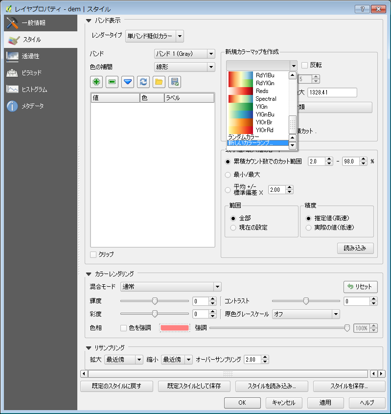

「カラー階調タイプ」から〔cpt-city〕を選択し『OK』を押したのち[テーマによる選択]タブから「Topgraphy」を選択すると標高に適したカラー階調の一覧が表示されます。この中から好みのカラー階調を選択して『OK』を押します。

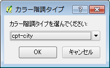
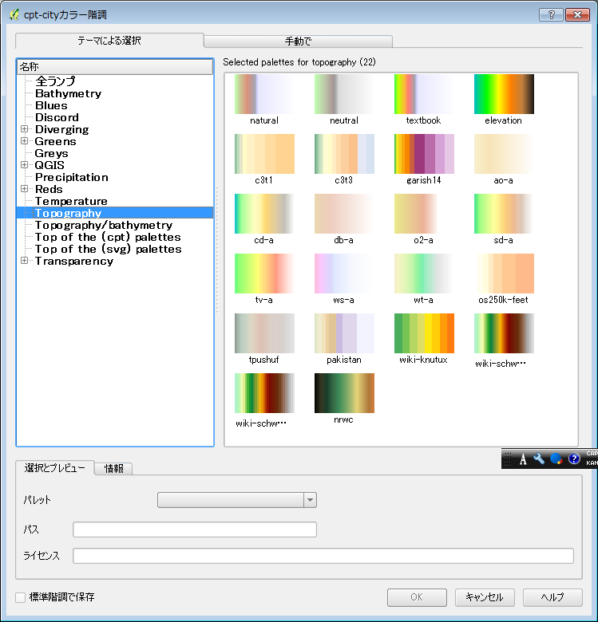

[スタイル]タブに戻り『分類』ボタンを押すと選択したカラー階調に従い「最小」から「最大」までの標高値が自動的に何色で塗るかが分類され『OK』を押すと地図にその色が反映されます。その他にも「モード」を〔等間隔〕にして分類数を指定したり、手動で分類値とその色を指定したり、「色の補間」方法を〔離散的〕にしたりといったこともできるので試してみると良いでしょう。
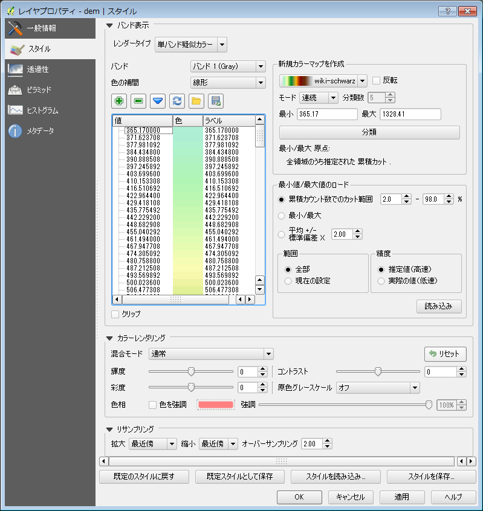
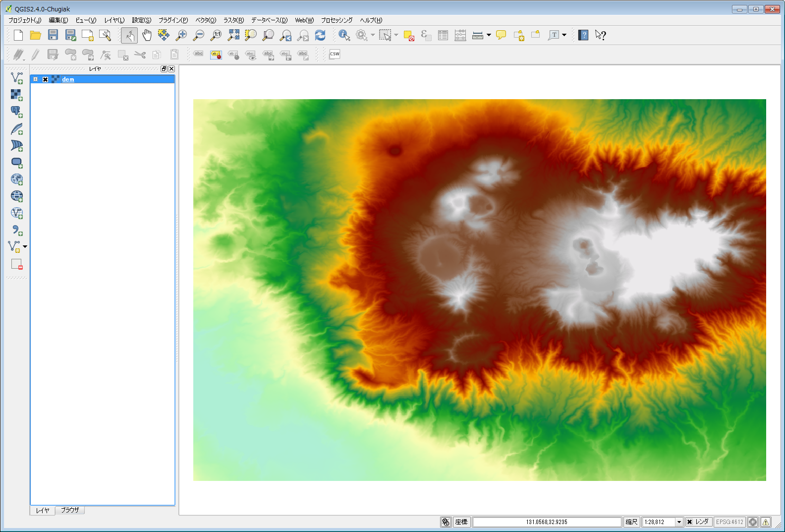
 
####陰影図を作成する
数値標高モデルのデータから地形の陰影図を作成してみましょう。
陰影図とは、太陽光が起伏のある地形にあたった際にできる影を地図上に表したもので、地形が立体的に見えるのが特徴です。

QGISに、GeoTIFF形式に変換した数値標高モデルのファイルを読み込みます。その後、メニューから【ラスタ】→【解析】→【DEM(地形モデル)】を選択します。

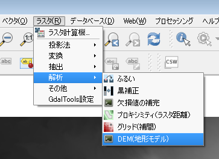

DEM(地形モデル)の設定ウインドウが開くので以下のように項目を設定します。

 - 入力ファイル　読み込んだデータを指定
 - 出力ファイル  ファイル名を指定
 - モード　〔陰影図〕を選択
 - 比率（垂直単位の水平方向に対する比率） 111120を入力
 
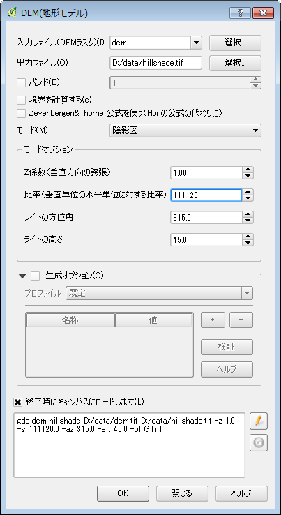

ここで「垂直単位の水平方向に対する比率」について説明しておきます。まず、垂直単位とは標高値の単位のことで、今回のデータであればメートルになります。海外のデータであればフィートの場合もあるかもしれません。次に、水平方向の単位とは座標系の単位のことです。今回のデータであれば緯度経度の地理座標系になっているので単位は角度です。投影座標系であればメートルもしくはフィートです。つまり、「垂直単位の水平方向に対する比率」とは、座標系の単位に対する標高の単位の比率ということになり、例えばどちらもメートルであれば比率は1です。今回のデータの場合、座標系の単位は角度で標高の単位はメートルなので、1度が何メートルになるのかを計算する必要があります。緯度によって異なりますが、1度を111120メートルしておけば良いでしょう。

『OK』を押すと陰影図が作成されます。

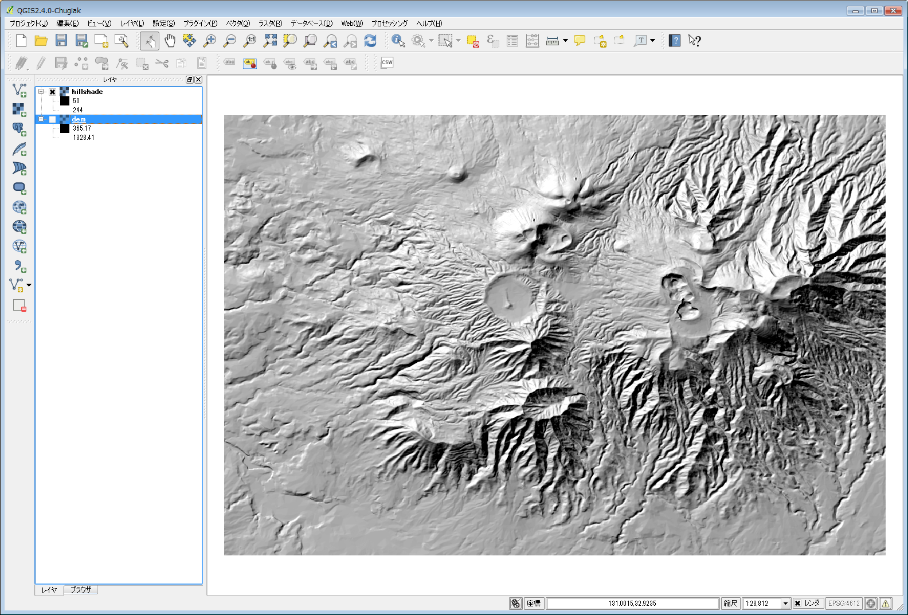

####色分けした標高と陰影図を重ねる
色分けした標高データと陰影図を重ねてみましょう。
QGISに色分け済みの標高データと陰影図を読み込みます。[レイヤ]タブで標高データのレイヤが陰影図のレイヤの上になるようにします。レイヤの順番を入れ替えるにはレイヤをドラッグ＆ドロップで移動させます。
標高データのレイヤを右クリックして『プロパティ』を選択します。[スタイルタブ]を開き、「カラーレンダリング」の「混合モード」を〔乗算〕に変更して『OK』を押します。すると標高データの色が陰影図の色と混ぜ合わされ、標高ごとに色分けされた陰影図が作成されます。「混合モード」は〔乗算〕以外にもいくつかあるので、色々と試してみるとよいでしょう。
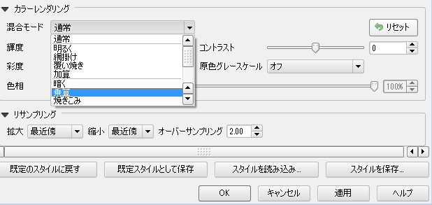
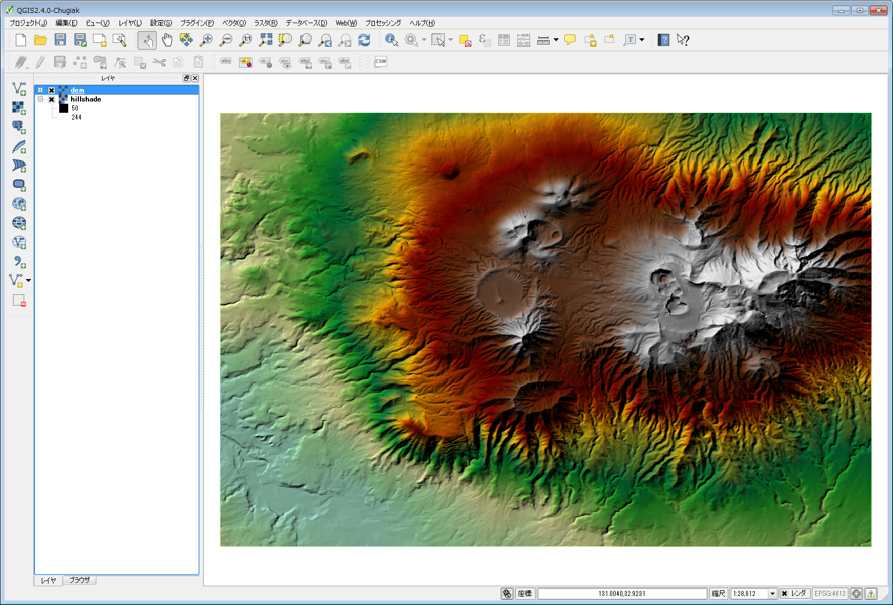

###世界中のデータを扱いたい場合
世界全域の数値標高モデルは、いくつかの機関で作成していますが、今回は、NOAA(アメリカ海洋大気局)で公開しているETOPO1と呼ばれるデータを利用してみましょう。ETOPO1は、世界全域の標高を1分間隔（約1.8Km）のグリッドで格納した数値データです。

####データをダウンロードする
ETOPO1のサイト（http://www.ngdc.noaa.gov/mgg/global/）に移動してページ中段の"Download Whole-World Grids"からデータをダウンロードします。ETOPO1 Ice Surfaceは、南極とグリーンランドの氷上を地表面としたデータで、ETOPO1 Bedrockは、氷の下にある岩盤を地表面としたデータになります。また、grid-registeredとcell-registeredは、データの格納方法の違いになります。ここでは、ETOPO1 Ice Surfaceのgrid-registeredからgeoreferenced tiff（GeoTIFF形式）のデータを選択しましょう。
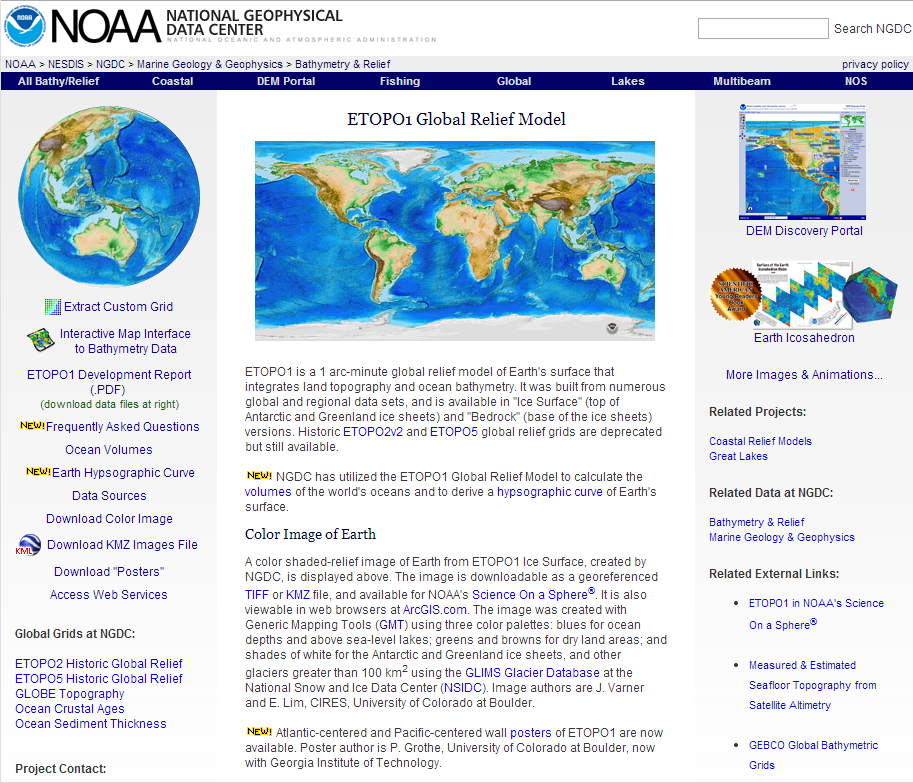
なお、ETOPO1のデータの使用に際しては、出典の明記が必要ですのでNGDCからのETOPO1データということを記載しておきましょう。

####投影法を変換する
ダウンロードしたデータの投影法は座標値が緯度経度の地理座標系になっています。ここでは世界地図を格好良く見せるために、データをロビンソン図法と呼ばれる投影法に変換してみましょう。

QGISにダウンロードしたデータ（ETOPO1_Ice_g_geotiff.tif）を読み込み、メニューから【ラスタ】→【投影法】→【ワープ（再投影）】を選択します。QGISにデータを読み込む際に「CRSが設定されていません」とメッセージが出るかもしれません。それは読み込んだラスタに投影法が設定されていないという意味ですが、今は気にしなくても大丈夫です。
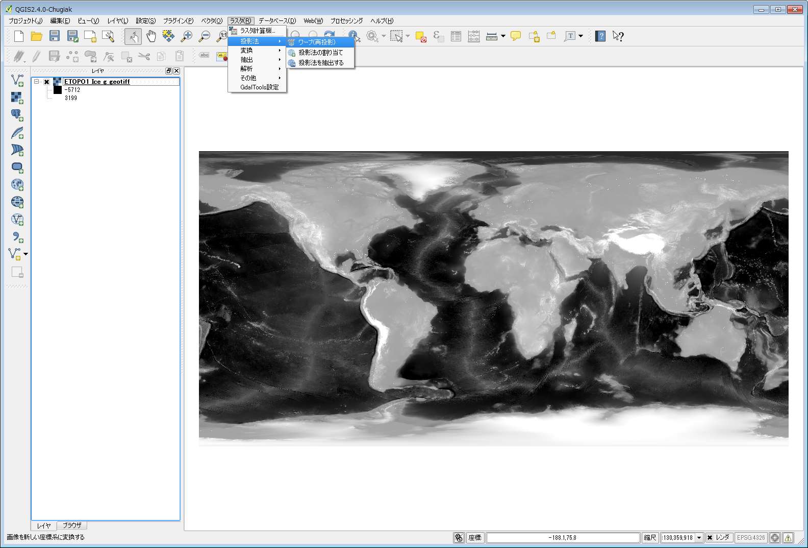

ワープ（再投影）の項目を以下のように設定します。

 - 入力ファイル　読み込んだデータを指定
 - 出力ファイル  ファイル名を指定
 - ソースSRS　チェックを入れてEPSG:4326（WGS 84）を選択
 - ターゲットSRS チェックを入れてEPSG:54030（World Robinson）を選択
 - リサンプリングメソッド　チェックを入れて〔双線形〕を選択
 - データ無しの値　チェックを入れて-9999を入力

「キャッシュに利用するメモリ」と「マルチスレッドワーピングインプリメンテーションを使う」は任意ですが、これらを指定すると変換スピードが速くなる場合があります。

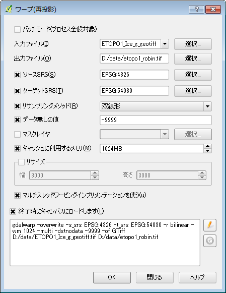

『OK』を押すと投影変換を実行しますが、少し時間がかかるので終了するまで待ちましょう。変換が終了すると地図キャンバスにロードされますが、何も変わらないように見えます。これはデータの投影法とプロジェクトの投影法とが一致していないためなので、ここでは一旦QGIS閉じてプロジェクトを終了させます。

####標高ごとに色分けする
QGISを再度起動して、ロビンソン図法に変換したファイルを読み込みます。今度は、プロジェクトの投影法が自動的にロビンソン図法に切り替わるので、正しくお饅頭型？の世界地図が表示されます。

これに世界地図らしく標高ごとに色分けをします。日本の範囲内での場合と同様に標高レイヤのスタイルを設定すれば良いのですが、すでにQGIS用のスタイルファイルとしてインターネット上で公開されているものがあるので、それを利用します。以下のサイト（http://en.wikipedia.org/wiki/Wikipedia:Graphics_Lab/Resources/GIS_sources_and_palettes）の中段あたりに「QGis > Colormap "Wikicarto_2.0.qml"」という部分があるので、その右側の[show]をクリックします。QGIS用のスタイル設定が表示されるので、コピーしてテキストファイルとして「Wikicarto_2.0.qml」の名前で保存します。

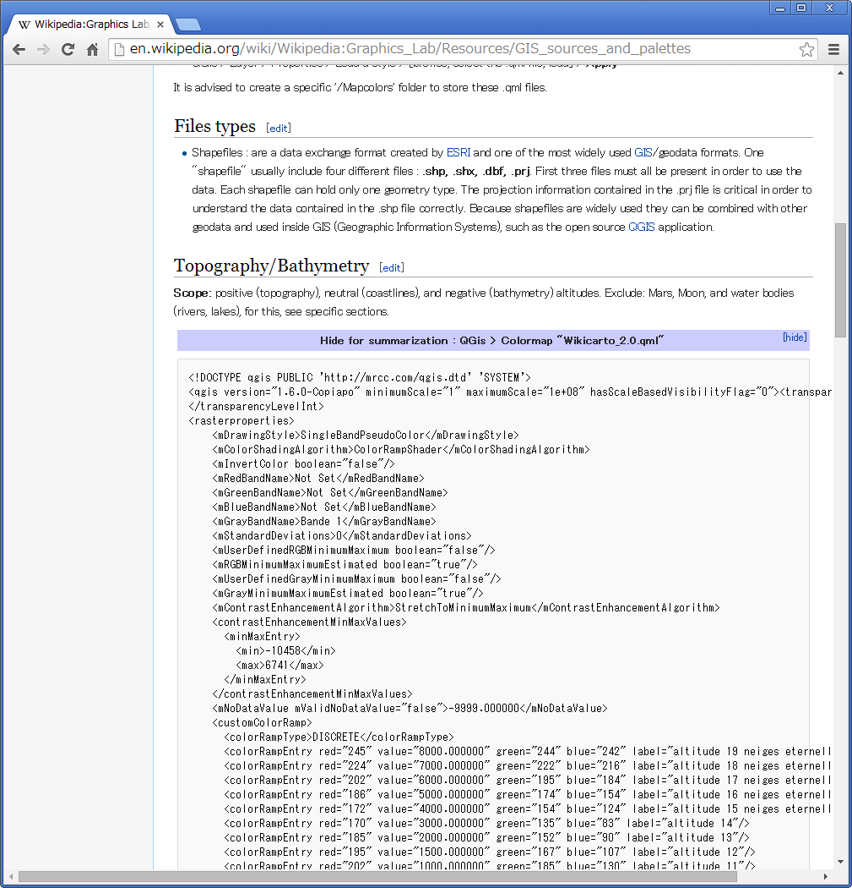

QGISに戻り、標高レイヤを右クリックして【プロパティ】を選択し[スタイル]タブを開きます。『スタイルを読み込み…』を押し、先ほど保存したWikicarto_2.0.qmlを選択します。標高ごとの色分けの設定が読み込まれるので、そのまま『OK』を押せば、地図に反映されます。

####色分けした標高と陰影図を重ねる
陰影図の作成方法は日本の範囲内の場合とほぼ同じなので省略しますが、1点だけ注意があります。ロビンソン図法の座標の単位はメートルで、標高値の単位もメートルなので、【DEM(地形モデル)】の「モードオプション」の「比率」の項は1のままで変更しません。

QGISに標高データと陰影図を読み込んで、日本の範囲内の場合と同じように標高データのレイヤを陰影図のレイヤの上に移動さて、レイヤの【プロパティ】から[スタイル]タブを開きます。「カラーレンダリング」の「混合モード」を〔ハードライト〕に変更して『OK』を押します。すると標高ごとに色分けされた陰影のある世界地図が作成されます。

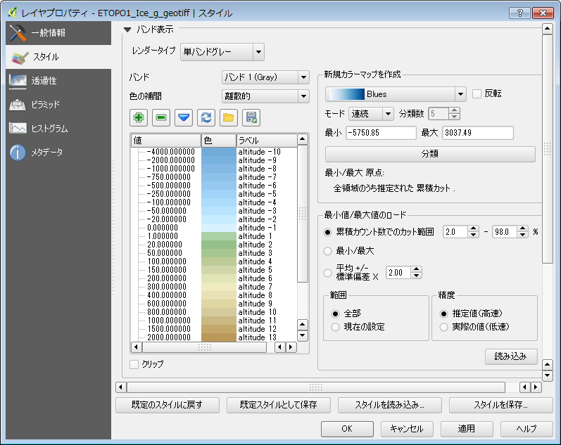

