##データから新たな図を作成する
公開されているデータを可視化するだけでも色々な図を作ることができますが、それらのデータをGISで少し加工するだけで、またひと味ちがったデータを作成することができます。さらに、色々なデータを組み合わせることでオリジナルの新たな地図を作り出すことも可能です。ここでは、河川、植生、標高のデータをそれぞれGISで加工し、それらを組み合わせることで「カッパ出没マップ」を作成してみます。さらに、小学校の位置データと組み合わせ「カッパ遭遇危険度マップ」も作成してみます。

 - この章ではQGISのプロセッシングツールからGRASSを呼び出して利用するので、OSGeo4Wからインストールしている場合やMacを利用している方は、あらかじめGRASSをインストールしておいてください。

 - QGISのプロセッシングツールは、現時点でのバージョン(Ver2.4)では日本語ファイル名や日本語フォルダ名に対応していないので、この章ではファイル名やフォルダ名に日本語を含まないようにしてください。

- QGISの現時点でのバージョン(Ver2.4)では64bit版のQGISではプロセッシングツールが上手く動作しない場合がありますので、この章では32bit版のQGISを動作対象とします。

###河川データから河川からの距離図を作成する
国土数値情報の河川データを加工して「河川からの距離図」を作成してみましょう。

####データをダウンロードする
国土数値情報のページでデータ形式[JPGIS2.1]を選択し、「河川」をクリックします。

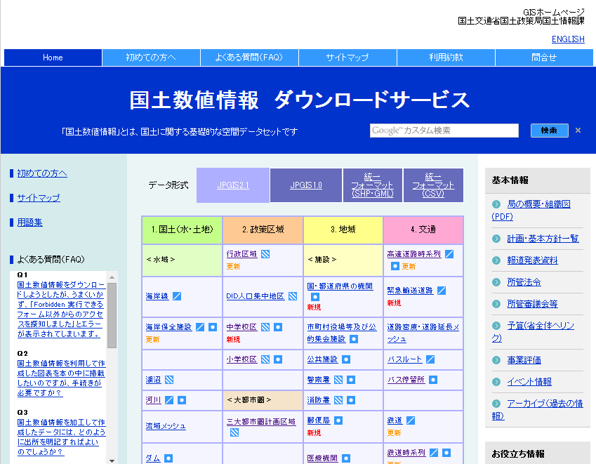

データの説明が書かれているので「座標系」のところを確認しておきましょう。JGD2000/(B,L)となっているので、世界測地系の緯度経度のデータだということが分かります。B,Lというのは、ドイツ語でBreite、Langeの頭文字で緯度、経度の意味です。

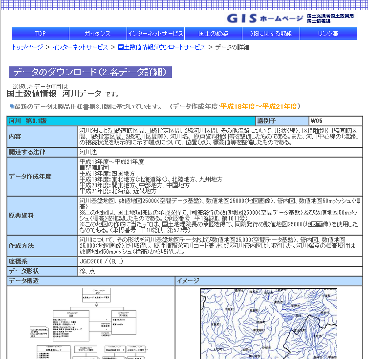

ダウンロードしたい地域をチェックして、次へボタンを押してください。ダウンロードしたいファイルにチェックを入れて次へボタンを押すと、アンケート画面が表れるので回答したのちファイルをダウンロードします。

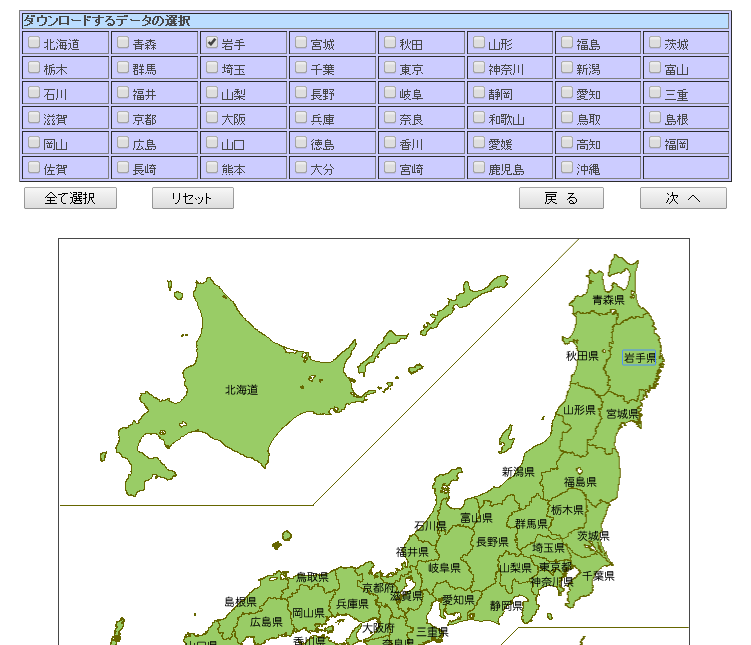

ZIPファイルを解凍すると2種類のシェープファイルとxmlファイルが入っていますが、W05-07_03-g_Streamの名のシェープファイルが使用する河川のデータになります。（数字の部分はダウンロードした地域によって異なります）

国土数値情報を利用する際は出典の明示が必要となっています。その他の詳細については、国土数値情報の利用規約を良く読んでそれに従ってください。

####投影法を変換する
ダウンロードしたファイルは世界測地系の緯度経度で作成されているデータだということを確認しましたが、距離を正しく扱うためにメートル単位の投影座標系に変換します。

QGISに河川のシェープファイルを読み込みます。

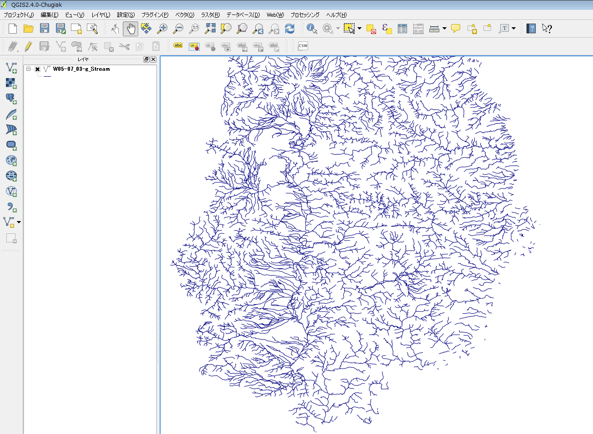

その際に「CRSが設定されていません」とメッセージがでるかもしれませんが、それはダウンローしたファイルの中に投影法などの情報を格納したprjファイル（もしくはqrjファイル）がないので自動で判別できないためです。そこで、レイヤのCRS（空間参照系）を定義します。河川レイヤを右クリックして「レイヤCRSを設定する」を選択します。

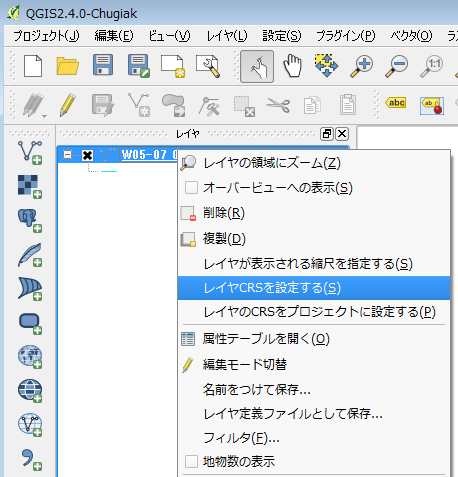

開いたウインドウのフィルタの欄に「jgd2000」と入力します。すると世界測地系の投影法がリストアップされるので、その中から地理座標系（緯度経度のこと）のEPSG:4612を選択して『OK』ボタンを押します。これで河川レイヤの投影法が定義できました。

シェープファイルの投影法が正しく定義できたので、次にそこから投影法を変換したファイルを作成します。QGISに読み込んだ河川レイヤを右クリックして「名前をつけて保存」を選択します。「CRS」の項で変換したい投影法を選択します。『ブラウズ』ボタンを押して、先ほどと同じようにフィルタの欄に{jgd2000}と入力します。リストアップされた中から「JGD2000/UTM zone 54N（EPSG:3100）」を選択します。ここでは投影座標系としてUTMを選択し、岩手県のデータを使用したのでゾーン番号は54を選択しました。UTMのゾーン番号は地域によって異なるのでダウンロードしたデータの場所に従って変更してください(1章4節参照)。「名前をつけて保存」で出力するファイル名を指定して、「形式」が、〔Esri Shapefile〕になっているのを確認して『OK』ボタンを押します。これで投影法がUTMに変換された河川データが作成できました。

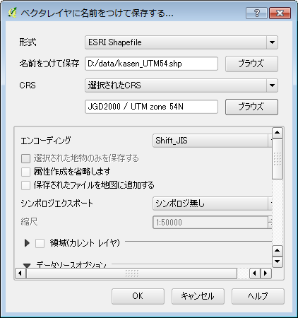

####ラスタデータに変換する
河川からの距離を計算するために河川のデータ形式をベクタからラスタに変換します。QGISから新規プロジェクトを開き、UTMに変換した河川のシェープファイルを読み込みます。メニューの【ラスタ】→【変換】→【ラスタ化（ベクタのラスタ化）】を選択します。

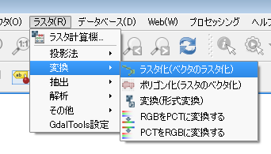

「出力ファイル」を選択した後、「地図の単位ピクセルでのラスタ解像度」を選択して「水平」「垂直」に{10}と入力します。これは、1セルが10m×10mとなるようにラスタを作成するという意味です。そのあと、右下の鉛筆ボタンをクリックすると、テキストボックスが編集できるようになり、その他のオプションを直接指定できるようになります。川の部分のラスタ値を1に指定するためgdal_rasterize のあとに{ -burn 1 }と入力します。そのまま『OK』ボタンを押すとGeoTIFF形式のラスタデータが作成されます。

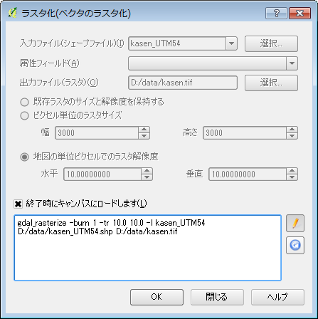

出力された状態だと黒一色となっているので、作成したラスタレイヤを右クリックして「プロパティ」の[スタイル]タブで「バンド表示」の「最大」に{1}を入力して『OK』ボタンを押してください。ズームアップしていくと河川の部分（ラスタ値1）が白く表示されるのが確認できます。

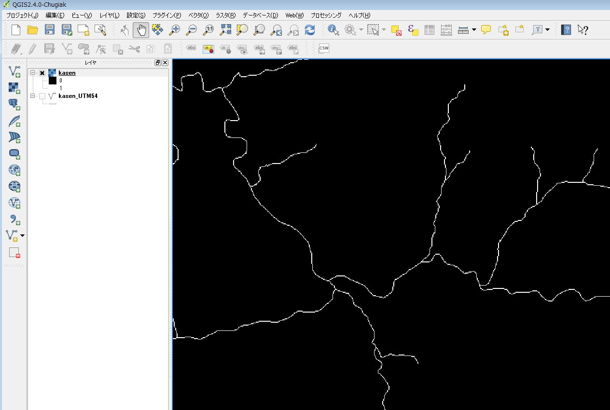

####(Column)GDAL -- Geospatial Data Abstraction Library --
QGISの変換ツールや解析ツールの多くはGDALのutility programsと呼ばれるプログラムを利用しています。GDALとは、地理情報データを扱うためのオープンソースのプログラムライブラリで、それを利用して作られた地理情報データの変換や解析をするための便利なコマンドプログラム群がutility programsです。GDALのutility programsは数多くあり、前節で使用したgdal_rasterizeもその1つですが、機能やオプションも豊富なので、QGISのヘルプでも説明できていない部分があります。そのため一度GDALのホームページでutility programsの詳しい使い方やオプションなどを確認してみることをお勧めします。

GDALホームページ　http://www.gdal.org/

####距離を計算する
 変換した河川のラスタデータから距離を計算します。メニューから【ラスタ】→【解析】→【プロキシミティ（ラスタ距離）】を選択します。出力ファイルを選択して『OK』ボタンを押します。
 
 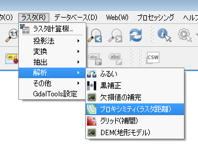

 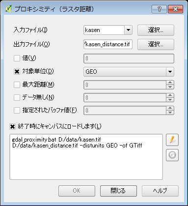
 
計算に少し時間がかかりますが、しばらくすると河川からの距離の値が入ったラスタデータが作成されます。そのままだと分かりにくいので、色を変更します。作成されたラスタレイヤを右クリックして「プロパティ」を選択し[スタイル]タブを開きます。「バンド表示」の「レンダータイプ」を〔単バンド疑似カラー〕に変更します。「新規カラーマップを作成」から〔Spectral〕を選択し「最小」に{0}、「最大」に{1000}と入力します。『分類』ボタンを押したのち『OK』ボタンを押すと、河川から1000mまでを距離に応じて色分けした「河川からの距離図」が作成されます。

 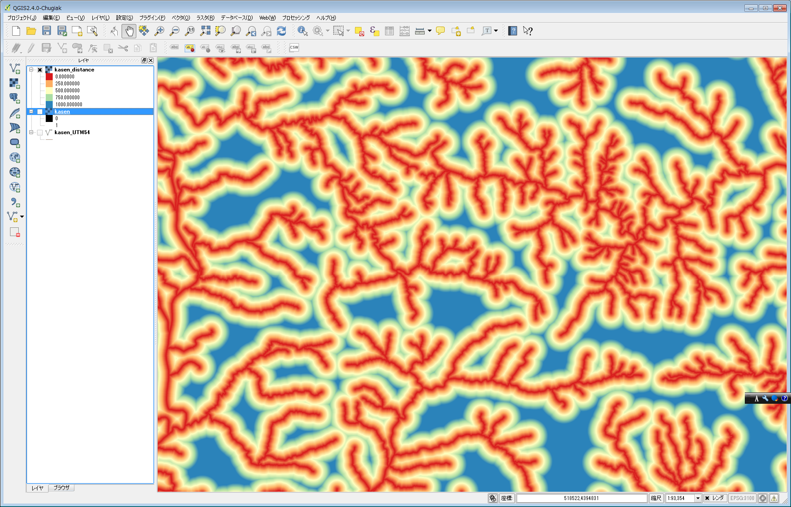
 
###植生データから畑地面積率図を作成する
自然環境情報GISの植生データを加工して「畑地面積率図」を作成してみましょう。

####データをダウンロードする
自然環境情報GISのページから「Shapeデータダウンロード」に進みます。

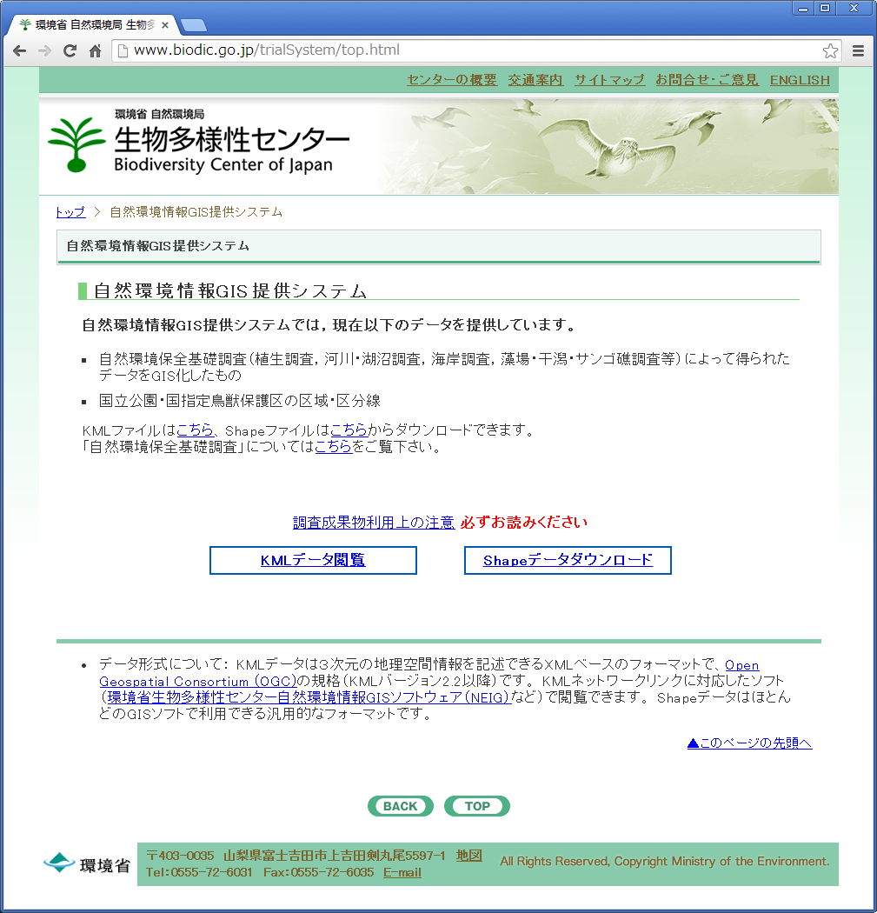

今回は、1/25,000スケールで整備されている第6-7回植生調査の結果を利用するので、「植生調査情報提供ホームページへ」をクリックします。地図からダウンロードしたい地域を選択して「GISデータ（シェープファイル）」をクリックします。

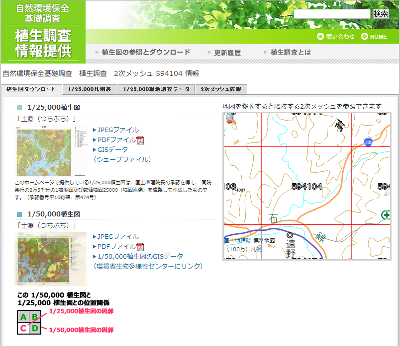

アンケートに答えたのちファイルをダウンロードします。ダウンロードしたファイルのREADMEを読んで、データは世界測地系（日本測地系2000）の緯度経度で作成されているを確認しておきます。

植生データは現在data.go.jpのデータカタログに登録されています。そのためライセンスはCC-BYで公開されています。その他の詳細についてはdata.go.jpの利用規約を良く確認してください。

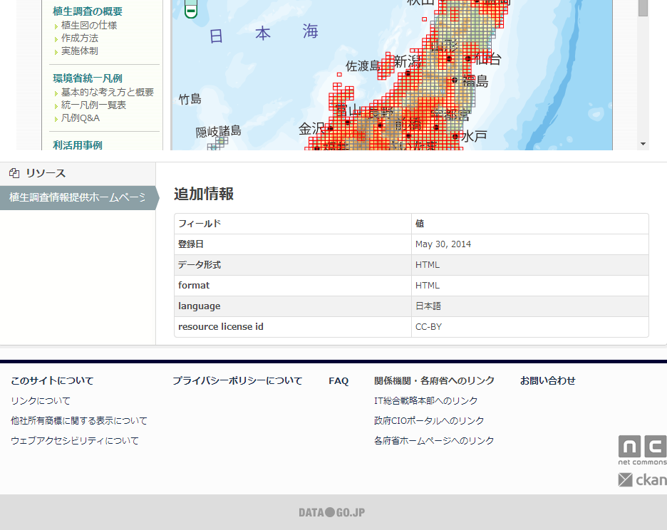

####畑地を抽出する
植生データから畑地を抽出します。まず、QGISに植生データを読み込みます。ただし、今回はドラッグアンドドロップでファイルを読み込まず、メニューの【レイヤ】→【ベクタレイヤの追加】から読み込んでください。その際に「エンコーディング」は〔Shift_JIS〕を選択します。

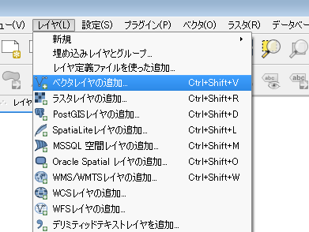

- ドラッグアンドドロップでファイルを読み込むと属性テーブルのエンコーディングが判別できず日本語の属性テーブルが文字化けする場合があります。

ファイルを読み込むと「CRSが設定されていません」とメッセージがでるかもしれませんが、それはダウンローしたファイルの中に投影法などの情報を格納したprjファイル（もしくはqrjファイル）がないので自動で判別できないためです。そこで、レイヤのCRS（空間参照系）を定義します。植生レイヤを右クリックして「レイヤCRSを設定する」を選択します。

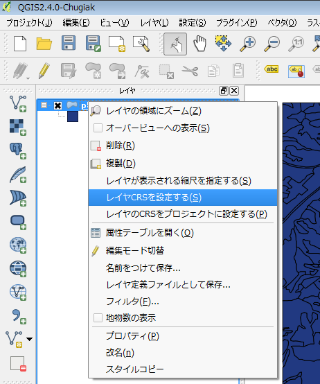

開いたウインドウのフィルタの欄に「jgd2000」と入力します。すると世界測地系の投影法がリストアップされるので、その中から地理座標系（緯度経度のこと）のEPSG:4612を選択して『OK』ボタンを押します。これで植生レイヤの投影法が定義できました。

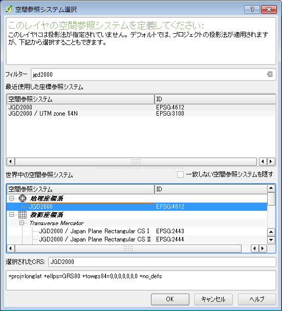

次に、畑地を抽出するために植生レイヤを右クリックして「属性テーブルを開く」を選択します。属性テーブルの「HANREI_N」の列を見ると植生名が入っているのが分かると思います。

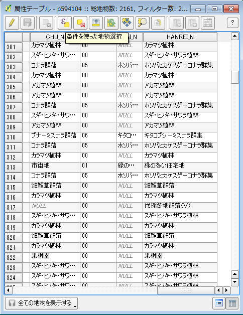

この中から「畑雑草群落」だけを選択します。そのために属性テーブルの上のボタンから『条件を使った地物選択』ボタン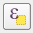を押します。「関数リスト」から「フィールドと値」→「HANREI_N」を選択します。「値のロード」の『すべてユニーク』ボタンを押すとHANREI_Nのなかの植生名の一覧が「フィールドの値」の欄に表示されます。この状態で、関数リストの「HANREI_N」をダブルクリックします。すると「式」の欄に"HANREI_N"と入力されます。そのまま「演算子」の『=』ボタンを押すと「式」の欄にも=と入力されます。続いて、「フィールドの値」から"畑雑草群落"をダブルクリックします。これで、「式」の欄が"HANREI_N" = "畑雑草群落"となったと思います。これは属性テーブルの「HANREI_N」の列が「畑雑草群落」と同じもの（イコール）という意味です。『選択』ボタンを押すと、地図上の畑雑草群落が選択されます。

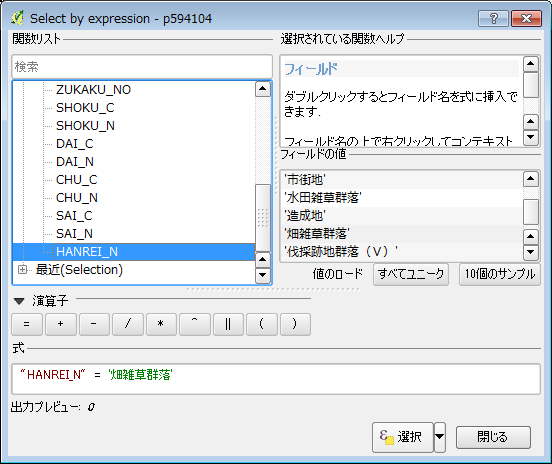

最後に、選択された畑地雑草群落をシェープファイルに書き出します。畑雑草群落が選択された状態で、植生レイヤを右クリックして「名前をつけて保存」を選択します。〈選択された地物のみを保存する〉にチェックを入れます。「エンコーディング」が〔Shift_JIS〕になっているか確認します。あと、このあと面積を正しく扱うために投影法も同時に変換しておきたいので、「CRS」の『ブラウズ』ボタンを押します。フィルタの欄に{jgd2000}と入力し、リストアップされた中から「JGD2000/UTM zone 54N（EPSG:3100）」を選択します。ここでは投影座標系としてUTMを選択し、岩手県のデータを使用したのでゾーン番号は54を選択しました。UTMのゾーン番号は地域によって異なるのでダウンロードしたデータの場所に従って変更してください(1章4節参照)。「名前をつけて保存」で出力するファイル名を指定して、「形式」が、〔Esri Shapefile〕になっているのを確認して『OK』ボタンを押します。これで投影法がUTMに変換された畑地のデータが作成できました。

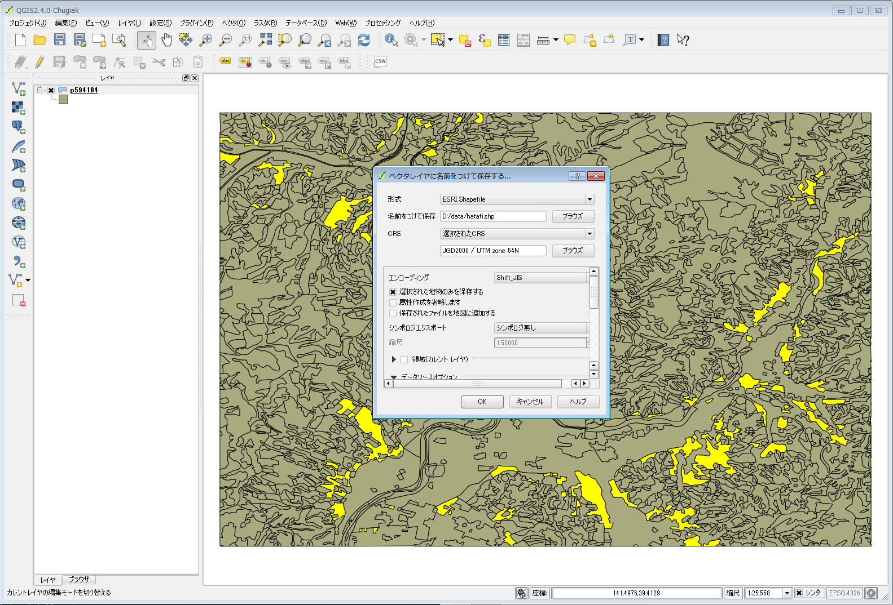

####ラスタデータに変換する
畑地の面積を計算するためにデータ形式をベクタからラスタに変換します。
QGISから新規プロジェクトを開き、UTMに変換した畑地のシェープファイルを読み込みます。メニューの【ラスタ】→【変換】→【ラスタ化（ベクタのラスタ化）】を選択します。

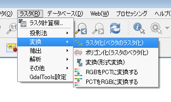

「出力ファイル」を選択した後、「地図の単位ピクセルでのラスタ解像度」を選択して「水平」「垂直」に10と入力します。そのあと、右下の鉛筆ボタンをクリックすると、テキストボックスが編集できるようになり、その他のオプションを直接指定できるようになります。gdal_rasterize のあとに{ -burn 100 }と入力し、畑地の部分が100になるように指定します（それ以外の部分は0）。そのまま『OK』ボタンを押すと解像度が10mのGeoTIFF形式のラスタデータが作成されます。

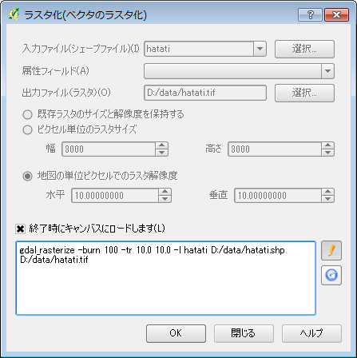

####畑地面積率を計算する
変換した畑地のラスタデータから1km圏内の畑地面積率を計算します。面積率はプロセッシングツールからGRASS GISのr.neighborsを実行して計算します。r.neighborsは中心となるセルから指定範囲内のラスタ値の平均や合計などの計算を、すべてのセルに対して実行するツールです。

最初に、プロセッシングツールの設定を確認します。QGISのメニューから【プロセッシング】→【オプションと構成】を選択します。「プロバイダ」→「GRASS commands」を展開し、〈Activate〉にチェックが入っているか、「GRASS folder」および「Msys folder」が正しく指定されているかを確認してください。

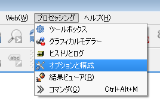

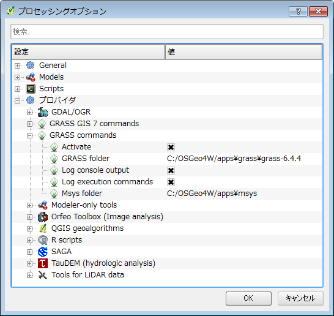

QGISに畑地のラスタデータを読み込み、メニューから【プロセッシング】→【ツールボックス】を選択すると「プロセッシングツールボックス」が開きます。

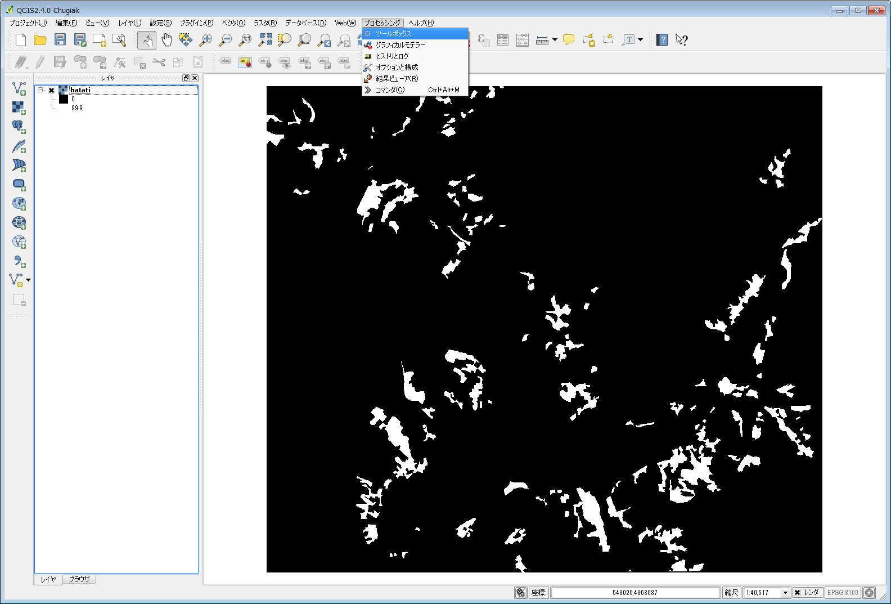

ツールボックス下部のリストボックスを「Advanced Interface」に変更します。ツールボックスから「GRASS commands」→「Rater」→「r.neighbors」を選択します。

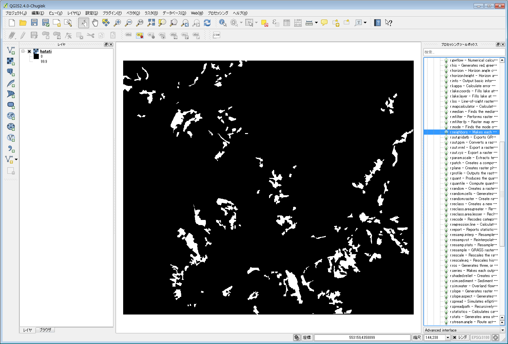

「Neighborhood operation」は[average]（平均）を選択します。「Neighborhood size」に101と入力します。ここには計算範囲となるセル数を入力します。今、ラスタの1セルは10mなので1km圏内（直径）を計算したいなら100セルになります。ただ、「Neighborhood size」は奇数にしなければいけないというルールがあるので101にしておきます。「Use circular neighborhood」を[Yes]にします。これは、計算範囲を指定セル数を直径とする円内にするという設定です。「Output layer」に保存するファイル名を指定して『OK』ボタンを押すと1km圏内のラスタ値の平均が計算されます。

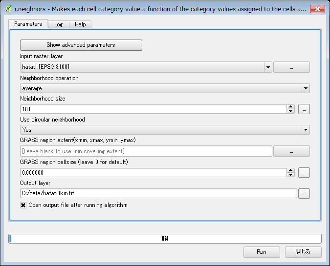

出力された値は、1km圏内のラスタ値の平均になりますが、ラスタ値は畑地が100、それ以外は0だったので、結果として、1km圏内すべてが畑地であれば100、半分であれば50、畑地がなければ0となる畑地面積率が計算されました。これまでと同様にスタイルから適当に色を付ければ「畑地面積率図」の完成です。 

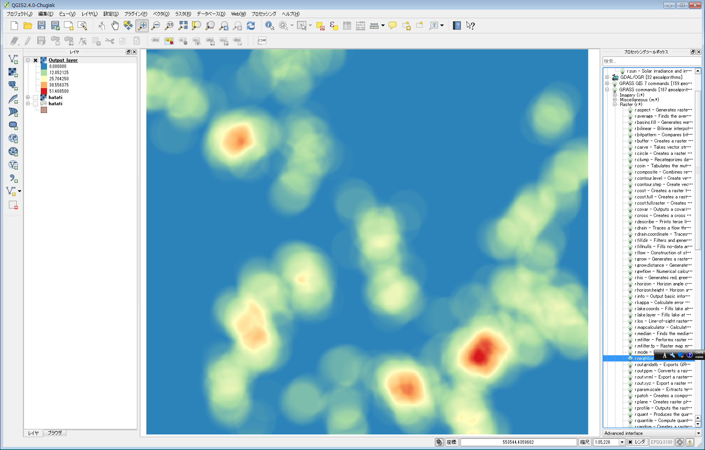

####(Column)プロセッシングツール
プロセッシングツールは、QGISと他のプログラムとを連携させるためのツールです。プロセッシングツールを利用するとGRASS GISやRなどの別のソフトウェアの機能を呼び出したり、自分で作成したスクリプトを実行することができるようになります。プロセッシングツールは非常に強力なツールなので、オープンデータを活用するためにも是非習得してみてください。

プロセッシングツールから呼び出せるソフトウェア一覧

- GRASS GIS http://grass.osgeo.org/
- Orfeo Toolbox http://orfeo-toolbox.org/otb/
- R http://www.r-project.org/
- SAGA http://www.saga-gis.org/en/index.html
- TauDEM http://hydrology.usu.edu/taudem/taudem5/index.html
- Tools for LiDAR data http://rapidlasso.com/lastools/
  
###標高データから日射量図を作成する
基盤地図情報の数値表標高モデルのデータを加工して「日射量図」を作成してみましょう。数値標高モデルのデータからGeoTIFFに変換するまでは4-3章を参照してください。

####投影法を変換する
4-3章で作成したGeoTIFF形式の数値標高モデルのデータは緯度経度で作成しましたが、日射量を計算するためにメートル単位の投影座標系に変換します。

QGISにGeoTIFF形式に変換した数値標高モデルのデータを読み込みます。メニューの【ラスタ】→【投影法】→【ワープ（再投影）】を選択します。

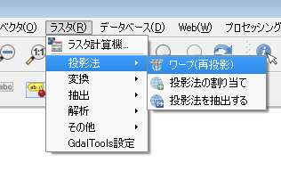

〈ターゲット〉にチェックを入れて空間参照システムの一覧から「JGD2000/UTM zone 54N（EPSG:3100）」を選択し『OK』ボタンを押します。ここでは投影座標系としてUTMを選択し、岩手県のデータを使用したのでゾーン番号は54を選択しました。UTMのゾーン番号は地域によって異なるのでダウンロードしたデータの場所に従って変更してください(1章4節参照)。
「出力ファイル」を指定して、〈リサンプリングメソッド〉にチェックを入れて〔双線形〕を選択します。『OK』ボタンを押すと投影法が変換されたGeoTIFFが作成されます。

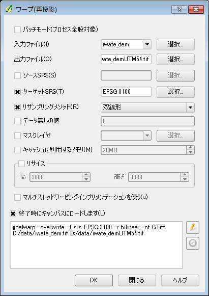

####傾斜、傾斜方位を計算する
日射量を計算するためには、標高、傾斜、傾斜方位のデータが必要です。そのため標高データから傾斜と傾斜方位のデータを作成します。

QGISから新規プロジェクトを開き、UTMに変換したGeoTIFF形式の標高データを読み込みます。メニューの『ラスタ』→『解析』→『DEM(地形モデル)』を選択します。

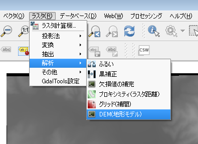

「モード」を〔傾斜〕にして「出力ファイル」を指定して『OK』ボタンを押します。これで傾斜のデータが作成できました。

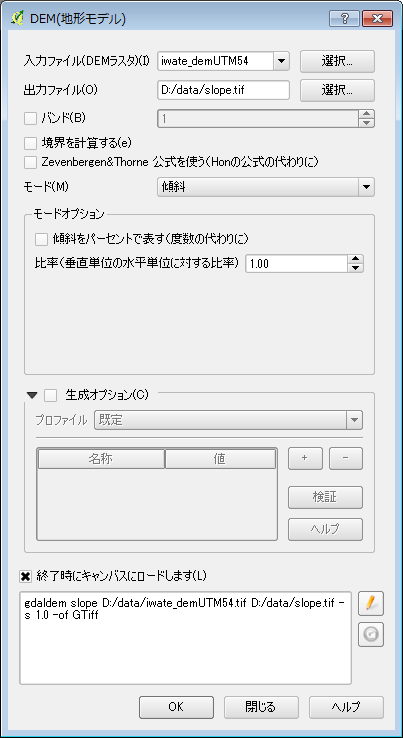

傾斜方位も同様にメニューの『ラスタ』→『解析』→『DEM(地形モデル)』を選択します。「モード」を〔傾斜方位〕にします。「モードオプション」の〈三角法角度を返す〉と〈平地の値に0を返す〉の両方にチェックを入れます。このオプションによって傾斜方位を東0°、北90°、西180°、南270°とし、傾斜のない平坦地が0°となります。「出力ファイル」を指定して『OK』ボタンを押すと傾斜方位のデータが作成されます。

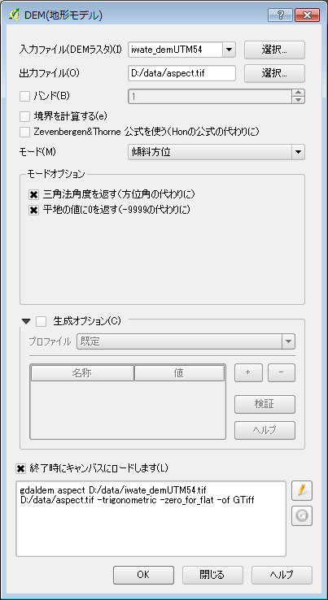

####日射量を計算する
用意した標高、傾斜、傾斜方位のデータを使用して日射量を計算します。日射量はプロセッシングツールからGRASS GISのr.sunを実行して計算します。

QGISに標高、傾斜、傾斜方位のラスタデータを読み込みます。メニューから【プロセッシング】→【ツールボックス】を選択し「プロセッシングツールボックス」が開いたら、ツールボックス下部のリストボックスを「Advanced Interface」に変更します。ツールボックスから「GRASS commands」→「Rater」→「r.sun」を選択します。

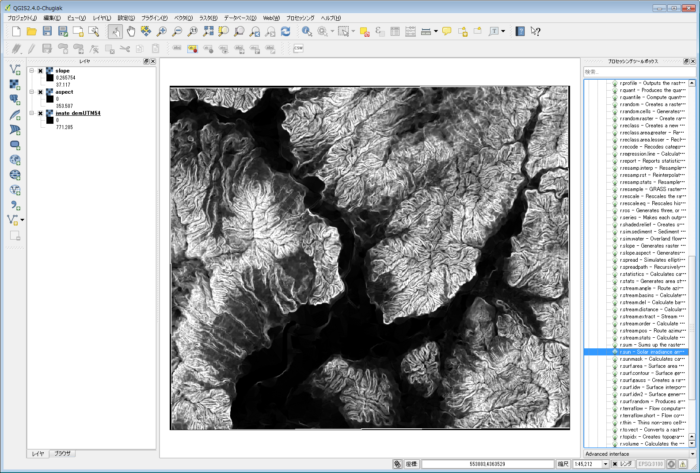

「Elevation layer」に作成した標高データを指定します。同様に「Aspect layer」に傾斜方位、「Name of the input slope raster map」に傾斜データを指定します。「No. of day of the year」に{172}と入力します。これは、1月1日から数えて172日目（夏至のあたり）の日射量を計算するという意味になります。「Output global(total) irradiance/irradiation layer」に出力するファイル名を指定します。このファイルは、直射日射、散乱日射、反射日射を合計した指定した日の総日射量を出力します。それ以外の項目は今回は必要ないので、各項目の下にある〈Open output file after running algorithm〉のチェックを外しておきます。

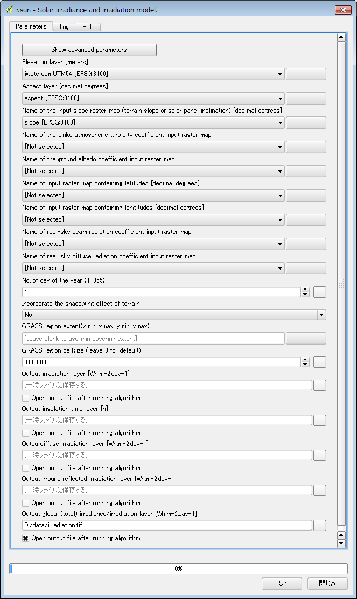

【RUN】ボタンを押すと計算が始まり、172日目の総日射量のファイル作成されます。ちなみに総日射量の値の単位は[Wh・㎡・1day]となります。
そのままだと分かりにくいので、色を変更します。作成されたラスタレイヤを右クリックして「プロパティ」を選択し[スタイル]タブを開きます。「バンド表示」の「レンダータイプ」を〔単バンド疑似カラー〕に変更します。「最小値/最大値のロード」の〈最小／最大〉にチェックを入れて『読み込み』ボタンを押します。「新規カラーマップを作成」から〔Spectral〕を選択し〈反転〉にチェックを入れて『分類』ボタンを押します。『OK』ボタンを押すと、日射量に応じ色分けされます。

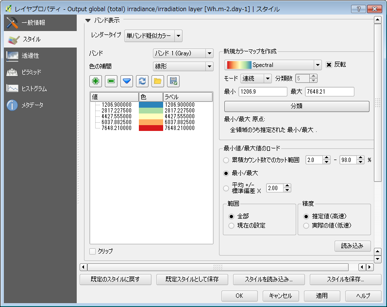
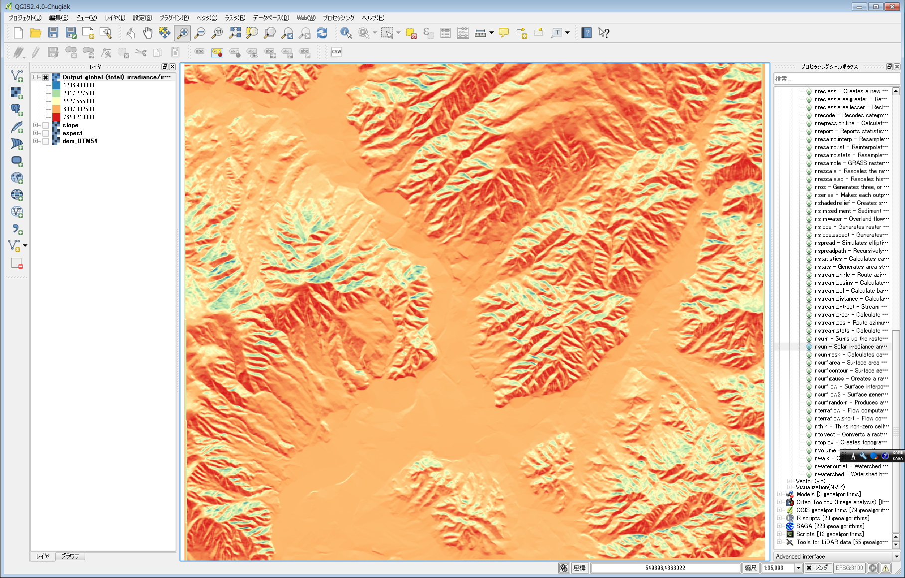

###データを組み合わせて新たな図を作成する
####ラスタデータを組み合わせる
この章で作成してきたデータを組み合わせて「カッパ出没マップ」を作成してみましょう。
よく知られているとおり、カッパは、河川に生息し、キュウリが好物で、頭の皿の乾燥に弱いという生き物です。これを踏まえ「河川からの距離」「畑地の面積率」「日射量」のデータを組み合わせてカッパが出没しやすい地域を可視化してみます。

ラスタデータを組み合わせるには「ラスタ計算機」を使用します。ラスタ計算機は、ラスタデータの各セルの値を条件によって変更したり、複数のラスタデータの各セルとセルの値を足したり引いたりして、新たなラスタデータを作成するツールです。

QGISから新規プロジェクトを開き、これまで作成した「河川からの距離」「日射量」「畑地の面積率」のデータを読み込みます。QGISのメニューから【ラスタ】→【ラスタ計算機】を選択します。

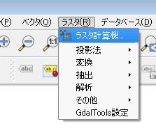

「ラスタバンド」には現在読み込まれているラスタレイヤの一覧が表示されます。計算に使用したいバンドをダブルクリックすると下の「ラスタ演算式」に追加されるので、これを使って演算式を作成します。

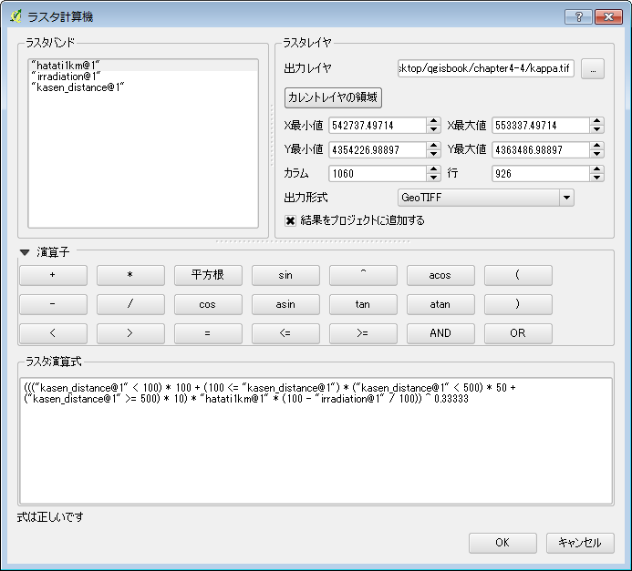

*演算式*
	
	((("kasen_distance@1" < 100) * 100 + (100 <= "kasen_distance@1") * ("kasen_distance@1" < 500) * 50 + ("kasen_distance@1" >= 500) * 10) * "hatati1km@1" * (100 - "irradiation@1" / 100)) ^ 0.33333

カッパの出没マップを作成するには上記の演算式を入力するのですが、これについて説明します。ここでは、河川からの距離がkasen_distance、畑地率がhatati1km、日射量がirradiationという名前のラスタレイヤになっています。

*演算式の説明 1*	

	("kasen_distance@1" < 100)

まず、最初のカッコの部分は、kasen_distanceのラスタ値が100より小さければ1、そうでなければ0を返すという条件式です。また、kasen_distanceの後ろに付いている@1というのはラスタのバンド番号で、例えばRGB画像などはR、G、Bの3バンドあるのでバンド番号がそれぞれ@1、@2、@3となります。今回のラスタデータは河川からの距離だけが入った1バンドのラスタデータなので@1のみとなります。

*演算式の説明 2*

	(100 <= "kasen_distance@1") * ("kasen_distance@1" < 500) * 50
	
次にこの部分は、kasen_distanceが100以上であれば1を返す部分と、kasen_distanceが500より小さければ1を返す部分を掛けています。つまり、kasen_distanceが100以上かつ500より小さければ1を返し、そうでなければ0を返すことになります。また、最後にそれに対して50を掛けているので、この式の部分は河川からの距離が100mから500mの場所はその値を50にするという意味になります。

*演算式の説明 3*

	(("kasen_distance@1" < 100) * 100 + (100 <= "kasen_distance@1") * ("kasen_distance@1" < 500) * 50 + ("kasen_distance@1" >= 500) * 10))
	
ここまでの説明からkasen_distanceを含む上記の部分は、以下の表のようにラスタ値を変更するという意味になります。

*表 河川までの距離とラスタ値の関係*

|河川までの距離|ラスタの値|
|----|----|
|0～100m|100|
|100～500m|50|
|500m～|10|

その後に続くhatati1km@1は、なにも変更せず0～100の畑地率の値をそのまま使います。

*演算式の説明 4*

	(100 - "irradiation@1" / 100)

irradiationの部分は、切片が100で傾きが-1/100の直線式となっています。つまり、日射量が0[Wh・㎡・1day]だとラスタ値が100で、10000[Wh・㎡・1day]だと0になるように変換されます。

*演算式の説明 5*
	
	((("kasen_distance@1" < 100) * 100 + (100 <= "kasen_distance@1") * ("kasen_distance@1" < 500) * 50 + ("kasen_distance@1" >= 500) * 10) * "hatati1km@1" * (100 - "irradiation@1" / 100)) ^ 0.33333

最後に、kasen_distance、hatati1km、irradiationの部分を掛けあわせて、それを0.33333乗しています。これは各ラスタレイヤを0～100になるように変換した上で、その相乗平均をとることを意味します。つまり、ラスタレイヤの内1つでも0だと全体が0になり、すべてのレイヤが100であれば100になります。

総合すると、河川までの距離が近く、畑地が多く、日射量が少ない場所が、カッパが出没しやすい場所（ラスタ値が100に近い）となるように、反対に河川までの距離が遠く、畑地が少なく、日射量が多い場所はカッパが出没しにくい場所（ラスタ値が0に近い）となるようにラスタ値を変換する式になっています。

この演算式を入力し、出力レイヤを指定します。最後に、出力するラスタレイヤの大きさを決めるために「ラスタバンド」のhatati1km@1のレイヤを選択し、『カレントレイヤの領域』ボタンを押します。これで出力されるラスタレイヤの大きさは畑地率のラスタと同じ大きさに設定されます。『OK』ボタンを押すとラスタが作成されます。作成されたラスタレイヤを右クリックして「プロパティ」を選択し[スタイル]タブを開きます。「バンド表示」の「レンダータイプ」を〔単バンド疑似カラー〕に変更します。「最小値/最大値のロード」の〈最小／最大〉にチェックを入れて『読み込み』ボタンを押します。「新規カラーマップを作成」から〔Spectral〕を選択し〈反転〉にチェックを入れて『分類』ボタンを押します。『OK』ボタンを押すと、カッパが出没しやすい場所が赤く着色されます。

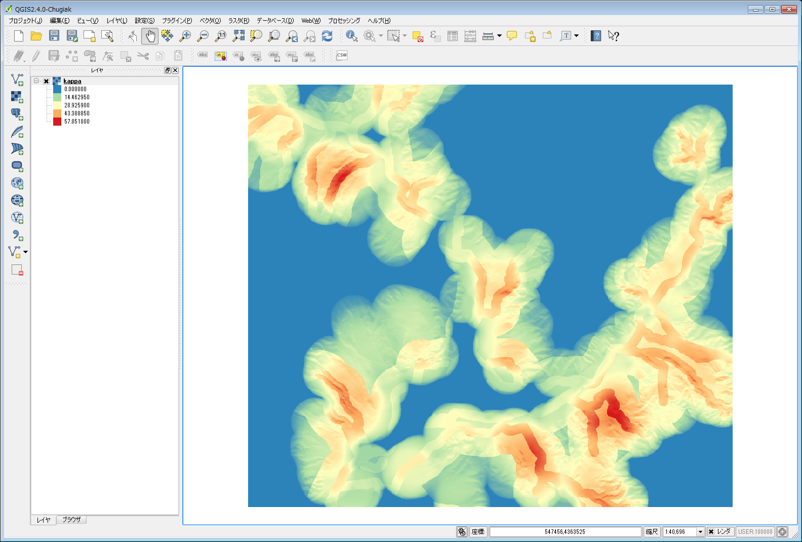

####(Column) 統計モデル
今回はカッパが出没しやすい地域として計算式を経験に基づき適当に決定しましたが、これをもう少し数学的に求める方法として統計モデルを利用する手法があります。統計モデルは、観察された結果（カッパを確認した・しないなど）と、その原因と考えられる要因（川が近い、畑地が多い、日陰の場所など）から、その関係性を統計的に数値化する手法です。QGISでもプロセッシングツールでRと連携することによって、このような解析も可能になります。今後は、地理情報においてもGISの利用方法だけでなく、統計によるデータ解析といった部分も重要となっていくと思いますので、合わせて学習するとより一層オープンデータの活用の幅が広がることでしょう。

####ラスタデータとベクタデータを組み合わせる
国土数値情報の小学校データと作成した「カッパ出没マップ」を組み合わせて、小学校周辺の「カッパ遭遇危険度マップ」を作成してみましょう。
手順としては、小学校から半径300m以内のエリアを作成し、その中でのカッパの出没しやすさを集計し、エリア間の相対的な危険度を可視化してみます。

#####データのダウンロード
国土数値情報の小学校データのダウンロードの方法は、4-4-◯で説明した河川データの場合と同じです。国土数値情報のページで[JPGIS2.1]形式の「小学校区」からダウンロードします。ZIPファイルを解凍すると2種類のシェープファイルとxmlファイルが入っていますが、A27-10_03-g_PublicElementarySchoolの名のシェープファイルが使用する小学校のポイントデータになります。（数字の部分はダウンロードした地域によって異なります）

#####バッファーの作成
QGISに小学校のデータを読み込み、レイヤのCRS（空間参照系）を定義し、「カッパ出没バップ」と同じ投影法に投影変換をしておきます。メニューから【ベクタ】→【空間演算ツール】→【バッファ】を選択します。

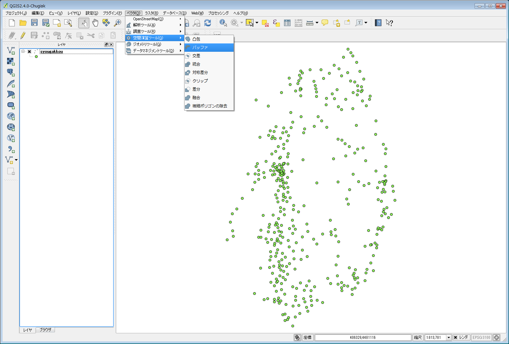

〈バッファ距離〉を選択し値を{300}と入力します。「出力シェープファイル」を指定し『OK』ボタンを押すと小学校のポイントから300mのバッファーエリアが作成されます。

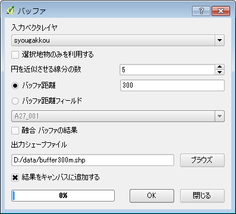

#####バッファー内のラスタを集計
ベクタデータのポリゴン内に含まれるラスタデータの値を集計するためには、「地域統計プラグイン」を利用します。「地域統計プラグイン」はQGISにあらかじめインストールされていますが、有効になっていないので、最初にそれを変更します。

QGISのメニューから【プラグイン】→【プラグインの管理とインストール】を選択します。

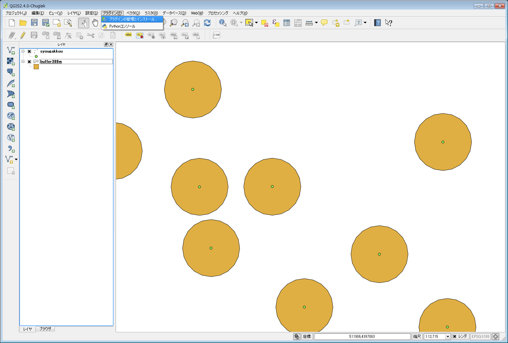

開いたウインドウから[インストール済]タブを選択して、一覧の中から〈地域統計プラグイン〉にチェックを入れ、『閉じる』ボタンを押します。これで「地域統計プラグイン」が有効になりました。

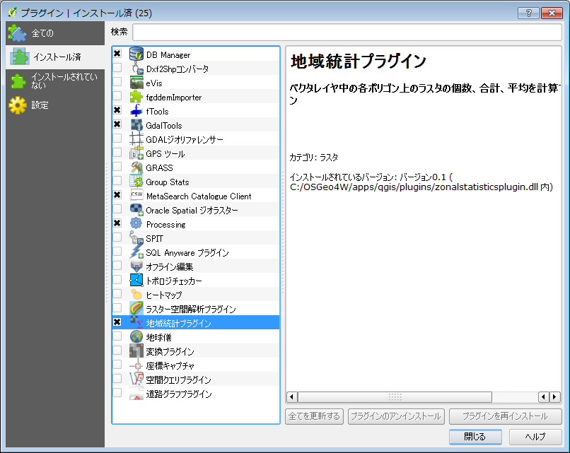

QGISに「カッパ出没マップ」のデータと、小学校のバッファーデータを読み込みます。メニューから【ラスタ】→【地域統計】→【地域統計】を選択します。

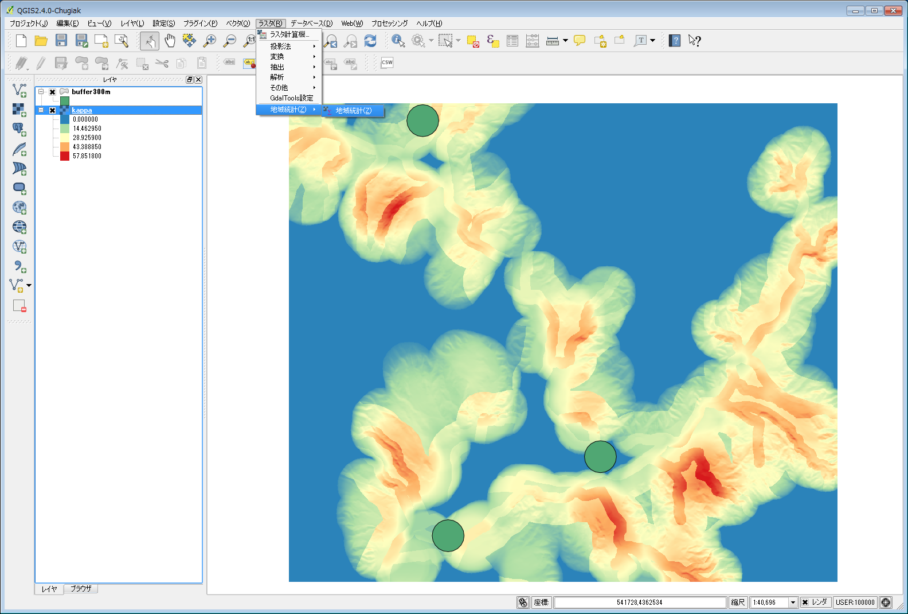

「ラスラレイヤ」にカッパデータを指定し、「ポリゴンレイヤが含む地域」にバッファーデータを指定します。「出力カラムプレフィックス」は、集計結果の列名に共通で入る名称なので{kp_}と入力しておきます。『OK』ボタンを押すと集計結果がバッファーの属性テーブルに追加されます。

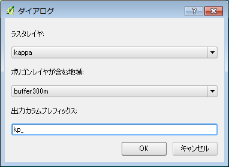

バッファーレイヤを右クリックし「属性テーブルを開く」を選択し、属性テーブルを確認します。「kp\_count」、「kp\_sum」、「kp_mean」が集計結果の列で、それぞれラスタのセル数、合計値、平均値が入っています。ただし、ラスタデータが存在しない部分は集計できないのでNULLとなっています。

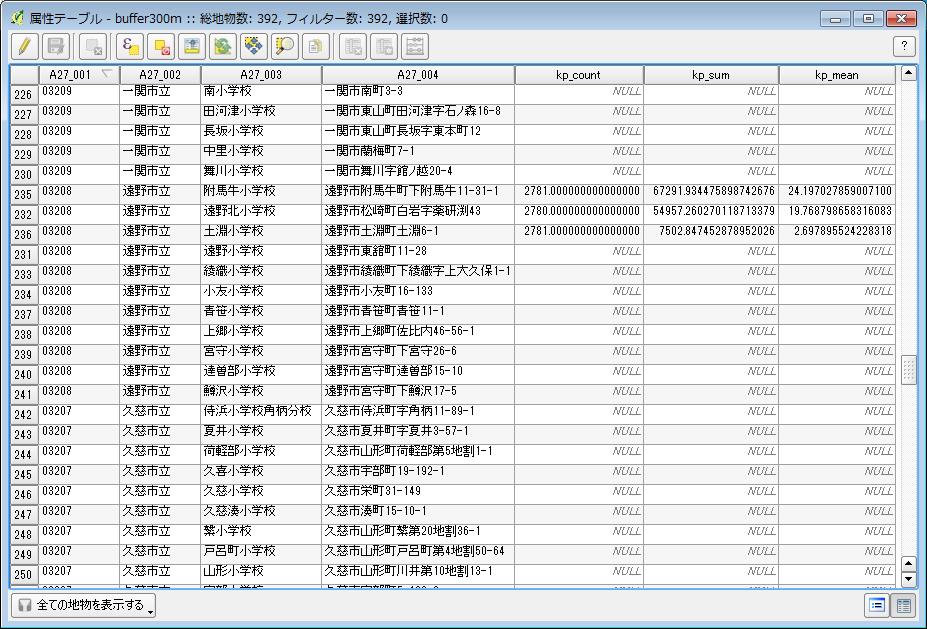

#####スタイルを整える
集計結果をもとにバッファーレイヤにダイアグラム形式のスタイルを設定します。バッファーレイヤを右クリックして「プロパティ」を選択します。[ダイアグラム]タブを選択します。〈ダイアグラムの表示〉にチェックを入れ、「ダイアグラムタイプ」を〔ヒストグラム〕に変更します。[大きさ]タブを選択し、上段の「属性」を〔kp_sum〕に変更し、その横の「大きさ」に{10}と入力します。下段の「利用可能な属性」のリストから"kp_sum"を選択し『＋』ボタンを押します。『OK』ボタンを押すと、kp_sumの値に従った棒グラフが表示されます。

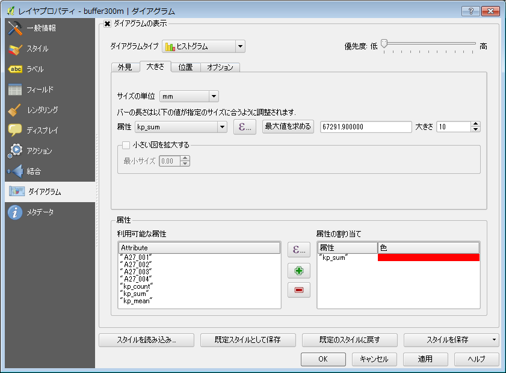

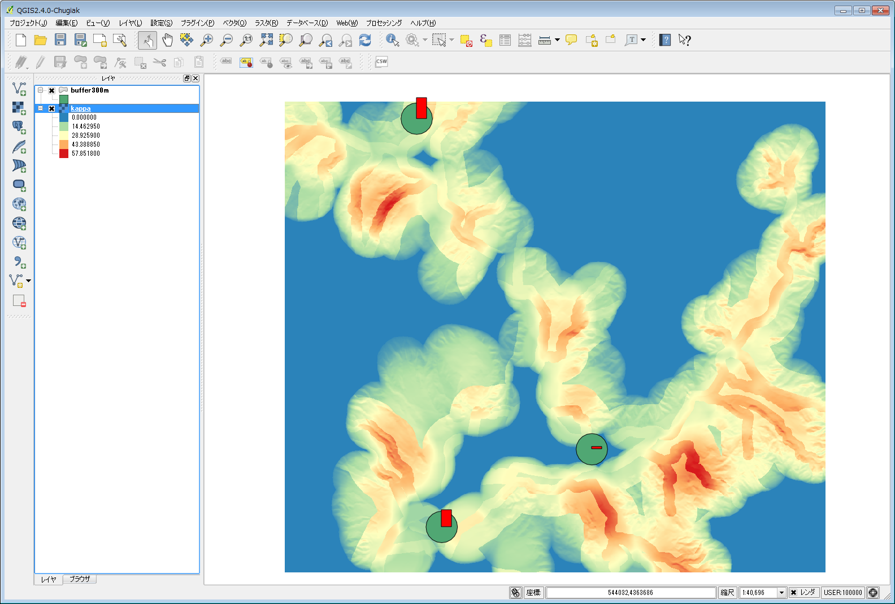

これまで使用したデータや陰影起伏図を重ね合わせ、スタイルを整えれば「カッパ遭遇危険度マップ」が作成できます。その詳細は、ここでは示さないので、QGISを使いこなして、是非みなさん挑戦してみてください。

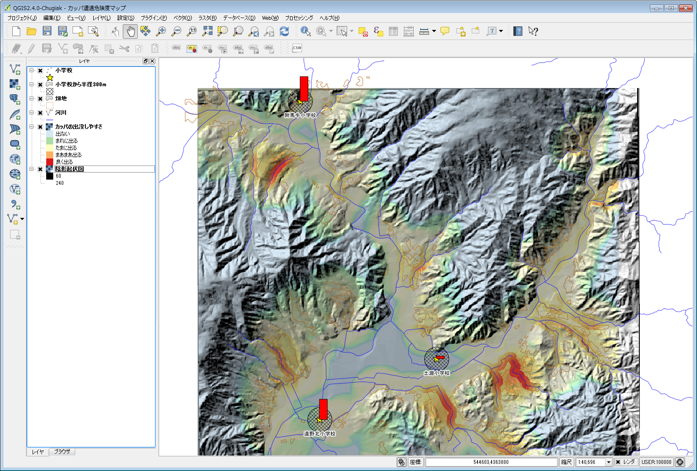

#####(Column)オープンソースとしてのQGIS
QGISを使用していると、メニューやラベルなどの表記で少し日本語がおかしなところがあるなと気が付くと思います。このようなソフトを使っても大丈夫かな？と少し不安になるかもしれませんが、そんな時こそあなたがQGISに貢献するチャンスです。QGISはオープンソースのプログラムとして世界中の技術者によって開発されており、オリジナルの状態ではメニューやラベルの表記は英語になっています。それを日本の有志が翻訳作業をし、その結果が日本語訳としてプログラムに反映されています。有志と言っても、各人、時間が取れない中での作業なので、なかなか完璧な状態では仕上げられません。なので、是非あなたも有志となってQGISがより良いソフトになるように一緒に貢献しませんか？QGISはオープンソースだからこそ誰でも貢献でき、また発展し続けるのです。なんだかオープンデータの理念とも通ずるところがありますね。

興味のある方は、まずはOSGeo財団日本支部が主催するFOSS4Gなどのイベントに参加してみることをお勧めします。