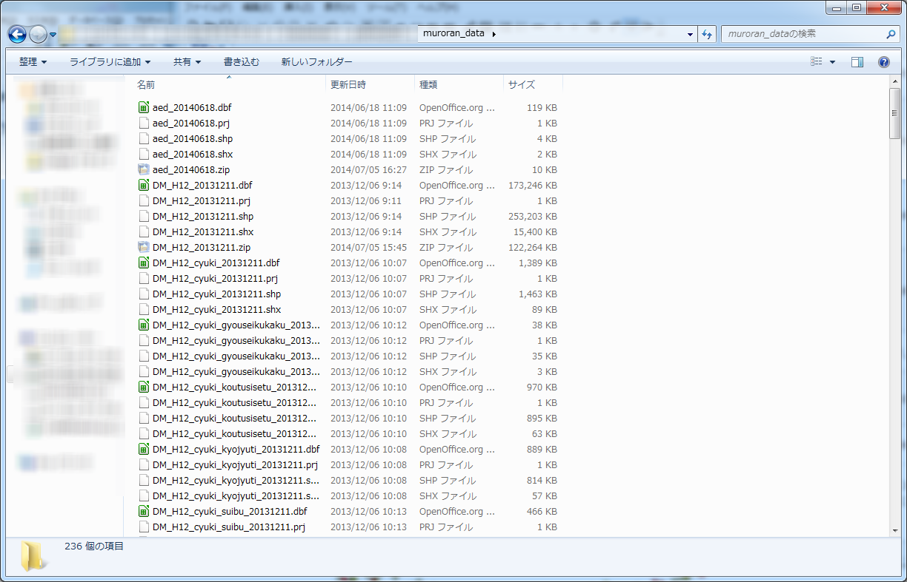
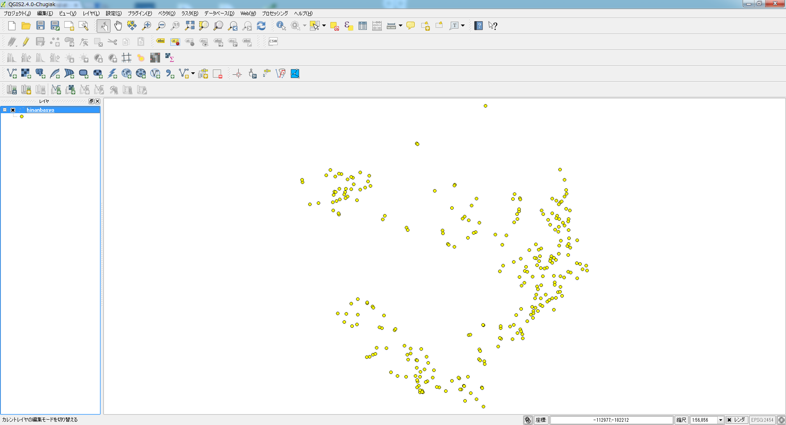
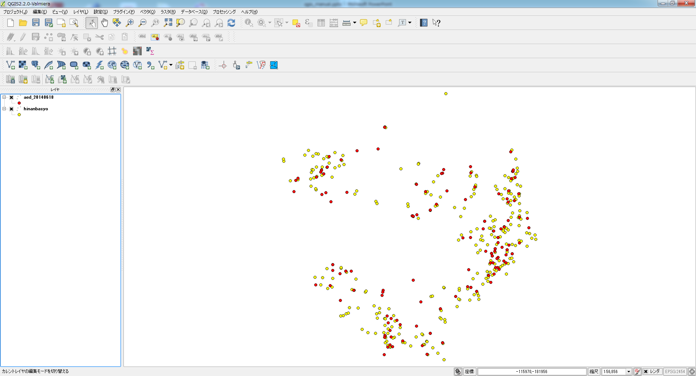
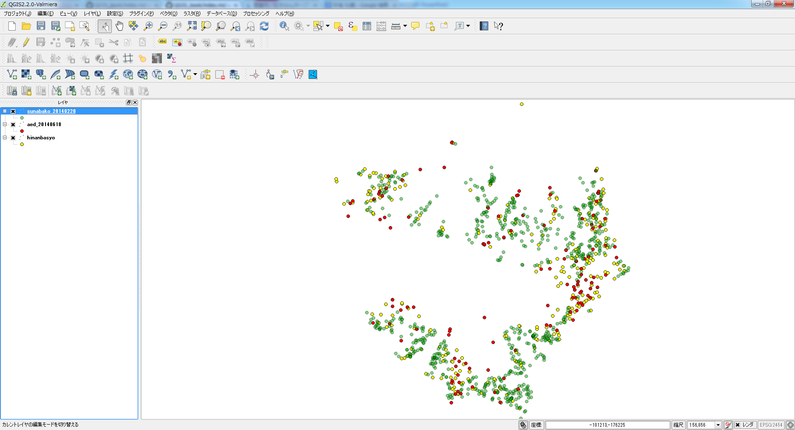
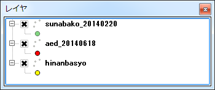
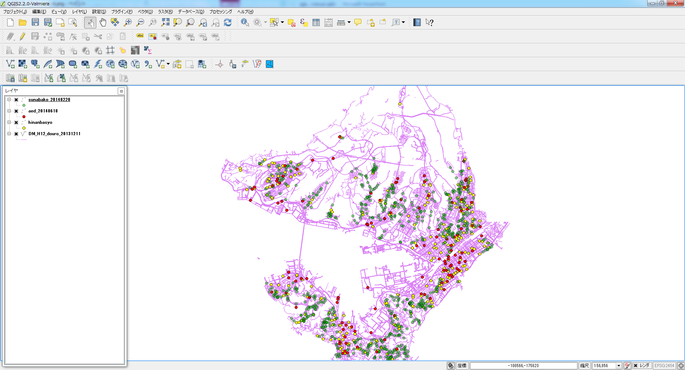
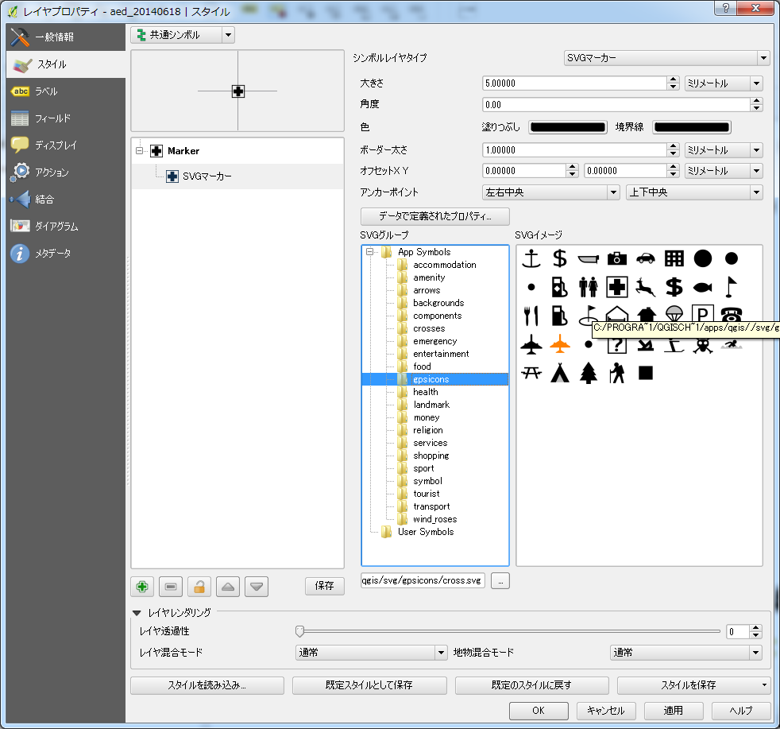
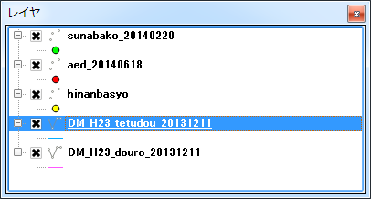

#　テーマを決めてデータを可視化する
##a. 防災・減災・安全に役立つ地図を作成する

###1. 防災・減災・安全に役立つ地図を作成するためにデータをダウンロードしましょう。

今回は題材として、北海道室蘭市で提供するオープンデータを利用して、防災・減災に関する地図を作成してみましょう。
データに関しては下記リンクより最新のものが提供されております。

- http://www.city.muroran.lg.jp/main/org2260/odlib.php

画面中段のオープンデータのダウンロードより、Shape(ZIP:データ容量)と記載されているものをダウンロードして保存してください。
データのダウンロード時に、ダウンロードしたファイル名がデータ名と異なるので、公式ページに記載されている内容を一部を変更して以下に対応表を記載します。

|ジャンル|データ名|説明|ダウンロード時のファイル名|
|------|------|----|-----------|
|地図|都市計画現況図平成12年版|都市計画現況図を1レイヤに統合してあります ページ下部の注意事項をご覧下さい|DM_H23_20131211.zip |
|地図|都市計画現況図平成12年版　レイヤ別|都市計画現況図を分類ごとにレイヤを分けたものです ページ下部の注意事項をご覧下さい|DM_H12_Layer_20131211.zip|
|地図|都市計画現況図平成23年版|都市計画現況図を1レイヤに統合してあります ページ下部の注意事項をご覧下さい|DM_H23_20131211.zip|
|地図|都市計画現況図平成23年版　レイヤ別|都市計画現況図を分類ごとにレイヤを分けたものです ページ下部の注意事項をご覧下さい|DM_H23_Layer_20131211.zip|
|安全|AED設置事業所|AED(自動体外式除細動器)を設置している事業所|aed_20140618.zip|
|安全|砂箱|砂箱を設置している場所|sunabako_20140220.zip|
|防災|避難場所|災害時の避難場所|hinanbasyo_20130826.zip|
|防災|津波浸水深さ|津波で浸水する深さの予測図|tsunami_20130826.zip|
|防災|洪水浸水深さ|洪水で浸水する深さの予測図|flood_20130826.zip|
|防災|津波避難目標地点|津波の避難の際に目指すべき目標地点|tsunamimokuhyo_20130826.zip|
|防災|津波避難路|津波避難目標地点から避難場所までの経路|tsunamikeiro_20130826.zip|
|防災|土砂災害警戒区域(急傾斜地)|　|dosya_keisya_20130826.zip|
|防災|土砂災害警戒区域(土石流)|　|dosya_dosekiryu_20130826.zip|
|防災|土砂災害警戒区域(未指定急傾斜地)|　|dosya_mi_keisya_20130826.zip|
|防災|土砂災害特別警戒区域(土石流)|　|dosyatk_dosekiryu_20130826.zip|
|防災|土砂災害特別警戒区域(未指定急傾斜地)|　|dosyatk_mi_keisya_20130826.zip|
|防災|がけ崩れ危険区域|　|gake_20130826.zip|
|防災|がけ崩れ危険区域(対策済)|　|gakezumi_20130826.zip|
|防災|土石流危険区域|　|dosekiryu_20130826.zip|

今回は作業用に必要なzipファイルを一つのフォルダにまとめ、そのフォルダをmuroran_dataとしました。muroran_dataフォルダ内に必要なzipファイルを展開しました。

下記の図のようなフォルダ構成になるかと思います。
.

###2. 点要素のスタイル --point--

点要素のスタイルと言われてもピンと来ないかもしれません。例を挙げると○○の設置場所、避難所等が点要素のスタイルとして定義されるのが一般的です。ベクターデータを新規レイヤとして追加します(操作方法についてはAppendix Iを参照のこと)。先ほど展開したデータの中から、hinanbasyo.shpを追加します。以下の図のようになりましたか。

.

同様に、aed_20140618.shp追加してみましょう。

.

さらに、sunabako_20140220.shpを追加してみましょう。

.

このように、点要素のデータはビューのレイヤパネルに小さな〇が記載されていることを確認してください。

.

見やすいようにカラーを変更したい場合はAppendix Iのレイヤにスタイルを設定するを参照してください。

###3. 線要素のスタイル --line--

線要素のスタイルにはどのようなものがあるでしょうか、一般的には、鉄道や道路、河川などが挙げられると思います。それではベクターデータを前項の点データと重ねてみましょう。

まず初めに道路データを追加してみましょう。道路データはDM_H12_douro_20131211.shpになります。

.

次に、鉄道のデータを追加してみましょう。鉄道のデータはDM_H12_tetsudou_20131211.shpになります。

.

見にくい場合や、ポイントデータが隠れてしまう場合などはレイヤパネルのレイヤの順序を入れ替えてみましょう。ドラッグしたままレイヤの順位を変更すると、地図ビューに変更が反映されます。

.

また、線要素のデータはビューのレイヤパネルに細い線が記載されていることを確認してください。

