##印刷する
###プリントコンポーザ
マップキャンパスに可視化した地図を、紙の地図や画像データとして保存を行なうには「マップコンポーザ」を使用します。マップコンポーザ上にマップキャンパスに可視化された地図、タイトル、スケール、画像などを配置していき、出力のイメージを作成します。  
新規にマップコンポーザを作成するには、メニューから【プロジェクト】→【新規プリントコンポーザ】を選択します。

新しく作成するプリントコンポーザにはユニークなタイトルが必要となります。タイトルを入力して『OK』をクリックしてください。もしタイトルを入力しない場合、"コンポーザ1" "コンポーザ2"のように自動でタイトルが付けられます。
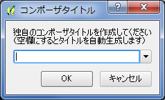

新しいプリントコンポーザが立ち上がったら、まずは[コンポジション]タブから用紙の設定を確認しましょう。デフォルトではA4横サイズの紙が定義されています。マップキャンパスに可視化した地図を、どのように出力するかを考えて設定を行います。例えば、1枚の紙に全ての地図を入れたいのであれば、地図の含む範囲と縮尺から必要な紙のサイズが決まってきます。逆に、地図の含む範囲と紙のサイズから、縮尺が決まってくるかもしれません。紙、画像を問わず、絵としての最終成果物を想定している場合は、本来は可視化の前にどの程度の縮尺で出力するかを想定しておいた方がいいでしょう。
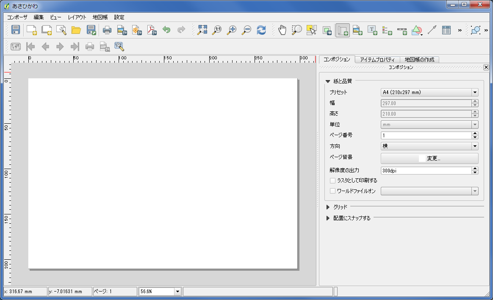

###コンポーザマネージャ
すでに作成済みのプリントコンポーザがある場合は、それを使うことも出来ます。メニューから【プロジェクト】→【プリントコンポーザ】を選ぶと、作成済みのタイトルが表示されますので、選択してください
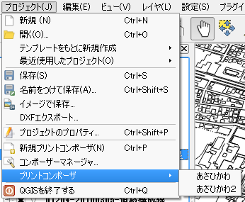

作成済みのプリントコンポーザの管理は、メニュー【プロジェクト】→【コンポーザマネージャ】にて行います。不要になったプリントコンポーザの削除、コンポーザの複製、コンポーザのタイトル変更などが行えます。またプリントコンポーザに配置した要素の設定はテンプレートとして取っておけますので、テンプレートを利用したコンポーザの新規作成も行えます。
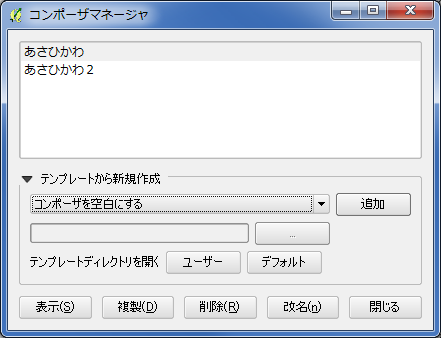

作成されたプリントコンポーザはQGISのプロジェクト中に保存されます。プロジェクトを保存したタイミングで、プリントコンポーザに設定した内容が保存されることに注意するようにしてください。新規にプリントコンポーザを作成し、各要素を配置して出力のイメージが出来上がっても、プロジェクトを保存しなくては作業内容が失われてしまいます。  

###地図を配置する
新規のプリントコンポーザを立ちあげて、出力イメージを作成していきましょう。まずは地図の配置です。【レイアウト】→【地図の配置】を選択し、用紙上でマウスのドラッグ操作を行い、大きさを調整しながら地図を配置します。大きさは後で変更可能ですので、大まかな配置で十分です。キャンバス上で可視化された地図が貼り付きます。
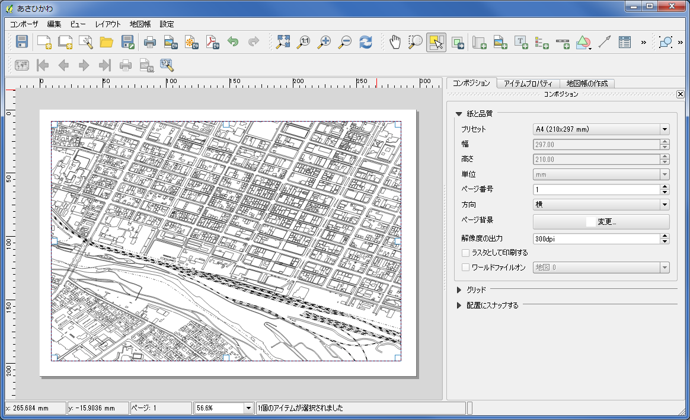

一度配置した地図の用紙上の位置を変更するには、【レイアウト】→【アイテムを移動】を選択後に、対象の地図をクリックします。ドラッグ操作にて位置を移動できますし、要素隅へマウスを持って行くことでマウスカーソルが変更され拡大縮小操作ができます。この操作は地図だけではなく、この後配置していく各要素に対しても行えます。  
細かい位置調整を行う場合は、[アイテムプロパティ]タブの<位置とサイズ>を使用します。紙いっぱいに地図を表示したいと思っても、プリンターの構造上、印刷出来ない範囲が出てきます。こういった場合、一回り大きな紙に出力しておき、断裁用のトンボを付けるのですが、ここではそこまで専門的には行わないでおきます。余白として15mm、周囲に取ることにしましょう。こちらの方が、普段持ち運ぶ地図、利用する地図としては、一般的なレイアウトかと思います。<位置とサイズ>に、余白として紙左上から15mmとり、地図を267mm x 180mmの大きさで配置と、直に数字を入れていきます。
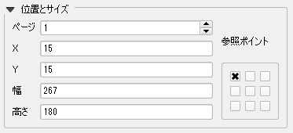

おなじく[アイテムプロパテイ]タグから<フレーム>も設定しましょう。配置した地図の周りに枠を描画します。これで、余白との境目が明確になります。
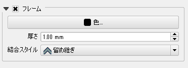

配置した要素内に描画されている地図の位置、縮尺を調整したい場合は、【レイアウト】→【コンテンツを移動】を選択したうえで、地図要素をクリックします。ドラッグ操作にて表示位置を調整出来ますし、マウススクロールにて縮尺も調整出来ます。  
正確に、縮尺、範囲を指定したい場合は、[アイテムプロパティ]の<メインプロパティ><領域>に数字を直に入れることも出来ます。可視化した地図がキレイに見れる縮尺を設定しましょう。
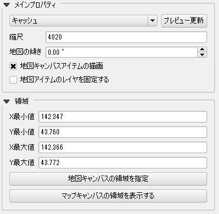

###全体図を配置する
可視化した地図を紙いっぱいに出力している場合は必要ありませんが、範囲を数枚の紙に分けて出力する場合、各出力範囲が全体でどこにあたるかわかった方が地図として使用しやすいです。全体図の配置を行いましょう。  
その前に少しだけ可視化した地図の表現の確認を行います。全体図で使用するため地図を広域で表示した場合には、処理が重たい、表現が潰れてしまう、といったことになりがちです。広域図の際に不要な表現については表示をしないように描画設定を変更しておきましょう。  
QGIS本体に戻り、対象レイヤのプロパティを開きます。[スタイル]タブを開いて描画スタイルとして「ルールに基づいた」を選択します。<スケール範囲>を指定出来ますので、最小値、最大値を適当に設定しておくようにしましょう。これで設定したスケール範囲以外では表示されなくなります。
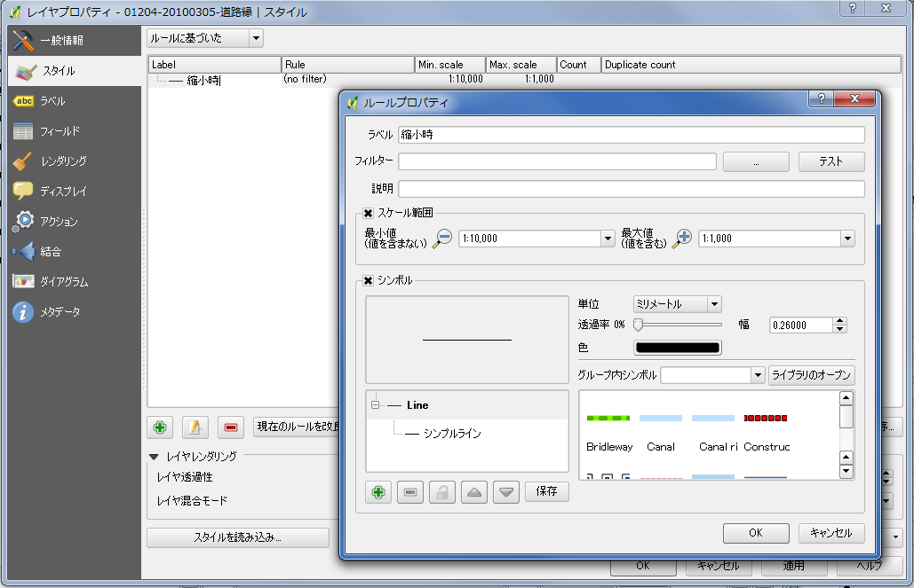

用意が出来たので、プリントコンポーザに戻ります。再び【レイアウト】→【地図を追加】を選択し、地図を用紙上に追加します。今度は、右下隅に小さく配置してみましょう。配置したら、[アイテムプロパティ]で<縮尺>を少し小さめ(例では1/10万程度)に設定します。また、重なってる地図との境界を明確にするために、[フレーム]は表示するようにします。サイズ、位置についてはお好みで調整してください。  
つづいて全体図として配置した小さく表示した地図に、もう一方の地図の範囲を表示するように設定します。[アイテムプロパティ]の<全体図>を開いて下さい。配置した各要素にはユニークな名前が付けられています。「オーバービューフレーム」から範囲を表示する対象の地図を選択します。例では2つしか地図を配置していないので、1つだけ地図要素がリストに出てきます。
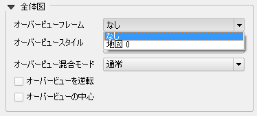

「オーバービュースタイル」で指定されている描画設定にて枠が表示されますので、ご確認ください。
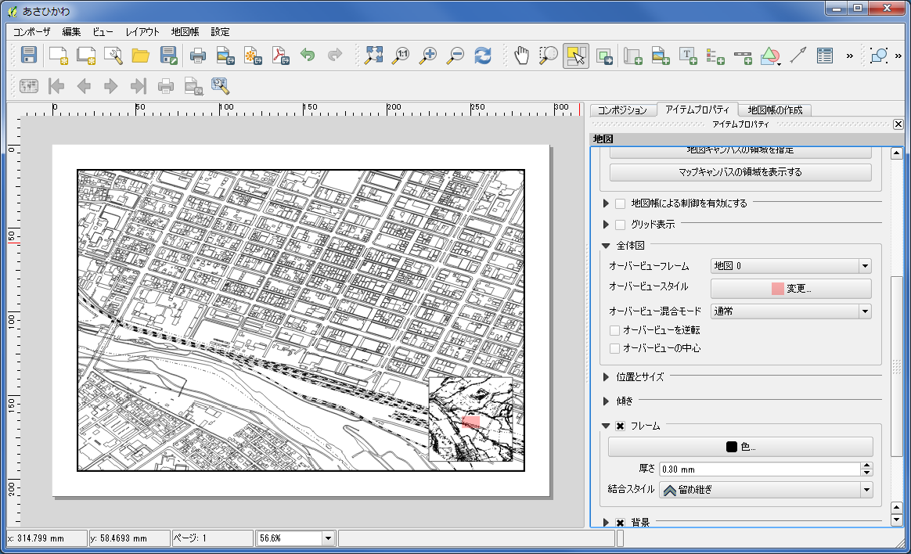

###タイトルを配置する
この地図が何を表す地図なのか他の人にわかるように、適切なタイトルは付けておくべきでしょう。【レイアウト】→【ラベル追加】からラベルを利用してタイトルを追加します。地図を配置したときと同じく、用紙上をドラッグして要素を配置します。  
ラベル文字列の入力は[アイテムプロパティ]で行います。フォント、フォント色など変更出来ますので、地図に合うよう調整してみてください。
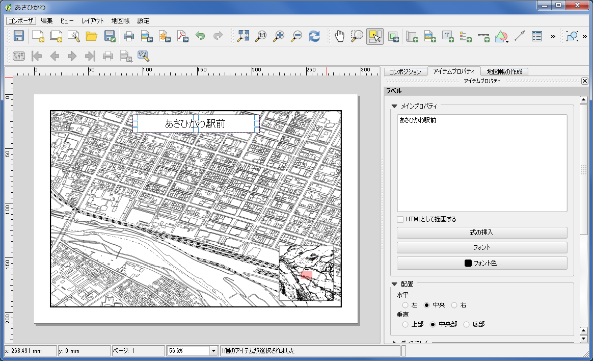

###スケールバーを配置する
つづいてスケールバーを追加しますが、ここで問題があります。他の要素と同じように【レイアウト】→【スケールバーを追加】でスケールバーを追加できるのですが、表示がおかしな数字になっていないでしょうか？スケールバーはプロジェクトに設定されている投影法の単位で表示されます。もし緯度経度で設定をしていた場合、スケールも緯度経度で表示されてしまいます。これではわかりにくいですね。すこし手間ですが、QGIS本体に戻って投影法の設定をやり直します。実距離系のものになっている場合は必要ありません。

QGIS本体に戻って、メニューから【プロジェクト】→【プロジェクトのプロパティ】→[CRS]タブを選択してください。<'オンザフライ'CRS変換を有効にする>にチェックを入れて、<フィルター>に3100と入力します。この値は地域によって変わってくるのですが、ここでは説明は省きます。表示される"JGD2000 / UTM zone 54N"を選択して『適用』を押して下さい。『適用』後、ダイアログは閉じて構いません。  
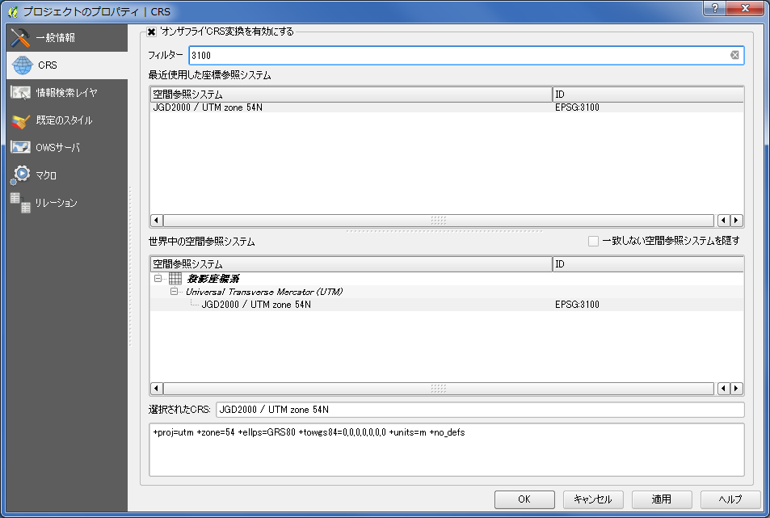

キャンバス上に表示されていた地図が消えてしまったかもしれませんが慌てずに。どのレイヤでもいいので選択して、【レイヤの領域にズーム】を選択してください。全域表示になってしまいますが、地図が再び表示されます。申し訳ありませんが、ここから必要範囲になるように再度、拡大、スクロールする必要はあります。

プリントコンポーザに戻ります。地図要素の描画範囲があっていないため、白く表示されていると思います。それぞれの地図要素を選択して、[アイテムプロパティ]の<領域>から『地図キャンパスの領域を指定』を選択して範囲を合わせて下さい。必要に応じて<縮尺>も設定します。  

回り道をしましたが、これで準備完了です。スケールバーを追加しましょう。  
気をつけるべき点としては、地図要素が2つ用紙上に存在しているため、[アイテムプロパティ]→<メインプロパティ><地図>に、対象としている地図が選択されていることを確認するようにしてください。全体図の方が選択されている場合があります。その後、<線分列>を変更して、スケールバー内のバーの数、各バーが表す距離をお好みで調整してみましょう。
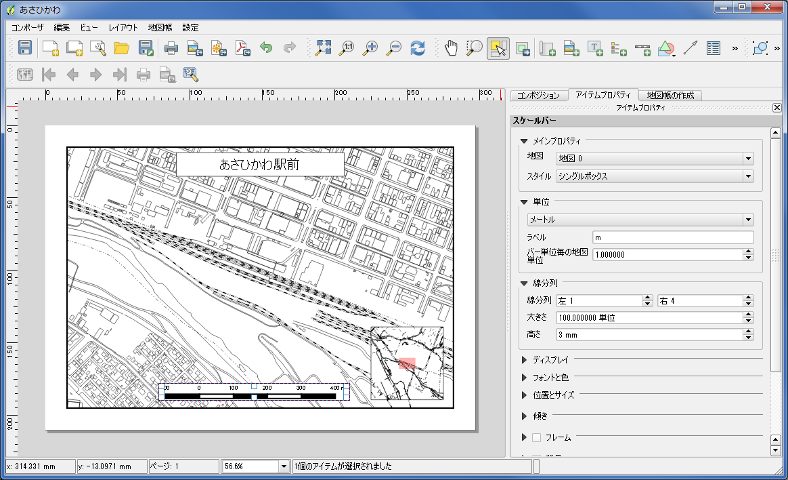

###方位記号を配置する
【レイアウト】→【イメージを追加】を利用して、方位記号を配置します。実際は方位記号の画像を貼り付けるだけですので、何か方位記号になる画像を持っている場合は、それを利用しても良いでしょう。北の方角がわかればよいので、一方に矢印が向いていることがわかる記号であれば問題ありません。  
QGISに付いてくる記号ですと、インストールディレクトリ内のsvg\arrows内にNorthArrow_xx.svgというSVGファイルが入っているので、それを利用することも出来ます。  
イメージを追加後、[アイテムプロパティ]の<メインプロパティ>内のイメージソースで使用する画像を指定します。
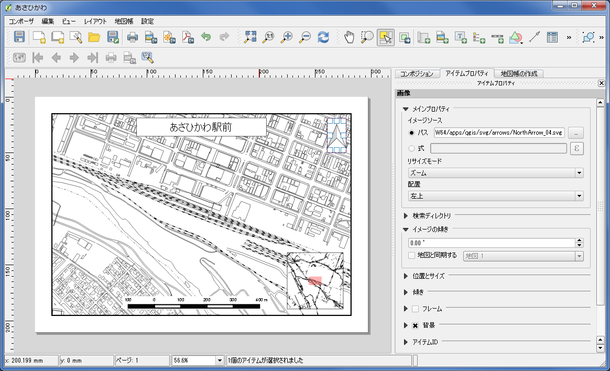

###凡例を配置する
一般に印刷図には、どの属性の図形がどの表現で描画されているかの関係を示す凡例を配置すべきです。凡例は【レイアウト】→【凡例追加】から他の要素と同じ操作で追加することができます。  
用紙上に配置後、[アイテムプロパティ]から<タイトル>の変更や、どの凡例を載せるかを<凡例プロパティ>を使用して調整することが出来ます。ただし、この例ではモノクロの基本となる地図を表示しているだけですので、必要ないと判断して載せない事にしておきます。基本となる地図の上に何かしらの主題を載せた場合は、必ず凡例を載せるようにしましょう。
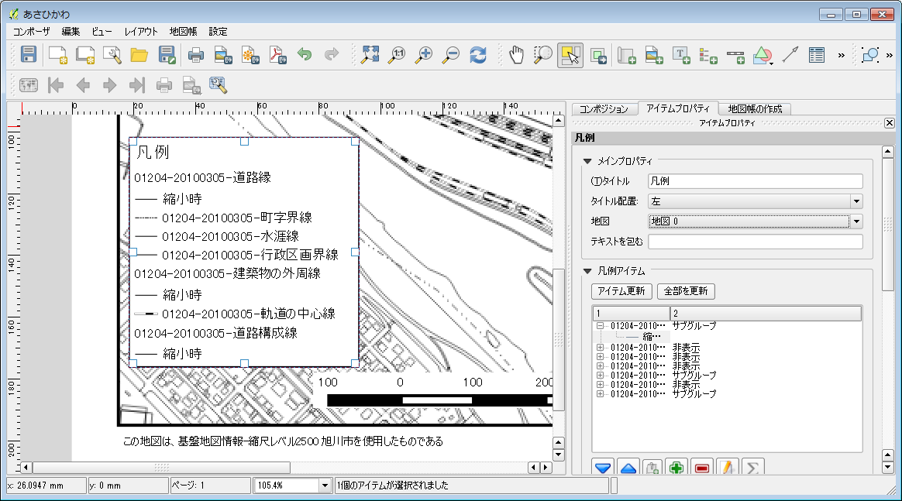

###その他の整飾
これでほぼ出力図としての体裁は整っています。ただし、出力する前に、もう一度、使用したデータのライセンスを確認しましょう。出所の明示は必要ではないでしょうか？また、あなたがこの図をPDFや画像でインターネット上に置く場合、あなたが付与するライセンスを表示しておく必要はないでしょうか？クリエイティブ・コモンズ・ライセンスのページにいって、ライセンスの表記方法を確認した方がいいかもしれません。  
こういった情報を欄外に加えておいた方がいいですね。この図の場合、基盤地図情報を利用しているので、【レイアウト】→【ラベルの追加】を利用して出所の明示をしておきます。ただし、作成した地図の使用方法によっては測量成果の複製・使用の承認が必要かもしれません、しつこいですが再度ライセンスの確認をしておきましょう。
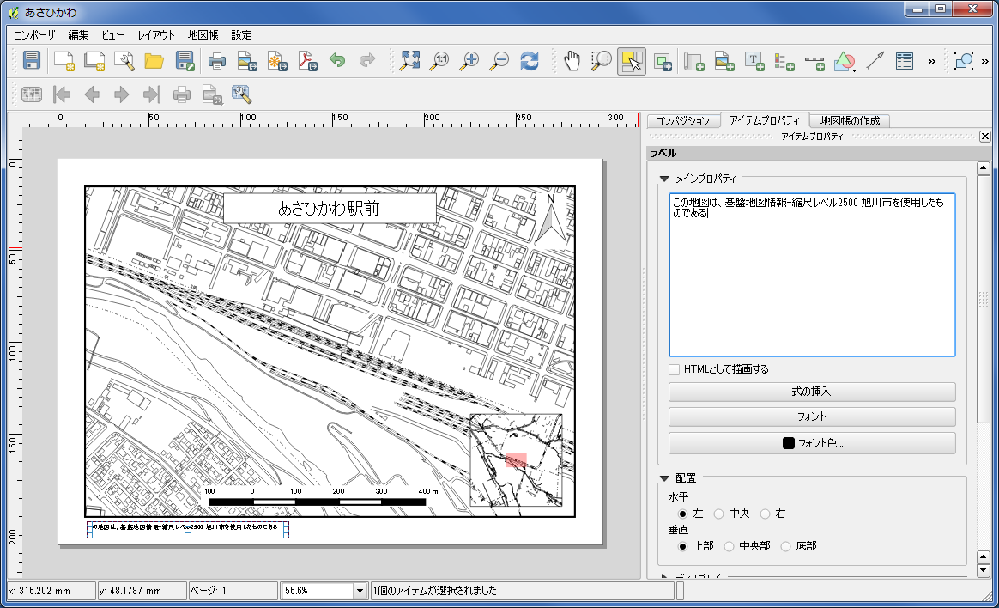

###出力する
あとは出力するだけです。出力の方法としては、紙への【印刷】以外に、【画像としてエクスポート】【PDFとしてエクスポート】【SVGとしてエクスポート】も選択できます。利用形態に合わせて、適切なものを選択してください。  
画像としてエクスポートする場合は、[コンポジション]にて<ワールドファイルオン>を選択しておくとよいでしょう。例えば、tif形式で出力した場合、拡張子が.tfwという座標の定義が書かれたファイルが一緒に出力されます。出力結果は座標を持った画像になりますので、GISで開いて位置を確認することができます。
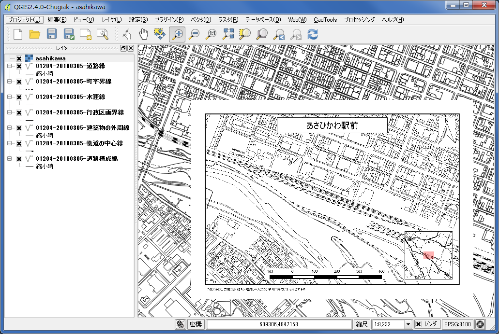

###地図帳機能を利用する
最後に便利な機能を1つ紹介しておきます。可視化したデータが1枚の紙に収まらなく、枠のデータを作成しておき複数の紙に分割して出力したい、もしくは行政区画のデータがあり区画毎に繰り返し出力したい、といった場合に使う機能として"地図帳"が用意されています。例として"行政区画"ポリゴンのレイヤがあったとします。この区画を利用して、それぞれを包括するような範囲で繰り返し出力を行ってみます。
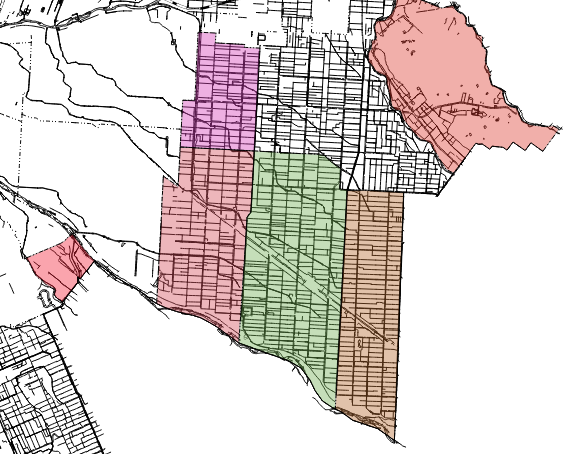

まず、プリントコンポーザで用紙上に配置した地図を選択し、[アイテムプロパティ]の<地図帳による制御を有効にする>にチェックを入れます。  
全体図として配置している地図については、チェックを入れないでおいてください。ただし、出力される地図の範囲が変更されても全体図として使えるように、"行政区画"レイヤ内のポリゴンをすべて含んで表示出来る縮尺に見直しておく必要はあるかもしれません。  
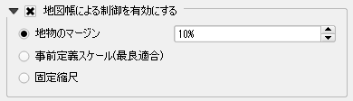

次に[地図帳の作成]タブを開き、<地図帳の作成>にチェックを入れます。<被覆レイヤ>として"行政区画"レイヤを選択し、<被覆レイヤを隠す>にはチェックを入れます。"行政区画"レイヤ内のポリゴンを基準として地図の範囲を設定していきますが、行政区画ポリゴン自体は描画しない設定になります。
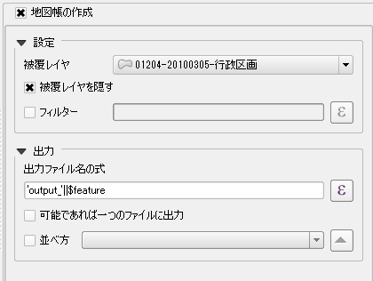

これで設定は終わりです。【地図帳】→【地図帳のプレビュー】を選択しましょう。同じく【地図帳】内の【最初の地物】【次の地物】【前の地物】【最後の地物】を使用して、被覆レイヤ内の図形に順にアクセスしていきます。地図に表示される範囲が変更されることを確認してみてください。  
確認が終わったら、【地図帳】内の出力メニューを使用して一連の出力をしてみましょう。
