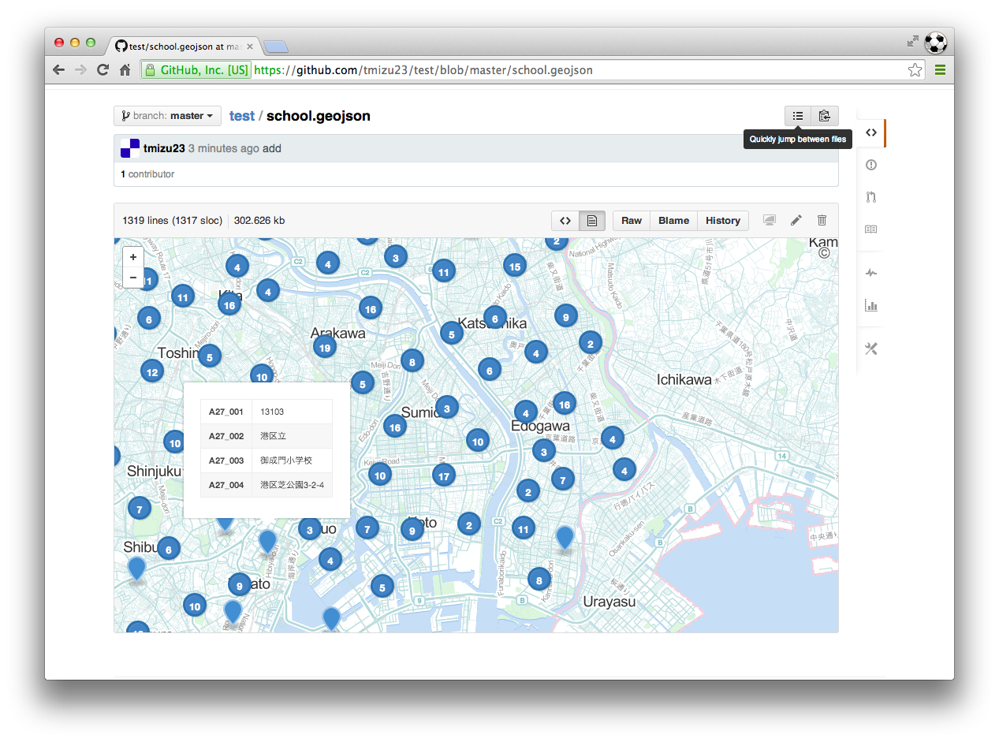

### データを準備する
WEBで地理情報を公開するためには、GIS用のデータからWEB公開用のデータを作成しておく必要があります。ここでは、3種類の方法について紹介します。

#### GeoJSONに変換する
ベクタデータは、GeoJSON形式に変換しておくとgithubで簡単にデータを公開、表示することができます。QGISを利用してShapefile形式からgeojson形式に変換してみましょう。

QGISを起動して、変換したいShapefileを読み込みます。読み込んだデータレイヤを右クリックして「名前をつけて保存」を選択します。

設定項目を次のように指定します。

- 形式　GeoJSON
- 名前をつけて保存　出力するファイル名を指定します。
- CRS　WGS84(EPSG:4326)
- エンコーディング　UTF-8

『OK』ボタンを押せばGeoJSON形式のファイルが作成されます。
このファイルをgithubにアップロードすれば、データの公開と地図表示ができます。githubへの公開方法は5-◯を参照してください。

#### WEB地図ファイルを作成する
ベクタデータを公開する方法として、leafletやOpenLayersのような地図表示ライブラリを利用して、WEB地図を作成する方法があります。ここではqgis2leafというQGISのプラグインを利用して、leafletによるWEB地図ファイル（HTML形式）を作成してみましょう。

QGISを起動して、メニューから【プラグイン】→【プラグインの管理とインストール】を選択します。[インストールされていない]タブから「gis2leaf」を選択し『プラグインをインストール』ボタンを押します。これでプラグインがインストールできました。

QGISに変換したいShapefileなどのベクタデータを読み込みます。データのスタイルを設定した後、メニューから【WEB】→【qgis2leaf】→【Exports a QGIS Project to a working leaflet webmap】を選択します。

qgis2leafのウインドウが開くので、各項目を設定します。『GetLayer』ボタンを押して、作成したいレイヤを選択します。「Frame width/height」で地図のサイズを指定し、「Basemap」から背景とする地図を選択します。「Output project folder」でWEB地図を出力するフォルダを指定します。

『OK』ボタンを押すと指定したフォルダの中にWEB地図のデータセットが「export_2014_08_31_10_35_02」のようなフォルダ名で作成されます。その中のindex.htmlをブラウザで開くとデータを確認することができます。

#### タイル地図を作成する

