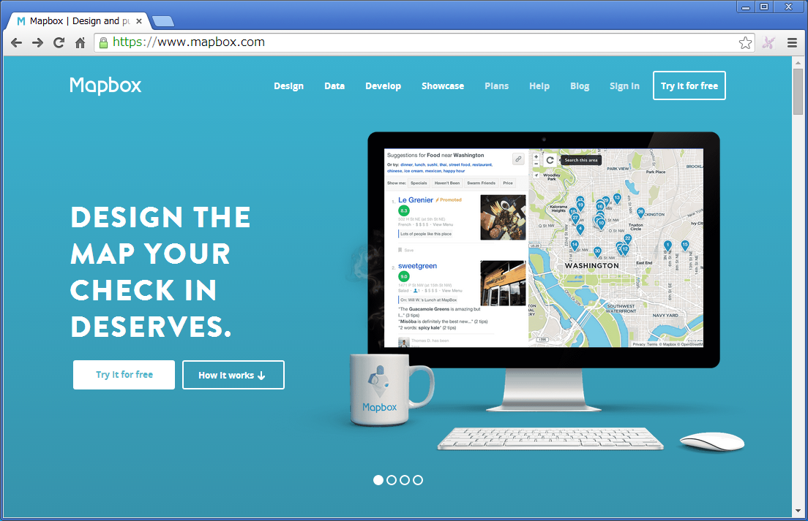
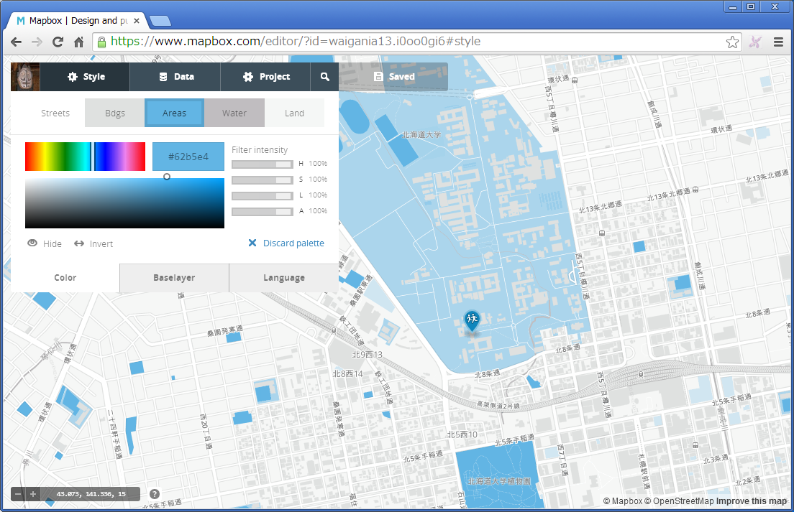

##Mapbox
Mapboxはブラウザ上の簡単な操作で、デザイン性の高い地図を公開できるサービスです。オープンストリートマップのデータを元に基本的な地図をデザインできます。地図の上にはポイント、ライン、ポリゴンを追加できますし、対応しているフォーマットであれば手持ちのデータをアップロードすることもできます。作成した地図は直にURLを指定してアクセスできる他に、自分のブログやホームページに埋め込むこともできます。  
使用に際しては、地図の閲覧回数や図形の数により有料プランになりますので注意は必要になります。基本的な地図を作成して公開する分には無料で使用することができます。とても簡単にデータを公開できるため注目されていますので、一度試してみることをおすすめします。

https://www.mapbox.com/

