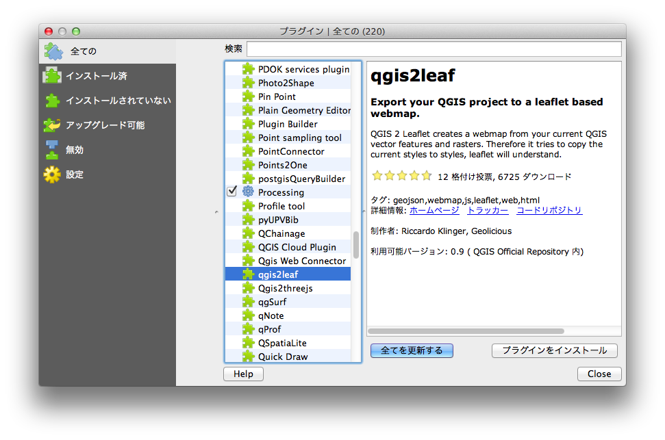
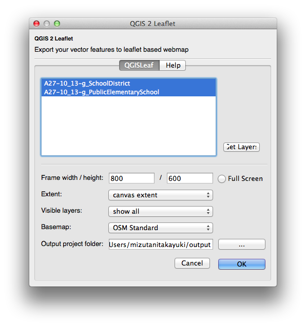
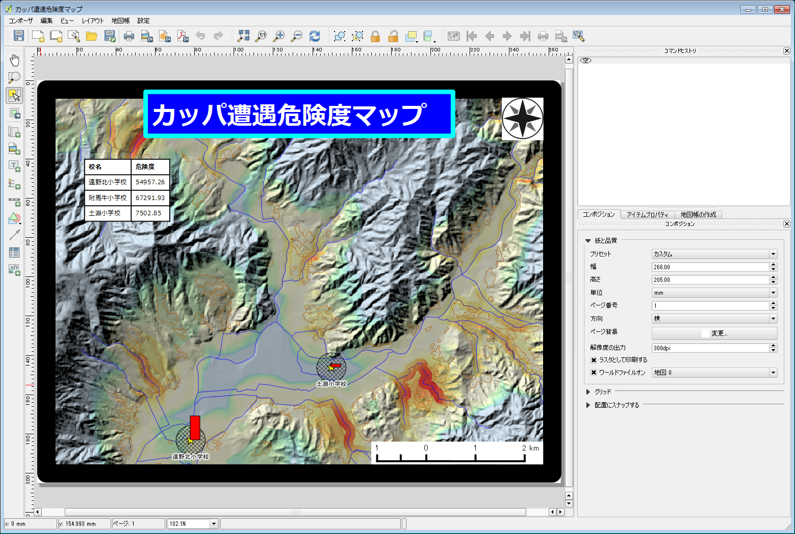
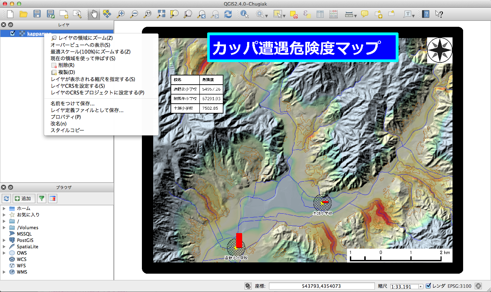

### データを準備する
WEBで地理情報を公開するためには、GIS用のデータからWEB公開用のデータを作成しておく必要があります。ここでは、3種類の方法について紹介します。

#### GeoJSONに変換する
ベクタデータは、GeoJSON形式に変換しておくとgithubで簡単にデータを公開、表示することができます。QGISを利用してShapefile形式からgeojson形式に変換してみましょう。

QGISを起動して、変換したいShapefileを読み込みます。読み込んだデータレイヤを右クリックして「名前をつけて保存」を選択します。

設定項目を次のように指定します。

- 形式　GeoJSON
- 名前をつけて保存　出力するファイル名を指定します。
- CRS　WGS84(EPSG:4326)
- エンコーディング　UTF-8

『OK』ボタンを押せばGeoJSON形式のファイルが作成されます。
このファイルをgithubにアップロードすれば、データの公開と地図表示ができます。githubへの公開方法は5-◯を参照してください。

#### WEB地図ファイルを作成する
ベクタデータを公開する方法として、leafletやOpenLayersのような地図表示ライブラリを利用して、WEB地図を作成する方法があります。ここではqgis2leafというQGISのプラグインを利用して、leafletによるWEB地図ファイル（HTML形式）を作成してみましょう。

QGISを起動して、メニューから【プラグイン】→【プラグインの管理とインストール】を選択します。[インストールされていない]タブから「gis2leaf」を選択し『プラグインをインストール』ボタンを押します。これでプラグインがインストールできました。

QGISに変換したいShapefileなどのベクタデータを読み込みます。データのスタイルを設定した後、メニューから【WEB】→【qgis2leaf】→【Exports a QGIS Project to a working leaflet webmap】を選択します。

qgis2leafのウインドウが開くので、各項目を設定します。『GetLayer』ボタンを押して、作成したいレイヤを選択します。「Frame width/height」で地図のサイズを指定し、「Basemap」から背景とする地図を選択します。「Output project folder」でWEB地図を出力するフォルダを指定します。

『OK』ボタンを押すと指定したフォルダの中にWEB地図のデータセットが「export_2014_08_31_10_35_02」のようなフォルダ名で作成されます。その中のindex.htmlをブラウザで開くとデータを確認することができます。

#### タイル地図を作成する
GeoTIFFなどのラスタデータを公開するためにタイル地図を作成してみましょう。タイル地図を作成する方法としては、MapTiler（http://www.maptiler.org/）やTilemill（https://www.mapbox.com/tilemill/）などの専用のソフトウェアを利用する方法や、gdal2tilesやmapnikなどのコマンドプログラムを利用する方法、QGISのプラグインを利用する方法などがあります。ここでは、QTilesというQGISのプラグインを利用してタイル地図を作成してみましょう。

まずは、タイル地図として公開するためのラスタデータを作成します。5-1章で説明した方法に従い出力したいデータをプリントコンポーザで整飾します。[コンポジション]タブの〈ワールドファイルオン〉にチェックを入れます。プリントコンポーザのメニューから『コンポーザ』→『画像としてエクスポート』を選択し、TIF画像のイメージとして書き出します。tif画像とともにtfwの拡張子のワールドファイルも出力されていることを確認してください。

次にQGISを起動して、出力したTIF画像を読み込みます。プリントコンポーザから出力されたTIF画像は、投影座標の値の定義はワールドファイルに記録されていますが、どのような投影法なのかといった空間参照の定義は記録されていません。そこでTIF画像の空間参照を定義しておきます。データレイヤを右クリックして「レイヤCRSを設定する」を選択し、TIF画像を作成した際の空間参照を指定します。

QTilesプラグインをインストールします。QGISのメニューから【プラグイン】→【プラグインの管理とインストール】を選択します。[設定]タブから〈実験的プラグインも表示する〉にチェックを入れ、『全リポジトリをリロードする』ボタンを押します。[インストールされていない]タブから「QTiles」を選択し『プラグインをインストール』ボタンを押します。これでプラグインがインストールできました。

QGISのメニューから【プラグイン】→【QTiles】→【Qtiles】を選択します。QTilesの設定ウインドウが開くので各項目を設定します。〈Directory〉をチェックしタイル地図の出力先を指定します。「Tileset name」にタイル地図の名前を入力します。この名前がタイル地図が出力されるフォルダ名とWEB地図のファイル名になります。「Extent」でタイル地図の作成範囲を選択します。ここでは〈Full extent〉としておきます。「Zoom」で出力するタイル地図のズームレベルを指定します。ここでは「Minimum zoom」に{10}を「Maximum zoom」に{16}を入力しておきます。これによってズームレベル10〜16のタイル地図を作成することになります。ズームレベルが大きくなるにつれて出力されるタイル数が爆発的に増大し、処理に時間がかかるので注意してください。「パラメータ」の項目で〈Write Leaflet-based viewer〉にチェックをいれてブラウザでタイル地図を表示させるためのWEB地図ファイルも出力するように設定します。

『OK』ボタンを押すと指定したフォルダの中に「Tileset name」の名前でタイル地図のデータセットが作成されます。その中のhtmlファイルをブラウザで開くとデータを確認することができます。

今回はあらかじめラスタ画像を準備してタイル地図を作成しましたが、QTilesプラグインは、ベクタデータを直接タイル地図として出力することもできます。ただ、現時点(2014年)でQTilesプラグインは実験的なプラグインとして公開されているので、残念ながら今のところあまり綺麗な出力結果は得られません。タイル地図に興味のある方は、MapTilerやgdal2tilesなど他の方法も試してみると良いでしょう。

