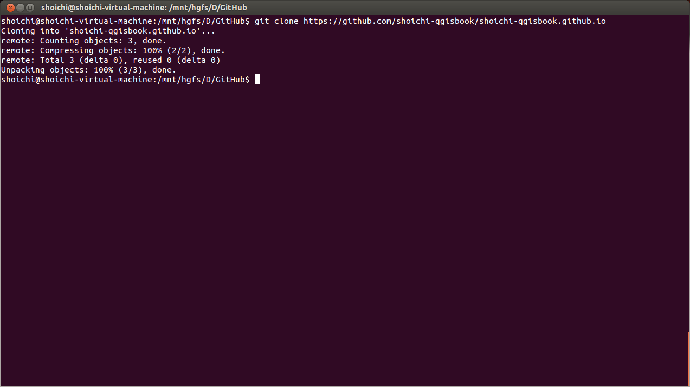
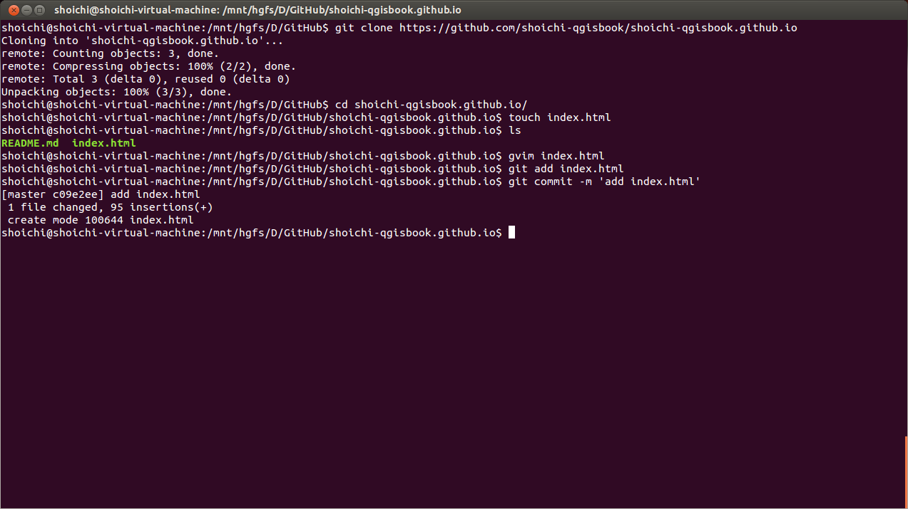
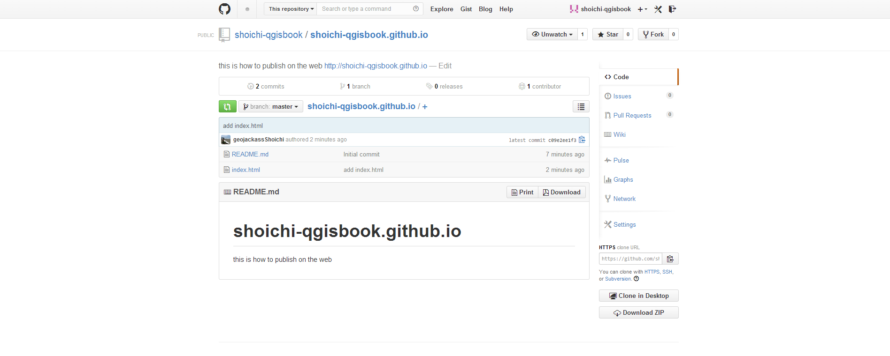

##GitHub.Pagesを使用する

本コラムの内容はGitおよびLinuxに関する基本的なスキルのある人を対象とします。
本章ではGitHubでは標準機能としてGeoJSONが地図上に描画された状態で表示されることと、CGIやデータベースが使えないこと触れました。ですが、実はjavascript等を動作させたページは表示させることが可能です。
せっかくの公開ページですので、データを表示する以外にも様々な追加機能を搭載したweb地図を公開したくなることでしょう。
その際の使用方法に関して触れたいと思います。

Gitのインストールが必要になるので、行ってください。

LinuxのディストリビューションがDebian系の人
```
sudo apt-get install git
```

LinuxのディストリビューションがRedHat系の人  
\# [root]になっている状態で

```
yum apt-get install git
```
#### リポジトリのクローンを行う

Gitコマンドを入力します。
```
git clone https://github.com/shoichi-qgisbook/shoichi-qgisbook.github.io
```
これでリポジトリがcloneされましたので、cloneしたリポジトリへ移動します。



リポジトリへ移動したら、空のindex.htmlファイルを作成します。次に、ファイルが作成されたことを確認します。

```
cd shoichi-qgisbook.github.io/
touch index.html
ls
```


#### index.htmlの作成を行う

空のindex.htmlの中身を作成します


*JavaScriptを動作させたページ例*

```
<html>
	<meta http-equiv="Content-Type" content="text/html; charset=utf-8" />
	<meta name="author" content="Shoichi Otomo">
	<head>
	<title>qgis_book</title>
	<style type="text/css">
		#canvas {
				width: 80%;
				height: 80%;
				margin: 0;
		}
		#canvas .olControlAttribution {
				font-size: 13px;
				bottom: 5px;
		}
		</style>
		<script src="http://www.openlayers.org/api/OpenLayers.js"></script>
		<script src="http://maps.google.com/maps/api/js?v=3&amp;sensor=false"></script>
		<script type="text/javascript">

			function init() {
			var map;
			//optionsの指定はマウスイベントの取得時に必要になる
			var options = {
				controls:[
						new OpenLayers.Control.Navigation(),
						new OpenLayers.Control.Attribution()
						]
						};

			map = new OpenLayers.Map("canvas", options);
			//map = new OpenLayers.Map("canvas", {allOverlays: true});
			map.addControl(new OpenLayers.Control.LayerSwitcher());

			var mapink = new OpenLayers.Layer.OSM();
			map.addLayer(mapink);

			var gsat = new OpenLayers.Layer.Google(
			"Google Satellite",
			{type: google.maps.MapTypeId.SATELLITE, numZoomLevel: 10}
			)
			map.addLayer(gsat);

			var ghyb = new OpenLayers.Layer.Google(
			"Google Hybrid",
			{type: google.maps.MapTypeId.HYBRID, numZoomLevels: 10, visibility: false}
			)
			map.addLayer(ghyb);

			//地図の中心に技術評論社を設定
			var lonLat = new OpenLayers.LonLat(139.735646, 35.693697)
			.transform(
			new OpenLayers.Projection("EPSG:4326"),
			new OpenLayers.Projection("EPSG:900913")
			);
			map.setCenter(lonLat, 10);

			//技術評論社にmarkerを描画する
			var markers = new OpenLayers.Layer.Markers("Markers");
			map.addLayer(markers);
			var marker = new OpenLayers.Marker(
			new OpenLayers.LonLat(139.735646, 35.693697)
			.transform(
			new OpenLayers.Projection("EPSG:4326"),
			new OpenLayers.Projection("EPSG:900913")
			)
			);
			markers.addMarker(marker);

				map.events.register("mousemove", map, onMouseMove);
				map.events.register("zoomend", map, onZoomChanged);
			}
			function onMouseMove() {
			var lonLat = this.getCenter().transform(
			new OpenLayers.Projection("EPSG:900913"),
			new OpenLayers.Projection("EPSG:4326")
			);
			document.getElementById("lat").firstChild.nodeValue = lonLat.lat;
			document.getElementById("lon").firstChild.nodeValue = lonLat.lon;
			}
			function onZoomChanged() {
			document.getElementById("zoom").firstChild.nodeValue = this.getZoom();
			}

			</script>
	</head>
	<body onload="init();">
		<div id="canvas">mapArea</div><br />
			<div style="border:none; width:500px; padding:5px;">
			Latitude：<div id="lat" style="display:inline">waiting</div><br />
			Longitude：<div id="lon" style="display:inline">waiting</div><br />
			ZoomLevel：<div id="zoom" style="display:inline">waiting</div>
			</div>
	</body>
</html>
```


#### 公開するデータのアップロードを行う

- Githubにpushします

```
git add index.html
git commit -m 'add index.html'
git push
```


GitHubのリポジトリを確認して、pushされていることを確認してください。


確認できたら、リポジトリネームの下にあるEditをクリックしてください。

####データを公開する 

WebSiteの欄に
```
http://username.github.io
```
と記入しsaveします。



[github.io_pub]のように表示されたのが、確認できます。


