## 2 Webで公開する

###1. Webで公開するためのサーバーを用意する

既に公開用サーバーを使用している方は、そちらを使用していただいて構いません。今回は、無料のwebサーバーとして使用できるGithubPagesを使用して公開する方法を紹介したいと思います。

#### GitHubアカウントの作成を行う

githubの公式ページトップへ行き、アカウントを作成します。

- https://github.com/

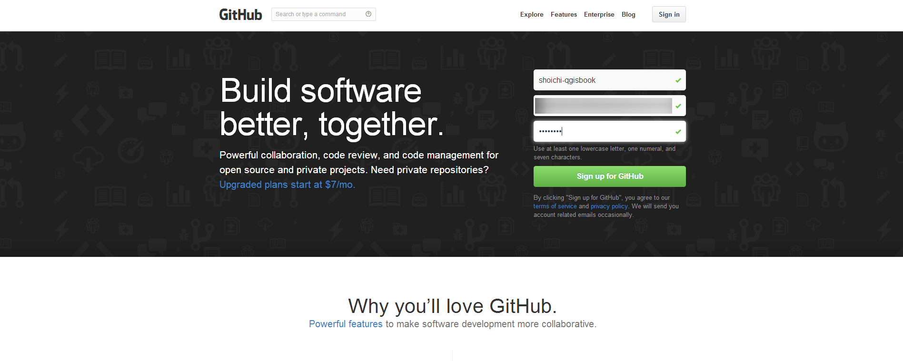

ここで右側の空欄に
- username
- emailaddress
- password

以上の3項目を、それぞれ記入して下さい。また、usernameとpasswordは必ず忘れないようにメモを取り控えておいてください。

Sign up for GitHubをクリックすると[github_account2]の画面になります。

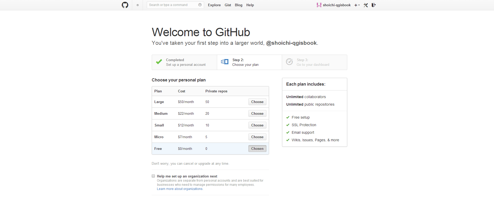

今回作成するアカウントはFreeのもので構いません。Finish sign upをクリックしてください。
これで、アカウントが作成されます。

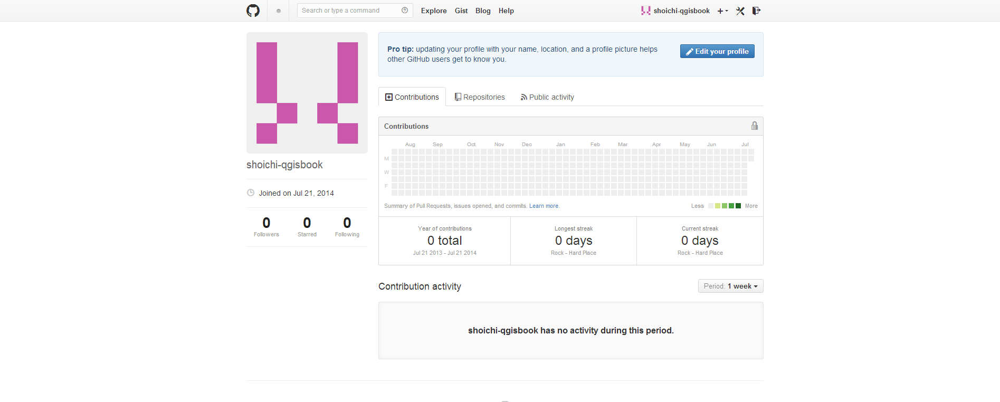

#### GitHubにリポジトリの作成を行う

画面右上にある + ボタンをクリックして、New　Repositoryを作成してください。
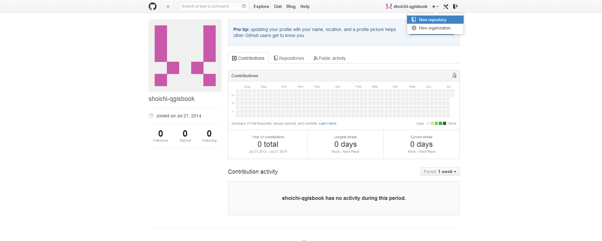

- Repository nameには`アカウント名.github.io`と入力してください。
- Descriptionは特に気しなくてもいいですが、今回はwebで公開するページである旨記載しました。
- PublicRepositoryで構いませんし、GithubはFreeアカウントの場合、PublicRepositoryしか作成できません。
- Initialize this repository with a READMEのチェック欄にチェックを入れてください。

以上の設定を終えたら、Create repositoryをクリックします。

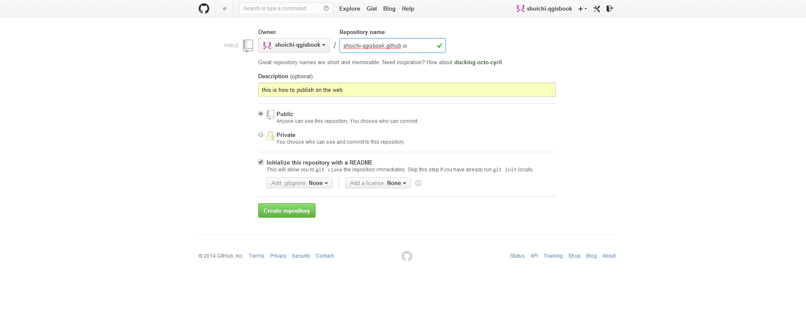

[github_account6]の図のようになります。


#### githubのセットアップを行う

下記アドレスより、GitHub for winodwsのソフトウェアをダウンロードします。

ちなみにGitとGitHubは同じものではありません。
Gitとはバージョン管理ツールのことで、その他のバージョン管理ツールとしてはMercurial等があります。
GitHubとは、ソースコードをWebホスティングサービスのことで、その他のWebホスティングサービスにはBitBucketやGoogle Project Hosting等があります。

今回は公開を想定して行いますので、Githubを使用しています。

```
https://windows.github.com/
```

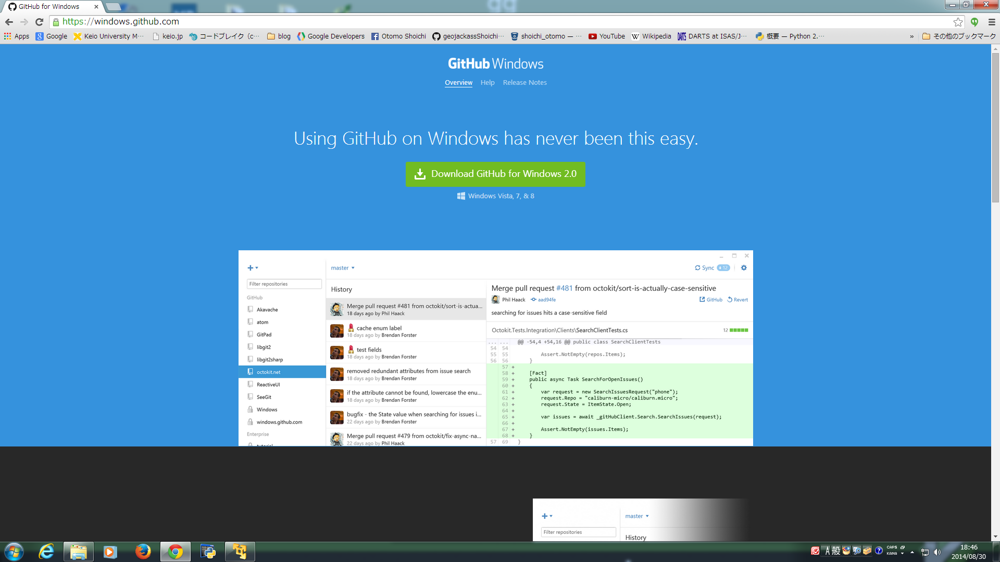

Downlaod Github for Winodws 2.0
(2014年08月30日現在の最新版)
をダウンロードします。

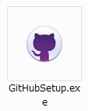

ダウンロードディレクトリ内にある、GitHubSetup.exeアイコンを起動します。

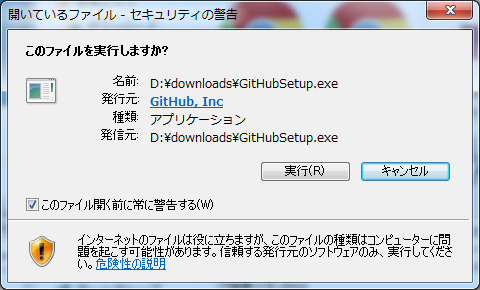

『実行』をクリックしてください。

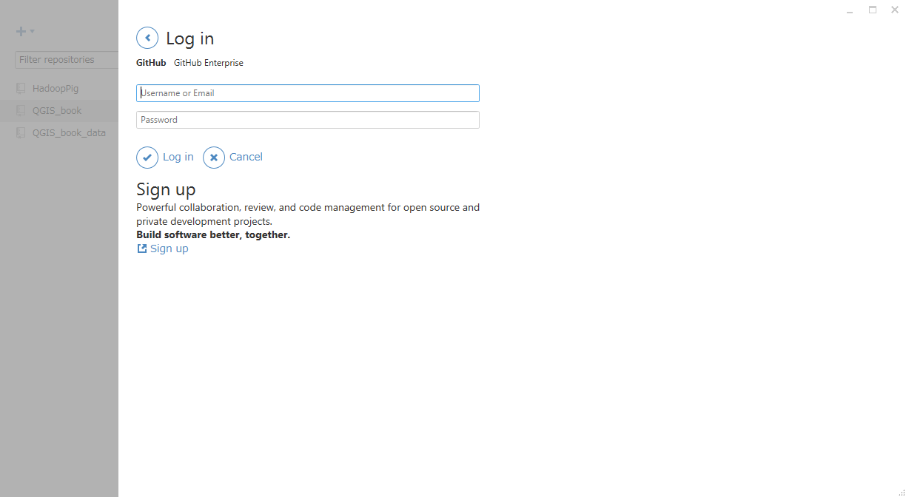

GitHubアカウントへのログイン画面になります。
- GitHubのユーザーアカウント　あるいは　登録したメールアドレス
- Githubアカウントに登録したパスワード

を入力して下さい。

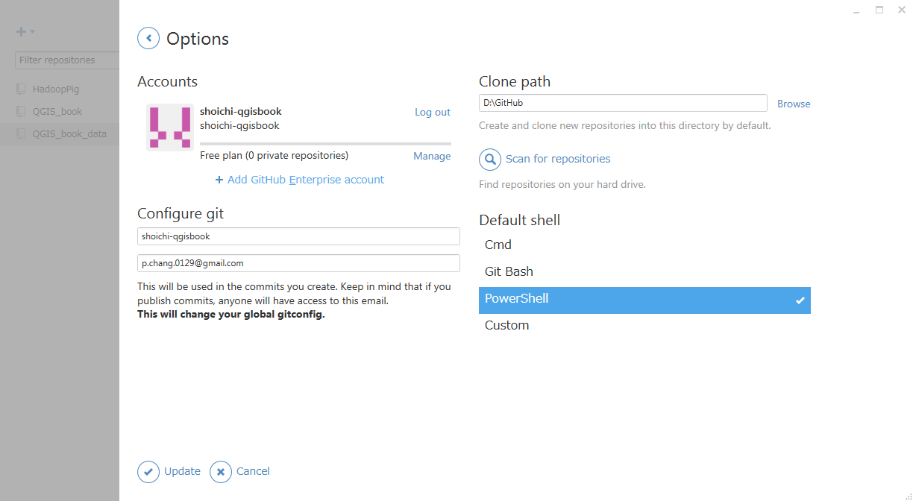

Clone Pathを設定します。デフォルトのままの場合は、Cドライブ内にディレクトリを作成してしまいます。ソースコード程度ならば問題ありませんが、データをアップロードするとシステムの容量が無くなっていくため、動作が不安定になります。そこで今回はDドライブにGitHubというディレクトリを作成し、そのディレクトリを使用します。

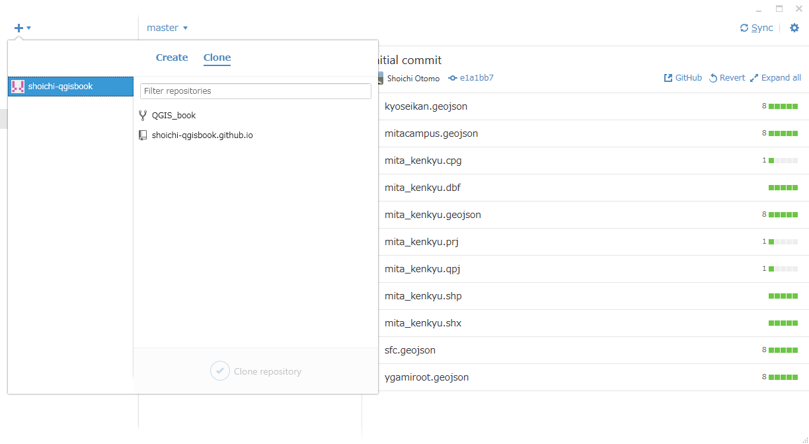

右上の『+』をクリックしてください。

GitHubアカウント上で管理している、プロジェクトのディレクトリの一覧が表示されます。
shoichi-qgisbook.github.ioを『Cloneします』

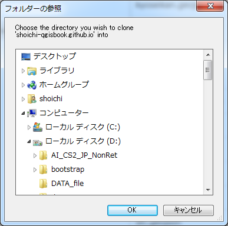

フォルダーの参照画面が開きます。これはClone先のディレクトリを指定し『OK』を押します。

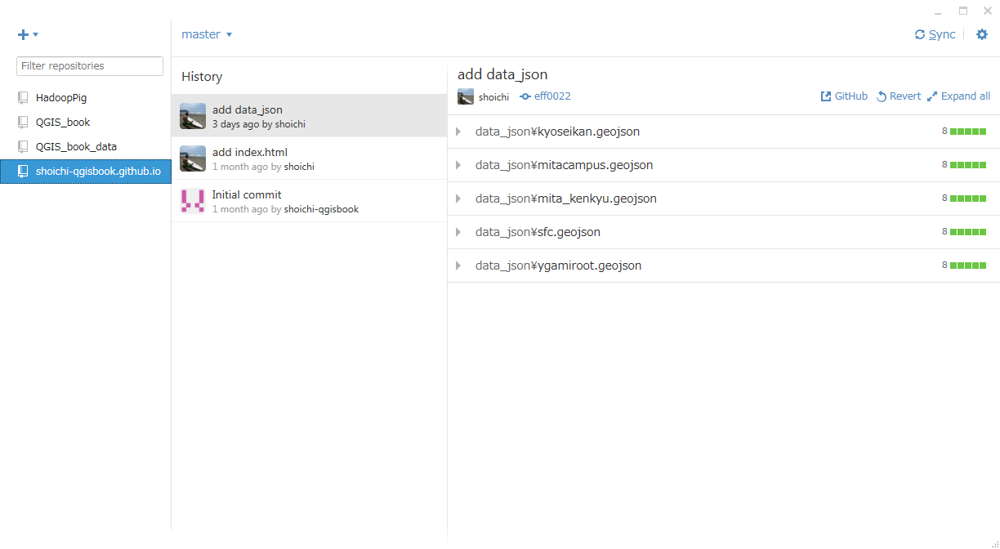

指定したディレクトリにCloneされたディレクトリが作成されます。

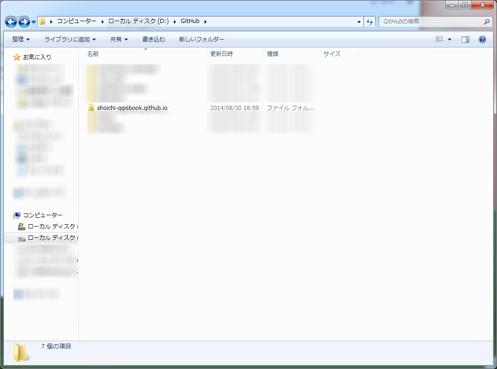

参考に2-2(ここに参照ページ差込)で使用したGeoJSONデータを使用します。
GeoJSONデータをディレクトリにペーストしてください。

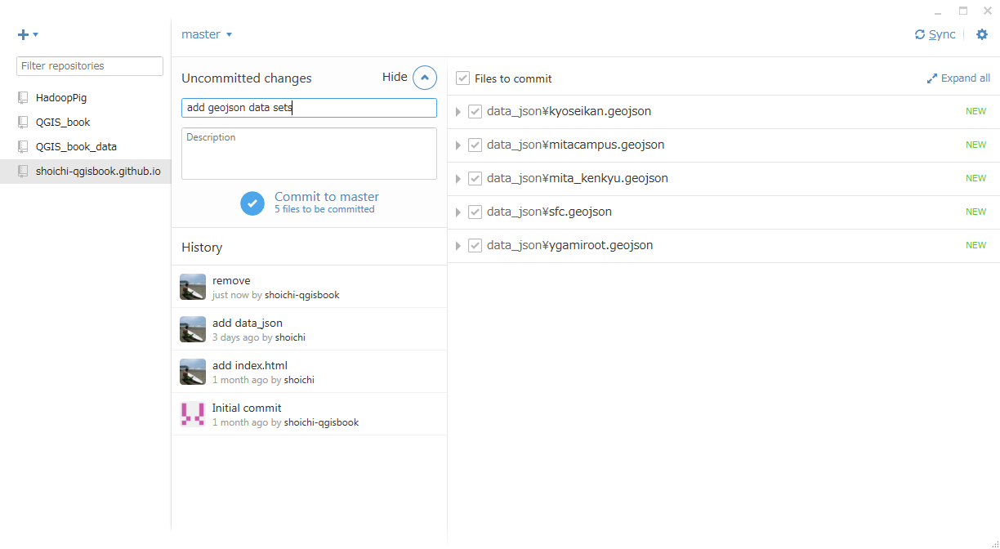

###2. Webで地図を公開する

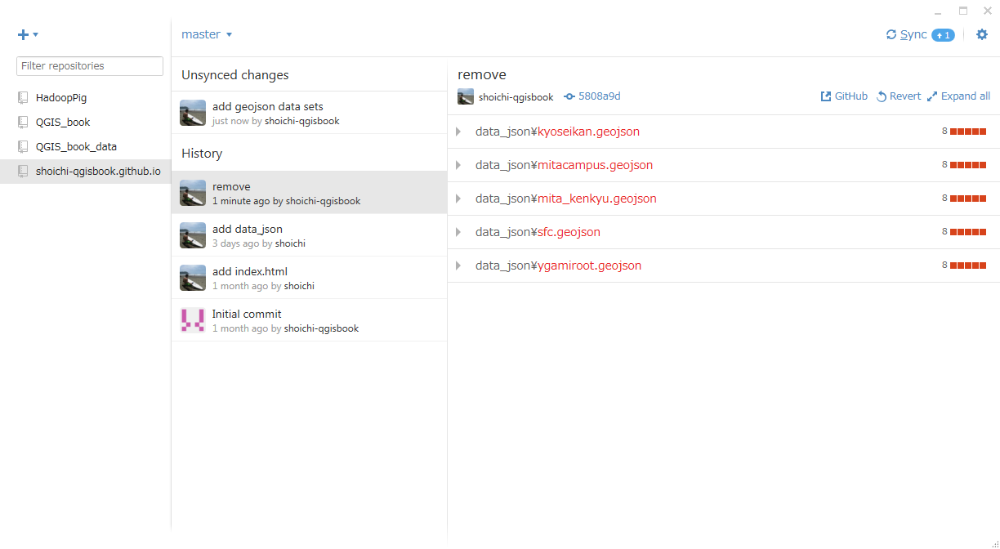

画面右上の『Sync』をクリックしてください。

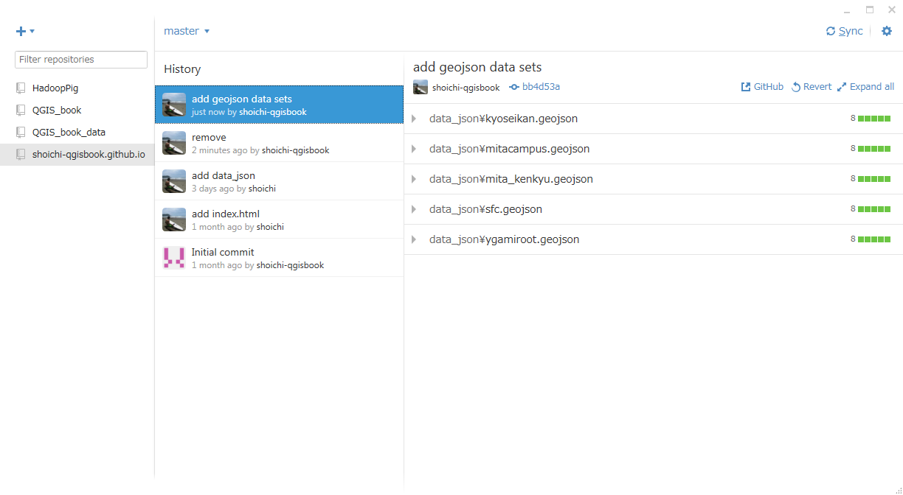

GitHub上に変更・追加したデータがpushされます。

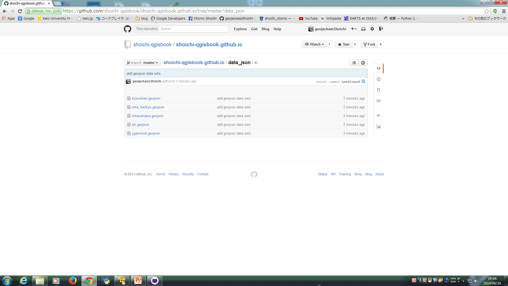

GitHubアカウントを確認してみましょう。

5-2では公開用サーバーを立てる際に、GitHub.Pagesを使用しました。
サーバーの細かな設定やセキュリティーに触れることは、この本の趣旨から外れてしまうのため公開用サーバーを構築することはしませんでした。ですが、CGIやデータベースを使用しない場合は、こういったサービスでも編集したデータを地図上に載せて公開する事することは可能です。

また通常のGitHubアカウントでも、ソースコードやプログラム以外にデータをアップロードする事があります。その場合GeoJSON形式のデータは地図上に描画された状態で表示されます。
それではなぜ、わざわざGitHub.Pages用のアカウントを作成したのかについては、5-3-column3に記載されています。

https://github.com/shoichi-qgisbook/shoichi-qgisbook.github.io

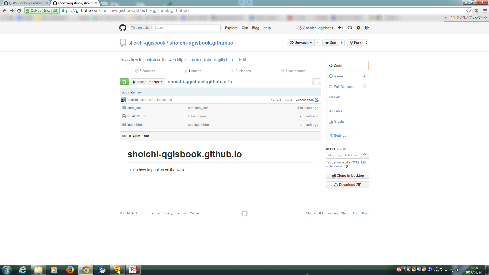

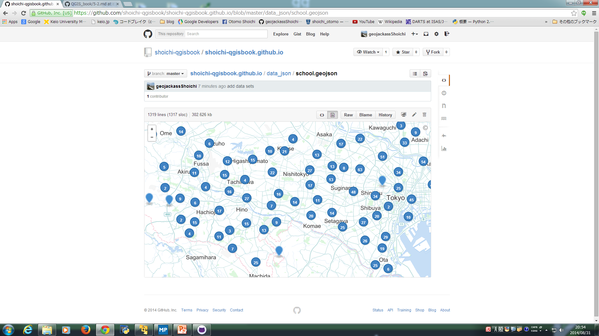

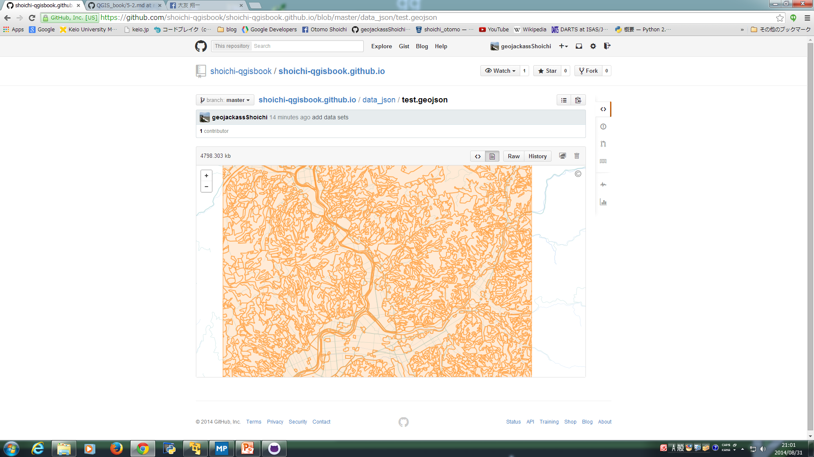


###3. 公開する際の留意点

また、公開する際の留意点は主に以下のようのものが挙げられます。

- 引用元となるデータのライセンスに抵触しないこと
- 引用元のライセンスポリシーに従っていること
- 引用元の利用規約等に従っていること

例えば、引用元データがCC-BY-NDで定義されていれば、そのデータを改変して公開することや、引用元データがCC-BYで定義されているデータであれば、元データの著作者を明記せずに公開すること等はライセンスに抵触する行為となります。
また、クリエィティブコモンズ以外のライセンスで定義されている場合や、ライセンスで包括的な定義をしてはいないが、利用規約等を独自に設けている場合があります。データの公開に際しては、こういった点に十分な配慮をして下さい。