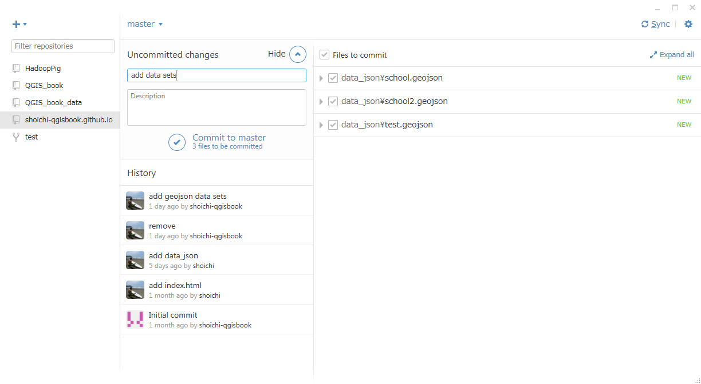
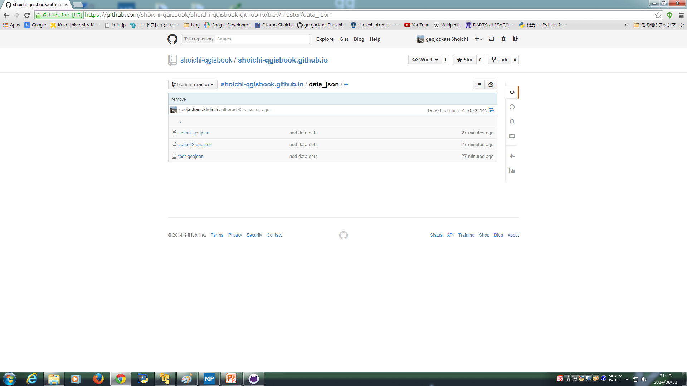
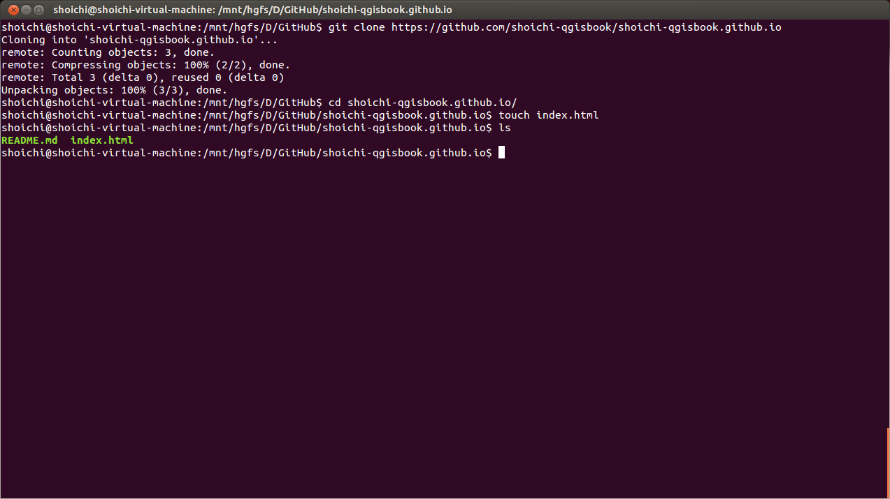
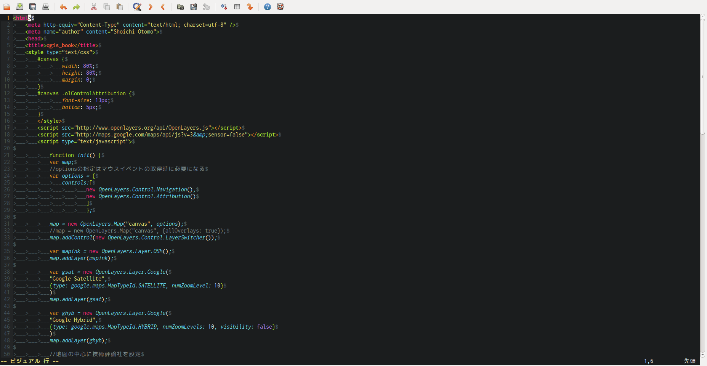
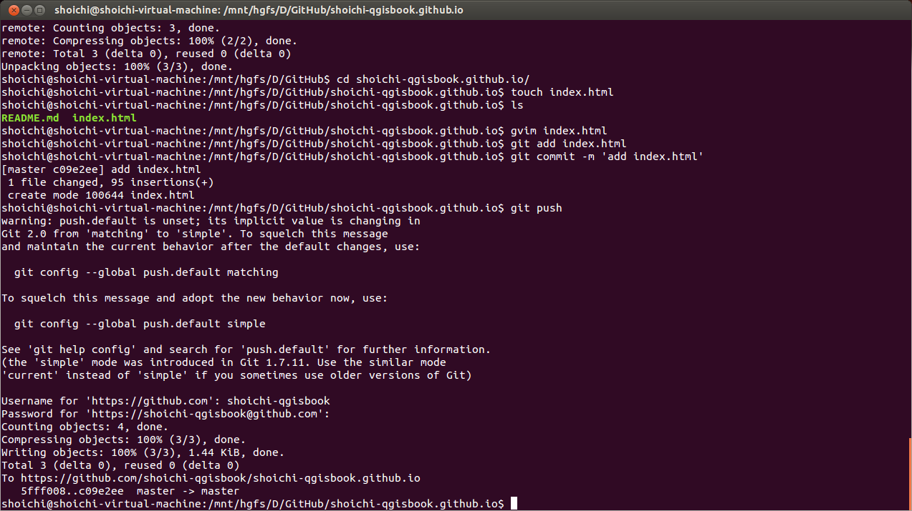
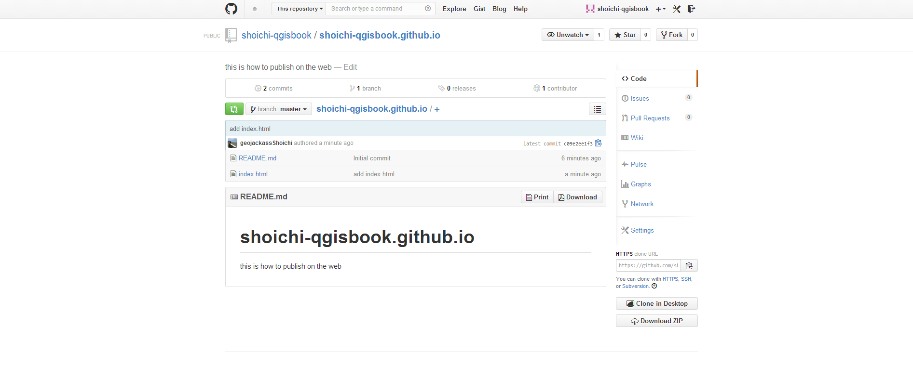
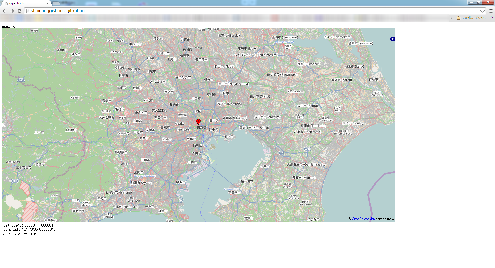

## 2 Webで公開する

###1. Webで公開するためのサーバーを用意する

既に公開用サーバーを使用している方は、そちらを使用していただいて構いません。今回は、無料のwebサーバーとして使用できるGithubPagesを使用して公開する方法を紹介したいと思います。

#### GitHubアカウントの作成を行う

githubの公式ページトップへ行き、アカウントを作成します。

- https://github.com/


ここで右側の空欄に
- username
- emailaddress
- password

以上の3項目を、それぞれ記入して下さい。また、usernameとpasswordは必ず忘れないようにメモを取り控えておいてください。

Sign up for GitHubをクリックすると[github_account2]の画面になります。


今回作成するアカウントはFreeのもので構いません。Finish sign upをクリックしてください。
これで、アカウントが作成されます。


#### GitHubにリポジトリの作成を行う

画面右上にある + ボタンをクリックして、New　Repositoryを作成してください。


- Repository nameには`アカウント名.github.io`と入力してください。
- Descriptionは特に気しなくてもいいですが、今回はwebで公開するページである旨記載しました。
- PublicRepositoryで構いませんし、GithubはFreeアカウントの場合、PublicRepositoryしか作成できません。
- Initialize this repository with a READMEのチェック欄にチェックを入れてください。

以上の設定を終えたら、Create repositoryをクリックします。


[github_account6]の図のようになります。


#### githubのセットアップを行う

下記アドレスより、GitHub for winodwsのソフトウェアをダウンロードします。

ちなみにGitとGitHubは同じものではありません。
Gitとはバージョン管理ツールのことで、その他のバージョン管理ツールとしてはMercurial等があります。
GitHubとは、ソースコードをWebホスティングサービスのことで、その他のWebホスティングサービスにはBitBucketやGoogle Project Hosting等があります。

今回は公開を想定して行いますので、Githubを使用しています。

```
https://windows.github.com/
```


Downlaod Github for Winodws 2.0
(2014年08月30日現在の最新版)
をダウンロードします。


ダウンロードディレクトリ内にある、GitHubSetup.exeアイコンを起動します。


『実行』をクリックしてください。


GitHubアカウントへのログイン画面になります。
- GitHubのユーザーアカウント　あるいは　登録したメールアドレス
- Githubアカウントに登録したパスワード

を入力して下さい。


Clone Pathを設定します。デフォルトのままの場合は、Cドライブ内にディレクトリを作成してしまいます。ソースコード程度ならば問題ありませんが、データをアップロードするとシステムの容量が無くなっていくため、動作が不安定になります。そこで今回はDドライブにGitHubというディレクトリを作成し、そのディレクトリを使用します。


右上の『+』をクリックしてください。

GitHubアカウント上で管理している、プロジェクトのディレクトリの一覧が表示されます。
shoichi-qgisbook.github.ioを『Cloneします』


フォルダーの参照画面が開きます。これはClone先のディレクトリを指定し『OK』を押します。


指定したディレクトリにCloneされたディレクトリが作成されます。


参考に2-2(ここに参照ページ差込)で使用したGeoJSONデータを使用します。
GeoJSONデータをディレクトリにペーストしてください。




画面右上の『Sync』をクリックしてください。


GitHub上に変更・追加したデータがpushされます。



GitHubアカウントを確認してみましょう。


#### リポジトリのクローンを行う

Gitコマンドを入力します。
```
git clone https://github.com/shoichi-qgisbook/shoichi-qgisbook.github.io
```
これでリポジトリがcloneされましたので、cloneしたリポジトリへ移動します。


リポジトリへ移動したら、空のindex.htmlファイルを作成します。次に、ファイルが作成されたことを確認します。

```
cd shoichi-qgisbook.github.io/
touch index.html
ls
```



空のindex.htmlの中身を作成します


#### index.htmlの作成を行う

```
<html>
	<meta http-equiv="Content-Type" content="text/html; charset=utf-8" />
	<meta name="author" content="Shoichi Otomo">
	<head>
	<title>qgis_book</title>
	<style type="text/css">
		#canvas {
				width: 80%;
				height: 80%;
				margin: 0;
		}
		#canvas .olControlAttribution {
				font-size: 13px;
				bottom: 5px;
		}
		</style>
		<script src="http://www.openlayers.org/api/OpenLayers.js"></script>
		<script src="http://maps.google.com/maps/api/js?v=3&amp;sensor=false"></script>
		<script type="text/javascript">

			function init() {
			var map;
			//optionsの指定はマウスイベントの取得時に必要になる
			var options = {
				controls:[
						new OpenLayers.Control.Navigation(),
						new OpenLayers.Control.Attribution()
						]
						};

			map = new OpenLayers.Map("canvas", options);
			//map = new OpenLayers.Map("canvas", {allOverlays: true});
			map.addControl(new OpenLayers.Control.LayerSwitcher());

			var mapink = new OpenLayers.Layer.OSM();
			map.addLayer(mapink);

			var gsat = new OpenLayers.Layer.Google(
			"Google Satellite",
			{type: google.maps.MapTypeId.SATELLITE, numZoomLevel: 10}
			)
			map.addLayer(gsat);

			var ghyb = new OpenLayers.Layer.Google(
			"Google Hybrid",
			{type: google.maps.MapTypeId.HYBRID, numZoomLevels: 10, visibility: false}
			)
			map.addLayer(ghyb);

			//地図の中心に技術評論社を設定
			var lonLat = new OpenLayers.LonLat(139.735646, 35.693697)
			.transform(
			new OpenLayers.Projection("EPSG:4326"),
			new OpenLayers.Projection("EPSG:900913")
			);
			map.setCenter(lonLat, 10);

			//技術評論社にmarkerを描画する
			var markers = new OpenLayers.Layer.Markers("Markers");
			map.addLayer(markers);
			var marker = new OpenLayers.Marker(
			new OpenLayers.LonLat(139.735646, 35.693697)
			.transform(
			new OpenLayers.Projection("EPSG:4326"),
			new OpenLayers.Projection("EPSG:900913")
			)
			);
			markers.addMarker(marker);

				map.events.register("mousemove", map, onMouseMove);
				map.events.register("zoomend", map, onZoomChanged);
			}
			function onMouseMove() {
			var lonLat = this.getCenter().transform(
			new OpenLayers.Projection("EPSG:900913"),
			new OpenLayers.Projection("EPSG:4326")
			);
			document.getElementById("lat").firstChild.nodeValue = lonLat.lat;
			document.getElementById("lon").firstChild.nodeValue = lonLat.lon;
			}
			function onZoomChanged() {
			document.getElementById("zoom").firstChild.nodeValue = this.getZoom();
			}

			</script>
	</head>
	<body onload="init();">
		<div id="canvas">mapArea</div><br />
			<div style="border:none; width:500px; padding:5px;">
			Latitude：<div id="lat" style="display:inline">waiting</div><br />
			Longitude：<div id="lon" style="display:inline">waiting</div><br />
			ZoomLevel：<div id="zoom" style="display:inline">waiting</div>
			</div>
	</body>
</html>
```


###2. 公開するデータのアップロードを行う

#### githubにpushする

- Githubにpushします

```
git add index.html
git commit -m 'add index.html'
git push
```


GitHubのリポジトリを確認して、pushされていることを確認してください。



確認できたら、リポジトリネームの下にあるEditをクリックしてください。


###3.データを公開する 

####github.pages用にEditする

WebSiteの欄に
```
http://username.github.io
```
と記入しsaveします。


[github.io_pub]のように表示されたのが、確認できます。



###4. 公開する際の留意点

また、公開する際の留意点は主に以下のようのものが挙げられます。

- 引用元となるデータのライセンスに抵触しないこと
- 引用元のライセンスポリシーに従っていること
- 引用元の利用規約等に従っていること

例えば、引用元データがCC-BY-NDで定義されていれば、そのデータを改変して公開することや、引用元データがCC-BYで定義されているデータであれば、元データの著作者を明記せずに公開すること等はライセンスに抵触する行為となります。
また、クリエィティブコモンズ以外のライセンスで定義されている場合や、ライセンスで包括的な定義をしてはいないが、利用規約等を独自に設けている場合があります。データの公開に際しては、こういった点に十分な配慮をして下さい。