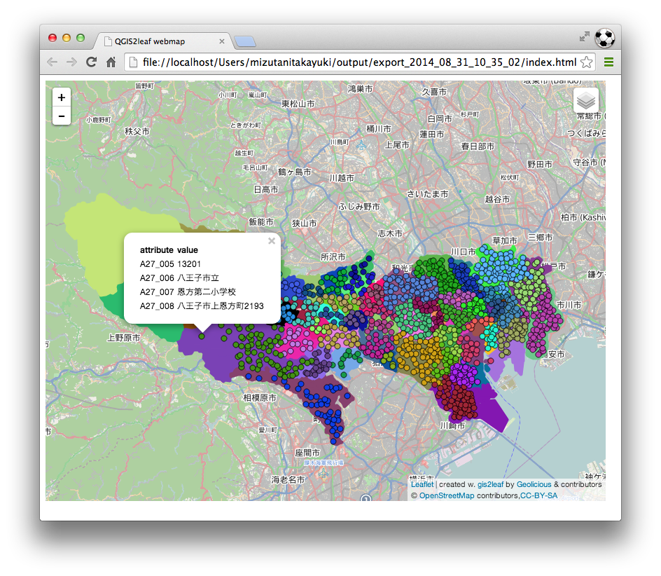
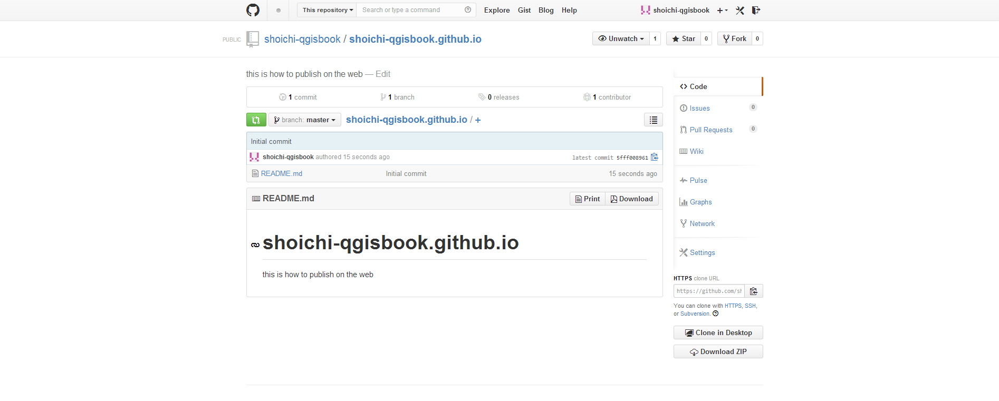

## Webで公開する

### データを準備する
WEBで地理情報を公開するためには、GIS用のデータからWEB公開用のデータを作成しておく必要があります。ここでは、3種類の方法について紹介します。

#### GeoJSONに変換する
ベクタデータは、GeoJSON形式に変換しておくとGitHubで簡単にデータを公開、表示することができます。QGISを利用してShapefile形式からgeojson形式に変換してみましょう。GitHubに関しては、本章の後半部分で触れますので、気にせずに読み進めてください。

QGISを起動して、変換したいShapefileを読み込みます。読み込んだデータレイヤを右クリックして「名前をつけて保存」を選択します。


設定項目を次のように指定します。

- 形式　GeoJSON
- 名前をつけて保存　出力するファイル名を指定します。
- CRS　WGS84(EPSG:4326)
- エンコーディング　UTF-8


#### WEB地図ファイルを作成する
ベクタデータを公開する方法として、leafletやOpenLayersのような地図表示ライブラリを利用して、WEB地図を作成する方法があります。ここではqgis2leafというQGISのプラグインを利用して、leafletによるWEB地図ファイル（HTML形式）を作成してみましょう。

QGISを起動して、メニューから【プラグイン】→【プラグインの管理とインストール】を選択します。[インストールされていない]タブから「gis2leaf」を選択し『プラグインをインストール』ボタンを押します。これでプラグインがインストールできました。


QGISに変換したいShapefileなどのベクタデータを読み込みます。データのスタイルを設定した後、メニューから【WEB】→【qgis2leaf】→【Exports a QGIS Project to a working leaflet webmap】を選択します。


qgis2leafのウインドウが開くので、各項目を設定します。『GetLayer』ボタンを押して、作成したいレイヤを選択します。「Frame width/height」で地図のサイズを指定し、「Basemap」から背景とする地図を選択します。「Output project folder」でWEB地図を出力するフォルダを指定します。


『OK』ボタンを押すと指定したフォルダの中にWEB地図のデータセットが「export_2014_08_31_10_35_02」のようなフォルダ名で作成されます。その中のindex.htmlをブラウザで開くとデータを確認することができます。



#### タイル地図を作成する
GeoTIFFなどのラスタデータを公開するためにタイル地図を作成してみましょう。タイル地図を作成する方法としては、MapTiler（http://www.maptiler.org/）やTilemill（https://www.mapbox.com/tilemill/）などの専用のソフトウェアを利用する方法や、gdal2tilesやmapnikなどのコマンドプログラムを利用する方法、QGISのプラグインを利用する方法などがあります。ここでは、QTilesというQGISのプラグインを利用してタイル地図を作成してみましょう。

まずは、タイル地図として公開するためのラスタデータを作成します。5-1章で説明した方法に従い出力したいデータをプリントコンポーザで整飾します。[コンポジション]タブの〈ワールドファイルオン〉にチェックを入れます。プリントコンポーザのメニューから『コンポーザ』→『画像としてエクスポート』を選択し、TIF画像のイメージとして書き出します。tif画像とともにtfwの拡張子のワールドファイルも出力されていることを確認してください。


次にQGISを起動して、出力したTIF画像を読み込みます。プリントコンポーザから出力されたTIF画像は、投影座標の値の定義はワールドファイルに記録されていますが、どのような投影法なのかといった空間参照の定義は記録されていません。そこでTIF画像の空間参照を定義しておきます。データレイヤを右クリックして「レイヤCRSを設定する」を選択し、TIF画像を作成した際の空間参照を指定します。


QTilesプラグインをインストールします。QGISのメニューから【プラグイン】→【プラグインの管理とインストール】を選択します。[設定]タブから〈実験的プラグインも表示する〉にチェックを入れ、『全リポジトリをリロードする』ボタンを押します。[インストールされていない]タブから「QTiles」を選択し『プラグインをインストール』ボタンを押します。これでプラグインがインストールできました。

QGISのメニューから【プラグイン】→【QTiles】→【Qtiles】を選択します。QTilesの設定ウインドウが開くので各項目を設定します。〈Directory〉をチェックしタイル地図の出力先を指定します。「Tileset name」にタイル地図の名前を入力します。この名前がタイル地図が出力されるフォルダ名とWEB地図のファイル名になります。「Extent」でタイル地図の作成範囲を選択します。ここでは〈Full extent〉としておきます。「Zoom」で出力するタイル地図のズームレベルを指定します。ここでは「Minimum zoom」に{10}を「Maximum zoom」に{16}を入力しておきます。これによってズームレベル10〜16のタイル地図を作成することになります。ズームレベルが大きくなるにつれて出力されるタイル数が爆発的に増大し、処理に時間がかかるので注意してください。「パラメータ」の項目で〈Write Leaflet-based viewer〉にチェックをいれてブラウザでタイル地図を表示させるためのWEB地図ファイルも出力するように設定します。


『OK』ボタンを押すと指定したフォルダの中に「Tileset name」の名前でタイル地図のデータセットが作成されます。その中のhtmlファイルをブラウザで開くとデータを確認することができます。


今回はあらかじめラスタ画像を準備してタイル地図を作成しましたが、QTilesプラグインは、ベクタデータを直接タイル地図として出力することもできます。ただ、現時点(2014年)でQTilesプラグインは実験的なプラグインとして公開されているので、残念ながら今のところあまり綺麗な出力結果は得られません。タイル地図に興味のある方は、MapTilerやgdal2tilesなど他の方法も試してみると良いでしょう。

### サーバーを用意する

公開に際して、基本的にはwebサーバーを用意する必要があります。既に公開用サーバーを使用している方は、そちらを使用していただいて構いません。ただし、webサーバーの準備に関してはこの本の主旨を逸脱しますので、今回はwebサーバーの代用として、GitHubを使用して公開する方法を紹介したいと思います。

また、GitHubを使用する場合にはバージョン管理ツールとして、Gitを使用することになります。よく混同されますが、GitとGitHubは同じものではありません。
Gitとはバージョン管理ツールのことで、その他のバージョン管理ツールとしてはMercurial等があります。
GitHubとは、ソースコードをWebホスティングサービスのことで、その他のWebホスティングサービスにはBitBucketやGoogle Project Hosting等があります。

今回は公開を想定して行いますので、Githubを使用します。

バージョン管理の利点は、ソースコードをログで管理することです。例えば、ソースコードに変更を加えた際に、誰が加えたのか、いつ行われたのか、どこを変更したのか、等が記録されます。また、以前のコードに戻したい場合などにも、簡単に戻すことが出来ることなどがあります。GitやGitHubの使い方に関しては、既にその書籍が何冊も出ていますので、詳しくはそちらを参照してください。

#### GitHubアカウントの作成を行う

githubの公式ページトップへ行き、アカウントを作成します。

- https://github.com/


ここで右側の空欄に
- username
- emailaddress
- password

以上の3項目を、それぞれ記入して下さい。また、usernameとpasswordは必ず忘れないようにメモを取り控えておいてください。

Sign up for GitHubをクリックすると[github_account2]の画面になります。


今回作成するアカウントはFreeのもので構いません。Finish sign upをクリックしてください。
これで、アカウントが作成されます。


#### GitHubにリポジトリの作成を行う

画面右上にある + ボタンをクリックして、New　Repositoryを作成してください。


詳しくはコラムで触れますが、今回は通常のGitHubではなく、GitHub.Pagesとして使えるアカウントを作成します。

- Repository nameには`アカウント名.github.io`と入力してください。
- Descriptionは特に気しなくてもいいですが、今回はwebで公開するページである旨記載しました。
- PublicRepositoryで構いませんし、GithubはFreeアカウントの場合、PublicRepositoryしか作成できません。
- Initialize this repository with a READMEのチェック欄にチェックを入れてください。

以上の設定を終えたら、Create repositoryをクリックします。


[github_account6]の図のようになります。


#### githubのセットアップを行う

下記アドレスより、GitHub for winodwsのソフトウェアをダウンロードします。

```
https://windows.github.com/
```


Downlaod Github for Winodws 2.0
(2014年08月30日現在の最新版)
をダウンロードします。


ダウンロードディレクトリ内にある、GitHubSetup.exeアイコンを起動します。


『実行』をクリックしてください。


GitHubアカウントへのログイン画面になります。
- GitHubのユーザーアカウント　あるいは　登録したメールアドレス
- Githubアカウントに登録したパスワード

を入力して下さい。


Clone Pathを設定します。デフォルトのままの場合は、Cドライブ内にディレクトリを作成してしまいます。ソースコード程度ならば問題ありませんが、データをアップロードするとシステムの容量が無くなっていくため、動作が不安定になります。そこで今回はDドライブにGitHubというディレクトリを作成し、そのディレクトリを使用します。


右上の『+』をクリックしてください。

GitHubアカウント上で管理している、プロジェクトのディレクトリの一覧が表示されます。
shoichi-qgisbook.github.ioを『Cloneします』


フォルダーの参照画面が開きます。これはClone先のディレクトリを指定し『OK』を押します。


指定したディレクトリにCloneされたディレクトリが作成されます。


参考に5-2冒頭の「データを準備する」(ここに参照ページ差込)で作成したGeoJSONデータを使用します。
GeoJSONデータをディレクトリにペーストしてください。


### データを公開する

画面右上の『Sync』をクリックしてください。


GitHub上に変更・追加したデータがpushされます。
GitHubアカウントを確認してみましょう。


5-2では公開用サーバーの代用として、GitHubを使用しました。
サーバーの細かな設定やセキュリティーに触れることは、この本の趣旨から外れてしまうのため公開用サーバーを構築することはしませんでした。ですが、CGIやデータベースを使用しない場合は、こういったサービスでも編集したデータを地図上に載せて公開する事することは可能です。
それではなぜ、わざわざGitHub.Pages用のアカウントを作成したのかについては、コラムに記載しました。

https://github.com/shoichi-qgisbook/shoichi-qgisbook.github.io


### 公開する際の留意点

公開する際の留意点は主に以下のようのものが挙げられます。

- 引用元となるデータのライセンスに抵触しないこと
- 引用元のライセンスポリシーに従っていること
- 引用元の利用規約等に従っていること

例えば、引用元データがCC-BY-NDで定義されていれば、そのデータを改変して公開することや、引用元データがCC-BYで定義されているデータであれば、元データの著作者を明記せずに公開すること等はライセンスに抵触する行為となります。
また、クリエィティブコモンズ以外のライセンスで定義されている場合や、ライセンスで包括的な定義をしてはいないが、利用規約等を独自に設けている場合があります。データの公開に際しては、こういった点に十分な配慮をして下さい。
