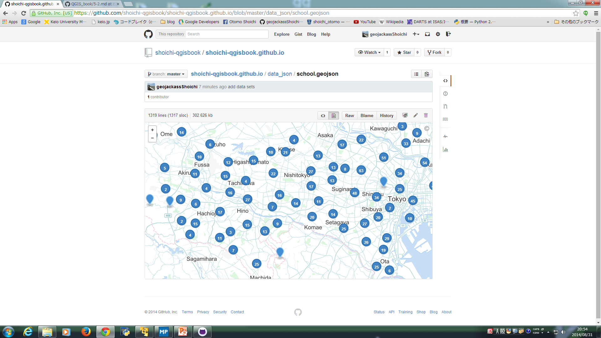
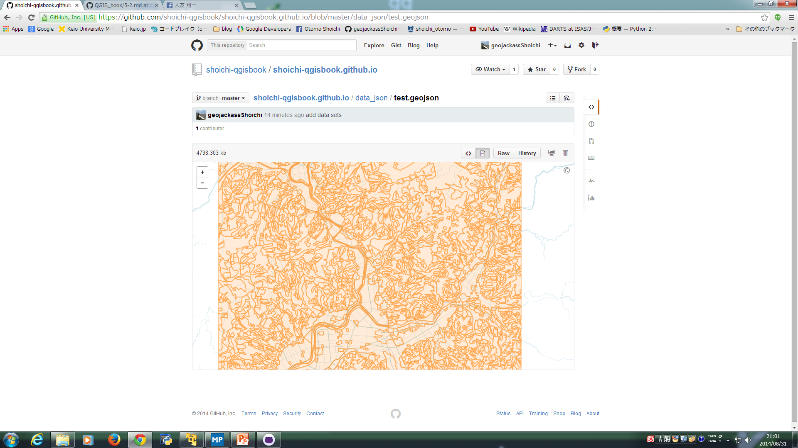

##GitHubに保存されたGeoJSONデータ

5-2「Webで公開する」では公開用サーバーを立てる際に、GitHub.ioを使用しました。
サーバーの細かな設定やセキュリティーに触れることは、この本の趣旨から外れてしまうのため公開用サーバーを構築することはしませんでした。ですが、CGIやデータベースを使用しない場合は、こういったサービスでも編集したデータを地図上に載せて公開する事することは可能です。

また通常のGitHubアカウントでも、ソースコードやプログラム以外にデータをアップロードする事があります。その場合GeoJSON形式のデータは地図上に描画された状態で表示されます。

参考に2-2「代表的なフォーマット」(ここに参照ページ差込)で使用したGeoJSONデータを作成したリポジトリにpushして下さい。

https://github.com/shoichi-qgisbook/shoichi-qgisbook.github.io

