https://gitprint.com/Arctictern265/QGIS_book/blob/master/all.md
<div style='page-break-after: always;'></div>

#地図情報のオープンデータ可視化［実践］入門

## 全ページ


[リード文](https://github.com/Arctictern265/QGIS_book/blob/master/1/1-lead.md)
## 1. [地理空間情報とオープンデータの概要](https://github.com/Arctictern265/QGIS_book/blob/master/1/1.md)

###  a. 地理空間情報とは
 * i. [身近な地理空間情報](https://github.com/Arctictern265/QGIS_book/blob/master/1/1-1-1.md)
 * ii. [情報は位置に結びつく](https://github.com/Arctictern265/QGIS_book/blob/master/1/1-1-2.md)
 * iii. [位置の表現の仕方](https://github.com/Arctictern265/QGIS_book/blob/master/1/1-1-3.md)
 * (Column) [同じ経度緯度でも位置が違う？-測地系の違い](https://github.com/Arctictern265/QGIS_book/blob/master/1/1-1-column1.md)
 * iv. [さまざまな投影法](https://github.com/Arctictern265/QGIS_book/blob/master/1/1-1-4.md)
 * (Column) [空間参照系](https://github.com/Arctictern265/QGIS_book/blob/master/1/1-1-column2.md)
 * v. [住所から位置を求める](https://github.com/Arctictern265/QGIS_book/blob/master/1/1-1-5.md)
 * vi. [可視化することで理解が進む](https://github.com/Arctictern265/QGIS_book/blob/master/1/1-1-6.md)

### b. オープンデータとは

 * i. [オープンデータの定義](https://github.com/Arctictern265/QGIS_book/blob/master/1/1-2-1.md)
 * (Column) [5スターオープンデータ](https://github.com/Arctictern265/QGIS_book/blob/master/1/1-2-column2.md)
 * (Column) [ライセンスを理解しよう](https://github.com/Arctictern265/QGIS_book/blob/master/1/1-2-column1.md)
 * ii. [オープンデータを巡る動き](https://github.com/Arctictern265/QGIS_book/blob/master/1/1-2-2.md)
 * iii. [公共のデータだけがオープンデータ？](https://github.com/Arctictern265/QGIS_book/blob/master/1/1-2-3.md)

### c. いまなぜ注目されているのか

 * i. [測位技術の充実](https://github.com/Arctictern265/QGIS_book/blob/master/1/1-3-1.md)
 * (Column) [GPSとは？](https://github.com/Arctictern265/QGIS_book/blob/master/1/1-3-column1.md)
 * ii. [オープンソースソフトウェアの充実](https://github.com/Arctictern265/QGIS_book/blob/master/1/1-3-2.md)
 * (Column) [OSGeo財団](https://github.com/Arctictern265/QGIS_book/blob/master/1/1-3-column2.md)
 * iii. [位置情報利用への期待と課題](https://github.com/Arctictern265/QGIS_book/blob/master/1/1-3-3.md)


[リード文](https://github.com/Arctictern265/QGIS_book/blob/master/2/2-lead.md)
## 2. [データを準備する](https://github.com/Arctictern265/QGIS_book/blob/master/2/2.md)

### a. オープンデータを使う

 * i. [データを探す](https://github.com/Arctictern265/QGIS_book/blob/master/2/2-1-1.md)
 * ii. [カタログサイトの利用](https://github.com/Arctictern265/QGIS_book/blob/master/2/2-1-2.md)

### b. 代表的なフォーマット

 * i. [csv](https://github.com/Arctictern265/QGIS_book/blob/master/2/2-2-1.md)
 * ii. [xml](https://github.com/Arctictern265/QGIS_book/blob/master/2/2-2-2.md)
 * iii. [ESRI Shapefile](https://github.com/Arctictern265/QGIS_book/blob/master/2/2-2-3.md)
 * iv. [GeoJSON](https://github.com/Arctictern265/QGIS_book/blob/master/2/2-2-4.md)
 * v. [KML](https://github.com/Arctictern265/QGIS_book/blob/master/2/2-2-5.md)
 * vi. [位置情報付きの画像](https://github.com/Arctictern265/QGIS_book/blob/master/2/2-2-6.md)
 * vii. [標高値データもしくはグリッドデータ](https://github.com/Arctictern265/QGIS_book/blob/master/2/2-2-7.md)
 * viii. [タイル地図](https://github.com/Arctictern265/QGIS_book/blob/master/2/2-2-8.md)
 * (Column) [オープンストリートマップ](https://github.com/Arctictern265/QGIS_book/blob/master/2/2-2-column1.md)
 * (Column) [ベクタデータとラスタデータ](https://github.com/Arctictern265/QGIS_book/blob/master/2/2-2-column2.md)

### c. ライセンス

 * i. [見ておくべきところ](https://github.com/Arctictern265/QGIS_book/blob/master/2/2-3-1.md)
 * ii. [クリエイティブ・コモンズ](https://github.com/Arctictern265/QGIS_book/blob/master/2/2-3-2.md)
 * iii. [パブリックドメイン](https://github.com/Arctictern265/QGIS_book/blob/b905b9f17a9056898cd487348017472f9987908e/2/2-3-3.md)
 * (Column) [測量成果の複製・使用](https://github.com/Arctictern265/QGIS_book/blob/master/2/2-3-column1.md)


[リード文](https://github.com/Arctictern265/QGIS_book/blob/master/3/3-lead.md)
## 3. [基本となる地図を準備する](https://github.com/Arctictern265/QGIS_book/blob/master/3/3.md)

### a. [身近な地図を作成する](https://github.com/Arctictern265/QGIS_book/blob/master/3/3-1.md)


 * i. 使用にあたり確認すべき項目
 * ii. データをダウンロードする
 * iii. 一般的なフォーマットへ変換する
 * iv. ファイルを開く
 * v. レイヤ毎にスタイルを設定
 * vi. 保存しておく

### b. [世界地図を作成する](https://github.com/Arctictern265/QGIS_book/master/3/3-3.md)

 * i. データをダウンロードする
 * ii. ファイルを開く
 * iii. レイヤ毎にスタイルを設定

### c. [公開されている地図を利用する](https://github.com/Arctictern265/QGIS_book/master/3/3-2.md)

 * i. オープンストリートマップを利用する
 * ii. 地理院地図を利用する

[リード文](https://github.com/Arctictern265/QGIS_book/blob/master/4/4-lead.md)
## 4. [テーマを決めてデータを可視化する](https://github.com/Arctictern265/QGIS_book/blob/master/4/4.md)

### a. [防災・減災・安全に役立つ地図を作成する](https://github.com/Arctictern265/QGIS_book/blob/master/4/4-1.md)

 * i. データをダウンロードする
 * ii. 点要素のスタイル
 * iii. 線要素のスタイル
 * iv. 面要素のスタイル

### b. [年齢別人口分布図を作成する](https://github.com/Arctictern265/QGIS_book/blob/master/4/4-2.md)

 * i. データをダウンロードする
 * ii. ファイルを開く
 * iii. 小地域データに統計データを結びつける
 * iv. 人口により色分け
 * v. 選択したレイヤを出力する
 * vi. 保存する
 * (Column) [標準地域メッシュコードとは？ - 2050年の人口予想図を作成する](https://github.com/Arctictern265/QGIS_book/blob/master/4/4-2-column1.md)

### c. [山岳表現を作成する](https://github.com/Arctictern265/QGIS_book/blob/master/4/4-3.md)

 * i. 日本の範囲内の場合 #基盤地図情報から数値標高モデル
  * i. データをダウンロードする
  * (Column) 10mメッシュは10mではない？
  * ii. グリッドデータへ加工する
  * (Column) 数値標高モデルの変換ツール
  * iii. 標高ごとに色分けする
  * iv. 陰影図を作成する
  * v. 色分けした標高と陰影図を重ねる
 * ii. 世界中のデータを扱いたい場合 #ETOPO1
  * i. データをダウンロードする
  * ii. 投影法を変換する
  * iii. 標高ごとに色分けする
  * iv. 色分けした標高と陰影図を重ねる

### d. [カッパ出没マップを作成する](https://github.com/Arctictern265/QGIS_book/blob/master/4/4-4.md)

 * i. 河川データから河川からの距離図を作成する
  * i. データをダウンロードする
  * ii. 投影法を変換する
  * iii. ラスタデータに変換する
  * (Column)GDAL -- Geospatial Data Abstraction Library --
  * iv. 距離を計算する
 * ii. 植生データから畑地面積率図を作成する
  * i. データをダウンロードする
  * ii. 畑地を抽出する
  * iii. ラスタデータに変換する
  * iii. 畑地面積率を計算する
  * (Column)プロセッシングツール
 * iii. 標高データから日射量図を作成する
  * i. 投影法を変換する
  * ii. 傾斜、傾斜方位を計算する
  * iii. 日射量を計算する
 * iv. データを組み合わせて新たな図を作成する
  * i. カッパ出没マップを作成する
  * (Column)統計モデル
  * ii. カッパ遭遇危険度マップを作成する 
  * (Column)オープンソースとしてのQGIS


[リード文](https://github.com/Arctictern265/QGIS_book/blob/master/5/5-lead.md)
## 5. [データを出力する](https://github.com/Arctictern265/QGIS_book/blob/master/5/5.md)


### a. [印刷する](https://github.com/Arctictern265/QGIS_book/blob/master/5/5-1.md)

 * i. プリントコンポーザ
 * ii. コンポーザマネージャ
 * iii. 地図を配置する
 * iv. 全体図を配置する
 * v. タイトルを配置する
 * vi. スケールを配置する
 * vii. 方位を配置する
 * viii. 凡例を配置する
 * ix. その他の整飾
 * x. 出力する
 * xi. 地図帳機能を利用する

### b. [Webで公開する](https://github.com/Arctictern265/QGIS_book/blob/master/5/5-2.md)

 * i. データを準備する
 * ii. サーバーを用意する
 * iii.  データを公開する
 * iv. 公開する際の留意点

 * (Column) [GitHub.Pages使用する](https://github.com/Arctictern265/QGIS_book/blob/master/5/5-2-column3.md)
 * (Column) [WMS/WFS](https://github.com/Arctictern265/QGIS_book/blob/master/5/5-2-column1.md)
 * (Column) [Mapbox](https://github.com/Arctictern265/QGIS_book/blob/master/5/5-2-column2.md)

## Appendix Ⅰ: QGIS操作ガイド

 * a. [QGISとは？](https://github.com/Arctictern265/QGIS_book/blob/master/appendix1/appendix1-1.md)
 * b. [インストール](https://github.com/Arctictern265/QGIS_book/blob/master/appendix1/appendix1-2.md)
  * i. Windows
  * ii. Mac
 * c. [プロジェクトを開く/保存する](https://github.com/Arctictern265/QGIS_book/blob/master/appendix1/appendix1-3.md)
 * d. [測地系・投影法を設定する](https://github.com/Arctictern265/QGIS_book/blob/master/appendix1/appendix1-4.md)
 * e. [プラグインを設定する](https://github.com/Arctictern265/QGIS_book/blob/master/appendix1/appendix1-5.md)
 * f. [新規レイヤを作成する](https://github.com/Arctictern265/QGIS_book/blob/master/appendix1/appendix1-6.md)
 * g. [ファイルをレイヤに追加する](https://github.com/Arctictern265/QGIS_book/blob/master/appendix1/appendix1-7.md)
 * g'. [特殊なレイヤを追加する](https://github.com/Arctictern265/QGIS_book/blob/master/appendix1/appendix1-6-2.md)
 * h. [レイヤにスタイルを設定する](https://github.com/Arctictern265/QGIS_book/blob/master/appendix1/appendix1-8.md)
 * i. [レイヤを編集する](https://github.com/Arctictern265/QGIS_book/blob/master/appendix1/appendix1-9.md)
 * j.  [レイヤを保存する](https://github.com/Arctictern265/QGIS_book/blob/master/appendix1/appendix1-10.md)
 * k. [ベクタ演算例](https://github.com/Arctictern265/QGIS_book/blob/master/appendix1/appendix1-11.md)
 * l. [ラスタ演算例](https://github.com/Arctictern265/QGIS_book/blob/master/appendix1/appendix1-12.md)
 * m. [印刷する](https://github.com/Arctictern265/QGIS_book/blob/master/appendix1/appendix1-13.md)

## Appendix Ⅱ:[データカタログ](https://github.com/Arctictern265/QGIS_book/blob/master/appendix2/appendix2.md)

### a. [国の機関から入手できる情報](https://github.com/Arctictern265/QGIS_book/blob/master/appendix2/appendix2-1.md)
 * i. 基盤地図情報
 * ii. 国土数値情報
 * iii. 自然環境情報GIS提供システム
 * iv. e-stat
 * v. ASTER GDEM
 * vi. LANDSAT8直接受信・即時公開サービス
 * vii. 東京情報大学 VIIRSプロジェクト
 * viii. 東海大学宇宙情報センター
 * ix. 地すべり地形GISデータ
 * x. 地球観測衛星データ提供システム β版

### b. [地方自治体から入手できる情報](https://github.com/Arctictern265/QGIS_book/blob/master/appendix2/appendix2-2.md)

 * i. 都道府県
  * 栃木県
  * 埼玉県
  * 福井県
  * 岐阜県
  * 静岡県
  * 愛知県
  * 兵庫県
  * 鳥取県
 * ii. 市町村
  * 北海道室蘭市
  * 岩手県陸前高田市
  * 宮城県大崎市
  * 秋田県横手市
  * 福島県会津若松市
  * 群馬県前橋市
  * 埼玉県さいたま市
  * 埼玉県和光市
  * 埼玉県南埼玉郡宮代町
  * 千葉県千葉市
  * 千葉県流山市
  * 東京都板橋区
  * 東京都八王子市
  * 神奈川県横浜市
  * 神奈川県横浜市金沢区
  * 神奈川県川崎市
  * 神奈川県相模原市
  * 神奈川県横須賀市
  * 神奈川県藤沢市
  * 神奈川県大和市
  * 新潟県三条市
  * 新潟県糸魚川市
  * 石川県金沢市
  * 石川県野々市市
  * 石川県河北郡内灘町
  * 福井県福井市
  * 福井県敦賀市
  * 福井県鯖江市
  * 福井県越前市
  * 福井県坂井市
  * 福井県吉田郡永平寺町
  * 長野県須坂市
  * 岐阜県大垣市
  * 静岡県三島市
  * 静岡県裾野市
  * 静岡県御前崎市
  * 愛知県名古屋市
  * 滋賀県大津市
  * 大阪府大阪市
  * 奈良県葛城市
  * 島根県松江市
  * 岡山県玉野市
  * 福岡県福岡市
  * 佐賀県武雄市

### c. [国外のデータ](https://github.com/Arctictern265/QGIS_book/blob/master/appendix2/appendix2-3.md)

 * i. Natural Earth
 * ii.  International Steering Committee for Global Mapping（ISCGM）
 * iii. NASA's Earth Observing System Data And Information System（EOSDIS)
 * iv. アメリカ地質調査所：USGS
 * v. LAND PROCESSED DISTRIBUTED ACTIVE ARCHIVE CENTER：LP DAAC
 * vi. アメリカ海洋大気庁：NOAA
 * vii. NOAA National Geophysical Data Cnter（NOAA NGDC）
 * viii. CGIAR CSI（国際農業研究協議グループ）
 * ix. Global Land Cover Facility：GLCF（メリーランド大学）
 * x.OPENDEM
 * xi. Harmonized World Soil Database
 * xii. National Snow & Ice Data Center（NSIDC）
 * xiii. アメリカ疾病予防管理センター（CDC.gov）EPI info

### d.  [配信地図](https://github.com/Arctictern265/QGIS_book/blob/master/appendix2/appendix2-4.md)

 * i. 基盤地図情報WMS  
 * ii. 歴史的農業環境WMS配信サービス
 * iii. 被災地空中写真 WMS / TMS
 * iv. 地質図  
 * v. 日本の地球化学図
 * vi. 日本重力データベース
 * vii. 海底標高図
 * viii. 地理院タイル  
 * ix. エコリス地図タイル  
 * x. OpenStreetMap
 * xi. USGS The National Map

### e.  [データポータルサイト](https://github.com/Arctictern265/QGIS_book/blob/master/appendix2/appendix2-5.md)

 * i. Open Data METI
 * ii. DATA.go.jp
 * iii. ckan
 * iv. Data for Japan
 * v. LinkData.org


<div style='page-break-after: always;'></div>

# 地理空間情報とオープンデータの概要
「地理空間情報」「オープンデータ」が、なぜ今注目されているのか見て行きましょう。

<div style='page-break-after: always;'></div>

# 地理空間情報とオープンデータの概要
「オープンデータ」は、官公庁や自治体での積極的なデータ公開が増えており、目にする機会が多いのではないでしょうか。では、どういった条件を満たしているデータを「オープンデータ」と言うのでしょうか。  
「地理空間情報」は専門的な印象を受けてしまうかもしれませんが、とても身近で利用している情報が多く含まれてきます。ただ、取り扱いには少々コツが必要になってきます。  
この章では、本書を読み進めていく前提となる知識を整理しながら、なぜ今「オープンデータ」「地理空間情報」が注目を集めているのかまでを見て行きましょう。

# 地理空間情報とは？
## 身近な地理空間情報
地理空間情報という用語がはじめて定義されたのは、平成19年5月に成立・公布された地理空間情報活用推進基本法においてです。この中で地理空間情報とは、

* 空間上の特定の地点又は区域の位置を示す情報（当該情報に係る時点に関する情報を含む。以下「位置情報」という。）
* 前号の情報に関連付けられた情報

と定義されています。このように書いてしまうと、堅苦しいもののように受け取ってしまうかもしれませんが、何らかの位置とそれに結びついた情報が全て該当します。  
さてこの法律の成立への取り組みは、阪神淡路大震災での震災直後の被害状況の把握、復旧作業の効率化において、位置と結びついた情報がとても役に立つ事が実証された事が契機となっています。ですので、地理空間情報の活躍する分野として、災害など万が一の事態が代表例としてあげられます。少し身近な事例で考えてると、いざという際の設備がどこにあるか、避難所として指定されている学校はどこかや、近所の消火栓の位置でもいいですし、AEDがどこに設置されているかでもいいです。こういった情報が整備され、認知されていることによって、緊急時に慌てる事無く行動することが出来るようになります。  
普段利用しているサービスでも多くの例をあげることが出来ます。スマートフォンのGPSを利用して地図サービス上で近くのお店を探すことを考えましょう。これも、お店の情報が何らかの位置情報を持っていることが前提になりますので、立派に地理空間情報となります。例えばスマートフォンやGPSに対応したデジカメで写真を撮った場合もあげられます。この時、写真の中に、位置情報がExifという規格に沿って入れられます。この位置情報を元に、後からどこで撮った写真かを地図上に展開して見ることができます。位置情報を持った写真も地理空間情報と言えます。  
まだまだ色々な例をあげることができそうですね。  

地理空間情報と書いてしまうとピンと来ないかもしれませんが、様々な分野で、様々なサービスに利用されている情報になります。

## 情報は位置に結びつく
ある「位置」を考えましょう。ピンポイントで一箇所をあらわす位置でもいいですし、広い範囲をあらわす位置でもいいです。その位置で起きることの情報量は、時間発展的に増加していきます。
いくつか例を挙げて考えてみましょう。
- 6月5日の九十九里浜の天気は晴で、波の高さは1m
- 本牧海浜公園で、アジ・サバなどの青物の釣果が先月より増えている
- 6月1日に神宮球場で、慶應大学が六大学野球2014春季リーグ戦の優勝を決めた
- 1969年7月20日、アポロ11号は月に着陸した

これらは、その「位置」で起きた出来事の「情報」です。

*様々な情報が位置に結びつく*

|位置|情報|
|----|----|
|九十九里浜|天候:晴れ・波高:1m|
|本牧海浜公園|アジ・サバの釣果が増加している|
|神宮球場|慶應大学が六大学野球で優勝した|
|月のある地点|アポロ11号が着陸した|

このように、どの位置で起きたことかまで考えていくと、ほとんどの情報が地理空間情報と言えそうですね。地理空間情報として扱う範囲はとても広いものになります。

## 位置の表現の仕方
位置を示すにはどのような方法があるでしょうか。普段、私達が場所を伝える時には、地名や住所、施設名などを使います。また、最近ではスマートフォンにGPSが付いており、現在地を緯度経度の値で知ることができます。その他にも、一般的にはあまり使用することはありませんが、地図上の位置を投影座標と呼ばれるX,Yの座標値で示す方法もあります。
 
 - 地名「新宿」
 - 住所「東京都新宿区霞ヶ丘町３−１」
 - 施設名「明治神宮野球場」
 - 緯度経度「北緯35度40分28.46秒、東経139度43分1.69秒」
 - 投影座標 「平面直角座標IX系 X:22053268 Y:-10483642」

この中でも「緯度経度」と「投影座標」は、地図情報を可視化するにあたって、とても重要な前提知識となるため、もう少し詳しく説明します。

###緯度経度
緯度経度の「北緯35度40分28.46秒、東経139度43分1.69秒」という値は、何の値でしょうか。これは図のように、地球を楕円の物体とみなし、それをXYZの座標空間に置いたとき、座標の原点からその地点までの角度を表しています。X軸からの角度を緯度、Y軸からの角度を経度と呼びます。


このようにして緯度、経度を決めるとき、地球をどのような形の楕円とみなすか？また、その楕円を地球とどのように重ねるのか？の情報が必要です。それを定めたものを測地系と言います。（Column参照）

日本では現在、長半径 6,378,137m、扁平率の逆数(1/f) 298.257222101のGRS80と呼ばれる楕円体の重心が座標空間の原点に位置し、地球の回転軸がZ軸と重なりXY平面が赤道と一致する世界測地系（または日本測地系2000）と呼ばれる測地系を採用しています。

###投影座標
地球上の地物の距離や面積、方位などの位置情報を、紙の地図上で上手く表現するにはどうすればよいでしょうか？そのためには、楕円体である地球を平面上に投影する必要があります。その方法を投影法と呼び、光源の位置や投影面の形などの違いよってさまざまな種類が考案されています。

投影法によって平面上に投影された地物の位置は、その平面を基準とした座標によって示すことができます。それを投影座標と呼びます。また、同じ投影法を採用していても、投影する範囲や原点の設定によって、投影座標は異なり、これらを定めたものを、投影座標系と言います。


#　(Column) 同じ経度緯度でも位置が違う？-測地系の違い

地球上での位置の表現の仕方として、緯度経度で表す場合と投影座標で表す場合があることについて説明しました。投影座標系ではそれぞれの投影法によって同じ場所でも座標値が異なるのはまあわかりますが、緯度経度まで異なるとはどういうことでしょうか。詳しい説明は測地学についての書籍に譲るとして、ここでは測地系の違いによって同一地点でも緯度経度が異なる原因を、少し違う視点から見てみましょう。

ある地点の緯度は、その地点から北極星を観測することでわかります。北極星は無限遠点にあるとみなせるので、緯度は北極星の仰角そのものであることが簡単な作図でわかります。江戸時代に作成された大日本沿海輿地全図ではこの原理で緯度を求めています。

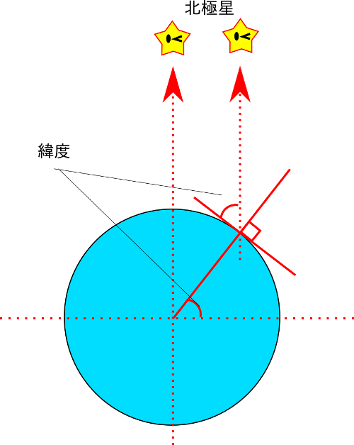

ところで、これは地球が球体である場合の話です。実際の地球は赤道付近が少し膨らんでおり、なおかつ北極側が少し突き出た洋ナシ型になっています。これだと、北極星の仰角と緯度は必ずしも一致しません。

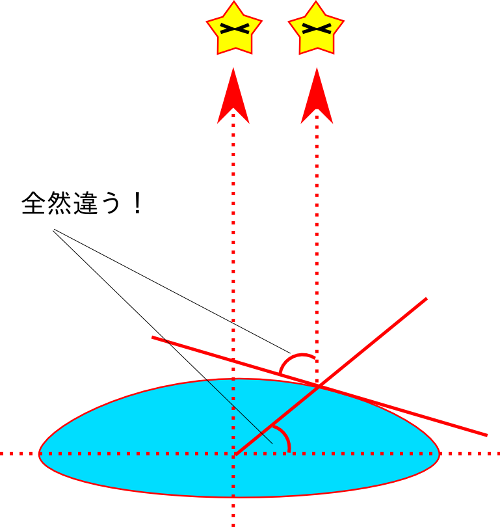

そこで、地球の形を回転楕円体（どら焼き型）で近似することにします（準拠楕円体と呼びます）。これなら北極星の仰角から緯度を求めることは、単純ではないものの何とか計算できます。あとはどのような楕円体で近似するかですが、これがいくつも種類があります。当然楕円体の形が異なると同じ仰角でも算出される緯度の値は違うものになります。これが同じ位置でも緯度が異なる原因です。

日本ではつい最近までベッセル楕円体と呼ばれる楕円体を準拠楕円体として採用していました。なおかつ、旧東京天文台跡を経緯度原点として正確な緯度経度を求め、これを基準とした座標系を定めました。これは日本測地系と呼ばれ、2002年3月まで使用されていました。

さて、宇宙技術の進歩によってより精密な地球の形状が求められるのに伴って、より地球の形状に近い楕円体を用いた測地系が使用されるようになってきます。GPS（Global Positioning System）ではWGS1984という楕円体が用いられています。先述の通り、楕円体が異なると緯度経度も異なるわけですから、日本測地系の緯度経度とGPSで求められた緯度経度には差が出てしまいます。さらに悪いことに、両者は原点の位置が異なっていました。GPSで用いられているWGS84測地系では、地球の重心を原点と定めていますが、日本測地系の原点は先述の通り旧東京天文台跡の日本経緯度原点を原点としています。結果、日本測地系のベッセル楕円体の中心位置が地球の重心と一致していませんでした。

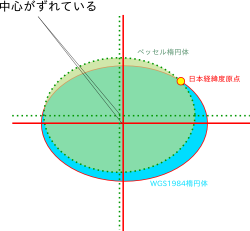

そこで、日本でもより正確なGRS80楕円体を用いた測地系を定めてこのような状況に対応することにしました。これを日本測地系2000、または世界測地系と呼びます。GPSで用いられているWGS1984楕円体とGRS80楕円体では扁平率がわずかに異なりますが、陸域測量においてはほとんど差がありません。

なお、厳密には天文測量で得られる緯度経度と、測地系に基づいて得られる緯度経度とは、ジオイド等の関係もあって一致しません。ジオイドとは仮想的な海水面（等重力ポテンシャル面）のことで、重力分布によって凹凸があります。簡単に言うと、私たちは重力分布の偏りによって、楕円体面に対してまっすぐ立っていません。したがって、天文測量を行う場合でもジオイド面の歪みの分角度にずれが生じます。日本で用いられている測地系の座標値は、基本的には三角測量によって得られた座標を楕円体上に展開したものです。

測地系についてのより正確な説明は、測地学の専門書や国土地理院のウェブサイトをご覧ください。


## さまざまな投影法 

### 世界地図
みなさんが一番目にしたことのある世界地図は、経線が平行に等間隔に、緯線が経線と直交するように描かれているものではないでしょうか。これはメルカトル図法で描画された地図です。メルカトル図法は、地球に北方向から円筒をかぶせて、その円筒上に投影された図になります。特徴としては、地球上のある地点から引いた線分の角度が地図上で同じ角度で表せること(正角図法)、高緯度になるにつれて面積、距離が大きく出てしまうことがあげられます。

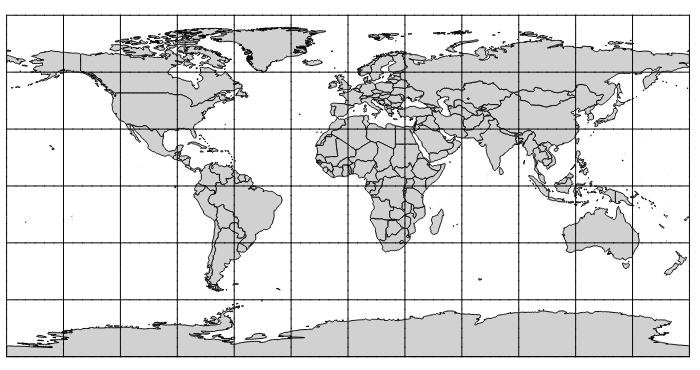.

こちらは南極を中心に描画した正距方位図法です。この投影法の場合、中心からの方位と距離を正しく表すことが出来ます。

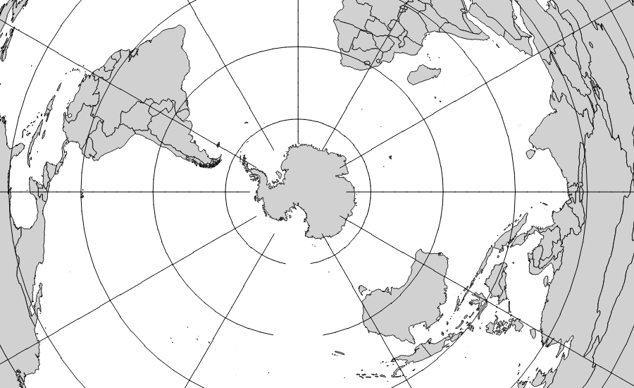.

正積図法のモルワイデ図法です。この投影法の場合、実際の面積比と地図上の面積比を正しく表すことが出来ます。

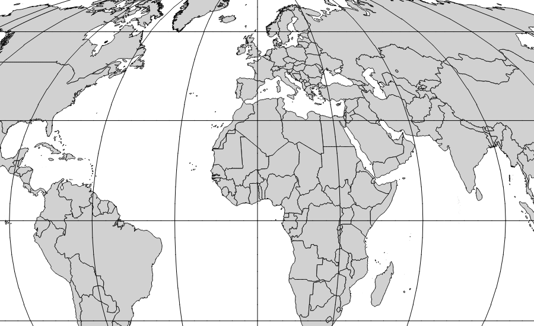.

ここで紹介した投影法はほんの一部のものです。様々な投影法があり、それぞれ特徴があること、何を正確に表したいかにより選択する必要があることを覚えておきましょう。

### 日本国内で利用される投影法
日本の地図で採用されている投影法として、ガウス・クリューゲル図法があります。これは地球に横から円筒形をかぶせて投影させる方法です。ガウス・クリューゲル図法で投影する際に、日本全国を19の地域に分割し、各投影範囲と投影原点を決めたものを平面直角座標系と呼びます。分割は投影による歪みを一定以下に抑えるために行われます。主に1万分の1より大きい(拡大された)縮尺の地図で使用されており、19の地域の分割は以下の表のようになります。

*平面直角座標系の適用区域*

|系番号|適用区域|
|------|--------|
|I|長崎県 鹿児島県のうち北方北緯32度南方北緯27度西方東経128度18分東方東経130度を境界線とする区域内（奄美群島は東経130度13分までを含む。)にあるすべての島、小島、環礁及び岩礁|
|II|福岡県　佐賀県　熊本県　大分県　宮崎県　鹿児島県（I系に規定する区域を除く。)|
|III|山口県　島根県　広島県|
|IV|香川県　愛媛県　徳島県　高知県|
|V|兵庫県　鳥取県　岡山県|
|VI|京都府　大阪府　福井県　滋賀県　三重県　奈良県 和歌山県|
|VII|石川県　富山県　岐阜県　愛知県|
|VIII|新潟県　長野県　山梨県　静岡県|
|IX|東京都（XIV系、XVIII系及びXIX系に規定する区域を除く。)　福島県　栃木県　茨城県　埼玉県 千葉県 群馬県　神奈川県|
|X|青森県　秋田県　山形県　岩手県　宮城県|
|XI|小樽市　函館市　伊達市　北斗市　北海道後志総合振興局の所管区域　北海道胆振総合振興局の所管区域のうち豊浦町、壮瞥町及び洞爺湖町　北海道渡島総合振興局の所管区域　北海道檜山振興局の所管区域|
|XII|北海道（XI系及びXIII系に規定する区域を除く。）|
|XIII|北見市　帯広市　釧路市　網走市　根室市　北海道オホーツク総合振興局の所管区域のうち美幌町、津別町、斜里町、清里町、小清水町、訓子府町、置戸町、佐呂間町及び大空町　北海道十勝総合振興局の所管区域　北海道釧路総合振興局の所管区域　北海道根室振興局の所管区域|
|XIV|東京都のうち北緯28度から南であり、かつ東経140度30分から東であり東経143度から西である区域|
|XV|沖縄県のうち東経126度から東であり、かつ東経130度から西である区域|
|XVI|沖縄県のうち東経126度から西である区域|
|XVII|沖縄県のうち東経130度から東である区域|
|XVIII|東京都のうち北緯28度から南であり、かつ東経140度30分から西である区域|
|XIX|東京都のうち北緯28度から南であり、かつ東経143度から東である区域|

また世界を60の地域に分割し、各投影範囲と投影原点を決めたものをUTM（ユニバーサル横メルカトル図法）座標系と呼びます。平面直角座標系と同じく、投影による歪みを一定以下に抑えるために分割されています。1万分の1から20万分の1の地図で使用されており、Zone51からZone55が日本の範囲に入ってきます。

*UTMの適用区域*

|ゾーン|適用区域|
|-----|--------|
|51|東経120-126度|
|52|東経126-132度|
|53|東経132-128度|
|54|東経138-144度|
|55|東経144-150度|

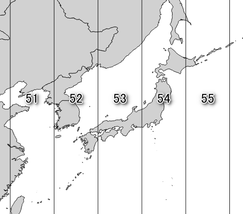.

## (Column) 空間参照系
ある場所の緯度経度の値は、測地系（準拠する楕円体の形および地球と楕円体の重ねかた）によって定まります。また、その緯度経度の値を平面に投影した座標値は、投影座標系（投影法およびその原点）によって定まります。そのため、ある場所を表わすには測地系と投影座標系を定めなければなりません。その組み合わせの一覧を「空間参照系」もしくは「CRS（座標参照系）」と言います。

空間参照系には空間参照ID(SRID)と呼ばれる識別番号が付けられ管理されています。空間参照IDは、いくつかの団体が整備していますが、その中でもEPSG（European Petroleum Survey Group）という団体によって作成されたEPSGコードがGISでは良く利用されています。
EPSGコードを利用すれば、ある位置座標の値がどの測地系と投影座標系から定まっているのかを簡単に示すことができます。

*日本国内で良く利用されるEPSGコード一覧*

|EPSGコード|測地系（準拠楕円体、座標空間）|投影座標系|
|----|----|----|
|4612|世界測地系（GRS80楕円体、ITRF94系）|緯度経度|
|3097〜3101|世界測地系（GRS80楕円体、ITRF94系）|UTM座標系(ゾーン51〜55)|
|2443〜2461|世界測地系（GRS80楕円体、ITRF94系）|平面直角座標系(系番号I〜XIX)|
|3857|WGS84球体、WGS84系|WEBメルカトル|
|4326| WGS84楕円体、WGS84系|緯度経度|
|32651～32656|WGS84楕円体、WGS84系|UTM座標系(ゾーン51〜55)|
|4301|日本測地系（ベッセル楕円体、日本測地系）|緯度経度|
|102151～102156|日本測地系（ベッセル楕円体、日本測地系)|UTM座標系(ゾーン51〜55)|
|30161～30179|日本測地系（ベッセル楕円体、日本測地系)|平面直角座標系(系番号I〜XIX)|


- 世界測地系は日本測地系2000、JGD2000とも呼ばれます。
- 日本測地系は旧日本測地系、Tokyo Datumとも呼ばれます。
- 緯度経度は、投影座標系に対して「地理座標系」とも呼ばれます。
- EPSGコード3857はオープンストリートマップなどのウェブ地図で使われています。

## 住所から位置を求める

住所（「神奈川県相模原市中央区由野台３丁目１」など）を経度緯度（緯度:35.557935, 経度:139.392853など）や投影座標に変換する処理のことをジオコーディングやアドレスマッチングと言います。住所の表記方法に関しては世界各国で異なりますが、住所文字列と座標情報（緯度・経度など）を管理するファイルを基に対応付けを行います。この住所文字列と座標情報（緯度・経度など）を管理するファイルのことを、住所辞書と呼びます。
個人で住所辞書を用意するのは大変ですので、webで提供されているジオコーディングサービスを試してみましょう。下記のサンプルコードを実行してみて下さい。デフォルトで「神奈川県相模原市中央区由野台３-1-1」と入力されています。このままGeocodeボタンを押下すると該当する住所を座標値に変換し、その座標にマーカーを描画して画面の中心にする処理を行います。予め住所が入力されている欄には、他の住所や、観光地の名称、場所の名前等を入力することも可能です。

*Google Geocoding APIを使用した例*

```
<!DOCTYPE html>
<html>
  <head>
    <meta name="viewport" content="initial-scale=1.0, user-scalable=no">
    <meta charset="utf-8">
    <title>Geocoding Sample</title>
    <style>
      html, body, #map-canvas {
        height: 100%;
        margin: 0px;
        padding: 0px
      }
      #panel {
        position: absolute;
        top: 5px;
        left: 50%;
        margin-left: -180px;
        z-index: 5;
        background-color: #fff;
        padding: 5px;
        border: 1px solid #999;
      }
    </style>
    <script src="https://maps.googleapis.com/maps/api/js?v=3.exp"></script>
    <script>
var geocoder;
var map;
function initialize() {
  geocoder = new google.maps.Geocoder();
  var latlng = new google.maps.LatLng(35.557935, 139.392853);
  var mapOptions = {
    zoom: 12,
    center: latlng
  }
  map = new google.maps.Map(document.getElementById('map-canvas'), mapOptions);
}

function codeAddress() {
  var address = document.getElementById('address').value;
  geocoder.geocode( { 'address': address}, function(results, status) {
    if (status == google.maps.GeocoderStatus.OK) {
      map.setCenter(results[0].geometry.location);
      var marker = new google.maps.Marker({
          map: map,
          position: results[0].geometry.location
      });

    } else {
      alert('ジオコーディングできませんでした。他の地名で検索して下さい: ' + status);
    }
  });
}

google.maps.event.addDomListener(window, 'load', initialize);

    </script>
  </head>
  <body>
    <div id="panel">
      <input id="address" type="textbox" value="神奈川県相模原市中央区由野台3-1-1">
      <input type="button" value="Geocode" onclick="codeAddress()">
    </div>
    <div id="map-canvas"></div>
  </body>
</html>
```

Google Geocoding APIを使用した例を見てもらいましたが、使用にあたり制限があるのでご注意下さい。ジオコーディングの結果はGoogleマップ上に表示する場合にのみ使用することが出来ます。
他のジオコーディングサービスとしては、東京大学空間情報科学研究センターが提供しているものもあります。国交省　国土計画局や国土地理院のデータを元にジオコーディングを行ってくれます。利用にあたっては、サービスを使用したことの明記、どのデータを使用したかの明記が求められます。
　http://newspat.csis.u-tokyo.ac.jp/geocode/

## 可視化することで理解が進む

さて、ここまでは位置情報を座標値という数値で表してきました。また、位置情報にはその場所が何なのか、だれの土地なのか、何が起こった場所なのか、などの付随した情報を関連付けることができることも示してきました。しかし、このままでは座標値という数値とそれに関連した情報の羅列でしかありません。これだと、付近には何があるのか、どの程度の広さなのかといった情報をパッと見で理解することができません。

位置情報を、それを見る人が直感的にわかりやすい形で表現するためには、座標値をもとに地図上に展開する必要があります。また、単に点や線で展開するだけでなく、データや地物の種別によって色、線種、線幅を変えたりして描画し、さらには記号や注記を駆使してわかりやすく表現する必要があります。こうすることで、閲覧者は目的とする情報を直感的に理解することができるようになります。位置情報における可視化とは、端的に言えば地図を作製することともいえるでしょう。

地図には大きく分けて地形図と主題図があります。一般に地形図とは実在する地物や、高さを表す等高線、行政界のような架空の境界線など、所定の項目をすべて可視化して重畳したものであるといえます。これに対して主題図は、たとえば人口分布や土地利用図のように、ある特定の情報を表現することに特化した地図を言います。主題図では、色の濃淡や、必要であればグラフを使ったりして目的とする数値をわかりやすく表現する必要があります。

特定の情報を表すのに特化した地図という意味では、案内図や天気図なども該当するかもしれません。いずれにしても、それぞれの目的に合った形でわかりやすく表現して、閲覧者が素早く情報を得られるようにすることが重要であるといえるでしょう。

それでは皆さんの手元にある現地調査結果や妖怪目撃情報などのデータはどのように地図上に展開するべきでしょうか。点の大きさはどの程度がいいか、点の色や種別はデータのどの項目に関連させるべきか、などをまず考える必要があります。またそれだけでは場所がわかりにくい場合は地形図を背景にするべきでしょうか、それとも標高図を背景にしたほうがいいでしょうか。標高の表現は等高線がいいでしょうか、または段彩図のほうが見やすいでしょうか、はたまたメッシュごとに標高を色の濃淡で表現した画像のほうがいいでしょうか、その場合はカラーテーブルはどのようにしたらいいでしょうか。

可視化にあたって考えるべきことは少なくありませんが、きれいな絵を描くような感覚で進めていくとそれなりに楽しくもあります。また、絵を描くのと違ってPCの上で作業する分にはいくらでもやり直しができるので、試行錯誤をしながら進めていくことが可能です。せっかくなら、わかりやすく、なおかつ美しい図面を作りたいものですね。

データの可視化のテクニックについては３章以降で詳しく説明していきます。


<div style='page-break-after: always;'></div>

# オープンデータとは？
##オープンデータの定義
オープンデータはもちろん地理空間情報のみを示した用語ではなく、広くデータ一般に適用される概念です。ただし、本書の中で扱うデータは地理空間情報に限定されますので、少し違った範囲で捉えているところもあります。

まず、Open Knowledge FoundationのOpen Data Handbook(日本語訳：http://opendatahandbook.org/ja/what-is-open-data/)では、Open Definitionの定義に従うものをオープンデータとしており、

>オープンデータとは、自由に使えて再利用もでき、かつ誰でも再配布できるようなデータのことだ。従うべき決まりは、せいぜい「作者のクレジットを残す」あるいは「同じ条件で配布する」程度である。

としています。また、Open Definition(http://opendefinition.org/od/)に、その意味することが説明されていますが、まとめると、

>**利用できる、そしてアクセスできる** データ全体を丸ごと使えないといけないし、再作成に必要以上のコストがかかってはいけない。望ましいのは、インターネット経由でダウンロードできるようにすることだ。また、データは使いやすく変更可能な形式で存在しなければならない。  
>**再利用と再配布ができる** データを提供するにあたって、再利用や再配布を許可しなければならない。また、他のデータセットと組み合わせて使うことも許可しなければならない。  
>**誰でも使える** 誰もが利用、再利用、再配布をできなければならない。データの使い道、人種、所属団体などによる差別をしてはいけない。たとえば「非営利目的での利用に限る」などという制限をすると商用での利用を制限してしまうし「教育目的での利用に限る」などの制限も許されない。

とされています。  
オープンデータはデータを公開したから終わりということではありません。使いやすい形で公開を行うことで、他のデータ・サービスと組み合わせて使用され、価値を創造することを目的としていることを押さえておきましょう。

さて地理空間情報についてです。  
地理空間情報の場合、データが国土地理院が行った基本測量や、国及び公共団体等がおこなっている公共測量の成果であるため、利用にあたり条件が付いてくる場合があります。再配布が自由な形で行えるというわけではありません。  
本書で扱うデータとしては、

* インターネット等を通して容易に手に入れられるものであること
* 利用条件のはっきりしているものであること
* 利用条件によらず、無償で利用出来るものであること

程度を条件としていると考えて下さい。各データを使用する際の注意点はその都度述べていくことにします。

#(column)5スターオープンデータ
Webの発明者でありLinked Dataの創始者でもあるティム・バーナーズ＝リーは，オープンデータのレベルを星の数で表わす5スタースキームを提案しています。

- ★	(どんな形式でも良いので) あなたのデータをオープンライセンスでWeb上に公開しましょう
- ★★	データを構造化データとして公開しましょう (例: 表のスキャン画像よりもExcel)
- ★★★	非独占の形式を使いましょう (例: ExcelよりもCSV)
- ★★★★	物事を示すのにURIを使いましょう，そうすることで他の人々があなたのデータにリンクすることができます
- ★★★★★	あなたのデータのコンテキストを提供するために他のデータへリンクしましょう

5スターオープンデータ（http://5stardata.info/ja/） より

位置情報のオープンデータに対しては、できれはGISで簡単に読み込める状態、星３つレベルでデータが公開されることが望まれます。

## ライセンスを理解しよう

現在、ライセンスの種類には多種多様な形態のものがあります。
とりわけ話題に上ることが多い著作権以外にも知的財産権は認められています。また、近年その対象は拡大される傾向にあり、今後ますますその重要性は高まるものと思われます。

- 著作権：創作された表現に与えられる権利
 - 著作者人格権：公表の有無や氏名の表示等を決定する権利であり、もともとの著者だけが持つ権利
 - (財産権としての)著作権：複製権や頒布権などの著作物による利益に関する権利で、譲渡可能である
</br>
- 産業財産権：産業の発展に関する権利
 - 特許権：発明に与えられる権利
 - 実用新案権：考案に与えられる権利
 - 意匠権：工業デザインに与えられる権利
 - 商標権：商標及び一体化した信用力に与えられる権利

ここから、公開系の地図情報を扱う際によく使うと思われるサービスの、ライセンスポリシーを参照してみましょう。

- Google Maps APIではページのコンテンツに関しては、クリエイティブコモンズ 表示3.0ライセンスにより使用許諾を行います。また、サンプルコードに関してはApache2.0ライセンスにより使用許諾を行います。詳細は、下記のリンクを参照してください。 

https://developers.google.com/site-policies?hl=ja


- 国土地理院の基盤地図情報に関しては、基盤地図情報FAQの7-6, 7-7に以下のような記述があります。
 
> - 7-6 基本的には、基盤地図情報を整備した機関が著作権を持っています。ただし、整備に当たって他の図面を二次利用して整備している場合は、当該図面の整備者も著作権を保有しています。詳細は、各データに添付されているメタデータ等を参照し、各データの整備者にお問合せください。
> - 7-7 利用する際には、著作権者により手続が必要になる場合があります。詳細は、各データに添付されているメタデータ等を参照し各データの整備者にご確認ください。
なお、国土地理院が作成する基盤地図情報については、基本測量成果という位置づけになることから、測量法等に基づく手続が必要になります。詳しくは、『測量成果の複製・使用』を御覧ください。

 - [基盤地図情報FAQ](http://www.gsi.go.jp/kiban/faq.html)
 - [測量成果の使用・複製](http://www.gsi.go.jp/LAW/2930-index.html)

なぜ、このように複雑な法体系になってしまうのでしょうか。それは、現在のところ、直接的に地図情報を総べる法整備が十分に成熟していないためであると筆者は考えます。

まず初めに、計算機科学が発達するにつれて、精緻な地図をはじめとする巨大な情報を、ネットワークの高速化や機器の発展にともなって、携帯電話などでも地図を閲覧できるようになりました。
次に、汎用計算機及び携帯機器に搭載されたwebブラウザの進化もあり、データだけではなく、地図の表現方法にも様々な加工が可能になりました。例えば、ブランドサイトなどでモノクロームの地図を表示することでサイト自体の高級感を演出したり、地図を水彩画風のデザインで描画するなどして表示することなどがそれに該当します。

結果として、例えばデータに関する部分を著作権で、データを表示する方法に関しては特許や実用新案で、データの表示するデザイン部分を意匠権で保護するということになります。

## オープンデータを巡る動き
オープンデータの定義である「自由に使えて再利用もでき、かつ誰でも再配布できるようなデータ」という概念自体は特に新しいものではありません。しかし、2009年頃から米国やEUにおいて、また日本国内においては2013年頃から、政府や地方自治体などの公的機関を中心にオープンデータを推進する動きが大変活発になってきました。その目的として、公的機関としての透明性の確保や公共サービスの向上ほか、民間によるデータ活用の促進と、それによる経済の活性化があげられています。もちろん地理空間情報も、このような中で重要な役割を担っています。そこでこの章では、オープンデータの背景を理解するため、国際的な動向、日本政府や地方自治体の取り組み、市民・民間での活用などの、オープンデータを巡る動きを見てみたいと思います。

### 国際的な動向
2009年に米国と英国において、行政情報をオープンにする取り組みとして、政府によるデータポータルサイトが開設されました。それ以降も欧州を中心とした国々でオープンデータの取り組みが進み、2013年6月には英国のロックアーンで開かれた主要8カ国首脳会議で「オープンデータ憲章」の合意がなされました。オープンデータ憲章では表◯の5つのオープンデータに関する原則が示されています。以後、各国の政府ではこの原則に従うべくオープンデータへの取り組みが一層活発になってきています。

*オープンデータに関する5つの原則*

1. 原則としてのオープンデータ - 政府のデータはすべて、原則として公開する
2. 質と量 - 高品質で十分なデータをタイムリーに提供する
3. 全ての者が利用できる - できるだけ多くのデータをオープンなフォーマットで公開する
4. ガバナンス改善のためのデータの公表 - データを利用し意思決定を改善できるように、データの収集方法や基準、公表プロセスを透明化する 
5. 技術革新のためのデータの公表 - データを利用した技術革新が進むように、機械判読可能な形で公開する


### 日本政府の取り組み
日本では「オープンデータ憲章」に従いアクションプランを策定しています。その中で、国の保有するデータ・セットの公開やポータルサイトの開設を順次進めていくこと、また各地で開催されるハッカソン等のイベントへ積極的に参加することなどがコミットメントされています。

このアクションプランの通り、2014年には、各府省が保有データをオープンデータとして活用する「データカタログサイト試行版」（http://www.data.go.jp）が開設され、現在も随時データが追加されています。　　　

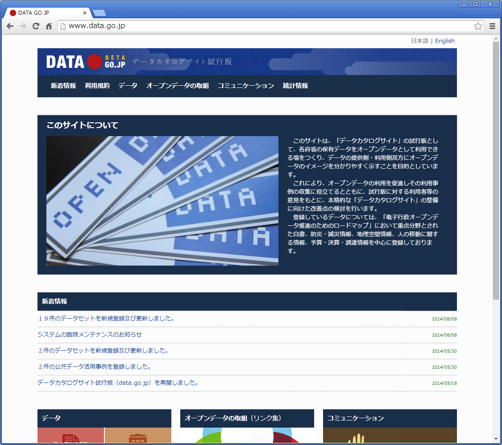

### 地方自治体の取り組み
オープンデータは、地方自治体にとっても「行政の見える化」や、「住民が暮らしやすい街づくり」などを促進するものとして期待されています。そのため、各地方自治体によるデータ公開が進んでおり、それと同時にアイデアソンやハッカソンと呼ばれるイベントを開催し、データ利活用のアイデアも募っています。

地方自治体によるオープンデータは、各地方自治体のホームページの他、日本のオープンデータのハブを目指す「Data for Japan」(http://dataforjapan.org/)という有志によるポータルサイトからも検索可能となっています。

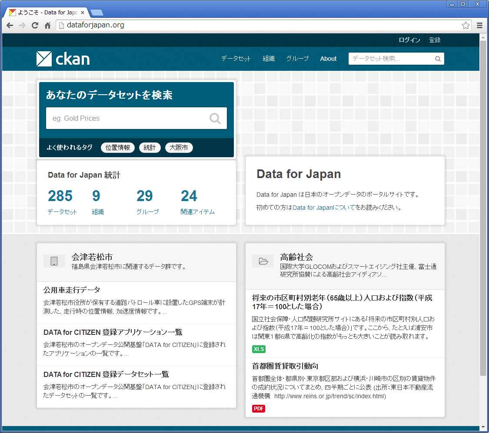

### 市民・民間での活用
オープンデータの活用は、これからの課題ですが、徐々に有益なウェブサービスやアプリなどが出始めています。例えば、公開されている市町村の会計予算のデータをもとに、自分が支払っている税金が何に使われているかを分かりやすく可視化する「税金はどこへ行った？」（http://spending.jp/）のようなホームページや、自分が住む地区で今日が何のゴミ回収日だったかが一目で分かる「5374.jp」(http://5374.jp/)などのウェブアプリがあります。

今後は、オープンデータの市民や民間での活用から、ビジネスへの広がりも期待されています。

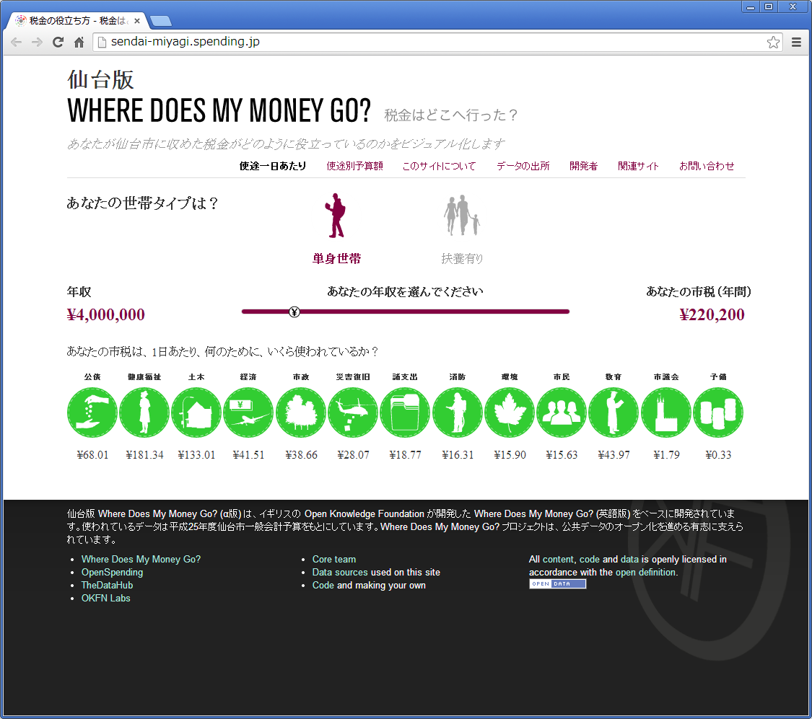

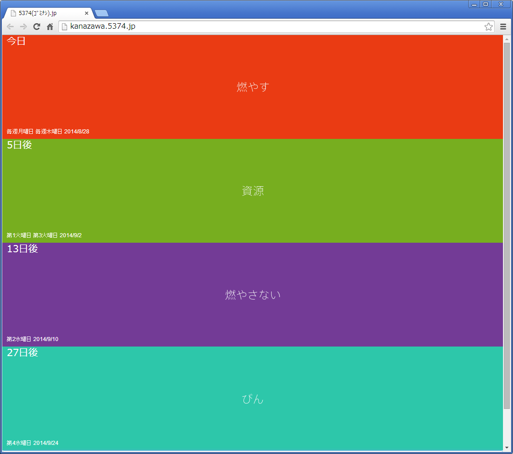

## 公共のデータだけがオープンデータ？

オープンデータは公共のデータに限らず民間主導で作成されたものも存在します。位置情報に関するもので代表的なものとしてはOpenStreetMap（http://www.openstreetmap.org）やsinsai.info（http://www.sinsai.info/）等の市民参加型活動があげられるでしょう。
また、LinkData.org（http://linkdata.org）のように、行政から公開されているデータを一次データとして、二次加工により付加価値を高めたデータを公開することを目的とする活動もあります。

このように、オープンデータは誰でも作成または参加することができますが、一方でデータの公開に際しては、他人の財産やプライバシーにかかわるものや、密漁、盗掘などに利用されるもの等を公開してしまわないように充分注意する必要があります。

<div style='page-break-after: always;'></div>

#いまなぜ注目されているのか
##測位技術の充実

###準天頂衛星「みちびき」
2010年JAXAによって準天頂衛星「みちびき」が打ち上げられ、さまざまな実験が行われています。  
準天頂衛星システムとは、アメリカのGPSを補完する形で常に日本上空に1機の日本の衛星を配置できるようにするための衛星運用形態です。GPSでは位置を割り出すために4機以上の衛星を捕捉することが必須ですが、ビルなどの影響でGPSで運用されている衛星からの信号の捕捉が難しい地域では、十分な衛星数を捕捉出来ない場合があります。常に日本の上空に1機の衛星があることによって、GPSでの位置割り出しの補完を行うことができます。  
また、準天頂衛星ではGPSの位置誤差を補正する信号を送信しますので、これまでのGPSで得られていた以上の位置精度を出すことが出来るようになり、1m単位、数cm単位の高精度な測位が可能となります。  
現在は「みちびき」1機が稼動しており、その8の字の軌道の一部が日本上空を通過しています。今後さらに複数の衛星が打ち上げられ、どれかの衛星が常に日本上空にあることになります。ただし、24時間サービスを受けられるようになるにはもうしばらく時間がかかります。

###ＩＭＥＳ（Ｉｎｄｏｏｒ Ｍｅｓｓａｇｉｎｇ Ｓｙｓｔｅｍ）
GPSは衛星からの信号受信が前提であり、上空の見渡せない屋内でGPSから位置を割り出すことは出来ません。位置情報を持った端末からGPSと同等の信号を送信することで、屋内でも位置を特定する仕組みがIMESになります。送信される情報には、位置、高さ、端末からのメッセージが含まれます。GPSと同等の信号を使用しているため、受信機側は特別な機器を必要とせず、GPSの受信機がそのまま利用出来ます。端末から送信される位置情報を、ソフトウェアで処理してあげればよいことになります。

これらの技術により屋内外での高精度な位置情報の取得が可能になります。これ以外にも、Bluetoothを用いた近距離での位置情報や情報の発信、測位の方法も実用化されています。このように高精度な位置情報が取得が出来るようになるにつれ、そこに結びついてくる情報も例えば店舗内での入店からの移動の軌跡、特定商品の前での滞在時間など多様なものになってきます。今後さらに、地理空間情報の可視化がミクロなレベルでも注目されていくことでしょう。


# GPSとは？

GPSは、現在位置を示す情報及び現在地情報を取得するための機器である、と捉えられている印象があります。ですが、本来はアメリカが運用する人工衛星のことです。Global Positioning Systemの頭文字を取ったもので、全地球測位網と訳されます。  
実は、アメリカ以外にも測位目的の衛星を所有している国があります。また、世界各国で位置情報の取得に用いるための電波の周波数帯が異なります。日本は準天頂衛星みちびき(QZSS)を既に打ち上げており、今後7機を追加する予定になっています。ただし、現在は日本が独自に所有する人工衛星の数が少ないのでアメリカのGPSを借りるような形になっております。また使用する電波に関しては、アメリカと歩調を合わせるように周波数、信号名を合わせています。

*各国の測位目的の衛星*

|衛星名|所有国|
|:-----|:-----|
|GPS|アメリカ|
|QZSS|日本|
|GLONASS|ロシア|
|Beidou|中国|
|Gallileo|EU|
|IRNSS|インド|


##オープンソース・ソフトウェアの充実
これまで地図空間情報を扱うためには、高価なGISソフトが必要で、一部の専門家や業務担当者だけが携わるものでした。しかし、ここ数年でFOSS4G（Free Open Source Softwear for Geospatial）と呼ばれる誰でも自由に利用できる地理空間のためのオープンソース・ソフトウェアが充実してきました。

オープンソース・ソフトウェア(OSS)とは、プログラムのソースコードを公開し、誰でも修正、再頒布可能なライセンスのもとで開発されているソフトウェアのことです。オープンソース・ソフトウェアは世界中の開発者が競うようにして機能の追加や修正を行っており、市販のソフトウェアと同等もしくはそれ以上の製品となっているものも少なくありません。

そのため、これらのツールを使いこなせば、誰でも地図情報を操作でき、可視化や分析ができるようになりました。

*おもなFOSS4Gツール*

|ツール|分類|URL|
|-----|-----|-----|
|QGIS|デスクトップGIS|http://www.qgis.org|
|GRASS|デスクトップGIS|http://grass.osgeo.org|
|SAGA|デスクトップGIS|http://www.saga-gis.org|
|PostGIS|データベース|http://postgis.net|
|SpatiaLite|データベース|http://www.gaia-gis.it/gaia-sins/|
|MapServer|地図配信サーバー|http://mapserver.org|
|GeoServer|地図配信サーバー|http://geoserver.org|
|OpenLayers|ブラウザクライアント|http://openlayers.org|
|Leaflet|ブラウザクライアント|http://leafletjs.com|
|GMT|地図レンダリング|http://gmt.soest.hawaii.edu/projects/gmt|
|Tilemill|地図タイル作成|https://www.mapbox.com/tilemill/|
|Orfeo Toolbox|画像処理|http://orfeo-toolbox.org/otb/|
|R(空間解析機能)|空間統計処理|http://www.r-project.org|
|GDAL|地理空間情報ライブラリ|http://www.gdal.org/|
|GEOS|地理空間情報ライブラリ|http://trac.osgeo.org/geos/|

参考：OSGeoLiveホームページ（http://live.osgeo.org/ja/overview/overview.html）


## (Column) OSGeo財団

OSGeo財団（The Open Source Geospatial Foundation、 http://www.osgeo.org/home ）は、オープンソースのGISソフトウェアの開発、普及に関する財務的、組織的、法的な支援を行っている非営利の財団です。多くのオープンソースGISソフトウェアがOSGeo財団の傘下で開発が進められており、上記のホームページにOSGeo財団が支援している各プロジェクトへのリンクがあります。また、OSGeo財団では毎年一度FOSS4G conferenceという世界カンファレンスを開催しており、各国からオープンソースGISに関わるデベロッパやユーザ等多くの人たちが参加しています。

OSGeo財団ではメーリングリストを開設しており、様々なアナウンスやディスカッションを行っています（ http://www.osgeo.org/content/faq/mailing_lists.html ）。メーリングリストにはだれでも参加することができます。

日本にはOSGeo財団日本支部（ http://www.osgeo.jp/ ）があり、日本国内における普及活動を行っています。具体的には本書でも取り上げるQGISの日本語化等の国内向けの開発や、毎年１度開催されるFOSS4G Tokyo／OsakaおよびFOSS4G Hokkaido等のイベントを開催しています。そのほか、会員が主催するイベントや講習会などの後援を行っています。

OSGeo財団日本支部でもメーリングリストを開設しており（ http://www.osgeo.jp/about/メーリングリスト/ ）、だれでも参加することができます。

## 位置情報利用への期待と課題
測位技術が発達したことで、精度の高い位置情報を持ったデータの収集がとても容易になってきています。業務用の専門的な機器はもとより、個人で扱えるハンディGPSやスマートフォンにも組み込まれているGPSもより活用されていくでしょう。これまで収集出来なかった高い位置精度を実現することができることから、業務での使用例としては店舗内での移動の軌跡といった使われ方が多くされるのは予想されます。また個人からの情報発信、報告の収集を行っているケースでは、位置精度が上がってきますので、情報の分析が重要になるかもしれません。収集されるデータは、個人情報と判断されるものは難しいでしょうが、オープンデータの流れに乗って公開されていくものも多くなるでしょう。こうして手に入れた位置情報を含むデータの可視化・分析が、個人レベルでも可能になるツールも充実してきています。  
このように、位置情報を利用するための下地は近年急速に発展してきています。それを活用して、市民による問題解決やビジネス創出につながることが期待され、アイデアソンやハッカソンといったイベントも活発に行われています。是非多くのアイデアを形にしていただきたいと思います。ただし位置情報の取り扱いにはコツを要することがあります。折角下地が整ってきたのに、最初の取っ掛かりでつまづいてしまってはもったいないです。ソフトウェアの使い方や、ライセンスへの理解を含む、データ活用のための実践指南が充実していくことも必要不可欠となるでしょう。

<div style='page-break-after: always;'></div>

#データを準備する
どのようなオープンデータを入手できるか、使用に際しての注意事項と共に見て行きましょう。

<div style='page-break-after: always;'></div>

#データを準備する
さて、実際にデータを探して可視化する準備をしましょう。  
あらかじめ、どこで、どういったデータが公開されているか知っておくことは、あなたのアイデアが実現可能なものかの判断を容易にしてくれるでしょう。またデータを見つけたとして、そのデータが使用していいものなのか、使用するためにはどういった手順が必要かを知っておくことも、重要になってきます。この章では、どこでデータが手に入るのか、使用に際して確認しておくべき事項と合わせながら見て行きましょう。

#オープンデータを使う
##オープンデータを探す

本書の目的は地理空間情報の可視化です。まずは基本となる地図のデータを探していきましょう。  
データを"探す"となると真っ先に思いつくのが、インターネットでの検索になるのはやむを得ませんよね？？試しに"地図データ"あたりで検索してみてください。地図会社から提供される様々なデータが表示されると思います。使いやすい形に加工して、独自の更新を加えて、または表現を工夫して、データが提供されています。もちろん本格的な用途や、必要となる種類のデータがそこでしか手に入らないのであれば、こういった有償で提供されているデータの使用も検討してみてください。検索結果をもう少し見てみましょう、国土地理院から提供されているデータも出てきましたか？  
馴染みの無い方もいるかもしれませんが、国土地理院はすべての測量の基本となる測量を行っている組織です。その測量成果は決められた利用手続きに従い、複製・使用することが出来ます。地図も測量成果に含まれることは覚えておきましょう。地図のデータといえば、まずは国土地理院から提供されているものを探すのが王道になります。国土地理院のデータ提供への動きはとても速く、また、利用者の利便性を考えた提供をしてくれています。　　
一例として、地理院地図(http://portal.cyberjapan.jp/)を覗いて見ましょう。とても多くの情報が提供されていることがわかります。国土地理院が提供している様々な地図や航空写真を拡大・縮小・スクロールしながら閲覧出来ますし、災害時には被災地の航空写真もいち早く公開されるようになっています。また、一部の地図については、GISへインターネット越しに表示することもできます。
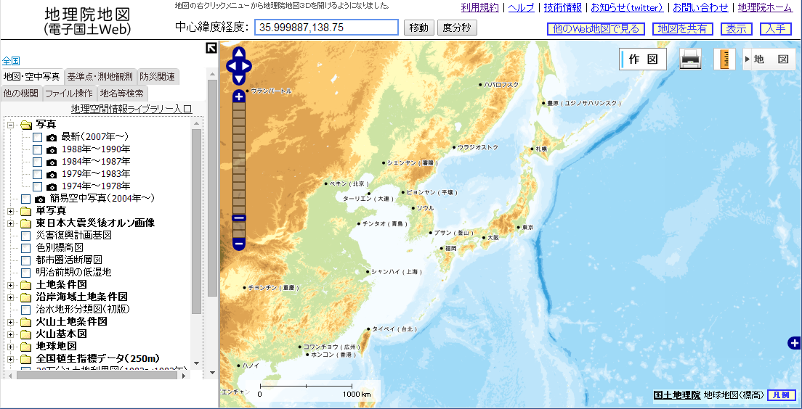

基本的な地図のデータは、国土の整備、住民へのサービスに欠かせない情報のため、国土地理院だけではなく、国や地方公共団体によって整備され、提供されています。まずは国土地理院や国の機関、必要な地域の地方公共団体のホームページを確認してみることをお勧めします。  

基本的な地図データだけでは、地図を見て楽しむだけで終わってしまいます。その上に何か情報を重ねていくことで、これまで見えなかった問題が見えてきます。重ねていく情報はどこから探しましょう？  
これについては何を表現したいかによって必要な情報が変わってくるため、一概には言えません。ただ、基本となるデータ同様に国や地方公共団体から提供されているデータが多くあることを覚えておきましょう。まずは必要な情報を扱っている監督官庁、扱っている地域の地方公共団体のホームページを見ることから始めましょう。  

もちろんオープンデータは公共団体から出ているものだけでは有りません。オープンストリートマップのように自分たちでデータを作る活動も行われています。企業のホームページでも様々なデータが公開されています。必要なデータが使いやすい形で提供されていない場合は、利用上の注意は確認しつつ、自分たちでデータを収集・加工することも考えて行きましょう。  

巻末にオープンデータを公開している機関、公開されているデータのうち代表的なものをまとめてみましたので、参考にしてみて下さい。

## カタログサイトの利用

どういったデータがどこで公開されているかを、利用者側ですべて把握しておくことは困難ではあります。公開する側としても、折角公開したデータが活用されなくては意味がありません。データ利用側・提供側双方のニーズ答えるべくカタログサイトの構築も進んでいます。　　
2014年から公開されているDATA GO.JP(http://www.data.go.jp/?lang=japanese)では、2014年08月26日現在で、10,411件のデータセットが登録されています。

DATA GO JPの場合、データの検索は組織別や、タグから行なうことが出来ます。地理空間情報に限らず様々なデータが公開されていますので、可視化やサービスのアイデアの元として一度覗いてみてください。

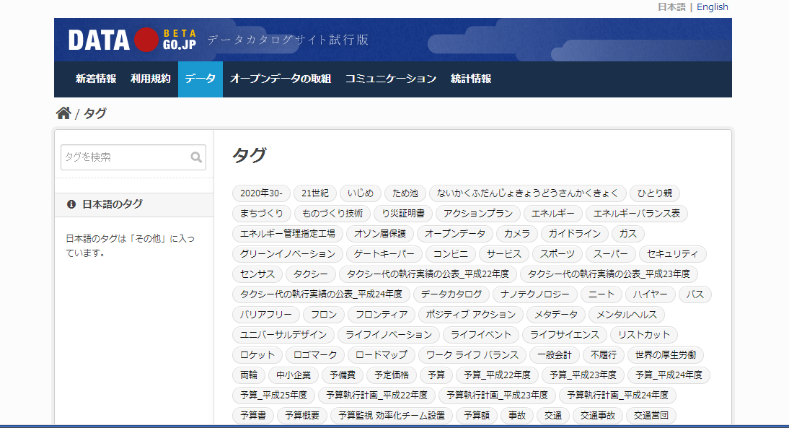

<div style='page-break-after: always;'></div>

# 代表的なフォーマット
オープンデータと言っても、公開されているフォーマットは様々です。地図や表をスキャンしただけのもの、住所をexcelに入力したもの、ShapefileなどGISで扱える形式になっているものなど、ほかにも色々と考えられます。この項では、これらのフォーマットの中から、位置情報のオープンデータとして公開されている代表的なフォーマットについて説明します。

## csv
CSVフォーマットは各フィールド(列)をカンマ「,」で区切り、各レコード(行)を改行で区切ったテキストファイルです。

地理空間情報でCSVフォーマットを使用する場合は、フィールドに、位置座標(緯度、経度など)を記録する列と、その属性を記録する列を用意します。また、一行目をフィールド名とし、二行目以降を実際のデータレコードとしておくと扱いやすくなります。

注意点としては、CSVフォーマットで扱えるのは、ポイントデータのみで、ラインやポリゴンを扱うことはできません。また、緯度、経度で位置座標を記録する場合は、十進表示に変換しておかないとGISでは読み込めない場合が多いです。

そのほか、CSVフォーマットに似た形式で、各フィールドをタブで区切った「タブ区切り」や半角スペースで区切った「スペース区切り」などもあります。これらをまとめてデリミティッドテキストと呼び、同様のものとして扱うことがあります。

*CSVフォーマットの例*

```
山名,緯度,経度,標高
槍ヶ岳,36.341944,137.6475,3180
奥穂高岳,36.289167,137.648056,3190
野口五郎岳,36.4325,137.637778,2924
```


## XML

XML（Extensible Markup Language）フォーマットは汎用的なマークアップ言語として策定されたテキストフォーマットです。タグによって文書に意味づけを行い、ツリー構造によって文書の構造化します。XMLでは任意のタグを定義することができるので、用途に応じてタグを定義することで個別の目的に対応させることができます。その汎用性から、今日ではあらゆる場面でXMLが利用されています。

GISにおいてもXMLファイルは様々な場面で利用されています。

XMLに準拠したファイルフォーマットとしては、GML（Geography Markup Language）、KML（Keyhole Markup Language）、基盤地図情報や国土数値情報で用いられているJPGIS形式などが挙げられます。


*基盤地図情報ヘッダ部分の例*

	<?xml version="1.0" encoding="Shift_JIS"?>
	<GI xsi:schemaLocation="http://fgd.gsi.go.jp/	spec/2008/FGD_DLD_Schema 	FGD_DLD_Schema3.0.xsd"
		xmlns:jps="http://www.gsi.go.jp/GIS/jpgis/standardSchemas2.1_2009-05" 
		xmlns:xsi="http://www.w3.org/2001/XMLSchema-instance" 
		xmlns:xlink="http://www.w3.org/1999/xlink"
		xmlns="http://fgd.gsi.go.jp/spec/2008/FGD_DLD_Schema"
		version="1.0"
		timeStamp="2012-09-25T10:59:29">
		<exchangeMetadata>
			<jps:datasetCitation>
				<jps:title>基盤地図情報ダウンロードデータ (JPGIS版)</jps:title>
				<jps:date>
					<jps:date>2011-12-21</jps:date>
					<jps:dateType>001</jps:dateType>
				</jps:date>
			</jps:datasetCitation>
			<jps:metadataCitation>
				<jps:title>基盤地図情報メタデータ ID=fmdid:11-5358</jps:title>
				<jps:date>
					<jps:date>2011-12-21</jps:date>
					<jps:dateType>001</jps:dateType>
				</jps:date>
			</jps:metadataCitation>
			<jps:encodingRule>
				<jps:encodingRuleCitation>
					<jps:title>JPGIS 附属書8 XMLに基づく符号化規則</jps:title>
					<jps:date>
						<jps:date>2008-03-31</jps:date>
						<jps:dateType>001</jps:dateType>
					</jps:date>
				</jps:encodingRuleCitation>
				<jps:toolName />
				<jps:toolVersion />
			</jps:encodingRule>
		</exchangeMetadata>

	・・・以下略・・・


また、XMLはメタデータの記述や設定ファイルなどの用途でも用いられています。例としてはラスタデータの統計値などを保存する.auxファイルや、本書でも取り上げるQGISのプロジェクトファイル（.qgs）およびスタイル設定ファイル（.qml）、GDALで用いられるバーチャルフォーマット（.vrt）等があります。

*.auxファイルの例*

	<PAMDataset>
		<PAMRasterBand band="1">
			<Histograms>
    			<HistItem>
					<HistMin>-32786.2505</HistMin>
					<HistMax>3751.2505</HistMax>
					<BucketCount>1000</BucketCount>
					<IncludeOutOfRange>0</IncludeOutOfRange>
					<Approximate>1</Approximate>
					<HistCounts>1096631|0|0|0|0|0|0|0|0|0|0|0|0|0|0|0|0|0|0|0|0|0|0|0|0|0|0|0|0|0|0|0|0|0|0|0|0|0|0|0|0|0|0|0|0|0|0|0|0|0|0|0|0|0|0|13704|10871|9864|9208|9077|8535|7010|7456|6808|6430|6077|6202|5989|5849|5348|5137|5046|4608|4345|3708|3776|3385|3147|2938|2711|2468|2372|2277|2064|1944|1695|1646|1492|1379|1281|1211|1087|1055|881|882|836|782|778|721|592|601|600|495|458|392|329|288|304|253|236|217|204|171|143|132|101|122|92|78|84|88|84|75|70|55|43|41|48|37|25|10|14|15|6|3|3|5|1|1|2|2|2|2|1|2|2|2|2|2|2|2|2|1|3|4|2</HistCounts>
				</HistItem>
			</Histograms>
			<Metadata>
				<MDI key="STATISTICS_MAXIMUM">3733</MDI>
				<MDI key="STATISTICS_MEAN">-26893.652698949</MDI>
				<MDI key="STATISTICS_MINIMUM">-32768</MDI>
				<MDI key="STATISTICS_STDDEV">12681.434046253</MDI>
			</Metadata>
		</PAMRasterBand>
	</PAMDataset>

## ESRI Shapefile
GISで最も使われているファイル形式がESRI Shapefileになります。Shapeファイル、Shape形式のように表記されている場合がありまが、正式な表記はShapefile(日本語だと、 シェープファイル)になります。ESRIと付けて表記しているのは、ArcGISという商用GISを展開しているESRI社が提唱したフォーマットだからです。  
Shapefileの特長は、

* ファイル名が同じで、拡張子の違ういくつかのファイルで構成されている
* 1つのShapefileには1つの図形タイプ(点、線、面のうちどれか)しか入れられない

という点になります。  
また、これまで紹介してきたcsv、xmlと違い、Shapefileの主なファイルはバイナリ形式ですので、テキストエディタで開いて少し書き換えるといったことは出来ません。Shapefileに対応したソフトウェアが必要です。  
Shapefileの代表的な構成としては4ファイルになります。

*Shapefileを構成する代表的な4ファイル*

|拡張子|役割|
|-----|-----|
|.shp|メインの図形要素ファイル| 
|.shx|図形要素へのインデックスファイル|
|.dbf|属性テーブル|
|.prj|空間参照系系定義ファイル|

ソフトウェアによっては、この他にもいくつかファイルが作られる場合がありますが、上の3つ(.shp, .shx, .dbf)があれば最低限開くことが出来ます。ファイルを開く際は、代表として".shp"拡張子のファイルを指定する場合が多いです。


## GeoJSON

GeoJSONは軽量なデータ記述言語のJSONを地理空間情報用途にしたデータの形式です。GISで使用することが出来るほか、GoolgeMapsAPIやYahooOpenLoaclPlatform,BeingMap,OpenLayers等のweb地図を公開する場合にもJSON形式のデータを使用できるようにサポートされています。また、Shapefileとは異なり、通常のテキストエディタでも編集可能です。

*ジメトリオブジェクトの記述例*

|ジメトリオブジェクト|記述方法|
|----------------|--------|
|Point|"Point" タイプでは、"coordinates" メンバーは単一の位置でなければなりません。|
|MultiPoint|"MultiPoint" タイプでは、"coordinates" メンバーは位置の配列でなければなりません。|
|LineString|"LineString" タイプでは、"coordinates" メンバーは２つ以上の位置の配列でなければなりません。|
|MultiLineString|"MultiLineString" タイプでは、"coordinates" メンバーは LineString 座標配列の配列でなければなりません。|
|Polygon|"Polygon" タイプでは、"coordinates" メンバーは LinearRing 座標配列の配列でなければなりません。 複数の環を持つ Polygons では、最初の要素は外側の環でなければならず、その他は内側か、穴でなければなりません。|
|MultiPolygon|"MultiPolygon" タイプでは、"coordinates" メンバーは Polygon 座標配列の配列でなければなりません。|

- LinearRingとは、閉じられる特別なLineStringのことです。例えば4角形を書こうとする時に4点のcoordinatesを配列で記述しても閉じることが出来ません。5番目に最初のcoordinatesと同じ座標を記述します。

サンプルとしては以下のようになります。

- Point
 
```
{
"type": "FeatureCollection",
"crs": { "type": "name", "properties": { "name": "urn:ogc:def:crs:OGC:1.3:CRS84" } },
                                                                                
"features": [
{ "type": "Feature", "properties": { "Name": "協生館", "Description": "" }, "geometry": { "type": "Point", "coordinates": [ 139.6473240852356, 35.552392317040564, 0.0 ] } }
]
}
```

- Line

```
{
"type": "FeatureCollection",
"crs": { "type": "name", "properties": { "name": "urn:ogc:def:crs:OGC:1.3:CRS84" } },
                                                                                
"features": [
{ "type": "Feature", "properties": { "Name": "矢上ルート", "Description": "" }, "geometry": { "type": "LineString", "coordinates": [ [ 139.64952886104584, 35.55438900773931, 0.0 ], [ 139.64968979358673, 35.554539575841062, 0.0 ], [ 139.64989632368088, 35.554417375664151, 0.0 ], [ 139.65011358261108, 35.554618132999288, 0.0 ], [ 139.65058296918869, 35.55504146747117, 0.0 ], [ 139.65073585472464, 35.555151664766626, 0.0 ], [ 139.65085789529849, 35.555202399176089, 0.0 ], [ 139.65090416353519, 35.555040103368491, 0.0 ], [ 139.65092360973358, 35.555010917635691, 0.0 ], [ 139.65100944042206, 35.554912721657004, 0.0 ], [ 139.65157806873322, 35.55522913049095, 0.0 ], [ 139.65184763072932, 35.555368786380448, 0.0 ], [ 139.65207092462015, 35.555488803005709, 0.0 ], [ 139.65218525377452, 35.555517170553486, 0.0 ], [ 139.65232221423469, 35.555486075365877, 0.0 ], [ 139.65237325999033, 35.555461253754494, 0.0 ], [ 139.65242564678192, 35.555435341093307, 0.0 ], [ 139.65248867858395, 35.555400427207502, 0.0 ], [ 139.65257300058443, 35.555361149039399, 0.0 ], [ 139.6526667102537, 35.555324598461524, 0.0 ], [ 139.65275371443852, 35.555300867888306, 0.0 ], [ 139.65283803637965, 35.555286411285223, 0.0 ], [ 139.65296980011396, 35.555281501398355, 0.0 ], [ 139.65307608246803, 35.555277137239358, 0.0 ], [ 139.65312503278392, 35.555273318527981, 0.0 ], [ 139.65315386652946, 35.555271681928538, 0.0 ], [ 139.65361386537552, 35.555253679399996, 0.0 ] ] } }
]
}
```

- Polygon


``` 
{
"type": "FeatureCollection",
"crs": { "type": "name", "properties": { "name": "urn:ogc:def:crs:OGC:1.3:CRS84" } },
                                                                                
"features": [
{ "type": "Feature", "properties": { "Name": "湘南藤沢キャンパス", "Description": "" }, "geometry": { "type": "Polygon", "coordinates": [ [ [ 139.42771553993225, 35.391289055217626, 0.0 ], [ 139.42506551742554, 35.392426068449467, 0.0 ], [ 139.42480802536011, 35.390659317914576, 0.0 ], [ 139.42504405975342, 35.38992461817962, 0.0 ], [ 139.42521572113037, 35.388630130933961, 0.0 ], [ 139.42480802536011, 35.387230661891905, 0.0 ], [ 139.4245719909668, 35.386058587885913, 0.0 ], [ 139.42525863647461, 35.3848515087953, 0.0 ], [ 139.42564487457275, 35.384816520726211, 0.0 ], [ 139.42581653594971, 35.38458909790721, 0.0 ], [ 139.42639589309692, 35.384746544542487, 0.0 ], [ 139.42656755447388, 35.38451912152621, 0.0 ], [ 139.42802667617798, 35.384711556427881, 0.0 ], [ 139.42802667617798, 35.386163550431483, 0.0 ], [ 139.42859530448914, 35.386434703042056, 0.0 ], [ 139.42887425422668, 35.386041094115065, 0.0 ], [ 139.42992568016052, 35.386303500279773, 0.0 ], [ 139.43036556243896, 35.386898284426202, 0.0 ], [ 139.43075180053711, 35.387772959027217, 0.0 ], [ 139.43109512329102, 35.388122826211841, 0.0 ], [ 139.43204998970032, 35.389189911751934, 0.0 ], [ 139.43133115768433, 35.389417321599495, 0.0 ], [ 139.43095564842224, 35.389338602878659, 0.0 ], [ 139.4305694103241, 35.389513533265045, 0.0 ], [ 139.42977547645569, 35.389224897924066, 0.0 ], [ 139.4281017780304, 35.389294870222784, 0.0 ], [ 139.42741513252258, 35.389539772790279, 0.0 ], [ 139.42771553993225, 35.391289055217626, 0.0 ] ] ] } }
]
}
```
- Polygon(donuts)

```
{
"type": "FeatureCollection",
"crs": { "type": "name", "properties": { "name": "urn:ogc:def:crs:OGC:1.3:CRS84" } },
                                                                                
"features": [
{ "type": "Feature", "properties": { "Name": "三田キャンパス", "Descriptio": null, "Name_2": null, "Descript_2": null }, "geometry": { "type": "Polygon", "coordinates": [ [ [ 139.74137037992477, 35.648451981648712, 0.0 ], [ 139.74132478237152, 35.649009953470291, 0.0 ], [ 139.7412496805191, 35.649836006159752, 0.0 ], [ 139.74150717258453, 35.649831647065064, 0.0 ], [ 139.74151253700256, 35.649783697007948, 0.0 ], [ 139.74299043416977, 35.649788056105237, 0.0 ], [ 139.74303603172302, 35.650278453031952, 0.0 ], [ 139.74363952875137, 35.650247939533237, 0.0 ], [ 139.74361270666122, 35.64977933791041, 0.0 ], [ 139.74424839019775, 35.649764081067175, 0.0 ], [ 139.74423497915268, 35.649628948899966, 0.0 ], [ 139.74420815706253, 35.649628948899966, 0.0 ], [ 139.74419742822647, 35.649563562285373, 0.0 ], [ 139.74422961473465, 35.649559203175826, 0.0 ], [ 139.74421888589859, 35.649474200492193, 0.0 ], [ 139.74448710680008, 35.649443686686269, 0.0 ], [ 139.74448710680008, 35.649406634191983, 0.0 ], [ 139.74421620368958, 35.649443686686269, 0.0 ], [ 139.74420011043549, 35.649243167100217, 0.0 ], [ 139.74422693252563, 35.649199575819281, 0.0 ], [ 139.74403381347656, 35.64809234930766, 0.0 ], [ 139.7428885102272, 35.648072732951583, 0.0 ], [ 139.74287778139114, 35.648103247281178, 0.0 ], [ 139.74378436803818, 35.64815337794019, 0.0 ], [ 139.74385410547256, 35.648201328975922, 0.0 ], [ 139.74388360977173, 35.648260177934944, 0.0 ], [ 139.74393993616104, 35.648739686355889, 0.0 ], [ 139.74386483430862, 35.648746225087194, 0.0 ], [ 139.74381387233734, 35.648297230960992, 0.0 ], [ 139.74367171525955, 35.648205688159543, 0.0 ], [ 139.74328011274338, 35.648186071831326, 0.0 ], [ 139.74315941333771, 35.648247100392261, 0.0 ], [ 139.74297299981117, 35.648265626910465, 0.0 ], [ 139.74271953105927, 35.648276524860322, 0.0 ], [ 139.74266320466995, 35.64818062285039, 0.0 ], [ 139.7426363825798, 35.648179533054169, 0.0 ], [ 139.7426363825798, 35.648154467736795, 0.0 ], [ 139.74261492490768, 35.648151198346987, 0.0 ], [ 139.74261492490768, 35.648122863629752, 0.0 ], [ 139.74256932735443, 35.648120684035703, 0.0 ], [ 139.7425639629364, 35.648149018753699, 0.0 ], [ 139.7421307861805, 35.648137030989631, 0.0 ], [ 139.74192425608635, 35.648243831006241, 0.0 ], [ 139.74187329411507, 35.648333194175734, 0.0 ], [ 139.74185317754745, 35.648462879573181, 0.0 ], [ 139.74169492721558, 35.64845416123373, 0.0 ], [ 139.74158227443695, 35.64834736149831, 0.0 ], [ 139.74137037992477, 35.648451981648712, 0.0 ] ], [ [ 139.74244326353073, 35.649727028721486, 0.0 ], [ 139.74243521690369, 35.649672539946607, 0.0 ], [ 139.74240571260452, 35.649676899049972, 0.0 ], [ 139.74239498376846, 35.649594076045503, 0.0 ], [ 139.74243253469467, 35.649591896491579, 0.0 ], [ 139.74242448806763, 35.64954176673529, 0.0 ], [ 139.74333643913269, 35.649474200492193, 0.0 ], [ 139.74334180355072, 35.64954176673529, 0.0 ], [ 139.74349200725555, 35.649530868957989, 0.0 ], [ 139.74348127841949, 35.649406634191983, 0.0 ], [ 139.74392384290695, 35.649376120360252, 0.0 ], [ 139.74392384290695, 35.649349965638045, 0.0 ], [ 139.74398016929626, 35.649345606516846, 0.0 ], [ 139.74398821592331, 35.649408813750938, 0.0 ], [ 139.74395871162415, 35.649406634191983, 0.0 ], [ 139.74396407604218, 35.649491636947495, 0.0 ], [ 139.74400699138641, 35.649487277834027, 0.0 ], [ 139.74401503801346, 35.649580998721156, 0.0 ], [ 139.74388629198074, 35.649585357829508, 0.0 ], [ 139.74388763308525, 35.649600614706891, 0.0 ], [ 139.74387019872665, 35.649600614706891, 0.0 ], [ 139.74387489259243, 35.649616416469648, 0.0 ], [ 139.74394395947456, 35.649607153367711, 0.0 ], [ 139.74395200610161, 35.649672539946607, 0.0 ], [ 139.74383801221848, 35.649677443937868, 0.0 ], [ 139.74382862448692, 35.649615326693016, 0.0 ], [ 139.74384270608425, 35.649615871581318, 0.0 ], [ 139.74384002387524, 35.649600614706891, 0.0 ], [ 139.74382929503918, 35.649603884037369, 0.0 ], [ 139.74382191896439, 35.649522150735102, 0.0 ], [ 139.74375888705254, 35.649525420068805, 0.0 ], [ 139.74375955760479, 35.649542856512937, 0.0 ], [ 139.74356710910797, 35.649558658287113, 0.0 ], [ 139.74357046186924, 35.649580453832598, 0.0 ], [ 139.74378168582916, 35.649563017396687, 0.0 ], [ 139.74379979074001, 35.64972212473328, 0.0 ], [ 139.7435174882412, 35.649742285571797, 0.0 ], [ 139.74349871277809, 35.649584268052443, 0.0 ], [ 139.74334985017776, 35.649592986268566, 0.0 ], [ 139.7433565557003, 35.64966273196319, 0.0 ], [ 139.74244326353073, 35.649727028721486, 0.0 ] ] ] } }
]
}
```
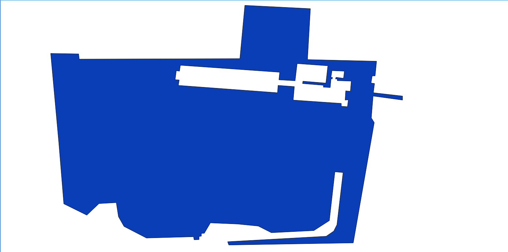


## KML
KMLは三次元の地理空間情報を管理するために開発されたフォーマットで、Google Earthが採用していることで良く知られています。Google Earthの前身となるソフト「Keyhole」用のファイルフォーマット「Keyhole Markup Language」の頭文字が名前の由来となっており、その名のとおりマークアップ言語で記述されたテキストファイルになっています。現在では、KMLは、Open Geospatial Consortium, Inc.（OGC）が維持管理する国際標準のフォーマットになっています。


KMLで記述できる内容は、目印、パス、ポリゴンのほか、スタイル、地面オーバーレイ、3次元モデル、カメラビュー、時間、ネットワークリンクなど数多くあります。ただし、現在、その多くの機能はGoogle Earthが対応するのみで、通常のGISソフトでは、基本的な目印、パス、ポリゴン部分のみの対応となっています。

*KMLの記述例（目印）*

```
<?xml version="1.0" encoding="UTF-8"?>
<kml xmlns="http://www.opengis.net/kml/2.2"> <Placemark>
 <name>青葉城</name>
 <description>伊達政宗によって築造された城。仙台城の別名。</description>
 <Point>
 <coordinates>140.856156,38.252478,0</coordinates>
 </Point>
 </Placemark> </kml>
```


## 位置情報付きの画像

ここでいう位置情報とは撮影された場所を表すものではなく、たとえば衛星画像のように地表を撮影した画像が、地上のどの位置に対応するかというものです。

一般的な画像ファイルには位置情報を記録することができませんが、GISで用いられる一部の画像フォーマットでは位置情報を記録することができます。このうち最も広く利用されているものがGeoTIFFです。その他、衛星画像の配布形式で用いられることが多いHDF（Hierarchical Data Format）や、Erdas Imagine .img（HFA）等があります。

### 位置情報の表し方

画像データの位置情報の定義の仕方は大きく分けて２種類あります。一つは画像中のあるピクセルとその対応する地上座標と画像のピクセルの地上サイズ（地上解像度）を記録する方式です。この場合、画像の上方向は北向きであることが前提となります。GeoTIFFフォーマットではModelTiepointTagとModePixelScaleTagに記録されます。以下に、それぞれのタグに記録されている値の例を示します。

*GeoTIFFタグ例*

	ModelTiepointTag (2,3):
    0                0                0
    128              47               0
	ModelPixelScaleTag (1,3):
    0.0077339　0.0077343 0.0

この例のModelTiepointTagは、画像座標(0,0,0)が地上座標(128,47,0)に対応することを表しており、ModelPixelScaeTagは、ピクセルの地上解像度がX軸方向が0.0077339、Y軸方向の解像度が0.0077343であることを表しています。Z軸方向のタイポイントとピクセルスケールも定義することはできますが、ほとんど利用されません。

もう一つは座標変換行列を利用して表す方式です。GeoTIFFフォーマットではModelTransformationTagに記録されます。この場合は回転と平行移動を表す4x4の行列で表されます。

*GeoTIFFタグ、座標変換行例の例*

	ModelTransformationTag (4,4):
	60               0                0                290775           
	0                -60              0                4103745          
	0                0                1                0                
	0                0                0                1                
	End_Of_Tags.

ModelTransformationTagに記録されている行列を各ピクセルの画像座標に適用すると地上における３次元同次座標が得られます。

### .tfw、.wldファイル

GeoTIFF等の一部のフォーマット以外では位置情報をファイル内に記録することができません。このような場合はワールドファイルと呼ばれる画像ファイルと同名のテキストファイルに位置情報を記録しておきます。

ワールドファイルはファイル名は画像ファイルと同じで、拡張子は.wldまたは.tfwとします。たとえば、hoge.jpgファイルに対するワールドファイルはhoge.wldとします。

ワールドファイルの書式は６行からなる数値で、それぞれがアフィン変換の各係数に対応しています。例として、

	9.742
	-2.252
	-2.252
	-9.742
	220449.172
	2025569.513

という値が記録されている場合、画像座標(u,v)の地上座標(X,Y)は

	X = 9.742u -2.252v + 220449.172
	Y = -2.252u - 9.742v + 2025569.513

で求められます。特に、画像の上方向が北である場合はModelTiepointTagとModelPixelScaleTagの場合とほぼ同じで、１行目がX軸方向の地上解像度、２行目と３行目は0、４行目がY軸方向の地上解像度、５行目６行目はそれぞれX軸方向とY軸方向の移動量が記録されます。また、画像座標は通常左上が原点で下方向が+と定義されているので、Y軸方向の地上解像度は通常マイナスの値が記録されます。

その他、ENVI Raster形式のように画像データをRAW形式で保存し、ヘッダファイルを別途用意して座標値や空間参照系を記録するフォーマットもあります。

### 空間参照系の記録

空間参照系の記録は、GeoTIFF形式の場合はGeoKeyDirectoryTag内にGeoKeyと呼ばれるキー定義タグと、GeoDoubleParamsTag、GeoAsciiParamsTag等のタグに値を記録します。それ以外の場合はWKTやPROJ4Stringと呼ばれる文字列等で記録すること多いようです。

GeoTIFFに記録されている空間参照系情報は以下のようになっています。以下の例は平面直角座標９系の例です。

*空間参照系情報(平面直角座標9系)の例*

	Keyed_Information:
	　　GTModelTypeGeoKey (Short,1): ModelTypeProjected
	　　GTRasterTypeGeoKey (Short,1): RasterPixelIsArea
	   GTCitationGeoKey (Ascii,40): "JGD2000 / Japan Plane Rectangular CS IX"
	　　GeogCitationGeoKey (Ascii,8): "JGD2000"
	　　GeogAngularUnitsGeoKey (Short,1): Angular_Degree
	　　ProjectedCSTypeGeoKey (Short,1): Unknown-2451
	　　ProjLinearUnitsGeoKey (Short,1): Linear_Meter
	　　End_Of_Keys.
	End_Of_Geotiff.

	PCS = 2451 (JGD2000 / Japan Plane Rectangular CS IX)
	Projection = 17809 (Japan Plane Rectangular CS zone IX)
	Projection Method: CT_TransverseMercator
	   ProjNatOriginLatGeoKey: 36.000000 ( 36d 0' 0.00"N)
	   ProjNatOriginLongGeoKey: 139.833333 (139d50' 0.00"E)
	   ProjScaleAtNatOriginGeoKey: 0.999900
	   ProjFalseEastingGeoKey: 0.000000 m
	   ProjFalseNorthingGeoKey: 0.000000 m
	GCS: 4612/JGD2000
	Datum: 6612/Japanese Geodetic Datum 2000
	Ellipsoid: 7019/GRS 1980 (6378137.00,6356752.31)
	Prime Meridian: 8901/Greenwich (0.000000/  0d 0' 0.00"E)
	Projection Linear Units: 9001/metre (1.000000m)

文字列で記録する場合は上記の情報が１つの文字列として記録されます。以下の例は平面直角座標９系の画像データをENVI Raster形式で保存したときにヘッダファイルに記録されているWKT文字列の例です。

*wktでの平面直角座標9系定義例*

	coordinate system string = {PROJCS["JGD2000_Japan_Plane_Rectangular_CS_IX",GEOGCS["GCS_JGD_2000",DATUM["D_JGD_2000",SPHEROID["GRS_1980",6378137,298.257222101]],PRIMEM["Greenwich",0],UNIT["Degree",0.017453292519943295]],PROJECTION["Transverse_Mercator"],PARAMETER["latitude_of_origin",36],PARAMETER["central_meridian",139.8333333333333],PARAMETER["scale_factor",0.9999],PARAMETER["false_easting",0],PARAMETER["false_northing",0],UNIT["Meter",1]]}


## 標高値データもしくはグリッドデータ
地形を扱う場合、等間隔のグリッドを切り各グリッドに標高値を格納したデータにして扱います。簡単な例で見て行きましょう。下記はAscii Gridというフォーマットでの例です。

*AScii Gridフォーマット例*

	ncols        5  
	nrows        5  
	xllcorner    141.2991  
	yllcorner    43.0397  
	cellsize     0.0001  
	NODATA_value  -9999  
	210 215 221 227 232  
	218 222 226 233 240  
	224 227 233 240 245  
	233 236 241 246 250  
	242 243 247 250 251  


* ncols/nrows x方向、y方向のグリッド数を定義します
* xlcorner/ylcorner 左下隅の座標を定義します
* cellsize 各グリッドのサイズを定義します
* NODATA_value 値が無いグリッドに入れておく数字を定義します
* タグで始まらない行は各グリッドの標高値で、左上のグリッドから順に値を並べていきます
  
値が小さいところを黒く、値が大きいところを白く、段階表示するように描画設定した例が下記になります。 xllcorner/yllcorner、cellsizeがどこに対応するかも書き込んでおきました。


Ascii Gridは説明に適した簡単なフォーマットですが、このように原点の座標がわかり、各グリッドのサイズがわかり、(NODATAの値を定義して、）各グリッドに実データを入れられるフォーマットであれば、同じように標高値データを格納出来ます。  各グリッドに値を入れるフォーマットというと、ずばり画像フォーマットそのものです。画像で言う各ピクセルの値に、RGB値やインデックスカラーの番号など色に関する情報を入れるのではなく、標高値をそのまま入れればいいことになります。後は位置に関する情報を画像内部のヘッダ部分もしくは外部のファイルに持たせてあげます。  
ただし、画像フォーマットによっては、入れられる値がインデックスカラーの番号(0-254)など制約があります。地理空間情報で広く使われているのは、タグに位置に関する情報を入れられ、入れられる値についても自由度の高い**GeoTIFF**になります。

また、このデータの持ち方は標高値データだけではなく、等間隔に切ったグリッドに値を持たせる場合に広く使用されています。各グリッドの持つ属性が1つの場合、ポリゴンを作成して属性を持たせたベクトルデータを作るよりも、データの容量を抑えることが出来て扱いやすいからです。

## タイル地図
オープンストリートマップや地理院地図は、「タイル地図」と呼ばれる形式で配信されています。タイル地図とは、ウェブブラウザで快適に地図を閲覧するために開発されたフォーマットで、地図画像をズームレベルごとにタイル状に分割したファイルの集まりです。

標準的なタイル地図では、「ズームレベル0」を地球の緯度85.05度以内の範囲をメルカトル投影し256✕256ピクセルの画像1枚にしたものと定義します。「ズームレベル1」は「ズームレベル0」の辺の長さを2倍にし、それを縦横それぞれ2分割した4枚のタイル画像になります。ズームレベルが1段階あがるごとに、同様の作業を繰り返すことになります。

タイル地図の各画像ファイルには、以下のようなタイルのズームレベル、X値、Y値に対応したURLにアクセスして画像を取得します。

    http://hogehoge/{z}/{x}/{y}.{拡張子}

最近では地形図や衛星写真のような一般図だけでなく、植生図や地質図のような主題図などもタイル地図で配信されるようになってきています。


## (column)オープンストリートマップ

オープンストリートマップ(OpenStreetMap:OSMと略される)は、自由に使用出来る地理情報データを作成することを目的としたプロジェクトです。誰でも自由に参加して、誰でも自由に編集でき、誰でも自由に利用する事が出来ます。しばしば地図版のwikipediaと言われています。
イギリスで始まった活動ですが、今では世界中にその活動が広まっています。

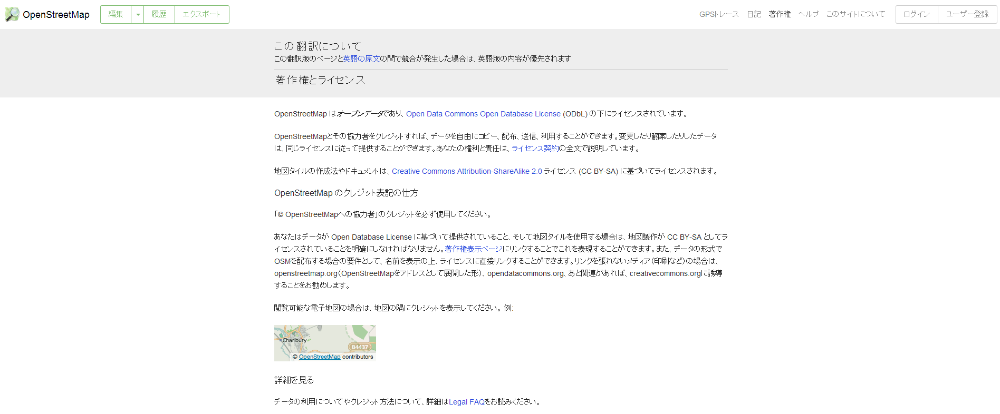

オープンストリートマップではすべての地図データへの自由なアクセスを認めており、膨大な量のデータがダウンロード可能で、利用することができます。
活動は、非営利のオープンストリートマップ財団(OSMF:イギリス)によって支えられています。日本では、オープンストリートマップ・ファウンデーション・ジャパン(OSMFJ:日本)という法人組織が立ち上がっています。イギリスのオープンストリートマップ財団と連携してOSMFの日本国内の窓口として、コミュニティーの発展と自由な地図情報の推進のため様々な活動を行っています。

- OSMF
http://wiki.osmfoundation.org/wiki/Main_Page

- OSM
http://www.openstreetmap.org/


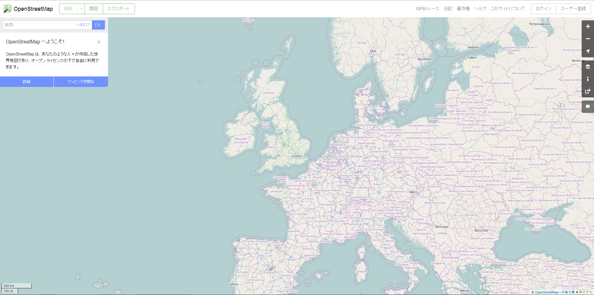

- OSMFJ
http://www.osmf.jp/home

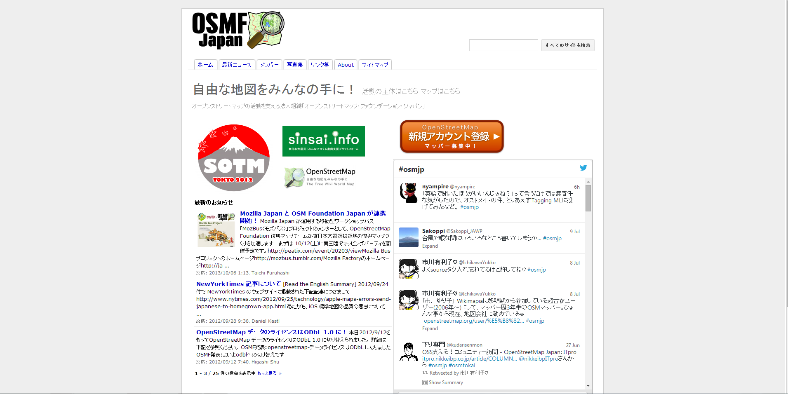

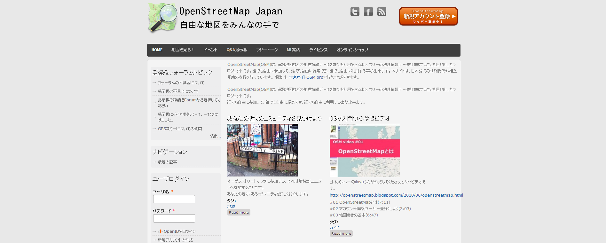


##(Column)ベクタデータとラスタデータ
位置情報のフォーマットは様々ありますが、これらのデータをGISで取り扱う際には「ベクタデータ」と「ラスタデータ」の2種類に大別されます。ベクタデータとは、地物を点(ポイント)、線(ライン)、面(ポリゴン)で表現する方法で、絵に例えるなら『鉛筆書き』です。一方、ラスタデータとは、地物をグリッド状のセルの値で表現する方法で、例えるなら『マス目の塗り絵』です。これらのデータ形式にはそれぞれ特徴があります。ベクタデータは、建物や道路などを点や線で記録する際に、その名前や説明書きを「属性表」として一緒に保存しておくことができます。また、ラスタデータは、衛星画像や標高データのように連続的な値を表現することができます。GIS上でのフォーマットとしては、ベクタデータは「ESRI Shapefile」、ラスタデータは「GeoTIFF」が良く利用されています。


<div style='page-break-after: always;'></div>

# ライセンス

オープンデータは著作物であり、したがって著作権が発生します。オープンデータの利用に際しては著作権者からの使用許諾、すなわちライセンスを遵守することが求められます。本項では公開されているデータにおけるライセンスについて説明します。著作権に関する詳細な説明は著作権法条文や専門書籍を参照してください。

## 見ておくべきところ

著作物の利用においては「利用」と「使用」が明確に分けられています。データを閲覧することは「使用」にあたり、データの使用においては著作権者の許可は必要ではありません。一方、データの複製や加工をおこなうことは「利用」に該当し、ライセンスの遵守義務が生じます。以下に、データの利用における注意点を列挙します。

 - そもそもデータの利用が許可されているかどうか

すなわち、閲覧のみが許可されていて複製などの利用は一切許可されていないという場合です。ただし、著作物の引用であれば、著作者に著作物の利用承諾を求めなくとも利用できることが著作権法で定められています。この場合は引用であることがわかるようにする必要があります。

 - 著作権者

利用許諾は著作権者に対して申請することになるため、利用申請が必要な場合にだれに許可を得ればいいかを確認する必要があります。

 - 利用条件

利用に際して課される条件のことで、最も注意すべきところです。

利用条件の例としては、著作権者の明記や、オリジナルデータの添付義務、商用利用の禁止などが挙げられます。また、複製が許可されていても、その際にデータの改変が伴ってはいけないなどの制約がある場合があります。

利用条件はデータによって様々で、たとえばGoogle Mapsでは特定の人しか閲覧することができないという状態を禁止しています。

 - どの国の著作権法が適用されるか

著作権法は国によって異なります。利用するデータがどの国の著作権法に保護されているものなのかも確認しておきましょう。たとえば、著作権の保護期間は日本では著作者の死後５０年ですが、海外では７０年の場合が多くあります。


##クリエイティブ・コモンズ・ライセンス
あなたが何か作品を作った場合、自動的に著作権が発生し作品が保護されます。他の人がその作品を利用して二次創作したいと思ったとしても、勝手に利用することは出来ません。あなたがその作品を広く利用して貰いたいと思った場合には、その意思表示をしなくてはいけません。クリエイティブ・コモンズ・ライセンスは、この意思表示を簡単にできるようにしたツールです。作品の流通を促進するための活動または組織であるクリエイティブ・コモンズによって提供されています。  

クリエイティブ・コモンズ・ライセンスでは、以下の4つの条件を組み合わせて意思表示を行います。

*クリエイティブ・コモンズ・ライセンスの4条件*

|アイコン|表す条件|
|----|--------|
||**表示** 作品のクレジットを表示すること|
||**非営利** 商用目的で利用しないこと|
||**改変禁止** 元の作品を改変しないこと|
||**継承** 同じクリエイティブ・コモンズ・ライセンスを継承すること|

**表示**は必ず入れることになっているため、これらから6種類のライセンスを作ることができます。

*クリエイティブ・コモンズ・ライセンスであらわせる6ライセンス*

|アイコン|ライセンス|
|-----|--------|
||**表示**|
||**表示-継承**|
||**表示-改変禁止**|
||**表示-非営利**|
||**表示-非営利-継承**|
||**表示-非営利-改変禁止**|

ライセンスの作成は、
　http://creativecommons.org/choose/
にアクセスして質問に答えるだけで行なうことが出来ます。


質問に答えると対応したライセンスが表示され、ホームページに組み込むためのhtmlも作成されます。ホームページ以外にライセンスを表記したい場合は、ライセンスを表す画像やライセンス条件が記載されているホームページのURLを記載します。

##パブリックドメイン

パブリックドメインをライセンスと呼ぶと語弊があるかもしれません。パブリックドメインは、著作物や発明などの知的創作物について、著作権やライセンスでの制限が付いていない状態を言います。パプリックドメインである場合、誰でも自由に利用出来ますし、2次創作を行なうことが出来ます。
パブリックドメインになるには主に3つの場合があります。

 * そもそも権利が発生しないような、創作性を欠くものといった場合
 * 法律による保護期間が切れた場合
 * 著作者によってパブリックドメインとされた場合

注意しなくてはいけないのは法律の適用される地域によって、著作権の保護期間が違うことや、そもそも著作権や著作者人格権が放棄出来ない場合もあることです。単純に判断せず、パブリックドメインとの明記がされているか、されていない場合はどの法域での権利が消滅しているかを確認する必要があります。

パブリックドメインであることを示すために、以下のようなアイコンが使用されています。


##(Column) 測量成果の複製・使用
国土地理院で公開しているデータの多く（紙地図、数値地図、空中写真、電子地形図、基盤地図情報など）は基本測量成果と呼ばれるもので、これらを複製・使用する際には、測量法の定めにより申請および承認が必要となる場合があります。基本測量成果をコピーやスキャンすることは「測量成果の複製」（測量法第29条）にあたり、また、基本測量成果を使用して新たな地図等を作成する測量行為は「測量成果の使用」（測量法第30条）にあたります。ただし、「私的な利用」や「一時的な資料として利用する」際などでは、複製や使用に該当しても申請は不要となっています。

基本測量成果を利用する際には、国土地理院のホームページを見て、申請が必要かどうかを良く確認しておきましょう。


<div style='page-break-after: always;'></div>

# 基本となる地図を準備する
身近な範囲の地図から、世界地図まで、データを載せるための地図を作ってみましょう。

<div style='page-break-after: always;'></div>

# 基本となる地図を準備する
この章では、可視化の第一歩として、ベースとなる地図の可視化を行います。地図と一言で言っても、住んでいる町内の地図から世界地図まで様々なスケールのものが含まれてきます。まず必要なこととして、それぞれのスケールに応じたデータを選択してくることがあげられます。いくつかのスケールを例にして、データの準備と、表現付けを行ってみましょう。この後の章で様々なデータを載せる際に基本となる地図を作ります。


## 身近な地域の地図を作成する
自分の住んでいる街の地図を目にする機会は多いでしょうか？町内会の地図や、子供の学校の校区の地図といった生活圏内の地図は、とても身近なところで使われている地図の例です。登下校時の危険箇所を書き込んで、防犯マップを作成している学校もあるかもしれません。商店街の商店であれば、配達圏内の地図を大きく印刷して壁に貼ってあるかもしれませんね。  
国土地理院が中心となって整備を行っている基盤地図情報から、基本項目のデータをダウンロードしてくることで、ちょうどよいスケールの地図を作成することが出来ます。基盤地図情報では従来、縮尺レベル2500、縮尺レベル25000、測量の基準点、街区の境界線及び代表点と別々にデータが提供されていました。2014年7月からは、精度の高いものを抽出して１つのファイルにまとめて提供されています。大縮尺(狭い範囲)の地図を作成する場合は、位置精度の高いデータを使用する必要がありますので、このデータを使用することにします。

   * 基盤地図情報基本項目
      * URL http://www.gsi.go.jp/kiban/
      * ライセンス 「測量成果の複製・使用」(http://www.gsi.go.jp/LAW/2930-index.html)を参照すること

ここでは、基盤地図情報基本項目のデータを元に、下図のような白黒の線要素のみの地図の作成を行います。
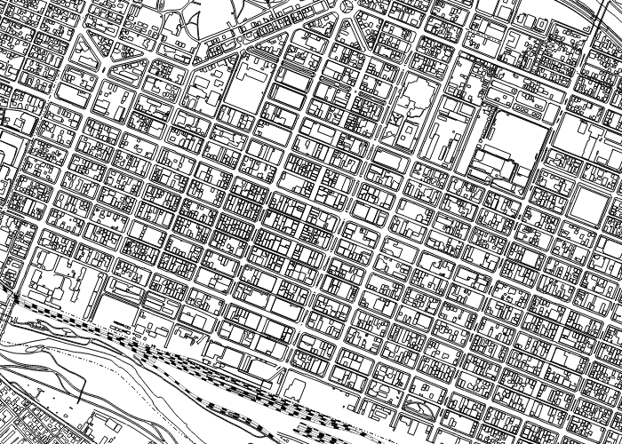
*この地図は、基盤地図情報 旭川市を使用したものである*

### 使用にあたり確認すべき項目
地図データを使用する際は、そのデータが何を基に作成されたのか、どの程度の位置精度を持っているのか、が重要になります。間違った選択をすると、縮尺に対して低い位置精度しかか持っていないために意図した位置に表示されないことや、逆にオーバースペックになりデータ量が多すぎるといった事が起きてしまいます。  
基盤地図情報については、満たすべき基準、位置精度がホームページで公開されていますのであらかじめ確認しておきましょう。(http://www.gsi.go.jp/kiban/towa.html)  

また、そもそも利用を想定している場面にそのデータの使用が許可されているか確認することが必要です。  
基盤地図情報は国土地理院が行った測量成果ですので、その複製・使用にあたっては承認が必要になる場合があります。詳しくは、 「測量成果の複製・使用」(http://www.gsi.go.jp/LAW/2930-index.html)を参照してください。  
本書中では、補助的に基盤地図情報の画像を挿入していますが、

* 「測量成果の複製の承認」
   * 刊行する場合
* 承認を得ず出所の明示により利用できる範囲
   * 刊行物等に少量の地図を挿入する場合

を確認するべきでしょう。使用することは問題にはならないでしょうが、承認を得る必要があるか、承認を得ずに出所の明示のみで利用出来るかは確認が必要となります。本書では、補助的に挿入する場合であるとして、出所の明記にとどめています。判断に迷った場合は、問い合わせを行うようにしてください。

### データをダウンロードする
基盤地図情報(http://www.gsi.go.jp/kiban/)からデータをダウンロードする場合は、ユーザ登録が必要になります。基盤地図情報のダウンロードから、ログイン画面に進んでください。
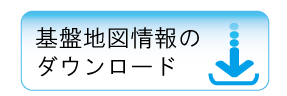

初めて使用する場合は、新規登録からユーザの作成を行います。ユーザ作成が済みましたら、ユーザID、パスワードを入力して登録済みユーザでログインします。
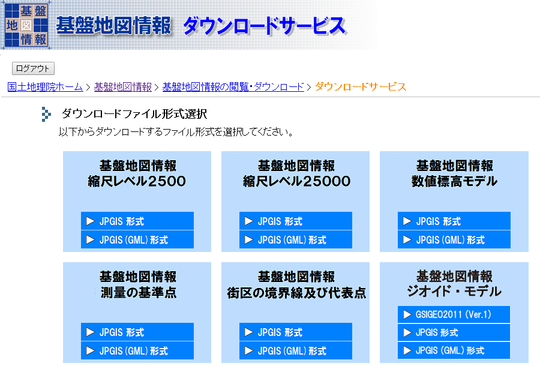

いくつかのデータ項目が選択出来ますが、ここでは、

* 基盤地図情報基本項目
* JPGIS(GML)形式

を選択してください。JPGIS(GML)形式はXMLを利用した形式です。閲覧コンバートソフトが用意されており、フォーマットを変換した上で使用することになります。
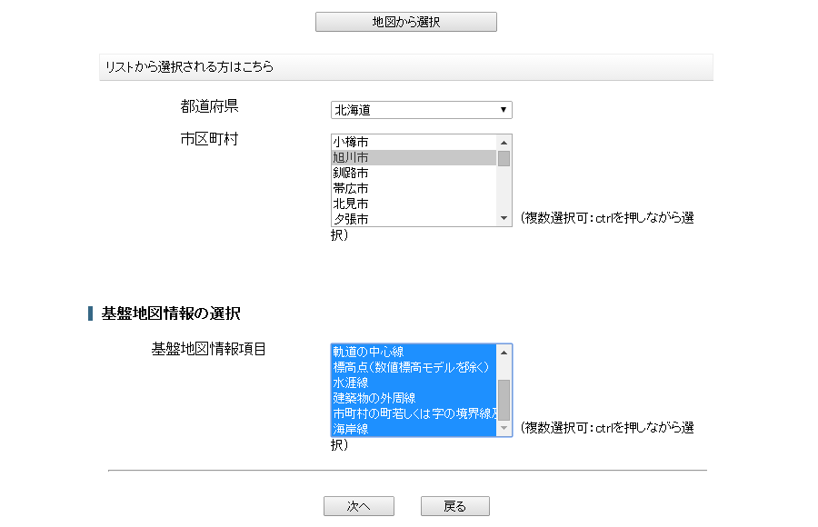

続いてダウンロードしたい市町村、ダウンロードする基盤地図情報項目の選択を行います。市区町村の選択については、地図もしくはリストから選択を行えます。下図はリストから選択した例になります。項目は作成したい地図に合わせて選択することになりますが、まずはすべて選択しておきましょう。
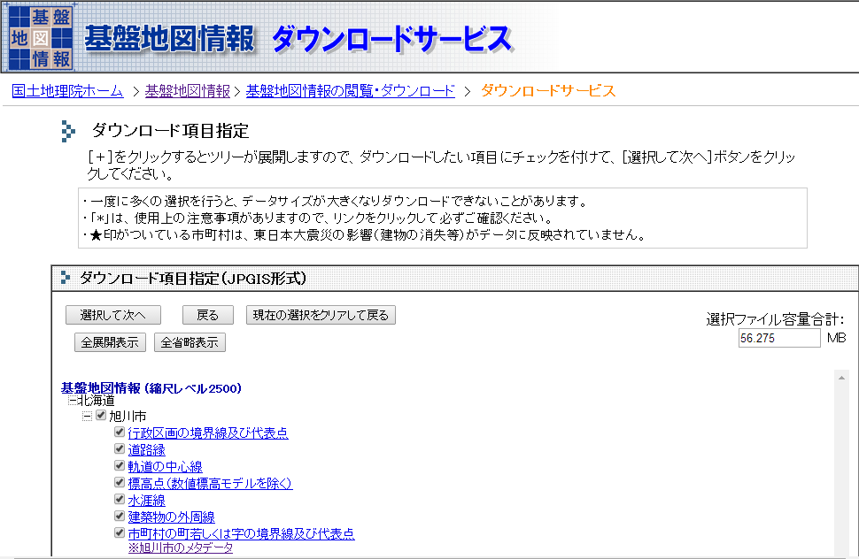

基盤地図情報基本項目は、2次メッシュという決められた経緯度間隔の単位で提供されています。2次メッシュ1面は、約10km四方となります。市区町村の一部の範囲のみ使用したい場合は、必要なファイルのみを選択することも可能です。ただし、2次メッシュ番号がどの範囲を示すかがわかっている必要があります。また、データ容量が表示されていますが、大きすぎる場合などは再度前の画面に戻って項目の調整を行ってください。特に都市部では、建物物の外周線を入れた場合にデータ容量が大きくなります。データ容量が大きい場合は、範囲を確認する意味でも、データ項目を絞ってダウンロードしてみるのがいいかもしれません。  
ファイルは、まとめてダウンロードするか、個別のダウンロードとするか選ぶことが出来ます。必ずデータ容量を確認した上で、どちらか選択をしてください。ダウンロードが正常に行われると、まとめてダウンロードした場合はPackDLMap.zipというファイル名で、個別の場合はダウンロードファイルリストに表示されていたファイル名で、ファイルがダウンロードされますので、確認してください。
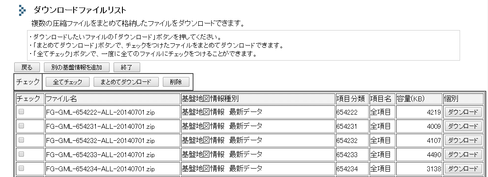

### 一般的なフォーマットへ変換する
地理空間情報の作成・編集・表示・分析を統合的に出来るQGISを使用して、基盤地図情報データに表現を付けていくことにします。ただし、ダウンロードしてきた基盤地図情報ファイルはJPGIS(GML)という形式になっており、このままではQGISで読み込むことは出来ません。地理空間情報を扱うソフトウェアで広く使用されているESRI Shapefileに変換を行います。変換には、基盤地図情報ダウンロードのサイト（http://fgd.gsi.go.jp/download/）から専用のソフトウェアが提供されていますので、ダウンロードしておきます。残念ながらWindows版しか提供されていませんので、ご注意ください。
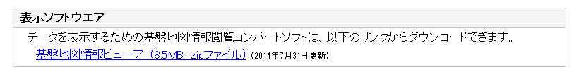

インストールは必要無く、zipファイルを解凍した中のFGDV.exeを実行すると、基盤地図情報ビューアを起動することが出来ます。起動したことを確認したら、ダウンロード済みの基盤地図情報ファイルをzipファイルのまま、基盤地図情報ビューアにドラッグ＆ドロップで持ってきましょう。あらかじめ各属性に割り振られている表現が付けられて地図が表示されます。
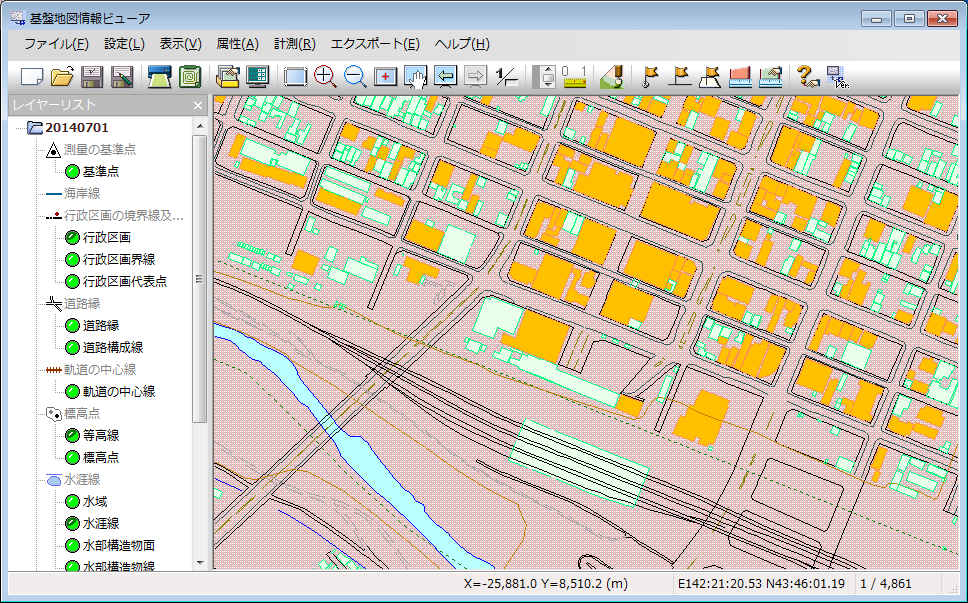

さて無事、地図も表示出来ましたし、これでいいのでは？と思ってしまうところですが、目的は様々なデータを載せる基本となる地図を用意することです。基盤地図情報ビューアは基盤地図情報で提供されるデータを表示・変換するためのものですので、他のデータを用意して重ねていくことは出来ません。この後の処理を続けましょう。  
メニューから【エクスポート】→【エクスポート】を選択してください。表示されるダイアログで、

* 変換種別は「シェープファイル」を選択
* <直角座標系に変換>のチェックを外す
* <全データ領域を出力>にチェック
* {出力先フォルダ}を選択

の指定を行い、『OK』を押して変換を開始します。
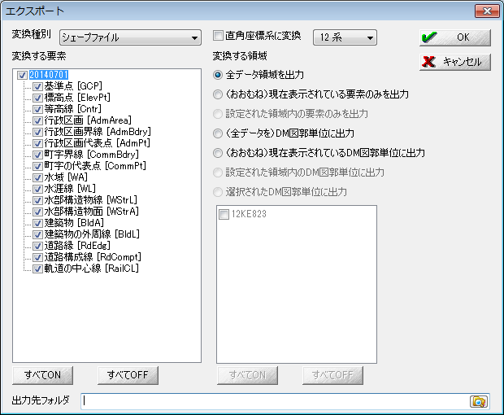

変換の際に、全データ領域を選択しましたが、データ量が大きすぎるため変換に時間がかかる場合や、必要な地図の領域が限られる場合は、ビューア上で地図の表示範囲を調整しておき、<(おおむね)現在表示されている要素のみを出力>を選択しましょう。直角座標系に変換のチェックを外していますが、この場合出力されるファイルは経緯度で座標を持ちます。直角座標系はやや専門的なので、経緯度にしておきました。この方が多くの方にとっては使用しやすく、表示位置の判断もしやすいと思います。  
変換が終了すると、各要素が正常に変換されどこに保存されたかのメッセージが表示されますので、確認は必ず行ってください。

### 変換後のファイルを開く
出力先に指定したフォルダを開いてみましょう。"軌道の中心""建築物"といった要素毎に、.dbf .shp .shx .prjの4つの拡張子のファイルが作成されています。ESRI Shapefileでは、拡張子の違ういくつかのファイルで1つの組になります。
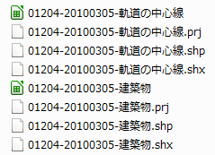

QGISを起動しておき、

* 町字界線
* 水涯線
* 行政区画界線
* 建築物の外周線
* 軌道の中心線
* 道路構成線
* 道路縁

要素の各.shpファイルをドラッグ＆ドロップでQGISに持ってきて開きましょう。各ESRI Shapefileは、点、線、面の図形種別のうちどれか1つの図形種別を持つことが出来ます。ここで選択したファイルは線を持つファイルになります。  
QGISに、各要素(各ESRI Shapefile)が1レイヤとなって表示されます。この状態では、QGISで各レイヤ毎に割り振った表現が付けられています。ランダムに割り振られたシンプルな表現ですので、開く度に別な表現になります。
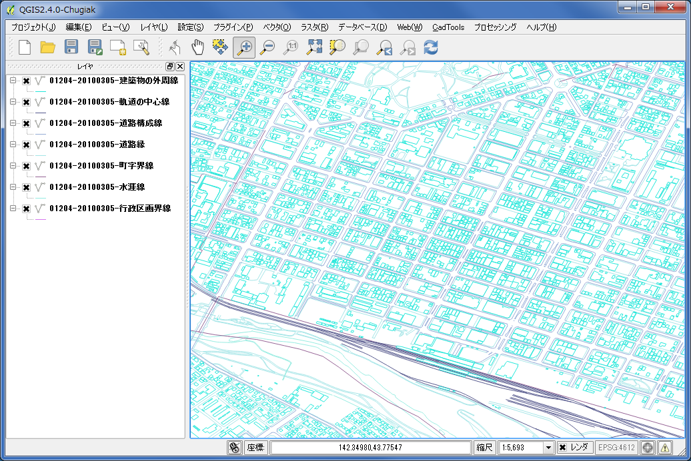

### レイヤ毎にスタイルを設定する
各線要素の色を黒(RGB：0,0,0)に変更してみましょう。後で違うデータを重ねるとして、ベースとなる地図の色が黒では濃すぎると感じる場合は、もう少し薄く(RGB:180,180,180程度)しておいてもいいかもしれません。  
色を変更するには、対象のレイヤを選択して右クリック後に表示されるメニューから【プロパティ】を選択します。
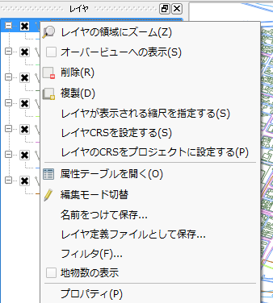

[スタイル]タブを選択してください。現在の設定として、レイヤ中のすべての線に対して同じ表現が付いている「共通シンボル」であること、表現として「シンプルライン」が設定されていること、色はどの色が割り当てられているか、などを確認することが出来ます。  
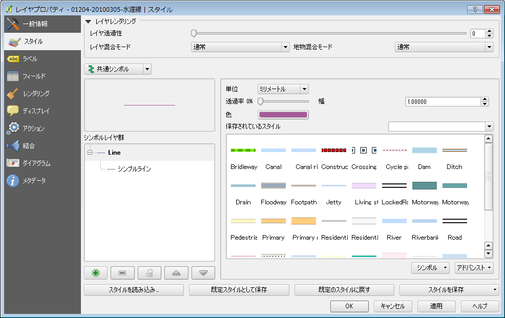

まずはすべてのレイヤについて色を変更していきましょう。[スタイル]タブを選択しておき、「色」がサンプル表示されているボックスをクリックすると、色選択のダイアログが表示されます。ここで、

* 赤(R) : 0
* 緑(G) : 0
* 青(B) : 0

を入力して色を黒に変更します。もちろん好きな色を入力してもらっても構いません。入力が終わったら『OK』を押し[スタイル]タブへ戻り、『適用』を押します。地図面へ色が反映されますので、確認してみてください。
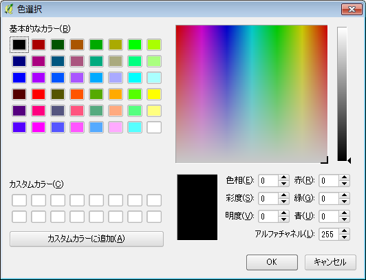

反映を確認して、他のレイヤも順に色を変更してください。  
ここまででも立派に地図らしく見えると思いますが、すべての線が一様な表現となっているため少々わかりにくいです。もう少しだけ味付けしてみましょう。
まずは、町字界線と行政区画界線に表現を付けます。正式な地図の図式とはいきませんが、表現を直線ではなく鎖線に変更してみましょう。対象とするレイヤのプロパティから[スタイル]タブを開いてください。Lineに続いたツリー構造から「シンプルライン」を選択します。そうすると、ペンのスタイルの選択肢が表示されます。ここから、「一点鎖線」もしくは「二点鎖線」を選択してみましょう。スタイルを『適用』すると地図面で表現を確認することができます。
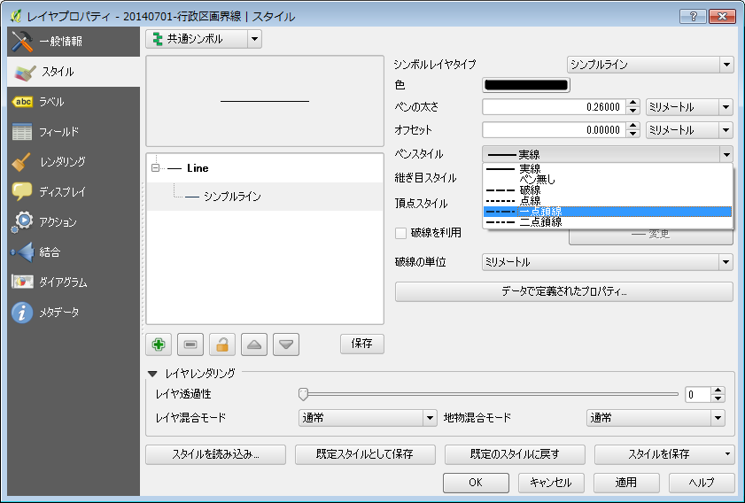

次に、軌道の中心線に"旗竿"とよばれる表現を付けます。同じく、対象とするレイヤのプロパティから[スタイル]タブを開いてください。Line以下のツリーに、「シンプルライン」をもう１つ追加して、2つにしておきます。下の「＋」ボタンから追加できます。
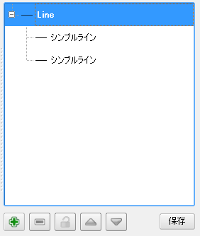

シンプルラインを追加したら、片方のシンプルラインの色を白にして、<破線を利用>にチェックを入れます。もう一方のシンプルラインは色を黒にしておきます。ここでのポイントは、黒にしたラインのペンの太さを太く、白にしたラインのペンの太さを細くしておくことです。こうすることで、黒のラインの中に、白の破線が描画されて、旗竿表現が出来上がります。ペンの太さは調整しながら試してみてください。
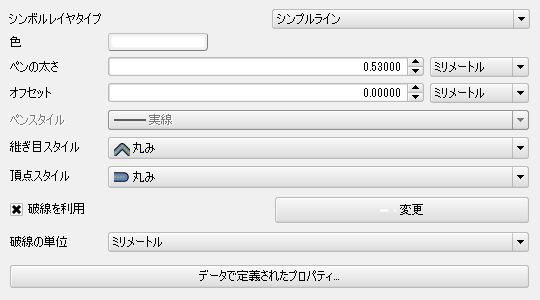
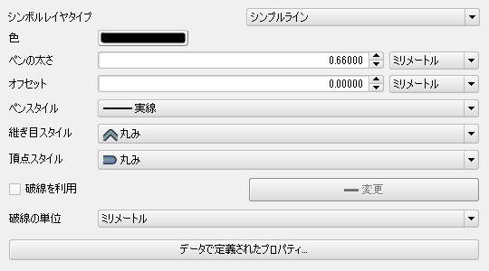

できあがると、このような表現になります。より地図らしくなったでしょうか？
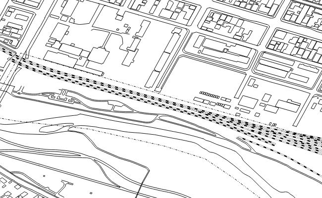
*この地図は、基盤地図情報 旭川市を使用したものである*

### 保存しておく
せっかく作った表現は保存することをお忘れなく。QGISでは"プロジェクト"に、使用したデータへのパス、設定した表現等を含めて、現在の状態の保存を行います。メニューから【プロジェクト】→【保存】もしくは【名前を付けて保存】を選択します。  
データ自体はプロジェクト内に保存されないことに注意してください。QGISメニューの【プロジェクト】→【プロジェクトのプロパティ】→[一般情報]タブを開いてみましょう。「保存パス」として、「相対パス」もしくは「絶対パス」が選択されています。実データ(この例では各ESRI Shapefile)へのパスをプロジェクト内に相対パスで保存するか、絶対パスで保存するかの選択を行えます。いずれにしても、実データを違うディレクトリへ動かしてしまうとプロジェクトを開いてもデータが表示されなくなりますので、お気をつけ下さい。
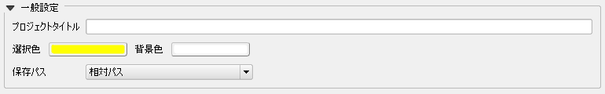

<div style='page-break-after: always;'></div>

## 世界地図を作成する

ここまでは比較的大縮尺の地図データを取り扱う例について説明してきました。本章ではより小縮尺地図の例として世界地図の取り扱いについて説明します。

全世界を網羅するオープンデータはいくつかありますが、本章ではNatural Earth( http://www.naturalearthdata.com/ )を用いた例を示します。その他公開されているデータについてはAppendix Ⅱ:データカタログを参照してください。

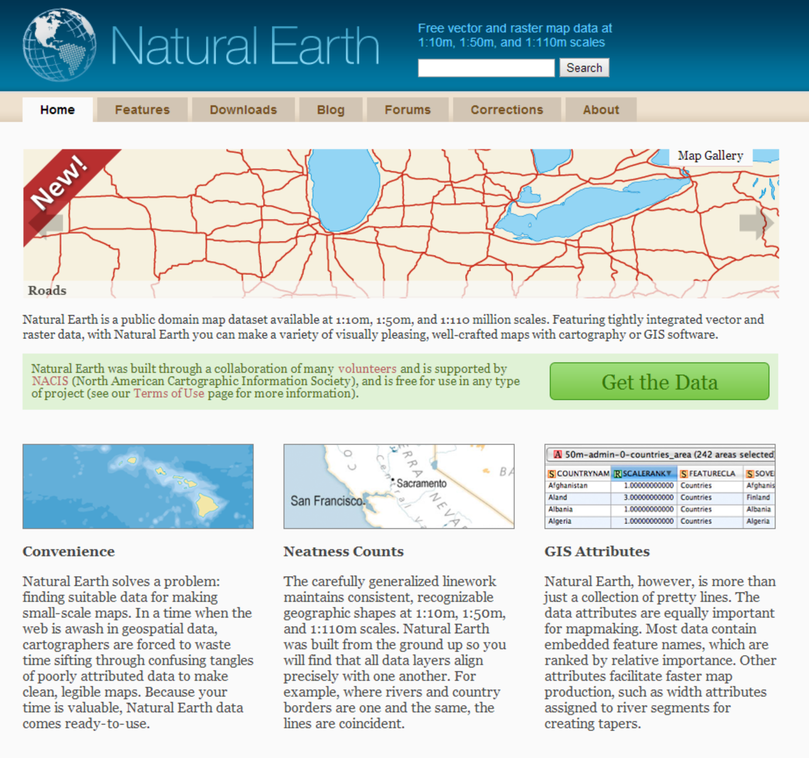

###  データをダウンロードする

まず、Natural Earthで公開されているデータの種類を見てみましょう。〔Features〕タブをクリックするとデータについての説明が記述されているページが表示されます。

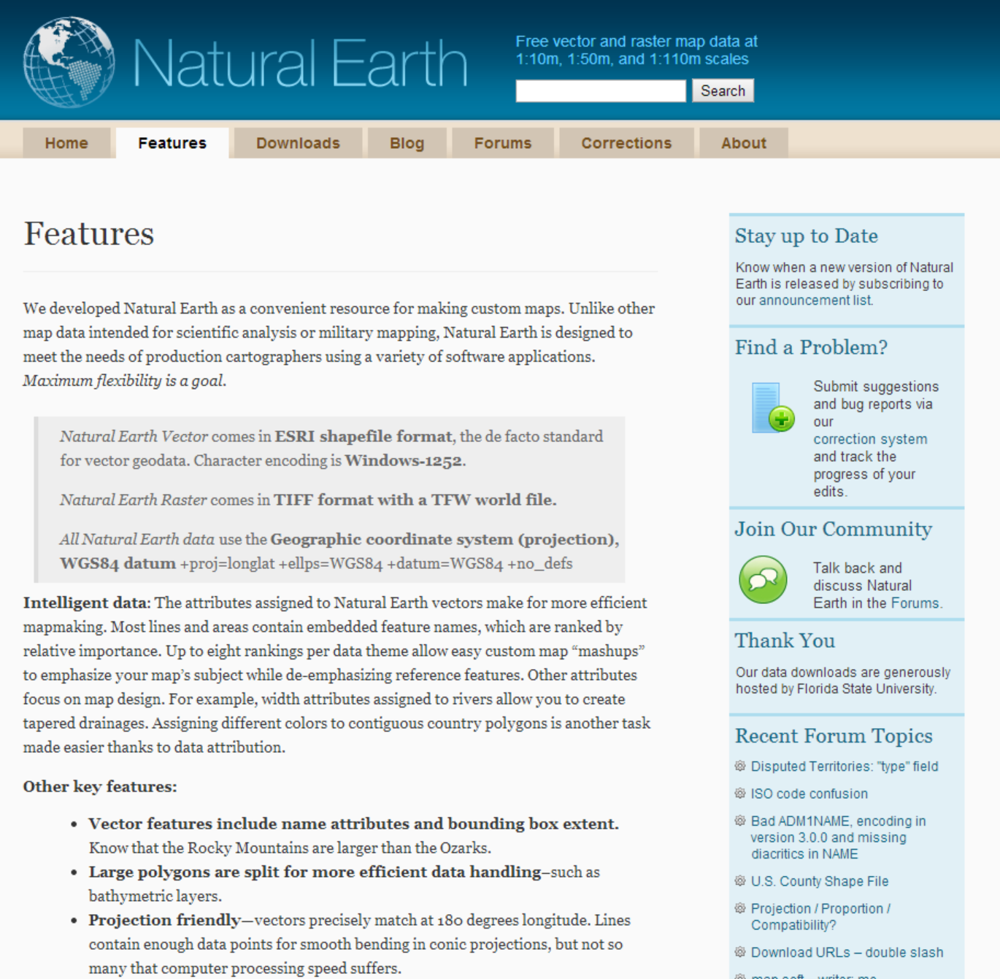

詳細についてはNaturalEarthのサイトを参照してください。概要はおおよそ以下の通りです。

 * ベクタデータのフォーマットはESRI Shapefile、ラスタデータのフォーマットはTIFF+TFW。
 * 座標系はすべてWGS84地理座標系
 * ライセンスはパブリックドメイン
 * 縮尺は、大縮尺（1:10,000,000）、中縮尺（1:50,000,000）、小縮尺（1:110,000,000）がある。
 * データの内容別に、道路、都市、国境等を収録したCultural Data、地形、水涯線、島嶼などを収録したPhysical Data、およびラスタデータが用意されている（ただしラスタデータは大縮尺と中縮尺のみ）。
 
その他、個別のデータについていくつか種類が分かれている場合があります。たとえばAdmin 0データでは国の分け方についていくつかのデータが用意されています。
データのダウンロードページは〔Downloads〕タブをクリックすると表示されます。

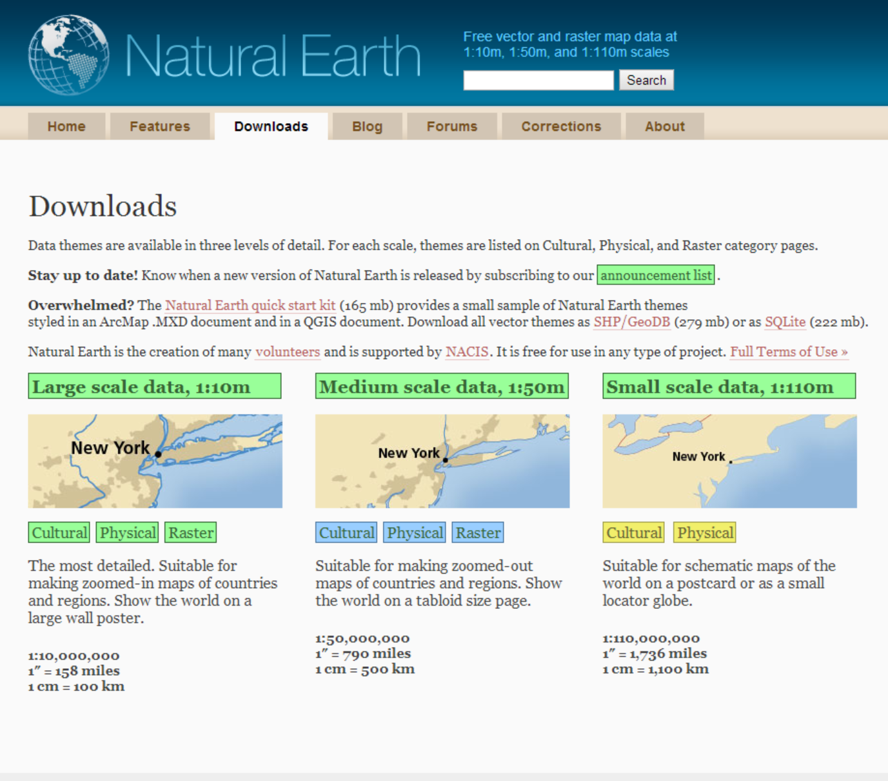

ダウンロードページのトップには縮尺別、カテゴリ別にデータへのリンクがあり、それぞれのリンクをクリックすると個別のデータのダウンロードページが表示されます。下図はAdmin 0データのページです。

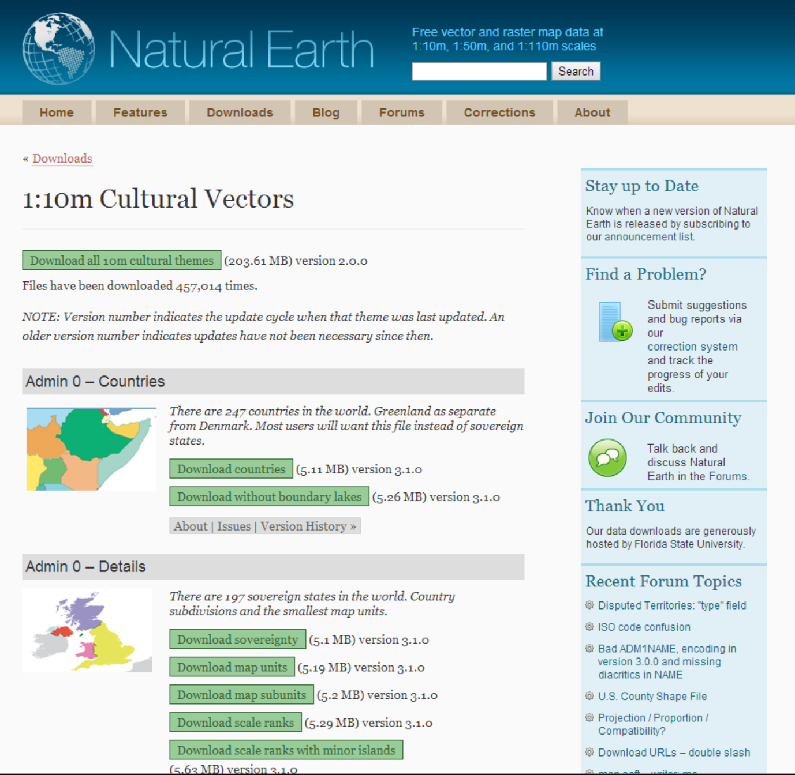

各データにダウンロードリンクとデータの説明へのリンクがあるので、よく読んでおきましょう。

### ファイルを開く

ダウンロードされるファイルはラスタデータ、ベクタデータともにZIP圧縮形式です。QGISで読み込む前に展開しておく必要があります。

Natural Earthで提供されているデータは多岐にわたります。これらをすべて読み込んで表示させると煩雑な地図になってしまうので、目的によって表示させるデータを絞り込んだほうが結果として見やすい地図ができるでしょう。
本章ではラスタデータの「Natural Earth I with Shaded Relief and Water」を背景図とし、Cultural Vectorデータの「Admin 0 – Details」、「Populated Places」、「Roads」、「Urban Areas」、さらにPhysical Vectorデータの「Rivers + lake centerlines」、「Physical Labels」を使用して地図帳風に表示してみます。

### レイヤ毎にスタイルを設定

まず、表示の優先順位を決定します。すなわち、優先順位が低いレイヤが優先順位を高く設定したレイヤの表示を邪魔しないようにする必要があります。ここではなるべく自然地物を優先するものとします。今回のレイヤの順は最前面から以下の通りとしました。

1. Physical Labels
2. Rivers + lake centerlines
3. Roads
4. Urban Areas
5. Admin 0 – Details
6. Natural Earth I with Shaded Relief and Water

続いて個別のレイヤスタイルを説明します。背景のラスタレイヤについては特に設定は行いません。

１．Admin 0

このレイヤはポリゴンなので、まず塗りつぶしを無しにして枠線のみの表示にします。枠線は黒のソリッドラインでやや太めの0.26mmとします。

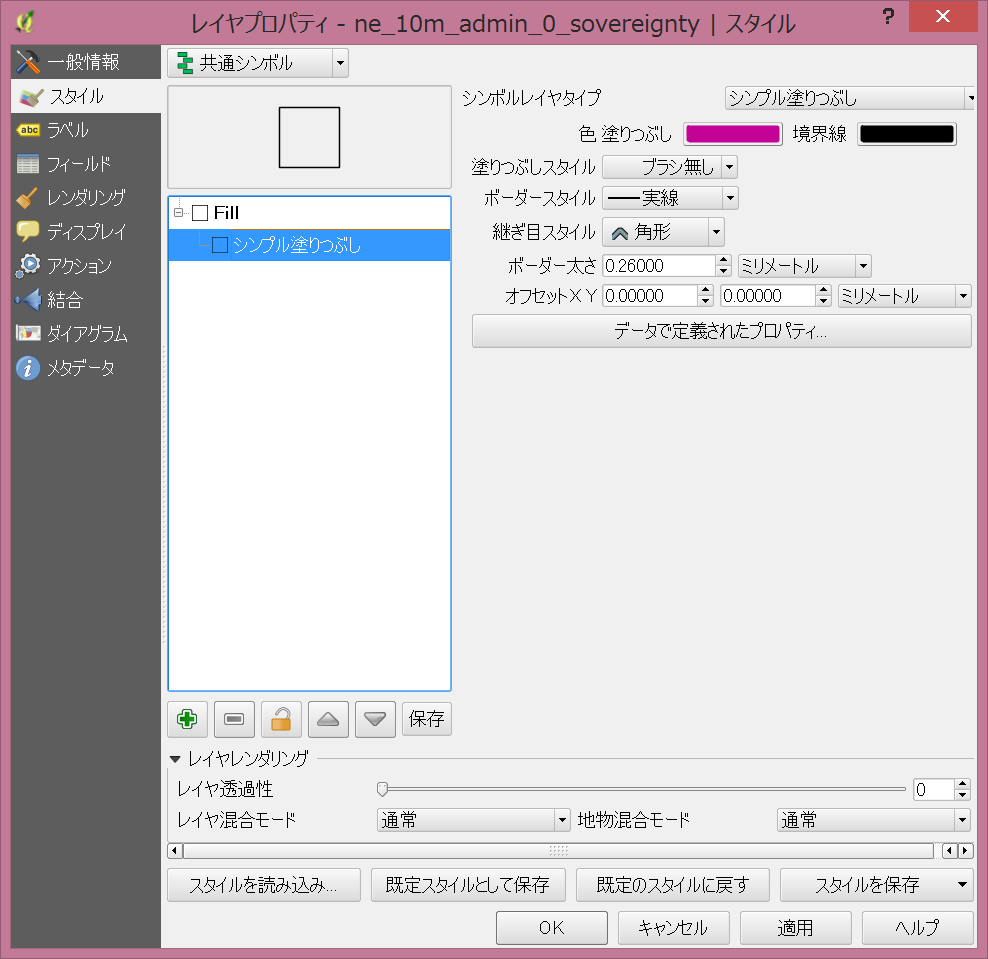

さらに国名ラベルを表示します。ラベルフォントはやや大きめの12ptとしています。また、背景のラスタレイヤに紛れて見えにくくなるのを防止するためにバッファを発生させます。バッファはフォントサイズに合わせて幅を設定するとより見やすくなります。ここでは0.5mmとしています。

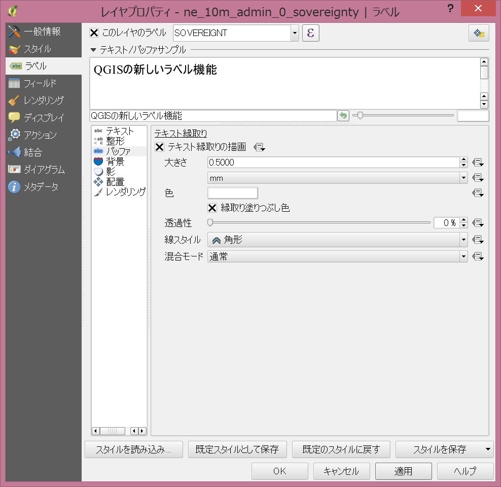

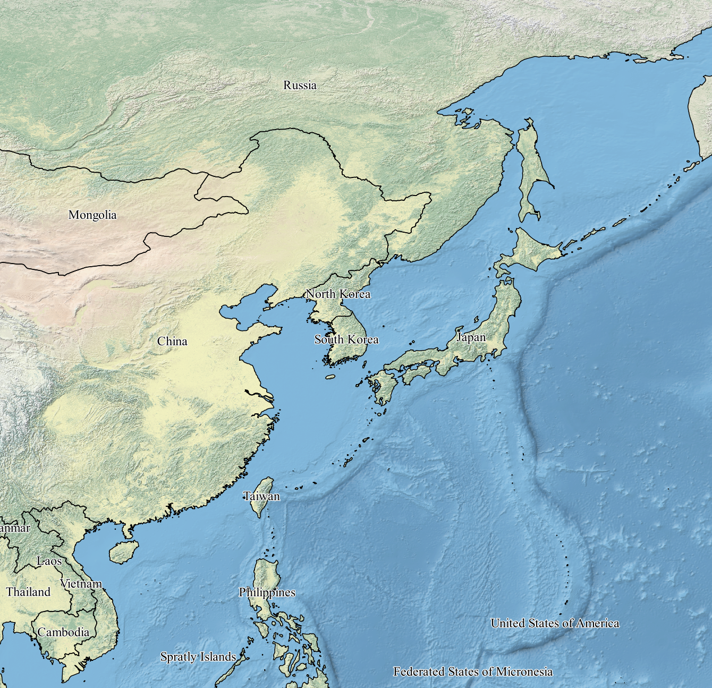

２．Urban Areas

このレイヤは都市域のポリゴンです。このレイヤをオーバーレイして都市域をハイライトしてみます。枠線を無し、色を赤の塗りつぶしに設定し、透過率を50%として背景ラスタを完全に塗りつぶさないようにします。

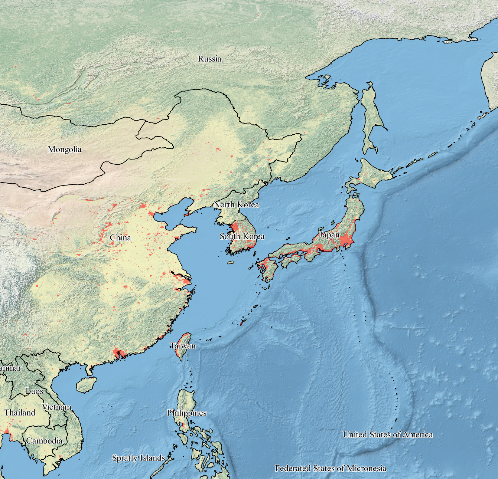

３．Roads

このレイヤは主要道路のラインデータです。要素の数が多いので、このまま使用すると煩雑になってしまいます。ここではtype属性が"Major Highway"の要素のみを表示するように設定します。図のようにスタイル設定で”ルールに基づいた”を選択し、ルールにtype = 'Major Highway'と入力します。属性値はシングルクォーテーションで囲むところに注意してください。

スタイルは0.3mmの黄色の線の上に0.2mmの赤い線を重ねた複線としています。ラベルにバッファを発生させるのと同様に単色の線よりも細くて目立ちやすい効果があります。

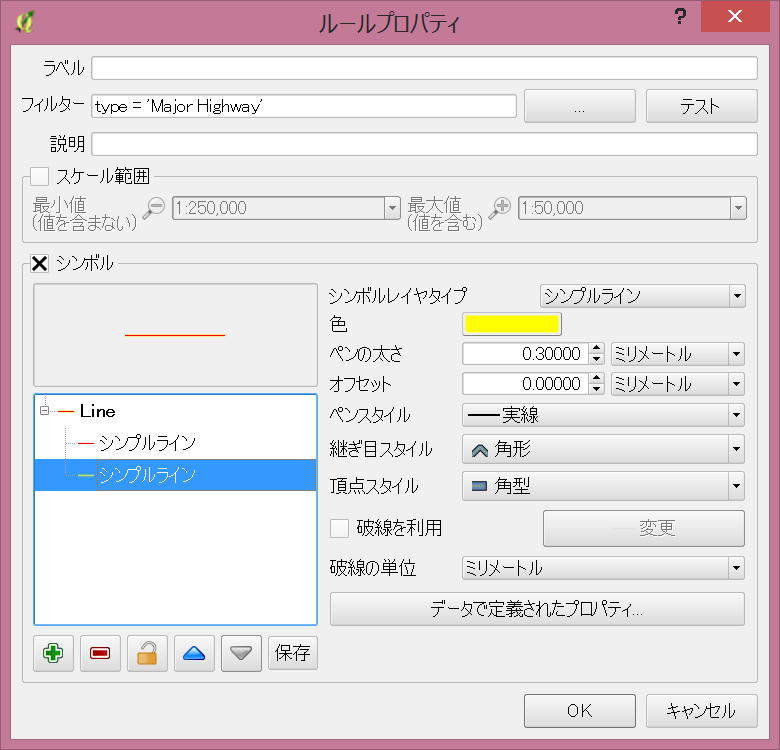

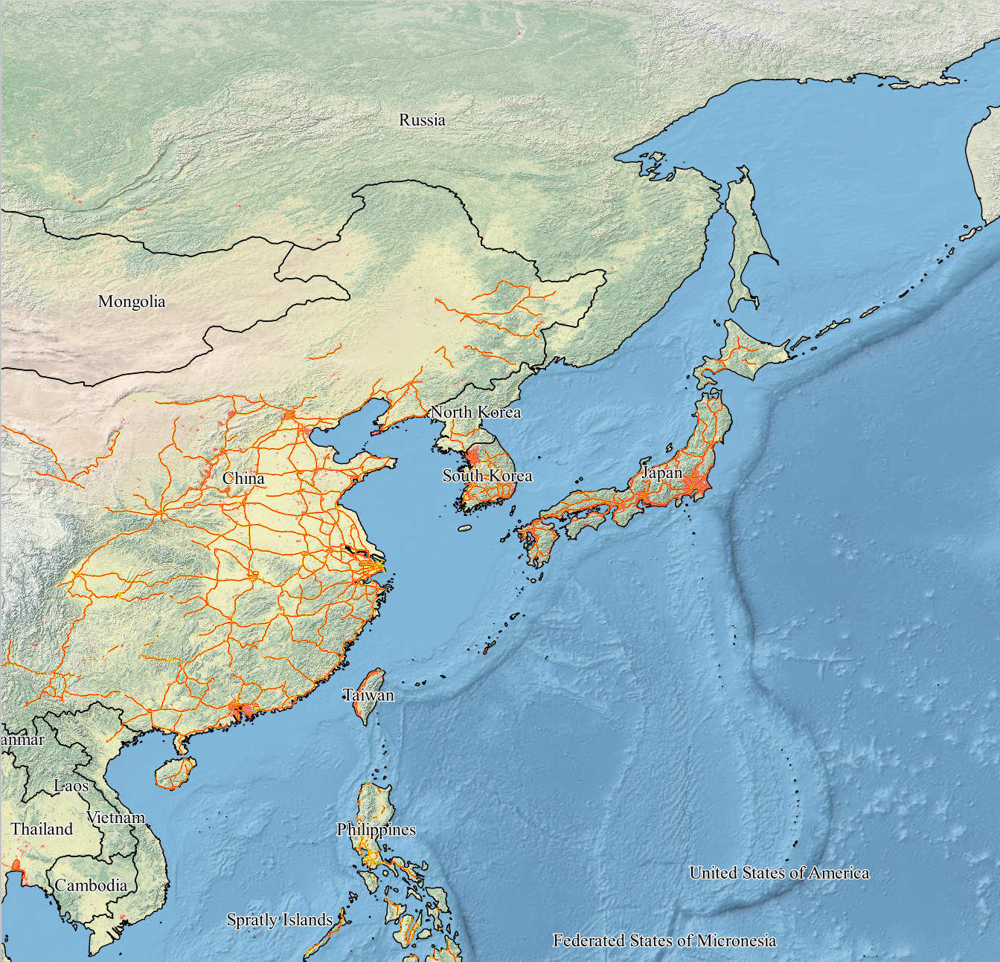

４．Rivers + lake centerlines

このレイヤは河川と湖沼中心線のラインデータです。レイヤのスタイルは青色のソリッドラインとしています。また、河川名称のラベルを表示します。ラベルのフォントは小さめの6ptでイタリック体を使用します。本章では自然地物をイタリック体とするように決めて、人口地物と区別するようにしてみました。また、国名ラベルと同様に0.3mmの白色バッファを発生させています。
河川のような曲線データではラベルは要素に沿って表示すると効果的です。このように配置するには、ラベルの配置で〈曲がって〉を選択し、「曲がった文字の最大角度」を内側、外側ともに30°に設定しました。最大角度は大きくすると要素に沿いやすくなりますが、その分読みづらくなってしまうので、設定値を試行錯誤しながら最適な角度を設定する必要があるでしょう。

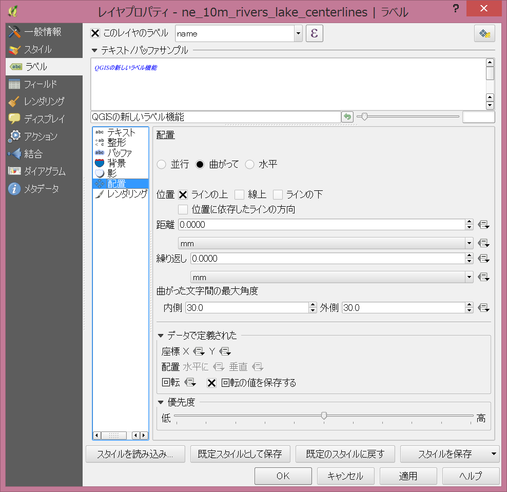

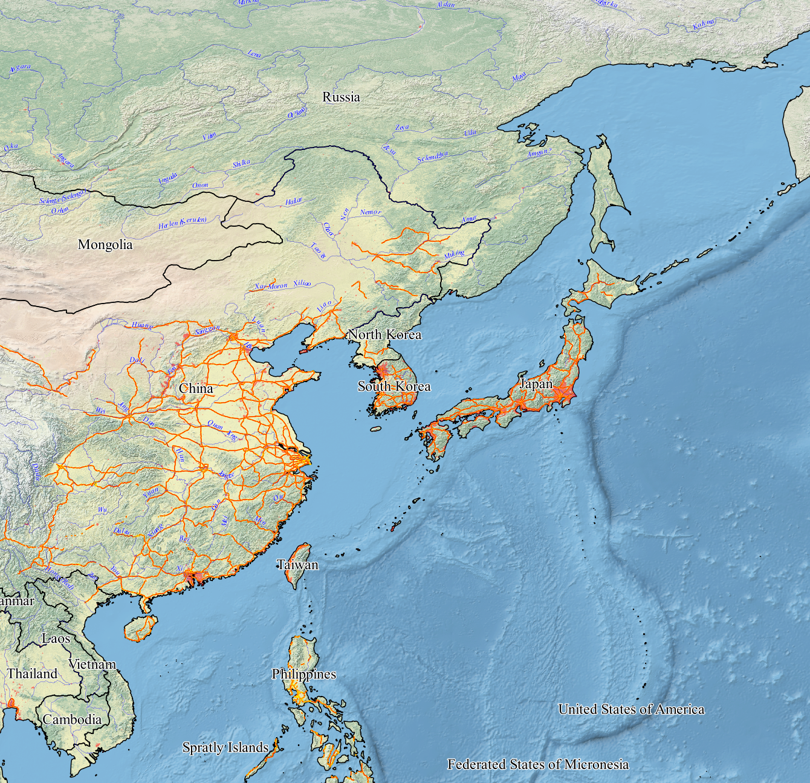

５．Physical Labels

このレイヤは島嶼や山脈など自然地形のラベルデータですが、ラベルに対応する地形のポリゴンデータとして配布されています。ポリゴンは表示する必要がないので枠線、塗りつぶしともに無しに設定します。ラベルは河川と同様に地形に沿ったものにしたいところですが、レイヤがポリゴンなのでラインに沿った形にすることができません。ここでは〈フリー（ゆっくり）〉を選択することでポリゴンの形状に合ったラベルの方向に設定することができます。


ラベルの色は灰色とし、ほかのレイヤのラベルと同様にバッファを発生させています。


最後に投影法を設定します。ここでは比較的広域を表示するのに向いている円錐図法を用いてみましょう。

QGISに登録されている円錐図法はいくつかありますが、特定の地域を中心としたい場合にはパラメータを変更する必要があります。ここでは日本を中心とした円錐図法を新しく定義します。

まず、【設定】メニューから【カスタムCRS】を選択します。


表示されるダイアログから『既存のCRSを複製』ボタンを押します。


ボタンを押すとCRS選択ダイアログが表示されます。｛フィルター｝の欄に「conic」と入力すると、候補が表示されます。ここでは"Asia North Albers Equal Area Conic"を選択します。


選択するとパラメータの欄に選択したCRSのproj4文字列がインポートされます。ここで日本付近を比較的歪みが少なくなるように表示させるために、以下のようにパラメータを編集します。

	+proj=aea +lat_1=25 +lat_2=60 +lat_0=36 +lon_0=139 +x_0=0 +y_0=0 +datum=WGS84 +units=m +no_defs

パラメータの設定が完了したら、適当な名称を付けて『OK』ボタンを押します。あとはマップキャンバスのオンザフライ変換を有効にして先ほど作成した投影法を選択します。


本章で行ったように複雑なレイヤスタイルを複数組み合わせた状態でオンザフライ変換を有効にするとしばしばレンダリングに失敗してしまうことがあります。このような場合はいくつかレイヤを重ねた途中の段階で、地図を画像としてエクスポートするなどして対処する必要があります。
画像としてエクスポートする際は、GeorefExportプラグインを利用すると便利です。

ここに挙げた例はほんの一例です。みなさんの好みや目的に合ったレイヤスタイルや投影法を設定して、最適な地図表現を目指しましょう。


<div style='page-break-after: always;'></div>

## 公開されている地図を使用する

オープンデータを使用して、目的に合わせて自分でスタイルを設定した地図を作成することができます。ただし、この方法の場合、自由度は高いのですが、

* どのデータを取得してくるか
* どういったスタイルを設定するか

といった表現作りのコツは必要になってきます。もう少し手軽な方法として、すでにスタイルが付けられて画像となってるデータを、ベースの地図として設定する方法があります。特にタイル地図(コラム参照)の形で公開されているデータは、地図の拡大率に合わせて用意済みの画像を取得することができ便利です。

* オープンストリートマップ
* 地理院地図 

を例にしながら、設定の方法と、どのような種類の地図が用意されているかを見て行きましょう。

### オープンストリートマップを使用する

QGISの追記機能として、OpenLayers Pluginがあります。この機能を使うと、QGISにオープンストリートマップ、GoogleMaps、BeingMaps、YahooMaps、AppleMapsといったWebで公開されている地図を表示することができます。
この機能を利用してオープンストリートマップを表示させます。巻末のappendix1を参考にして、【プラグイン(P)】→【プラグインの管理とインストール】をクリックし、OpenLayers Pluginが入っていることを確認してください。無い場合は追加してください。

.

追加後に、【Web(W)】をクリックします。

.

図のように、OpenLayers Pluginを使用することが可能になります。
【Web(W)】→【OpenLayersPlugin】→【OpenStreetMap】上にカーソルを置きます。これで「リストアイテム」として表示された、オープンストリートマップ及び編集を加えたオープンストリートマップが選択できます。
以下の図[オープンストリートマップ]のようになります。

.

【OpenCycleMap】を選択してクリックしてください。オープンストリートマップは有志が編集していますが、特に、OpenCycleMapはその中でも特に自転車が好きな人たちの手で編集しているものになります。そのため、世界全体をカバーしていないので編集が盛んなヨーロッパ地域にズームしてから見てください。

.

.

例えば下の図は、特にオープンサイクルマップの編集が盛んなオランダのマーストリヒト周辺を拡大してみたものになります。

.

【OCM Landscape】を選択してクリックしてください。これは建物を地図上に編集して加えられた地図になります。サイクルマップ同様に、世界全体をカバーしていないのでその点にご注意ください。添付の図は、神奈川県横浜市港北区日吉駅周辺を拡大した場合のものです。

.

【OCM Public Transport】を選択してクリックしてください。これは公共交通機関を地図上に編集して加えられた地図になります。サイクルマップ同様に、世界全体をカバーしていないのでその点にご注意ください。添付の図は、東京都港区駅三田周辺を拡大した場合のものです。

.

オープンストリートマップで提供される地図を紹介しましたが、その他の地図サービスも選択することが出来るので、試してみてください。

### 地理院地図を使用する

タイル地図を表示してくれるTileLayer Pluginという追加機能を利用して、地理院地図を表示させます。

.

TileLayer Pluginをインストールすると、以下のディレクトリにTileLayerPluginが置かれます。

```
C:\Users\[UserName]\.qgis2\python\plugins\TileLayerPlugin
```

TileLayer Pluginのディレクトリは、以下の図[タイルレイヤプラグインファイル]のファイル
で構成されています。

.


#### 設定ファイルを作成する

使用したい地理院地図を指定したTSV形式の設定ファイルを作成する必要があります。
TileLayerPluginディレクトリの中にある

- layers

というディレクトリ内に設定ファイルを追加してください。
設定ファイルには、

```
タイトル　クレジット　URL Y軸の設定(1:下から、0上から) ズームレベル最小値 ズームレベル最大値 経度最小値 経度最大値 緯度最小値 緯度最大値
```

をタブで区切って記載します。

*地理院地図の定義ファイルの例*

```
=== 国土地理院の地図タイルをQGISで利用するためのレイヤ定義ファイルの例 ===
標準地図	国土地理院	http://cyberjapandata.gsi.go.jp/xyz/std/{z}/{x}/{y}.png	1	2	18	122.78	20.4	154.78	45.58
電子国土基本図(オルソ画像)	国土地理院	http://cyberjapandata.gsi.go.jp/xyz/ort/{z}/{x}/{y}.jpg	1	15	17	122.78	20.4	154.78	45.58
白地図	国土地理院	http://cyberjapandata.gsi.go.jp/xyz/blank/{z}/{x}/{y}.png	1	5	14	122.78	20.4	154.78	45.58
色別標高図	国土地理院	http://cyberjapandata.gsi.go.jp/xyz/relief/{z}/{x}/{y}.png	1	5	15	122.78	20.4	154.78	45.58

```

設定ファイルを作成し、tile.tsvとして保存をしてください。

設定ファイルに関して、さらに他の地図を使用したい場合は作者公開のURLを参考にしてください。
- https://gist.github.com/minorua/7654132

地理院地図の利用規約や詳細な仕様に関しては国土地理院の公式ページを参照してください。
- 地理院地図　利用規約 http://portal.cyberjapan.jp/help/termsofuse.html
- 地理院タイル一覧 http://portal.cyberjapan.jp/help/development/ichiran.html
- 地理院地図 技術情報 http://portal.cyberjapan.jp/help/development/ichiran.html

一部利用規約を抜粋しておくと、
```
第5条
  地理院タイルを利用する場合には、次に従ってください。
  1　地理院タイル一覧を参照の上、基本測量成果について必要な場合には測量法第29条及び第30条による承認の申請を行ってください。
  2　著作権法第30条における私的使用に相当する範囲を越える利用に際しては出所の明示を行ってください。
  3　公の秩序若しくは善良な風俗を害する目的又は犯罪行為その他の違法な行為に用いる目的での利用はしないでください。
  4　地理院タイルを提供するサーバに過度の負荷を与えないでください。
```
となっています。利用に際しては、地理院タイル一覧から使用する地図の備考欄を参照して、基本測量成果であるかを確認しておくことは重要になります。その上で、測量成果の複製・使用にあたるかの判断が必要です。

#### TileLayerPluginを起動する

QGISを起動して、【Web(W)】→【タイルレイヤプラグイン】→【タイルレイヤを追加する】

.

タイルレイヤを追加するウィンドウが表示されます。このウィンドウ内[タイルレイヤを追加する]に表示されている「リストアイテム」から、使用したいtile地図を選択して下さい。

.

- 標準地図

.

- 白地図

.

- 色別標高図

.

#### 投影法を設定する

TileLayer Pluginを使用する場合には、投影法がWGS 84 / Pesudo Mercator(EPGS:3857)に自動的に設定されます。設定後に投影法を変更してしまった場合は、表示がされなくなってしまうので注意が必要です。
表示されなくなった場合は、投影法を元に戻しましょう。レイヤパネルにあるレイヤ上で右クリックして下さい。新規ウィンドウが表示されるので【レイヤCRSを設定する(S)】をクリックして下さい。
.

空間参照システム選択画面が開くので、「空間参照システム」からWGS 84 / Pesudo Mercatorを選択して下さい。選択されたCRSテキストボックス内が｛空間参照システムWGS 84 / Pesudo Mercator｝であることを確認し『OK』をクリックします。

.


<div style='page-break-after: always;'></div>

#　テーマを決めてデータを可視化する
「防災地図」「人口分布図」「山岳地図」「妖怪地図」、データからさまざまな可視化を行います。

<div style='page-break-after: always;'></div>

#　テーマを決めてデータを可視化する
インターネット上で手に入るオープンデータから、あなたのオリジナルの可視化を行っていきます。はじめは、データに付いている属性でカテゴリ分けして表現をつけて行くことから始めましょう。そのまま使えるデータも有れば、データによっては少々加工した方が使いやすいものも出てきます。また様々なデータを組み合わせて定番の、もしくは自分なりの新たな解析を行い、解析結果を可視化することも可能です。  
データの組み合わせから様々な可視化を楽しんでみましょう。

## 防災・減災・安全に役立つ地図を作成する

市区町村等からオープンデータで公開されている情報の代表的なものとして、避難所やAED設置場所といった防災・減災・安全分野に関わる情報があります。国土数値情報からも、災害・防災というくくりで、土砂災害危険箇所、浸水想定区域、避難施設等が公開されています。地理空間情報がもっとも力を発揮する分野です。  
ここでは、データに簡単な表現付けを行ってみます。

### データをダウンロードする

北海道室蘭市で提供するオープンデータを利用して、防災・減災に関する地図を作成してみましょう。
データに関しては下記リンクより最新のものが提供されています。

- http://www.city.muroran.lg.jp/main/org2260/odlib.php

画面中段のオープンデータのダウンロードより、Shape(ZIP:データ容量)と記載されているものをダウンロードして保存してください。
データのダウンロード時に、ダウンロードしたファイル名がデータ名と異なるので、公式ページに記載されている内容を一部を変更して以下に対応表を記載します。

*防災・減災・安全に関する室蘭市オープンデータ一覧*

|ジャンル|データ名|説明|ダウンロード時のファイル名|
|------|------|----|-----------|
|地図|都市計画現況図平成12年版|都市計画現況図を1レイヤに統合してあります<br>ページ下部の注意事項をご覧下さい|DM_H23_20131211.zip |
|地図|都市計画現況図平成12年版　レイヤ別|都市計画現況図を分類ごとにレイヤを分けたものです<br>ページ下部の注意事項をご覧下さい|DM_H12_Layer_20131211.zip|
|地図|都市計画現況図平成23年版|都市計画現況図を1レイヤに統合してあります<br>ページ下部の注意事項をご覧下さい|DM_H23_20131211.zip|
|地図|都市計画現況図平成23年版　レイヤ別|都市計画現況図を分類ごとにレイヤを分けたものです<br>ページ下部の注意事項をご覧下さい|DM_H23_Layer_20131211.zip|
|安全|AED設置事業所|AED(自動体外式除細動器)を設置している事業所|aed_20140618.zip|
|安全|砂箱|砂箱を設置している場所|sunabako_20140220.zip|
|防災|避難場所|災害時の避難場所|hinanbasyo_20130826.zip|
|防災|津波浸水深さ|津波で浸水する深さの予測図|tsunami_20130826.zip|
|防災|洪水浸水深さ|洪水で浸水する深さの予測図|flood_20130826.zip|
|防災|津波避難目標地点|津波の避難の際に目指すべき目標地点|tsunamimokuhyo_20130826.zip|
|防災|津波避難路|津波避難目標地点から避難場所までの経路|tsunamikeiro_20130826.zip|
|防災|土砂災害警戒区域(急傾斜地)|　|dosya_keisya_20130826.zip|
|防災|土砂災害警戒区域(土石流)|　|dosya_dosekiryu_20130826.zip|
|防災|土砂災害警戒区域(未指定急傾斜地)|　|dosya_mi_keisya_20130826.zip|
|防災|土砂災害特別警戒区域(急傾斜地)|　|dosyatk_keisya_20130826.zip|
|防災|土砂災害特別警戒区域(土石流)|　|dosyatk_dosekiryu_20130826.zip|
|防災|土砂災害特別警戒区域(未指定急傾斜地)|　|dosyatk_mi_keisya_20130826.zip|
|防災|がけ崩れ危険区域|　|gake_20130826.zip|
|防災|がけ崩れ危険区域(対策済)|　|gakezumi_20130826.zip|
|防災|土石流危険区域|　|dosekiryu_20130826.zip|

今回は作業用に必要なzipファイルを一つのフォルダにまとめ、そのフォルダをmuroran_dataとしました。muroran_dataフォルダ内に必要なzipファイルを展開しました。

図1 [フォルダ構成] のようなフォルダ構成になります。
.

### 点要素のスタイル

○○の設置場所、避難所等が点要素のスタイルとして定義されるのが一般的です。ベクターデータを新規レイヤとして追加します(操作方法についてはAppendix Iを参照のこと)。先ほど展開したデータの中から、sunabako.shpを追加します。図2 [砂箱ポイント] のようになります。

.

同様に、aed_20140618.shpを追加します。

すると、図3 [AEDポイント]のようになります。
.

次に、レイヤパネルのaed_20140618上で右クリック→【レイヤのプロパティ】

図4 [レイヤプロパティ]のようになります。
.

【airport】をクリックしてください。

図5 [レイヤプロパティsvg]のようになります。
.

『SVGマーカー』をクリックすると、SVGグループが表示されます。

図6 [SVGグループ]
.

『SVGグループ』→『gpsicons』→SVGイメージ内『cross.svg』をクリックし、画面右下の『OK』をクリックしてください。

図7 [SVG_gisicons]
.

アイコンのプロパティ変更が反映され、aedのアイコンが図8 [cross_icon]になります。

図8 [cross_icon]
.

#### アイコンのユーザー定義

hinanbasyo.shpを追加します。

レイヤパネルのhinanbasyo.shp上で、右クリック→【レイヤのプロパティ】

図9 [ユーザー定義SVG]を参照してください。
.
{緑色枠線内}に

```
http://upload.wikimedia.org/wikipedia/commons/4/43/ILCOR_AED_sign.svg
```
と入力し、『保存』をクリックしてください。

図10 シンボルの入力画面になります。

.

テキストボックス内{hinanbasyo}と入力し、『OK』をクリックしてください。

図11 避難場所SVG

.

SVGマーカーのアイコンが変わります。
『hinanbasyo』をクリックして、『OK』をクリックしてください。

図12 ![避難場所MAP]
.
避難場所のアイコンが、ユーザー定義のものに変更されます。

### 線要素のスタイル

線要素のスタイルにはどのようなものがあるでしょうか、一般的には、鉄道や道路、河川などが挙げられると思います。では、線要素のベクターデータを前項の点データと重ねてみます。

道路データと鉄道のデータを追加してみましょう。
- DM_H23_douro_20131211.shp
- DM_H23_tetsudo_20131211.shp

図14 道路と鉄道プロパティ変更前MAP
.

レイヤパネルのDM_H23_tetsudo_20131211上で右クリック、レイヤプロパティ内で『Cycle path』をクリック後、『OK』をクリックしてください。

図15 鉄道ラインプロパティ定義
.

図16 道路と鉄道プロパティ変更後MAP
.


### 面要素のスタイル

面要素のスタイルにはどのようなものがあるでしょうか、例えば公園やポイントとしての建物ではなく、建物そのものは本来ポリゴンで描かれます。また、災害ということであれば、津波や洪水による、浸水地域などもポリゴンで描かれます。今回は土砂崩れに関するデータがあるので、これを使用して土砂災害が起こった場合を想定してみます。

以下の4つのファイルをベクターデータとして追加してください。

- dosekiryu_20130826.shp
- dosya_keisya_20130826.shp
- dosya_dosekiryu_20130826.shp
- dosya_mi_keisya_20130826.shp

図17 [土石流]
.

さて、ただ表示するだけでは、あまり意味がないので土砂災害が起こった場合に、通行できなくなる可能性がある区間を算出して描画してみましょう。

コントロールパネルのベクタから、空間演算ツールを選択して、表示された〔ドロップダウンリスト〕から「交差」を選択してください。勘の良い方は「交差」と「クリップ」が同じアイコンで描かれていることに気づかれたかと思います。
この両者は地図ビュー上に表示される結果は等しいのですが、以下のような違いがあります。

- 交差
 - 2つのレイヤの共通部分が新しいレイヤとして作成される。結果のジオメトリは交差する双方の属性値が保存される。

- クリップ
 - 2つのレイヤの共通部分が新しいレイヤとして作成される。結果のジオメトリは先に指定したレイヤの属性値だけが保持される。

図18
.

交差をクリックすると、以下のようなウィンドウが開きます。

図19
.

入力ベクタと交差レイヤには重ね合わせたいレイヤを二つ選択します。当然ですが、入力ベクタレイヤと交差レイヤに同じレイヤを選択しないでください。共通部分のくり抜いたレイヤは、新規のシェープファイルとして定義されるので、『ブラウズ』をクリックして保存先となるディレクトリを選択してください。

図20
.

新規に作成されるシェープファイルに名前を付けて保存します。後々分かりにくくならないように、シンプルな命名規則のものがいいでしょう。今回はmuroran_dataディレクトリの中に、ファイル名を｛douro_dosekiryu.shp｝として保存しました。

OKボタンを押すと、新規シェープファイルの作成が始まります。

図21
.


新規に作成した、douro_dosekityu.shpを新たに追加してみます。

図22
.

図中の赤線部分の道路は、土石流の危険地域と重複する道路であることが分かるかと思います。


次に、浸水深のデータを読み込み、浸水深毎に色分けを行います。
なお、浸水深と浸水程度の目安は下記表を参照してください。

*浸水程度の目安*　　

|浸水深|浸水程度の目安|
|:----|:----|
|0～0.5m|大人の膝までつかる（床下浸水）|
|0.5～1.0m|大人の顔までつかる（床上浸水）|
|1.0～2.0m|1階の軒下まで浸水する|
|2.0～5.0m|2階の軒下まで浸水する|
|5.0m以上|2階の屋根以上が浸水する|

- flood_20130826.shp

を読み込んでください。この時、ソースタイプ内のエンコーディング指定欄内は〔SJIS〕を選択して下さい。

図23
.

レイヤパネルで右クリックを行い【プロパティ】を選択してください。
図24
.

レイヤプロパティウィンドウが開くので、図25『共通シンボル』をクリックし、図26『分類された』に変更してください。

図25
.
図26
.

カラムは〔浸水深さ〕を選択して下さい。
基本的に単一の指標を色相別に分解して表示する場合は、単一の色階調を選択してください。今回は、Bluesを選択しました。
図27
.

『分類』をクリックすると、図28の様に水深によって色分けされます。
図28
.

『OK』をクリックします。
読み込んだ水深のデータが水深別に色分けされ、地図ビューに反映され図29のようになります。

図29
.


<div style='page-break-after: always;'></div>

##年齢別人口分布図を作成する
ポリゴンに付いてる属性を利用して、階数分けを行い色分けして表示する地図を、コロプレスマップ(階数区分図)といいます。都道府県別や、市区町村別に、人口数に応じて色付けした地図を目にしたことはあると思います。ここでは、4年に一度行われている国勢調査のデータを利用して、コロプレスマップの作成を行ってみましょう。  
国勢調査に限らず各府省庁で公開されている統計情報は、政府統計の総合窓口（ｅ－Ｓｔａｔ）から利用することが出来ます。

   * 政府統計の総合窓口（ｅ－Ｓｔａｔ）
      * URL http://e-stat.go.jp/
      * ライセンス http://e-stat.go.jp/SG2/eStatFlex/help/help.html?hid=58 参照のこと
        * 一部抜粋
        * 統計データ及び境界データは、無償でダウンロードできます
        * ダウンロードしたデータ及び画像データをそのまま複製（ファイル形式を変換しての複製を含む。）して第三者に譲渡することを禁じます
        * 法律、政令、規則、省令その他すべての法令及び条例等の法規に違反する目的、手段又は方法で、ダウンロードしたデータ及び画像データを利用することを一切禁じます

国勢調査から人口を元にコロプレスマップを作成してみますが、他の統計情報も検索してみて、可視化する題材を探してみると面白いと思います。


###データをダウンロードする
政府統計の総合窓口(http://www.e-stat.go.jp/)に行ってみましょう。このページ上では、統計情報を見れるなどさまざまな機能があるため、ダウンロードのメニューまで迷うかもしれません。"地図で見る統計（統計ＧＩＳ）"へ進んで、"データダウンロード"を選択してください。


ダウンロードすることが出来る統計情報が表示されます。この中から"平成22年国勢調査-小地域　2010/10/01"をクリックしてください。選択できる統計表が表示されます。国勢調査の結果は、小地域=行政単位での提供と、標準地域メッシュ(後述のコラム参考)という決められた緯度経度で区切られた単位での提供が行われています。国勢調査の調査項目は多岐に渡るため、いくつかの表に分かれて提供されていますが、小地域の方が提供されている表が多いです。ここでは小地域を選択して進みましょう。  
「年齢別（５歳階級、４区分）、男女別人口」にチェックを入れて、『統計表各種データダウンロードへ』を選択してください。


ダウンロードは市区町村単位で行うことが出来ます。都道府県ならびに市区町村を選択します。ここでは、「東京都」→「世田谷区」を選択しています。選択が終了したら、Step3の『検索』ボタンをクリックしましょう。統計データと、境界データのダウンロード先のリンクが「データ」のカラムに別々に表示されます。　　
統計データについては、「データ」カラムの「世田谷区(35KB)」をクリックしてダウンロードを開始してください。  
境界データは様々な形式でダウンロード可能ですが、「世界測地系平面直角座標系・Shape形式」から「世田谷区(111KB)」をクリックしてダウンロードしてしてください。


###ファイルを開く
ダウンロードした統計データ、境界データはともにzip形式で圧縮されています。両データを解凍しておきましょう。境界データはESRI Shapefileになっていますので、拡張子が{shp,shx,dbf,prj}の4ファイルが入っています。統計データには、テキストファイルが１つ入っています。  
QGISでこれらのファイルを開いて可視化を行っていきますが、その前にテキストファイルに必要な加工を施します。

####拡張子の変更 
まず拡張子が.txtになっていますが、.csvに変更します。拡張子を.csvにしておくと、ドラッグ＆ドロップでQGISに持っていくだけで、カンマで区切られたテキストファイルと判断して読み込んでくれます。  
Windows7を使用していて、拡張子が表示されていない場合は、エクスプローラーの【整理】→【フォルダーと検索のオプション】を選択してください。


表示されるダイアログから、[表示]タブを選択し、「登録されている拡張子は表示しない」のチェックを外すことで拡張子を表示することが出来ます。ファイル名の変更にて拡張子も変更することができるようになります。


####型の指定
QGISでcsvを読み込んだ際は、属性値の型(文字列、数値)を自動で判断してつけてくれます。ただし、統計データで問題になるのが、

* 行政区画に付けられているコードを文字列と判断して欲しいところ数値と判断されてしまい、頭の"0"が抜けた状態になる
* データが無い項目、秘匿地域については、統計値の代わりに「-」や「X」という記号が入れられているため文字列と判断され、数での階層分け(0から10の場合に何色など)ができない

になります。
これを防ぐために、属性値の型を指定したファイルを別に用意してあげる必要があります。csvファイルと同じ名前で、拡張子が".csvt"のファイルを作成します。内容は各属性の型をカンマ区切りで列挙しておきます。指定できる型は、

* integer
* real
* string

になります。

* integer(9)
* real(10.2)
* string(10)

のように長さを指定することもできます。
今回のファイルの場合、"string","integer","string","string","integer","integer","integer"の後に"integer"が60続くファイルを用意してあげます。少々長いですが、下記リストになります。

*属性の型指定ファイル(.csvt)の内容*
    "string","integer","string","string","integer","integer","integer","integer","integer","integer","integer","integer","integer","integer","integer","integer","integer","integer","integer","integer","integer","integer","integer","integer","integer","integer","integer","integer","integer","integer","integer","integer","integer","integer","integer","integer","integer","integer","integer","integer","integer","integer","integer","integer","integer","integer","integer","integer","integer","integer","integer","integer","integer","integer","integer","integer","integer","integer","integer","integer","integer","integer","integer","integer","integer","integer","integer"

csvとcsvtの2ファイルは同じディレクトリに置いておきます。


####データ項目中の記号への対応
ここまでの準備でcsvをQGISで開いていただいても問題はありません。次の処理は厳密に考えた場合になります。
統計データの中で、データが無い項目、秘匿地域で記号が入れられていた箇所があります。これまでの処理を行った状態でQGISで読み込むと、記号の箇所は0と置き換えられます。元々統計値として0が入っていた箇所との区別が付かないことになります。テキストエディタの置換機能を使って「-」「X」を削除しておきましょう。こうしておくことで、QGISに読み込み後の属性としてはNULLと表示され、0と区別することができます。


####QGISへの読み込み
QGISへshapefileとcsvファイルをドラッグ＆ドロップして読み込みましょう。レイヤの表示は下図のようになりますので、確認してください。


###小地域データに統計データを結びつける
図形をポリゴンで持っている境界データと、属性のみを持っている統計データを結び付ける作業が必要になります。両データは行政区画毎に付けられているコードで結びつけることが出来るようになっています。レイヤに表示されている境界データを右クリックして表示されるメニューから、【プロパティ】を選択してください。  
[結合]タブを開き『＋』ボタンをクリックしてください。境界データと結びつけるレイヤと、結びつけるために使用する両データの属性を指定します。ここでは、

* 「結合するレイヤ」に、統計データのレイヤ名「tblT000573C13112」
* 「結合フィールド」に、統計データレイヤの行政コードが入っているフィールド名「KEY_CODE」
* 「ターゲットフィールド」に、境界データレイヤの行政コードが入っているフィールド名「KEY_CODE」

を指定しています。指定が終わったら『OK』をクリックします。  


レイヤ【プロパティ】を開いたまま[フィールド]タブを表示してみてください。元々境界データが持っていた属性の後ろに、名称が統計データのレイヤ名で始まるフィールドが追加されていることが確認出来ます。


###人口により色分け
境界データへの統計データの結びつけが出来たら、結びつけた属性を利用して色分けを行います。再び境界データレイヤの【プロパティ】を選択してください。今度は[スタイル]タブを表示します。  
人口をいくつかの階数に分けて色分け表示しますので、「段階に分けられた」をを選択します。どのフィールドでも構わないのですが、まずは「総数、年齢「不詳」含む」を使って色分けしてみます。QGISでのカラム名は「tblT000573C13112_T000573001」になっています。「モード」として、「分位(等量)」を使用しました。このモードは{分類数}で指定した数で、各分類に等量のポリゴンが入るように段階分けをしてくれます。「色階調」は用意されている好きな色設定を選択してみてください。選択が終わったら、『分類』→『適用』を順にクリックして、キャンバスへスタイルを反映します。


ここまでの操作でコロプレスマップを作成することが出来ました。ただし、この階数分けはあくまで1つのフィールド内に含まれる数字を元に行われたものです。違うフィールドを選択して同じように『分類』で階数分けを行うと、基準が変わってしまうため、フィールド間の比較を行うのには適していません。基準となる階数分け・スタイルを作成し、各フィールドを元にしたコロプレスマップを作成した方が比較には向いています。  
[スタイル]タブにて、現在設定されている階層を利用しながら、「値」「ラベル」をダブルクリックして変更していきましょう。一旦、『全削除』を行い、分類を1つずつ『追加』していってもよいのですが、シンボルのグラデーション設定をやり直す必要があります。一旦自動で分類させておいてから、値を変更していった方が既存の色設定を利用出来るため容易です。「値」の区切りは本来であれば、全てのフィールドに含まれる数字の最大値を表計算ソフト等で計算してから決めていくことになります。ここでは、大まかに分けてしまい、最大値で十分大きな値を指定して全数字をカバーするような設定にしてみました。


「カラム」を変更しながら描画させることで、共通の階数分けを利用したコロプレスマップを表示させていくことが出来ます。

|総数１５歳未満|総数６５歳以上|総数７５歳以上|
|------------|-------------|-------------|
|||||

###選択したレイヤを出力する
境界データと統計データを結び付けましたが、この結ぶつきは境界データのESRI Shapefileには反映されず、QGISのプロジェクトファイル上に保存されます。もし、結びつけた状態のデータを他のシステムで利用したい場合は、境界データを別途保存しなおす必要があります。  
レイヤに表示されている境界データを右クリックして表示されるメニューから、【名前を付けて保存】を選択してください。保存したいフォーマットを選択して、別ファイルとして保存してください。


###保存する
境界データと統計データの結合や、境界データへの階数分け・スタイルの設定は、QGISのプロジェクトファイルに保存されます。作成した設定は忘れずに保存するようにしましょう。  
メニューから【プロジェクト】→【保存】もしくは【名前を付けて保存】を選択し保存を行ってください。


###標準地域メッシュコードとは？ - 2050年の人口予想図を作成する
####標準地域メッシュコード
統計情報を見る際に、行政区画の単位で見てしまうと、各区画の面積が違うため情報を見誤ってしまうことがあります。広い行政区画と狭い行政区画の統計情報を単純に比較するとこは出来ませんし、それぞれの行政区画内でも統計情報の偏りはあるはずです。傾向を見るためには同じ大きさの区画に区切ってあげた方が便利な場合が多々あります。使用する区画も独自のものにするのではなく、標準的に決められている方が、年度間の比較、他の統計情報と合わせての解析の際に便利になります。国の機関から出される統計情報や地図情報の区画には、*標準地域メッシュコード*が使用されています。  
標準地域メッシュコードは決められた緯度経度で分割された、いくつかのレベルが定義されています。例えば、第1次地域区画(1次メッシュ)は、緯度差40分、経度差1度の区画になります。南西端の経緯度からメッシュコードを計算することが出来ます。第2次地域区画(2次メッシュ)は第1次地域区画を緯線方向及び経線方向に8等分して出来る区画で、緯度差5分、経度差7分30秒となります。他のレベルの区画定義と合わせて、下記の表を参照してください。

* 標準地域メッシュコードの定義*

|区画|上位区画との関係|緯度差|経度差|区画の距離|メッシュコード|
|----|---------------|------|------|---------|-----------|
|第1次地域区画(1次メッシュ)|　|40分|1度|約80km|4桁の数字、上2桁が緯度(度)*1.5して小数点以下は切り捨て、下2桁が経度(度)-100|
|第2次地域区画(2次メッシュ)|第１次地域区画を緯線、経線方向に8等分|5分|7.5分|約10km|6桁の数字、1次メッシュ(4桁)に続いて、緯線方向南から北に0-7、経線方向西から東に0-7|
|第3次地域区画(3次メッシュ)|第２次地域区画を緯線、経線方向に10等分|30秒|45秒|約1km|8桁の数字、2次メッシュ(6桁)に続いて、緯線方向南から北に0-9、経線方向西から東に0-9|
|2分の1地域メッシュ|第3次地域区画を緯線、経線方向に2等分|15秒|22.5秒|約500m|9桁の数字、3次メッシュ(8桁)に続いて、南西メッシュを1、南東メッシュを2、北西メッシュを3、北東メッシュを4|
|4分の1地域メッシュ|2分の1地域メッシュを緯線、経線方向に2等分|7.5秒|11.25秒|約250m|10桁の数字、2分の1地域メッシュ(9桁)に続いて、南西メッシュを1、南東メッシュを2、北西メッシュを3、北東メッシュを4|

####人口予想図を作成してみる
実際に、地域メッシュコードを用いているオープンデータを可視化してみましょう。  
国土数値情報から将来推計人口メッシュがダウンロード出来ますので、これを使用します。国土数値情報のページでデータ形式[統一フォーマット(csv)]を選択します。


<将来推計人口メッシュ>にチェックを入れて『選択』に進みます。地域選択に進みますが、全国一括での提供となっていますので、<全国>にチェックを入れて『選択』します。


ファイル選択になりますが、ここでも選べるのは全国だけですので、ファイル名のところにチェックを入れて『選択』してください。アンケートに答えて、利用規約に同意すると、データをダウンロード出来ます。


データは少々大きいのですが、解凍するとcsvファイルが入っています。ファイル先頭のデータの説明を除くと実データとしては、

*将来推計人口メッシュデータ内容*

    36225726,-,-,-,-,-,-,-,-,-,-,-,-,-,-,-
    36225727,-,-,-,-,-,-,-,-,-,-,-,-,-,-,-
    36225728,-,-,-,-,-,-,-,-,-,-,-,-,-,-,-
    36225729,-,-,-,-,-,-,-,-,-,-,-,-,-,-,-
    36225734,-,-,-,-,-,-,-,-,-,-,-,-,-,-,-
    36225735,47382,54,22.66,41.963,54.067,22.963,42.472,0,0,9.715,26.904,13.248,331.099,6.373,636.492
    36225736,-,-,-,-,-,-,-,-,-,-,-,-,-,-,-
    36225737,47382,2,0,0,1.973,0,0,0,0,0,0,0,*,0,*
    36225738,47382,113,86.82,76.832,112.946,88.857,78.672,15.683,65.485,48.961,72.015,24.213,115.246,13.778,105.947

となっており、先頭に3次メッシュコードが入っており、続いて統計情報が入っています。
このままではQGISに読み込むことは出来ないので、3次メッシュコードから図形を発生する簡単なプログラムを通すことにします。下記のプログラムをmesh2wkt.pyとして保存してください。Well Knowｎ Textという形式でポリゴンを描画する簡単なプログラムの例です。

*3次メッシュコードからWellKnownTextへの変換プログラム例*

    import sys
    import csv
    
    def main(filename):
        
        lat2 = 300.0/3600.0
        lng2 = 450.0/3600.0
        lat3 = 30.0/3600.0
        lng3 = 45.0/3600.0
        
        reader = csv.reader(open(filename, 'r'), delimiter=',')
        
        for row in reader:
            mesh = row.pop(0)
            
            if not mesh.isdigit():
                continue
            
            if int(mesh) < 30220000 or 68537799 < int(mesh):
                continue
            swlat = int(mesh[0:2])/1.5
            swlng = int(mesh[2:4])+100
            swlat += int(mesh[4:5])*lat2
            swlng += int(mesh[5:6])*lng2
            swlat += int(mesh[6:7])*lat3
            swlng += int(mesh[7:8])*lng3
            
            print '"POLYGON((%.10f %.10f, %.10f %.10f, %.10f %.10f, %.10f %.10f, %.10f %.10f))",%s,%s' % \
                (swlng, swlat, \
                 swlng+lng3, swlat, \
                 swlng+lng3, swlat+lat3, \
                 swlng, swlat+lat3, \
                 swlng, swlat,
                 mesh, ','.join(row).replace('-',''))
    
    if __name__ == "__main__":
        if (len(sys.argv) != 2):
            print 'Usage: python %s input_filename' % sys.argv[0]
            quit()
    
        main(sys.argv[1])

csvファイルを、mesh.csvに名前の変更をしておいたとして、下記のように実行してみてください。

    python mesh2wkt.py mesh.csv > wkt.csv

実行結果のcsvをQGISに読み込ませて見ましょう。メニューから【レイヤ】→【デリミティッドテキストレイヤを追加】を選択します。表示されるダイアログの{ファイル名}で作成したwkt.csvを参照します。「ファイル形式」は<csv>、「ジオメトリ定義」は<Well known text(KWT)形式>、「ジオメトリフィールド」は「field_1」を選択して、『OK』としてください。データが重たいため表示に時間がかかりますが、データが表示されます。


「field_5」が"2050年総人口"になりますので、この属性を使って色分けしてみましょう。


<div style='page-break-after: always;'></div>

##山岳表現を作成する
地域の地形を表現するためのデータを数値標高モデル（DEM Digital Elevation Model）と呼びます。数値標高モデルには、航空レーザー測量や写真測量によって特定の地域を詳細に記録したものから、スペースシャトルに搭載したレーダーを使って世界全域をカバーしたものまであります。この節では、公開されている数値標高モデルを利用して、山岳表現の地図を作成してみましょう。

- この章で利用するQGISのラスタ解析の機能は、現時点でのバージョン(Ver2.4)では日本語ファイル名や日本語フォルダ名に対応していないので、この章ではファイル名やフォルダ名に日本語を含まないようにしてください。

###日本の範囲内の場合

####データをダウンロードする

国内の詳細な数値標高モデルは国土地理院の基盤地図情報サイト（ http://www.gsi.go.jp/kiban/ ）からダウンロードできます。基盤地図情報で公開されているデータをダウンロードするためにはユーザアカウントを作成してログインする必要があります。WEBサイトに従ってユーザー登録とログインをしておきましょう。

ログイン後、基盤地図情報のダウンロードサービスに移動し、「基盤地図情報　数値標高モデル」を選択します。


種類とエリアを選択してファイルをダウンロードします。種類は、5mメッシュと10mメッシュがあります。エリアは県名や火山名から選択するほかに、地図から必要な範囲をクリックして選択することもできます。必要なデータを選択したら、画面に従いファイルをダウンロードしましょう。

なお、基盤地図情報のデータの利用には測量成果の複製・使用に関する制限がありますので、事前によく確認しておきましょう。

####(Column) 10mメッシュは10mではない？
基盤地図情報の数値標高モデルには、5mメッシュと10mメッシュがあります。例えば10mメッシュであれば、その地域の標高を10m間隔で取得したデータだと思うかもしれませんが、どうでしょうか？実は、そうではありません。実際には、10mメッシュは、緯度、経度方向に0.4秒間隔で取得したデータです。緯度によって若干異なりますが0.4秒を距離に換算すると約10mになります。そのため「10mメッシュ」と呼ばれています。同様に、5mメッシュは0.2秒間隔のデータで距離換算で約5mなので「5mメッシュ」と呼ばれています。そのため、もとのデータの座標値も緯度経度になっているので利用する際には注意しましょう。

####グリッドデータに加工する
ダウンロードしたデータは、JPGIS(GML)と呼ばれるXML形式のデータになっています。山岳表現を作成するためにJPGIS(GML)のデータをGeoTIFF形式のグリッドデータ（ラスタ）に加工します。

まず、JPGIS(GML)を基盤地図情報閲覧コンバートソフトでシェープファイル形式に変換します。基盤地図情報ダウンロードサービス( http://fgd.gsi.go.jp/download/ )から基盤地図情報閲覧コンバートソフトをダウンロードしてインストールします。


ソフトを起動し、メニューから【ファイル】→【新規プロジェクト作成】を選択します。「読み込むファイル」と「保存先フォルダ」を指定してOKボタンを押します。


データが読み込まれたのを確認して、メニューから【エクスポート】→【標高メッシュをシェープファイルへ出力】を選択します。「直角座標系に変換して出力」のチェックをはずし、出力先ファイルを指定して『OK』を押します。「直角座標系に変換して出力」のチェックをはずすことによって、座標値は緯度経度として変換されます。


次に、シェープファイルをGeoTIFF形式に変換します。
QGISを起動して、先ほど変換したシェープファイルを読み込みます。
その後にメニューから【ラスタ】→【変換】→【ラスタ化（ベクタのラスタ化）】を選択します。


〈地図の単位ピクセルでのラスタ解像度〉を選択し、「水平」「垂直」の欄にメッシュ間隔を入力します。10mメッシュのデータであれば0.4秒間隔なので（Column「10mメッシュは10mではない？」を参照）、単位を度に変換した値{0.00011111}を、5mメッシュのデータであれば0.2秒間隔なので、単位を度に変換した値{0.00005556}を入力します。『OK』ボタンを押すとGeoTIFF形式のグリッドデータに変換されます。


####(Column)数値標高モデルの変換ツール
基盤地図情報 数値標高モデルのデータを変換するための便利なツールが公開されています。これらを利用すればJPGIS(GML)形式から直接GeoTIFF形式に変換できます。使い方等は各URLを参照ください。

 - 「基盤地図情報標高DEMデータ変換ツール」　株式会社エコリス(http://www.ecoris.co.jp/contents/demtool.html)
 - 「fgddemImporter」　ソフト公開のページ - 三匹のウリボウ(http://space.geocities.jp/bischofia_vb/qgis-plugins/fgddemImporter/)
 - 「基盤地図対応GDAL/OGR」　OSGeo財団日本支部
(http://www.osgeo.jp/foss4g-mext/)

####標高ごとに色分けする
数値標高モデルのデータを標高ごとに色分けしてみましょう。
QGISにGeoTIFF形式に変換した数値標高モデルのファイルを読み込みます。レイヤに表示されている標高データを右クリックして表示されるメニューから、【プロパティ】を選択します。


[スタイル]タブを開き、「レンダータイプ」を〔単バンド疑似カラー〕に変更します。「新規カラーマップを作成」の中のカラーリストから〔新しいカラーランプ〕を選択します。


「カラー階調タイプ」から〔cpt-city〕を選択し『OK』を押したのち[テーマによる選択]タブから〈Topgraphy〉を選択すると標高に適したカラー階調の一覧が表示されます。この中から好みのカラー階調を選択して『OK』ボタンを押します。


[スタイル]タブに戻り『分類』ボタンを押すと選択したカラー階調に従い「最小」から「最大」までの標高値が自動的に何色で塗るかが分類され『OK』ボタンを押すと地図にその色が反映されます。その他にも「モード」を〔等間隔〕にして分類数を指定したり、手動で分類値とその色を指定したり、「色の補間」方法を〔離散的〕にしたりといったこともできるので試してみると良いでしょう。


####陰影図を作成する
数値標高モデルのデータから地形の陰影図を作成してみましょう。
陰影図とは、太陽光が起伏のある地形にあたった際にできる影を地図上に表したもので、地形が立体的に見えるのが特徴です。

QGISにGeoTIFF形式に変換した数値標高モデルのファイルを読み込みます。メニューから【ラスタ】→【解析】→【DEM(地形モデル)】を選択します。


DEM(地形モデル)の設定ウインドウが開くので以下のように項目を設定します。

 - 入力ファイル　読み込んだデータを指定
 - 出力ファイル  ファイル名を指定
 - モード　〔陰影図〕を選択
 - 比率（垂直単位の水平方向に対する比率） 111120を入力


ここで「垂直単位の水平方向に対する比率」について説明します。まず、垂直単位とは標高値の単位のことで、今回のデータであればメートルになります。海外のデータであればフィートの場合もあるかもしれません。次に、水平方向の単位とは座標系の単位のことです。今回のデータであれば緯度経度の地理座標系になっているので単位は角度です。投影座標系であればメートルもしくはフィートです。つまり、「垂直単位の水平方向に対する比率」とは、座標系の単位に対する標高の単位の比率ということになります。例えばどちらの単位もメートルであれば比率は1になります。今回のデータの場合、座標系の単位は角度で標高の単位はメートルなので、1度が何メートルになるのかを計算する必要があります。その結果、厳密には緯度によって値は異なりますが、今回はおおよその値として1度を111120メートルとしておきます。

『OK』ボタンを押すと陰影図が作成されます。


####色分けした標高と陰影図を重ねる
色分けした標高データと陰影図を重ねてみましょう。
QGISに色分け済みの標高データと陰影図を読み込みます。[レイヤ]タブで標高データのレイヤが陰影図のレイヤの上になるようにします。レイヤの順番を入れ替えるにはレイヤをドラッグ＆ドロップで移動させます。
標高データのレイヤを右クリックして『プロパティ』を選択します。[スタイルタブ]を開き、「カラーレンダリング」の「混合モード」を〔乗算〕に変更して『OK』を押します。すると標高データの色が陰影図の色と混ぜ合わされ、標高ごとに色分けされた陰影図が作成されます。「混合モード」は〔乗算〕以外にもいくつかあるので、色々と試してみるとよいでしょう。


###世界中のデータを扱いたい場合
世界全域の数値標高モデルは、いくつかの機関で作成していますが、今回は、NOAA(アメリカ海洋大気局)で公開しているETOPO1と呼ばれるデータを利用してみましょう。ETOPO1は、世界全域の標高を1分間隔（約1.8Km）のグリッドで格納した数値データです。

####データをダウンロードする
ETOPO1のサイト（ http://www.ngdc.noaa.gov/mgg/global/ ）に移動してページ中段の"Download Whole-World Grids"からデータをダウンロードします。ETOPO1 Ice Surfaceは、南極とグリーンランドの氷上を地表面としたデータで、ETOPO1 Bedrockは、氷の下にある岩盤を地表面としたデータです。また、grid-registeredとcell-registeredは、データの格納方法が異なります。ここでは、ETOPO1 Ice Surfaceのgrid-registeredからgeoreferenced tiff（GeoTIFF形式）のデータを選択します。


ETOPO1データは利用規約によって出典の明記を義務付けられています。そのため、ETOPO1データを利用した地図を公開する際には「NOAA National Geophysical Data CenterのETOPO1データを使用」などと記載しておきましょう。

####投影法を変換する
ダウンロードしたデータの投影法は座標値が緯度経度の地理座標系になっています。ここでは世界地図を格好良く見せるために、データをロビンソン図法と呼ばれる投影法に変換してみましょう。

QGISにダウンロードしたデータ（ETOPO1_Ice_g_geotiff.tif）を読み込み、メニューから【ラスタ】→【投影法】→【ワープ（再投影）】を選択します。QGISにデータを読み込む際に「CRSが設定されていません」とメッセージが出るかもしれません。それは読み込んだラスタに投影法が設定されていないという意味ですが、今は気にしなくても大丈夫です。


ワープ（再投影）の項目を以下のように設定します。

 - 入力ファイル　読み込んだデータを指定
 - 出力ファイル  ファイル名を指定
 - ソースSRS　チェックを入れてEPSG:4326（WGS 84）を選択
 - ターゲットSRS チェックを入れてEPSG:54030（World Robinson）を選択
 - リサンプリングメソッド　チェックを入れて〔双線形〕を選択
 - データ無しの値　チェックを入れて-9999を入力

「キャッシュに利用するメモリ」と「マルチスレッドワーピングインプリメンテーションを使う」は任意ですが、これらを指定すると変換スピードが速くなる場合があります。


『OK』ボタンを押すと投影変換を実行しますが、少し時間がかかるので終了するまで待ちましょう。変換が終了すると地図キャンバスにロードされますが、何も変わらないように見えます。これはデータの投影法とプロジェクトの投影法とが一致していないためなので、ここでは一旦QGIS閉じてプロジェクトを終了させます。

####標高ごとに色分けする
QGISを再度起動して、ロビンソン図法に変換したファイルを読み込みます。今度は、プロジェクトの投影法が自動的にロビンソン図法に切り替わるので、正しく饅頭型の世界地図が表示されます。

これに世界地図らしく標高ごとに色分けをします。日本の範囲内での場合と同様に標高レイヤのスタイルを設定すれば良いのですが、すでにQGIS用のスタイルファイルとしてインターネット上で公開されているものがあるので、それを利用します。Wikipediaの「Graphics Lab/Resources/GIS sources and palettes」のページ（ http://en.wikipedia.org/wiki/Wikipedia:Graphics_Lab/Resources/GIS_sources_and_palettes ）にアクセスします。中段あたりに「QGis > Colormap "Wikicarto_2.0.qml"」という部分があるので、その右側の[show]をクリックします。QGIS用のスタイル設定が表示されるので、その部分をコピーしてテキストファイルとして「Wikicarto_2.0.qml」の名前で保存します。


QGISに戻り、標高レイヤを右クリックして【プロパティ】を選択し[スタイル]タブを開きます。『スタイルを読み込み…』を押し、先ほど保存したWikicarto_2.0.qmlを選択します。標高ごとの色分けの設定が読み込まれるので、そのまま『OK』ボタンを押せば、地図に反映されます。


####色分けした標高と陰影図を重ねる
陰影図の作成方法は日本の範囲内の場合とほぼ同じです。メニューから【ラスタ】→【解析】→【DEM(地形モデル)】を選択します。DEM(地形モデル)の設定ウインドウが開くので以下のように項目を設定します。

 - 入力ファイル　読み込んだデータを指定
 - 出力ファイル  ファイル名を指定
 - モード　〔陰影図〕を選択
 - 比率（垂直単位の水平方向に対する比率） 1を入力

「比率」の項はロビンソン図法の座標の単位はメートルで、標高値の単位もメートルなので1を入力します。


QGISに標高データと陰影図を読み込んで、日本の範囲内の場合と同じように標高データのレイヤを陰影図のレイヤの上に移動さて、レイヤの【プロパティ】から[スタイル]タブを開きます。「カラーレンダリング」の「混合モード」を〔ハードライト〕に変更して『OK』ボタンを押します。すると標高ごとに色分けされた陰影のある世界地図が作成されます。


<div style='page-break-after: always;'></div>

##カッパ出没マップを作成する
公開されているデータを可視化するだけでも色々な図を作ることができますが、それらのデータをGISで少し加工するだけで、またひと味ちがったデータを作成することができます。さらに、色々なデータを組み合わせることでオリジナルの新たな地図を作り出すことも可能です。ここでは、河川、植生、標高のデータをそれぞれGISで加工し、それらを組み合わせることで「カッパ出没マップ」を作成してみます。さらに、小学校の位置データと組み合わせ「カッパ遭遇危険度マップ」も作成してみます。

 - この章ではQGISのプロセッシングツールからGRASSを呼び出して利用するので、OSGeo4Wからインストールしている場合やMacを利用している方は、あらかじめGRASSをインストールしておいてください。

 - QGISのプロセッシングツールは、現時点でのバージョン(Ver2.4)では日本語ファイル名や日本語フォルダ名に対応していないので、この章ではファイル名やフォルダ名に日本語を含まないようにしてください。

- QGISの現時点でのバージョン(Ver2.4)では64bit版のQGISではプロセッシングツールが上手く動作しない場合がありますので、この章では32bit版のQGISを動作対象とします。

###河川データから河川からの距離図を作成する
国土数値情報の河川データを加工して「河川からの距離図」を作成してみましょう。

####データをダウンロードする
国土数値情報のページでデータ形式[JPGIS2.1]を選択し、「河川」をクリックします。


データの説明が書かれているので「座標系」のところを確認しておきましょう。JGD2000/(B,L)となっているので、世界測地系の緯度経度のデータだということが分かります。B,Lというのは、ドイツ語でBreite、Langeの頭文字で緯度、経度の意味です。


ダウンロードしたい地域をチェックして、次へボタンを押してください。ダウンロードしたいファイルにチェックを入れて次へボタンを押すと、アンケート画面が表れるので回答したのちファイルをダウンロードします。


ZIPファイルを解凍すると2種類のシェープファイルとxmlファイルが入っていますが、W05-07_03-g_Streamの名のシェープファイルが使用する河川のデータになります。（数字の部分はダウンロードした地域によって異なります）

国土数値情報を利用する際は出典の明示が必要となっています。その他の詳細については、国土数値情報の利用規約を良く読んでそれに従ってください。

####投影法を変換する
ダウンロードしたファイルは世界測地系の緯度経度で作成されているデータだということを確認しましたが、距離を正しく扱うためにメートル単位の投影座標系に変換します。

QGISに河川のシェープファイルを読み込みます。


その際に「CRSが設定されていません」とメッセージがでるかもしれませんが、それはダウンローしたファイルの中に投影法などの情報を格納したprjファイル（もしくはqrjファイル）がないので自動で判別できないためです。そこで、レイヤのCRS（空間参照系）を定義します。河川レイヤを右クリックして「レイヤCRSを設定する」を選択します。


開いたウインドウのフィルタの欄に「jgd2000」と入力します。すると世界測地系の投影法がリストアップされるので、その中から地理座標系（緯度経度のこと）のEPSG:4612を選択して『OK』ボタンを押します。これで河川レイヤの投影法が定義できました。


シェープファイルの投影法が正しく定義できたので、次にそこから投影法を変換したファイルを作成します。QGISに読み込んだ河川レイヤを右クリックして「名前をつけて保存」を選択します。「CRS」の項で変換したい投影法を選択します。『ブラウズ』ボタンを押して、先ほどと同じようにフィルタの欄に{jgd2000}と入力します。リストアップされた中から「JGD2000/UTM zone 54N（EPSG:3100）」を選択します。ここでは投影座標系としてUTMを選択し、岩手県のデータを使用したのでゾーン番号は54を選択しました。UTMのゾーン番号は地域によって異なるのでダウンロードしたデータの場所に従って変更してください(1章4節参照)。「名前をつけて保存」で出力するファイル名を指定して、「形式」が、〔Esri Shapefile〕になっているのを確認して『OK』ボタンを押します。これで投影法がUTMに変換された河川データが作成できました。


####ラスタデータに変換する
河川からの距離を計算するために河川のデータ形式をベクタからラスタに変換します。QGISから新規プロジェクトを開き、UTMに変換した河川のシェープファイルを読み込みます。メニューの【ラスタ】→【変換】→【ラスタ化（ベクタのラスタ化）】を選択します。


「出力ファイル」を選択した後、「地図の単位ピクセルでのラスタ解像度」を選択して「水平」「垂直」に{10}と入力します。これは、1セルが10m×10mとなるようにラスタを作成するという意味です。そのあと、右下の鉛筆ボタン
をクリックすると、テキストボックスが編集できるようになり、その他のオプションを直接指定できるようになります。川の部分のラスタ値を1に指定するためgdal_rasterize のあとに{ -burn 1 }と入力します。そのまま『OK』ボタンを押すとGeoTIFF形式のラスタデータが作成されます。


出力された状態だと黒一色となっているので、作成したラスタレイヤを右クリックして「プロパティ」の[スタイル]タブで「バンド表示」の「最大」に{1}を入力して『OK』ボタンを押してください。ズームアップしていくと河川の部分（ラスタ値1）が白く表示されるのが確認できます。


####(Column)GDAL -- Geospatial Data Abstraction Library --
QGISの変換ツールや解析ツールの多くはGDALのutility programsと呼ばれるプログラムを利用しています。GDALとは、地理情報データを扱うためのオープンソースのプログラムライブラリで、それを利用して作られた地理情報データの変換や解析をするための便利なコマンドプログラム群がutility programsです。GDALのutility programsは数多くあり、前節で使用したgdal_rasterizeもその1つですが、機能やオプションも豊富なので、QGISのヘルプでも説明できていない部分があります。そのため一度GDALのホームページでutility programsの詳しい使い方やオプションなどを確認してみることをお勧めします。

GDALホームページ　http://www.gdal.org/

####距離を計算する
 変換した河川のラスタデータから距離を計算します。メニューから【ラスタ】→【解析】→【プロキシミティ（ラスタ距離）】を選択します。出力ファイルを選択して『OK』ボタンを押します。
 
 

 
 
計算に少し時間がかかりますが、しばらくすると河川からの距離の値が入ったラスタデータが作成されます。そのままだと分かりにくいので、色を変更します。作成されたラスタレイヤを右クリックして「プロパティ」を選択し[スタイル]タブを開きます。「バンド表示」の「レンダータイプ」を〔単バンド疑似カラー〕に変更します。「新規カラーマップを作成」から〔Spectral〕を選択し「最小」に{0}、「最大」に{1000}と入力します。『分類』ボタンを押したのち『OK』ボタンを押すと、河川から1000mまでを距離に応じて色分けした「河川からの距離図」が作成されます。

 
 
###植生データから畑地面積率図を作成する
自然環境情報GISの植生データを加工して「畑地面積率図」を作成してみましょう。

####データをダウンロードする
自然環境情報GISのページから「Shapeデータダウンロード」に進みます。


今回は、1/25,000スケールで整備されている第6-7回植生調査の結果を利用するので、「植生調査情報提供ホームページへ」をクリックします。地図からダウンロードしたい地域を選択して「GISデータ（シェープファイル）」をクリックします。


アンケートに答えたのちファイルをダウンロードします。ダウンロードしたファイルのREADMEを読んで、データは世界測地系（日本測地系2000）の緯度経度で作成されていることを確認しておきます。

植生データは現在data.go.jpのデータカタログに登録されています。そのためライセンスはCC-BYで公開されています。その他の詳細についてはdata.go.jpの利用規約を良く確認してください。


####畑地を抽出する
植生データから畑地を抽出します。まず、QGISに植生データを読み込みます。ただし、今回はドラッグアンドドロップでファイルを読み込まず、メニューの【レイヤ】→【ベクタレイヤの追加】から読み込んでください。その際に「エンコーディング」は〔Shift_JIS〕を選択します。


- ドラッグアンドドロップでファイルを読み込むと属性テーブルのエンコーディングが判別できず日本語の属性テーブルが文字化けする場合があります。

ファイルを読み込むと「CRSが設定されていません」とメッセージがでるかもしれませんが、それはダウンローしたファイルの中に投影法などの情報を格納したprjファイル（もしくはqrjファイル）がないので自動で判別できないためです。そこで、レイヤのCRS（空間参照系）を定義します。植生レイヤを右クリックして「レイヤCRSを設定する」を選択します。


開いたウインドウのフィルタの欄に「jgd2000」と入力します。すると世界測地系の投影法がリストアップされるので、その中から地理座標系（緯度経度のこと）のEPSG:4612を選択して『OK』ボタンを押します。これで植生レイヤの投影法が定義できました。


次に、畑地を抽出するために植生レイヤを右クリックして「属性テーブルを開く」を選択します。属性テーブルの「HANREI_N」の列を見ると植生名が入っているのが分かると思います。


この中から「畑雑草群落」だけを選択します。そのために属性テーブルの上のボタンから『条件を使った地物選択』ボタンを押します。「関数リスト」から「フィールドと値」→「HANREI_N」を選択します。「値のロード」の『すべてユニーク』ボタンを押すとHANREI_Nのなかの植生名の一覧が「フィールドの値」の欄に表示されます。この状態で、関数リストの「HANREI_N」をダブルクリックします。すると「式」の欄に"HANREI_N"と入力されます。そのまま「演算子」の『=』ボタンを押すと「式」の欄にも=と入力されます。続いて、「フィールドの値」から"畑雑草群落"をダブルクリックします。これで、「式」の欄が"HANREI_N" = "畑雑草群落"となったと思います。これは属性テーブルの「HANREI_N」の列が「畑雑草群落」と同じもの（イコール）という意味です。『選択』ボタンを押すと、地図上の畑雑草群落が選択されます。


最後に、選択された畑地雑草群落をシェープファイルに書き出します。畑雑草群落が選択された状態で、植生レイヤを右クリックして「名前をつけて保存」を選択します。〈選択された地物のみを保存する〉にチェックを入れます。「エンコーディング」が〔Shift_JIS〕になっているか確認します。あと、このあと面積を正しく扱うために投影法も同時に変換しておきたいので、「CRS」の『ブラウズ』ボタンを押します。フィルタの欄に{jgd2000}と入力し、リストアップされた中から「JGD2000/UTM zone 54N（EPSG:3100）」を選択します。ここでは投影座標系としてUTMを選択し、岩手県のデータを使用したのでゾーン番号は54を選択しました。UTMのゾーン番号は地域によって異なるのでダウンロードしたデータの場所に従って変更してください(1章4節参照)。「名前をつけて保存」で出力するファイル名を指定して、「形式」が、〔Esri Shapefile〕になっているのを確認して『OK』ボタンを押します。これで投影法がUTMに変換された畑地のデータが作成できました。


####ラスタデータに変換する
畑地の面積を計算するためにデータ形式をベクタからラスタに変換します。
QGISから新規プロジェクトを開き、UTMに変換した畑地のシェープファイルを読み込みます。メニューの【ラスタ】→【変換】→【ラスタ化（ベクタのラスタ化）】を選択します。


「出力ファイル」を選択した後、「地図の単位ピクセルでのラスタ解像度」を選択して「水平」「垂直」に10と入力します。そのあと、右下の鉛筆ボタンをクリックすると、テキストボックスが編集できるようになり、その他のオプションを直接指定できるようになります。gdal_rasterize のあとに{ -burn 100 }と入力し、畑地の部分が100になるように指定します（それ以外の部分は0）。そのまま『OK』ボタンを押すと解像度が10mのGeoTIFF形式のラスタデータが作成されます。


####畑地面積率を計算する
変換した畑地のラスタデータから1km圏内の畑地面積率を計算します。面積率はプロセッシングツールからGRASS GISのr.neighborsを実行して計算します。r.neighborsは中心となるセルから指定範囲内のラスタ値の平均や合計などの計算を、すべてのセルに対して実行するツールです。


最初に、プロセッシングツールの設定を確認します。QGISのメニューから【プロセッシング】→【オプションと構成】を選択します。「プロバイダ」→「GRASS commands」を展開し、〈Activate〉にチェックが入っているか、「GRASS folder」および「Msys folder」が正しく指定されているかを確認してください。


QGISに畑地のラスタデータを読み込み、メニューから【プロセッシング】→【ツールボックス】を選択すると「プロセッシングツールボックス」が開きます。


ツールボックス下部のリストボックスを「Advanced Interface」に変更します。ツールボックスから「GRASS commands」→「Rater」→「r.neighbors」を選択します。


「Neighborhood operation」は[average]（平均）を選択します。「Neighborhood size」に101と入力します。ここには計算範囲となるセル数を入力します。今、ラスタの1セルは10mなので1km圏内（直径）を計算したいなら100セルになります。ただ、「Neighborhood size」は奇数にしなければいけないというルールがあるので101にしておきます。「Use circular neighborhood」を[Yes]にします。これは、計算範囲を指定セル数を直径とする円内にするという設定です。「Output layer」に保存するファイル名を指定して『OK』ボタンを押すと1km圏内のラスタ値の平均が計算されます。


出力された値は、1km圏内のラスタ値の平均になりますが、ラスタ値は畑地が100、それ以外は0だったので、結果として、1km圏内すべてが畑地であれば100、半分であれば50、畑地がなければ0となる畑地面積率が計算されました。これまでと同様にスタイルから適当に色を付ければ「畑地面積率図」の完成です。 


####(Column)プロセッシングツール
プロセッシングツールは、QGISと他のプログラムとを連携させるためのツールです。プロセッシングツールを利用するとGRASS GISやRなどの別のソフトウェアの機能を呼び出したり、自分で作成したスクリプトを実行することができるようになります。プロセッシングツールは非常に強力なツールなので、オープンデータを活用するためにも是非習得してみてください。

プロセッシングツールから呼び出せるソフトウェア一覧

- GRASS GIS http://grass.osgeo.org/
- Orfeo Toolbox http://orfeo-toolbox.org/otb/
- R http://www.r-project.org/
- SAGA http://www.saga-gis.org/en/index.html
- TauDEM http://hydrology.usu.edu/taudem/taudem5/index.html
- Tools for LiDAR data http://rapidlasso.com/lastools/
  
###標高データから日射量図を作成する
基盤地図情報の数値表標高モデルのデータを加工して「日射量図」を作成してみましょう。数値標高モデルのデータからGeoTIFFに変換するまでは4-3章を参照してください。

####投影法を変換する
4-3章で作成したGeoTIFF形式の数値標高モデルのデータは緯度経度で作成しましたが、日射量を計算するためにメートル単位の投影座標系に変換します。

QGISにGeoTIFF形式に変換した数値標高モデルのデータを読み込みます。メニューの【ラスタ】→【投影法】→【ワープ（再投影）】を選択します。


〈ターゲット〉にチェックを入れて空間参照システムの一覧から「JGD2000/UTM zone 54N（EPSG:3100）」を選択し『OK』ボタンを押します。ここでは投影座標系としてUTMを選択し、岩手県のデータを使用したのでゾーン番号は54を選択しました。UTMのゾーン番号は地域によって異なるのでダウンロードしたデータの場所に従って変更してください(1章4節参照)。
「出力ファイル」を指定して、〈リサンプリングメソッド〉にチェックを入れて〔双線形〕を選択します。『OK』ボタンを押すと投影法が変換されたGeoTIFFが作成されます。


####傾斜、傾斜方位を計算する
日射量を計算するためには、標高、傾斜、傾斜方位のデータが必要です。そのため標高データから傾斜と傾斜方位のデータを作成します。

QGISから新規プロジェクトを開き、UTMに変換したGeoTIFF形式の標高データを読み込みます。メニューの『ラスタ』→『解析』→『DEM(地形モデル)』を選択します。


「モード」を〔傾斜〕にして「出力ファイル」を指定して『OK』ボタンを押します。これで傾斜のデータが作成できました。


傾斜方位も同様にメニューの『ラスタ』→『解析』→『DEM(地形モデル)』を選択します。「モード」を〔傾斜方位〕にします。「モードオプション」の〈三角法角度を返す〉と〈平地の値に0を返す〉の両方にチェックを入れます。このオプションによって傾斜方位を東0°、北90°、西180°、南270°とし、傾斜のない平坦地が0°となります。


「出力ファイル」を指定して『OK』ボタンを押すと傾斜方位のデータが作成されます。
傾斜方位の値に従い色をつけてみましょう。傾斜方位レイヤを右クリックし、「プロパティ」を選択します。[スタイル]タブから「レンダータイプ」を〔単バンド疑似カラー〕に変更します。プラスボタンを押して色と値、ラベルを追加します。値は0～45°と315～360°を東として緑色に、45～135°を北として青色に、135～225°を西として黄色に、225～315°を南として赤色に設定しました。『OK』ボタンを押せば着色された傾斜方位図が表示されます。


####日射量を計算する
用意した標高、傾斜、傾斜方位のデータを使用して日射量を計算します。日射量はプロセッシングツールからGRASS GISのr.sunを実行して計算します。

QGISに標高、傾斜、傾斜方位のラスタデータを読み込みます。メニューから【プロセッシング】→【ツールボックス】を選択し「プロセッシングツールボックス」が開いたら、ツールボックス下部のリストボックスを「Advanced Interface」に変更します。ツールボックスから「GRASS commands」→「Rater」→「r.sun」を選択します。


「Elevation layer」に作成した標高データを指定します。同様に「Aspect layer」に傾斜方位、「Name of the input slope raster map」に傾斜データを指定します。「No. of day of the year」に{172}と入力します。これは、1月1日から数えて172日目（夏至のあたり）の日射量を計算するという意味になります。「Output global(total) irradiance/irradiation layer」に出力するファイル名を指定します。このファイルは、直射日射、散乱日射、反射日射を合計した指定した日の総日射量を出力します。それ以外の項目は今回は必要ないので、各項目の下にある〈Open output file after running algorithm〉のチェックを外しておきます。


【RUN】ボタンを押すと計算が始まり、172日目の総日射量のファイル作成されます。ちなみに総日射量の値の単位は[Wh・㎡・1day]となります。
そのままだと分かりにくいので、色を変更します。作成されたラスタレイヤを右クリックして「プロパティ」を選択し[スタイル]タブを開きます。「バンド表示」の「レンダータイプ」を〔単バンド疑似カラー〕に変更します。「最小値/最大値のロード」の〈最小／最大〉にチェックを入れて『読み込み』ボタンを押します。「新規カラーマップを作成」から〔Spectral〕を選択し〈反転〉にチェックを入れて『分類』ボタンを押します。『OK』ボタンを押すと、日射量に応じ色分けされます。


###データを組み合わせて新たな図を作成する
####カッパ出没マップを作成する
この章で作成してきたデータを組み合わせて「カッパ出没マップ」を作成してみましょう。
よく知られているとおり、カッパは、河川に生息し、キュウリが好物で、頭の皿の乾燥に弱いという生き物です。これを踏まえ「河川からの距離」「畑地の面積率」「日射量」のデータを組み合わせてカッパが出没しやすい地域を可視化してみます。

ラスタデータを組み合わせるには「ラスタ計算機」を使用します。ラスタ計算機は、ラスタデータの各セルの値を条件によって変更したり、複数のラスタデータの各セルとセルの値を足したり引いたりして、新たなラスタデータを作成するツールです。

QGISから新規プロジェクトを開き、これまで作成した「河川からの距離」「日射量」「畑地の面積率」のデータを読み込みます。QGISのメニューから【ラスタ】→【ラスタ計算機】を選択します。


「ラスタバンド」には現在読み込まれているラスタレイヤの一覧が表示されます。計算に使用したいバンドをダブルクリックすると下の「ラスタ演算式」に追加されるので、これを使って演算式を作成します。


*演算式*
	
	((("kasen_distance@1" < 100) * 100 + (100 <= "kasen_distance@1") * ("kasen_distance@1" < 500) * 50 + ("kasen_distance@1" >= 500) * 10) * "hatati1km@1" * (100 - "irradiation@1" / 100)) ^ 0.33333

カッパの出没マップを作成するには上記の演算式を入力するのですが、これについて説明します。ここでは、河川からの距離がkasen_distance、畑地率がhatati1km、日射量がirradiationという名前のラスタレイヤになっています。

*演算式の説明 1*	

	("kasen_distance@1" < 100)

まず、最初のカッコの部分は、kasen_distanceのラスタ値が100より小さければ1、そうでなければ0を返すという条件式です。また、kasen_distanceの後ろに付いている@1というのはラスタのバンド番号で、例えばRGB画像などはR、G、Bの3バンドあるのでバンド番号がそれぞれ@1、@2、@3となります。今回のラスタデータは河川からの距離だけが入った1バンドのラスタデータなので@1のみとなります。

*演算式の説明 2*

	(100 <= "kasen_distance@1") * ("kasen_distance@1" < 500) * 50
	
次にこの部分は、kasen_distanceが100以上であれば1を返す部分と、kasen_distanceが500より小さければ1を返す部分を掛けています。つまり、kasen_distanceが100以上かつ500より小さければ1を返し、そうでなければ0を返すことになります。また、最後にそれに対して50を掛けているので、この式の部分は河川からの距離が100mから500mの場所はその値を50にするという意味になります。

*演算式の説明 3*

	(("kasen_distance@1" < 100) * 100 + (100 <= "kasen_distance@1") * ("kasen_distance@1" < 500) * 50 + ("kasen_distance@1" >= 500) * 10))
	
ここまでの説明からkasen_distanceを含む上記の部分は、以下の表のようにラスタ値を変更するという意味になります。

*表 河川までの距離とラスタ値の関係*

|河川までの距離|ラスタの値|
|----|----|
|0～100m|100|
|100～500m|50|
|500m～|10|

その後に続くhatati1km@1は、なにも変更せず0～100の畑地率の値をそのまま使います。

*演算式の説明 4*

	(100 - "irradiation@1" / 100)

irradiationの部分は、切片が100で傾きが-1/100の直線式となっています。つまり、日射量が0[Wh・㎡・1day]だとラスタ値が100で、10000[Wh・㎡・1day]だと0になるように変換されます。

*演算式の説明 5*
	
	((("kasen_distance@1" < 100) * 100 + (100 <= "kasen_distance@1") * ("kasen_distance@1" < 500) * 50 + ("kasen_distance@1" >= 500) * 10) * "hatati1km@1" * (100 - "irradiation@1" / 100)) ^ 0.33333

最後に、kasen_distance、hatati1km、irradiationの部分を掛けあわせて、それを0.33333乗しています。これは各ラスタレイヤを0～100になるように変換した上で、その相乗平均をとることを意味します。つまり、ラスタレイヤの内1つでも0だと全体が0になり、すべてのレイヤが100であれば100になります。

総合すると、河川までの距離が近く、畑地が多く、日射量が少ない場所が、カッパが出没しやすい場所（ラスタ値が100に近い）となるように、反対に河川までの距離が遠く、畑地が少なく、日射量が多い場所はカッパが出没しにくい場所（ラスタ値が0に近い）となるようにラスタ値を変換する式になっています。

この演算式を入力し、出力レイヤを指定します。最後に、出力するラスタレイヤの大きさを決めるために「ラスタバンド」のhatati1km@1のレイヤを選択し、『カレントレイヤの領域』ボタンを押します。これで出力されるラスタレイヤの大きさは畑地率のラスタと同じ大きさに設定されます。『OK』ボタンを押すとラスタが作成されます。作成されたラスタレイヤを右クリックして「プロパティ」を選択し[スタイル]タブを開きます。「バンド表示」の「レンダータイプ」を〔単バンド疑似カラー〕に変更します。「最小値/最大値のロード」の〈最小／最大〉にチェックを入れて『読み込み』ボタンを押します。「新規カラーマップを作成」から〔Spectral〕を選択し〈反転〉にチェックを入れて『分類』ボタンを押します。『OK』ボタンを押すと、カッパが出没しやすい場所が赤く着色された「カッパ出没マップ」が作成されます。


####(Column) 統計モデル
今回はカッパが出没しやすい地域として計算式を経験に基づき適当に決定しましたが、これをもう少し数学的に求める方法として統計モデルを利用する手法があります。統計モデルは、観察された結果（カッパを確認した・しないなど）と、その原因と考えられる要因（川が近い、畑地が多い、日陰の場所など）から、その関係性を統計的に数値化する手法です。QGISでもプロセッシングツールでRと連携することによって、このような解析も可能になります。今後は、地理情報においてもGISの利用方法だけでなく、統計によるデータ解析といった部分も重要となっていくと思いますので、合わせて学習するとより一層オープンデータの活用の幅が広がることでしょう。

####カッパ遭遇危険度マップ
国土数値情報の小学校データと作成した「カッパ出没マップ」を組み合わせて、小学校周辺の「カッパ遭遇危険度マップ」を作成してみましょう。
手順としては、小学校から半径300m以内のエリアを作成し、その中でのカッパの出没しやすさを集計し、エリア間の相対的な危険度を比較できるように棒グラフで可視化してみます。

#####データのダウンロード
国土数値情報の小学校データのダウンロードの方法は、4-4-◯で説明した河川データの場合と同じです。国土数値情報のページで[JPGIS2.1]形式の「小学校区」からダウンロードします。ZIPファイルを解凍すると2種類のシェープファイルとxmlファイルが入っていますが、A27-10_03-g_PublicElementarySchoolの名のシェープファイルが使用する小学校のポイントデータになります。（数字の部分はダウンロードした地域によって異なります）

#####バッファーの作成
QGISに小学校のデータを読み込み、レイヤのCRS（空間参照系）を定義し、「カッパ出没バップ」と同じ投影法に投影変換をしておきます。メニューから【ベクタ】→【空間演算ツール】→【バッファ】を選択します。


〈バッファ距離〉を選択し値を{300}と入力します。「出力シェープファイル」を指定し『OK』ボタンを押すと小学校のポイントから300mのバッファーエリアが作成されます。


#####バッファー内のラスタを集計
ベクタデータのポリゴン内に含まれるラスタデータの値を集計するためには、「地域統計プラグイン」を利用します。「地域統計プラグイン」はQGISにあらかじめインストールされていますが、有効になっていないので、最初にそれを変更します。

QGISのメニューから【プラグイン】→【プラグインの管理とインストール】を選択します。


開いたウインドウから[インストール済]タブを選択して、一覧の中から〈地域統計プラグイン〉にチェックを入れ、『閉じる』ボタンを押します。これで「地域統計プラグイン」が有効になりました。


QGISに「カッパ出没マップ」のデータと、小学校のバッファーデータを読み込みます。メニューから【ラスタ】→【地域統計】→【地域統計】を選択します。


「ラスラレイヤ」にカッパデータを指定し、「ポリゴンレイヤが含む地域」にバッファーデータを指定します。「出力カラムプレフィックス」は、集計結果の列名に共通で入る名称なので{kp_}と入力しておきます。『OK』ボタンを押すと集計結果がバッファーの属性テーブルに追加されます。


バッファーレイヤを右クリックし「属性テーブルを開く」を選択し、属性テーブルを確認します。「kp\_count」、「kp\_sum」、「kp_mean」が集計結果の列で、それぞれラスタのセル数、合計値、平均値が入っています。ただし、ラスタデータが存在しない部分は集計できないのでNULLとなっています。


#####スタイルを整える
集計結果をもとにバッファーレイヤにダイアグラム形式のスタイルを設定します。バッファーレイヤを右クリックして「プロパティ」を選択します。[ダイアグラム]タブを選択します。〈ダイアグラムの表示〉にチェックを入れ、「ダイアグラムタイプ」を〔ヒストグラム〕に変更します。[大きさ]タブを選択し、上段の「属性」を〔kp_sum〕に変更し、その横の「大きさ」に{10}と入力します。下段の「利用可能な属性」のリストから"kp_sum"を選択しプラスボタンを押します。『OK』ボタンを押すと、kp_sumの値に従った棒グラフが表示されます。


仕上げとして、これまで使用したデータや陰影起伏図を重ね合わせスタイルを整えてみましょう。その詳細は、ここでは示さないので、QGISを使いこなして、是非みなさん挑戦してみてください。

これで各小学校の周辺ではどれぐらいカッパに遭遇する危険性があるかが分かる「カッパ遭遇危険度マップ」が作成できました。


#####(Column)オープンソースとしてのQGIS
QGISを使用していると、メニューやラベルなどの表記で少し日本語がおかしなところがあるなと気が付くと思います。このようなソフトを使っても大丈夫かな？と少し不安になるかもしれませんが、そんな時こそあなたがQGISに貢献するチャンスです。QGISはオープンソースのプログラムとして世界中の技術者によって開発されており、オリジナルの状態ではメニューやラベルの表記は英語になっています。それを日本の有志が翻訳作業をし、その結果がプログラムに日本語訳として反映されています。有志と言っても、各人、時間が取れない中での作業なので、なかなか完璧な状態では仕上げられません。なので、是非あなたも有志となってQGISがより良いソフトになるように一緒に貢献してみてはいかがでしょうか？

QGISはオープンソースだからこそ誰でも貢献でき、また発展し続けられるのだと思います。なんだかオープンデータの理念とも通ずるところがありますね。興味のある方は、まずはOSGeo財団日本支部が主催するFOSS4Gなどのイベントに参加してみることをお勧めします。

<div style='page-break-after: always;'></div>

#データを出力する
作成した地図を広く公開しましょう。紙で配ることもできますし、Webで広く公開することもできます。

<div style='page-break-after: always;'></div>

#データを出力する
さまざまなテーマを持った地図を作成してきましたが、あなたのPCの中に留めて置くだけでは、その用途は限定されます。オープンデータを使用して作成した地図です。同じように他の人に利用されるものにしていきましょう。  
ただし自分が使用する場合でも、他の人が使用する場合でも、提供の方法として一番汎用性の高い手段は**紙**に出力することかもしれません。使いやすいことはもとより、きれいに可視化された地図は紙に出力して眺めているだけで、楽しいものですね。この章の前半では、**紙**への出力を扱います。 
もちろん紙に出力だけでは、せっかく作成した地図の2次利用への手間が多くなってしまうので、歓迎はされないでしょう。オープンデータとして、汎用的なフォーマットで公開したいところです。章の後半では、2次利用を促進するオープンデータとして公開する際に考慮すべき点をもう一度おさらいしてみましょう。 


##印刷する
###プリントコンポーザ
マップキャンパスに可視化した地図を、紙の地図や画像データとして保存を行なうには「マップコンポーザ」を使用します。マップコンポーザ上にマップキャンパスに可視化された地図、タイトル、スケール、画像などを配置していき、出力のイメージを作成します。  
新規にマップコンポーザを作成するには、メニューから【プロジェクト】→【新規プリントコンポーザ】を選択します。


新しく作成するプリントコンポーザにはユニークなタイトルが必要となります。タイトルを入力して『OK』をクリックしてください。もしタイトルを入力しない場合、"コンポーザ1" "コンポーザ2"のように自動でタイトルが付けられます。


新しいプリントコンポーザが立ち上がったら、まずは[コンポジション]タブから用紙の設定を確認しましょう。デフォルトではA4横サイズの紙が定義されています。マップキャンパスに可視化した地図を、どのように出力するかを考えて設定を行います。例えば、1枚の紙に全ての地図を入れたいのであれば、地図の含む範囲と縮尺から必要な紙のサイズが決まってきます。逆に、地図の含む範囲と紙のサイズから、縮尺が決まってくるかもしれません。紙、画像を問わず、絵としての最終成果物を想定している場合は、本来は可視化の前にどの程度の縮尺で出力するかを想定しておいた方がいいでしょう。


###コンポーザマネージャ
すでに作成済みのプリントコンポーザがある場合は、それを使うことも出来ます。メニューから【プロジェクト】→【プリントコンポーザ】を選ぶと、作成済みのタイトルが表示されますので、選択してください


作成済みのプリントコンポーザの管理は、メニュー【プロジェクト】→【コンポーザマネージャ】にて行います。不要になったプリントコンポーザの削除、コンポーザの複製、コンポーザのタイトル変更などが行えます。またプリントコンポーザに配置した要素の設定はテンプレートとして取っておけますので、テンプレートを利用したコンポーザの新規作成も行えます。


作成されたプリントコンポーザはQGISのプロジェクト中に保存されます。プロジェクトを保存したタイミングで、プリントコンポーザに設定した内容が保存されることに注意するようにしてください。新規にプリントコンポーザを作成し、各要素を配置して出力のイメージが出来上がっても、プロジェクトを保存しなくては作業内容が失われてしまいます。  

###地図を配置する
新規のプリントコンポーザを立ちあげて、出力イメージを作成していきましょう。まずは地図の配置です。【レイアウト】→【地図の配置】を選択し、用紙上でマウスのドラッグ操作を行い、大きさを調整しながら地図を配置します。大きさは後で変更可能ですので、大まかな配置で十分です。キャンバス上で可視化された地図が貼り付きます。


一度配置した地図の用紙上の位置を変更するには、【レイアウト】→【アイテムを移動】を選択後に、対象の地図をクリックします。ドラッグ操作にて位置を移動できますし、要素隅へマウスを持って行くことでマウスカーソルが変更され拡大縮小操作ができます。この操作は地図だけではなく、この後配置していく各要素に対しても行えます。  
細かい位置調整を行う場合は、[アイテムプロパティ]タブの<位置とサイズ>を使用します。紙いっぱいに地図を表示したいと思っても、プリンターの構造上、印刷出来ない範囲が出てきます。こういった場合、一回り大きな紙に出力しておき、断裁用のトンボを付けるのですが、ここではそこまで専門的には行わないでおきます。余白として15mm、周囲に取ることにしましょう。こちらの方が、普段持ち運ぶ地図、利用する地図としては、一般的なレイアウトかと思います。<位置とサイズ>に、余白として紙左上から15mmとり、地図を267mm x 180mmの大きさで配置と、直に数字を入れていきます。


おなじく[アイテムプロパテイ]タグから<フレーム>も設定しましょう。配置した地図の周りに枠を描画します。これで、余白との境目が明確になります。


配置した要素内に描画されている地図の位置、縮尺を調整したい場合は、【レイアウト】→【コンテンツを移動】を選択したうえで、地図要素をクリックします。ドラッグ操作にて表示位置を調整出来ますし、マウススクロールにて縮尺も調整出来ます。  
正確に、縮尺、範囲を指定したい場合は、[アイテムプロパティ]の<メインプロパティ><領域>に数字を直に入れることも出来ます。可視化した地図がキレイに見れる縮尺を設定しましょう。


###全体図を配置する
可視化した地図を紙いっぱいに出力している場合は必要ありませんが、範囲を数枚の紙に分けて出力する場合、各出力範囲が全体でどこにあたるかわかった方が地図として使用しやすいです。全体図の配置を行いましょう。  
その前に少しだけ可視化した地図の表現の確認を行います。全体図で使用するため地図を広域で表示した場合には、処理が重たい、表現が潰れてしまう、といったことになりがちです。広域図の際に不要な表現については表示をしないように描画設定を変更しておきましょう。  
QGIS本体に戻り、対象レイヤのプロパティを開きます。[スタイル]タブを開いて描画スタイルとして「ルールに基づいた」を選択します。<スケール範囲>を指定出来ますので、最小値、最大値を適当に設定しておくようにしましょう。これで設定したスケール範囲以外では表示されなくなります。


用意が出来たので、プリントコンポーザに戻ります。再び【レイアウト】→【地図を追加】を選択し、地図を用紙上に追加します。今度は、右下隅に小さく配置してみましょう。配置したら、[アイテムプロパティ]で<縮尺>を少し小さめ(例では1/10万程度)に設定します。また、重なってる地図との境界を明確にするために、[フレーム]は表示するようにします。サイズ、位置についてはお好みで調整してください。  
つづいて全体図として配置した小さく表示した地図に、もう一方の地図の範囲を表示するように設定します。[アイテムプロパティ]の<全体図>を開いて下さい。配置した各要素にはユニークな名前が付けられています。「オーバービューフレーム」から範囲を表示する対象の地図を選択します。例では2つしか地図を配置していないので、1つだけ地図要素がリストに出てきます。


「オーバービュースタイル」で指定されている描画設定にて枠が表示されますので、ご確認ください。


###タイトルを配置する
この地図が何を表す地図なのか他の人にわかるように、適切なタイトルは付けておくべきでしょう。【レイアウト】→【ラベル追加】からラベルを利用してタイトルを追加します。地図を配置したときと同じく、用紙上をドラッグして要素を配置します。  
ラベル文字列の入力は[アイテムプロパティ]で行います。フォント、フォント色など変更出来ますので、地図に合うよう調整してみてください。


###スケールバーを配置する
つづいてスケールバーを追加しますが、ここで問題があります。他の要素と同じように【レイアウト】→【スケールバーを追加】でスケールバーを追加できるのですが、表示がおかしな数字になっていないでしょうか？スケールバーはプロジェクトに設定されている投影法の単位で表示されます。もし緯度経度で設定をしていた場合、スケールも緯度経度で表示されてしまいます。これではわかりにくいですね。すこし手間ですが、QGIS本体に戻って投影法の設定をやり直します。実距離系のものになっている場合は必要ありません。

QGIS本体に戻って、メニューから【プロジェクト】→【プロジェクトのプロパティ】→[CRS]タブを選択してください。<'オンザフライ'CRS変換を有効にする>にチェックを入れて、<フィルター>に3100と入力します。この値は地域によって変わってくるのですが、ここでは説明は省きます。表示される"JGD2000 / UTM zone 54N"を選択して『適用』を押して下さい。『適用』後、ダイアログは閉じて構いません。  


キャンバス上に表示されていた地図が消えてしまったかもしれませんが慌てずに。どのレイヤでもいいので選択して、【レイヤの領域にズーム】を選択してください。全域表示になってしまいますが、地図が再び表示されます。申し訳ありませんが、ここから必要範囲になるように再度、拡大、スクロールする必要はあります。


プリントコンポーザに戻ります。地図要素の描画範囲があっていないため、白く表示されていると思います。それぞれの地図要素を選択して、[アイテムプロパティ]の<領域>から『地図キャンパスの領域を指定』を選択して範囲を合わせて下さい。必要に応じて<縮尺>も設定します。  

回り道をしましたが、これで準備完了です。スケールバーを追加しましょう。  
気をつけるべき点としては、地図要素が2つ用紙上に存在しているため、[アイテムプロパティ]→<メインプロパティ><地図>に、対象としている地図が選択されていることを確認するようにしてください。全体図の方が選択されている場合があります。その後、<線分列>を変更して、スケールバー内のバーの数、各バーが表す距離をお好みで調整してみましょう。


###方位記号を配置する
【レイアウト】→【イメージを追加】を利用して、方位記号を配置します。実際は方位記号の画像を貼り付けるだけですので、何か方位記号になる画像を持っている場合は、それを利用しても良いでしょう。北の方角がわかればよいので、一方に矢印が向いていることがわかる記号であれば問題ありません。  
QGISに付いてくる記号ですと、インストールディレクトリ内のsvg\arrows内にNorthArrow_xx.svgというSVGファイルが入っているので、それを利用することも出来ます。  
イメージを追加後、[アイテムプロパティ]の<メインプロパティ>内のイメージソースで使用する画像を指定します。


###凡例を配置する
一般に印刷図には、どの属性の図形がどの表現で描画されているかの関係を示す凡例を配置すべきです。凡例は【レイアウト】→【凡例追加】から他の要素と同じ操作で追加することができます。  
用紙上に配置後、[アイテムプロパティ]から<タイトル>の変更や、どの凡例を載せるかを<凡例プロパティ>を使用して調整することが出来ます。ただし、この例ではモノクロの基本となる地図を表示しているだけですので、必要ないと判断して載せない事にしておきます。基本となる地図の上に何かしらの主題を載せた場合は、必ず凡例を載せるようにしましょう。


###その他の整飾
これでほぼ出力図としての体裁は整っています。ただし、出力する前に、もう一度、使用したデータのライセンスを確認しましょう。出所の明示は必要ではないでしょうか？また、あなたがこの図をPDFや画像でインターネット上に置く場合、あなたが付与するライセンスを表示しておく必要はないでしょうか？クリエイティブ・コモンズ・ライセンスのページにいって、ライセンスの表記方法を確認した方がいいかもしれません。  
こういった情報を欄外に加えておいた方がいいですね。この図の場合、基盤地図情報を利用しているので、【レイアウト】→【ラベルの追加】を利用して出所の明示をしておきます。ただし、作成した地図の使用方法によっては測量成果の複製・使用の承認が必要かもしれません、しつこいですが再度ライセンスの確認をしておきましょう。


###出力する
あとは出力するだけです。出力の方法としては、紙への【印刷】以外に、【画像としてエクスポート】【PDFとしてエクスポート】【SVGとしてエクスポート】も選択できます。利用形態に合わせて、適切なものを選択してください。  
画像としてエクスポートする場合は、[コンポジション]にて<ワールドファイルオン>を選択しておくとよいでしょう。例えば、tif形式で出力した場合、拡張子が.tfwという座標の定義が書かれたファイルが一緒に出力されます。出力結果は座標を持った画像になりますので、GISで開いて位置を確認することができます。


###地図帳機能を利用する
最後に便利な機能を1つ紹介しておきます。可視化したデータが1枚の紙に収まらなく、枠のデータを作成しておき複数の紙に分割して出力したい、もしくは行政区画のデータがあり区画毎に繰り返し出力したい、といった場合に使う機能として"地図帳"が用意されています。例として"行政区画"ポリゴンのレイヤがあったとします。この区画を利用して、それぞれを包括するような範囲で繰り返し出力を行ってみます。


まず、プリントコンポーザで用紙上に配置した地図を選択し、[アイテムプロパティ]の<地図帳による制御を有効にする>にチェックを入れます。  
全体図として配置している地図については、チェックを入れないでおいてください。ただし、出力される地図の範囲が変更されても全体図として使えるように、"行政区画"レイヤ内のポリゴンをすべて含んで表示出来る縮尺に見直しておく必要はあるかもしれません。  


次に[地図帳の作成]タブを開き、<地図帳の作成>にチェックを入れます。<被覆レイヤ>として"行政区画"レイヤを選択し、<被覆レイヤを隠す>にはチェックを入れます。"行政区画"レイヤ内のポリゴンを基準として地図の範囲を設定していきますが、行政区画ポリゴン自体は描画しない設定になります。


これで設定は終わりです。【地図帳】→【地図帳のプレビュー】を選択しましょう。同じく【地図帳】内の【最初の地物】【次の地物】【前の地物】【最後の地物】を使用して、被覆レイヤ内の図形に順にアクセスしていきます。地図に表示される範囲が変更されることを確認してみてください。  
確認が終わったら、【地図帳】内の出力メニューを使用して一連の出力をしてみましょう。


<div style='page-break-after: always;'></div>

## Webで公開する

### データを準備する
WEBで地理情報を公開するためには、GIS用のデータからWEB公開用のデータを作成しておく必要があります。ここでは、3種類の方法について紹介します。

#### GeoJSONに変換する
ベクタデータは、GeoJSON形式に変換しておくとGitHubで簡単にデータを公開、表示することができます。QGISを利用してShapefile形式からgeojson形式に変換してみましょう。GitHubに関しては、本章の後半部分で触れますので、気にせずに読み進めてください。

QGISを起動して、変換したいShapefileを読み込みます。読み込んだデータレイヤを右クリックして「名前をつけて保存」を選択します。

このデータは国土数値情報の学校データを基にしています。
- http://nlftp.mlit.go.jp/ksj/gml/datalist/KsjTmplt-P29.html


設定項目を次のように指定します。

- 形式　GeoJSON
- 名前をつけて保存　出力するファイル名を指定します。
- CRS　WGS84(EPSG:4326)
- エンコーディング　UTF-8


#### WEB地図ファイルを作成する
ベクタデータを公開する方法として、leafletやOpenLayersのような地図表示ライブラリを利用して、WEB地図を作成する方法があります。ここではqgis2leafというQGISのプラグインを利用して、leafletによるWEB地図ファイル（HTML形式）を作成してみましょう。

QGISを起動して、メニューから【プラグイン】→【プラグインの管理とインストール】を選択します。[インストールされていない]タブから「gis2leaf」を選択し『プラグインをインストール』ボタンを押します。これでプラグインがインストールできました。


QGISに変換したいShapefileなどのベクタデータを読み込みます。データのスタイルを設定した後、メニューから【WEB】→【qgis2leaf】→【Exports a QGIS Project to a working leaflet webmap】を選択します。


qgis2leafのウインドウが開くので、各項目を設定します。『GetLayer』ボタンを押して、作成したいレイヤを選択します。「Frame width/height」で地図のサイズを指定し、「Basemap」から背景とする地図を選択します。「Output project folder」でWEB地図を出力するフォルダを指定します。


『OK』ボタンを押すと指定したフォルダの中にWEB地図のデータセットが「export_2014_08_31_10_35_02」のようなフォルダ名で作成されます。その中のindex.htmlをブラウザで開くとデータを確認することができます。


#### タイル地図を作成する
GeoTIFFなどのラスタデータを公開するためにタイル地図を作成してみましょう。タイル地図を作成する方法としては、MapTiler（http://www.maptiler.org/）やTilemill（https://www.mapbox.com/tilemill/）などの専用のソフトウェアを利用する方法や、gdal2tilesやmapnikなどのコマンドプログラムを利用する方法、QGISのプラグインを利用する方法などがあります。ここでは、QTilesというQGISのプラグインを利用してタイル地図を作成してみましょう。

まずは、タイル地図として公開するためのラスタデータを作成します。5-1章で説明した方法に従い出力したいデータをプリントコンポーザで整飾します。[コンポジション]タブの〈ワールドファイルオン〉にチェックを入れます。プリントコンポーザのメニューから『コンポーザ』→『画像としてエクスポート』を選択し、TIF画像のイメージとして書き出します。tif画像とともにtfwの拡張子のワールドファイルも出力されていることを確認してください。


次にQGISを起動して、出力したTIF画像を読み込みます。プリントコンポーザから出力されたTIF画像は、投影座標の値の定義はワールドファイルに記録されていますが、どのような投影法なのかといった空間参照の定義は記録されていません。そこでTIF画像の空間参照を定義しておきます。データレイヤを右クリックして「レイヤCRSを設定する」を選択し、TIF画像を作成した際の空間参照を指定します。


QTilesプラグインをインストールします。QGISのメニューから【プラグイン】→【プラグインの管理とインストール】を選択します。[設定]タブから〈実験的プラグインも表示する〉にチェックを入れ、『全リポジトリをリロードする』ボタンを押します。[インストールされていない]タブから「QTiles」を選択し『プラグインをインストール』ボタンを押します。これでプラグインがインストールできました。

QGISのメニューから【プラグイン】→【QTiles】→【Qtiles】を選択します。QTilesの設定ウインドウが開くので各項目を設定します。〈Directory〉をチェックしタイル地図の出力先を指定します。「Tileset name」にタイル地図の名前を入力します。この名前がタイル地図が出力されるフォルダ名とWEB地図のファイル名になります。「Extent」でタイル地図の作成範囲を選択します。ここでは〈Full extent〉としておきます。「Zoom」で出力するタイル地図のズームレベルを指定します。ここでは「Minimum zoom」に{10}を「Maximum zoom」に{16}を入力しておきます。これによってズームレベル10〜16のタイル地図を作成することになります。ズームレベルが大きくなるにつれて出力されるタイル数が爆発的に増大し、処理に時間がかかるので注意してください。「パラメータ」の項目で〈Write Leaflet-based viewer〉にチェックをいれてブラウザでタイル地図を表示させるためのWEB地図ファイルも出力するように設定します。


『OK』ボタンを押すと指定したフォルダの中に「Tileset name」の名前でタイル地図のデータセットが作成されます。その中のhtmlファイルをブラウザで開くとデータを確認することができます。


今回はあらかじめラスタ画像を準備してタイル地図を作成しましたが、QTilesプラグインは、ベクタデータを直接タイル地図として出力することもできます。ただ、現時点(2014年)でQTilesプラグインは実験的なプラグインとして公開されているので、残念ながら今のところあまり綺麗な出力結果は得られません。タイル地図に興味のある方は、MapTilerやgdal2tilesなど他の方法も試してみると良いでしょう。

### サーバーを用意する

公開に際して、基本的にはwebサーバーを用意する必要があります。既に公開用サーバーを使用している方は、そちらを使用していただいて構いません。ただし、webサーバーの準備に関してはこの本の主旨を逸脱しますので、今回はwebサーバーの代用として、GitHubを使用して公開する方法を紹介したいと思います。

また、GitHubを使用する場合にはバージョン管理ツールとして、Gitを使用することになります。よく混同されますが、GitとGitHubは同じものではありません。
Gitとはバージョン管理ツールのことで、その他のバージョン管理ツールとしてはMercurial等があります。
GitHubとは、ソースコードをWebホスティングサービスのことで、その他のWebホスティングサービスにはBitBucketやGoogle Project Hosting等があります。

今回は公開を想定して行いますので、Githubを使用します。

バージョン管理の利点は、ソースコードをログで管理することです。例えば、ソースコードに変更を加えた際に、誰が加えたのか、いつ行われたのか、どこを変更したのか、等が記録されます。また、以前のコードに戻したい場合などにも、簡単に戻すことが出来ることなどがあります。GitやGitHubの使い方に関しては、既にその書籍が何冊も出ていますので、詳しくはそちらを参照してください。

#### GitHubアカウントの作成を行う

githubの公式ページトップへ行き、アカウントを作成します。

- https://github.com/


ここで右側の空欄に
- username
- emailaddress
- password

以上の3項目を、それぞれ記入して下さい。また、usernameとpasswordは必ず忘れないようにメモを取り控えておいてください。

Sign up for GitHubをクリックすると[github_account2]の画面になります。


今回作成するアカウントはFreeのもので構いません。Finish sign upをクリックしてください。
これで、アカウントが作成されます。


#### GitHubにリポジトリの作成を行う

画面右上にある + ボタンをクリックして、New　Repositoryを作成してください。


詳しくはコラムで触れますが、今回は通常のGitHubではなく、GitHub.Pagesとして使えるアカウントを作成します。

- Repository nameには`アカウント名.github.io`と入力してください。
- Descriptionは特に気しなくてもいいですが、今回はwebで公開するページである旨記載しました。
- PublicRepositoryで構いませんし、GithubはFreeアカウントの場合、PublicRepositoryしか作成できません。
- Initialize this repository with a READMEのチェック欄にチェックを入れてください。

以上の設定を終えたら、Create repositoryをクリックします。


[github_account6]の図のようになります。


#### githubのセットアップを行う

下記アドレスより、GitHub for winodwsのソフトウェアをダウンロードします。

```
https://windows.github.com/
```


Downlaod Github for Winodws 2.0
(2014年08月30日現在の最新版)
をダウンロードします。


ダウンロードディレクトリ内にある、GitHubSetup.exeアイコンを起動します。


『実行』をクリックしてください。


GitHubアカウントへのログイン画面になります。
- GitHubのユーザーアカウント　あるいは　登録したメールアドレス
- Githubアカウントに登録したパスワード

を入力して下さい。


Clone Pathを設定します。デフォルトのままの場合は、Cドライブ内にディレクトリを作成してしまいます。ソースコード程度ならば問題ありませんが、データをアップロードするとシステムの容量が無くなっていくため、動作が不安定になります。そこで今回はDドライブにGitHubというディレクトリを作成し、そのディレクトリを使用します。


右上の『+』をクリックしてください。

GitHubアカウント上で管理している、プロジェクトのディレクトリの一覧が表示されます。
shoichi-qgisbook.github.ioを『Cloneします』


フォルダーの参照画面が開きます。これはClone先のディレクトリを指定し『OK』を押します。


指定したディレクトリにCloneされたディレクトリが作成されます。


参考に5-2冒頭の「データを準備する」(ここに参照ページ差込)で作成したGeoJSONデータを使用します。
GeoJSONデータをディレクトリにペーストしてください。


### データを公開する

画面右上の『Sync』をクリックしてください。


GitHub上に変更・追加したデータがpushされます。
GitHubアカウントを確認してみましょう。


5-2では公開用サーバーの代用として、GitHubを使用しました。
サーバーの細かな設定やセキュリティーに触れることは、この本の趣旨から外れてしまうのため公開用サーバーを構築することはしませんでした。ですが、CGIやデータベースを使用しない場合は、こういったサービスでも編集したデータを地図上に載せて公開する事することは可能です。
それではなぜ、わざわざGitHub.Pages用のアカウントを作成したのかについては、コラムに記載しました。

https://github.com/shoichi-qgisbook/shoichi-qgisbook.github.io


### 公開する際の留意点

公開する際の留意点は主に以下のようのものが挙げられます。

- 引用元となるデータのライセンスに抵触しないこと
- 引用元のライセンスポリシーに従っていること
- 引用元の利用規約等に従っていること

例えば、引用元データがCC-BY-NDで定義されていれば、そのデータを改変して公開することや、引用元データがCC-BYで定義されているデータであれば、元データの著作者を明記せずに公開すること等はライセンスに抵触する行為となります。
また、クリエィティブコモンズ以外のライセンスで定義されている場合や、ライセンスで包括的な定義をしてはいないが、利用規約等を独自に設けている場合があります。データの公開に際しては、こういった点に十分な配慮をして下さい。


##GitHub.Pagesを使用する

本コラムの内容はGitおよびLinuxに関する基本的なスキルのある人を対象とします。
本章ではGitHubでは標準機能としてGeoJSONが地図上に描画された状態で表示されることと、CGIやデータベースが使えないこと触れました。ですが、実はjavascript等を動作させたページは表示させることが可能です。
せっかくの公開ページですので、データを表示する以外にも様々な追加機能を搭載したweb地図を公開したくなることでしょう。
その際の使用方法に関して触れたいと思います。

Gitのインストールが必要になるので、行ってください。

LinuxのディストリビューションがDebian系の人
```
sudo apt-get install git
```

LinuxのディストリビューションがRedHat系の人  
\# [root]になっている状態で

```
yum apt-get install git
```
#### リポジトリのクローンを行う

Gitコマンドを入力します。
```
git clone https://github.com/shoichi-qgisbook/shoichi-qgisbook.github.io
```
これでリポジトリがcloneされましたので、cloneしたリポジトリへ移動します。


リポジトリへ移動したら、空のindex.htmlファイルを作成します。次に、ファイルが作成されたことを確認します。

```
cd shoichi-qgisbook.github.io/
touch index.html
ls
```


#### index.htmlの作成を行う

空のindex.htmlの中身を作成します


*JavaScriptを動作させたページ例*

```
<html>
	<meta http-equiv="Content-Type" content="text/html; charset=utf-8" />
	<meta name="author" content="Shoichi Otomo">
	<head>
	<title>qgis_book</title>
	<style type="text/css">
		#canvas {
				width: 80%;
				height: 80%;
				margin: 0;
		}
		#canvas .olControlAttribution {
				font-size: 13px;
				bottom: 5px;
		}
		</style>
		<script src="http://www.openlayers.org/api/OpenLayers.js"></script>
		<script src="http://maps.google.com/maps/api/js?v=3&amp;sensor=false"></script>
		<script type="text/javascript">

			function init() {
			var map;
			//optionsの指定はマウスイベントの取得時に必要になる
			var options = {
				controls:[
						new OpenLayers.Control.Navigation(),
						new OpenLayers.Control.Attribution()
						]
						};

			map = new OpenLayers.Map("canvas", options);
			//map = new OpenLayers.Map("canvas", {allOverlays: true});
			map.addControl(new OpenLayers.Control.LayerSwitcher());

			var mapink = new OpenLayers.Layer.OSM();
			map.addLayer(mapink);

			var gsat = new OpenLayers.Layer.Google(
			"Google Satellite",
			{type: google.maps.MapTypeId.SATELLITE, numZoomLevel: 10}
			)
			map.addLayer(gsat);

			var ghyb = new OpenLayers.Layer.Google(
			"Google Hybrid",
			{type: google.maps.MapTypeId.HYBRID, numZoomLevels: 10, visibility: false}
			)
			map.addLayer(ghyb);

			//地図の中心に技術評論社を設定
			var lonLat = new OpenLayers.LonLat(139.735646, 35.693697)
			.transform(
			new OpenLayers.Projection("EPSG:4326"),
			new OpenLayers.Projection("EPSG:900913")
			);
			map.setCenter(lonLat, 10);

			//技術評論社にmarkerを描画する
			var markers = new OpenLayers.Layer.Markers("Markers");
			map.addLayer(markers);
			var marker = new OpenLayers.Marker(
			new OpenLayers.LonLat(139.735646, 35.693697)
			.transform(
			new OpenLayers.Projection("EPSG:4326"),
			new OpenLayers.Projection("EPSG:900913")
			)
			);
			markers.addMarker(marker);

				map.events.register("mousemove", map, onMouseMove);
				map.events.register("zoomend", map, onZoomChanged);
			}
			function onMouseMove() {
			var lonLat = this.getCenter().transform(
			new OpenLayers.Projection("EPSG:900913"),
			new OpenLayers.Projection("EPSG:4326")
			);
			document.getElementById("lat").firstChild.nodeValue = lonLat.lat;
			document.getElementById("lon").firstChild.nodeValue = lonLat.lon;
			}
			function onZoomChanged() {
			document.getElementById("zoom").firstChild.nodeValue = this.getZoom();
			}

			</script>
	</head>
	<body onload="init();">
		<div id="canvas">mapArea</div><br />
			<div style="border:none; width:500px; padding:5px;">
			Latitude：<div id="lat" style="display:inline">waiting</div><br />
			Longitude：<div id="lon" style="display:inline">waiting</div><br />
			ZoomLevel：<div id="zoom" style="display:inline">waiting</div>
			</div>
	</body>
</html>
```


#### 公開するデータのアップロードを行う

- Githubにpushします

```
git add index.html
git commit -m 'add index.html'
git push
```


GitHubのリポジトリを確認して、pushされていることを確認してください。


確認できたら、リポジトリネームの下にあるEditをクリックしてください。

####データを公開する 

WebSiteの欄に
```
http://username.github.io
```
と記入しsaveします。


[github.io_pub]のように表示されたのが、確認できます。


##WMS/WFS
WMS(Web Map Service)とWFS(Web Feature Service)はOpen Geospatial Consortiumにより定められたインターネッ越に地図データをやり取りするための規約です。WMSでは地図画像データを、WFSは図形データを配信することが出来ます。  
WMSを例にとると、まずクライアント側からどのような地図サービスを提供しているかサーバに対して問い合わせを行います。

*GetCapabilitiesリクエスト例*
    http://サーバのURL?request=GetCapabilities&service=WMS&version=1.0.0

サーバからはxmlにて提供しているサービスの情報が返答されます。次に取得した情報から判断して、適当な地図画像の取得を行います。

*GetMapリクエスト例*
    http://サーバのURL?service=WMS&version=1.0.0&request=GetMap&取得範囲やレイヤの指定が並ぶ・・・

QGISではWMSをサポートしていますので、公開されているWMSサーバのURLさえわかれば、サーバへ接続して画像を取得することができます。サーバ側になる多くのWebGISでもこの仕組みをサポートしています。  

例として、基盤地図情報２万５千分の１WMS配信サービス（http://www.finds.jp/ws/kiban25000wms.cgi?）に以下のようなURIパラメータを付与してリクエストを送信してみます。

*基盤地図情報２万５千分の１WMS配信サービスへのリクエスト例*

	http://www.finds.jp/ws/kiban25000wms.cgi?request=GetCapabilities&service=WMS&version=1.0.0

これに対するレスポンスは以下のようなXMLです。この中には利用可能なレイヤー、フォーマット等の全体の情報と、各レイヤーの範囲や空間参照系などの必要な情報が格納されています。クライアント側はこのXMLレスポンスを解析して、レイヤーリスト等の情報をユーザに提示することができます。

*GetCapabilities返答例*

	<!--  end of DOCTYPE declaration  -->
	<WMT_MS_Capabilities version="1.0.0">
	<!--
	 MapServer version 6.4.1 OUTPUT=GIF OUTPUT=PNG OUTPUT=JPEG SUPPORTS=PROJ SUPPORTS=GD SUPPORTS=AGG SUPPORTS=FREETYPE SUPPORTS=CAIRO SUPPORTS=ICONV SUPPORTS=WMS_SERVER SUPPORTS=WMS_CLIENT SUPPORTS=WFS_SERVER SUPPORTS=WFS_CLIENT SUPPORTS=WCS_SERVER SUPPORTS=SOS_SERVER SUPPORTS=GEOS INPUT=JPEG INPUT=POSTGIS INPUT=OGR INPUT=GDAL INPUT=SHAPEFILE 
	-->
	<Service>
		<Name>GetMap</Name>
		<Title>KIBAN 25000 WMS</Title>
		<OnlineResource>http://www.finds.jp/ws/kiban25000wms.cgi?</OnlineResource>
	</Service>
	<Capability>
		<Request>
			<Map>
				<Format>
					<GIF/>
					<PNG/>
					<JPEG/>
					<SVG/>
				</Format>
				<DCPType>
					<HTTP>
						<Get onlineResource="http://www.finds.jp/ws/kiban25000wms.cgi?"/>
						<Post onlineResource="http://www.finds.jp/ws/kiban25000wms.cgi?"/>
					</HTTP>
				</DCPType>
			</Map>

	・・・中略・・・

		<Layer>
			<Name>KIBAN25000</Name>
			<Title>KIBAN 25000 WMS</Title>
			<Abstract>KIBAN25000</Abstract>
			<SRS>
				EPSG:4612 EPSG:2443 EPSG:2444 EPSG:2445 EPSG:2446 EPSG:2447 EPSG:2448 EPSG:2449 EPSG:2450 EPSG:2451 EPSG:2452 EPSG:2453 EPSG:2454 EPSG:2455 EPSG:2456 EPSG:2457 EPSG:2458 EPSG:2459 EPSG:2460 EPSG:2461 EPSG:3097 EPSG:3098 EPSG:3099 EPSG:3100 EPSG:3101 EPSG:4019 EPSG:4326 EPSG:32651 EPSG:32652 EPSG:32653 EPSG:32654 EPSG:32655 EPSG:32656 EPSG:4301 EPSG:30161 EPSG:30162 EPSG:30163 EPSG:30164 EPSG:30165 EPSG:30166 EPSG:30167 EPSG:30168 EPSG:30169 EPSG:30170 EPSG:30171 EPSG:30172 EPSG:30173 EPSG:30174 EPSG:30175 EPSG:30176 EPSG:30177 EPSG:30178 EPSG:30179 EPSG:3091 EPSG:3092 EPSG:3093 EPSG:3094 EPSG:3095 EPSG:3096 EPSG:900913 EPSG:3857
			</SRS>
			<LatLonBoundingBox minx="122" miny="22" maxx="149" maxy="46"/>
			<BoundingBox SRS="EPSG:4612" minx="122" miny="22" maxx="149" maxy="46"/>
			<Layer queryable="0">
				<Name>AdmArea</Name>
				<Title>AdmArea</Title>
				<SRS>EPSG:4612</SRS>
				<LatLonBoundingBox minx="122" miny="22" maxx="149" maxy="46"/>
				<BoundingBox SRS="EPSG:4612" minx="122" miny="22" maxx="149" maxy="46"/>
				<ScaleHint min="0" max="748.354272644456"/>
			</Layer>

	・・・以下略・・・

データの公開に際して、

  * クライアント側での加工を前提としない
  * ファイル公開では容量が大きい

といった場合には、こういった仕組みも検討してみてください。

##Mapbox
Mapboxはブラウザ上の簡単な操作で、デザイン性の高い地図を公開できるサービスです。オープンストリートマップのデータを元に基本的な地図をデザインできます。地図の上にはポイント、ライン、ポリゴンを追加できますし、対応しているフォーマットであれば手持ちのデータをアップロードすることもできます。作成した地図は直にURLを指定してアクセスできる他に、自分のブログやホームページに埋め込むこともできます。  
使用に際しては、地図の閲覧回数や図形の数により有料プランになりますので注意は必要になります。基本的な地図を作成して公開する分には無料で使用することができます。とても簡単にデータを公開できるため注目されていますので、一度試してみることをおすすめします。

https://www.mapbox.com/


<div style='page-break-after: always;'></div>

# QGIS操作ガイド
## QGISとは
QGISはオープンソースの地理情報システムです。グラフィカルなユーザーインタフェースの元、地理情報システムとして必要な地理空間情報の作成、編集、可視化、解析の機能を使用することができ、商用システムに負けない多機能なシステムになっています。他の代表的なオープンソース地理情報システムの解析機能を使用するためのインタフェースも用意されており、QGISをそれらの機能を使用するための窓口として使用することも出来ます。例えばデータのフォーマット変換をする場合も、他のオープンソースソフトウェアによってコマンドラインで提供されている機能を、QGISのメニューから使用することが出来ます。データを表示し、確認した上で変換出来るのはとても便利です。またQGISを利用する利点としては、Windows、OS X、UNIXとマルチプラットフォームで提供されていることもあげられます。職場の異動等によりPC環境が変わっても、引き続き同じ機能を利用出来ることになります。  
QGISは2002年から開発が開始されていますが、1.xのバージョンまでは、日本語での処理の問題などがあり、使用には不安の声も聞かれました。しかし、2013年にバージョン2.0となり問題が解決されるとともに、機能の大幅な増強がなされています。QGISは使えるとの声を多く聞くようになってきましたし、利用事例の報告も多くなっています。今後ますます普及が進むことでしょう。  
ホームページから各種情報を確認することが出来ます。2014年8月現在のバージョンは2.4となっています。http://www.qgis.org/  
.

QGISは、GNU General Public License (GPL)で提供されており無償で利用することが出来ます。必要であればソースコードの中身を見て動作を調べることが出来ます。また、要望に応じて改良を加えることも出来ます。この場合、改良後もライセンスが引き継がれることには注意が必要ではあります。さらにいえば開発に加わることも出来ます。これらはオープンソースソフトウェアの良いところですので、積極的に参加していきましょう。  
QGISの開発は、開発コミュニティによって行われています。日本からのコアな開発メンバーはいませんが、QGISの日本語対応、メニューの日本語への翻訳、ドキュメント・ホームページの翻訳など、多くの方々が日本からもボランティアで関わっています。QGISはプラグインにより機能を足すことが出来ますので、プラグインを開発するという手段もあります。また、そこまで関われないという方は、バグの報告をあげるということも1つの貢献になります。寄付するという直接的な手も用意されています。様々な貢献の仕方がありますので、QGISを使ってみて良いな、面白いなと思った方は一度ホームページを覗いてみてください。
.

## インストール
###Windows
QGIS Windows版はQGISのホームページからインストーラーをダウンロードしてから実行します。QGISを単体でインストールしたい場合は上段のサイトからお使いのwindowsのバージョンに対応したものを選択して、ダウンロードしてください。QGIS公式ホームページ内からネットワークインストーラー、もしくはOSGeo4Wページからインストール作業を行う場合は、特段の事情がない限りデスクトップ エクスプレス インストールを推奨します。

http://www.qgis.org/ja/site/forusers/download.html


http://trac.osgeo.org/osgeo4w/wiki/OSGeo4W_jp


ここでは、QGIS Standalone Installerを使用したインストールを紹介します。

インストーラーをダウンロードすると、QGISロゴアイコンの実行ファイルが表示されます。


このファイルを実行してください。


セットアップウィザードが開いたら、次へをクリックしてください。


契約書の全ての条件に同意するならば、同意するをクリックしてください。


インストール先のフォルダを参照します。今回はデフォルトのままインストールを行います。デフォルトの場合はCドライブのProgram Files (x86)直下に、QGIS Chugiakが作成され、インストールされます。インストール先のディレクトリを確認してから、次へをクリックしてください。


インストールコンポーネントとしてサンプルデータを一緒にインストールすることもできます。特に必要なければインストールを行わなくても問題ありません。コンポーネントにチェックが入っていないことを確認してからインストールをクリックしてください。


セットアップウィザードは完了しましたと表示されれば、セットアップは完了しています。デスクトップにショートカットが作成されていることを確認し、起動してください。
 
###Mac
QGIS Mac版は以下のホームページから必要なファイルをダウンロードしてからインストールを行います。2014年8月現在、OS X Lion、Mt Lion、Mavericksに対応しています。

http://www.kyngchaos.com/software/qgis


まず、以下のファイルをダウンロードします。

必須ファイル:

 - GDAL Complete 1.11 framework package
 - Matplotlib Python module

オプション:

 - NumPy
 - SciPy
 - PIL
 - psycopg2
 - RPy2（R 3.0のインストール必須）
 - PySAL

QGIS本体:

 - QGIS 2.4.0-1

ファイルをダウンロードしたら、上から順番にインストールします。ダウンロードしたdmgファイルをダブルクリックして、中身のpkgファイルをダブルクリックするとインストールが始まります。

PySALは、ソースファイルをダウンロードし、展開した後、ターミナルからソースファイルの場所に移動した後、以下のコマンドを打ってインストールします。

```
sudo python setup.py install
```

すべてのファイルがインストールできたら、最後にGDALのコマンドへパスを通すために~/.bash_profileに以下の行を追加しておきます。

```
export PATH=/Library/Frameworks/GDAL.framework/Programs:$PATH
```

アプリケーションからQGISが起動できたら完了です。

## プロジェクトを開く/保存する
まずは、QGISを起動してみましょう。QGISを起動すると、新規プロジェクトを開いた状態になります。プロジェクトとは、地図データを管理する単位で、地図の投影法、追加したレイヤの情報、表示範囲、印刷設定などを保存することができます。


プロジェクトファイルを保存するにはQGISのメニューから【プロジェクト】→【保存】を選択します。拡張子は(.qgs)になります。プロジェクトファイルの中身はXMLで記述してあるので、テキストエディタで開くと保存内容を確認することもできます。

保存したプロジェクトファイルを開くには、ファイルをダブルクリックするか、QGISのメニューの【プロジェクト】→「開く」から.qgsファイルを選択します。


## 測地系・投影法を設定する
測地系・投影法の設定を行うには、メニューの【設定】→【オプション】を選択し、左側のパネルから〔CRS〕を選択します。


右側のパネルの一番上にある、「新プロジェクトの既定の投影座標系」の項目は、新規プロジェクトにおけるオンザフライ投影変換の設定を行います。
『オンザフライ再投影を有効にしない』を選択した場合は、データに定義されている空間参照系をそのまま使用します。
『もしレイヤが異なる座標系を持つ場合、自動で’オンザフライ’投影変換を有効にする』を選択した場合は、キャンバスの空間参照系と追加したレイヤの空間参照系が異なっていた時に自動的にオンザフライが有効になります。これを選択している場合、オンザフライが有効になったことをユーザが気が付かない恐れがあるので注意が必要です。
『’オンザフライ再投影’をデフォルトで有効にする』を選択した場合は常にオンザフライが有効になります。
『新しいプロジェクトはいつもこのCRSで開始する』の項目にはデフォルトの空間参照系を指定します。

続いて「新しいレイヤの投影座標系」の項目は、CRSが定義されていないデータに対する空間参照系の設定を行います。
『CRSを確認する』を選択した場合は、以下のようなダイアログが表示され、データの空間参照系の指定をユーザに要求します。


『プロジェクトのCRSを利用する』を選択した場合は、現在のプロジェクトの空間参照系が適用されます。
『以下に表示されているデフォルトのCRSを利用する』を選択した場合は、その下のテキストボックスで指定されている空間参照系が適用されます。

##プラグインを設定する
QGIS本体だけでも様々な機能がありますが、それに加えてプラグインという形で機能を追加することができます。  
メニューから【プラグイン】→【プラグインの管理とインストール】を選択します。
デフォルトの状態では、QGISのオフィシャルプラグインリポジトリに登録されているすべてのプラグインが一覧表示されます。ここから｛検索｝に探している機能を表すキーワードを入力することで、対象のプラグインを絞っていくことができます。必要なプラグインが見つかったら、一覧からプラグインを選択した上で、『プラグインをインストール』で機能を追加しましょう。
.

また、左側パネルから[全て][インストール済み][インストールされていない][アップグレード可能]と、プラグインのインストール状態で分けて表示することも可能です。  
一度インストールしたプラグインを使わなくなった場合は、一時的にメニューからの表示を止めるか、アンインストールするか2通りの方法を選択出来ます。[インストール済み]プラグインのみ表示にして、対象となるプラグインを選択し、

* 一時的にメニューからの表示を止めるのであれば、プラグイン名前のチェックを外す
* 削除するのであれば、『プラグインのアンインストール』を選択

としましょう。
.

## 新規レイヤの作成
### ベクトルレイヤの新規作成
新規にShapefileの作成を行い、レイヤに追加します。
メニューから【レイヤ】→【新規】→【新しいシェプファイルレイヤ】を選択してください。


図のようなウィンドウが開くので、作成するレイヤのタイプを指定します。1つのレイヤへは1つの図形タイプしか記録することができません。図形タイプは「点」「ライン」「ポリゴン」から選択します。「属性リスト」にはデフォルトでinteger(整数)型のidが設定されています。必要に応じて、「新しい属性」へ「名称」「タイプ」「幅」を入力し『属性リストに追加する』から、属性を追加してください。


「新たに名前を付けて保存」ウィンドウが開きます。保存するデータのファイル名とディレクトリを決定して保存します。

保存されたデータは複数のファイルで構成され、保存した時に決定したファイル名と、それぞれの拡張子がつき保存されます。ただし、データ自体は未編集なので空のデータセットとして保存されています。下図は、
* ディレクトリとして"C:\work\appendix"
* ファイル名として"point"
を指定して作成されたファイルの例です。


QGISの画面上には、ポイントデータのレイヤが表示されます。


##ファイルをレイヤに追加する
QGISでは、様々な種類のGISファイルをレイヤに追加することができます。

###ベクタデータ
シェープファイルなどのベクタデータを追加する場合は、メニューから【レイヤ】→【ベクタレイヤの追加】を選択します。必要であれば、ファイルのエンコーディングも指定します。ベクタデータは、シェープファイル形式、Mapinfo形式、KML形式、GeoJson形式、ほか多数の形式に対応しています。

###ラスタデータ
GeoTIFFなどのラスタデータを追加する場合は、メニューから【レイヤ】→【ラスタレイヤの追加】を選択します。ラスタデータは、GeoTIFF形式、ArcInfo形式、mbtiles形式、ほか多数の形式に対応しています。


###その他データ
その他、PostGISやSpatialiteなどのデータベース形式や、WMS/WMTSなどの地図配信サービス、カンマ区切りやタブ区切りのデリミティッドテキストレイヤが追加可能です。また、プラグインを利用することによって、cad形式や、GPS形式、タイル形式、GRASS形式などのファイルも読み込むことができます。


ファイルの追加は、レイヤメニューのほか、ツールバーのアイコンからや、ブラウザパネルからも可能です。また、QGISウインドウにファイルをドラッグアンドドロップしても追加することができます。

.


## 特殊なレイヤを追加する
### OpenLayersプラグインからの追加
メニュー【プラグイン】→【プラグインの管理とインストール】からOpenLayers Pluginが入っていることを確認してください。無い場合は追加を行います。

.

追加後に、【Web】→【Openlayers plugin】を選択すると図のようなドロップダウンリストが開きます。

.

Google, OpenStreetMap, Yahoo, Bing(MicroSoft), Appleが提供するマップを使用することが出来ます。
下図は、【Google Maps】→【GooglePhisical】を読み込んでみた例です。

.

### WMSサーバからの追加

農研機構の公開するWMSサーバーを例に、地図データを取得して初期レイヤーとしてセットしてみましょう。

http://www.finds.jp/wsdocs/kibanwms/index.html.ja

.

画面中段にある、ご使用ガイドをクリックしてください。

.

画面上段にある、

- http://www.finds.jp/ws/kiban25000wms.cgi?
- http://www.finds.jp/ws/kiban2500wms.cgi?

という2つのアドレスが確認できます。今回は上の方のアドレスを使ってみましょう。
QGISのメニューから【レイヤ】→【WMS/WMTSレイヤの追加】を選択します。
.

.

WM(T)Sサーバーからレイヤを追加というウィンドウが開くので、『新規』ボタンをクリックしてください。新しいWMSコネクションの作成ウィンドウが開いたら、以下のように記入してください。

.

新しいWMSコネクションの作成ウィンドウの右下の『OK』をクリックすると、以下のようなWM(T)Sサーバーからレイヤを追加というウィンドウが開くので、追加したいレイヤを選択してクリックしてください。その後、ウィンドウ内右下の『追加(A)』ボタンをクリックしてください。今回はIDの欄が0をクリックして追加します。

.

下図のように表示されることを確認してください。

.


## レイヤにスタイルを設定する

QGISでは、レイヤにスタイルを適用することで要素の表示方法を設定することができます。以下では、ラスタレイヤとベクタレイヤそれぞれのスタイル設定方法について説明します。

レイヤのスタイル設定は、左側のレイヤリストからスタイルの設定を行いたいレイヤを右クリックし、表示されるポップアップメニューの中から【プロパティ】を選択します。


### ラスタレイヤのスタイル設定

ラスタレイヤのスタイル設定画面は「バンド表示」の設定項目はレンダータイプによって異なりますが、「カラーレンダリング」、「リサンプリング」の設定項目は共通です。

#### 単バンドグレー


単バンド画像をグレースケールで表示する場合のスタイルの設定を行います。各項目の説明は以下の通りです。

 - グレーバンド

　　単バンドなので、バンド１のみが選択可能です。

 - 色階調

　　〔黒から白〕、または〔白から黒〕を選択できます。〔黒から白〕を選択した場合は、ピクセル値が低い方から高いほうになるにつれて黒から白を割り当てます。

 - 最少／最大

  ピクセル値の最大値、最小値を指定します。後述する『読み込み』ボタンで画像のピクセル値を読み込んで値を設定することができます。また、ユーザがそれぞれの値を指定することもできます。

 - コントラスト拡張

　　表示時のコントラストの拡張方法を指定します。〔無し〕を指定するとコントラストの拡張を行いません。〔最少最大に引き延ばす〕を選択した場合は、指定した最小値／最大値にそれぞれ黒と白（またはその逆）を割り当てます。

 - 最少値／最大値のロード

　　ラスタレイヤからどのようにして最小値、最大値を読み込むかの方法を指定します。
　　〈累積カウント数でのカット範囲〉を選択した場合は、指定したパーセンテージの範囲での最小値、最大値を読み込みます。〈最少/最大〉は全体の最小値、最大値を読み込みます。〈平均+/-標準偏差X〉を選択した場合は、平均値±（標準偏差×指定した値）の範囲の値を読み込みます。

  ”範囲”で全体を指定した場合はレイヤ全体を対象にし、現在の設定を指定した場合は現在の表示範囲が対象になります。また、”精度”で高速を指定した場合は現在表示されている画像からの推定値を、実際の値を指定した場合は画像をスキャンして最少／最大値を読み取ります。この処理は『読み込み』ボタンを押すと実行されます。


#### マルチバンドカラー


マルチバンドカラー画像の場合のスタイル設定項目は以下の通りです。

 - Redバンド、Greenバンド、Blueバンド

  どのバンドをどの色に割り当てるかを指定します。

 - コントラスト強調

　　単バンドグレーの設定における「コントラストの拡張」と同じです。

 最小値／最大値のロードは単バンドグレーのものと同じです。

#### 単バンド疑似カラー

単バンド疑似カラーとは、単バンドの画像にグレースケール以外のカラーテーブルを割り当てて疑似的にカラー画像として表示するものです。熱センサ画像などでよく利用されています。

単バンド疑似カラーの設定画面は以下の通りです。


右側の”新規カラーマップを作製”で適用するカラーテーブルとモード（連続または等間隔）、モードで等間隔を選択した場合は分割数、および適用範囲となる最小／最大値を指定し、『分類』ボタンを押すと左側に色と適用される値の組が表示されます。
左側のカラーテーブルの値と色とラベルは個別に変更することができます。また、カラーテーブルは保存／読み込みが可能です。

「色の補間」は、”線形”ならば各値の色の間を線形で補間します。


「色の補間」で〔離散的〕を選択した場合は各値の間を補間せず、すべて同じ色に設定するので、適用結果は段彩図のようになります。


「色の補間」で〔厳密〕を選択した場合は、カラーテーブルはその色に対応した値と一致しているピクセルにしか彩色されません。これは特定の値のピクセルを抽出したいときに有効です。
下の例はSRTM画像に対して、「色の補間」で〔厳密〕を選択し、値が0.0の箇所を抽出した例です。


#### パレットカラー

パレットカラーは、通常は対象となるラスタレイヤがカラーパレットを持つ場合に使用します。カラーパレットとは番号ごとに色が決められているカラーテーブルのことで、このようなカラーパレットをファイル内に持っている画像の色モードをインデックスカラーモードと呼びます。この場合各ピクセル値にはカラーテーブルの番号が記録されます。GISでは、土地利用図などの主題図で用いると便利です。

QGISでインデックスカラー画像を読み込み、スタイルプロパティのレンダータイプで〔パレットカラー〕を選択すると、下図のようにファイル内のカラーテーブルが読み込まれます。


値に対応する色は個別に設定することができます。

下図は土地被覆分類結果画像にパレットカラーを適用した例です。


####　共通項目

カラーレンダリングはレイヤの描画についての設定を行います。「混合モード」は下のレイヤの色との混合方法を指定します。”通常”の場合は下のレイヤとは無関係に描画しますが、それ以外では下のレイヤとの演算で描画します。
そのほか、明度、彩度、色相の調節、コントラストの協調、強調色の指定などを行うことができます。

リサンプリングは、拡大／縮小時のピクセル内挿法を指定します。QGISでは、縮小画像の描画時にすべてのピクセルを描画しているわけではありません。また、かなり拡大した時は画像のピクセルがキャンバスの解像度を下回るため、ピクセルの矩形が見えるようになります。この時にリサンプリング法で最近傍以外を指定することで滑らかに描画するように設定することができます。
オーバーサンプリングの値は元画像に対する倍率で、たとえば0.1を指定すると元の画像サイズの0.1倍を基準としてリサンプルを行います。

### ベクタレイヤのスタイル設定

ベクタレイヤのスタイル設定は複雑ですがそれだけ柔軟な設定が可能です。描画要素の設定に加え、ベクタレイヤののフィールドに応じたシンボルの設定やラベル、グラフの表示を行うことができます。データのビジュアライゼーションのキモとなる部分です。

#### シンボルとマーカー

ベクタレイヤの図形はシンボルによって描画されます。
シンボルを編集するには、シンボルレイヤ群のツリー要素を選択し、表示される右側のパネルから各設定を行います。


シンボルは１つまたは複数のシンボルレイヤと呼ばれるレイヤから成り立っており、各レイヤにはマーカーと呼ばれる要素が配置されます。複数のシンボルレイヤを重ねることで、より複雑なシンボルを作成することができます。たとえば、「star2」というシンボルは２つのシンボルレイヤからできています。


シンボルレイヤはシンボルレイヤツリーの下にあるプラス／マイナスボタンで追加／削除を行うことができます。また、シンボルレイヤレイヤの順序を操作することで全面／背面への移動を行うことができます。

シンボルに含まれるシンボルレイヤのマーカーを編集するには、シンボルレイヤツリーから編集したいシンボルレイヤを選択します。


上の図はポイントレイヤに対するシンプルマーカーと呼ばれるマーカーで、あらかじめ定義されている単純図形のマーカーです。シンプルマーカーでは塗りつぶしや枠線の色、枠線の幅などを設定することができます。

シンボルレイヤタイプはベクタレイヤの要素種別によって異なります。点レイヤの場合はシンプルマーカーの他に楕円マーカー、フォントマーカー、SVGマーカー、ベクタフィールドマーカーのシンボルレイヤタイプがあります。線レイヤの場合はシンプルラインとマーカーラインの２種類のシンボルレイヤタイプがあります。ポリゴンの場合はシンプル塗りつぶしのほかに多数のシンボルレイヤタイプがあります。以下に各シンボルレイヤタイプの説明を示します。

まず、点レイヤに対するシンボルレイヤタイプは以下の通りです。

- 楕円マーカー

楕円マーカーはマーカーの幅と高さを別個に指定できるマーカーです。


 - フォントマーカー

フォントマーカーは文字をマーカーとして使用するものです。


 - SVGマーカー

SVGマーカーはSVGファイルをマーカーとして使用するもので、複雑なマーカーを作成することができます。QGISにあらかじめ用意されているものが多数あるほか、ユーザがSVGファイルを作成して登録することもできます。


 - ベクタフィールドマーカー

ベクタフィールドマーカーはベクタレイヤの属性値を長さや角度に反映させるラインマーカーです。使用されるラインマーカーはシンプルマーカーと同様に設定することができます。


線レイヤに対するマーカーは、シンプルラインとマーカーラインの２種類があります。複数のシンボルレイヤを活用して複線を定義することもできます。

 - シンプルライン

シンプルラインマーカーは色、線種、線幅などの線属性のほか、頂点部分の接続形態を定義することができます。


 - マーカーライン

マーカーラインとは線を構成するポイントマーカーを指定するものです。ポイントマーカーは点レイヤのものと同じです。マーカーの間隔と回転を定義することができます。


ポリゴンに対するマーカーは多数ありますが、大きく分けて塗りつぶしありと無しの２種類があり、塗りつぶしの方法によってマーカーが異なります。まず塗りつぶしを行うタイプのマーカーを列挙します。

 - シンプル塗りつぶし

要素を単色で塗りつぶすマーカーです。塗りつぶしの色のほか、斜線や横線などの簡単なハッチを指定することもできます。また、枠線の種類も指定することができます。枠線の種類はシンプルラインマーカーのものと同じです。


 - 中心点塗りつぶし

これはポリゴンの中心点にポイントマーカーを配置するというものです。ポリゴンの枠線などは描画されません。配置するポイントマーカーの種類は点レイヤのものと同じです。


 - 階調塗りつぶし

グラデーション塗りつぶしを行うマーカーです。２つの色を指定するか、またはカラーランプを指定することができます（カラーランプについては後述）。グラデーションの方向、角度、繰り返し等の細かい設定が可能です。


 - ラインパターン塗りつぶし

ポリゴンの内部をラインでハッチをかけるシンボルレイヤタイプです。シンプル塗りつぶしマーカーと異なり、ラインマーカーを別途指定することができるので、マーカーラインで塗りつぶすことが可能です。枠線は描画されません。


 - ポイントパターン塗りつぶし

ラインパターン塗りつぶしと同様にポイントマーカーでポリゴン内を描画します。ポイントマーカーを別途指定することで複雑な図形で塗りつぶすことが可能です。ポイントパターン塗りつぶしの場合も、枠線は描画されません。


 - SVG塗りつぶし

ポリゴン内をSVGマーカーで塗りつぶし、同時に枠線を定義することができるシンボルレイヤタイプです。塗りつぶしに使用するSVGシンボルと、枠線のラインマーカーを同時に指定することができます。


 - 形状バースト塗りつぶし

ポリゴン内部に向かって色を変化させながらの塗りつぶします。塗りつぶしに使用する外側、内側の色の指定、形状全てを塗りつぶすのか、外側からの一定の距離まで塗りつぶすのかを指定することができます。


以下に挙げる２つのマーカーは塗りつぶしを行わないタイプのマーカーです。

 - アウトラインマーカーライン

マーカーラインで枠線を描画するシンボルレイヤタイプです。枠線の指定はマーカーラインマーカーと同じです。


 - アウトラインシンプルライン

枠線をシンプルラインマーカーで描画するシンボルレイヤタイプです。シンプル塗りつぶしで塗りつぶしタイプに”ブラシなし”を指定した場合と同じです。


### 描画モード

ベクタレイヤ内の各要素を描画するときに、すべて同じシンボルで描画するか、または各要素の属性に応じて描画を分けるかなどの設定を行うことができます。以下に、各描画モードについて説明します。

#### 「共通シンボル」

レイヤのすべての要素を同じシンボルで描画します。下の画像は点レイヤに対する共通シンボル設定画面です。


#### 「分類された」

このモードではフィールドの値をもとに各要素を分類し、分類クラスごとにシンボルを割り当てます。〔分類された〕を選択すると、以下のような設定画面が表示されます。


｛カラム｝で分類に使用するフィールドを指定するか、その右側にある『ε』ボタンを押してフィールドに対する数式を入力することで分類を行います。図の例ではフィールドの先頭文字によって要素を分類します。分類を実行するにはシンボルリストの下にある『分類』ボタンを押します。

#### 段階に分けられた

このモードでは、数値型のフィールドに対して段階分けを行い、各段階にそれぞれシンボルを割り当てます。数値型フィールドを持たないベクタレイヤでは使用することができません。


〔分類された〕のときと同じように段階分けに使用するカラムを選択するか、もしくは数式を入力します。カラム選択の右側にある「分類数」の項目で、何段階に分けるかの段階数を指定します。設定が完了したらシンボルリストの下にある『分類』ボタンを押して段階分けを実行します。

#### ルールに基づいた

このモードではユーザがルールを一つ一つ定義していきます。


このモードを選択した時にはルールはまだ一つもない状態です。ルールを追加するには下の『＋』ボタンを押します。


フィルタの項目で条件を指定します。横の『...』ボタンを押すと数式ビルダが起動するので、フィルタに利用する式を作成することができます。『テスト』ボタンを押すと条件に該当する地物をカウントします。

ルールは上から適用されるので、両方の条件に該当する地物がある場合は最終的には下のルールが適用されます。

#### 点の移動

〔点の移動〕モードは点のベクタレイヤのみに対して適用することができます。


このモードでは点のレンダリングを一括して設定することができます。「レンダラ」では上記のモードを選択します。

### レイヤレンダリング

レイヤレンダリングの項目ではレイヤの透過性や混合モードなどを設定します。混合モードにはレイヤ混合モードと地物混合モードの両方を設定することができます。レイヤ混合モードはレイヤ間の混合モードを指定し、地物混合モードは同一レイヤ内の地物間での混合モードを指定します。
それぞれの混合モードはラスタレイヤのものと同じです。

### フィールド値と回転、スケール

数値型のフィールドをシンボルの回転角およびスケールに適用することができます。フィールド値をスタイルに適用するには、右下にある『アドバンスト』ボタンを押し、表示されるメニューからフィールドを選択するか式を入力します。


### スタイルマネージャ

スタイルマネージャは登録されているマーカーやハッチ、カラーランプなどの編集を行うものです。スタイルマネージャを表示するには、描画モードが共通シンボルの場合は『ライブラリのオープン』ボタンを選択します。


それ以外のモードの場合はそれぞれのシンボルをクリックし、表示されるシンボルセレクタダイアログに『ライブラリのオープン』ボタンがあります。


スタイルマネージャのダイアログにはマーカー、ライン、塗りつぶし、カラーランプのタブがあります。それぞれの設定項目は以下の通りです。

 - 〔マーカー〕タブ


ポイントマーカーやマーカーラインで使用されるマーカーのスタイルを編集します。追加、または編集ボタンを押すとシンボルセレクタのダイアログが表示されるので、マーカーの編集と同じようにスタイルを作成することができます。

 - 〔ライン〕タブ


ラインマーカーやポリゴンの枠線などに使用するラインのスタイルを編集します。

 - 〔塗りつぶし〕タブ


ポリゴンに対する塗りつぶしパターンを編集します。

 - 〔カラーランプ〕タブ


カラーランプはグラデーション塗りつぶし、ベクタレイヤの段階分け、ラスタレイヤの疑似カラーなどに使用されるカラーテーブルのことです。カラーランプの追加ボタンを押すと、いくつかのメニューが表示されます。


カラーランプの編集は追加時に選択したメニューによって異なります。【階調】を選択した場合は以下のダイアログが表示されます。


「タイプ」はグラデーションで色が変化する"連続的"と、段階的に色が変化する"離散的"の２種類があります。『終わりの追加』ボタンで中間に色を追加することができます。
ランダムカラーは開始と終了の色相、彩度、明度を指定し、分類数で色数を指定します。


カラーブリューワは多数の定義済みカラーテーブルから選択して、色数をを指定します。


cpt-cityとはMichael Galloy氏が作成しているIDLライブラリで使用されるカラーテーブル集です。オリジナルのカラーテーブル集は http://docs.idldev.com/mglib/vis/color/cptcity_catalog.html　で見ることができます。


【cpt-city】メニューを選択すると以下のようなダイアログが表示されます。各カラーテーブルはカテゴリに分けられており、左側のツリーからカテゴリを選択することができます。


### ラベル

ラベル機能は、ベクタレイヤの各要素が持つ属性値のテキストを要素付近に描画するものです。ラベルを設定するには、レイヤプロパティ画面の左側のペインから「ラベル」を選択します。


上の図はラベルを有効にした状態の画面です。ラベルを有効にするには”このレイヤのラベル”にチェックを入れ、その右側にあるドロップダウンリストから表示したいラベルの属性を選択するか、さらにその右側にある『ε』ボタンを押してフィールド演算結果を指定します。

ラベルの設定項目はラベルプロパティ画面の左下にあります。それぞれの設定項目は以下の通りです。

 - テキスト

ラベルのフォント、大きさ、色などを指定します。

 - 整形


複数行の設定や、その際の１行の高さを指定します。
"文字を囲む"の項目には折り返しに使用する文字を指定します。たとえば、「fgoid:10-00200-11-65361-1463083」というラベルに対して折り返し文字を"-"と指定すると、


	fgoid:10
	00200
	11
	65361
	1463083

というラベルが生成されます。

 - バッファ


ラベルテキストの縁取りを設定します。有効にするには"テキスト縁取りの描画"にチェックを入れます。縁取りの大きさは画面上におけるミリ単位もしくは地図上の単位を入力します。

 - 背景


ラベルの範囲の背景を設定します。背景色、枠線、ラベルとのマージンなどを指定します。

 - 影


ラベルのドロップシャドウの色、ぼかし具合、方向、色などを設定します。

 - 配置


要素に対するラベルの位置を指定します。"点の周り"を選択した場合は点の右上にラベルが配置されます。この場合要素からの横方向距離のみが指定可能です。"ポイントからのオフセット"を選択すると要素から見てどの位置にラベルを配置するかを指定することができます。この場合は要素からの横方向、縦方向の距離をそれぞれ指定することができます。

"データで定義された"の各項目は要素のフィールド値をラベルの位置に適用したい場合に指定します。

 - レンダリング


上記以外のラベルの描画に関するプロパティを設定します。〈スケール依存可視設定〉とはキャンバスの表示縮尺によってラベルを描画するかどうかの設定です。〈このレイヤの全ラベルを表示〉にチェックを入れると、重なって表示されるラベルも全て描画します。チェックがない状態では、ラベルが重なる場合にはラベルが描画されない要素があります。
”地物オプション”は、たとえば行政界における飛び地のように要素が複数の図形に分かれている場合のラベル描画を指定します。

### ダイアグラム

ダイアグラム機能は、ベクタレイヤの各要素が持つ属性値のダイアグラムを描画するものです。ダイアグラムを表示するには、レイヤプロパティ画面の左側のペインから［ダイアグラム］を選択します。図はパイチャートの設定画面です。


ダイアグラムを表示するには、まず使用する属性値を１つ以上指定する必要があります。ダイアグラムプロパティ画面内の"属性"パネルの左側のリストにはレイヤが持つフィールドが列挙されます。この中からダイアグラムに使用するものを選択して『+』ボタンで右側のリストに追加します。追加されたフィールドの右側にある色をダブルクリックするとカラーピッカーが表示され、色を変更することができます。

表示するダイアグラムはパイチャート、テキストチャート、ヒストグラムの３種類があります。設定タブではダイアグラムの表示に関する各種設定を行います。

［外見］タブは枠線や透過率などダイアグラムの表示に関する設定を行います。

［大きさ］タブではダイアグラムの大きさを設定します。


〈固定サイズ〉にチェックを入れると、すべてのダイアグラムを同じ大きさで描画します。チェックを外した場合は属性値に応じてダイアグラムの大きさが変化します。ダイアグラムの大きさに使用するフィールドは〔属性〕のドロップダウンリストから選択します。

［位置］タブはダイアグラムの表示位置に関する設定を行います。


配置は点の周り、または点の上を指定することができます。

オプションタブはテキストチャートかヒストグラムの場合に有効になります。


テキストチャートの場合はラベルの位置を、ヒストグラムの場合はバーの向きを指定することができます。

### スタイルの読み込み／保存

レイヤスタイルを保存しておくことで、次回レイヤを読み込んだ時に再度設定を適用することができます。特に複雑なスタイル設定を行った時に便利です。

スタイルの保存は、プロパティダイアログの右下にある『スタイルを保存』ボタンを押し、表示されるメニューからフォーマットを選択します。


フォーマットはQGISレイヤスタイルファイル（.qml）か、OGC Styled Layer Descriptor（.sld）の２種類を選択することができます。

スタイルを読み込むには、左下にある『スタイルを読み込み』ボタンを押して、.qmlまたは.sldファイルを読み込みます。


##レイヤを編集する
編集対象とするレイヤを「編集モード」にすることで、図形形状と属性の追加・修正を行うことができます。
モードの切り替えは、下記３通りの方法があります。

* 対象レイヤを右クリックして【編集モード切替】


* メニューから【レイヤ】→【編集モード切替】
* ツールバーから「編集モード切替」アイコンを選択

編集モードに切り替わると、レイヤ中の図形の表示が切り替わり、中間点(ノード)も表示されます。


### 図形の追加
メニューから【編集】→【地物の追加】を選択します。この状態で地図面をクリックしていくとレイヤに対応した図形を追加することが出来ます。ポイントのレイヤであれば1箇所をクリックした時点で、ライン・ポリゴンのレイヤであれば数カ所をクリックして図形を作成し右クリックした時点で、属性入力のダイアログが表示されます。属性入力まで終了すると図形が追加されます。


### 図形の修正
図形の形状を保ったまま移動させたい場合は、メニューから【編集】→【地物の移動】を選択します。対象とする図形をドラッグ操作で移動することができます。


図形の形状を修正したい場合は、メニューから【編集】→【ノードツール】を選択します。対象とする図形のノードをクリックすると、表示が×から□に変更されます。この状態になると、□で表示されているノードを選択出来るようになりますので、ドラッグでの移動や、キーボードからDELボタンでノードの削除を行うことができます。


図形を削除する場合は、対象とする図形の選択を最初に行います。メニューから【ビュー】→【選択】を選びます。図形を選択する方法は、

* 1個の図形を選択する
* 長方形領域による地物選択 
* ポリゴンによる地物選択
* フリーハンドによる地物選択
* 半径指定による地物選択

などいくつか用意されています。いずれかの方法で対象とする図形を選択してください。  
選択されている図形はハイライト表示されます。選択後、メニューから【編集】→【選択地物の削除】を行います。


### 属性の修正
メニューから【ビュー】→【地物情報表示】を選択後、対象とする図形をクリックすると地物情報のダイアログが表示されます。地物の情報の上で右クリックをするとメニューが表示されますので、【地物編集フォーム】を選択してください。フォームが表示され、地物の属性を編集することができます。


また別の方法として、メニューから【レイヤ】→【属性テーブルのオープン】を選択しておき、属性テーブル上で編集を行う方法もあります。編集したいフィールドをダブルクリックすることで属性の編集を行えます。この場合は、上部に表示されている【選択された行のデータに地図をズームする】アイコンで図形を表示し、編集対象としている図形があっているかを確認しながら編集を行いましょう。


### 変更の保存
編集が終了したら編集モードを切り替えて通常に戻します。変更を保存するか聞かれますので、保存するか破棄するかを選択してください。注意点としては、図形・属性の編集を行った時点では変更は保存されていないので、明示的に保存を行う必要があります。


##レイヤを保存する
プロジェクトに表示している各レイヤへは、編集作業後に元ファイルへの保存を行うかの確認ののち、上書きでの保存が行われます。これとは別に、特定のレイヤを指定して、別名称やフォーマットを変更しての保存も可能です。
対象レイヤを右クリックして【名前を付けて保存】を選択します。


ファイルフォーマットや、ファイル名を指定することが出来るダイアログが表示されます。必要に応じて項目を埋めて、保存を行ってください。


##ベクタ演算例
QGISには非常に多くのベクタ演算ツールがあります。ベクタ演算ツールを利用することで、データの解析や、新しいデータの作成などをおこなうことができます。

基本的なベクタ演算ツールはメニュー【ベクタ】から選択します。そのほかのツールは、プロセッシングツールボックスから選択します。プロセッシングツールボックスは、メニュー【プロセッシング】→【ツールボックス】で表示できます。   


ここでは基本的なベクタ演算ツールの中から「バッファー」の例を紹介します。
###バッファー(空間演算ツール)
「バッファー」ツールは、既存のベクタレイヤ内の各要素から一定距離だけ離れたバッファーポリゴンを作成するツールです。バッファーを作成したいベクタレイヤーを読み込んだら、メニュー【ベクタ】→【空間演算ツール】→【バッファー】を選択します。


バッファツールの設定ウインドウが表示されるので、{バッファ距離}や{出力シェープファイル}を入力して『OK』ボタンを押します。<結果をキャンバスに追加する>にチェックを入れると出力結果が自動的にキャンバスに追加されます。


この例では、既存のデータから500m離れたバッファポリゴンが作成されました。


さまざまなベクタ演算ツールがありますが、基本的な操作方法は同じです。どんなツールがあるかはドキュメントなどを参照ください。

## ラスタ演算例

ラスタ演算を行うにはメニューから【ラスタ】ー【ラスタ計算機】を選択し、ラスタ計算機を起動します。


〔ラスタバンド〕の欄には現在読み込まれているラスタレイヤの一覧が表示されます。計算に使用したいバンドをダブルクリックすると下の〔ラスタ演算式〕に追加され、オペランドとして使用することができます。演算オペレータには四則演算、論理演算、三角関数等があります。

｛出力レイヤ｝の欄に計算結果の出力ファイルを指定し、「出力形式」を指定します。出力ファイルが指定されて計算式が正しく作成されていれば『OK』ボタンを押すことができるようになり、ボタンを押すと計算が実行されます。〈結果をプロジェクトに追加する〉にチェックが入っていればレイヤツリーに結果のファイルが追加されます。

上の図のラスタ演算式はLandsatデータに対してNDVIを計算する式を入力した例です。下の図はその実行結果を疑似カラー表示した例です。


##印刷する
マップキャンバス上に可視化したデータに、

* タイトル
* 凡例
* 方位
* 縮尺

といった整飾を施し**地図**の形にして、紙への印刷や画像データとして保存を行うには「プリントコンポーザ」という機能を使用します。
メニューから【プロジェクト】→【新規プリントコンポーザ】を選択してください。


新しく作成するコンポーザに対してユニークな名称を付けます。名前を入力して『OK』をクリックしてください。もし名前を入力しない場合、"コンポーザ1" "コンポーザ2"のように自動で名前が付けられます。


新しいコンポーザが立ち上がります。立ち上がった直後はA4サイズ横の用紙設定がされている、何も配置されていない空のコンポーザの状態です。他の用紙サイズへの変更を行いたい場合は、右下に表示されている ［コンポジション］パネル上で選択を行うことができます。


コンポーザ上へアイテムを配置していきます。メニュー【レイアウト】→【地図を追加】選択してください。選択後、用紙上でマウスのドラッグ操作を行い、大きさを調整しながら地図を配置することが出来ます。大きさは後で変更可能ですので、大まかな操作で結構です。   
その他のラベル、スケールバー、凡例、イメージ、矢印、テーブルといった各アイテムも同じ操作でコンポーザ上に配置を行うことができます。  
コンポーザ上に配置した各アイテムの位置、大きさ、各種設定を変更したい場合は、メニュー【レイアウト】→【アイテムを移動】を選択後に、対象とするアイテムをクリックします。アイテムが選択された状態になりますので、アイテムをドラッグしての移動、表示される枠の端にマウスを合わせての拡大・縮小を行うことができるようになります。また、[アイテムプロパティ]パネルを表示することで各種設定を変更することができます。


アイテムの配置が終了したら、メニュー【コンポーザ】から、【印刷】を選択し紙への印刷を行ってみましょう。紙への印刷以外にも、「画像」「PDF」「SVG」への出力を行うこともできます。  
作成したコンポーザは、プロジェクト内に保存されます。メニュー【コンポーザ】→【プロジェクトを保存】として保存を行ってください。コンポーザ上のメニューからではなく、QGIS本体のメニューでプロジェクトを保存した場合でも同じです。  
または、テンプレートとして保存することも可能です。この場合、各アイテムの配置、各種設定がテンプレート内に保存されます。テンプレートを保存した際のプロジェクト以外へも、コンポーザに対してテンプレートをロードすることで、アイテムの配置、各種設定を引き継ぐことができます。

<div style='page-break-after: always;'></div>

## Appendix Ⅱ:データカタログ

本章では2014年8月現在国や地方自治体より公開されているオープンデータを列挙します。
本章で取り上げるデータはWebAPIで公開されているもの、もしくはダウンロードが可能なもののみとしています。ブラウザで閲覧するタイプのもの（地理院地図等）は取り上げていません。

近年オープンデータの公開は各自治体で急速に進んでいるので、以下で取り上げるデータ以外にも公開されているデータがあるかもしれません。

## 国の機関から入手できる情報

以下は国の機関が公開している代表的なGISデータのリストです。


### 基盤地図情報

- 提供機関：国土地理院
- URL ： http://fgd.gsi.go.jp/download/
- 縮尺：1/2,500、1/25,000
- データ項目：測量の基準点、海岸線、公共施設の境界線、行政区画の境界線及び代表点、道路縁、河川堤防の表法肩の法線、軌道の中心線、標高点、水涯線、建築物の外周線など
- フォーマット：JPGIS（GML）形式（従来のJPGIS形式は廃止予定）

### 国土数値情報

- 提供機関：国土交通省
- URL ： http://nlftp.mlit.go.jp/ksj/
- 縮尺：
- データ項目：大きく分けて国土（水・土地）、政策区域、地域、交通の４つの分野があり、それぞれに多数の項目がある
- フォーマット：独自フォーマット、JPGIS、JPGIS（GML）、Shapefile

### 自然環境情報GIS提供システム

- 提供機関：環境省
- URL ： http://www.biodic.go.jp/trialSystem/top.html
- 縮尺：植生調査図は1/25,000
- データ項目：植生調査、特定植物群落調査、巨樹・巨木調査、河川調査、海岸改変状況調査、湖沼調査、湿地調査、藻場調査、干潟調査、サンゴ調査、マングローブ調査
- フォーマット：Shapefile、JPEG、PDF

### e-Stat

- 提供機関：独立行政法人 統計センター
- URL ： http://www.e-stat.go.jp/SG1/estat/eStatTopPortal.do
- データ項目：国勢調査、事業所・企業統計調査、農林業センサス等
- フォーマット：GISデータとしてはShapefile、G-XML形式が利用可能

### ASTER GDEM

- 提供機関：一般財団法人　宇宙システム開発利用推進機構
- URL ： http://gdem.ersdac.jspacesystems.or.jp/
- データ項目：ASTER全球3次元地形データ 
- フォーマット：GeoTIFF

### LANDSAT8直接受信・即時公開サービス

- 提供機関：独立行政法人　産業技術総合研究所
- URL ： http://landsat8.geogrid.org/l8/index.php/ja/
- データ項目：LANDSAT8衛星画像
- フォーマット：GeoTIFF
 
### 東京情報大学 VIIRSプロジェクト

- 提供機関：東京情報大学
- URL ： http://e-asia2.tuis.ac.jp/browse/VIIRS/snpp.htm
- フォーマット：GeoTIFF、KML
- データ項目：VIIRS画像およびMODIS画像データの解析によって得られた様々なプロダクトデータ

### 東海大学宇宙情報センター

- 提供機関：東海大学
- URL：http://www.tsic.u-tokai.ac.jp/NPP_VIIRS/html/index.php
- データ項目：Landsat8、VIIRS、MODIS、MTSAT衛星画像および火山監視画像、海洋・気象監視画像等
- フォーマット：JPEG

### 地すべり地形GISデータ

- 提供機関：独立行政法人　科学技術振興機構
- URL：http://lsweb1.ess.bosai.go.jp/gis-data/index.html
- データ項目：地すべり地形GISデータ
- フォーマット：Shape


### 地球観測衛星データ提供システム β版

- 提供機関：宇宙航空研究開発機構（JAXA）
- URL：https://www.gportal.jaxa.jp/gp/top.html
- データ項目：雲・水蒸気、雪氷、温度、土壌、放射輝度などの各種物理量
- フォーマット：Shape


 


## 地方自治体から入手できる情報

以下はホームページでオープンデータの公開が明記されている自治体のリストです。ここに挙げるリスト以外でも、外部サイトにデータを提供している自治体もあります。また、

### 都道府県

以下のリストは2014年8月時点でオープンデータを公開している都道府県の一覧です。


#### 栃木県
- 名称：オープンデータ・ベリーとちぎ　試行版
- URL：http://tochigiken.jp/
- フォーマット：CSV
- データ項目：土地区画整理事業整備、土砂災害警戒区域一覧（地すべり、急傾斜、土石流）、残したい栃木の棚田21、公立校（小・中学校）、私立学校名簿（幼稚園、中等教育学校、中学校）


#### 埼玉県
- 名称：埼玉県オープンデータカタログ（２０１４試行版）
- URL：http://www.pref.saitama.lg.jp/site/saitamaken-opendatacatalog-2014/
- フォーマット：XLS、CSV、PDF
- データ項目：県政情報、統計（市町村データ、農林業センサス、消費者物価指数、各種産業統計、社会生活基本調査、人口統計、経済センサス、学校基本調査、国勢調査、など多数）、観光スポット情報、子育て支援


#### 福井県
- 名称：福井県オープンデータライブラリ
- URL：http://www.pref.fukui.lg.jp/doc/toukei-jouhou/opendata/category.html
- フォーマット：CSV、アプリ
- データ項目：防災、都市計画、医療・子育て、制度融資、森林、観光・グルメ、学校、行政・税金、統計、その他


#### 岐阜県
- 名称：岐阜県オープンデータライブラリ
- URL：http://www.pref.gifu.lg.jp/soshiki/shoko-rodo/joho-sangyo/gifu-opendata-library.html
- フォーマット：CSV、RDF
- データ項目：ぎふっこカード参加店舗・企業一覧、妊婦・乳幼児連れ駐車場一覧、ぎふの名水、平成24年度市町村普通会計決算、平成24年度県一般会計歳出決算額 


#### 静岡県
- 名称：ふじのくにオープンデータカタログ
- URL ： http://open-data.pref.shizuoka.jp/
- フォーマット：GISデータはShapefile、その他はCSV、PDF等
- データ項目：道路関連、都市計画関連、防災、観光、公共施設などに関する各種データ多数。


#### 愛知県
- 名称：愛知県オープンデータカタログ
- URL：http://www.pref.aichi.jp/0000069289.html
- フォーマット：CSV
- データ項目：暮らし、安全（水準測量調査結果、地価情報、AEDマップ、社会福祉施設、病院、警察・消防関係機関）、EV・PHV充電スタンドマップ、ネットあいち施設予約システム対象施設、ガイドルートマップ、学校・幼稚園・保育所、文化・教養施設、庁舎案内、公共施設


#### 兵庫県
- 名称：兵庫県防災ＧＩＳデータ
- URL：http://www.dri.ne.jp/bousaikyouiku/hm_data.html
- フォーマット：Shapefile、MDB
- データ項目：洪水、土砂災害、津波、高潮、ため池災害、避難所、ヘリ臨着場、震度データ、孤立可能性集落に関するデータ


#### 鳥取県
- 名称：鳥取県オープンデータカタログ（試行版）
- URL：http://db.pref.tottori.jp/opendataResearch.nsf
- フォーマット：PDF、XLS、HTML等
- データ項目：PDF以外で整備されているデータは、道路現況、県内市町村のブロードバンドの状況、港湾取扱貨物量、教育関連データの一部、産業関連データの一部、家計調査、統計調査データの一部、鳥取県のボーリングデータ情報、農林水産業統計の一部等がある


### 市町村

以下のリストは、2014年8月時点で各自治体のサイトにてオープンデータの公開を明記している自治体の一覧です。これ以外にもLinkData.org（http://linkdata.org/）等の外部サイトにてデータを提供している自治体もあります。

#### 北海道室蘭市
- 名称：むろらんオープンデータライブラリ
- URL ： http://www.city.muroran.lg.jp/main/org2260/odlib.php
- フォーマット：GISデータはShapefile、その他はCSV
- データ項目：都市計画現況図、AED設置事業所、砂箱、避難場所、津波浸水深さ、洪水浸水深さ、津波避難目標地点、津波避難路、土砂災害警戒区域、ごみ袋等販売店、選挙ポスター掲示場、投票所


### 岩手県陸前高田市
- 名称：陸前高田市アーカイブス
- URL ： http://map02.ecom-plat.jp/map/?cid=11
- フォーマット：CSV
- データ項目：避難所、公共施設、景観（街並）、仮設住宅、ボランティアセンター、その他事業所、文化財・名勝など、定点観測候補地、駅、病院、学校、避難ルート、地震・津波の画像・動画、飲食店


#### 宮城県大崎市
- 名称：大崎市ICT
- URL ： https://www.osaki-avain.jp/dataset
- フォーマット：XLS
- データ項目：大崎市の市民相談トップ10、鉄道乗車人員数の推移、観光客の推移、東北自動車道利用状況、県内各市の製造業従業者数、野菜出荷量トップ10、従業者数推移、年齢男女別人口、人口推移、要介護者数、人口、避難所一覧（MAP付き）


#### 秋田県横手市
- URL ： http://www.city.yokote.lg.jp/sub01/cat8903.html
- フォーマット：CSV、テキスト
- データ項目：農産物直売所、防火水槽、子育て関連施設、生涯学習文化スポーツ施設、フリースポット、年齢別人口統計、横手市の朝市、横手やきそば暖簾会加盟店、文化財、消火栓、公共機関、避難場所、学校、AED設置場所、その他


#### 福島県会津若松市
- URL ： http://www.city.aizuwakamatsu.fukushima.jp/bunya/opendata/
- データ項目：Data for Citizen（http://www.data4citizen.jp/）で公開


#### 群馬県前橋市
- 名称：前橋市オープンデータライブラリー
- URL： http://www.city.maebashi.gunma.jp/sisei/499/509/p012146.html
- フォーマット：CSV、Shapefile
- データ項目：町丁ごとの年齢別人口構成推移、市営施設、小中学校・保育所など教育関連施設、文化施設、詩碑


#### 埼玉県さいたま市
- 名称：さいたま市オープンデータポータル（試行版）
- URL ： http://www.city.saitama.jp/006/007/004/003/p035574.html
- フォーマット：CSV
- データ項目：避難所データ


### 埼玉県和光市
- URL ： http://www.city.wako.lg.jp/home/shisei/_5745/_13903.html
- フォーマット：CSV、XLS、テキスト、XML
- データ項目：避難所、AED設置場所、掲示板所在地、循環バス時刻表、公共施設、住民基本台帳人口


### 埼玉県南埼玉郡宮代町
- 名称：電脳みやしろ
- URL ： http://www.town.miyashiro.saitama.jp/
- フォーマット：HTML
- データ項目：予算と成果のダッシュボード、統計みやしろonWeb


#### 千葉県千葉市
- 名称：ちばしオープンデータ
- URL ： http://www.city.chiba.jp/somu/joho/kaikaku/opendataportal_preview.html
- フォーマット：CSV、XLS、PDF、HTML
- データ項目：保健統計、統計書、推計人口、年齢別人口・町丁別年齢別人口、町丁別人口及び世帯数、避難場所・避難所・広域避難場所・津波避難ビル、非常用井戸等、ボーリングデータ


#### 千葉県流山市
- 名称：流山市オープンデータトライアル
- URL ： http://www.city.nagareyama.chiba.jp/10763/index.html
- フォーマット：WebAPI、XLS、CSV、RDF
- データ項目：選挙、防災、地域コミュニティ、保険・福祉、教育・子育て、産業、環境、観光・歴史・文化・スポーツ、交通、河川、水道


#### 東京都板橋区
- URL ： http://www.city.itabashi.tokyo.jp/c_categories/index01001019.html
- フォーマット：CSV
- データ項目：区の各施設、スポーツ施設、健康施設、福祉施設、教育施設等。また地図情報システム「どこナビいたばし」にて公開している情報のデータファイル形式版をCSVで公開


#### 東京都八王子市
- URL ： http://www.city.hachioji.tokyo.jp/open_data/index.html
- フォーマット：CSV、PDF
- データ項目：人口、まちづくり、インフラ、防犯、防災、交通、農業、教育、子育て、市政、経済、環境、保健衛生、福祉、国勢調査


#### 神奈川県横浜市
- URL ： http://data.yokohamaopendata.jp/
- フォーマット：CSV、XML
- データ項目：子育て・教育、横浜市総務局危機管理室提供データ


#### 神奈川県横浜市金沢区
- URL ： http://www.city.yokohama.lg.jp/kanazawa/kz-opendata/
- フォーマット：CSV
- データ項目：金沢区内施設、公園、駐車場、学校、巡回図書館、医療機関、観光スポット、子育て関連情報


#### 神奈川県川崎市
- URL ： http://www.city.kawasaki.jp/shisei/category/51-7-0-0-0-0-0-0-0-0.html
- フォーマット：CSV
- データ項目：防災・気象、市政だより、人口統計、消防、工業統計


#### 神奈川県相模原市
- 名称：相模原市オープンデータライブラリー
- URL ： http://www.city.sagamihara.kanagawa.jp/opendata/index.html
- フォーマット：XLS
- データ項目：人口データ、公共施設所在地、避難所、救護所、災害協力井戸、AED設置施設、雨量年報、気象年報


### 神奈川県横須賀市
- 名称：YOKOSUKA OpenData
- URL ： http://yokosuka-opendata.ubin.jp/
- フォーマット：Shapefile、GeoJSON、KML、GML・XSD
- データ項目：AED設置施設、震災時の避難場所、津波ハザードマップ（GISデータ） ランク別データ


#### 神奈川県藤沢市
- 名称：藤沢市オープンデータライブラリ
- URL ： http://www.city.fujisawa.kanagawa.jp/it/page100113.shtml
- フォーマット：Excel
- データ項目：人口・世帯数統計、防災施設情報、公共施設一覧


### 神奈川県大和市
- URL ： http://www.city.yamato.lg.jp/web/jyoho/opendata.html
- フォーマット：CSV
- データ項目：市役所等、医療・福祉・子育て関連データ、教育・文化、避難所、飲料水供給施設、ヘリポート、防災行政無線、活動拠点（情報、物資、食料、応援）、病院医療救護所、消防団車庫詰所、AED設置場所、公園、指定文化財、リサイクル・資源関連データ、停留所、自転車駐輪場、農園・農産物、交差点、交通事故、その他


#### 新潟県三条市
- http://www.city.sanjo.niigata.jp/joho/page00160.html
- フォーマット：CSV、RDF
- データ項目：避難所一覧、AED設置施設、公共施設、小中学校、子育て支援施設、観光関連施設、文化財、気象年報、三条市財産表、家屋新増築調べ、公衆無線LAN設置施設、各種統計調査、三条市の人口


#### 新潟県糸魚川市
- URL： LinkDataで公開
- フォーマット：テキスト、XLS、RDF
- データ項目：年齢別人口データ、糸魚川市普通会計決算状況、糸魚川市内JR駅乗車人数、避難施設、AED設置施設


#### 石川県金沢市
- URL ： http://www4.city.kanazawa.lg.jp/11010/opendata/
- フォーマット：CSV、API
- データ項目：施設データ、画像データ、イベント情報


#### 石川県野々市市
- URL ： http://www.city.nonoichi.lg.jp/shiminkyoudou/opendata/opendata_top.html
- フォーマット：XLS、XML、CSV
- データ項目：町丁別人口・世帯数、ののいちガイドマップ　オープンデータ、のっティ、のんキー　時刻表情報


#### 石川県河北郡内灘町
- URL：http://www.town.uchinada.lg.jp/webapps/www/service/detail.jsp?id=7789
- フォーマット：CSV
- データ項目：災害時避難場所、AED設置場所、コミュニティバス停留所、海抜表示板設置位置


#### 福井県福井市
- 名称：福井市オープンデータパーク
- URL ： http://www.city.fukui.lg.jp/sisei/tokei/opendata/opengov.html
- フォーマット：テキスト、XLS、RDF
- データ項目：人口統計、市内駅、市営駐車場、ごみ収集日、ごみ分別、公共施設、保育園、小中学校通学区域、児童館、幼稚園、避難所、バス停留所、公民館、消防施設、公園 


#### 福井県敦賀市
- URL ： LinkDataで公開
- フォーマット：テキスト、XLS、RDF
- データ項目：公立小中学校、医療福祉関連施設、指定避難所、公共施設、スポーツ施設、子育て関連施設


#### 福井県鯖江市
- URL： http://www.city.sabae.fukui.jp/pageview.html?id=12768
- フォーマット：XML、RDF、他
- データ項目：市内公園等のトイレ情報、鯖江百景の位置情報等、災害時の避難所、市内のＡＥＤ情報、鯖江市の施設、市内のwifiの設置場所、さばえ検定１００問、人口、気温、さばかん情報、公式ホームページのＲＳＳ、市営駐車場情報、鯖江市文化財、古地図データ、さばえ街なかぶらりＭＡＰ、道路工事情報、消火栓等の情報、地図データ、電子機器回収施設、鯖江市子育て支援施設、鯖江市洪水・土砂災害ハザードマップ、ほか多数


#### 福井県越前市
- URL： http://www.city.echizen.lg.jp/s_shigoto/kyoudou/open-date/index.html
- フォーマット：RDF、XLS、XML
- データ項目：行政区一覧、歩行者・自転車道、住民基本台帳、小中学校情報、福祉関連施設・サービス情報、地産地消推進の店・野菜直売所等店舗データ、観光データ、ＡＥＤ設置データ、広域避難所、その他


#### 福井県坂井市
- URL ： http://www.city.fukui-sakai.lg.jp/useful/p004787.html
- フォーマット：XML、CSV
- データ項目：観光、医療・福祉、避難施設、ハザードマップ、コミュニティバス、投票所庁（学校・保育所等、都市計画情報、市道情報は順次公開予定）


#### 福井県吉田郡永平寺町
- URL ： http://www.town.eiheiji.lg.jp/900/905/p002092.html
- フォーマット：CSV
- データ項目：避難所、ＡＥＤ設置場所、公共施設、福祉施設、体育施設、文化施設、小中学校、幼児園、幼稚園、その他保育施設


#### 長野県須坂市
- 名称：須坂市オープンデータサイト
- URL ： http://opendata.city.suzaka.nagano.jp/
- フォーマット：PDF、XLS
- データ項目：土地と気候、人口、事業所、農林業、工業、商業、教育・文化・観光・労働、建設・運輸・通信、社会福祉・衛生、交通事故・災害、上下水道・簡易水道、消費・生活、議会・選挙・行政、財政


#### 岐阜県大垣市
- URL ： http://www.city.ogaki.lg.jp/0000020945.html
- フォーマット：XLS、CSV
- データ項目：幼保園・保育園・幼稚園、小学校・中学校、教育文化施設、福祉施設、市営駐車場、避難所、AED設置場所、大垣市景観遺産、大垣市人口


### 静岡県三島市
- URL ： http://www.city.mishima.shizuoka.jp/ipn017227.html（データはLinkDataで公開）
- フォーマット：テキスト、XLS、RDF
- データ項目：避難所、選挙投票所、公衆Wi-Fi設置公共施設、市内公衆トイレ、公共施設、地域花壇、広報紙「広報みしま」、公園情報、AED設置施設、人口統計


#### 静岡県裾野市
- URL ： LinkDataで公開
- フォーマット：テキスト、XLS、RDF
- データ項目：観光マップ、小・中・高等学校・保育園・幼稚園、広域避難地・市指定避難所、公共施設、バス停位置情報、都市公園、AED設置施設、防災データセット、字別人口統計、公民館・集会所、行政区域、医療機関、その他


#### 静岡県御前崎市
- URL ： http://www.city.omaezaki.shizuoka.jp/somu/shise/johosesaku/opendatalist.html（データはふじのくにオープンデータカタログ、LinkDataで公開）
- フォーマット：CSV、XLS
- データ項目：投票所、避難所、自主運行バス運賃表・時刻表


### 愛知県名古屋市
- URL：http://www.city.nagoya.jp/shisei/category/388-0-0-0-0-0-0-0-0-0.html
- 備考：総務局情報化推進課のオープンデータ、入手はメールにて問い合わせ


#### 滋賀県大津市
- URL ： http://www.city.otsu.lg.jp/topics/1407997087401.html
- フォーマット：アプリケーション
- データ項目：「2014びわ湖大花火大会」向けアプリ


#### 大阪府大阪市
- URL ： http://www.city.osaka.lg.jp/toshikeikaku/page/0000250227.html
- フォーマット：CSV
- データ項目：施設情報、防災関連施設、各種統計情報


#### 奈良県葛城市
- URL ： http://www.city.katsuragi.nara.jp/index.cfm/21,16780,68,html
- フォーマット：Shapefile、CSV
- データ項目：AED設置場所、市公共施設、バスルート・停留所、避難場所、土砂災害警戒区域、浸水想定区域、観光資源、人口・世帯数


#### 島根県松江市
- 名称：松江市統計情報データベース
- URL ： http://ntoukei.city.matsue.shimane.jp/
- フォーマット：XLS
- データ項目：人口、自然、産業、インフラ、教育等各種統計データ


#### 岡山県玉野市
- URL ： http://www.city.tamano.lg.jp/bunya/gyousei_14/
- フォーマット：PDF、XLS
- データ項目：人口・世帯数、将来人口推計、消防年報


#### 福岡県福岡市
- 名称：福岡市サンプルデータサイト
- URL：http://www.city.fukuoka.lg.jp/soki/joho/shisei/BDODkyougikai_sampledata.html 
- フォーマット：マップ系データはCSV、統計データはXLS
- データ項目：マップケーデータ（官公署、交通、子育て、教育、高齢者、障がい者、ごみ・リサイクル、防災、交通安全・防犯、医療・健康、スポーツ・公園・レクリエーション、文化、イベント情報、地域コミュニティー、地域の魅力、バリアフリーマップ）および統計データ


#### 佐賀県武雄市
- 名称：武雄市ビッグデータ・オープンデータプロジェクト
- URL：http://www.city.takeo.lg.jp/info/2013/05/post-994.html 
- フォーマット：XLS、PDF
- データ項目：各種統計情報（地勢・気象、人口、行財政、建設、産業、農業、林業、商業、工業、観光、運輸・通信、民生、交通・防災、上水道、教育・文化、市民所得）


## 国外のサイト

この項ではNatural EarthやLandsat衛星画像など、国外から入手可能なデータの中でも代表的なものを列挙します。

### Natural Earth

#### ・URL
http://www.naturalearthdata.com/

#### ・配布データ
Natural Earth各種データ


### International Steering Committee for Global Mapping（ISCGM）

#### ・URL
http://www.iscgm.org/

#### ・配布データ
各国の地球地図データ。地球地図データについて国土地理院の紹介サイト（ http://www.gsi.go.jp/kankyochiri/globalmap.html ）に説明があります。また、国土地理院の地球地図サイトでは日本が作成している地球地図データ（土地被覆と樹木被覆率）をダウンロードすることもできます。

地球地図は基本的には無償で利用することができますが、データポリシーは各国のそれに従っています。利用にあたってはそれぞれのデータポリシーをよく確認しておきましょう。


### NASA's Earth Observing System Data And Information System（EOSDIS)

#### ・URL
https://earthdata.nasa.gov/

#### ・配布データ
NASAの地球観測ミッションおよび地球科学データ。具体的には衛星や航空機などから得られた地球観測データと、それらのデータを解析して得られた高度解析データを配布しています。


### アメリカ地質調査所：USGS

#### ・URL
http://www.usgs.gov/

#### ・配布データ
Landsat、ASTER等の衛星画像をはじめとした遠隔探査画像データ、およびGTOPO30等の地形データ、水門データ等多数のデータセットを配布しています。


### LAND PROCESSED DISTRIBUTED ACTIVE ARCHIVE CENTER：LP DAAC

#### ・URL
https://lpdaac.usgs.gov/

#### ・配布データ
ASTER各種プロダクト、SRTM、MODIS各種プロダクトなどの観測データ。


### アメリカ海洋大気庁：NOAA

#### ・URL
http://www.noaa.gov/

#### ・配布データ
NOAA Comprehensive Large Array-Data Stewardship System（CLASS：  http://www.nsof.class.noaa.gov/saa/products/welcome ）では気象衛星Suomi NPP衛星などNOAAが運用している衛星が搭載している観測画像のほか、高度に処理された気象データなどを配布しています。


### NOAA National Geophysical Data Cnter（NOAA NGDC）

#### ・URL
http://www.ngdc.noaa.gov/ngdc.html

#### ・配布データ
NOAAが管理、生産している地球物理学的データ。ETOPO画像データもここで配布しています（ http://www.ngdc.noaa.gov/mgg/global/global.html ）。


### CGIAR CSI（国際農業研究協議グループ）

#### ・URL
http://www.cgiar-csi.org/

#### ・配布データ
全世界の気候データ、水文データ、およびSRTM地形データ


### Global Land Cover Facility：GLCF（メリーランド大学）

#### ・URL
http://www.landcover.org/
http://glcf.umd.edu/data/

#### ・配布データ
SRTM、MODIS等の地球観測データ、およびそれらのデータを基にして生成された全世界の土地被覆データ、植生データ等を配布しています。プロダクトごとに利用許諾が設定されているので、各データを利用するときは注意してください。


### OPENDEM

#### ・URL
http://www.opendem.info/

#### ・配布データ
SRTM地形データ


### Harmonized World Soil Database

#### ・URL
http://webarchive.iiasa.ac.at/Research/LUC/External-World-soil-database/

#### ・配布データ
全地球の地質データ、地形データ、土地利用・土地被覆データなど


### National Snow & Ice Data Center（NSIDC）

#### ・URL
http://nsidc.org/

#### ・配布データ
全地球の雪氷、気候関連データ、土地・地質関連データ他


#### ・WorldClim - Global Climate Data

#### ・URL
http://www.worldclim.org/

#### ・配布データ
気候関連データ


### アメリカ疾病予防管理センター（CDC.gov）EPI info

#### ・URL
http://wwwn.cdc.gov/epiinfo/

#### ・配布データ
各国の州界、県境等の境界データ


## 配信地図

#### 基盤地図情報WMS  
- 提供機関：独立行政法人　農業・食品産業技術総合研究機構　近畿中国四国農業研究センター
- URL：http://www.finds.jp/wsdocs/kibanwms/index.html.ja
- URL（WMS）: http://www.finds.jp/ws/kiban25000wms.cgi? または http://www.finds.jp/ws/kiban2500wms.cgi?

#### 歴史的農業環境WMS配信サービス
- 提供機関：独立行政法人　農業・食品産業技術総合研究機構　近畿中国四国農業研究センター
- URL：http://www.finds.jp/wsdocs/hawms/index.html.ja
- URL（WMS）: http://www.finds.jp/ws/hawms.cgi?

#### 被災地空中写真 WMS / TMS
- 提供機関：独立行政法人　農業・食品産業技術総合研究機構　近畿中国四国農業研究センター
- URL：http://www.finds.jp/independent/tohoku/photo201103wms.html
- URL（WMS）: http://www.finds.jp/ws/photo201103wms.cgi?
- URL（TMS）：http://www.finds.jp/independent/tohoku/tms/1.0.0/


#### 地質図  
- 提供機関：独立行政法人　産業技術総合研究所
- URL：https://www.gsj.jp/researches/geoinfo-service/
- URL（WMS）:   
20万分の1日本シームレス地質図（基本版）：https://gbank.gsj.jp/ows/seamlessgeology200k_b  
20万分の1日本シームレス地質図（詳細版）：https://gbank.gsj.jp/ows/seamlessgeology200k_d  
200万分の1日本地質図 －20万分の1日本シームレス地質図（解像度切替版）：https://gbank.gsj.jp/ows/geologicmap_multiscale  
100万分の1日本地質図：https://gbank.gsj.jp/ows/GSJ_Combined_Bedrock_and_Superficial_Geology_and_Age/wms  
200万分の1アジア地質図：https://gbank.gsj.jp/ows/GSJ_CCOP_Combined_Bedrock_and_Superficial_Geology_and_Age/wms

#### 日本の地球化学図
- 提供機関：独立行政法人　産業技術総合研究所
- URL：https://www.gsj.jp/researches/geoinfo-service/
- URL（WMS）: https://gbank.gsj.jp/ows/geochemmap

#### 日本重力データベース
- 提供機関：独立行政法人　産業技術総合研究所
- URL：https://www.gsj.jp/researches/geoinfo-service/
- URL（WMS）: https://gbank.gsj.jp/ows/gravdb

#### 海底標高図
- 提供機関：United Nations Environment Programme 
- URL（WMS）: http://gridca.grid.unep.ch/cgi-bin/mapserv?map=/www/geodataportal/htdocs/mod_map/geo_wms.map&

#### 地理院タイル  
- 提供機関：国土地理院
- URL：http://portal.cyberjapan.jp/help/development/ichiran.html

#### エコリス地図タイル  
- 提供機関：株式会社エコリス
- URL：http://map.ecoris.info/index.html

#### オープンストリートマップ
- 提供機関：OpenStreetMap Foundation
- URL：http://www.openstreetmap.org/

#### USGS The National Map
- アメリカ地質調査所：USGS
- URL：http://viewer.nationalmap.gov/example/services/serviceList.html


## データポータルサイト

### Open Data METI
- 運用機関：経済産業省
- URL：http://datameti.go.jp/

### DATA.go.jp
- 運用機関：内閣官房情報通信技術総合戦略室（委託先：日本ユニシス株式会社）
- URL：http://www.data.go.jp/

### ckan
- 運用機関：CKAN Association
- URL：http://ckan.org/

### Data for Japan
- URL：http://dataforjapan.org/

### LinkData.org
- URL：http://linkdata.org/

