https://gitprint.com/Arctictern265/QGIS_book/blob/master/all.md
<div style='page-break-after: always;'></div>

#地図情報のオープンデータ可視化［実践］入門

## 1. [地理空間情報とオープンデータの概要](https://github.com/Arctictern265/QGIS_book/blob/master/1/1.md)

###  a. 地理空間情報とは
 * i. [身近な地理空間情報](https://github.com/Arctictern265/QGIS_book/blob/master/1/1-1-1.md "身近な地理空間情報")
 * ii. [情報は位置に結びつく](https://github.com/Arctictern265/QGIS_book/blob/master/1/1-1-2.md)
 * iii. [位置の表現の仕方](https://github.com/Arctictern265/QGIS_book/blob/master/1/1-1-3.md)
 * (Column) [同じ経度緯度でも位置が違う？-測地系の違い](https://github.com/Arctictern265/QGIS_book/blob/master/1/1-1-column1.md)
 * iv. [さまざまな投影法](https://github.com/Arctictern265/QGIS_book/commit/4e017c3a18745f0066f48dd90a84d824636606d8)
 * (Column) [空間参照系](https://github.com/Arctictern265/QGIS_book/commit/12713251451820375fe8ae656035ecea8ff9d857)
 * v. [住所から位置を求める](https://github.com/Arctictern265/QGIS_book/blob/master/1/1-1-5.md)
 * vi. [可視化することで理解が進む](https://github.com/Arctictern265/QGIS_book/blob/master/1/1-1-6.md)

### b. オープンデータとは

 * i. [オープンデータの定義](https://github.com/Arctictern265/QGIS_book/blob/master/1/1-2-1.md)
 * (Column) [ライセンスを理解しよう](https://github.com/Arctictern265/QGIS_book/blob/master/1/1-2-column1.md)
 * ii. [オープンデータを巡る動き](https://github.com/Arctictern265/QGIS_book/blob/master/1/1-2-2.md)
 * iii. [公共のデータだけがオープンデータ？](https://github.com/Arctictern265/QGIS_book/blob/master/1/1-2-3.md)

### c. いまなぜ注目されているのか

 * i. [測位技術の充実](https://github.com/Arctictern265/QGIS_book/blob/master/1/1-3-1.md)
 * (Column) [GPSの仕組み](https://github.com/Arctictern265/QGIS_book/blob/master/1/1-3-column1.md)
 * ii. [オープンソースソフトウェアの充実](https://github.com/Arctictern265/QGIS_book/blob/master/1/1-3-2.md)
 * (Column) [OSGeo財団](https://github.com/Arctictern265/QGIS_book/blob/master/1/1-3-column2.md)
 * iii. [活用に不可欠な情報](https://github.com/Arctictern265/QGIS_book/blob/master/1/1-3-3.md)

## 2. [データを準備する](https://github.com/Arctictern265/QGIS_book/blob/master/2/2.md)

### a. オープンデータを使う

 * i. [データを探す](https://github.com/Arctictern265/QGIS_book/blob/master/2/2-1-1.md) #巻末のカタログへの誘導
 * ii. [カタログサイトの利用](https://github.com/Arctictern265/QGIS_book/blob/master/2/2-1-2.md) #data.go.jpの紹介？

### b. 代表的なフォーマット

 * i. [csv](https://github.com/Arctictern265/QGIS_book/blob/master/2/2-2-1.md)
 * ii. [xml](https://github.com/Arctictern265/QGIS_book/blob/master/2/2-2-2.md)
 * iii. [ESRI Shapefile](https://github.com/Arctictern265/QGIS_book/blob/master/2/2-2-3.md)
 * iv. GeoJSON
 * v. [KML](https://github.com/Arctictern265/QGIS_book/blob/master/2/2-2-5.md)
 * vi. [位置情報付きの画像](https://github.com/Arctictern265/QGIS_book/blob/master/2/2-2-6.md)
 * vii. [標高値データもしくはグリッドデータ](https://github.com/Arctictern265/QGIS_book/blob/master/2/2-2-7.md)
 * viii. 配信地図(オープンストリートマップ、地理院地図)
 * (Column) タイル地図

### c. ライセンス

 * i. 見ておくべきところ
 * ii. クリエイティブ・コモンズ
 * iii. パブリックドメイン
 * (Column) 測量成果の複製・使用

## 3. [基本となる地図を準備する](https://github.com/Arctictern265/QGIS_book/blob/master/3/3-1.md)

### a. 身近な地図を作成する #基盤地図情報を利用するイメージ

 * i. 使用にあたり確認すべき項目
 * ii. データをダウンロードする
 * iii. 一般的なフォーマットへ変換する
 * iv. ファイルを開く
 * v. レイヤ毎にスタイルを設定
 * vi. 保存しておく

### b. もう少し広い範囲を準備する #地理院地図、もしくはオープンストリートマップを利用するイメージ

 * i. プラグインを使用する
 * ii. オープンストリートマップを表示する
 * iii. 地理院地図を表示する
 * iv. 保存しておく

### c. 世界地図を作成する #Natural Earthを利用するイメージ

 * i. データをダウンロードする
 * ii. ファイルを開く
 * iii. レイヤ毎にスタイルを設定
 * iv. 保存しておく

## 4. テーマを決めてデータを可視化する

### a. 防災地図を作成する

 * i. データをダウンロードする #国土数値情報から防災系のデータ
 * ii. 面要素のスタイル
 * iii. 線要素のスタイル
 * iv. 点要素のスタイル
 * v. 保存する

### b. 年齢別人口分布図を作成する

 * i. データをダウンロードする #e-statから国勢調査データ
 * ii. ファイルを開く
 * iii. 小地域データに統計データを結びつける
 * iv. 人口により色分け
 * v. 選択したレイヤを出力する
 * vi. 保存する
 * (Column) 地域メッシュコードとは？ - 2050年の人口予想図を作成する

### c. 山岳表現を作成する

 * i. データをダウンロードする
  * i. 日本の範囲内の場合 #基盤地図情報から数値標高モデル
  * ii. 世界中のデータを扱いたい場合 #topography from global 30 arcsecond grid
 * (Column) 10mメッシュは10mではない？
 * ii. グリッドデータへ加工する
 * iii. 陰影を作成する
 * iv. 標高毎に色分け
 * v. 選択したレイヤを出力する
 * vi. 保存する
 * (Column) 標高タイル

### d. その他様々な可視化例

 * i. 保育所が必要な場所を可視化する
 * ii. 植生データを可視化する
 * iii. 海水水温を可視化する
 * iv. カッパの生息適地を可視化する

## 5. データを出力する

### a. 印刷する

 * i. プリントコンポーザ
 * ii. 地図を配置する
 * iii. タイトルを配置する
 * iv. スケールを配置する
 * v. 方位を配置する
 * vi. 凡例を配置する
 * vii. 出力する
 * viii. 地図帳機能を利用する

### b. Webで公開する

 * i. 利用されやすい公開方法
  * i. 利用者を想定する
  * ii. ライセンスを決定する
  * iii. フォーマットを決定する
 * ii. 画像データで公開する
 * (Column) 画像に位置を結ぶつける - ジオリファレンス
 * iii. ベクトルデータで公開する
 * (Column) WMS/WFS
 * (Column) Mapbox

## Appendix Ⅰ: QGIS操作ガイド

 * a. [QGISとは？](https://github.com/Arctictern265/QGIS_book/blob/master/appendix1/appendix1-1.md)
 * b. [インストール](https://github.com/Arctictern265/QGIS_book/blob/master/appendix1/appendix1-2.md)
  * i. Windows
  * ii. Mac
 * c. [プロジェクトを開く/保存する](https://github.com/Arctictern265/QGIS_book/blob/master/appendix1/appendix1-3.md)
 * d. [測地系・投影法を設定する](https://github.com/Arctictern265/QGIS_book/blob/master/appendix1/appendix1-4.md)
 * e. [プラグインを設定する](https://github.com/Arctictern265/QGIS_book/blob/master/appendix1/appendix1-5.md)
 * f. 新規レイヤを作成する
 * g. [ファイルをレイヤに追加する](https://github.com/Arctictern265/QGIS_book/blob/master/appendix1/appendix1-7.md)
 * h. [レイヤにスタイルを設定する](https://github.com/Arctictern265/QGIS_book/blob/master/appendix1/appendix1-8.md)
 * i. [レイヤを編集する](https://github.com/Arctictern265/QGIS_book/blob/master/appendix1/appendix1-9.md)
 * j. レイヤを保存する
 * k. [ベクタ演算例](https://github.com/Arctictern265/QGIS_book/blob/master/appendix1/appendix1-11.md)
 * l. ラスタ演算例
 * m. 印刷する

## Appendix Ⅱ:データカタログ #表でざっと載せる

### a. 国の機関から入手できる情報
 * i. 基盤地図情報
  * i. 入手できるデータの種類
  * ii. ライセンス
  * iii. フォーマット
 * ii. 地理院地図
  * i. 入手できるデータの種類
  * ii. ライセンス
  * iii. フォーマット
 * iii. 国土数値情報
  * i. 入手できるデータの種類
  * ii. ライセンス
  * iii. フォーマット
 * iv. 統計データ
  * i. 入手できるデータの種類
  * ii. ライセンス
  * iii. フォーマット

### b. 自治体から入手できる情報

 * i. 自治体のオープンデータ
 * ii. 代表的な例
  * i. 静岡県
  * ii. 鯖江市
  * iii. 千葉市
  * iv. 室蘭市

### c. その他の情報

 * i. 世界地図の入手(NaturalEarth?)
  * i. 入手できるデータの種類
  * ii. ライセンス
  * iii. フォーマット
 * ii. (その他、後の事例で使用するデータなどを紹介)

<div style='page-break-after: always;'></div>

# 地理空間情報とオープンデータの概要
「オープンデータ」という言葉は、官公庁や自治体での積極的なデータ公開が増えており、目にする機会が多いのではないでしょうか。では、どういった条件を満たしているデータを「オープンデータ」と言うのでしょうか。  
「地理空間情報」こちらの方は専門的な印象を受けてしまうかもしれませんが、とても身近で利用している情報が多く含まれてきます。ただ、取り扱いには少々コツが必要になってきます。  
この章では、本書を読み進めていく前提となる知識を整理しながら、なぜ今「オープンデータ」「地理空間情報」が注目を集めているのかまでを見て行きましょう。

# 地理空間情報とは？
## 身近な地理空間情報
地理空間情報という用語がはじめて定義されたのは、平成19年5月に成立・公布された地理空間情報活用推進基本法においてです。この中で地理空間情報とは、

* 空間上の特定の地点又は区域の位置を示す情報（当該情報に係る時点に関する情報を含む。以下「位置情報」という。）
* 前号の情報に関連付けられた情報

と定義されています。このように書いてしまうと、堅苦しいもののように受け取ってしまうかもしれませんが、何らかの位置とそれ結びついた情報が全て該当してきます。  
さてこの法律の成立への取り組みは、阪神淡路大震災での震災直後の被害状況の把握、復旧作業の効率化において、位置と結びついた情報がとても役に立つ事が実証された事が契機となっています。ですので、地理空間情報の活躍する分野として、災害など万が一の事態が代表例としてあげられます。少し身近な事例で考えてると、いざという際の設備がどこにあるか、避難所として指定されている学校はどこかや、近所の消火栓の位置でもいいですし、AEDがどこに設置されているかでもいいです。こういった情報が整備され、認知されていることによって、慌てる事無く行動することが出来るようになります。  
普段利用しているサービスでも多くの例をあげることが出来ます。スマートフォンのGPSを利用して地図サービス上で近くのお店を探すことを考えましょう。これも、お店の情報が何らかの位置情報を持っていることが前提になりますので、立派に地理空間情報となります。例えばスマートフォンやGPSに対応したデジカメで写真を撮った場合もあげられます。この時、写真の中に、位置情報がExifという規格に沿って入れられます。この位置情報を元に、後からどこで撮った写真かを地図上に展開して見ることが出来ます。位置情報を持った写真も地理空間情報と言えます。  
まだまだ色々な例をあげることが出来そうですね。  

地理空間情報と書いてしまうとピンと来ないかもしれませんが、様々な分野で、様々なサービスに利用されている情報になります。

# 空間情報とは
## 情報は位置に結びつく

地理空間情報がどのようなものか分かったところで、地理空間情報を語るうえで欠かせない、GISと言う言葉を耳にしたことのある方も多いかと思います。では、このGISとはどうのようなものでしょうか。実はGISには大きく2通りの解釈があると言われ「Geographic Information System」とするか「Geographic Information Sceince」とするかで、その人がエンジニアか科学者が分かると言われています。
このGISというのは、現実世界をモデル化したものです。現実世界をモデル化したものであるため、地物は位置の情報を持っていて、その位置で起きることそれ自体の情報量は、時間発展的に増加していきます。
身近な例を挙げて考えるならば、
- 6月5日の九十九里浜の天気は晴で、波の高さは1m
- 本牧海浜公園で、アジ・サバなどの青物の釣果が先月より増えている
- 6月1日に神宮球場で、慶應大学が六大学野球2014春季リーグ戦の優勝を決めた

上記の場合をそれぞれ考えてみましょう。これらは、その「場所」で起きた出来事の「情報」です。

|場所|情報|
|----|----|
|九十九里浜|天候:晴れ・波高:1m|
|本牧海浜公園|アジ・サバの釣果が増加している|
|神宮球場|慶應大学が六大学野球で優勝した|

また、場所は緯度・経度によって定義することも可能です。緯度・経度の形式で表現することで、同一の惑星であれば、その場所を共通のコードのもとに定義できます。
初めに、地球での例に関して考えてみましょう。

|緯度|経度|情報|
|----|----|----|
|35.685650|139.752831|皇居|
|38.897956|-77.036509|ホワイトハウス| 

ここで注意して欲しいことは、表現方式が複数あることです。緯度は、赤道が0度となり、北を北緯、南を南緯と言い北極・南極が90度になります。また、北緯に正、南緯に負の記号をつけて表す場合もあるということです。
同様に、経度は、グリニッジ子午線よりも東側を東経、西側を西経と言います。東経に正、西経に負の記号をつけて表す場合もあります。

前述のように、実は地球以外にも緯度経度は定義可能です。アポロ11号が着陸したのは、月の北緯13度19分 西経169度9分とされています。


## 位置の表現の仕方
前節で情報の多くは位置と結びついていることを確認しましたが、その位置を示すにはどのような方法があるでしょうか。普段、私達が場所を伝える時には、地名や住所、施設名などを使います。また、最近ではスマホにGPSが付いており、現在地を緯度経度の値で知ることができます。その他にも、一般的にはあまり使用することはありませんが、地図上の位置を投影座標と呼ばれるX,Yの座標値で示す方法もあります。
 
 - 地名「新宿」
 - 住所「東京都新宿区霞ヶ丘町３−１」
 - 施設名「明治神宮野球場」
 - 緯度経度「北緯35度40分28.46秒、東経139度43分1.69秒」
 - 投影座標 「平面直角座標IX系 X:22053268 Y:-10483642」

この中でも「緯度経度」と「投影座標」は、地図情報を可視化するにあたって、とても重要な前提知識となるため、もう少し詳しく説明したいと思います。

###緯度経度
緯度経度の「北緯35度40分28.46秒、東経139度43分1.69秒」という値は、何の値でしょうか。これは図のように、地球を楕円の物体とみなし、それをXYZの座標空間に置いたとき、座標の原点からその地点までの角度を表しています。X軸からの角度αを緯度、Y軸からの角度βを経度と呼びます。


(イメージ図　参照：http://www.geod.jpn.org/web-text/part2/2-1/2-1_figures/Fig5.jpg)

このようにして緯度、経度を決めるとき、地球をどのような形の楕円とみなすか（準拠楕円体）？その楕円を座標空間上のどこに置くか（測地座標系）？の情報が必要です。それを定めたものを***測地系***と言います。（Column参照）

~~日本では現在、長半径xxxxm、扁平率     のGRS80と呼ばれる楕円体の重心が座標空間の原点に位置し、地球の回転軸がZ軸と重なりXY平面が赤道と一致する世界測地系と呼ばれる測地系を採用しています。(コラムへ移動？)~~

###投影座標
地球上の地物の距離や面積、方位などの位置情報を、紙の地図上で上手く表現するにはどうすればよいでしょうか？そのためには、楕円体である地球を平面上に投影する必要があります。その方法を***投影法***と呼び、光源の位置や投影面の形などの違いよってさまざまな種類が考案されています。

投影法によって平面上に投影された地物の位置は、その平面を基準とした座標によって示すことができます。それを投影座標と呼びます。また、同じ投影法を採用していても、投影する範囲や原点の設定によって、投影座標は異なり、これらを定めたものを、投影座標系と言います。


(イメージ図だけどちょっと違う 参照：http://www.jmc.or.jp/image/faq/m10.jpg)


#　(Column) 同じ経度緯度でも位置が違う？-測地系の違い

前節では地球上での位置の表現の仕方として、緯度経度で表す場合と直交座標で表す場合があることについて説明しました。投影座標系ではそれぞれの投影法によって同じ場所でも座標値が異なるのはまあわかりますが、緯度経度まで異なるとはどういうことでしょうか。詳しい説明は測地学についての書籍に譲るとして、ここでは測地系の違いによって同一地点でも緯度経度が異なる原因を、少し違う視点から見てみましょう。

ある地点の緯度は、その地点から北極星を観測することでわかります。北極星は無限遠点にあるとみなせるので、緯度は北極星の仰角そのものであることが簡単な作図でわかります。江戸時代に作成された大日本沿海輿地全図はこの原理で作成されています。


ところで、これは地球が球体である場合の話です。実際の地球は赤道付近が少し膨らんでおり、なおかつ北極側が少し突き出た洋ナシ型になっています。これだと、北極星の仰角と緯度は必ずしも一致しません。


そこで、地球の形を回転楕円体（どら焼き型）で近似することにします（準拠楕円体と呼びます）。これなら北極星の仰角から緯度を求めることは、単純ではないものの何とか計算できます。あとはどのような楕円体で近似するかですが、これがいくつも種類があります。当然楕円体の形が異なると同じ仰角でも算出される緯度の値は違うものになります。これが同じ位置でも緯度が異なる原因です。

日本ではつい最近までベッセル楕円体と呼ばれる楕円体を準拠楕円体として採用していました。なおかつ、旧東京天文台跡を経緯度原点として正確な経緯度を求め、これを基準とした座標系を定めました。これは日本測地系と呼ばれ、2002年3月まで使用されていました。

さて、宇宙技術の進歩によってより精密な地球の形状が求められるのに伴って、より地球の形状に近い楕円体を用いた測地系が使用されるようになってきます。GPS（Global Positioning System）ではWGS1984という楕円体が用いられています。先述の通り、楕円体が異なると経緯度も異なるわけですから、日本測地系の経緯度とGPSで求められた経緯度には差が出てしまいます。さらに悪いことに、両者は原点の位置が異なっていました。GPSで用いられているWGS84測地系では、地球の重心を原点と定めていますが、日本測地系の原点は先述の通り旧東京天文台跡の日本経緯度原点を原点としていた結果、日本測地系のベッセル楕円体の中心位置が地球の重心と一致していませんでした。


そこで、日本でもより正確なGRS80楕円体を用いた測地系を定めてこのような状況に対応することにしました。これを日本測地系2000、または世界測地系と呼びます。GPSで用いられているWGS1984楕円体とGRS80楕円体では扁平率がわずかに異なりますが、陸域測量においてはほとんど差がありません。

なお、厳密には天文測量で得られる経緯度と、測地系に基づいて得られる経緯度とは、ジオイド等の関係もあって一致しません。ジオイドとは仮想的な海水面（等重力ポテンシャル面）のことで、重力分布によって凹凸があります。簡単に言うと、私たちは重力分布の偏りによって、楕円体面に対してまっすぐ立っていません。したがって、天文測量を行う場合でもジオイド面の歪みの分角度にずれが生じます。日本で用いられている測地系の座標値は、基本的には三角測量によって得られた座標を楕円体上に展開したものです。

測地系についてのより正確な説明は、測地学の専門書や国土地理院のウェブサイトをご覧ください。


## さまざまな投影法 

### 世界地図
みなさんが一番目にしたことのある世界地図は、経線が平行に等間隔に、緯線が経線と直交するように描かれているものではないでしょうか。これはメルカトル図法で描画された地図になります。メルカトル図法は、地球に円筒をかぶせて、その円筒上に投影された図になります。特徴としては、地球上のある地点から引いた線分の角度が地図上で同じ角度で表せる(正角図法)、高緯度になるにつれて面積、距離が大きく出てしまうことがあげられます。

.

こちらは南極を中心に描画した正距方位図法です。この投影法の場合、中心からの方位と距離を正しく表すことが出来ます。

.

正積図法のモルワイデ図法です。この投影法の場合、実際の面積比と地図上の面積比を正しく表すことが出来ます。

.

ここで紹介した投影法はほんの一部のものです。様々な投影法があり、それぞれ特徴があること、何を正確に表したいかにより選択する必要があることを覚えておきましょう。

### 日本国内で利用される投影法
日本の地図で採用されている投影法として、ガウス・クリューゲル図法があります。これは円筒形の平面で地球を包み投影させとる方法です。ガウス・クリューゲル図法で投影する際に、日本全国を19の地域に分割し、それを各投影範囲と投影原点にしたものを平面直角座標系と呼びます。分割は投影により歪みを一定以下に抑えるために行われます。主に1万分の1より大きい(拡大された)縮尺の地図で使用されており、19の地域の分割は以下の表のようになります。

|系番号|適用区域|
|------|--------|
|I|長崎県 鹿児島県のうち北方北緯32度南方北緯27度西方東経128度18分東方東経130度を境界線とする区域内（奄美群島は東経130度13分までを含む。)にあるすべての島、小島、環礁及び岩礁|
|II|福岡県　佐賀県　熊本県　大分県　宮崎県　鹿児島県（I系に規定する区域を除く。)|
|III|山口県　島根県　広島県|
|IV|香川県　愛媛県　徳島県　高知県|
|V|兵庫県　鳥取県　岡山県|
|VI|京都府　大阪府　福井県　滋賀県　三重県　奈良県 和歌山県|
|VII|石川県　富山県　岐阜県　愛知県|
|VIII|新潟県　長野県　山梨県　静岡県|
|IX|東京都（XIV系、XVIII系及びXIX系に規定する区域を除く。)　福島県　栃木県　茨城県　埼玉県 千葉県 群馬県　神奈川県|
|X|青森県　秋田県　山形県　岩手県　宮城県|
|XI|小樽市　函館市　伊達市　北斗市　北海道後志総合振興局の所管区域　北海道胆振総合振興局の所管区域のうち豊浦町、壮瞥町及び洞爺湖町　北海道渡島総合振興局の所管区域　北海道檜山振興局の所管区域|
|XII|北海道（XI系及びXIII系に規定する区域を除く。）|
|XIII|北見市　帯広市　釧路市　網走市　根室市　北海道オホーツク総合振興局の所管区域のうち美幌町、津別町、斜里町、清里町、小清水町、訓子府町、置戸町、佐呂間町及び大空町　北海道十勝総合振興局の所管区域　北海道釧路総合振興局の所管区域　北海道根室振興局の所管区域|
|XIV|東京都のうち北緯28度から南であり、かつ東経140度30分から東であり東経143度から西である区域|
|XV|沖縄県のうち東経126度から東であり、かつ東経130度から西である区域|
|XVI|沖縄県のうち東経126度から西である区域|
|XVII|沖縄県のうち東経130度から東である区域|
|XVIII|東京都のうち北緯28度から南であり、かつ東経140度30分から西である区域|
|XIX|東京都のうち北緯28度から南であり、かつ東経143度から東である区域|

また世界を60の地域に分割し、それを各投影範囲と投影原点にしたものをUTM（ユニバーサル横メルカトル図法）座標系と呼びます。平面直角座標系と同じく、投影による歪みを一定以下に抑えるために分割されています。1万分の1から20万分の1の地図で使用されており、Zone51からZone55が日本の範囲に入ってきます。

|ゾーン|適用区域|
|-----|--------|
|51|東経120-126度|
|52|東経126-132度|
|53|東経132-128度|
|54|東経138-144度|
|55|東経144-150度|

.

## (Column) 空間参照系
ある場所の緯度経度や投影座標の値は、ある一つの値に決まっているのではなく、準拠する楕円体の形、座標空間上の位置（測地座標系）、投影法およびその原点（投影座標系）、これらをどのように定めるかによって異なる値を取るということを説明しました。その組み合わせは膨大で、これら全体を空間参照系(Spatial Reference System：SRS)と言います。
ただ、実際には良く利用される楕円体や測地座標系、投影座標系の組み合わせは決まっており、それらには空間参照ID(SRID)と呼ばれる識別番号が付けられています。空間参照IDは、いくつかの団体が整備していますが、その中でもEPSG（European Petroleum Survey Group）という団体によって作成されたEPSGコードと呼ばれるものがGISでは良く利用されています。
EPSGコードを利用すれば、ある位置データの値が、空間参照系のどの組み合わせからなるのかを簡単に示すことができます。

日本国内で良く利用されるEPSGコード

|EPSGコード|準拠楕円体|測地座標系|投影座標系|
|----|----|----|----|
|4612|GRS80楕円体|ITRF94系|地理座標系(緯度経度)|
|3097〜3101|GRS80楕円体|ITRF94系|UTM座標系|
|2443〜2461|GRS80楕円体|ITRF94系|平面直角座標系|
|4326| WGS84楕円体| WGS84系|地理座標系(緯度経度)|
|32651～32656|WGS84楕円体|WGS84系|UTM座標系|
|4301|ベッセル楕円体| 日本測地系|地理座標系(緯度経度)|
|102151～102156|ベッセル楕円体|日本測地系|UTM座標系|
|30161～30179|ベッセル楕円体|日本測地系|平面直角座標系|

検討事項
- JGD2011についても必要？


## 住所から位置を求める

住所（「神奈川県相模原市中央区由野台３丁目１」など）を地理座標（緯度:35.557935, 経度:139.392853など）に変換する処理のことをジオコーディングやアドレスマッチングと言います。住所の表記方法に関しては世界各国で異なりますが、住所文字列と座標情報（緯度・経度など）を管理するファイルを基に対応付けを行います。この住所文字列と座標情報（緯度・経度など）を管理するファイルのことを、住所辞書と呼びます。
試しに、下記のサンプルコードを実行してみて下さい。デフォルトで「神奈川県相模原市中央区由野台３-1-1」と入力されています。このままGeocodeボタンを押下すると該当する住所を座標値に変換し、その座標にマーカーを描画して画面の中心にする処理を行います。予め住所が入力されている欄には、他の住所や、観光地の名称、場所の名前等を入力することも可能です。

```
<!DOCTYPE html>
<html>
  <head>
    <meta name="viewport" content="initial-scale=1.0, user-scalable=no">
    <meta charset="utf-8">
    <title>Geocoding Sample</title>
    <style>
      html, body, #map-canvas {
        height: 100%;
        margin: 0px;
        padding: 0px
      }
      #panel {
        position: absolute;
        top: 5px;
        left: 50%;
        margin-left: -180px;
        z-index: 5;
        background-color: #fff;
        padding: 5px;
        border: 1px solid #999;
      }
    </style>
    <script src="https://maps.googleapis.com/maps/api/js?v=3.exp"></script>
    <script>
var geocoder;
var map;
function initialize() {
  geocoder = new google.maps.Geocoder();
  var latlng = new google.maps.LatLng(35.557935, 139.392853);
  var mapOptions = {
    zoom: 12,
    center: latlng
  }
  map = new google.maps.Map(document.getElementById('map-canvas'), mapOptions);
}

function codeAddress() {
  var address = document.getElementById('address').value;
  geocoder.geocode( { 'address': address}, function(results, status) {
    if (status == google.maps.GeocoderStatus.OK) {
      map.setCenter(results[0].geometry.location);
      var marker = new google.maps.Marker({
          map: map,
          position: results[0].geometry.location
      });

    } else {
      alert('ジオコーディングできませんでした。他の地名で検索して下さい: ' + status);
    }
  });
}

google.maps.event.addDomListener(window, 'load', initialize);

    </script>
  </head>
  <body>
    <div id="panel">
      <input id="address" type="textbox" value="神奈川県相模原市中央区由野台3-1-1">
      <input type="button" value="Geocode" onclick="codeAddress()">
    </div>
    <div id="map-canvas"></div>
  </body>
</html>
```


## 可視化することで理解が進む

さて、ここまでは位置情報を座標値という数値で表してきました。また、位置情報にはその場所が何なのか、だれの土地なのか、何が起こった場所なのか、などの付随した情報を関連付けることができることも示してきました。しかし、このままでは座標値という数値とそれに関連した情報の羅列でしかありません。これだと、付近には何があるのか、どの程度の広さなのかといった情報をパッと見で理解することができません。

位置情報を、それを見る人が直感的にわかりやすい形で表現するためには、座標値をもとに地図上に展開する必要があります。また、単に点や線で展開するだけでなく、データや地物の種別によって色、線種、線幅を変えたりして描画し、さらには記号や注記を駆使してわかりやすく表現する必要があります。こうすることで、閲覧者は目的とする情報を直感的に理解することができるようになります。位置情報における可視化とは、端的に言えば地図を作製することともいえるでしょう。

地図には大きく分けて地形図と主題図があります。一般に地形図とは実在する地物や、高さを表す等高線、行政界のような架空の境界線など、所定の項目をすべて可視化して重畳したものであるといえます。これに対して主題図は、たとえば人口分布や土地利用図のように、ある特定の情報を表現することに特化した地図を言います。主題図では、色の濃淡や、必要であればグラフを使ったりして目的とする数値をわかりやすく表現する必要があります。

特定の情報を表すのに特化した地図という意味では、案内図や天気図なども該当するかもしれません。いずれにしても、それぞれの目的に合った形でわかりやすく表現して、閲覧者が素早く情報を得られるようにすることが重要であるといえるでしょう。

それでは皆さんの手元にある現地調査結果や妖怪目撃情報などのデータはどのように地図上に展開するべきでしょうか。点の大きさはどの程度がいいか、点の色や種別はデータのどの項目に関連させるべきか、などをまず考える必要があります。またそれだけでは場所がわかりにくい場合は地形図を背景にするべきでしょうか、それとも標高図を背景にしたほうがいいでしょうか。標高の表現は等高線がいいでしょうか、または段彩図のほうが見やすいでしょうか、はたまたメッシュごとに標高を色の濃淡で表現した画像のほうがいいでしょうか、その場合はカラーテーブルはどのようにしたらいいでしょうか。

可視化にあたって考えるべきことは少なくありませんが、きれいな絵を描くような感覚で進めていくとそれなりに楽しくもあります。また、絵を描くのと違ってPCの上で作業する分にはいくらでもやり直しができるので、試行錯誤をしながら進めていくことが可能です。せっかくなら、わかりやすく、なおかつ美しい図面を作りたいものですね。

データの可視化のテクニックについては３章以降で詳しく説明していきます。


<div style='page-break-after: always;'></div>

# オープンデータとは？
##オープンデータの定義
オープンデータはもちろん地理空間情報のみを示した用語ではなく、広くデータ一般に適用される概念です。ただし、本書の中で扱うデータは地理空間情報に限定されますので、少し範囲を広く捉えているところもあります。

まず、Open Knowledge FoundationのOpen Data Handbook(日本語訳：http://opendatahandbook.org/ja/what-is-open-data/)では、Open Definitionの定義に従うものをオープンデータとしており、

>オープンデータとは、自由に使えて再利用もでき、かつ誰でも再配布できるようなデータのことだ。従うべき決まりは、せいぜい「作者のクレジットを残す」あるいは「同じ条件で配布する」程度である。

としています。また、full Open Definition(http://opendefinition.org/od/)に、その意味することが説明されているが、まとめると、

>**利用できる、そしてアクセスできる** データ全体を丸ごと使えないといけないし、再作成に必要以上のコストがかかってはいけない。望ましいのは、インターネット経由でダウンロードできるようにすることだ。また、データは使いやすく変更可能な形式で存在しなければならない。  
>**再利用と再配布ができる** データを提供するにあたって、再利用や再配布を許可しなければならない。また、他のデータセットと組み合わせて使うことも許可しなければならない。  
>**誰でも使える** 誰もが利用、再利用、再配布をできなければならない。データの使い道、人種、所属団体などによる差別をしてはいけない。たとえば「非営利目的での利用に限る」などという制限をすると商用での利用を制限してしまうし「教育目的での利用に限る」などの制限も許されない。

とされています。
公開したから終わりということではなく、使いやすい形で公開を行うことで、他のデータ・サービスと組み合わせて使用され、価値を創造することを目的としていることを押さえておきましょう。

さて地理空間情報についてです。  
地理空間情報の場合、データが国土地理院が行った基本測量や、国及び公共団体等がおこなっている公共測量の成果であるため、利用にあたり条件が付いてくる場合があります。また、例えば国土地理院から提供されている地理院地図のタイル画像データは、その規約においてA3サイズを超える範囲に印刷した印刷物を配布しないように定められています。再配布が自由な形で行えるというわけではありません。
本書で扱うデータとしては、

* インターネット等を通して容易に手に入れられるものであること
* 利用条件のはっきりしているものであること
* 利用条件によらず、無償で利用出来るものであること

程度を条件としていると考えて下さい。各データを仕様する際の注意点はその都度述べていくことにします。

## ライセンスを理解しよう

現在、ライセンスの種類には多種多様な形態のものがあります。
とりわけ話題に上ることが多い著作権以外にも知的財産権は認められています。また、近年その対象は拡大される傾向にあり、今後ますますその重要性は高まるものと思われます。

- 著作権：創作された表現に与えられる権利
 - 著作者人格権：公表の有無や氏名の表示等を決定する権利であり、もともとの著者だけが持つ権利
 - (財産権としての)著作権：複製権や頒布権などの著作物による利益に関する権利で、譲渡可能である
</br>
- 産業財産権：産業の発展に関する権利
 - 特許権：発明に与えられる権利
 - 実用新案権：考案に与えられる権利
 - 意匠権：工業デザインに与えられる権利
 - 商標権：商標及び一体化した信用力に与えられる権利

ここから、公開系の地図情報を扱う際によく使うと思われるサービスの、ライセンスポリシーを参照してみましょう。

- Google Maps APIではページのコンテンツに関しては、クリエイティブコモンズ 表示3.0ライセンスにより使用許諾を行います。また、サンプルコードに関してはApache2.0ライセンスにより使用許諾を行います。詳細は、下記のリンクを参照してください。[Google Maps API](https://developers.google.com/site-policies?hl=ja) --ここは、印刷時には	URLを表示する--
- 国土地理院の基盤地図情報に関しては、基盤地図情報FAQの7-6, 7-7に以下のような記述があります。
 
> - 7-6 基本的には、基盤地図情報を整備した機関が著作権を持っています。ただし、整備に当たって他の図面を二次利用して整備している場合は、当該図面の整備者も著作権を保有しています。詳細は、各データに添付されているメタデータ等を参照し、各データの整備者にお問合せください。
> - 7-7 利用する際には、著作権者により手続が必要になる場合があります。詳細は、各データに添付されているメタデータ等を参照し各データの整備者にご確認ください。
なお、国土地理院が作成する基盤地図情報については、基本測量成果という位置づけになることから、測量法等に基づく手続が必要になります。詳しくは、『測量成果の複製・使用』を御覧ください。

 - [基盤地図情報FAQ](http://www.gsi.go.jp/kiban/faq.html)
 - [測量成果の使用・複製](http://www.gsi.go.jp/LAW/2930-index.html)

なぜ、このように複雑な法体系になってしまうのでしょうか。それは、現在のところ、直接的に地図情報を総べる法整備が十分に成熟していないためであると筆者は考えます。

まず初めに、計算機科学が発達するにつれて、精緻な地図をはじめとする巨大な情報を、ネットワークの高速化や機器の発展にともなって、携帯電話などでも地図を閲覧できるようになりました。
次に、汎用計算機及び携帯機器に搭載されたwebブラウザの進化もあり、データだけではなく、地図の表現方法にも様々な加工が可能になりました。例えば、ブランドサイトなどでモノクロームの地図を表示することでサイト自体の高級感を演出したり、地図を水彩画風のデザインで描画するなどして表示することなどがそれに該当します。

結果として、例えばデータに関する部分を著作権で、データを表示する方法に関しては特許や実用新案で、データの表示するデザイン部分を意匠権で保護するということになります。

## オープンデータを巡る動き
自由に使えて再利用もでき、かつ誰でも再配布できるようなデータというオープンデータの概念自体は新しいものではありません。しかしながら、ここ数年で公的機関が所有するデータを公開、再利用しようという動きが大変活発になってきています。もちろん、そこには地理空間情報も含まれています。その目的としては、公的機関としての透明性および公共サービスの向上のほか、民間によるデータの活用を促進し、それによる経済の活性化があげられています。そこで公的機関を中心とした最近のオープンデータを巡る動きを見てみたいと思います。

### 世界の動き
2013年6月に英ロックアーンで開かれた主要8カ国首脳会議でオープンデータ憲章を各国首脳は合意し、それに基づく各国の取り組みが始まっています。
オープンデータ憲章の序文では、以下のように述べられています。

	世界は、技術とソーシャルメディアによって促進され、かつ情報によって刺激されている世界的な動きの加速を目の当たりにしている。それは、より説明可能で、効率的かつ責任のある実効的な政府やビジネスを構築し、そして経済成長を促す巨大な可能性をもたらすものである。 
	オープンデータは、この世界的な動向の中心に位置している


外務省によるオープンデータ憲章（概要）
http://www.mofa.go.jp/mofaj/gaiko/page23_000044.html

### 日本政府の取り組み
日本ではオープンデータ憲章に従いアクションプランを策定しています。その中で、国の保有するデータ・セットの公開や、ポータルサイトの開設などを順次進めていくことがコミットメントされています。

2014年には、http://www.data.go.jpにおいて、オープンデータのカタログサイトが試行され、クリエイティブ・コモンズ・ライセンスのもと各省庁の保有データが広く公開されました。

日本のオープンデータ憲章アクションプラン
http://www.kantei.go.jp/jp/singi/it2/cio/dai53/plan_jp.pdf

### 地方自治体の取り組み
オープンデータは、地方自治体にとっても「行政の見える化」や、「住民が暮らしやすい街づくり」などを促進するものとして期待されています。そのため、各地方自治体によるデータ公開が進んでおり、それと同時にアイデアソンやハッカソンと呼ばれるイベントを開催し、データ利活用のアイデアも募っています。

地方自治体によるオープンデータは、各地方自治体のホームページの他、「Data for Japan」という有志によるポータルサイトからも検索可能となっています。

Data for Japan
http://dataforjapan.org/

### 市民・民間での活用
オープンデータの活用は、これからの課題ですが（本書もその一助となることを期待しています）、「税金はどこへ行った？」「5374.jp」などの有益なウェブサービスやアプリなどが出始めてします。

今後は、民間での活用からビジネスへの広がりも期待されています。

税金はどこへ行った　http://spending.jp/
5374.jp　http://5374.jp


## 公共のデータだけがオープンデータ？

前節でも触れたように、オープンデータは公共のデータに限らず民間主導で作成されたものも存在します。位置情報に関するもので代表的なものとしてはOpenStreetMap（http://www.openstreetmap.org）やsinsai.info（http://www.sinsai.info/）等の市民参加型活動があげられるでしょう。
また、LinkData.org（http://linkdata.org）のように、行政から公開されているデータを一次データとして、二次加工により付加価値を高めたデータを公開することを目的とする活動もあります。

このように、オープンデータは誰でも作成または参加することができますが、一方でデータの公開に際しては、他人の財産やプライバシーにかかわるものや、密漁、盗掘などに利用されるもの等を公開してしまわないように充分注意する必要があります。

<div style='page-break-after: always;'></div>

#いまなぜ注目されているのか
##測位技術の充実

###準天頂衛星「みちびき」
2010年JAXAによって準天頂衛星「みちびき」が打ち上げられ、さまざまな実験が行われています。  
準天頂衛星とは、アメリカのGPSを補完する形で常に日本上空に1機の日本の衛星を捕捉できるようにするための衛星です。GPSでは位置を割り出すために4機以上の衛星を捕捉することが理想です、日本の上空ではビルなどの影響や、GPSで運用されている衛星からの信号の捕捉の難しい地域では、十分な衛星数を捕捉出来ない場合があります。常に日本の上空に1機の衛星があることで、GPSでの位置割り出しを補完します。  
また、準天頂衛星ではGPSの位置誤差を捕捉する信号を送信しますので、これまでのGPSで得られていた以上の位置精度を出すことが出来ます。1m単位、数cm単位の高精度な測位が可能となります。  
現在は「みちびき」1機が稼動しており、その8の字の軌道の一部が日本上空を通過しています。、今後さらに複数の衛星が打ち上げられ、どれかの衛星が常に日本上空にあることになります。24時間サービスを受けられるようになるにはもうしばらく時間がかかります。

###ＩＭＥＳ（Ｉｎｄｏｏｒ Ｍｅｓｓａｇｉｎｇ Ｓｙｓｔｅｍ）
GPSは衛星からの信号受信が前提であり、上空の見渡せない屋内でGPSから位置を割り出すことは出来ません。位置情報を持った端末からGPSと同等の信号を送信することで、屋内でも位置を特定する仕組みがIMESになります。送信される情報には、位置、高さ、端末からのメッセージが含まれます。GPSと同等の信号のため、受信機側は特別な機器を必要とせず、GPSの受信機がそのまま利用出来ます。端末から送信される位置情報を、ソフトウェアで処理してあげれば良いことになります。

これらの技術により屋内外での高精度な位置情報の取得が可能になります。これ以外にも、Bluetoothを用いた近距離での位置情報や情報の発信、測位の方法も実用化されています。このように高精度な位置情報が取得が出来るようになるにつれ、そこに結びついてくる情報も例えば店舗内での入店からの移動の軌跡、特定商品の前での滞在時間など多様なものになってきます。今後さらに、地理空間情報の可視化がミクロなレベルでも注目されていくことでしょう。


# GPSの仕組み

まず初めに、GPSとは現在位置を示す情報及び現在地情報を取得するための機器であると思われるくらいに、GPSという用語が一般化したような印象を受ける事が度々あります。ですが、本来的にGPSというのはアメリカが運用する人工衛星のことです。GPSはGlobal Positioning Systemの頭文字を取ったもので、全地球測位網と訳されます。実は、アメリカ以外にも各国で測位目的の衛星を所有しています。また、世界各国で位置情報の取得に用いるための電波の周波数帯が異なります。日本は準天頂衛星みちびき(QZSS)を既に打ち上げており、今後7機を追加する予定と言われています。ただし、現在は日本が独自に所有する人工衛星の数が少ないのでアメリカのGPSを借りるような形になっております。また使用する電波に関しては、アメリカと歩調を合わせるように周波数が1575.42MHzで信号名はL1C/Aを使用することにしています。

|衛星名|所有国|
|:-----|:-----|
|GPS|アメリカ|
|QZSS|日本|
|GLONASS|ロシア|
|Beidou|中国|
|Gallileo|EU|
|IRNSS|インド|

位置情報を取得するための基本原則に関しては、3次元測位を行います。

--要追記--

##オープンソース・ソフトウェアの充実
これまで地図情報を扱うためには、高価なGISソフトが必要で、一部の専門家や業務担当者だけが携わるものでした。しかし、ここ数年でFOSS4G（Free Open Source Softwear for Geospatial）と呼ばれる誰でも自由に利用できる地理空間のためのオープンソース・ソフトウェアが充実してきました。

オープンソース・ソフトウェア(OSS)とは、プログラムのソースコードを公開し、誰でも修正、再頒布可能なライセンスのもとで開発されているソフトウェアのことです。オープンソース・ソフトウェアは世界中の開発者が競うようにして機能の追加や修正を行っており、市販のソフトウェアと同等もしくはそれ以上の製品となっているものも少なくありません。

そのため、これらのツールを使いこなせば、誰でも地図情報を操作でき、可視化や分析ができるようになりました。

###おもなFOSS4Gツール

|ツール|分類|URL|
|-----|-----|-----|
|QGIS|デスクトップGIS|http://www.qgis.org|
|GRASS|デスクトップGIS|http://grass.osgeo.org|
|SAGA|デスクトップGIS|http://www.saga-gis.org|
|PostGIS|データベース|http://postgis.net|
|SpatiaLite|データベース|http://www.gaia-gis.it/gaia-sins/|
|MapServer|地図配信サーバー|http://mapserver.org|
|GeoServer|地図配信サーバー|http://geoserver.org|
|OpenLayers|ブラウザクライアント|http://openlayers.org|
|Leaflet|ブラウザクライアント|http://leafletjs.com|
|GMT|地図レンダリング|http://gmt.soest.hawaii.edu/projects/gmt|
|Tilemill|地図タイル作成|https://www.mapbox.com/tilemill/|
|Orfeo Toolbox|画像処理|http://orfeo-toolbox.org/otb/|
|R(空間解析機能)|空間統計処理|http://www.r-project.org|
|GDAL|地理空間情報ライブラリ|http://www.gdal.org/|
|GEOS|地理空間情報ライブラリ|http://trac.osgeo.org/geos/|

参考：
http://live.osgeo.org/ja/overview/overview.html


## (Column) OSGeo財団

OSGeo財団（The Open Source Geospatial Foundation、 http://www.osgeo.org/home ）は、オープンソースのGISソフトウェアの開発、普及に関する財務的、組織的、法的な支援を行っている非営利の財団です。多くのオープンソースGISソフトウェアがOSGeo財団の参加で開発が進められており、上記のホームページにOSGeo財団が支援している各プロジェクトへのリンクがあります。また、OSGeo財団では毎年一度FOSS4G conferenceという世界カンファレンスを開催しており、各国からオープンソースGISに関わるデベロッパやユーザ等多くの人たちが参加しています。

OSGeo財団ではメーリングリストを開設しており、様々なアナウンスやディスカッションを行っています（ http://www.osgeo.org/content/faq/mailing_lists.html ）。メーリングリストにはだれでも参加することができます。

日本にはOSGeo財団日本支部（ http://www.osgeo.jp/ ）があり、日本国内における普及活動を行っています。具体的には本書でも取り上げるQGISの日本語化等の国内向けの開発や、毎年１度開催されるFOSS4G Tokyo／OsakaおよびFOSS4G Hokkaido等のイベントを開催しています。そのほか、会員が主催するイベントや講習会などの後援を行っています。

OSGeo財団日本支部でもメーリングリストを開設しており（ http://www.osgeo.jp/about/%E3%83%A1%E3%83%BC%E3%83%AA%E3%83%B3%E3%82%B0%E3%83%AA%E3%82%B9%E3%83%88/ ）、だれでも参加することができます。

## 活用に不可欠な情報
測位技術が発達したことで、精度の高い位置情報を持ったデータの収集がとても容易になってきています。業務用の専門的な機器はもとより、個人で扱えるハンディGPSやスマートフォンに組み込まれているGPSもより活用されていくでしょう。これまで収集出来なかった高い位置精度と結びついていることから、業務での使用例としては、店舗内での移動の軌跡といった使われ方が多くされるのは予想されます。、また個人からの情報発信、報告の収集を行っているケースでは、位置精度が上がってきますので、情報の分析が重要になるかもしれません。収集されるデータは、個人情報と判断されるものは難しいでしょうが、オープンデータの流れに乗って公開されていくものも多くなるでしょう。こうして手に入れた位置情報を含むデータの可視化・分析が、個人レベルでも可能になるツールも充実してきています。  
このように、位置情報を利用するための下地は近年急速に発展してきています。それを活用して、市民による問題解決やビジネス創出につながることが期待され、アイデアソンやハッカソンといったイベントも活発に行われています。是非多くのアイデアが形になっていただきたいと思います。ただし位置情報の取り扱いにはコツを要することがあります。折角下地が整ってきたのに、最初の取っ掛かりで躓いてしまってはもったいないです。ソフトウェアの使い方を含むデータ活用のための実践指南が充実していくことも必要不可欠となるでしょう。

<div style='page-break-after: always;'></div>

#データを準備する
さて、実際にデータを探して可視化する準備をしましょう。  
あらかじめ、どこで、どういったデータが公開されているか知っておくことは、あなたのアイデアが実現可能なものかの判断を容易にしてくれるでしょう。またデータを見つけたとして、そのデータが使用していいものなのか、使用するためにはどういった手順が必要かを知っておくことも、重要になってきます。この章では、どこでデータが手に入るのか、使用に際して確認しておくべき事項と合わせながら見て行きましょう。

#オープンデータを使う
##オープンデータを探す

本書の目的は地理空間情報の可視化です。まずは基本となる地図のデータを探していきましょう。  
データを"探す"となると真っ先に思いつくのが、インターネットでの検索になるのはやむを得ませんよね？？試しに"地図データ"あたりで検索してみてください。地図会社から提供される様々なデータが表示されると思います。使いやすい形に加工して、独自の更新を加えて、または表現を工夫して、データが提供されています。もちろん本格的な用途や、必要となる種類のデータがそこでしか手に入らないのであれば、こういった有償で提供されているデータの使用も検討してみてください。検索結果をもう少し見てみましょう、国土地理院から提供されているデータも出てきましたか？  
馴染みの無い方もいるかもしれませんが、国土地理院はすべての測量の基本となる測量を行っている組織です。その測量成果は決められた利用手続きに従い、複製・使用することが出来ます。地図も測量成果に含まれることは覚えておきましょう。地図のデータといえば、まずは国土地理院から提供されているものを探すのが王道になります。国土地理院のデータ提供への動きはとても速く、また、利用者の利便性を考えた提供をしてくれています。一例として、地理院地図(http://portal.cyberjapan.jp/)を除いて見ましょう。データの利用方法は置いておくとして、とても多くの情報が提供されていることがわかります。


基本的な地図のデータは、国土の整備、住民へのサービスに欠かせない情報のため、国土地理院だけではなく、国や地方公共団体によって整備され、提供されています。まずは国土地理院や国の機関、必要な地域の地方公共団体のホームページを確認してみることをお勧めします。  

基本的な地図データだけでは、地図を見て楽しむだけで終わってしまいます。その上に何か情報を重ねていくことで、これまで見えなかった問題が見えてきます。重ねていく情報はどこから探しましょう？  
これについては何を表現したいかによって必要な情報が変わってくるため、一概には言えません。ただ、基本となるデータ同様に国や地方公共団体から提供されているデータが多くあることを覚えておきましょう。まずは必要な情報を扱っている監督官庁、扱っている地域の地方公共団体のホームページを見ることから始めましょう。  

もちろんオープンデータは公共団体から出ているものだけでは有りません。オープンストリートマップのように自分たちでデータを作る活動も行われています。企業のホームページでも様々なデータが公開されています。必要なデータが使いやすい形で提供されていない場合は、利用上の注意は確認しつつ、自分たちでデータを収集・加工することも考えて行きましょう。  

巻末にオープンデータを公開している機関、公開されているデータのうち代表的なものをまとめてみましたので、参考にしてみて下さい。

#オープンデータを使う
## カタログサイトの利用

本書の目的である、地理空間情報を可視化する際に、インターネットでの検索が主流になることは前述の通りです。また、地図を見て楽しむだけでなく、地図上に何らかの情報を重ねることで、様々ことに気づく可能性があります。さらに、問題を浮き彫りにしたり、関係者内で問題を分かりやすく共有したり、ユーザーに分かりやすい形での情報提供を行うことにも繋がると筆者は考えます。

そこで、次に問題になることは、どのようなデータが提供されているかを把握する事かと思われます。こうしたデータ提供に対してのニーズに応えるべく、インターネット上でDATA GO.JP(http://www.data.go.jp/?lang=japanese)が公開されるようになりました。
これは、各府省の保有データをオープンデータとして利用できる場をつくり、データの提供側・利用側双方にオープンデータのイメージを分かりやすく示すことを目的としているそうです。

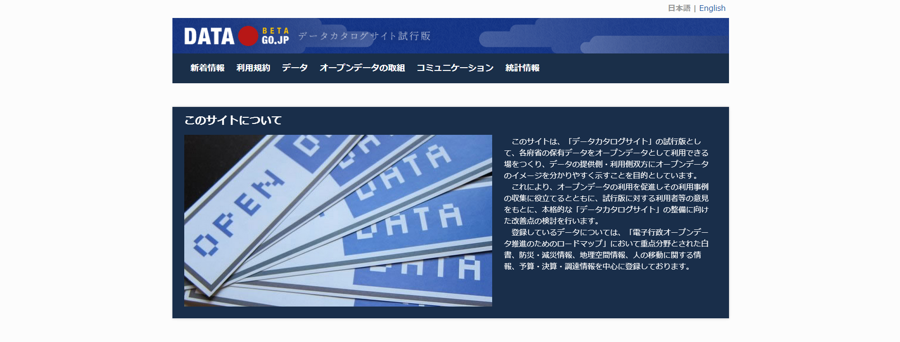

2014年06月22日現在で、10,411件のデータセットが登録されています。

また、DATA.GO.JP以外にも以下のような公開データがあります。

| 公開元| link|
|:------:|:-----:|
|総務省 統計局|http://www.stat.go.jp/index.htm|
|e-Stat|http://www.e-stat.go.jp/SG1/estat/eStatTopPortal.do|
|気象庁|http://www.jma.go.jp/jma/index.html|
|G-portal|https://www.gportal.jaxa.jp/gp/top.html|
|基盤地図|http://fgd.gsi.go.jp/download/GsiDLLoginServlet|
|海上保安庁 MICS|http://www.kaiho.mlit.go.jp/info/mics/index.htm|
|DARTS|http://www.darts.isas.jaxa.jp/index.html.ja|
|METI|http://datameti.go.jp/|
|農林水産省センサス|http://www.maff.go.jp/j/tokei/index.html|
|経済産業省 DataBox|http://databox.openlabs.go.jp/|
|経済産業省 OpenGovLab|http://www.openlabs.go.jp/|

最近では、これらのデータを使ったアプリケーションの開発やビジュアライゼーション等に関するコンテストが活発に行われるようになってきました。
その顕著な例としては、Linked Open Data Challenge(http://lod.sfc.keio.ac.jp/challenge2013/)が挙げられるのではないかと思います。

<div style='page-break-after: always;'></div>

# 代表的なフォーマット
オープンデータと言っても、公開されているフォーマットは様々です。地図や表をスキャンしただけのもの、住所をexcelに入力したもの、シェープファルなどGISで扱える形式になっているものなど、ほかにも色々と考えられます。この項では、これらのフォーマットの中から、位置情報のオープンデータとして公開されている代表的なフォーマットについて説明したいと思います。

## csv
CSVフォーマットは各フィールド(列)をカンマ「,」で区切り、各レコード(行)を改行で区切ったテキストファイルです。

地理空間情報でCSVフォーマットを使用する場合は、フィールドに、位置座標(緯度、経度など)を記録する列と、その属性を記録する列を用意します。また、一行目をフィールド名とし、二行目以降を実際のデータレコードとしておくと扱いやすくなります。

注意点としては、CSVフォーマットで扱えるのは、ポイントデータのみで、ラインやポリゴンを扱うことはできません。また、緯度、経度で位置座標を記録する場合は、十進表示に変換しておかないとGISでは読み込めない場合が多いです。

そのほか、CSVフォーマットに似た形式で、各フィールドをタブで区切った「タブ区切り」や半角スペースで区切った「スペース区切り」などもあります。これらをまとめてデリミティッドテキストと呼び、同様のものとして扱うことがあります。

CSVフォーマット表示例

```
山名,緯度,経度,標高
槍ヶ岳,36.341944,137.6475,3180
奥穂高岳,36.289167,137.648056,3190
野口五郎岳,36.4325,137.637778,2924
```


## XML

XML（Extensible Markup Language）フォーマットは汎用的なマークアップ言語として策定されたテキストフォーマットです。タグによって文書に意味づけを行い、ツリー構造によって文書の構造化します。XMLでは任意のタグを定義することができので、用途に応じてタグを定義することで個別の目的に対応させることができます。その汎用性から、今日ではあらゆる場面でXMLが利用されています。

GISにおいてもXMLファイルは様々な場面で利用されています。

XMLに準拠したファイルフォーマットとしては、GML（Geography Markup Language）、KML（Keyhole Markup Language）、基盤地図情報や国土数値情報で用いられているJPGIS形式などが挙げられます。


（基盤地図情報ヘッダ部分の例）

	<?xml version="1.0" encoding="Shift_JIS"?>
	<GI xsi:schemaLocation="http://fgd.gsi.go.jp/	spec/2008/FGD_DLD_Schema 	FGD_DLD_Schema3.0.xsd"
		xmlns:jps="http://www.gsi.go.jp/GIS/jpgis/standardSchemas2.1_2009-05" 
		xmlns:xsi="http://www.w3.org/2001/XMLSchema-instance" 
		xmlns:xlink="http://www.w3.org/1999/xlink"
		xmlns="http://fgd.gsi.go.jp/spec/2008/FGD_DLD_Schema"
		version="1.0"
		timeStamp="2012-09-25T10:59:29">
		<exchangeMetadata>
			<jps:datasetCitation>
				<jps:title>基盤地図情報ダウンロードデータ (JPGIS版)</jps:title>
				<jps:date>
					<jps:date>2011-12-21</jps:date>
					<jps:dateType>001</jps:dateType>
				</jps:date>
			</jps:datasetCitation>
			<jps:metadataCitation>
				<jps:title>基盤地図情報メタデータ ID=fmdid:11-5358</jps:title>
				<jps:date>
					<jps:date>2011-12-21</jps:date>
					<jps:dateType>001</jps:dateType>
				</jps:date>
			</jps:metadataCitation>
			<jps:encodingRule>
				<jps:encodingRuleCitation>
					<jps:title>JPGIS 附属書8 XMLに基づく符号化規則</jps:title>
					<jps:date>
						<jps:date>2008-03-31</jps:date>
						<jps:dateType>001</jps:dateType>
					</jps:date>
				</jps:encodingRuleCitation>
				<jps:toolName />
				<jps:toolVersion />
			</jps:encodingRule>
		</exchangeMetadata>

	・・・以下略・・・


また、XMLはメタデータの記述や設定ファイルなどの用途でも用いられています。例としてはラスタデータの統計値などを保存する.auxファイルや、本書でも取り上げるQGISのプロジェクトファイル（.qgs）およびスタイル設定ファイル（.qml）、GDALで用いられるバーチャルフォーマット（.vrt）等があります。

（.auxファイルの例）

	<PAMDataset>
		<PAMRasterBand band="1">
			<Histograms>
    			<HistItem>
					<HistMin>-32786.2505</HistMin>
					<HistMax>3751.2505</HistMax>
					<BucketCount>1000</BucketCount>
					<IncludeOutOfRange>0</IncludeOutOfRange>
					<Approximate>1</Approximate>
					<HistCounts>1096631|0|0|0|0|0|0|0|0|0|0|0|0|0|0|0|0|0|0|0|0|0|0|0|0|0|0|0|0|0|0|0|0|0|0|0|0|0|0|0|0|0|0|0|0|0|0|0|0|0|0|0|0|0|0|13704|10871|9864|9208|9077|8535|7010|7456|6808|6430|6077|6202|5989|5849|5348|5137|5046|4608|4345|3708|3776|3385|3147|2938|2711|2468|2372|2277|2064|1944|1695|1646|1492|1379|1281|1211|1087|1055|881|882|836|782|778|721|592|601|600|495|458|392|329|288|304|253|236|217|204|171|143|132|101|122|92|78|84|88|84|75|70|55|43|41|48|37|25|10|14|15|6|3|3|5|1|1|2|2|2|2|1|2|2|2|2|2|2|2|2|1|3|4|2</HistCounts>
				</HistItem>
			</Histograms>
			<Metadata>
				<MDI key="STATISTICS_MAXIMUM">3733</MDI>
				<MDI key="STATISTICS_MEAN">-26893.652698949</MDI>
				<MDI key="STATISTICS_MINIMUM">-32768</MDI>
				<MDI key="STATISTICS_STDDEV">12681.434046253</MDI>
			</Metadata>
		</PAMRasterBand>
	</PAMDataset>


一般にXMLはHTTPにおけるリクエスト、レスポンスとして多く利用されていますが、GISにおいてはWMS、WFS等のウェブサービスで用いられています。例として、基盤地図情報２万５千分の１WMS配信サービス（http://www.finds.jp/ws/kiban25000wms.cgi?）に以下のようなURIパラメータを付与してリクエストを送信してみます。

	http://www.finds.jp/ws/kiban25000wms.cgi?request=GetCapabilities&service=WMS&version=1.0.0

これに対するレスポンスは以下のようなXMLです。この中には利用可能なレイヤー、フォーマット等の全体の情報と、各レイヤーの範囲や空間参照系などの必要な情報が格納されています。クライアント側はこのXMLレスポンスを解析して、レイヤーリスト等の情報をユーザに提示することができます。

	<!--  end of DOCTYPE declaration  -->
	<WMT_MS_Capabilities version="1.0.0">
	<!--
	 MapServer version 6.4.1 OUTPUT=GIF OUTPUT=PNG OUTPUT=JPEG SUPPORTS=PROJ SUPPORTS=GD SUPPORTS=AGG SUPPORTS=FREETYPE SUPPORTS=CAIRO SUPPORTS=ICONV SUPPORTS=WMS_SERVER SUPPORTS=WMS_CLIENT SUPPORTS=WFS_SERVER SUPPORTS=WFS_CLIENT SUPPORTS=WCS_SERVER SUPPORTS=SOS_SERVER SUPPORTS=GEOS INPUT=JPEG INPUT=POSTGIS INPUT=OGR INPUT=GDAL INPUT=SHAPEFILE 
	-->
	<Service>
		<Name>GetMap</Name>
		<Title>KIBAN 25000 WMS</Title>
		<OnlineResource>http://www.finds.jp/ws/kiban25000wms.cgi?</OnlineResource>
	</Service>
	<Capability>
		<Request>
			<Map>
				<Format>
					<GIF/>
					<PNG/>
					<JPEG/>
					<SVG/>
				</Format>
				<DCPType>
					<HTTP>
						<Get onlineResource="http://www.finds.jp/ws/kiban25000wms.cgi?"/>
						<Post onlineResource="http://www.finds.jp/ws/kiban25000wms.cgi?"/>
					</HTTP>
				</DCPType>
			</Map>

	・・・中略・・・

		<Layer>
			<Name>KIBAN25000</Name>
			<Title>KIBAN 25000 WMS</Title>
			<Abstract>KIBAN25000</Abstract>
			<SRS>
				EPSG:4612 EPSG:2443 EPSG:2444 EPSG:2445 EPSG:2446 EPSG:2447 EPSG:2448 EPSG:2449 EPSG:2450 EPSG:2451 EPSG:2452 EPSG:2453 EPSG:2454 EPSG:2455 EPSG:2456 EPSG:2457 EPSG:2458 EPSG:2459 EPSG:2460 EPSG:2461 EPSG:3097 EPSG:3098 EPSG:3099 EPSG:3100 EPSG:3101 EPSG:4019 EPSG:4326 EPSG:32651 EPSG:32652 EPSG:32653 EPSG:32654 EPSG:32655 EPSG:32656 EPSG:4301 EPSG:30161 EPSG:30162 EPSG:30163 EPSG:30164 EPSG:30165 EPSG:30166 EPSG:30167 EPSG:30168 EPSG:30169 EPSG:30170 EPSG:30171 EPSG:30172 EPSG:30173 EPSG:30174 EPSG:30175 EPSG:30176 EPSG:30177 EPSG:30178 EPSG:30179 EPSG:3091 EPSG:3092 EPSG:3093 EPSG:3094 EPSG:3095 EPSG:3096 EPSG:900913 EPSG:3857
			</SRS>
			<LatLonBoundingBox minx="122" miny="22" maxx="149" maxy="46"/>
			<BoundingBox SRS="EPSG:4612" minx="122" miny="22" maxx="149" maxy="46"/>
			<Layer queryable="0">
				<Name>AdmArea</Name>
				<Title>AdmArea</Title>
				<SRS>EPSG:4612</SRS>
				<LatLonBoundingBox minx="122" miny="22" maxx="149" maxy="46"/>
				<BoundingBox SRS="EPSG:4612" minx="122" miny="22" maxx="149" maxy="46"/>
				<ScaleHint min="0" max="748.354272644456"/>
			</Layer>

	・・・以下略・・・


## ESRI Shapefile
地理情報システム(GIS)で最も使われているファイル形式がESRI Shapefileになります。Shapeファイル、Shape形式のように表記されている場合がありまが、正式な表記はShapefile(日本語だと、 シェープファイル)になります。ESRIと付けて表記しているのは、ArcGISという商用GISを展開しているESRI社が提唱したフォーマットだからです。  
Shapefileの特長は、

* ファイル名が同じで、拡張子の違ういくつかのファイルで構成されていること
* 1つのShapefileには1つの図形タイプ(点、線、面のうちどれか)しか入れられないこと

といった点になります。  
また、これまで紹介してきたcsv、xmlと違い、Shapefileの主なファイルはバイナリ形式ですので、テキストエディタで開いて少し書き換えるといったことは出来ません。Shapefileに対応したソフトウェアが必要です。  
Shapefileの代表的な構成としては、

|拡張子|役割|
|-----|-----|
|.shp|メインの図形要素ファイル| 
|.shx|図形要素へのインデックスファイル|
|.dbf|属性テーブル|
|.prj|空間参照系系定義ファイル|

の4ファイルになります。ソフトウェアによっては、この他にもいくつかファイルが作られる場合がありますが、上の3つ(.shp, .shx, .dbf)があれば最低限開くことが出来ます。ファイルを開く際は、代表として".shp"拡張子のファイルを指定する場合が多いです。

## KML
KMLは三次元の地理空間情報を管理するために開発されたフォーマットで、Google Earthが採用していることで良く知られています。Google Earthの前身となるソフト「Keyhole」用のファイルフォーマット「Keyhole Markup Language」の頭文字が名前の由来となっており、その名のとおりマークアップ言語で記述されたテキストファイルになっています。現在では、KMLは、Open Geospatial Consortium, Inc.（OGC）が維持管理する国際標準のフォーマットになっています。


KMLで記述できる内容は、目印、パス、ポリゴンのほか、スタイル、地面オーバーレイ、3次元モデル、カメラビュー、時間、ネットワークリンクなど数多くあります。ただし、現在、その多くの機能はGoogle Earthが対応するのみで、通常のGISソフトでは、基本的な目印、パス、ポリゴン部分のみの対応となっています。

KMLの記述例（目印）

```
<?xml version="1.0" encoding="UTF-8"?>
<kml xmlns="http://www.opengis.net/kml/2.2"> <Placemark>
 <name>青葉城</name>
 <description>伊達政宗によって築造された城。仙台城の別名。</description>
 <Point>
 <coordinates>140.856156,38.252478,0</coordinates>
 </Point>
 </Placemark> </kml>
```


## 位置情報付きの画像

ここでいう位置情報とは撮影された場所を表すものではなく、たとえば衛星画像のように地表を撮影した画像が、地上のどの位置に対応するかというものです。

一般的な画像ファイルには位置情報を記録することができませんが、GISで用いられる一部の画像フォーマットでは位置情報を記録することができます。このうち最も広く利用されているものがGeoTIFFです。その他、衛星画像の配布形式で用いられることが多いHDF（Hierarchical Data Format）や、Erdas Imagine .img（HFA）等があります。

### 位置情報の表し方

画像データの位置情報の定義の仕方は大きく分けて２種類あります。一つは画像中のあるピクセルとその対応する地上座標と画像のピクセルの地上サイズ（地上解像度）を記録する方式です。この場合、画像の上方向は北向きであることが前提となります。GeoTIFFフォーマットではModelTiepointTagとModePixelScaleTagに記録されます。以下に、それぞれのタグに記録されている値の例を示します。

	ModelTiepointTag (2,3):
    0                0                0
    128              47               0
	ModelPixelScaleTag (1,3):
    0.0077339　0.0077343 0.0

この例のModelTiepointTagは、画像座標(0,0,0)が地上座標(128,47,0)に対応することを表しており、ModelPixelScaeTagは、ピクセルの地上解像度がX軸方向が0.0077339、Y軸方向の解像度が0.0077343であることを表しています。Z軸方向のタイポイントとピクセルスケールも定義することはできますが、ほとんど利用されません。

もう一つは座標変換行列を利用して表す方式です。GeoTIFFフォーマットではModelTransformationTagに記録されます。この場合は回転と平行移動を表す4x4の行列で表されます。

	ModelTransformationTag (4,4):
	60               0                0                290775           
	0                -60              0                4103745          
	0                0                1                0                
	0                0                0                1                
	End_Of_Tags.

ModelTransformationTagに記録されている行列を各ピクセルの画像座標に適用すると地上における３次元同次座標が得られます。

### .tfw、.wldファイル

GeoTIFF等の一部のフォーマット以外のフォーマットでは位置情報をファイル内に記録することができません。このような場合はワールドファイルと呼ばれるテキストファイルに位置情報を記録しておきます。

ワールドファイルはファイル名は画像ファイルと同じで、拡張子は.wldまたは.tfwとします。たとえば、hoge.jpgファイルに対するワールドファイルはhoge.wldとします。

ワールドファイルの書式は６行からなる数値で、それぞれがアフィン変換の各係数に対応しています。例として、

	9.742
	-2.252
	-2.252
	-9.742
	220449.172
	2025569.513

という値が記録されている場合、画像座標(u,v)の地上座標(X,Y)は

	X = 9.742u -2.252v + 220449.172
	Y = -2.252u - 9.742v + 2025569.513

で求められます。特に、画像の上方向が北である場合はModelTiepointTagとModelPixelScaleTagの場合とほぼ同じで、１行目がX軸方向の地上解像度、２行目と３行目は0、４行目がY軸方向の地上解像度、５行目６行目はそれぞれX軸方向とY軸方向の移動量が記録されます。また、画像座標は通常左上が原点で下方向が+と定義されているので、Y軸方向の地上解像度は通常マイナスの値が記録されます。

その他、ENVI Raster形式のように画像データをRAW形式で保存し、ヘッダファイルを別途用意して座標値や空間参照系を記録するフォーマットもあります。

### 空間参照系の記録

空間参照系の記録は、GeoTIFF形式の場合はGeoKeyDirectoryTag内にGeoKeyと呼ばれるキー定義タグと、GeoDoubleParamsTag、GeoAsciiParamsTag等のタグに値を記録します。それ以外の場合はWKTやPROJ4Stringと呼ばれる文字列等で記録すること多いようです。

GeoTIFFに記録されている空間参照系情報は以下のようになっています。以下の例は平面直角座標９系の例です。

	Keyed_Information:
	　　GTModelTypeGeoKey (Short,1): ModelTypeProjected
	　　GTRasterTypeGeoKey (Short,1): RasterPixelIsArea
	   GTCitationGeoKey (Ascii,40): "JGD2000 / Japan Plane Rectangular CS IX"
	　　GeogCitationGeoKey (Ascii,8): "JGD2000"
	　　GeogAngularUnitsGeoKey (Short,1): Angular_Degree
	　　ProjectedCSTypeGeoKey (Short,1): Unknown-2451
	　　ProjLinearUnitsGeoKey (Short,1): Linear_Meter
	　　End_Of_Keys.
	End_Of_Geotiff.

	PCS = 2451 (JGD2000 / Japan Plane Rectangular CS IX)
	Projection = 17809 (Japan Plane Rectangular CS zone IX)
	Projection Method: CT_TransverseMercator
	   ProjNatOriginLatGeoKey: 36.000000 ( 36d 0' 0.00"N)
	   ProjNatOriginLongGeoKey: 139.833333 (139d50' 0.00"E)
	   ProjScaleAtNatOriginGeoKey: 0.999900
	   ProjFalseEastingGeoKey: 0.000000 m
	   ProjFalseNorthingGeoKey: 0.000000 m
	GCS: 4612/JGD2000
	Datum: 6612/Japanese Geodetic Datum 2000
	Ellipsoid: 7019/GRS 1980 (6378137.00,6356752.31)
	Prime Meridian: 8901/Greenwich (0.000000/  0d 0' 0.00"E)
	Projection Linear Units: 9001/metre (1.000000m)

文字列で記録する場合は上記の情報が１つの文字列として記録されます。以下の例は平面直角座標９系の画像データをENVI Raster形式で保存したときにヘッダファイルに記録されているWKT文字列の例です。

	coordinate system string = {PROJCS["JGD2000_Japan_Plane_Rectangular_CS_IX",GEOGCS["GCS_JGD_2000",DATUM["D_JGD_2000",SPHEROID["GRS_1980",6378137,298.257222101]],PRIMEM["Greenwich",0],UNIT["Degree",0.017453292519943295]],PROJECTION["Transverse_Mercator"],PARAMETER["latitude_of_origin",36],PARAMETER["central_meridian",139.8333333333333],PARAMETER["scale_factor",0.9999],PARAMETER["false_easting",0],PARAMETER["false_northing",0],UNIT["Meter",1]]}


## 標高値データもしくはグリッドデータ
地形を扱う場合、等間隔のグリッドを切り各グリッドに標高値を格納したデータにして扱います。簡単な例で見て行きましょう。下記はAscii Gridというフォーマットでの例です。

	ncols        5  
	nrows        5  
	xllcorner    141.2991  
	yllcorner    43.0397  
	cellsize     0.0001  
	NODATA_value  -9999  
	210 215 221 227 232  
	218 222 226 233 240  
	224 227 233 240 245  
	233 236 241 246 250  
	242 243 247 250 251  


* ncols/nrows x方向、y方向のグリッド数を定義します
* xlcorner/ylcorner 左下隅の座標を定義します
* cellsize 各グリッドのサイズを定義します
* NODATA_value 値が無いグリッドに入れておく数字を定義します
* タグで始まらない行は各グリッドの標高値で、左上のグリッドから順に値を並べていきます
  
値が小さいところを黒く、値が大きいところを白く、段階表示するように描画設定した例が下記になります。 xllcorner/yllcorner、cellsizeがどこに対応するかも書き込んでおきました。
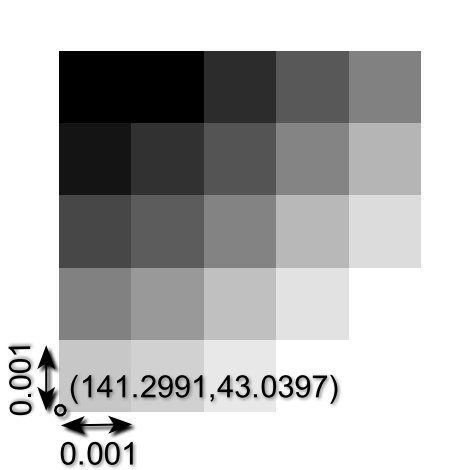

Ascii Gridは説明に適した簡単なフォーマットですが、このように原点の座標がわかり、各グリッドのサイズがわかり、(NODATAの値を定義して、）各グリッドに実データを入れられるフォーマットであれば、同じように標高値データを格納出来ます。  各グリッドに値を入れるフォーマットというと、ずばり画像フォーマットそのものです。画像で言う各ピクセルの値に、RGB値やインデックスカラーの番号など色に関する情報を入れるのではなく、標高値をそのまま入れればいいことになります。後は位置に関する情報を画像内部のヘッダ部分もしくは外部のファイルに持たせてあげます。  
ただし、画像フォーマットによっては、入れられる値がインデックスカラーの番号(0-254)など制約があります。地理空間情報で広く使われているのは、タグに位置に関する情報を入れられ、入れられる値についても自由度の高い**GeoTIFF**になります。

また、このデータの持ち方は標高値データだけではなく、等間隔に切ったグリッドに値を持たせる場合に広く使用されています。各グリッドの持つ属性が1つの場合、ポリゴンを作成して属性を持たせたベクトルデータを作るよりも、データの容量を抑えることが出来て扱いやすいからです。

## (Column)タイル地図
オープンストリートマップや地理院地図は、「タイル地図」と呼ばれる形式で配信されています。タイル地図とは、ウェブブラウザで快適に地図を閲覧するために開発されたフォーマットで、地図画像をズームレベルごとにタイル状に分割したファイルの集まりです。

標準的なタイル地図では、「ズームレベル0」を地球の緯度85.05度以内の範囲をメルカトル投影し256✕256ピクセルの画像1枚にしたものと定義します。「ズームレベル1」は「ズームレベル0」の辺の長さを2倍にし、それを縦横それぞれ2分割した4枚のタイル画像になります。ズームレベルが1段階あがるごとに、同様の作業を繰り返すことになります。

最近では地形図や衛星写真のような一般図だけでなく、植生図や地質図のような主題図などもタイル地図で配信されるようになってきています。


（あとで画像を作り直すこと！）


<div style='page-break-after: always;'></div>

# QGIS操作ガイド
## QGISとは
QGISはオープンソースの地理情報システムです。グラフィカルなユーザーインタフェースの元、地理情報システムとして必要な地理空間情報の作成、編集、可視化、解析の機能を使用することができ、商用システムに負けない多機能なシステムになっています。他の代表的なオープンソース地理情報システムの解析機能を使用するためのインタフェースも用意されており、QGISをそれらの機能を使用するための窓口として使用することも出来ます。例えばデータのフォーマット変換をする場合も、他のオープンソースソフトウェアによってコマンドラインで提供されている機能を、QGISのメニューから使用することが出来ます。データを表示し、確認した上で変換出来るのはとても便利です。またQGISを利用する利点としては、Windows、OS X、UNIXとマルチプラットフォームで提供されていることもあげられます。職場の異動等によりPC環境が変わっても、引き続き同じ機能を利用出来ることになります。  
QGISは2002年から開発が開始されていますが、1.xのバージョンまでは、日本語での処理の問題などがあり、使用には不安の声も聞かれました。しかし、2013年にバージョン2.0となり問題が解決されるとともに、機能の大幅な増強がなされています。QGISは使えるとの声を多く聞くようになってきましたし、利用事例の報告も多くなっています。今後ますます普及が進むことでしょう。  
ホームページから各種情報を確認することが出来ます。2014.6.4現在のバージョンは2.2となっています。http://www.qgis.org/  
.

QGISは、GNU General Public License (GPL)で提供されており無償で利用することが出来ます。必要であればソースコードの中身を見て動作を調べることが出来ます。また、要望に応じて改良を加えることも出来ます。この場合、改良後もライセンスが引き継がれることには注意が必要ではあります。さらにいえば開発に加わることも出来ます。これらはオープンソースソフトウェアの良いところですので、積極的に関わって行って欲しいです。  
QGISの開発は、開発コミュニティによって行われています。日本からのコアな開発メンバーはいませんが、QGISの日本語対応、メニューの日本語への翻訳、ドキュメント・ホームページの翻訳など、多くの方々が日本からもボランティアで関わっています。QGISはプラグインにより機能を足すことが出来ますので、プラグインを開発するという手もあります。また、そこまで関われないという方は、バグの報告をあげるということも1つの貢献になります。寄付するという直接的な手も用意されています。様々な貢献の仕方がありますので、QGISを使ってみて使えるな、面白いなと思った方は一度ホームページを覗いてみてください。
.

## インストール
###Windows
QGIS Windows版は以下のサイトからインストーラーをダウンロードしてから実行します。QGISを単体でインストールしたい場合は上段のサイトから、お使いのwindowsのバージョンに対応したものを選択してダウンロードしてください。QGIS公式サイト内からネットワークインストーラー、もしくはOSGeo4Wページからインストール作業を行う場合は、特段の事情がない限りデスクトップ エクスプレス インストールを推奨します。

http://www.qgis.org/ja/site/forusers/download.html


http://trac.osgeo.org/osgeo4w/wiki/OSGeo4W_jp


今回は、QGIS Standalone Installerを使用したインストールを紹介します。

インストーラーをダウンロードすると、QGISロゴのアイコンで象徴される実行ファイルが表示されるかと思います。
<div align="left"></div>

このファイルを実行してください。


セットアップウィザードが開いたら、次へをクリックしてください。


契約書の全ての条件に同意するならば、同意するをクリックしてください。

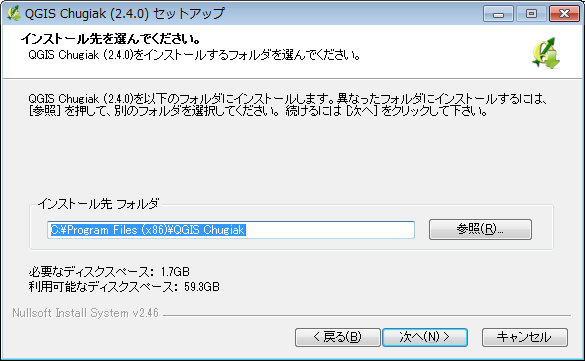

インストール先のフォルダを参照します。今回はデフォルトのままインストールを行います。デフォルトの場合はCドライブのProgram Files直下に、QGIS Valmeriaを作成してインストールします。インストール先のディレクトリを確認してから、次へをクリックしてください。


今回はインストールコンポーネントの取得を行う必要はありません。コンポーネントにチェックが入っていないことを確認してからインストールをクリックしてください。

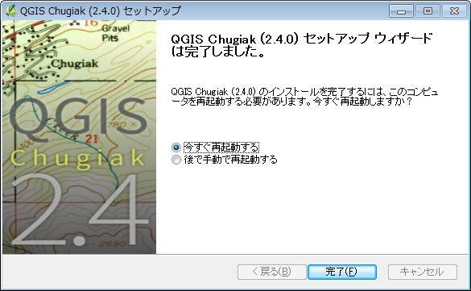

セットアップウィザードは完了しましたと表示されれば、セットアップは完了しています。デスクトップにショートカットランチャーが作成されていることを確認し、起動してください。
 
###Mac
QGIS Mac版は以下のサイトから必要なファイルをダウンロードしてからインストールを行います。2014年6月現在、OS X Lion、Mt Lion、Mavericksに対応しています。

http://www.kyngchaos.com/software/qgis

まず、以下のファイルをダウンロードします。

必須ファイル:

 - GDAL Complete 1.11 framework package
 - Matplotlib Python module

オプション:

 - NumPy
 - SciPy
 - PIL
 - psycopg2
 - RPy2（R 3.0のインストール必須）
 - PySAL

QGIS本体:

 - QGIS 2.2.0-9

ファイルをダウンロードしたら、上から順番にインストールします。ダウンロードしたdmgファイルをダブルクリックして、中身のpkgファイルをダブルクリックするとインストールが始まります。

PySALは、ソースファイルをダウンロードし、展開した後、ターミナルからソースファイルの場所に移動した後、以下のコマンドを打ってインストールします。

```
sudo python setup.py install
```

すべてのファイルがインストールできたら、アプリケーションからQGISを起動します。上手く起動できたら完了です。

## プロジェクトを開く/保存する
まずは、QGISを起動してみましょう。QGISを起動すると、新規プロジェクトを開いた状態になります。プロジェクトとは、地図データを管理する単位で、地図の投影法、追加したレイヤの情報、表示範囲、印刷設定などを保存することができます。


プロジェクトファイルを保存するにはQGISのメニューから「プロジェクト」→「保存」を選択します。拡張子は(.qgs)になります。プロジェクトファイルの中身はXMLで記述してあるので、テキストエディタで開くと保存内容を確認することもできます。

保存したプロジェクトファイルを開くには、ファイルをダブルクリックするか、QGISのメニューの「プロジェクト」→「開く」から.qgsファイルを選択します。


## 測地系・投影法を設定する
測地系・投影法の設定を行うには、メニューの【設定】-【オプション】を選択し、左側のパネルから〔CRS〕を選択します。

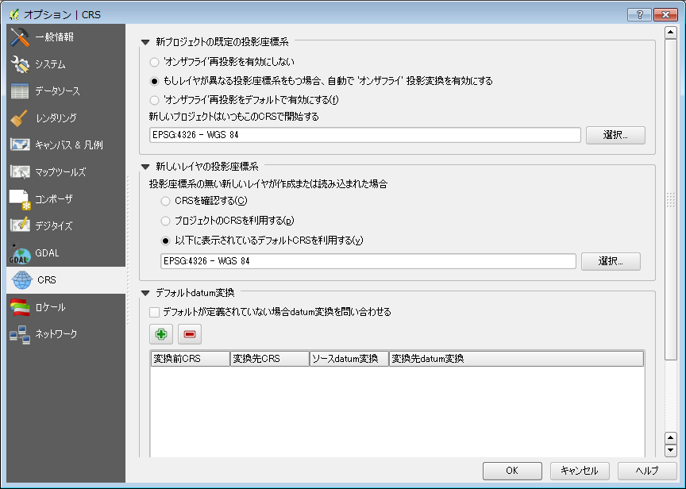

右側のパネルの一番上にある、「新プロジェクトの既定の投影座標系」の項目は、新規プロジェクトにおける穏座フライ投影変換の設定を行います。
『オンザフライ再投影を有効にしない』を選択した場合は、データに定義されている空間参照系をそのまま使用します。
『もしレイヤが異なる座標系を持つ場合、自動で’オンザフライ’投影変換を有効にする』を選択した場合は、キャンバスの空間参照系と追加したレイヤの空間参照系が異なっていた時に自動的にオンザフライが有効になります。これを選択している場合、オンザフライが有効になったことをユーザが気が付かない恐れがあるので注意が必要です。
『’オンザフライ再投影’をデフォルトで有効にする』を選択した場合は常にオンザフライが有効になります。
『新しいプロジェクトはいつもこのCRSで開始する』の項目にはデフォルトの空間参照系を指定します。

続いて「新しいレイヤの投影座標系」の項目は、CRSが定義されていないデータに対する空間参照系の設定を行います。
『CRSを確認する』を選択した場合は、以下のようなダイアログが表示され、データの空間参照系の指定をユーザに要求します。


『プロジェクトのCRSを利用する』を選択した場合は、現在のプロジェクトの空間参照系が適用されます。
『以下に表示されているデフォルトのCRSを利用する』を選択した場合は、その下のテキストボックスで指定されている空間参照系が適用されます。

最後に、「デフォルトdatum変換」の項目は、（*なにこれ？？保留*）

*オンザフライ変換については本編で触れたほうがいいでしょうか？*

##プラグインを設定する
QGIS本体だけでも様々な機能がありますが、それに加えてプラグインという形で機能を追加することが出来ます。  
メニューから「プラグイン」→「プラグインの管理とインストール」を選択します。
デフォルトの状態では、QGISのオフィシャルプラグインリポジトリに登録されているすべてのプラグインが一覧表示されます。ここから「検索」に探している機能を表すキーワードを入力することで、対象のプラグインを絞っていくことが出来ます。必要なプラグインが見つかったら、一覧からプラグインを選択した上で、「プラグインをインストール」で機能を追加しましょう。
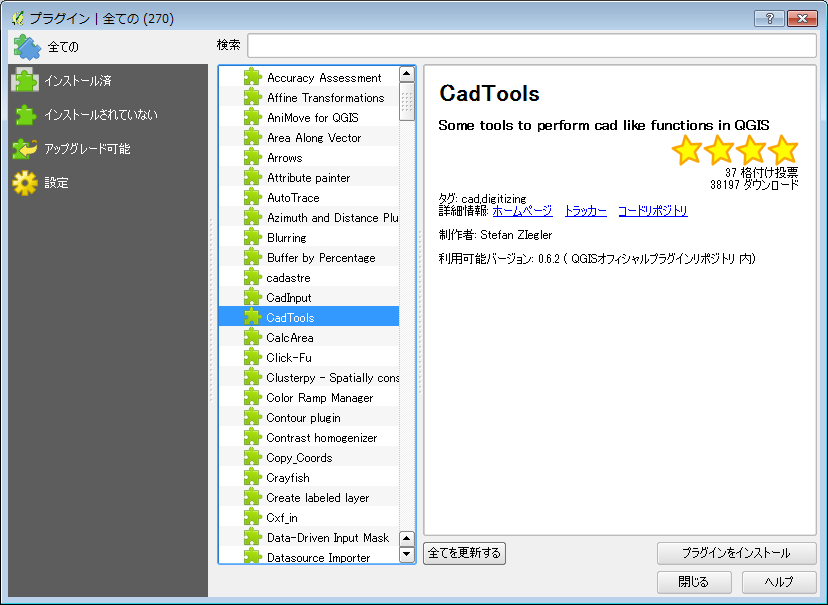.

また、左側パネルから「全て」「インストール済み」「インストールされていない」「アップグレード可能」と、プラグインのインストール状態で分けて表示することも可能です。  
一度インストールしたプラグインを使わなくなった場合は、一時的にメニューからの表示を止めるか、アンインストールするか2通りの方法を選択出来ます。「インストール済み」プラグインのみ表示にして、対象となるプラグインを選択し、

* 一時的にメニューからの表示を止めるのであれば、プラグイン名前のチェックを外す
* 削除するのであれば、「プラグインのアンインストール」を選択

としましょう。
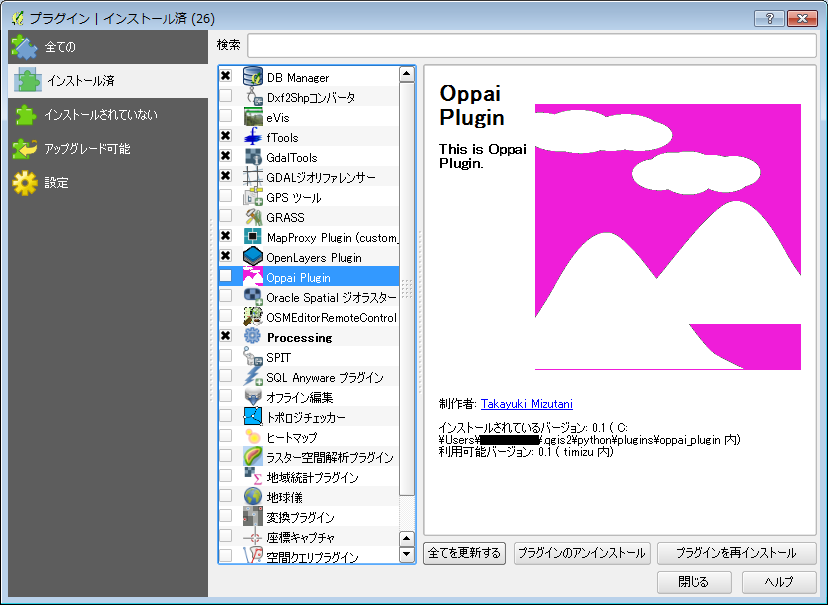.

##ファイルをレイヤに追加する
QGISでは、様々な種類のGISファイルをレイヤに追加することができます。

###ベクタデータ
シェープファイルなどのベクタデータを追加する場合は、メニューから「レイヤ」→「ベクタレイヤの追加」を選択します。必要であれば、ファイルのエンコーディングも指定します。ベクタデータは、シェープファイル形式、Mapinfo形式、KML形式、GeoJson形式、ほか多数の形式に対応しています。

###ラスタデータ
GeoTIFFなどのラスタデータを追加する場合は、メニューから「レイヤ」→「ラスタレイヤの追加」を選択します。ラスタデータは、GeoTIFF形式、ArcInfo形式、mbtiles形式、ほか多数の形式に対応しています。


###その他データ
その他、PostGISやSpatialiteなどのデータベース形式や、WMS/WMTSなどの地図配信サービス、カンマ区切りやタブ区切りのデリミティッドテキストレイヤが追加可能です。また、プラグインを利用することによって、cad形式や、GPS形式、タイル形式、GRASS形式などのファイルも読み込むことができます。


ファイルの追加は、レイヤメニューのほか、ツールバーのアイコンからや、ブラウザパネルからも可能です。また、QGISウインドウにファイルをドラッグアンドドロップしても追加することができます。

.


## レイヤにスタイルを設定する

QGISでは、レイヤーにスタイルを適用することで要素の表示方法を設定することができます。以下では、ラスタレイヤとベクタレイヤそれぞれのスタイル設定方法について説明します。

レイヤーのスタイル設定は、左側のレイヤーリストからスタイルの設定を行いたいレイヤーを右クリックし、表示されるポップアップメニューの中から【プロパティ】を選択します。

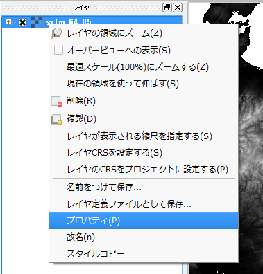

### ラスタレイヤのスタイル設定

ラスタレイヤーのスタイル設定画面は「バンド表示」の設定項目はレンダータイプによって異なりますが、「カラーレンダリング」、「リサンプリング」の設定項目は共通です。

#### 単バンドグレー


単バンド画像をグレースケールで表示する場合のスタイルの設定を行います。各項目の説明は以下の通りです。

 - グレーバンド

　　単バンドなので、バンド１のみが選択可能です。

 - 色階調

　　[黒から白]、または[白から黒]を選択できます。[黒から白]を選択した場合は、ピクセル値が低い方から高いほうになるにつれて黒から白を割り当てます。

 - 最少／最大

  ピクセル値の最大値、最小値を指定します。後述する「読み込み」ボタンで画像のピクセル値を読み込んで値を設定することができます。また、ユーザがそれぞれの値を指定することもできます。

 - コントラスト拡張

　　表示時のコントラストの拡張方法を指定します。[無し]を指定するとコントラストの拡張を行いません。[最少最大に引き延ばす]を選択した場合は、指定した最小値／最大値にそれぞれ黒と白（またはその逆）を割り当てます。

 - 最少値／最大値のロード

　　ラスタレイヤからどのようにして最小値、最大値を読み込むかの方法を指定します。
　　[累積カウント数でのカット範囲]を選択した場合は、指定したパーセンテージの範囲での最小値、最大値を読み込みます。[最少/最大]は全体の最小値、最大値を読み込みます。[平均+/-標準偏差X]を選択した場合は、平均値±（標準偏差×指定した値）の範囲の値を読み込みます。

  「範囲」で全体を指定した場合はレイヤー全体を対象にし、現在の設定を指定した場合は現在の表示範囲が対象になります。また、「精度」で高速を指定した場合は現在表示されている画像からの推定値を、実際の値を指定した場合は画像をスキャンして最少／最大値を読み取ります。この処理は「読み込み」ボタンを押すと実行されます。

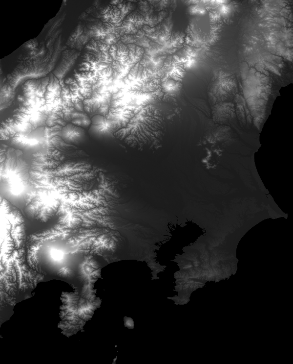

SRTM標高画像の設定例


#### マルチバンドカラー


マルチバンドカラー画像の場合のスタイル設定項目は以下の通りです。

 - Redバンド、Greenバンド、Blueバンド

  どのバンドをどの色に割り当てるかを指定します。

 - コントラスト強調

　　単バンドグレーの設定における「コントラストの拡張」と同じです。

 最小値／最大値のロードは単バンドグレーのものと同じです。

#### 単バンド疑似カラー

単バンド疑似カラーとは、単バンドの画像にグレースケール以外のカラーテーブルを割り当てて疑似的にカラー画像として表示するものです。熱センサ画像などでよく利用されています。

単バンド疑似カラーの設定画面は以下の通りです。


右側の「新規カラーマップを作製」で適用するカラーテーブルとモード（連続または等間隔）、モードで等間隔を選択した場合は分割数、および適用範囲となる最小／最大値を指定し、〔分類〕ボタンを押すと左側に色と適用される値の組が表示されます。
左側のカラーテーブルの値と色とラベルは個別に変更することができます。また、カラーテーブルは保存／読み込みが可能です。

〔色の補間〕は、”線形”ならば各値の色の間を線形で補間します。


〔色の補間〕で”離散的”を選択した場合は各値の間を補間せず、すべて同じ色に設定するので、適用結果は段彩図のようになります。


〔色の補間〕で”厳密”を選択した場合は、カラーテーブルはその色に対応した値と一致しているピクセルにしか彩色されません。これは特定の値のピクセルを抽出したいときに有効です。
下の例はSRTM画像に対して、〔色の補間〕で”厳密”を選択し、値が0.0の箇所を抽出した例です。


#### パレットカラー

パレットカラーは、通常は対象となるラスタレイヤがカラーパレットを持つ場合に使用します。カラーパレットとは番号ごとに色が決められているカラーテーブルのことで、このようなカラーパレットをファイル内に持っている画像の色モードをインデックスカラーモードと呼びます。この場合各ピクセル値にはカラーテーブルの番号が記録されます。GISでは、土地利用図などの主題図で用いると便利です。

QGISでインデックスカラー画像を読み込み、スタイルプロパティのレンダータイプで「パレットカラー」を選択すると、下図のようにファイル内のカラーテーブルが読み込まれます。


値に対応する色は個別に設定することができます。

下図は土地被覆分類結果画像にパレットカラーを適用した例です。

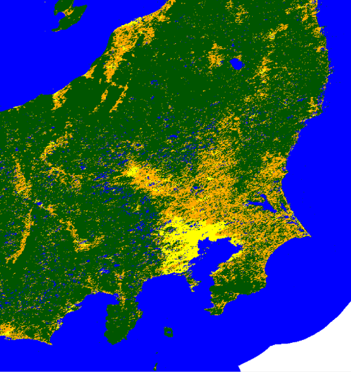


####　共通項目

カラーレンダリングはレイヤの描画についての設定を行います。〔混合モード〕は下のレイヤーの色との混合方法を指定します。”通常”の場合は下のレイヤーとは無関係に描画しますが、それ以外では下のレイヤーとの演算で描画します。
そのほか、明度、彩度、色相の調節、コントラストの協調、強調色の指定などを行うことができます。

リサンプリングは、拡大／縮小時のピクセル内挿法を指定します。QGISでは、縮小画像の描画時にすべてのピクセルを描画しているわけではありません。また、かなり拡大した時は画像のピクセルがキャンバスの解像度を下回るため、ピクセルの矩形が見えるようになります。この時にリサンプリング法で最近傍以外を指定することで滑らかに描画するように設定することができます。
オーバーサンプリングの値は元画像に対する倍率で、たとえば0.1を指定すると元の画像サイズの0.1倍を基準としてリサンプルを行います。

### ベクタレイヤのスタイル設定

ベクタレイヤのスタイル設定は複雑ですがそれだけ柔軟な設定が可能です。描画要素の設定に加え、ベクタレイヤののフィールドに応じたシンボルの設定やラベル、グラフの表示を行うことができます。データのビジュアライゼーションのキモとなる部分です。

#### シンボルとマーカー

ベクタレイヤの図形はシンボルによって描画されます。
シンボルを編集するには、シンボルレイヤ群のツリー要素を選択し、表示される右側のパネルから各設定を行います。

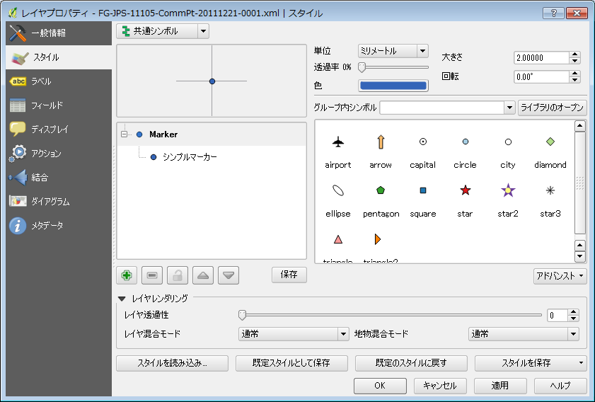

シンボルは１つまたは複数のシンボルレイヤと呼ばれるレイヤから成り立っており、各レイヤにはマーカーと呼ばれる要素が配置されます。複数のシンボルレイヤを重ねることで、より複雑なシンボルを作成することができます。たとえば、「star2」というシンボルは２つのシンボルレイヤからできています。


シンボルレイヤはシンボルレイヤツリーの下にあるプラス／マイナスボタンで追加／削除を行うことができます。また、シンボルレイヤレイヤの順序を操作することで全面／背面への移動を行うことができ舞うs。

シンボルに含まれるシンボルレイヤのマーカーを編集するには、シンボルレイヤツリーから編集したいシンボルレイヤを選択します。


上の図はポイントレイヤに対するシンプルマーカーと呼ばれるマーカーで、あらかじめ定義されている単純図形のマーカーです。シンプルマーカーでは塗りつぶしや枠線の色、枠線の幅などを設定することができます。

シンボルレイヤタイプはベクタレイヤの要素種別によって異なります。点レイヤの場合はシンプルマーカーの他に楕円マーカー、フォントマーカー、SVGマーカー、ベクタフィールドマーカーのシンボルレイヤタイプがあります。線レイヤの場合はシンプルラインとマーカーラインの２種類のシンボルレイヤタイプがあります。ポリゴンの場合はシンプル塗りつぶしのほかに多数のシンボルレイヤタイプがあります。以下に各シンボルレイヤタイプの説明を示します。

まず、点レイヤに対するシンボルレイヤタイプは以下の通りです。

- 楕円マーカー

楕円マーカーはマーカーの幅と高さを別個に指定できるマーカーです。


 - フォントマーカー

フォントマーカーは文字をマーカーとして使用するものです。

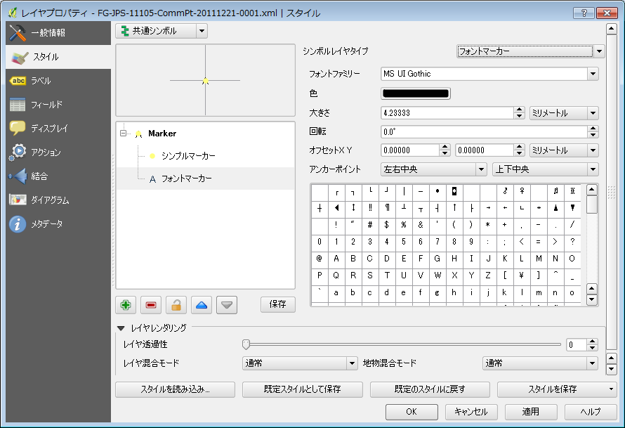

 - SVGマーカー

SVGマーカーはSVGファイルをマーカーとして使用するもので、複雑なマーカーを作成することができます。QGISにあらかじめ用意されているものが多数あるほか、ユーザがSVGファイルを作成して登録することもできます。


 - ベクタフィールドマーカー

ベクタフィールドマーカーはベクタレイヤの属性値を長さや角度に反映させるラインマーカーです。使用されるラインマーカーはシンプルマーカーと同様に設定することができます。


線レイヤに対するマーカーは、シンプルラインとマーカーラインの２種類があります。複数のシンボルレイヤを活用して複線を定義することもできます。

 - シンプルライン

シンプルラインマーカーは色、線種、線幅などの線属性のほか、頂点部分の接続形態を定義することができます。


 - マーカーライン

マーカーラインとは線を構成するポイントマーカーを指定するものです。ポイントマーカーは点レイヤのものと同じです。マーカーの間隔と回転を定義することができます。


ポリゴンに対するマーカーは多数ありますが、大きく分けて塗りつぶしありと無しの２種類があり、塗りつぶしの方法によってマーカーが異なります。まず塗りつぶしを行うタイプのマーカーを列挙します。

 - シンプル塗りつぶし

要素を単色で塗りつぶすマーカーです。塗りつぶしの色のほか、斜線や横線などの簡単なハッチを指定することもできます。また、枠線の種類も指定することができます。枠線の種類はシンプルラインマーカーのものと同じです。


 - 中心点塗りつぶし

これはポリゴンの中心点にポイントマーカーを配置するというものです。ポリゴンの枠線などは描画されません。配置するポイントマーカーの種類は点レイヤのものと同じです。


 - 階調塗りつぶし

グラデーション塗りつぶしを行うマーカーです。２つの色を指定するか、またはカラーランプを指定することができます（カラーランプについては後述）。グラデーションの方向、角度、繰り返し等の細かい設定が可能です。


 - ラインパターン塗りつぶし

ポリゴンの内部をラインでハッチをかけるシンボルレイヤタイプです。シンプル塗りつぶしマーカーと異なり、ラインマーカーを別途指定することができるので、マーカーラインで塗りつぶすことが可能です。枠線は描画されません。


 - ポイントパターン塗りつぶし

ラインパターン塗りつぶしと同様にポイントマーカーでポリゴン内を描画します。ポイントマーカーを別途指定することで複雑な図形で塗りつぶすことが可能です。ポイントパターン塗りつぶしの場合も、枠線は描画されません。


 - SVG塗りつぶし

ポリゴン内をSVGマーカーで塗りつぶし、同時に枠線を定義することができるシンボルレイヤタイプです。塗りつぶしに使用するSVGシンボルと、枠線のラインマーカーを同時に指定することができます。


以下に挙げる２つのマーカーは塗りつぶしを行わないタイプのマーカーです。

 - アウトラインマーカーライン

マーカーラインで枠線を描画するシンボルレイヤタイプです。枠線の指定はマーカーラインマーカーと同じです。


 - アウトラインシンプルライン

枠線をシンプルラインマーカーで描画するシンボルレイヤタイプです。シンプル塗りつぶしで塗りつぶしタイプに”ブラシなし”を指定した場合と同じです。


### 描画モード

ベクタレイヤ内の各要素を描画するときに、すべて同じシンボルで描画するか、または各要素の属性に応じて描画を分けるかなどの設定を行うことができます。以下に、各描画モードについて説明します。

#### 「共通シンボル」

レイヤのすべての要素を同じシンボルで描画します。下の画像は点レイヤに対する共通シンボル設定画面です。


#### 「分類された」

このモードではフィールドの値をもとに各要素を分類し、分類クラスごとにシンボルを割り当てます。「分類された」を選択すると、以下のような設定画面が表示されます。


〔カラム〕で分類に使用するフィールドを指定するか、その右側にある『ε』ボタンを押してフィールドに対する数式を入力することで分類を行います。図の例ではフィールドの先頭文字によって要素を分類します。分類を実行するにはシンボルリストの下にある『分類』ボタンを押します。

#### 段階に分けられた

このモードでは、数値型のフィールドに対して段階分けを行い、各段階にそれぞれシンボルを割り当てます。数値型フィールドを持たないベクタレイヤでは使用することができません。


「分類された」のときと同じように段階分けに使用するカラムを選択するか、もしくは数式を入力します。カラム選択の右側にある「分類数」の項目で、何段階に分けるかの段階数を指定します。設定が完了したらシンボルリストの下にある『分類』ボタンを押して段階分けを実行します。

#### ルールに基づいた

このモードではユーザがルールを一つ一つ定義していきます。


このモードを選択した時にはルールはまだ一つもない状態です。ルールを追加するには下の『＋』ボタンを押します。


フィルタの項目で条件を指定します。横の『...』ボタンを押すと数式ビルダが起動するので、フィルタに利用する式を作成することができます。『テスト』ボタンを押すと条件に該当する地物をカウントします。

ルールは上から適用されるので、両方の条件に該当する地物がある場合は最終的には下のルールが適用されます。

#### 点の移動

「点の移動」モードは点のベクタレイヤのみに対して適用することができます。


このモードでは点のレンダリングを一括して設定することができます。「レンダラ」では上記のモードを選択します。

### レイヤレンダリング


### フィールドと描画属性


### カラーランプ


### ラベル


### グラフ


### スタイルの読み込み／保存


##レイヤを編集する
編集対象とするレイヤを「編集モード」にして、図形形状と属性の追加・修正を行えます。
モードの切り替えは、下記３通りの方法があります。

* 対象レイヤを右クリックして「編集モード切替」


* メニューから「レイヤ」→「編集モード切替」
* ツールバーから「編集モード切替」アイコンを選択

編集モードに切り替わると、レイヤ中の図形の表示が切り替わり、中間点(ノード)も表示されます。


### 図形の追加
メニューから「編集」→「地物の追加」を選択します。この状態で地図面をクリックしていくとレイヤに対応した図形を追加することが出来ます。ポイントのレイヤであれば1箇所をクリックした時点で、ライン・ポリゴンのレイヤであれば数カ所をクリックして図形を作成し右クリックをした時点で、属性入力のダイアログが表示されます。属性入力まで終了すると図形が追加されます。


### 図形の修正
図形の形状を保ったまま移動させたい場合は、メニューから「編集」→「地物の移動」を選択します。対象とする図形をドラッグ操作で移動することが出来ます。


図形の形状を修正したい場合は、メニューから「編集」→「ノードツール」を選択します。対象とする図形のノードをクリックすると、表示が×から□に変更されます。この状態になると、□で表示されているノードを選択出来るようになりますので、ドラッグでの移動や、キーボードからDELボタンでノードの削除を行えます。


図形を削除する場合は、対象とする図形の選択を最初に行います。メニューから「ビュー」→「選択」を選びます。図形を選択する方法は、

* 1個の図形を選択する
* 長方形領域による地物選択 
* ポリゴンによる地物選択
* フリーハンドによる地物選択
* 半径指定による地物選択

などいくつか用意されています。いずれかの方法で対象とする図形を選択してください。  
選択されている図形はハイライト表示されます。選択後、メニューから「編集」→「選択地物の削除」を行います。


### 属性の修正
メニューから「ビュー」→「地物情報表示」を選択後、対象とする図形をクリックすると地物情報のダイアログが表示されます。地物の情報の上で右クリックをするとメニューが表示されますので、「地物編集フォーム」を選択してください。フォームが表示され、地物の属性を編集することが出来ます。


また別な方法として、メニューから「レイヤ」→「属性テーブルのオープン」を選択しておき、属性テーブル上で編集を行う方法もあります。編集したいカラムをダブルクリックすることで属性の編集を行えます。この場合は、上部に表示されている「選択された行のデータに地図をズームする」アイコンで図形を表示し、編集対象としている図形があっているかを確認しながら編集を行いましょう。


### 変更の保存
編集が終了したら編集モードを切り替えて通常に戻します。変更を保存するか聞かれますので、保存するか破棄するかを選択してください。注意点としては、図形・属性の編集を行った時点では変更は保存されていません。明示的に保存を行う必要があります。


##ベクタ演算例
QGISには非常に多くのベクタ演算ツールがあります。ベクタ演算ツールを利用することで、データの解析や、新しいデータの作成などをおこなうことができます。

基本的なベクタ演算ツールはメニュー→ベクタから選択します。そのほかのツールは、プロセッシングツールボックスから選択します。プロセッシングツールボックスは、メニュー→プロセッシング→ツールボックで表示できます。   


ここでは基本的なベクタ演算ツールの中から「バッファー」の例を紹介します。
###バッファー(空間演算ツール)
「バッファー」ツールは、既存のベクタレイヤから一定距離だけ離れたバッファーポリゴンを作成するツールです。バッファーを作成したいベクタレイヤーを読み込んだら、メニュー→ベクタ→空間演算ツール→バッファーを選択します。


バッファツールの設定ウインドウが表示されるので、バッファ距離や出力先を入力してOKボタンを押します。「結果をキャンバスに追加する」にチェックを入れると出力結果が自動的にレイヤに追加されます。


この例では、既存のデータから500m離れたバッファポリゴンが作成されました。


さまざまなベクタ演算ツールがありますが、基本的な操作方法は同じです。どんなツールがあるかはドキュメントなどを参照ください。

