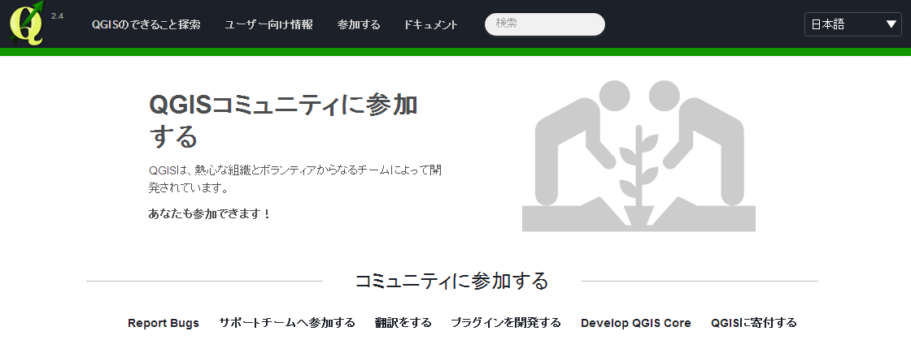

# QGIS操作ガイド
## QGISとは
QGISはオープンソースの地理情報システムです。グラフィカルなユーザーインタフェースの元、地理情報システムとして必要な地理空間情報の作成、編集、可視化、解析の機能を使用することができ、商用システムに負けない多機能なシステムになっています。他の代表的なオープンソース地理情報システムの解析機能を使用するためのインタフェースも用意されており、QGISをそれらの機能を使用するための窓口として使用することも出来ます。例えばデータのフォーマット変換をする場合も、他のオープンソースソフトウェアによってコマンドラインで提供されている機能を、QGISのメニューから使用することが出来ます。データを表示し、確認した上で変換出来るのはとても便利です。またQGISを利用する利点としては、Windows、OS X、UNIXとマルチプラットフォームで提供されていることもあげられます。職場の異動等によりPC環境が変わっても、引き続き同じ機能を利用出来ることになります。  
QGISは2002年から開発が開始されていますが、1.xのバージョンまでは、日本語での処理の問題などがあり、使用には不安の声も聞かれました。しかし、2013年にバージョン2.0となり問題が解決されるとともに、機能の大幅な増強がなされています。QGISは使えるとの声を多く聞くようになってきましたし、利用事例の報告も多くなっています。今後ますます普及が進むことでしょう。  
ホームページから各種情報を確認することが出来ます。2014年8月現在のバージョンは2.4となっています。http://www.qgis.org/  
.

QGISは、GNU General Public License (GPL)で提供されており無償で利用することが出来ます。必要であればソースコードの中身を見て動作を調べることが出来ます。また、要望に応じて改良を加えることも出来ます。この場合、改良後もライセンスが引き継がれることには注意が必要ではあります。さらにいえば開発に加わることも出来ます。これらはオープンソースソフトウェアの良いところですので、積極的に関わって行って欲しいです。  
QGISの開発は、開発コミュニティによって行われています。日本からのコアな開発メンバーはいませんが、QGISの日本語対応、メニューの日本語への翻訳、ドキュメント・ホームページの翻訳など、多くの方々が日本からもボランティアで関わっています。QGISはプラグインにより機能を足すことが出来ますので、プラグインを開発するという手もあります。また、そこまで関われないという方は、バグの報告をあげるということも1つの貢献になります。寄付するという直接的な手も用意されています。様々な貢献の仕方がありますので、QGISを使ってみて良いな、面白いなと思った方は一度ホームページを覗いてみてください。
.