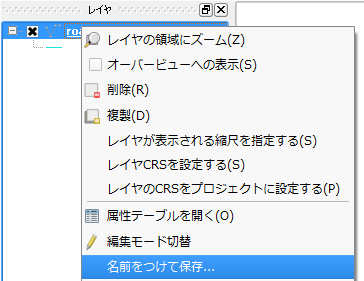
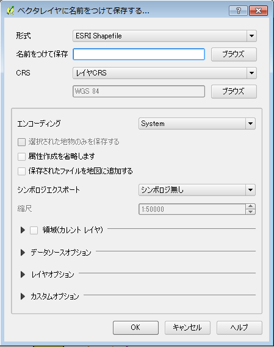

##レイヤを保存する
プロジェクトに表示している各レイヤへは、編集作業後に元ファイルへの保存を行うかの確認が行われ、上書きでの保存が行われます。これとは別に、特定のレイヤを指定して、別名称やフォーマットを変更しての保存も可能です。
対象レイヤを右クリックして【名前を付けて保存】を選択します。

ファイルフォーマットや、ファイル名を指定することが出来るダイアログが表示されます。必要に応じて項目を埋めて、保存を行ってください。
