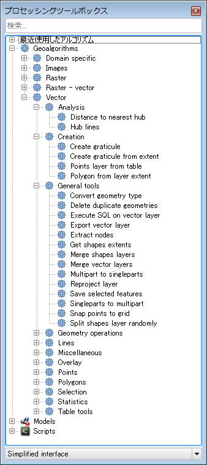
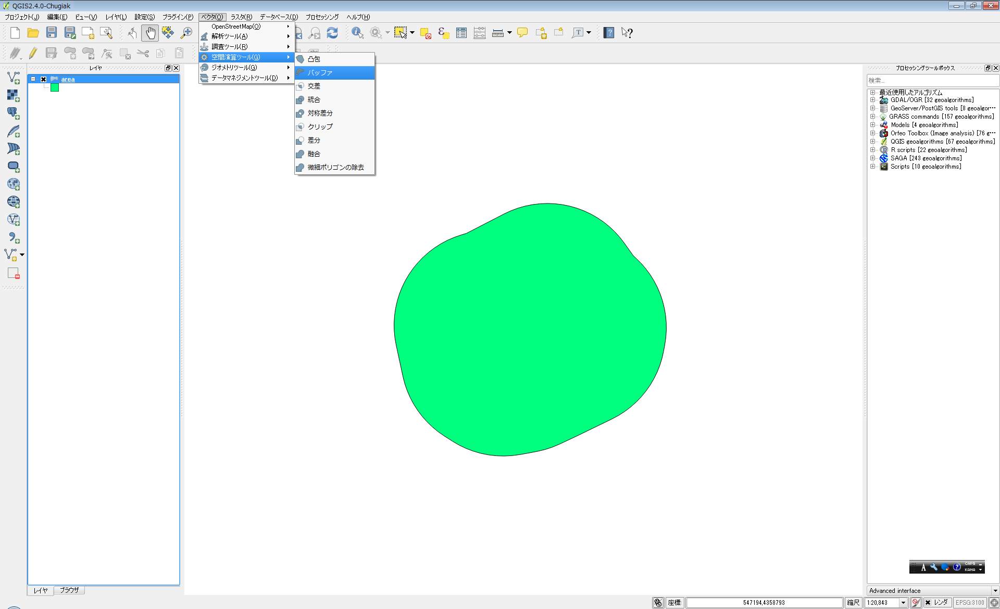
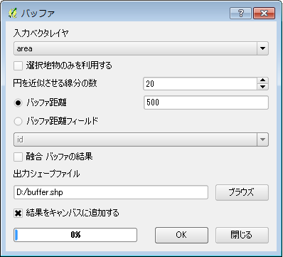
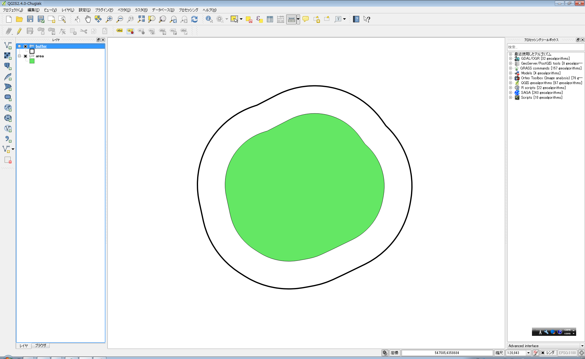

##ベクタ演算例
QGISには非常に多くのベクタ演算ツールがあります。ベクタ演算ツールを利用することで、データの解析や、新しいデータの作成などをおこなうことができます。

基本的なベクタ演算ツールはメニュー→ベクタから選択します。そのほかのツールは、プロセッシングツールボックスから選択します。プロセッシングツールボックスは、メニュー→プロセッシング→ツールボックで表示できます。   

ここでは基本的なベクタ演算ツールの中から「バッファー」の例を紹介します。
###バッファー(空間演算ツール)
「バッファー」ツールは、既存のベクタレイヤから一定距離だけ離れたバッファーポリゴンを作成するツールです。バッファーを作成したいベクタレイヤーを読み込んだら、メニュー→ベクタ→空間演算ツール→バッファーを選択します。

バッファツールの設定ウインドウが表示されるので、バッファ距離や出力先を入力してOKボタンを押します。「結果をキャンバスに追加する」にチェックを入れると出力結果が自動的にレイヤに追加されます。

この例では、既存のデータから500m離れたバッファポリゴンが作成されました。

さまざまなベクタ演算ツールがありますが、基本的な操作方法は同じです。どんなツールがあるかはドキュメントなどを参照ください。