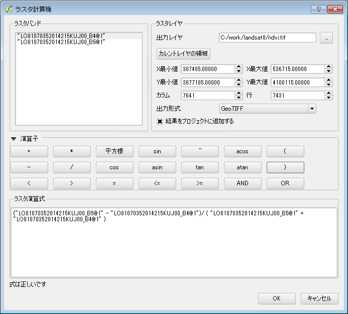

## ラスタ演算例

ラスタ演算を行うにはメニューから【ラスタ】ー【ラスタ計算機】を選択し、ラスタ計算機を起動します。

〔ラスタバンド〕の欄には現在読み込まれているラスタレイヤの一覧が表示されます。計算に使用したいバンドをダブルクリックすると下の〔ラスタ演算式〕に追加され、オペランドとして使用することができます。演算オペレータには四則演算、論理演算、三角関数等があります。

｛出力レイヤ｝の欄に計算結果の出力ファイルを指定し、「出力形式」を指定します。出力ファイルが指定されて計算式が正しく作成されていれば『OK』ボタンを押すことができるようになり、ボタンを押すと計算が実行されます。〈結果をプロジェクトに追加する〉にチェックが入っていればレイヤツリーに結果のファイルが追加されます。