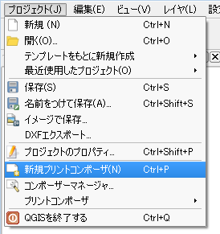
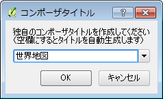
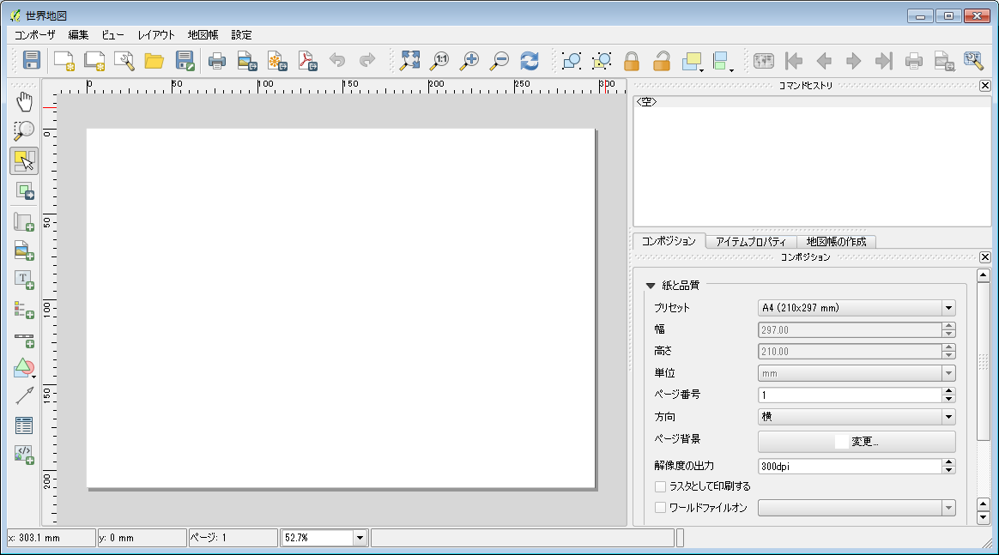

##印刷する
マップキャンバス上に可視化したデータに、

* タイトル
* 凡例
* 方位
* 縮尺

といった整飾を施し**地図**の形にして、紙への印刷や画像データとして保存を行うには「プリントコンポーザ」という機能を使用します。
メニューから「プロジェクト」→「新規プリントコンポーザ」を選択してください。

新しく作成するコンポーザに対してユニークな名称を付けます。名前を入力して「OK」クリックしてください。もし名前を入力しない場合、"コンポーザ1" "コンポーザ2"のように自動で名前が付けられます。

新しいコンポーザが立ち上がります。A4サイズ横の用紙設定がされている、何も配置されていない空のコンポーザの状態です。他の用紙サイズへの変更を行いたい場合は、右下に表示されている「コンポジション」パネル上で選択を行えます。

コンポーザ上へアイテムを配置していきます。メニュー「レイアウト」→「地図を追加」選択してください。選択後、用紙上の一点から他の一点へマウスのドラッグ操作をして大きさを調整しながら地図を配置することが出来ます。大きさは後で変更可能ですので、大まかな操作で結構です。   
その他のラベル、スケールバー、凡例、イメージ、矢印、テーブルといった各アイテムも同じ操作でコンポーザ上に配置を行えます。  
コンポーザ上に配置した各アイテムの位置、大きさ、各種設定を変更したい場合は、メニュー「レイアウト」→「アイテムを移動」を選択後に、対象とするアイテムをクリックします。アイテムが選択された状態になりますので、アイテムをドラッグしての移動、表示される枠の端にマウスを合わせての拡大・縮小を行うことが出来るようになります。また、「アイテムプロパティ」パネルを表示することで各種設定を変更することが出来ます。

アイテムの配置が終了したら、メニュー「コンポーザ」から、「印刷」を選択し紙への印刷を行ってみましょう。紙への印刷以外にも、「画像」「PDF」「SVG」への出力を行うことも出来ます。  
作成したコンポーザは、プロジェクト内に保存されます。メニュー「コンポーザ」→「プロジェクトを保存」として保存を行ってください。コンポーザ上のメニューからではなく、QGIS本体のメニューでプロジェクトを保存した場合でも同じです。コンポーザの状態はプロジェクト内に保存されます。  
または、テンプレートとして保存することも可能です。この場合、各アイテムの配置、各種設定がテンプレート内に保存されます。テンプレートを保存した際のプロジェクト以外へも、コンポーザに対してテンプレートをロードすることで、アイテムの配置、各種設定を引き継ぐことが出来ます。