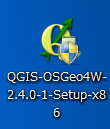
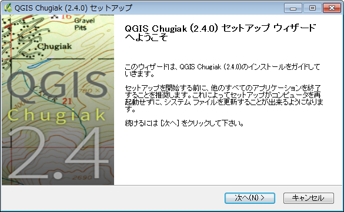
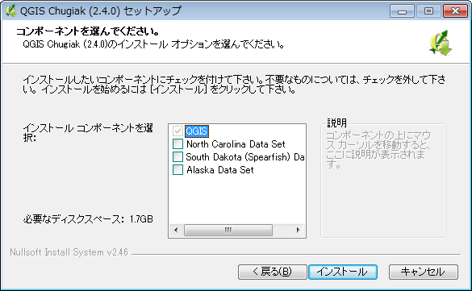

## インストール
###Windows
QGIS Windows版は以下のサイトからインストーラーをダウンロードしてから実行します。QGISを単体でインストールしたい場合は上段のサイトから、お使いのwindowsのバージョンに対応したものを選択してダウンロードしてください。QGIS公式サイト内からネットワークインストーラー、もしくはOSGeo4Wページからインストール作業を行う場合は、特段の事情がない限りデスクトップ エクスプレス インストールを推奨します。

http://www.qgis.org/ja/site/forusers/download.html


http://trac.osgeo.org/osgeo4w/wiki/OSGeo4W_jp


今回は、QGIS Standalone Installerを使用したインストールを紹介します。

インストーラーをダウンロードすると、QGISロゴのアイコンで象徴される実行ファイルが表示されるかと思います。
<div align="left"></div>

このファイルを実行してください。



セットアップウィザードが開いたら、次へをクリックしてください。


契約書の全ての条件に同意するならば、同意するをクリックしてください。


インストール先のフォルダを参照します。今回はデフォルトのままインストールを行います。デフォルトの場合はCドライブのProgram Files直下に、QGIS Valmeriaを作成してインストールします。インストール先のディレクトリを確認してから、次へをクリックしてください。



今回はインストールコンポーネントの取得を行う必要はありません。コンポーネントにチェックが入っていないことを確認してからインストールをクリックしてください。


セットアップウィザードは完了しましたと表示されれば、セットアップは完了しています。デスクトップにショートカットランチャーが作成されていることを確認し、起動してください。
 
###Mac
QGIS Mac版は以下のサイトから必要なファイルをダウンロードしてからインストールを行います。2014年6月現在、OS X Lion、Mt Lion、Mavericksに対応しています。

http://www.kyngchaos.com/software/qgis

まず、以下のファイルをダウンロードします。

必須ファイル:

 - GDAL Complete 1.11 framework package
 - Matplotlib Python module

オプション:

 - NumPy
 - SciPy
 - PIL
 - psycopg2
 - RPy2（R 3.0のインストール必須）
 - PySAL

QGIS本体:

 - QGIS 2.2.0-9

ファイルをダウンロードしたら、上から順番にインストールします。ダウンロードしたdmgファイルをダブルクリックして、中身のpkgファイルをダブルクリックするとインストールが始まります。

PySALは、ソースファイルをダウンロードし、展開した後、ターミナルからソースファイルの場所に移動した後、以下のコマンドを打ってインストールします。

```
sudo python setup.py install
```

すべてのファイルがインストールできたら、アプリケーションからQGISを起動します。上手く起動できたら完了です。