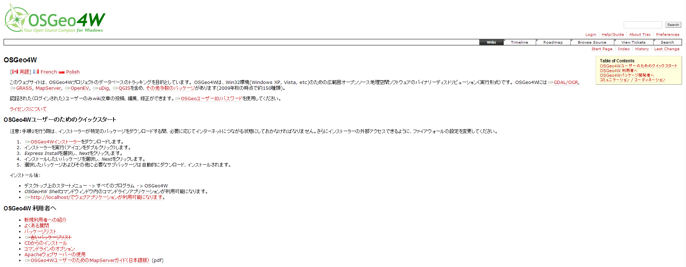
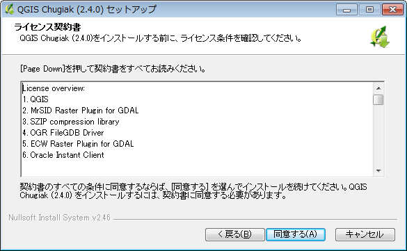
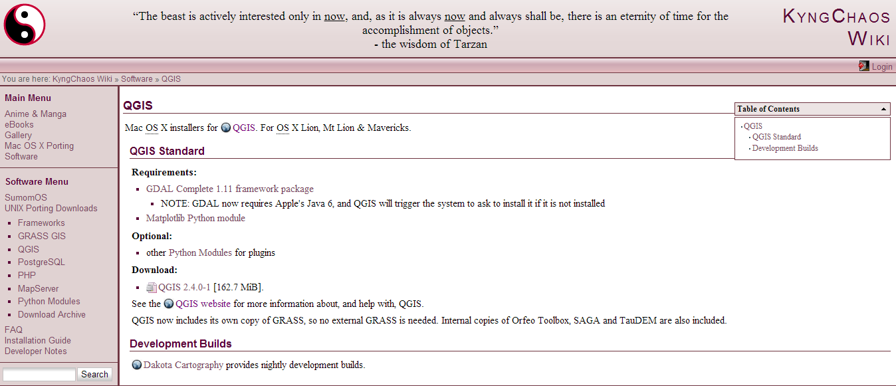

## インストール
###Windows
QGIS Windows版はQGISのホームページからインストーラーをダウンロードしてから実行します。QGISを単体でインストールしたい場合は上段のサイトからお使いのwindowsのバージョンに対応したものを選択して、ダウンロードしてください。QGIS公式ホームページ内からネットワークインストーラー、もしくはOSGeo4Wページからインストール作業を行う場合は、特段の事情がない限りデスクトップ エクスプレス インストールを推奨します。

http://www.qgis.org/ja/site/forusers/download.html


http://trac.osgeo.org/osgeo4w/wiki/OSGeo4W_jp


ここでは、QGIS Standalone Installerを使用したインストールを紹介します。

インストーラーをダウンロードすると、QGISロゴアイコンの実行ファイルが表示されます。


このファイルを実行してください。


セットアップウィザードが開いたら、次へをクリックしてください。



契約書の全ての条件に同意するならば、同意するをクリックしてください。


インストール先のフォルダを参照します。今回はデフォルトのままインストールを行います。デフォルトの場合はCドライブのProgram Files (x86)直下に、QGIS Chugiakが作成され、インストールされます。インストール先のディレクトリを確認してから、次へをクリックしてください。


インストールコンポーネントとしてサンプルデータを一緒にインストールすることもできます。特に必要なければインストールを行わなくても問題ありません。コンポーネントにチェックが入っていないことを確認してからインストールをクリックしてください。


セットアップウィザードは完了しましたと表示されれば、セットアップは完了しています。デスクトップにショートカットが作成されていることを確認し、起動してください。
 
###Mac
QGIS Mac版は以下のホームページから必要なファイルをダウンロードしてからインストールを行います。2014年8月現在、OS X Lion、Mt Lion、Mavericksに対応しています。

http://www.kyngchaos.com/software/qgis


まず、以下のファイルをダウンロードします。

必須ファイル:

 - GDAL Complete 1.11 framework package
 - Matplotlib Python module

オプション:

 - NumPy
 - SciPy
 - PIL
 - psycopg2
 - RPy2（R 3.0のインストール必須）
 - PySAL

QGIS本体:

 - QGIS 2.4.0-1

ファイルをダウンロードしたら、上から順番にインストールします。ダウンロードしたdmgファイルをダブルクリックして、中身のpkgファイルをダブルクリックするとインストールが始まります。

PySALは、ソースファイルをダウンロードし、展開した後、ターミナルからソースファイルの場所に移動した後、以下のコマンドを打ってインストールします。

```
sudo python setup.py install
```

すべてのファイルがインストールできたら、最後にGDALのコマンドへパスを通すために~/.bash_profileに以下の行を追加しておきます。

```
export PATH=/Library/Frameworks/GDAL.framework/Programs:$PATH
```

アプリケーションからQGISが起動できたら完了です。