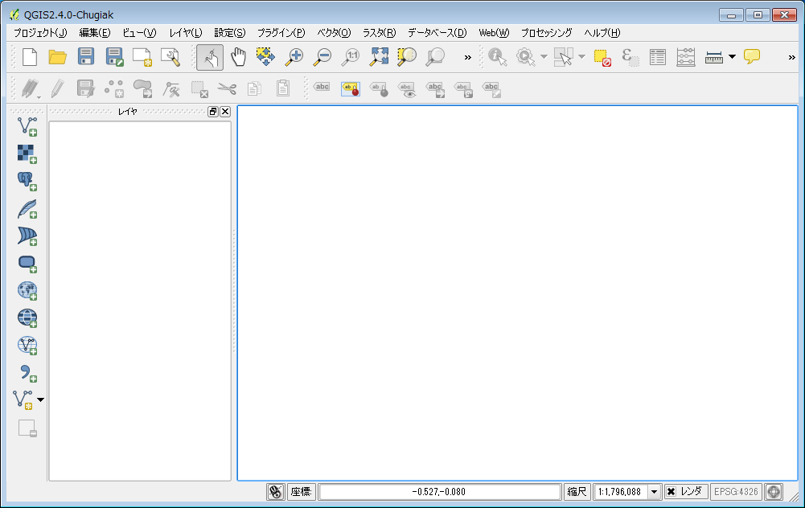

## プロジェクトを開く/保存する
まずは、QGISを起動してみましょう。QGISを起動すると、新規プロジェクトを開いた状態になります。プロジェクトとは、地図データを管理する単位で、地図の投影法、追加したレイヤの情報、表示範囲、印刷設定などを保存することができます。

プロジェクトファイルを保存するにはQGISのメニューから【プロジェクト】→【保存】を選択します。拡張子は(.qgs)になります。プロジェクトファイルの中身はXMLで記述してあるので、テキストエディタで開くと保存内容を確認することもできます。

保存したプロジェクトファイルを開くには、ファイルをダブルクリックするか、QGISのメニューの【プロジェクト】→「開く」から.qgsファイルを選択します。
