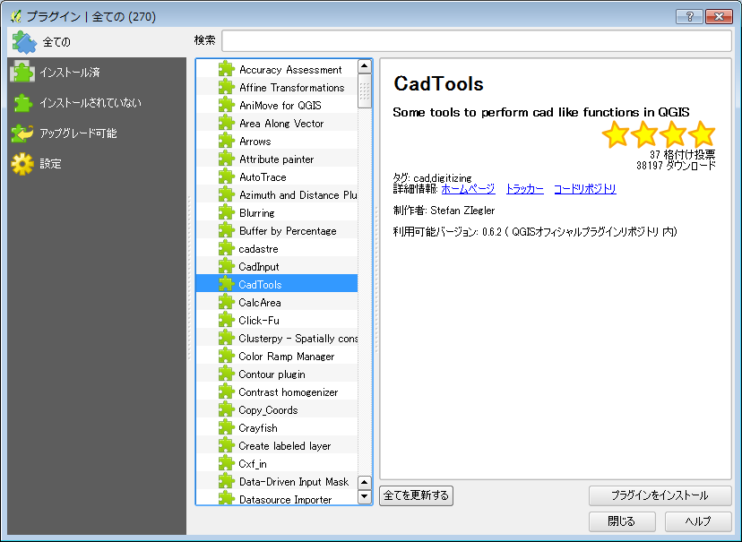
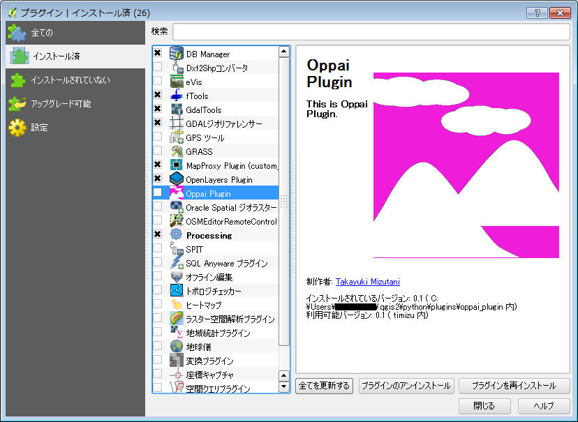

##プラグインを設定する
QGIS本体だけでも様々な機能がありますが、それに加えてプラグインという形で機能を追加することができます。  
メニューから【プラグイン】→【プラグインの管理とインストール】を選択します。
デフォルトの状態では、QGISのオフィシャルプラグインリポジトリに登録されているすべてのプラグインが一覧表示されます。ここから｛検索｝に探している機能を表すキーワードを入力することで、対象のプラグインを絞っていくことができます。必要なプラグインが見つかったら、一覧からプラグインを選択した上で、『プラグインをインストール』で機能を追加しましょう。
.

また、左側パネルから[全て][インストール済み][インストールされていない][アップグレード可能]と、プラグインのインストール状態で分けて表示することも可能です。  
一度インストールしたプラグインを使わなくなった場合は、一時的にメニューからの表示を止めるか、アンインストールするか2通りの方法を選択出来ます。[インストール済み]プラグインのみ表示にして、対象となるプラグインを選択し、

* 一時的にメニューからの表示を止めるのであれば、プラグイン名前のチェックを外す
* 削除するのであれば、『プラグインのアンインストール』を選択

としましょう。
.