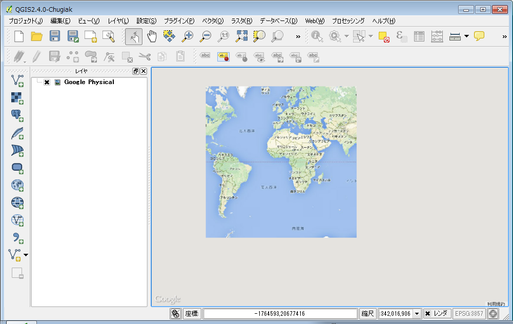

## 特殊なレイヤを追加する
### OpenLayersプラグインからの追加
前項で触れたプラグインの管理とインストールから、OpenLayers Pluginが入っていることを確認してください。無い場合は追加してください。

.

追加後に、【Web】→【Openlayers plugin】を選択すると図のようなドロップダウンリストが開きます。

.

Google, OpenStreetMap, Yahoo, Bing(MicroSoft), Appleが提供するマップを使用することが出来ます。
下図は、【Google Maps】→【GooglePhisical】を読み込んでみた例です。

.

### WMSサーバからの追加

農研機構の公開するWMSサーバーを例に、地図データを取得して初期レイヤーとしてセットしてみましょう。

http://www.finds.jp/wsdocs/kibanwms/index.html.ja

.

画面中段にある、ご使用ガイドをクリックしてください。

.

画面上段にある、

- http://www.finds.jp/ws/kiban25000wms.cgi?
- http://www.finds.jp/ws/kiban2500wms.cgi?

という2つのアドレスが確認できます。今回は上の方のアドレスを使ってみましょう。
QGISのメニューから【レイヤ】→【WMS/WMTSレイヤの追加】を選択します。
.

.

WM(T)Sサーバーからレイヤを追加というウィンドウが開くので、『新規』ボタンをクリックしてください。新しいWMSコネクションの作成ウィンドウが開いたら、以下のように記入してください。

.

新しいWMSコネクションの作成ウィンドウの右下の『OK』をクリックすると、以下のようなWM(T)Sサーバーからレイヤを追加というウィンドウが開くので、追加したいレイヤを選択してクリックしてください。その後、ウィンドウ内右下の『追加(A)』ボタンをクリックしてください。今回はIDの欄が0をクリックして追加します。

.

下図のように表示されることを確認してください。

.
