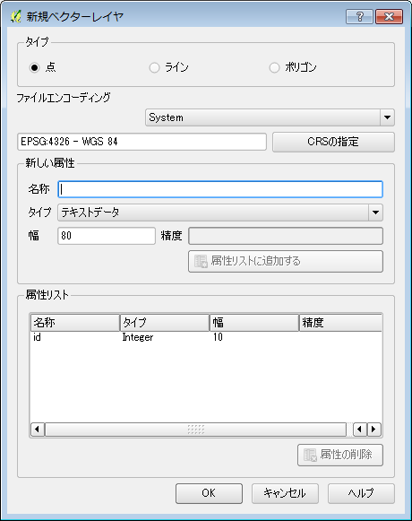
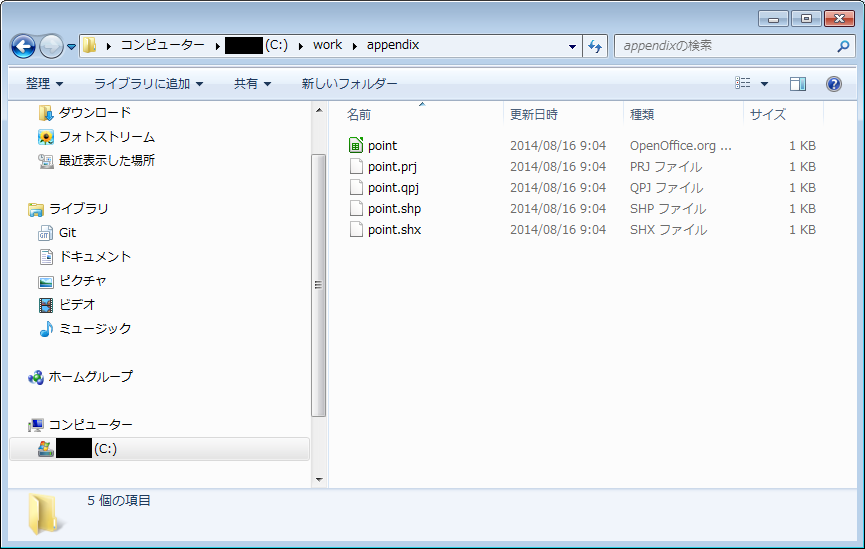

## 新規レイヤの作成
### ベクトルレイヤの新規作成
新規にShapefileの作成を行い、レイヤに追加します。
メニューから【レイヤ】→【新規】→【新しいシェプファイルレイヤ】を選択してください。

図のようなウィンドウが開くので、作成するレイヤのタイプを指定します。1つのレイヤへは1つの図形タイプしか入れられません。「点」「ライン」「ポリゴン」から選択します。「属性リスト」にはデフォルトでinteger(整数)型のidが設定されています。必要に応じて、「新しい属性」へ「名称」「タイプ」「幅」を入力し『属性リストに追加する』から、属性を追加してください。

「新たに名前を付けて保存」ウィンドウが開きます。保存するデータのファイル名とディレクトリを決定して保存します。

保存されたデータは複数のファイルで構成され、保存した時に決定したファイル名と、それぞれの拡張子がつき保存されます。ただし、データ自体は未編集なので空のデータセットとして保存されています。下図は、
* ディレクトリとして"C:\work\appendix"
* ファイル名として"point"
を指定して作成されたファイルの例です。

QGISの画面上には、ポイントデータのレイヤが表示されます。ただし、既述のように、データセットの中身はありません。編集方法などに関しては別途解説します。

