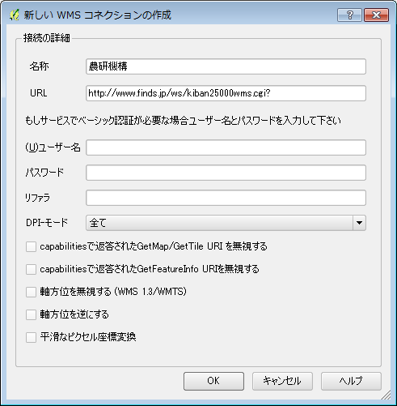

## 新規レイヤの作成

新規にレイヤーを作成してみましょう。前項で触れたプラグインの管理とインストールから、OpenLayers Pluginが入っていることを確認してください。無い場合は追加してください。

### .1

.

追加後に、プラグインをクリックすると

.

図のように、Google, OpenStreetMap, Yahoo, Being(MicroSoft), Apple
が提供するマップを使用することが出来ることが確認されたかと思います。
下図はGooglePhisicalLayerを読み込んでみたものです。

.

### .2

農研機構の公開するWMSサーバーから地図データを取得して、初期レイヤーとしてセットしてみましょう。

http://www.finds.jp/wsdocs/kibanwms/index.html.ja

.

画面中段にある、ご使用ガイドをクリックしてください。

.

画面上段にある、

- http://www.finds.jp/ws/kiban25000wms.cgi?
- http://www.finds.jp/ws/kiban2500wms.cgi?

という2つのアドレスが確認できるかと思います。今回は上の方のアドレスを使ってみましょう。
QGISのWMSを追加するアイコンをクリックしてください。
.

.

新規ボタンをクリックして、新しいWMSコネクションの作成ウィンドウが開いたら、以下のように記入してください。

.

OKをクリックすると、以下のようなWM(T)Sサーバーからレイヤを追加というウィンドウが開くので、追加したいレイヤを選択してクリックしてください。その後、ウィンドウ内右下の追加(A)ボタンをクリックしてください。今回はIDの欄が0をクリックして追加します。

.

下図のように表示されることが確認できるかと思います。

.