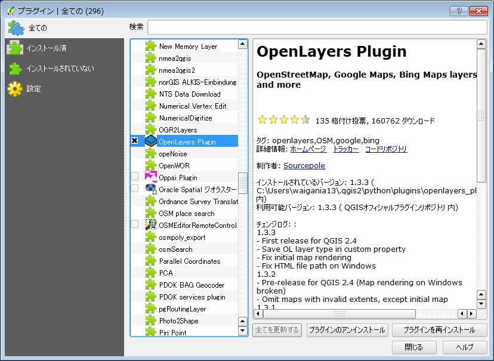
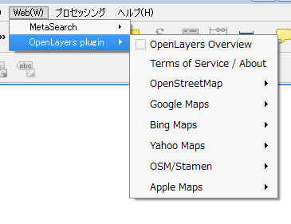
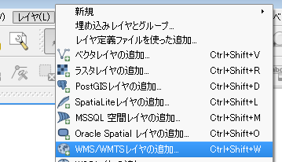
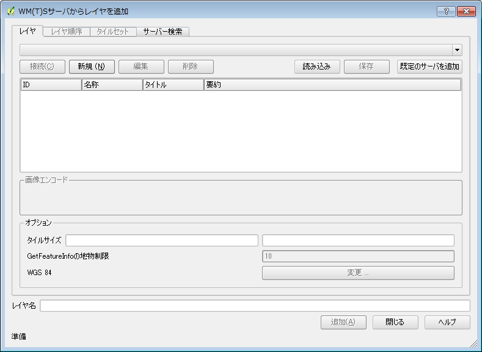
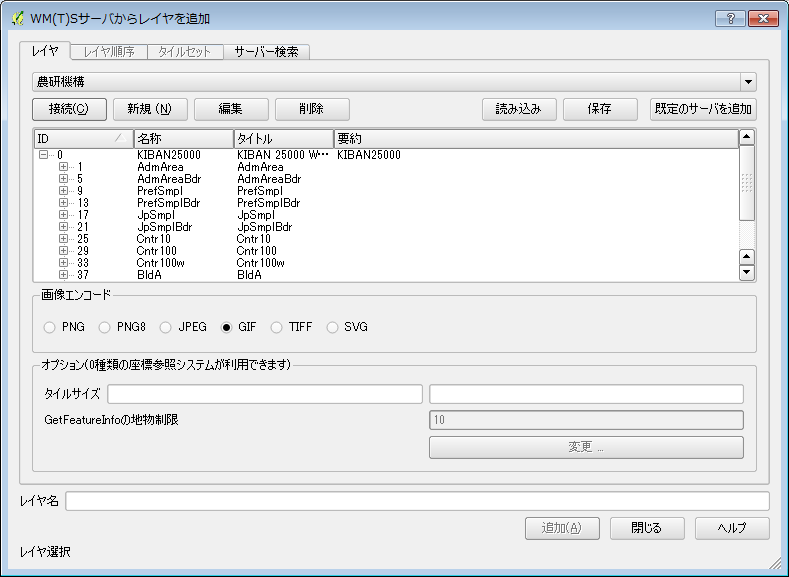
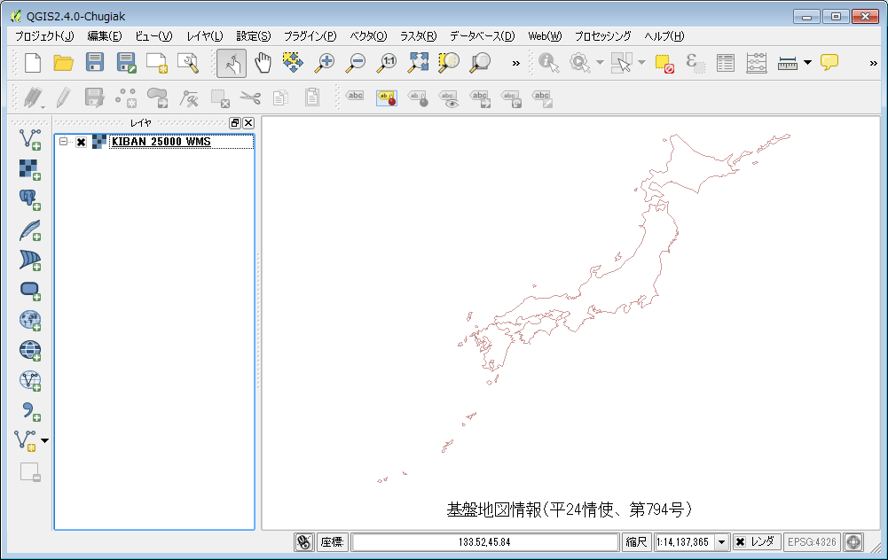

## 新規レイヤの作成

新規にレイヤーを作成してみましょう。

### .1
.

【レイヤ】をクリックするとドロップダウンリストが開くので〔新規〕上にマウスカーソルを置きます。
すると新たにドロップダウンリストが開くので【新しいシェプファイルレイヤ】をクリックしてください。

.

図のようなウィンドウが開くので、編集するレイヤのタイプを指定します。今回は、サンプルとして点を選択します。
新しい属性の欄に、名称欄に作成するレイヤの名称を記入します。今回は仮にpointとしました。
ウィンドウ右下の『OK』をクリックしてください。
レイヤの種別に関しては、4章で詳しく記述します。

.
新たに名前を付けて保存ウィンドウが開きます。保存するデータのファイル名とディレクトリを決定して保存します。
今回はappendix1-6というディレクトリを作成して、そのディレクトリに保存します。画面右上の保存する場所の欄に保存先のディレクトリを指定します。
ファイル名の欄にpointと記入して『保存』をクリックしてください。

.

保存されたデータは複数のファイルで構成され、保存した時に決定したファイル名と、それぞれの拡張子がつき保存されます。ただし、データ自体は未編集なので空のデータセットとして保存されています。

.

QGISの画面上には、ポイントデータのレイヤが表示されていると思います。ただし、既述のように、データセットの中身はありません。編集方法などに関しては別途解説します。

### .2
前項で触れたプラグインの管理とインストールから、OpenLayers Pluginが入っていることを確認してください。無い場合は追加してください。

.

追加後に、【プラグイン】をクリックすると図のようなドロップダウンリストが開きます。

.

下図のように、Google, OpenStreetMap, Yahoo, Being(MicroSoft), Apple
が提供するマップを使用することが出来ることが確認されたかと思います。
下図はGooglePhisicalLayerを読み込んでみたものです。

【プラグイン】をクリックして開いたドロップダウンリストから〔GooglePhisicalLayer〕をクリックします。

.

### .3

農研機構の公開するWMSサーバーから地図データを取得して、初期レイヤーとしてセットしてみましょう。

http://www.finds.jp/wsdocs/kibanwms/index.html.ja

.

画面中段にある、ご使用ガイドをクリックしてください。

.

画面上段にある、

- http://www.finds.jp/ws/kiban25000wms.cgi?
- http://www.finds.jp/ws/kiban2500wms.cgi?

という2つのアドレスが確認できるかと思います。今回は上の方のアドレスを使ってみましょう。
QGISの【WMS/WMTSレイヤの追加】というアイコンをクリックしてください。
.

.

WM(T)Sサーバーからレイヤを追加というウィンドウが開くので、『新規』ボタンをクリックしてください。新しいWMSコネクションの作成ウィンドウが開いたら、以下のように記入してください。

.

新しいWMSコネクションの作成ウィンドウの右下の『OK』をクリックすると、以下のようなWM(T)Sサーバーからレイヤを追加というウィンドウが開くので、追加したいレイヤを選択してクリックしてください。その後、ウィンドウ内右下の『追加(A)』ボタンをクリックしてください。今回はIDの欄が0をクリックして追加します。

.

下図のように表示されることが確認できるかと思います。

.