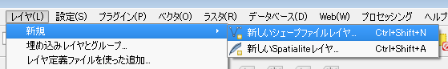

## 新規レイヤの作成
### ベクトルレイヤの新規作成
新規にShapefileの作成を行い、レイヤに追加します。
メニューから【レイヤ】→【新規】→【新しいシェプファイルレイヤ】を選択してください。

図のようなウィンドウが開くので、作成するレイヤのタイプを指定します。1つのレイヤへは1つの図形タイプしか入れられません。「点」「ライン」「ポリゴン」から選択します。「属性リスト」にはデフォルトでinteger(整数)型のidが設定されています。必要に応じて、「新しい属性」へ「名称」「タイプ」「幅」を入力し『属性リストに追加する』から、属性を追加してください。
.

「新たに名前を付けて保存」ウィンドウが開きます。保存するデータのファイル名とディレクトリを決定して保存します。

