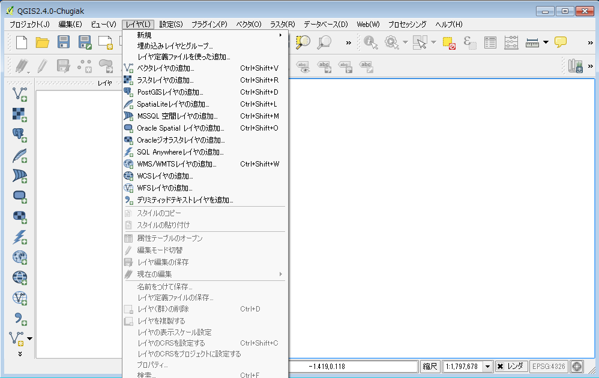

##ファイルをレイヤに追加する
QGISでは、様々な種類のGISファイルをレイヤに追加することができます。

###ベクタデータ
シェープファイルなどのベクタデータを追加する場合は、メニューから【レイヤ】→【ベクタレイヤの追加】を選択します。必要であれば、ファイルのエンコーディングも指定します。ベクタデータは、シェープファイル形式、Mapinfo形式、KML形式、GeoJson形式、ほか多数の形式に対応しています。

###ラスタデータ
GeoTIFFなどのラスタデータを追加する場合は、メニューから【レイヤ】→【ラスタレイヤの追加】を選択します。ラスタデータは、GeoTIFF形式、ArcInfo形式、mbtiles形式、ほか多数の形式に対応しています。

###その他データ
その他、PostGISやSpatialiteなどのデータベース形式や、WMS/WMTSなどの地図配信サービス、カンマ区切りやタブ区切りのデリミティッドテキストレイヤが追加可能です。また、プラグインを利用することによって、cad形式や、GPS形式、タイル形式、GRASS形式などのファイルも読み込むことができます。

ファイルの追加は、レイヤメニューのほか、ツールバーのアイコンからや、ブラウザパネルからも可能です。また、QGISウインドウにファイルをドラッグアンドドロップしても追加することができます。

.
