## レイヤにスタイルを設定する

QGISでは、レイヤーにスタイルを適用することで要素の表示方法を設定することができます。以下では、ラスタレイヤとベクタレイヤそれぞれのスタイル設定方法について説明します。

レイヤーのスタイル設定は、左側のレイヤーリストからスタイルの設定を行いたいレイヤーを右クリックし、表示されるポップアップメニューの中から【プロパティ】を選択します。

### ラスタレイヤのスタイル設定

ラスタレイヤーのスタイル設定画面は「バンド表示」の設定項目はレンダータイプによって異なりますが、「カラーレンダリング」、「リサンプリング」の設定項目は共通です。

#### 単バンドグレー

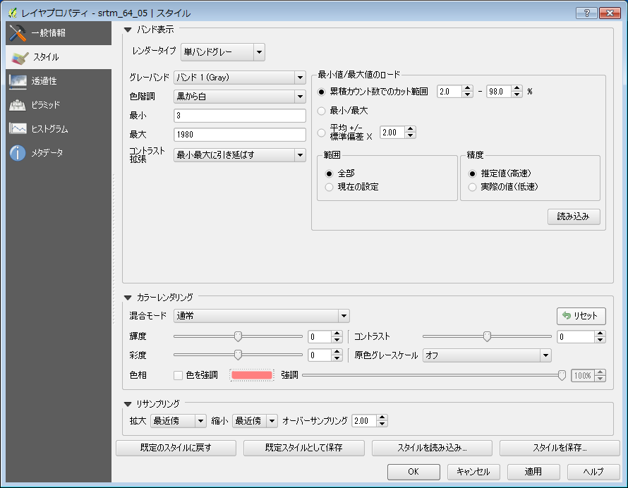

単バンド画像をグレースケールで表示する場合のスタイルの設定を行います。各項目の説明は以下の通りです。

 - グレーバンド

　　単バンドなので、バンド１のみが選択可能です。

 - 色階調

　　〔黒から白〕、または〔白から黒〕を選択できます。〔黒から白〕を選択した場合は、ピクセル値が低い方から高いほうになるにつれて黒から白を割り当てます。

 - 最少／最大

  ピクセル値の最大値、最小値を指定します。後述する『読み込み』ボタンで画像のピクセル値を読み込んで値を設定することができます。また、ユーザがそれぞれの値を指定することもできます。

 - コントラスト拡張

　　表示時のコントラストの拡張方法を指定します。〔無し〕を指定するとコントラストの拡張を行いません。〔最少最大に引き延ばす〕を選択した場合は、指定した最小値／最大値にそれぞれ黒と白（またはその逆）を割り当てます。

 - 最少値／最大値のロード

　　ラスタレイヤからどのようにして最小値、最大値を読み込むかの方法を指定します。
　　〈累積カウント数でのカット範囲〉を選択した場合は、指定したパーセンテージの範囲での最小値、最大値を読み込みます。〈最少/最大〉は全体の最小値、最大値を読み込みます。〈平均+/-標準偏差X〉を選択した場合は、平均値±（標準偏差×指定した値）の範囲の値を読み込みます。

  ”範囲”で全体を指定した場合はレイヤー全体を対象にし、現在の設定を指定した場合は現在の表示範囲が対象になります。また、”精度”で高速を指定した場合は現在表示されている画像からの推定値を、実際の値を指定した場合は画像をスキャンして最少／最大値を読み取ります。この処理は『読み込み』ボタンを押すと実行されます。

SRTM標高画像の設定例

#### マルチバンドカラー

マルチバンドカラー画像の場合のスタイル設定項目は以下の通りです。

 - Redバンド、Greenバンド、Blueバンド

  どのバンドをどの色に割り当てるかを指定します。

 - コントラスト強調

　　単バンドグレーの設定における「コントラストの拡張」と同じです。

 最小値／最大値のロードは単バンドグレーのものと同じです。

#### 単バンド疑似カラー

単バンド疑似カラーとは、単バンドの画像にグレースケール以外のカラーテーブルを割り当てて疑似的にカラー画像として表示するものです。熱センサ画像などでよく利用されています。

単バンド疑似カラーの設定画面は以下の通りです。

右側の”新規カラーマップを作製”で適用するカラーテーブルとモード（連続または等間隔）、モードで等間隔を選択した場合は分割数、および適用範囲となる最小／最大値を指定し、『分類』ボタンを押すと左側に色と適用される値の組が表示されます。
左側のカラーテーブルの値と色とラベルは個別に変更することができます。また、カラーテーブルは保存／読み込みが可能です。

「色の補間」は、”線形”ならば各値の色の間を線形で補間します。

「色の補間」で〔離散的〕を選択した場合は各値の間を補間せず、すべて同じ色に設定するので、適用結果は段彩図のようになります。

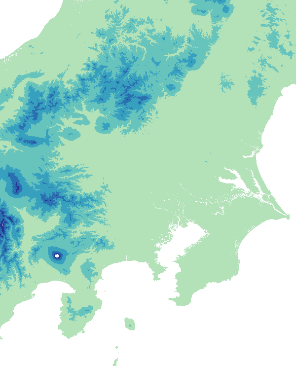

「色の補間」で〔厳密〕を選択した場合は、カラーテーブルはその色に対応した値と一致しているピクセルにしか彩色されません。これは特定の値のピクセルを抽出したいときに有効です。
下の例はSRTM画像に対して、「色の補間」で〔厳密〕を選択し、値が0.0の箇所を抽出した例です。

#### パレットカラー

パレットカラーは、通常は対象となるラスタレイヤがカラーパレットを持つ場合に使用します。カラーパレットとは番号ごとに色が決められているカラーテーブルのことで、このようなカラーパレットをファイル内に持っている画像の色モードをインデックスカラーモードと呼びます。この場合各ピクセル値にはカラーテーブルの番号が記録されます。GISでは、土地利用図などの主題図で用いると便利です。

QGISでインデックスカラー画像を読み込み、スタイルプロパティのレンダータイプで〔パレットカラー〕を選択すると、下図のようにファイル内のカラーテーブルが読み込まれます。

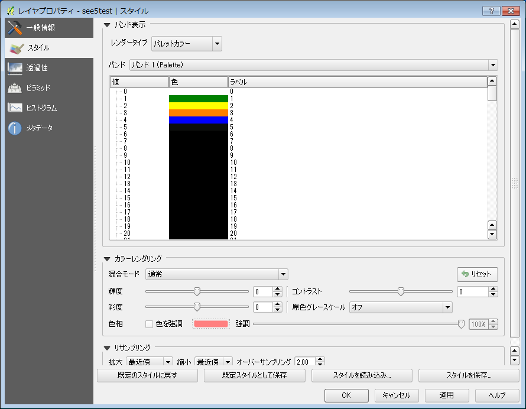

値に対応する色は個別に設定することができます。

下図は土地被覆分類結果画像にパレットカラーを適用した例です。

####　共通項目

カラーレンダリングはレイヤの描画についての設定を行います。「混合モード」は下のレイヤーの色との混合方法を指定します。”通常”の場合は下のレイヤーとは無関係に描画しますが、それ以外では下のレイヤーとの演算で描画します。
そのほか、明度、彩度、色相の調節、コントラストの協調、強調色の指定などを行うことができます。

リサンプリングは、拡大／縮小時のピクセル内挿法を指定します。QGISでは、縮小画像の描画時にすべてのピクセルを描画しているわけではありません。また、かなり拡大した時は画像のピクセルがキャンバスの解像度を下回るため、ピクセルの矩形が見えるようになります。この時にリサンプリング法で最近傍以外を指定することで滑らかに描画するように設定することができます。
オーバーサンプリングの値は元画像に対する倍率で、たとえば0.1を指定すると元の画像サイズの0.1倍を基準としてリサンプルを行います。

### ベクタレイヤのスタイル設定

ベクタレイヤのスタイル設定は複雑ですがそれだけ柔軟な設定が可能です。描画要素の設定に加え、ベクタレイヤののフィールドに応じたシンボルの設定やラベル、グラフの表示を行うことができます。データのビジュアライゼーションのキモとなる部分です。

#### シンボルとマーカー

ベクタレイヤの図形はシンボルによって描画されます。
シンボルを編集するには、シンボルレイヤ群のツリー要素を選択し、表示される右側のパネルから各設定を行います。

シンボルは１つまたは複数のシンボルレイヤと呼ばれるレイヤから成り立っており、各レイヤにはマーカーと呼ばれる要素が配置されます。複数のシンボルレイヤを重ねることで、より複雑なシンボルを作成することができます。たとえば、「star2」というシンボルは２つのシンボルレイヤからできています。

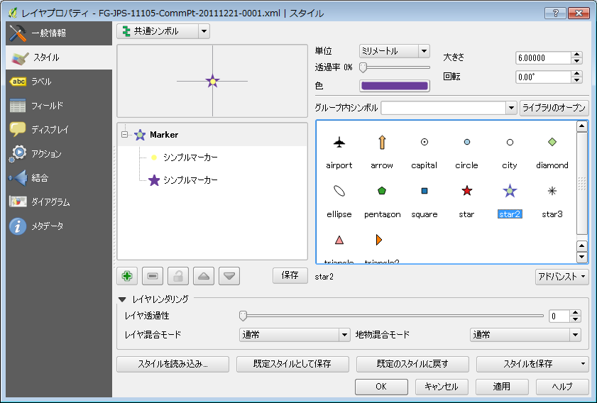

シンボルレイヤはシンボルレイヤツリーの下にあるプラス／マイナスボタンで追加／削除を行うことができます。また、シンボルレイヤレイヤの順序を操作することで全面／背面への移動を行うことができ舞うs。

シンボルに含まれるシンボルレイヤのマーカーを編集するには、シンボルレイヤツリーから編集したいシンボルレイヤを選択します。

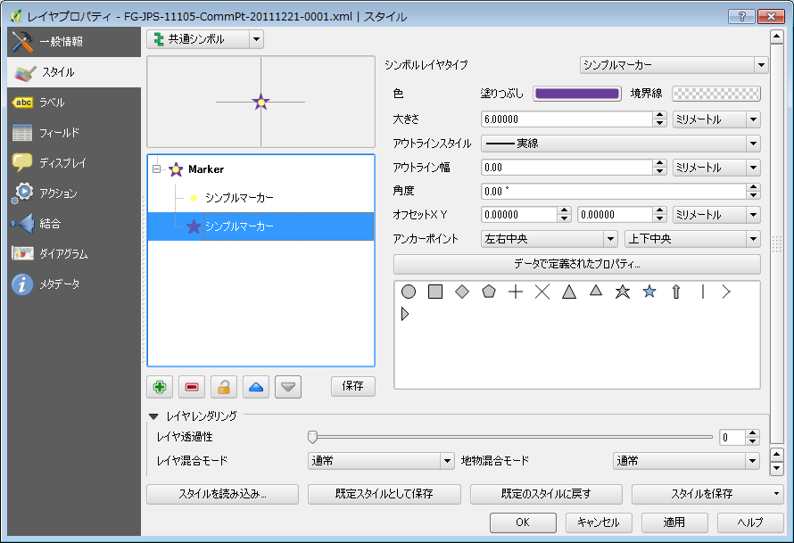

上の図はポイントレイヤに対するシンプルマーカーと呼ばれるマーカーで、あらかじめ定義されている単純図形のマーカーです。シンプルマーカーでは塗りつぶしや枠線の色、枠線の幅などを設定することができます。

シンボルレイヤタイプはベクタレイヤの要素種別によって異なります。点レイヤの場合はシンプルマーカーの他に楕円マーカー、フォントマーカー、SVGマーカー、ベクタフィールドマーカーのシンボルレイヤタイプがあります。線レイヤの場合はシンプルラインとマーカーラインの２種類のシンボルレイヤタイプがあります。ポリゴンの場合はシンプル塗りつぶしのほかに多数のシンボルレイヤタイプがあります。以下に各シンボルレイヤタイプの説明を示します。

まず、点レイヤに対するシンボルレイヤタイプは以下の通りです。

- 楕円マーカー

楕円マーカーはマーカーの幅と高さを別個に指定できるマーカーです。

 - フォントマーカー

フォントマーカーは文字をマーカーとして使用するものです。

 - SVGマーカー

SVGマーカーはSVGファイルをマーカーとして使用するもので、複雑なマーカーを作成することができます。QGISにあらかじめ用意されているものが多数あるほか、ユーザがSVGファイルを作成して登録することもできます。

 - ベクタフィールドマーカー

ベクタフィールドマーカーはベクタレイヤの属性値を長さや角度に反映させるラインマーカーです。使用されるラインマーカーはシンプルマーカーと同様に設定することができます。

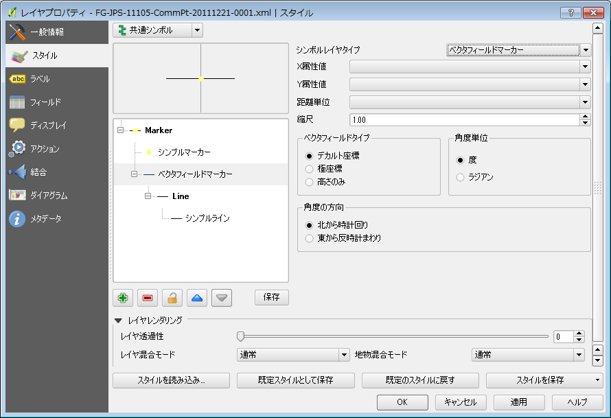

線レイヤに対するマーカーは、シンプルラインとマーカーラインの２種類があります。複数のシンボルレイヤを活用して複線を定義することもできます。

 - シンプルライン

シンプルラインマーカーは色、線種、線幅などの線属性のほか、頂点部分の接続形態を定義することができます。

 - マーカーライン

マーカーラインとは線を構成するポイントマーカーを指定するものです。ポイントマーカーは点レイヤのものと同じです。マーカーの間隔と回転を定義することができます。

ポリゴンに対するマーカーは多数ありますが、大きく分けて塗りつぶしありと無しの２種類があり、塗りつぶしの方法によってマーカーが異なります。まず塗りつぶしを行うタイプのマーカーを列挙します。

 - シンプル塗りつぶし

要素を単色で塗りつぶすマーカーです。塗りつぶしの色のほか、斜線や横線などの簡単なハッチを指定することもできます。また、枠線の種類も指定することができます。枠線の種類はシンプルラインマーカーのものと同じです。

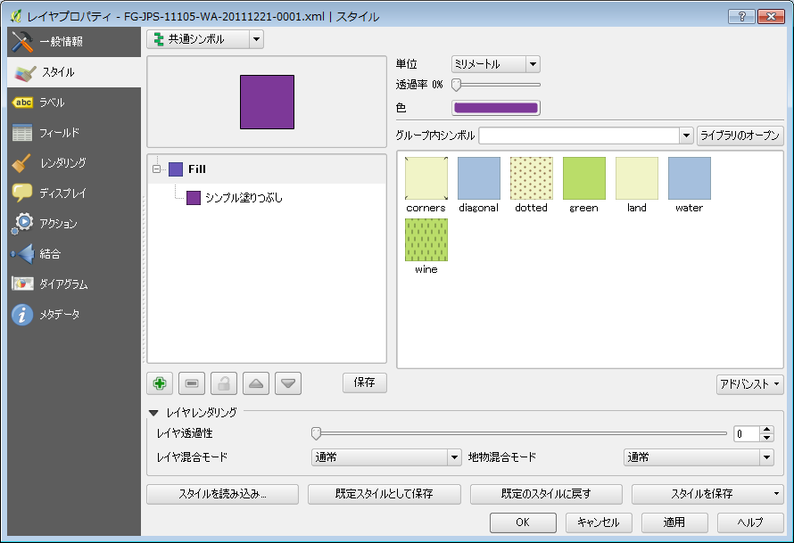

 - 中心点塗りつぶし

これはポリゴンの中心点にポイントマーカーを配置するというものです。ポリゴンの枠線などは描画されません。配置するポイントマーカーの種類は点レイヤのものと同じです。

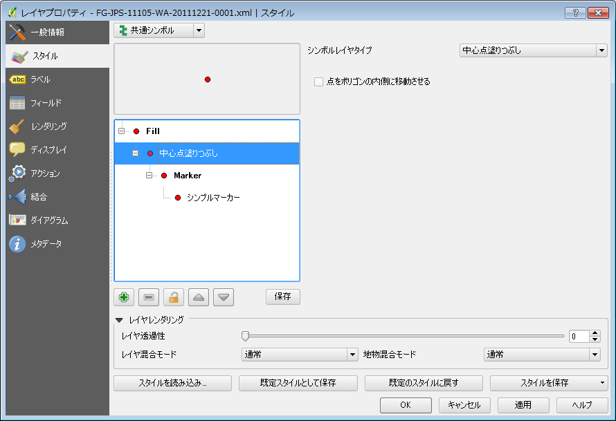

 - 階調塗りつぶし

グラデーション塗りつぶしを行うマーカーです。２つの色を指定するか、またはカラーランプを指定することができます（カラーランプについては後述）。グラデーションの方向、角度、繰り返し等の細かい設定が可能です。

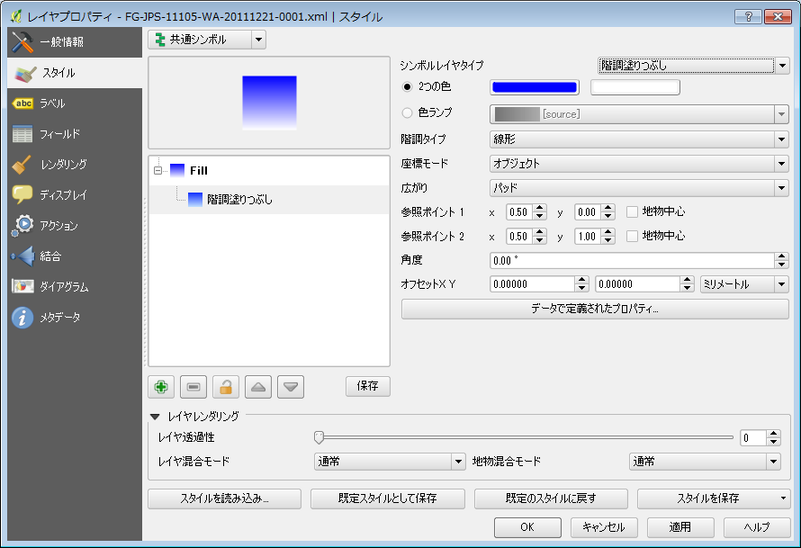

 - ラインパターン塗りつぶし

ポリゴンの内部をラインでハッチをかけるシンボルレイヤタイプです。シンプル塗りつぶしマーカーと異なり、ラインマーカーを別途指定することができるので、マーカーラインで塗りつぶすことが可能です。枠線は描画されません。

 - ポイントパターン塗りつぶし

ラインパターン塗りつぶしと同様にポイントマーカーでポリゴン内を描画します。ポイントマーカーを別途指定することで複雑な図形で塗りつぶすことが可能です。ポイントパターン塗りつぶしの場合も、枠線は描画されません。

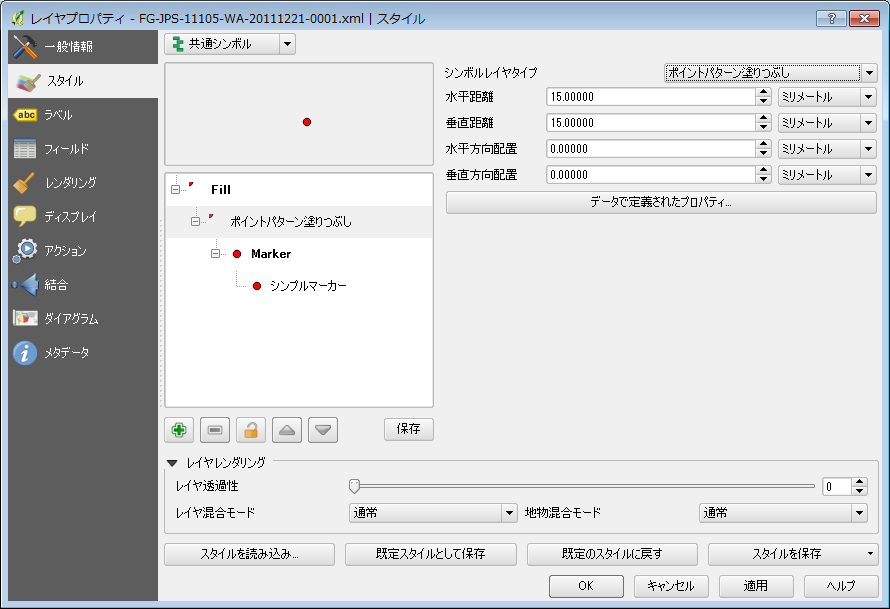

 - SVG塗りつぶし

ポリゴン内をSVGマーカーで塗りつぶし、同時に枠線を定義することができるシンボルレイヤタイプです。塗りつぶしに使用するSVGシンボルと、枠線のラインマーカーを同時に指定することができます。

 - 形状バースト塗りつぶし

ポリゴン内部に向かって色を変化させながらの塗りつぶします。塗りつぶしに使用する外側、内側の色の指定、形状全てを塗りつぶすのか、外側からの一定の距離まで塗りつぶすのかを指定することができます。

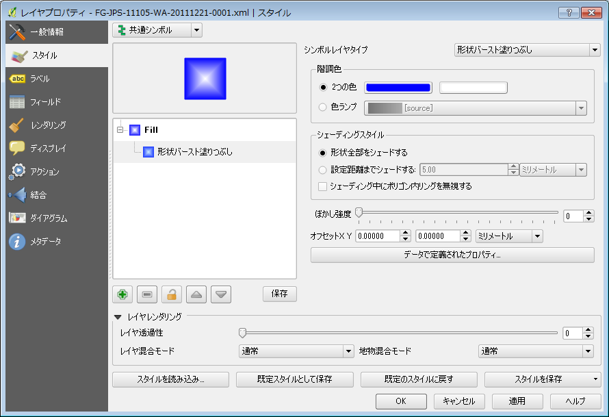

以下に挙げる２つのマーカーは塗りつぶしを行わないタイプのマーカーです。

 - アウトラインマーカーライン

マーカーラインで枠線を描画するシンボルレイヤタイプです。枠線の指定はマーカーラインマーカーと同じです。

 - アウトラインシンプルライン

枠線をシンプルラインマーカーで描画するシンボルレイヤタイプです。シンプル塗りつぶしで塗りつぶしタイプに”ブラシなし”を指定した場合と同じです。

### 描画モード

ベクタレイヤ内の各要素を描画するときに、すべて同じシンボルで描画するか、または各要素の属性に応じて描画を分けるかなどの設定を行うことができます。以下に、各描画モードについて説明します。

#### 「共通シンボル」

レイヤのすべての要素を同じシンボルで描画します。下の画像は点レイヤに対する共通シンボル設定画面です。

#### 「分類された」

このモードではフィールドの値をもとに各要素を分類し、分類クラスごとにシンボルを割り当てます。〔分類された〕を選択すると、以下のような設定画面が表示されます。

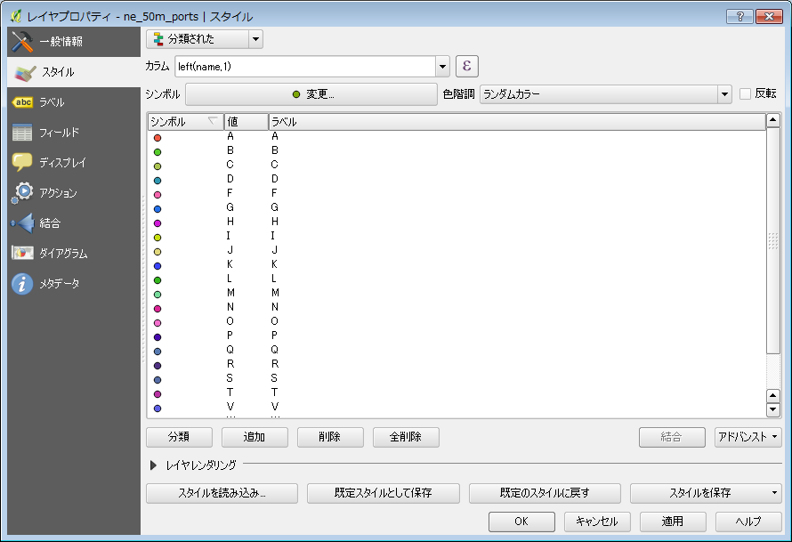

｛カラム｝で分類に使用するフィールドを指定するか、その右側にある『ε』ボタンを押してフィールドに対する数式を入力することで分類を行います。図の例ではフィールドの先頭文字によって要素を分類します。分類を実行するにはシンボルリストの下にある『分類』ボタンを押します。

#### 段階に分けられた

このモードでは、数値型のフィールドに対して段階分けを行い、各段階にそれぞれシンボルを割り当てます。数値型フィールドを持たないベクタレイヤでは使用することができません。

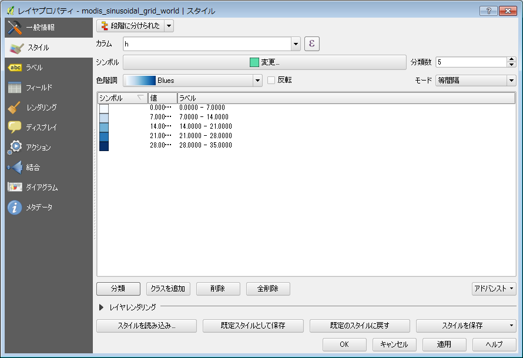

〔分類された〕のときと同じように段階分けに使用するカラムを選択するか、もしくは数式を入力します。カラム選択の右側にある「分類数」の項目で、何段階に分けるかの段階数を指定します。設定が完了したらシンボルリストの下にある『分類』ボタンを押して段階分けを実行します。

#### ルールに基づいた

このモードではユーザがルールを一つ一つ定義していきます。

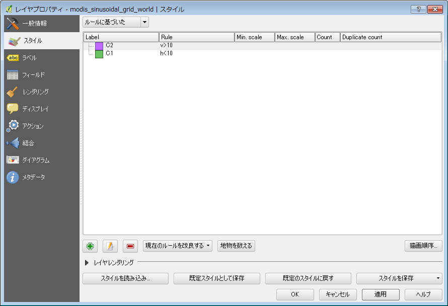

このモードを選択した時にはルールはまだ一つもない状態です。ルールを追加するには下の『＋』ボタンを押します。

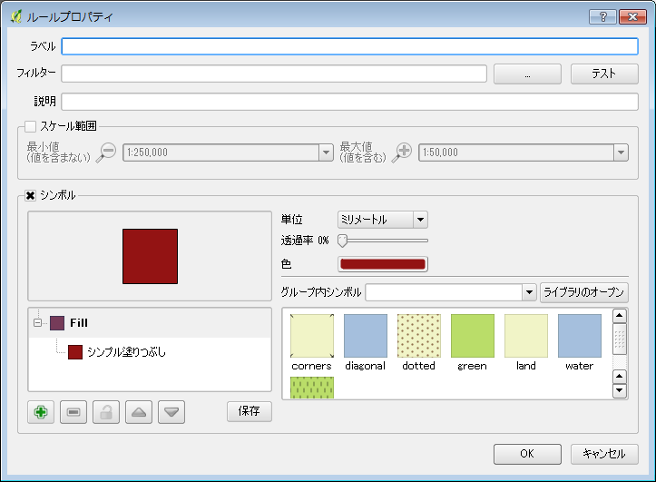

フィルタの項目で条件を指定します。横の『...』ボタンを押すと数式ビルダが起動するので、フィルタに利用する式を作成することができます。『テスト』ボタンを押すと条件に該当する地物をカウントします。

ルールは上から適用されるので、両方の条件に該当する地物がある場合は最終的には下のルールが適用されます。

#### 点の移動

〔点の移動〕モードは点のベクタレイヤのみに対して適用することができます。

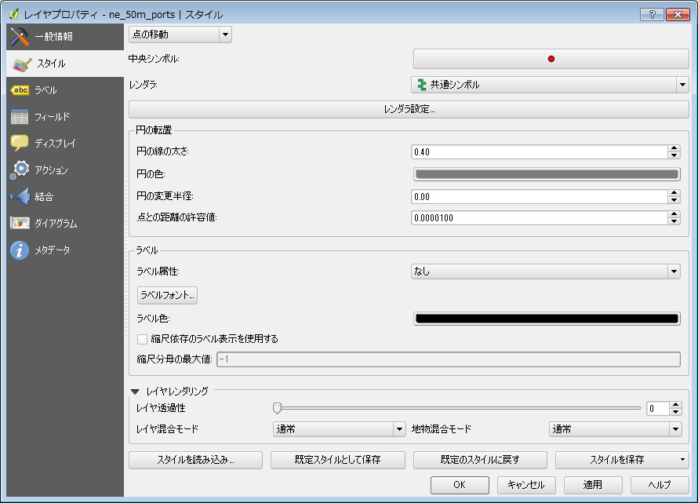

このモードでは点のレンダリングを一括して設定することができます。「レンダラ」では上記のモードを選択します。

### レイヤレンダリング

レイヤレンダリングの項目ではレイヤの透過性や混合モードなどを設定します。混合モードにはレイヤ混合モードと地物混合モードの両方を設定することができます。レイヤ混合モードはレイヤ間の混合モードを指定し、地物混合モードは同一レイヤ内の地物間での混合モードを指定します。
それぞれの混合モードはラスタレイヤのものと同じです。

### フィールド値と回転、スケール

数値型のフィールドをシンボルの回転角およびスケールに適用することができます。フィールド値をスタイルに適用するには、右下にある『アドバンスト』ボタンを押し、表示されるメニューからフィールドを選択するか式を入力します。

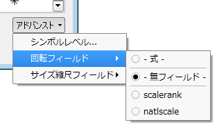

### スタイルマネージャ

スタイルマネージャは登録されているマーカーやハッチ、カラーランプなどの編集を行うものです。スタイルマネージャを表示するには、描画モードが共通シンボルの場合は『ライブラリのオープン』ボタンを選択します。

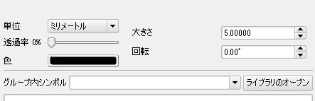

それ以外のモードの場合はそれぞれのシンボルをクリックし、表示されるシンボルセレクタダイアログに『ライブラリのオープン』ボタンがあります。

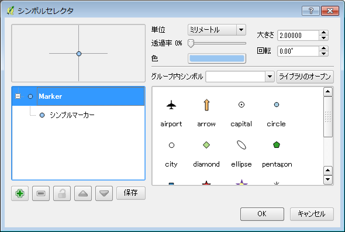

スタイルマネージャのダイアログにはマーカー、ライン、塗りつぶし、カラーランプのタブがあります。それぞれの設定項目は以下の通りです。

 - 〔マーカー〕タブ

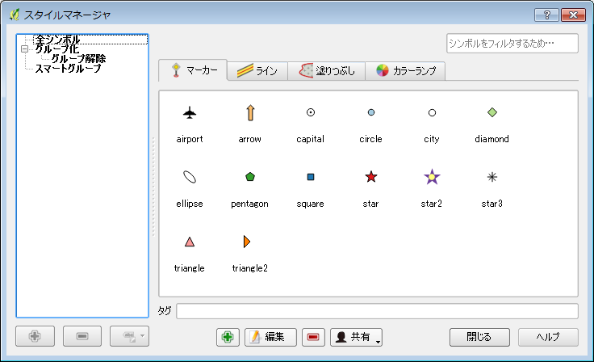

ポイントマーカーやマーカーラインで使用されるマーカーのスタイルを編集します。追加、または編集ボタンを押すとシンボルセレクタのダイアログが表示されるので、マーカーの編集と同じようにスタイルを作成することができます。

 - 〔ライン〕タブ

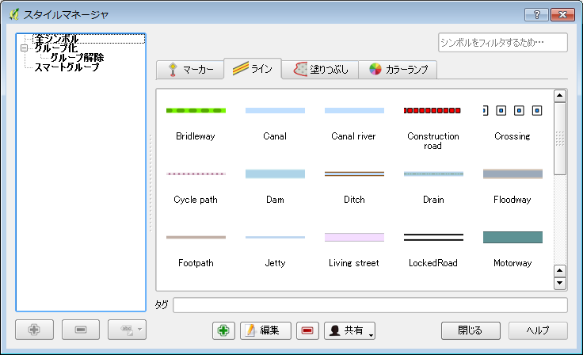

ラインマーカーやポリゴンの枠線などに使用するラインのスタイルを編集します。

 - 〔塗りつぶし〕タブ

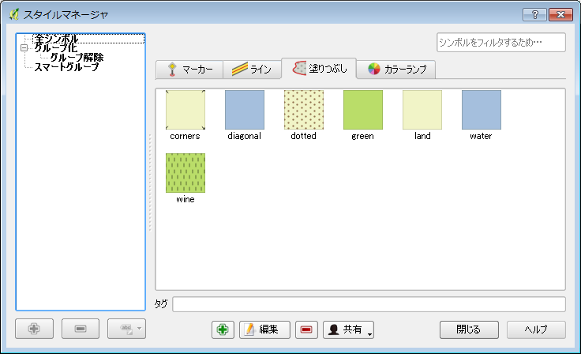

ポリゴンに対する塗りつぶしパターンを編集します。

 - 〔カラーランプ〕タブ

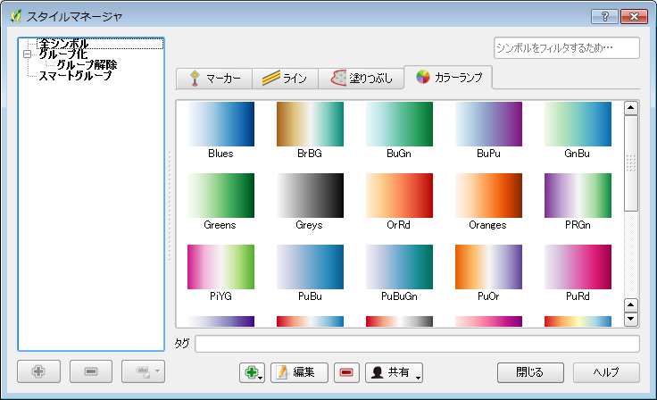

カラーランプはグラデーション塗りつぶし、ベクタレイヤの段階分け、ラスタレイヤの疑似カラーなどに使用されるカラーテーブルのことです。カラーランプの追加ボタンを押すと、いくつかのメニューが表示されます。

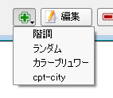

カラーランプの編集は追加時に選択したメニューによって異なります。【階調】を選択した場合は以下のダイアログが表示されます。

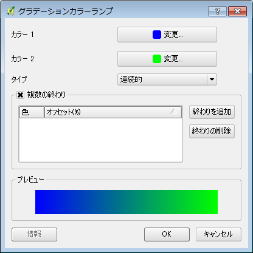

「タイプ」はグラデーションで色が変化する"連続的"と、段階的に色が変化する"離散的"の２種類があります。『終わりの追加』ボタンで中間に色を追加することができます。
ランダムカラーは開始と終了の色相、彩度、明度を指定し、分類数で色数を指定します。

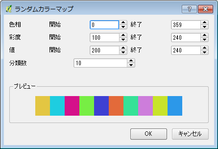

カラーブリューワは多数の定義済みカラーテーブルから選択して、色数をを指定します。

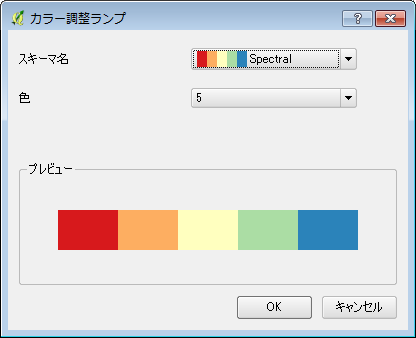

cpt-cityとはMichael Galloy氏が作成しているIDLライブラリで使用されるカラーテーブル集です。オリジナルのカラーテーブル集は http://docs.idldev.com/mglib/vis/color/cptcity_catalog.html　で見ることができます。

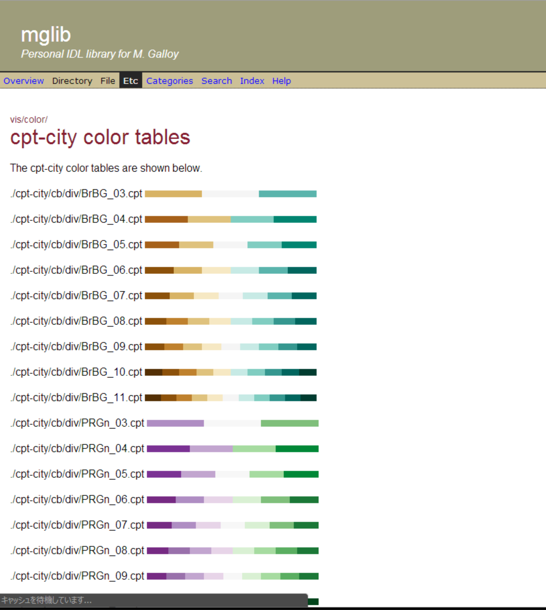

【cpt-city】メニューを選択すると以下のようなダイアログが表示されます。各カラーテーブルはカテゴリに分けられており、左側のツリーからカテゴリを選択することができます。

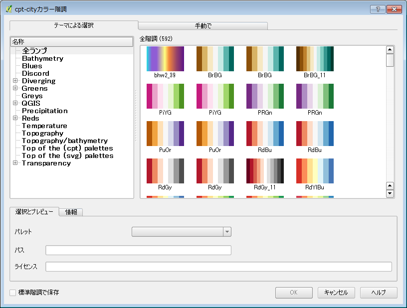

### ラベル

ラベル機能は、ベクタレイヤの各要素が持つ属性値のテキストを要素付近に描画するものです。ラベルを設定するには、レイヤプロパティ画面の左側のペインから「ラベル」を選択します。

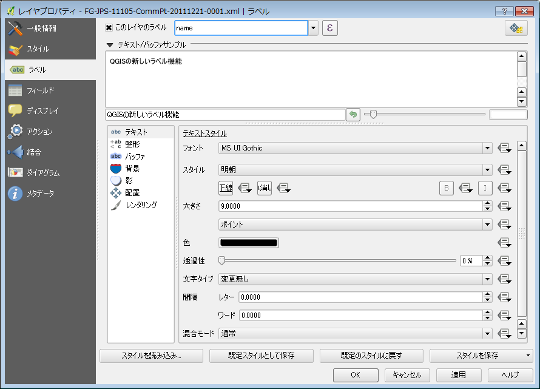

上の図はラベルを有効にした状態の画面です。ラベルを有効にするには”このレイヤのラベル”にチェックを入れ、その右側にあるドロップダウンリストから表示したいラベルの属性を選択するか、さらにその右側にある『ε』ボタンを押してフィールド演算結果を指定します。

ラベルの設定項目はラベルプロパティ画面の左下にあります。それぞれの設定項目は以下の通りです。

 - テキスト

ラベルのフォント、大きさ、色などを指定します。

 - 整形

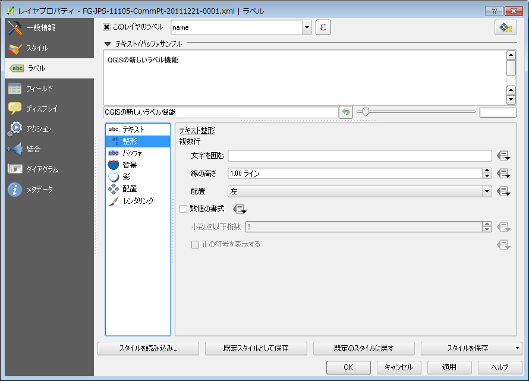

複数行の設定や、その際の１行の高さを指定します。
"文字を囲む"の項目には折り返しに使用する文字を指定します。たとえば、「fgoid:10-00200-11-65361-1463083」というラベルに対して折り返し文字を"-"と指定すると、

	fgoid:10
	00200
	11
	65361
	1463083

というラベルが生成されます。

 - バッファ

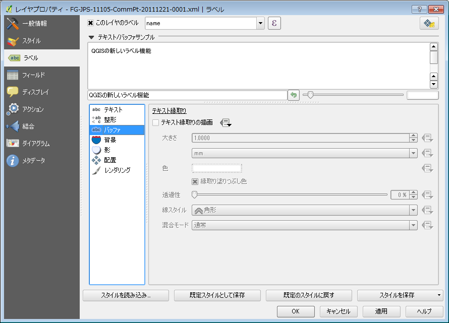

ラベルテキストの縁取りを設定します。有効にするには"テキスト縁取りの描画"にチェックを入れます。縁取りの大きさは画面上のミリ単位もしくは地図上の単位を入力します。

 - 背景

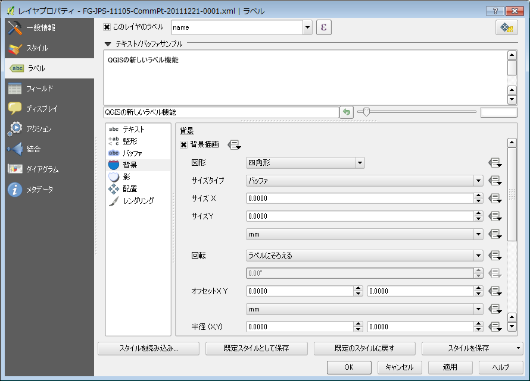

ラベルの範囲の背景を設定します。背景色、枠線、ラベルとのマージンなどを指定します。

 - 影

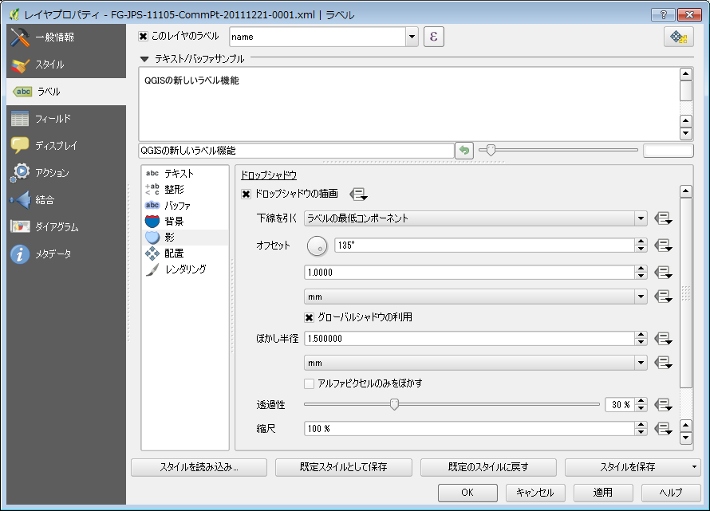

ラベルのドロップシャドウの色、ぼかし具合、方向、色などを設定します。

 - 配置

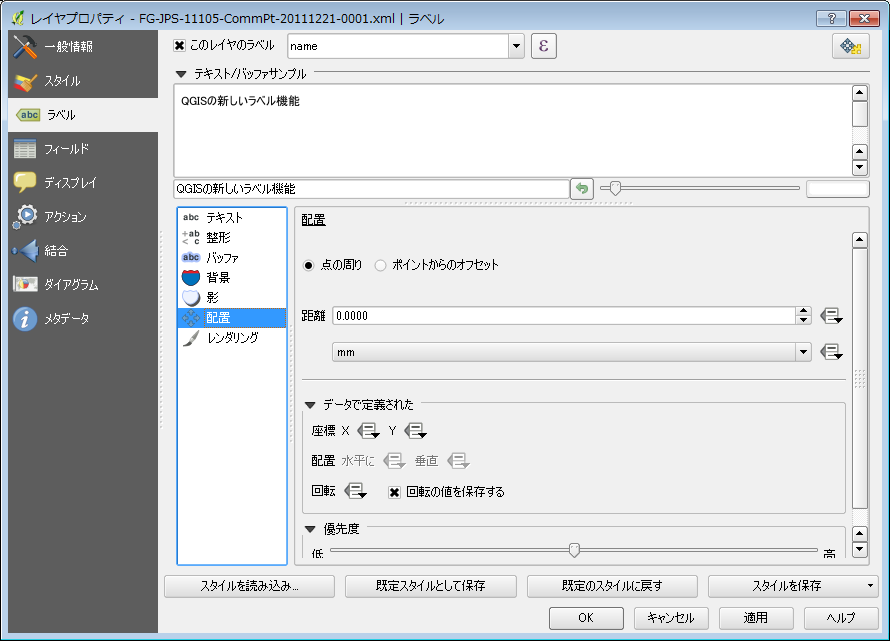

要素に対するラベルの位置を指定します。"点の周り"を選択した場合は点の右上にラベルが配置されます。この場合要素からの横方向距離のみが指定可能です。"ポイントからのオフセット"を選択すると要素から見てどの位置にラベルを配置するかを指定することができます。この場合は要素からの横方向、縦方向の距離をそれぞれ指定することができます。

"データで定義された"の各項目は要素のフィールド値をラベルの位置に適用したい場合に指定します。

 - レンダリング

上記以外のラベルの描画に関するプロパティを設定します。〈スケール依存可視設定〉とはキャンバスの表示縮尺によってラベルを描画するかどうかの設定です。〈このレイヤの全ラベルを表示〉にチェックを入れると、重なって表示されるラベルも全て描画します。チェックがない状態では、ラベルが重なる場合にはラベルが描画されない要素があります。
”地物オプション”は、たとえば行政界における飛び地のように要素が複数の図形に分かれている場合のラベル描画を指定します。

### ダイアグラム

ダイアグラム機能は、ベクタレイヤの各要素が持つ属性値のダイアグラムを描画するものです。ダイアグラムを表示するには、レイヤプロパティ画面の左側のペインから［ダイアグラム］を選択します。図はパイチャートの設定画面です。

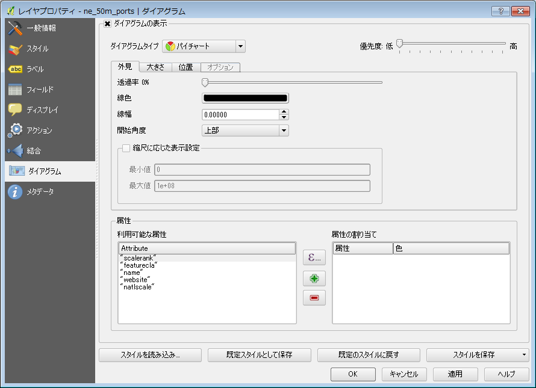

ダイアグラムを表示するには、まず使用する属性値を１つ以上指定する必要があります。ダイアグラムプロパティ画面内の"属性"パネルの左側のリストにはレイヤが持つフィールドが列挙されます。この中からダイアグラムに使用するものを選択して『+』ボタンで右側のリストに追加します。追加されたフィールドの右側にある色をダブルクリックするとカラーピッカーが表示され、色を変更することができます。

表示するダイアグラムはパイチャート、テキストチャート、ヒストグラムの３種類があります。設定タブではダイアグラムの表示に関する各種設定を行います。

［外見］タブは枠線や透過率などダイアグラムの表示に関する設定を行います。

［大きさ］タブではダイアグラムの大きさを設定します。

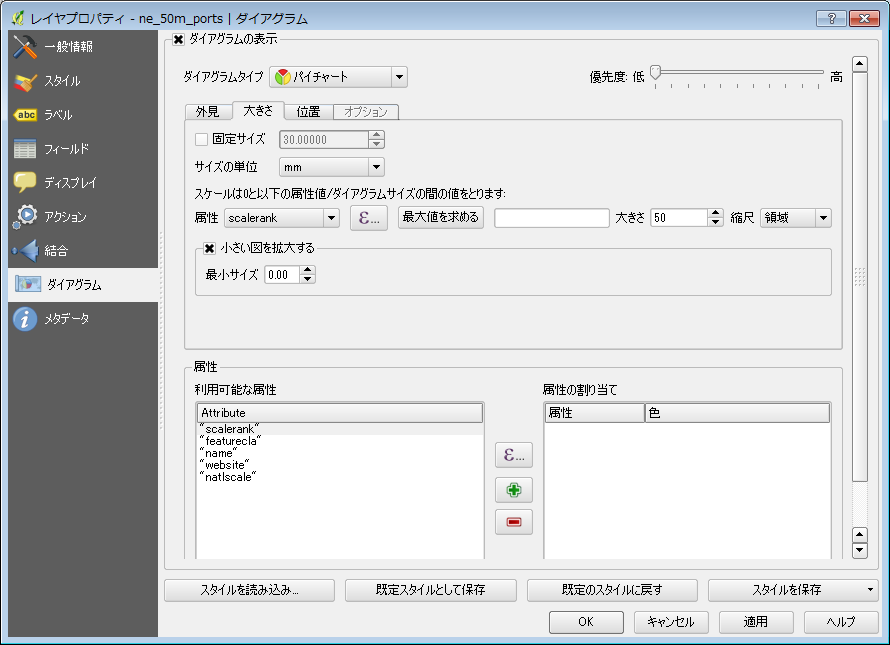

〈固定サイズ〉にチェックを入れると、すべてのダイアグラムを同じ大きさで描画します。チェックを外した場合は属性値に応じてダイアグラムの大きさが変化します。ダイアグラムの大きさに使用するフィールドは〔属性〕のドロップダウンリストから選択します。

［位置］タブはダイアグラムの表示位置に関する設定を行います。

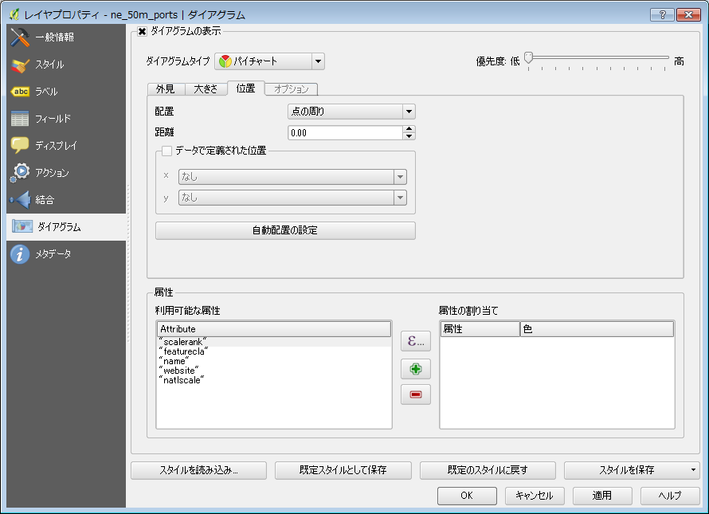

配置は点の周り、または点の上を指定することができます。

オプションタブはテキストチャートかヒストグラムの場合に有効になります。

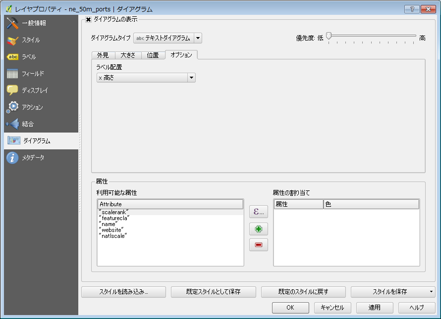

テキストチャートの場合はラベルの位置を、ヒストグラムの場合はバーの向きを指定することができます。

### スタイルの読み込み／保存

レイヤスタイルを保存しておくことで、次回レイヤを読み込んだ時に再度設定を適用することができます。特に複雑なスタイル設定を行った時に便利です。

スタイルの保存は、プロパティダイアログの右下にある『スタイルを保存』ボタンを押し、表示されるメニューからフォーマットを選択します。

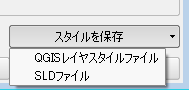

フォーマットはQGISレイヤスタイルファイル（.qml）か、OGC Styled Layer Descriptor（.sld）の２種類を選択することができます。

スタイルを読み込むには、左下にある『スタイルを読み込み』ボタンを押して、.qmlまたは.sldファイルを読み込みます。

